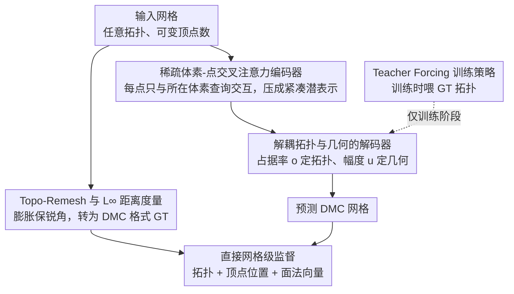

# TopoMesh: High-Fidelity Mesh Autoencoding via Topological Unification

**会议**: CVPR 2026  
**arXiv**: [2603.24278](https://arxiv.org/abs/2603.24278)  
**代码**: [项目页面](https://logan0601.github.io/projects/topomesh/index.html)  
**领域**: 3D视觉 / 3D生成  
**关键词**: 3D VAE, 网格自编码, 拓扑统一, Dual Marching Cubes, 锐利特征保持

## 一句话总结

提出 TopoMesh，通过将GT网格和预测网格统一到 Dual Marching Cubes (DMC) 拓扑框架下，首次实现了顶点和面片级别的显式对应，从而支持直接网格级别监督（拓扑、顶点位置、面法向量），F1-Sharp 指标比现有SOTA提升 5.9-7.1%，尤其在锐利特征保持上优势显著。

## 研究背景与动机

1. **领域现状**：3D生成的主流范式是 VAE-Diffusion 流水线，其中 VAE 的重建能力是生成质量的硬上界。现有3D VAE将任意拓扑的网格编码到规则潜表示中再解码重建。

2. **现有痛点**：核心瓶颈是**表示不匹配**——GT 网格具有任意、可变拓扑（不规则连接、不同顶点数），而 VAE 通常预测固定结构（如规则网格上的 SDF 或渲染图像），两者无法建立显式的网格级对应关系。这导致两类间接监督的困境：
    - **SDF 监督**（如 3DShape2VecSet、TripoSG、Direct3D-S2）：通过 Marching Cubes 提取网格，但 MC 约束顶点在网格边上做线性插值，天然无法表示锐利边和角
    - **渲染监督**（如 Trellis、SparseFlex）：通过 FlexiCubes 解码更具表达力，但监督模糊——有限分辨率、遮挡和稀疏视角导致细节梯度丢失

3. **核心矛盾**：要实现高保真重建（尤其是锐利特征），需要在预测网格和GT网格之间建立精确的顶点/面片对应，但两者拓扑结构不同使这变得不可能。

4. **本文目标** 设计一个VAE，既有表达锐利特征的能力，又有建立精确对应以实现直接无歧义网格级监督的结构对齐。

5. **切入角度**：将两端（GT和预测）都统一到同一个 DMC 拓扑框架下——GT 通过 remeshing 转为 DMC 格式，解码器直接输出 DMC 格式网格。

6. **核心 idea**：通过拓扑统一让预测和GT网格共享相同的 DMC 结构，首次实现顶点/面片级别的直接监督。

## 方法详解

### 整体框架

TopoMesh 包含两个核心模块：**Topo-Remesh**（将任意输入网格转为 DMC 兼容表示，保持锐利特征）和 **Topo-VAE**（稀疏体素编码器 + 解耦 FlexiCubes 解码器，在统一 DMC 格式下重建网格）。流程为：输入网格的顶点和法向量经稀疏体素-点交叉注意力编码为紧凑潜表示，然后解码器输出同样 DMC 格式的网格，利用拓扑统一建立的对应关系，直接在拓扑、顶点位置和面法向量上施加监督。

### 关键设计

**1. 稀疏体素-点交叉注意力编码器：把百万级点云压成可计算的稀疏注意力**

输入网格采样出的点动辄上百万，对它们做全局注意力在显存上根本不现实。作者抓住一个简单事实：每个点只落在一个体素里，于是没必要让它和所有点交互——把全注意力换成稀疏的局部注意力，每个点只和自己所在体素的查询打分。这一步把注意力图从 $O(N \times P)$ 直接压到 $O(P)$，对应显存从 74GB 降到 3.8MB。更进一步，把每个体素内的点坐标归一化到体素局部坐标系后，所有体素就能共享同一个可学习查询 token，于是每个体素的聚合写成

$$O_i = \sum_{j=1}^{n_i} \text{Softmax}_i\!\left(\frac{Q K_j^\top}{\sqrt{d}}\right) \cdot V_j$$

其中 $j$ 只遍历体素 $i$ 内的 $n_i$ 个点。共享查询既省参数，又让编码器对体素分辨率不敏感，从而天然支持后面 $32^3 \to 64^3 \to 128^3$ 的渐进式训练。

**2. 解耦拓扑与几何的解码器：拆开 SDF 的符号和幅度，停止拓扑和几何互相拆台**

标准 FlexiCubes 用一个 SDF 值 $s$ 同时承担两件事——它的符号决定面片连接（拓扑），它的幅度决定顶点落点（几何）。问题是这两件事在训练里会打架：拓扑一旦翻转，几何损失会突然被激活成一个大值，回传的梯度又把拓扑推回错误状态。作者的解法是把 $s$ 拆成占据率 $o$（只管符号、只管拓扑）和幅度 $u$（只管几何），并据此把解码器参数分成拓扑组 $\text{Topo}=\{o, \gamma\}$ 和几何组 $\text{Geom}=\{u, \alpha, \beta, \delta\}$。这样面片只由拓扑参数独立决定

$$F_o = \text{DMC}(o), \qquad V_o = \text{FlexiCubes}(o \times u, \alpha, \beta, \delta, \gamma)$$

面片单独受拓扑监督、顶点再受全部参数细化，两路梯度互不污染，恶性循环被从源头切断。

**3. Topo-Remesh 与 $L_\infty$ 距离度量：用平面距离取代点距离，膨胀时不再磨圆尖角**

要让 GT 网格也变成 DMC 格式，需要先对表面做一次膨胀（offset）。常规做法用 $L_2$ 距离，但 $L_2$ 是点对点度量，在尖角处会把角磨成圆弧，后续投影、渲染优化还容易引入自相交和噪声。作者改用 $L_\infty$ 距离

$$D_\infty(P,Q) = \max_{T_i \in \mathcal{T}(Q)} d(P, \Pi_i)$$

即点 $P$ 到最近表面点 $Q$ 的所有邻接三角面所在平面 $\Pi_i$ 的距离取最大值。直觉上，膨胀沿各邻接平面等距偏移、形成一个多面体包络，膨胀后的点正落在包络边界上，角度被原样保留。这从数学上保证了锐角不退化，省掉了后处理，而且整条 remesh 流程全程跑在 GPU 上，$1024^3$ 分辨率下也只要约 15 秒。

**4. Teacher Forcing 训练策略：喂 GT 拓扑，让几何从第一步就在正确结构上学**

第 2 个设计在结构上解了耦，但训练初期还有一道坎：解码器自己预测的拓扑往往是错的，几何参数若建立在错拓扑上学习，梯度会反复把拓扑翻回去。作者借鉴序列模型的 teacher forcing——训练时直接把 GT 拓扑 $o_{gt}$ 喂给解码器（而不是用它自己预测的拓扑），几何参数从第一次迭代起就在正确拓扑配置下接收稳定梯度；推理时再让解码器独立预测拓扑和几何两者。配套还有两个稳定手段：GT 引导的体素剪枝（避免按早期错误预测剪枝而剪出孔洞），以及前面提到的 $32^3 \to 64^3 \to 128^3$ 渐进分辨率训练。训练和推理之间确实存在一道 gap，但实验显示它对最终重建质量的影响可忽略。

### 损失函数 / 训练策略

总损失包含：拓扑损失（BCE on 占据率）、顶点损失（L1 on 顶点位置）、法向量损失（L1 on 面法向量，DMC 的四边形由 FlexiCubes $\gamma$ 参数三角化，训练时四分三角，推理时二分三角，GT三角形复制监督）、FlexiCubes 正则化、一致性损失、体素剪枝损失和 KL 散度损失。训练使用 AdamW，lr=0.0001，320K 数据集，batch=64，分辨率渐进 $32^3$→$64^3$→$128^3$ 共 700K 步。

## 实验关键数据

### Remesh 质量

| 方法 | 设备 | Thingi10K CD↓ | Thingi10K ANC↑ | Objaverse ANC↑ | 时间↓ |
|------|------|--------------|----------------|----------------|-------|
| ManifoldPlus | CPU | **1.347** | 0.981 | 0.780 | 79.4s |
| Dora | GPU | 1.492 | 0.970 | 0.961 | 116.3s |
| **TopoMesh** | **GPU** | 1.479 | **0.984** | **0.964** | **18.5s** |

Topo-Remesh 在保持最高法向量一致性 (ANC) 的同时速度比其他方法快 4-9 倍。

### VAE 自编码重建

| 方法 | #Latent | Topo-Bench F1-S↑ | Dora-Bench F1-S↑ | Dora-Bench CD↓ |
|------|---------|------------------|------------------|----------------|
| TripoSG | 4096 | 0.715 | 0.717 | 1.697 |
| Dora | 4096 | 0.754 | 0.768 | 1.814 |
| SparseFlex | 244691 | 0.873 | 0.844 | 1.625 |
| **TopoMesh** | **56006** | **0.932** | **0.915** | **1.126** |

F1-Sharp（锐利特征保持指标）：在 Topo-Bench 上比 SparseFlex 提升 5.9%（0.873→0.932），Dora-Bench 上提升 7.1%（0.844→0.915），且仅用其 1/4 的 latent token 数量。

### 消融实验

| 配置 | CD↓ | F1↑ | F1-S↑ | ANC↑ |
|------|-----|-----|-------|------|
| 渲染监督（替代网格级监督） | 1.731 | 0.776 | 0.711 | 0.932 |
| **网格级监督** | **0.150** | **0.975** | **0.991** | **0.999** |
| 32分辨率 | 1.812 | 0.933 | 0.790 | 0.968 |
| 128分辨率 | 1.126 | 0.973 | 0.915 | 0.995 |

网格级监督 vs 渲染监督：单形体过拟合实验中，网格级监督的 CD 是渲染监督的 1/11.5，F1-S 从 0.711 飙升到 0.991，证明直接监督的绝对优势。

### 3D 生成

| 方法 | Toys4K FID↓ | Toys4K KID (×10³)↓ |
|------|-------------|---------------------|
| Hunyuan3D-2.1 | 59.43 | 5.97 |
| Trellis | 59.61 | 6.03 |
| Direct3D-S2 | 45.33 | 5.47 |
| **TopoMesh** | **42.48** | **4.63** |

### 关键发现

- 拓扑统一是核心突破：DMC 框架让 GT 和预测共享完全相同的拓扑结构，首次实现了逐顶点、逐面片的精确对应
- $L_\infty$ 距离度量对锐利特征保持至关重要：在二面角分布可视化中，$L_\infty$ 完整保留了原始网格的锐角分布，而 $L_2$ 将锐角坍缩为近平面角度
- Teacher Forcing 有效解决了拓扑-几何训练的"拉锯战"：尽管训练和推理间存在差距，但对重建质量影响可忽略
- Topo-VAE 仅用 56K latent token（SparseFlex 的 1/4）即达到更优的重建质量，归因于直接监督的高效梯度传播

## 亮点与洞察

- **"拓扑统一" 范式的根本性创新**：不是在现有表示不匹配的框架下寻找更好的间接监督，而是从根本上消除不匹配——让两端说"同一种语言"。这个抽象层面的思路可迁移到任何需要预测结构化输出但预测格式与 GT 格式不匹配的问题中
- **$L_\infty$ 距离的角度保持性质**：用 max-over-incident-planes 替代点对点距离，数学上优雅地解决了膨胀时角度退化的问题，且对拓扑缺陷和不正确法向量天然鲁棒
- **解耦 + Teacher Forcing 的组合**：将 FlexiCubes 的耦合参数拆分为拓扑和几何两组，再用 Teacher Forcing 打破条件依赖——两个独立的技巧组合产生了协同效果
- **DMC 格式压缩方案**：仅用 3×10 bit 坐标 + 8 bit 占据 + 3×10 bit 偏移 + 3 bit 三角化决策即可存储一个体素的完整网格信息，$1024^3$ 分辨率下平均仅 28.7MB/网格，比 Draco 编解码快两个数量级

## 局限与展望

- 高分辨率上采样时生成数百万体素，计算资源和时间开销显著
- Remeshing 算法受限于基础分辨率，小于体素尺寸的极细微细节无法捕捉
- 渐进式训练（$32^3 \to 128^3$）总训练步数 700K，训练效率有改进空间
- Teacher Forcing 引入训练-推理 gap，虽然实验中影响可忽略但在更极端场景下可能暴露
- 可探索自适应分辨率策略——在锐利特征密集区域使用更高分辨率

## 相关工作与启发

- **vs SparseFlex**: SparseFlex 使用 FlexiCubes + 渲染监督，F1-Sharp 仅 0.873；TopoMesh 同样基于 FlexiCubes 但改用直接网格级监督，F1-Sharp 达 0.932，且 latent token 数量仅为其 1/4
- **vs Trellis**: Trellis 也是稀疏体素 VAE 但限于 $256^3$ 分辨率和渲染监督，重建质量（F1 0.583）远低于 TopoMesh（0.917）
- **vs TripoSG/Dora**: VecSet-based VAE 用全局向量集表示形状，难以建模细粒度几何。TopoMesh 的稀疏体素设计天然适合高分辨率局部细节
- **启发**：3D 生成中"预测格式与GT格式统一"的思想可推广到点云、隐式场等其他3D表示

## 评分

- 新颖性: ⭐⭐⭐⭐⭐ 拓扑统一范式从根本上解决了3D VAE的核心瓶颈，$L_\infty$ 距离和解耦解码器均有原创性
- 实验充分度: ⭐⭐⭐⭐⭐ Remesh+AutoEncoding+Generation+消融全面覆盖，引入F1-Sharp和Topo-Bench新指标/基准
- 写作质量: ⭐⭐⭐⭐⭐ 问题定义精准（表示不匹配），方法推导逻辑清晰，从数学原理到工程实现完整
- 价值: ⭐⭐⭐⭐⭐ 作为3D VAE的基础设施级改进，直接提升下游3D生成质量的上界，实用价值极高

<!-- RELATED:START -->

## 相关论文

- [\[CVPR 2026\] CraftMesh: High-Fidelity Generative Mesh Manipulation via Poisson Seamless Fusion](craftmesh_high-fidelity_generative_mesh_manipulation_via_poisson_seamless_fusion.md)
- [\[CVPR 2026\] HyperGaussians: High-Dimensional Gaussian Splatting for High-Fidelity Animatable Face Avatars](hypergaussians_high-dimensional_gaussian_splatting_for_high-fidelity_animatable_.md)
- [\[CVPR 2026\] High-Fidelity Mobile Avatars with Pruned Local Blendshapes](high-fidelity_mobile_avatars_with_pruned_local_blendshapes.md)
- [\[CVPR 2026\] Depth Peeling for High-Fidelity Gaussian-Enhanced Surfel Rendering](depth_peeling_for_high-fidelity_gaussian-enhanced_surfel_rendering.md)
- [\[CVPR 2026\] CustomTex: High-fidelity Indoor Scene Texturing via Multi-Reference Customization](customtex_high-fidelity_indoor_scene_texturing_via_multi-reference_customization.md)

<!-- RELATED:END -->
