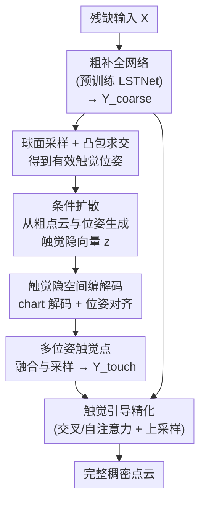

# TouchDream: 3D Object Completion through Imagined Touch

**会议**: CVPR 2026  
**论文**: [CVF Open Access](https://openaccess.thecvf.com/content/CVPR2026/html/Wang_TouchDream_3D_Object_Completion_through_Imagined_Touch_CVPR_2026_paper.html)  
**领域**: 3D视觉  
**关键词**: 点云补全, 触觉生成, 扩散模型, 局部几何, 跨模态引导

## 一句话总结
TouchDream 用一个条件扩散模型在物体表面"想象"出触觉信号——从粗点云和采样位姿生成紧凑的触觉隐向量，解码成局部几何并融回点云，从而在不进行任何物理触摸的前提下，为点云补全提供细粒度的局部几何引导，在 PCN / ShapeNet55-34 / KITTI 上均取得 SOTA。

## 研究背景与动机

**领域现状**：点云补全（从残缺扫描恢复完整稠密几何）有两大主流范式。一是 coarse-to-fine：先生成粗形状，再用多粒度特征或几何对称性精化缺失区域（PCN、SeedFormer、AnchorFormer、CRA-PCN、SymmCompletion 等）；二是生成式范式：用扩散模型直接概率去噪出完整点云，或产生辅助线索促进缺失区域重建（PVD、NSDS、3DQD、PCDreamer 等）。

**现有痛点**：coarse-to-fine 在输入缺少关键结构时，精化阶段只能"无约束地局部瞎猜"，补出来的细节没有几何依据；扩散范式则因缺乏补充信息，对严重残缺输入重建质量差、且容易引入几何不一致。两条路的共同短板是——缺一个能"约束局部几何"的可靠外部信号。

**核心矛盾**：补全是 ill-posed 的，全局结构可以靠先验外推，但缺失区域的局部细节没有额外信息就无从约束。视觉类辅助信号（多视图深度/RGB）擅长全局结构，却不直接对应到精确的局部 3D 接触几何；而真正擅长局部几何的触觉信号，传统上必须靠真实传感器多次物理触摸采集——在真实场景里反复接触有损坏物体、安全隐患，还往往要把物体固定住才能采。

**本文目标**：拿到触觉那种"高保真局部 3D 几何 + 可直接与点云融合"的好处，同时摆脱物理触摸的代价。

**切入角度**：作者观察到，触觉相对视觉有两个独到优势——(1) 触觉提供高保真局部 3D 形状（接触点位置、精细表面细节），正是重建局部几何最缺的东西；(2) 触觉解码出的局部点云可直接与粗点云在 3D 空间融合，比视觉线索更直接有效。既然触觉这么好，能不能不真的去摸，而是"想象"出来？

**核心 idea**：把"感知触觉"重新表述成一个**可学习的生成建模任务**——用扩散模型在隐空间里"做梦"般地生成物体表面的触觉信号，再解码成局部几何去精化粗点云。一句话：用扩散生成的"想象触觉"代替物理触摸，给补全网络注入细粒度局部约束。

## 方法详解

### 整体框架

TouchDream 的整条管线是"先粗补全 → 想象触觉 → 触觉引导精化"。推理时，残缺输入 $X$ 先经一个预训练的粗补全网络（取自 SymmCompletion 的 LSTNet）得到粗点云 $Y_{coarse}$；然后在物体表面采样一批触觉位姿，对每个位姿用条件扩散模型生成一个触觉隐向量，再用 chart 解码器把它解码成局部几何并变换到世界坐标系；所有位姿生成的局部点合并、采样成 $Y_{touch}$；最后用 $Y_{touch}$ 作为引导去精化 $Y_{coarse}$，输出完整稠密点云。

整个触觉生成模型由三块组成：从粗点云采样触觉位姿（§3.1）、触觉编码器配 chart 预测器把触觉信号编码成隐向量再解码成局部点（§3.1）、以及一个条件扩散模型从位姿和粗点特征生成触觉隐向量（§3.2）；生成的触觉点最终用于引导粗点补全（§3.3）。

### 关键设计

**1. 球面采样 + 凸包求交：在没真摸的情况下确定"该往哪摸"**

要"想象触觉"，先得确定触觉发生在物体哪个位姿。作者沿用 [23,28] 的交互动作空间定义：在以物体质心为中心的球面上均匀采样 50 个离散点，每个点向物体发出一条 approach ray，射线与物体凸包的交点即为接触点，由此确定该位姿的旋转和平移。关键的工程细节是——并非所有采样位姿都有效：approach ray 若没和凸包相交就不产生可用触觉信号，训练和推理都只用有效位姿。这一步把"无穷的 3D 接触空间"离散化成一组可枚举、可批处理的候选触觉位姿，是后续生成的前提。

**2. 触觉隐空间编解码 + 位姿对齐：把触觉压成 1D 隐向量，并修正"粗位姿 vs 真表面"的错位**

直接生成 3D 触觉或触觉图像都很难，因为触觉分布与局部曲率强相关、不同位姿点坐标差异极大。作者绕开难点，把触觉映射到 1D 隐向量 $z$：用触觉编码器从触觉图像提取 $z$，再用一个 local chart 预测网络解码——chart 由网格曲面元构成，从一个 25 顶点/面的基础三角网模板出发，网络预测每个顶点的形变 3D 坐标（保持面连接固定），相当于把局部表面参数化成可形变的"小贴片"，最后用位姿的旋转平移变换到世界坐标。

这里有个训练范式上的矛盾必须解决：模型用的位姿来自**粗点云**，而监督用的触觉信号来自**真值表面**，两者存在位姿偏差。作者为此引入一个额外的位姿对齐网络：从粗点和采样位姿提取特征，与编码隐向量 $z$ 拼接后过 MLP，预测一组旋转/平移变换参数，作用到预测的 chart 坐标上，使其对齐真值表面。训练时对每个有效位姿渲染触觉图像、生成局部点云并变换到世界坐标，再用 Chamfer Distance 与真值表面点比对，同时监督对齐网络和触觉编解码器。这个对齐网络是"从粗点采位姿、却要逼近真表面"得以成立的关键补偿。

**3. 条件扩散生成触觉隐向量：把"感知触觉"变成可采样的生成分布**

有了隐向量空间，作者用扩散模型 $\epsilon$ 在该空间上建模触觉隐向量的分布。训练时对隐向量 $z_0$ 在随机时间步加高斯噪声得到 $z_t$，让模型在粗点云和位姿条件下重建 $z_0$，损失为

$$L_{diff} = \big\| \epsilon\big(z_t,\ \tau(t)\,\big|\,\omega_Y(Y_{coarse}),\ \omega_p(p)\big) - z_0 \big\|_2$$

其中 $\tau(t)$ 是时间步嵌入。条件由两个特征提取器给出：点嵌入模块 $\omega_Y$ 先用 FPS+KNN 把粗点云切成局部 patch，再用 MLP+max pooling 聚合成紧凑特征；MLP $\omega_p$ 编码每个有效位姿 $p$ 的特征。扩散网络基于 DiffusionSDF 框架，采用 DALLE-2 架构并在每个 block 加入交叉注意力层注入条件。推理时从高斯噪声 $z_T \sim N(0,1)$ 迭代去噪，每步去噪函数

$$g(x_t, t, \cdot) = \epsilon\big(x_t, \tau(t)\,|\,\omega_Y(Y_{coarse}), \omega_p(p)\big) + \sigma_t \xi,\quad \xi \sim N(0,1)$$

这一步是"想象"二字的落点——它不再去物理采集，而是从学到的触觉分布里采样出与当前粗形状、当前位姿一致的触觉隐向量。在隐空间而非 3D/图像空间生成，正好避开了直接 3D 触觉生成的高维难题。

**4. 触觉引导精化：用想象触觉作为局部细节线索去修粗点云**

最后把所有位姿生成的局部 chart 合并、随机采样成一团散布的触觉点 $Y_{touch}$，用来精化 $Y_{coarse}$。精化网络结构沿用 SymmCompletion，但把对称性引导换成触觉引导：先用多个 MLP 和 point transformer 从触觉点云提取特征，再用交叉注意力 + 自注意力把触觉线索融进精化过程——交叉注意力让粗点的几何特征去"查询"想象触觉特征，自注意力做内部聚合（见论文 Fig.3 的特征融合）。融合后的表示送入由自注意力层和 point-shuffle 模块组成的上采样网络，预测每点偏移生成更稠密细致的点云。补全损失是初始与每个更细输出之间的总 Chamfer Distance：

$$L = \sum_{i=1}^{n} L_{CD}(Y_{gt},\ Y_i)$$

$n$ 是 Touch Guidance Block 的数量。之所以有效，是因为触觉点带的是"接触点位置 + 精细表面细节"这类真正的局部几何，正好补上 coarse-to-fine 在缺关键结构时"无约束瞎猜"的那块空缺。

### 损失函数 / 训练策略
三阶段分别训练：触觉隐空间训练 500 epoch（Adam，lr 1e-5，每物体最多用 7 对触觉图像/点云）；扩散模型训练 500 epoch（Adam，lr 2e-4）；触觉引导精化 420 epoch（AdamW，lr 2e-4）。全部在单张 RTX 4090、batch 16 上完成。融合采样时，对 50 个预定义位置中产生有效结果的位姿聚合后随机采 256 个触觉点；触觉数据进扩散模型前缩小 3.1 倍、生成后再放回原尺度。

## 实验关键数据

### 主实验

PCN 数据集（L1 CD ×10³，越低越好；F1@1% 越高越好）：

| 方法 | CD-Avg ↓ | F1 ↑ | Plane | Chair | Lamp |
|------|---------|------|-------|-------|------|
| SeedFormer | 6.74 | 0.82 | 3.85 | 7.06 | 5.21 |
| AnchorFormer | 6.59 | 0.83 | 3.70 | 7.05 | 5.21 |
| CRA-PCN | 6.39 | - | 3.59 | 6.70 | 5.06 |
| PCDreamer | 6.49 | 0.86 | 3.52 | 6.71 | 5.64 |
| SymmCompletion | 6.28 | 0.85 | 3.53 | 6.52 | 5.06 |
| **TouchDream（本文）** | **6.05** | **0.87** | **3.39** | **6.34** | **4.91** |

ShapeNet55/34（L2 CD ×10³，越低越好）：

| 方法 | 55 类 Avg ↓ | 34 seen ↓ | 21 unseen ↓ |
|------|------------|-----------|-------------|
| AnchorFormer | 0.58 | 0.70 | 1.19 |
| CRA-PCN | 0.66 | 0.76 | 1.24 |
| PCDreamer | 0.98 | 0.76 | 1.09 |
| SymmCompletion | 0.50 | 0.60 | 0.97 |
| **TouchDream** | **0.42** | **0.59** | **0.66** |

KITTI 真实场景泛化（ShapeNet Car 训练，sim-to-real）：FD 1.43（本文）vs 2.54（SymmCompletion）；MMD 0.71（本文）vs 1.72（SymmCompletion），两项指标均大幅领先。

### 消融实验

| 配置 | CD-Avg ↓ | 说明 |
|------|---------|------|
| 骨架点引导 S-GT | 6.04 | 真值骨架点作引导 |
| 生成触觉 T-GEN（本文） | 6.05 | 想象触觉引导 |
| 真值触觉 T-GT | 5.93 | 模拟器真值触觉（上界） |
| 仅对称引导（SymmCompletion） | 6.28 | 只用对称先验 |
| 仅触觉引导 | 6.05 | 只用想象触觉 |
| 对称 + 触觉组合 | 6.02 | 两者结合 |

### 关键发现
- **想象触觉≈真值触觉**：T-GEN（6.05）非常接近 T-GT（5.93），证明扩散"做梦"出来的触觉确实逼近模拟器采的真触觉；而真值触觉（5.93）优于真值骨架点（6.04），说明触觉信息比骨架结构对补全更有用。
- **触觉引导单独就强过对称引导**：仅触觉（6.05）显著优于仅对称（6.28），且接近"对称+触觉"组合（6.02）。作者解释，触觉能在高度残缺输入下稳健恢复细节、避免对称引导在缺结构时产生的糟糕局部结果。
- **unseen 类别提升最猛**：ShapeNet34 的 21 个未见类别从 0.97 砍到 0.66，泛化提升远大于 seen 类（0.60→0.59），说明想象触觉学到的是更基础的局部形状先验，而非记住类别模板——这也解释了 KITTI 真实数据上的领先。
- **对位姿误差较敏感、可用数据增强缓解**：触觉位姿估计有噪声时 CD 会上升；训练时对位姿加均匀随机噪声做数据增强（DA）后，在较大噪声（R/T=0.02/0.01）下从 6.183 降到 6.087，明显更鲁棒。

## 亮点与洞察
- **把"感知"重写成"生成"是最漂亮的一招**：传统触觉重建必须真去摸（有损坏/安全风险、要固定物体），本文把触觉采集 reframe 成一个可学习的生成建模任务，用扩散在隐空间"做梦"，彻底绕开物理交互——这个 reframe 思路可迁移到任何"采集代价高但信号有价值"的模态（如想象多视图、想象深度）。
- **在 1D 隐空间生成而非 3D/图像空间**：触觉分布与曲率强耦合、坐标差异大，直接生 3D 很难；压成 1D 隐向量 + chart 解码既降维又保留局部几何，是处理"高度异质局部信号"的实用配方。
- **位姿对齐网络解决了一个隐蔽的训练错位**：从粗点采位姿、用真表面监督，本会有系统性偏差；用一个轻量网络预测对齐变换把这个 gap 显式补掉，这种"训练分布与监督分布不一致就学一个对齐器"的做法很值得借鉴。
- **触觉点可直接 3D 融合**是它优于视觉辅助线索的根本——视觉线索还要跨模态对齐，触觉解码出来就是 3D 点，融合路径最短。

## 局限与展望
- **强依赖初始粗点云质量**（作者承认）：输入太残缺导致粗预测偏离真值时，后续想象的触觉也会偏，整条链一起垮——本质上触觉是"精化"而非"无中生有"。
- **训练需要物体 mesh 渲染触觉图像作监督**：限制了在没有 mesh、只有真实扫描的数据上的可扩展性。
- **计算开销大**（作者承认）：每个采样位姿都要生成隐向量再解码/变换/采样，PCN 1200 个形状全量评测在单张 4090 上要 6.7 小时——离实时/在线补全很远。
- 自己看：位姿采样是固定的均匀球面采样，没有"主动选最该摸的地方"。作者也把可学习的主动位姿采样（RL 训练）列为未来方向；此外把触觉与视觉生成统一进多模态框架、以及用想象触觉去精化单图预测的 3D Gaussian，都是自然延伸。

## 相关工作与启发
- **vs SymmCompletion**：本文精化网络结构沿用 SymmCompletion，但把它的对称性先验引导换成触觉引导。对称先验在缺结构、不对称物体上会产生糟糕局部猜测，触觉引导则提供真实局部几何，消融里仅触觉（6.05）就胜过仅对称（6.28），且 unseen 泛化大幅领先（0.66 vs 0.97）。
- **vs 物理触觉重建（[5,22,23,28]、Touch-GS、TAPCNet）**：这些方法都要真实视触觉传感器（GelSight、Digit）多次物理接触采集触觉图像，有损坏/安全成本、需固定物体；本文只需一个粗点云就能为采样位姿"想象"触觉隐向量，无需任何物理交互。
- **vs 视觉辅助补全（PCDreamer、SVDFormer、PointSea、ViP、CSDN）**：它们用多视图/单视图视觉线索（扩散生成的多视图图像、深度、RGB）补结构，强在全局、弱在精确局部几何，且需抑制扩散噪声并做跨模态对齐；本文用触觉，局部几何更精确且解码即 3D 点可直接融合。
- **vs 直接扩散补全（PVD、NSDS、3DQD、SDS-Complete）**：它们直接概率去噪整团点云，缺补充信息时对严重残缺输入重建差、易几何不一致；本文用扩散只去生成"触觉线索"，再交给确定性精化网络融合，把生成不确定性约束在局部辅助信号上。

## 评分
- 新颖性: ⭐⭐⭐⭐⭐ "想象触觉"把触觉感知 reframe 成扩散生成任务，是 point cloud completion 里很新颖且自洽的切入。
- 实验充分度: ⭐⭐⭐⭐ PCN/ShapeNet55-34/KITTI 三套 benchmark + T-GEN/T-GT/对称对比/位姿噪声多组消融到位；但提升幅度在 seen 类上偏小，且未与更多最新扩散补全方法在统一设定下细比。
- 写作质量: ⭐⭐⭐⭐ 动机清晰、三阶段方法讲得明白；隐空间/chart/对齐网络若再多给点公式与图会更易复现。
- 价值: ⭐⭐⭐⭐ "用生成代替昂贵感知"的范式有迁移价值，unseen 与真实 KITTI 上的泛化优势实用；但 6.7 小时/1200 形状的开销限制了落地。

<!-- RELATED:START -->

## 相关论文

- [\[CVPR 2026\] The Midas Touch for Metric Depth](the_midas_touch_for_metric_depth.md)
- [\[CVPR 2026\] MAGICIAN: Efficient Long-Term Planning with Imagined Gaussians for Active Mapping](magician_efficient_long-term_planning_with_imagined_gaussians_for_active_mapping.md)
- [\[CVPR 2026\] LaS-Comp: Zero-shot 3D Completion with Latent-Spatial Consistency](las-comp_zero-shot_3d_completion_with_latent-spatial_consistency.md)
- [\[CVPR 2025\] PCDreamer: Point Cloud Completion Through Multi-view Diffusion Priors](../../CVPR2025/3d_vision/pcdreamer_point_cloud_completion_through_multi-view_diffusion_priors.md)
- [\[CVPR 2026\] ComPose: A Unified Completion-Pose Framework for Robust Category-Level Object Pose Estimation](compose_a_unified_completion-pose_framework_for_robust_category-level_object_pos.md)

<!-- RELATED:END -->
