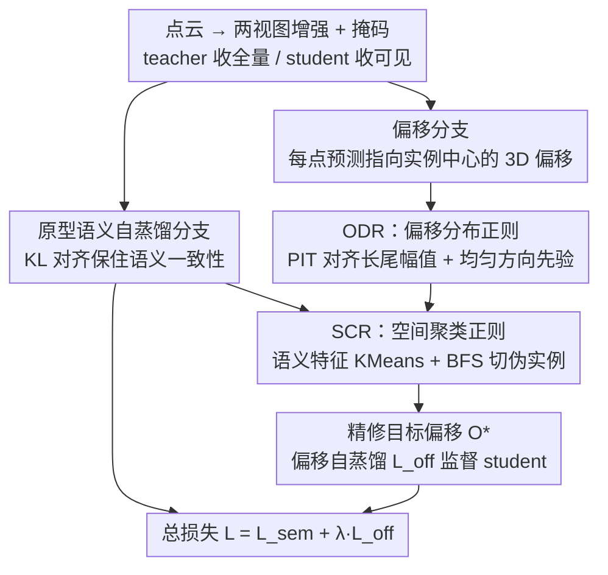

# Towards Foundation Models for 3D Scene Understanding: Instance-Aware Self-Supervised Learning for Point Clouds

**会议**: CVPR 2026  
**论文**: [CVF Open Access](https://openaccess.thecvf.com/content/CVPR2026/html/Yang_Towards_Foundation_Models_for_3D_Scene_Understanding_Instance-Aware_Self-Supervised_Learning_CVPR_2026_paper.html)  
**领域**: 3D视觉  
**关键词**: 点云自监督, 实例感知, 偏移回归, 自蒸馏, 3D基础模型

## 一句话总结
PointINS 给点云自监督预训练加了一条「偏移分支」，让模型在没有标签的情况下学会预测每个点指向其所属实例中心的偏移向量，并用两个互补正则项（对齐全局统计先验的 ODR、强制局部聚拢的 SCR）防止塌缩，从而把过去只擅长语义、不擅长实例的 SSL 表征补成「既懂语义又懂几何」，在 5 个室内外数据集上把室内实例分割平均提了 +3.5% mAP、室外全景分割提了 +4.1% PQ。

## 研究背景与动机

**领域现状**：点云自监督学习（SSL）这几年的主流路线，要么是对比学习（让同一场景不同增强视图的点特征对齐），要么是掩码场景重建（遮住一部分点让模型补全几何）。Sonata、DOS 这类基于 teacher–student 自蒸馏 + 原型聚类的方法，在语义分割 benchmark（尤其是 linear probing 设定）上表现很强。

**现有痛点**：这些方法学到的表征「语义紧凑、几何纠缠」——它们强制同一语义类的点特征互相靠拢，却把同类不同实例之间该有的细粒度几何差异给抹平了。结果是：换到实例分割、全景分割这种需要把同类物体一个个分开的任务上，性能明显掉队；而且往往必须对整个 backbone 做 full finetuning 才能勉强用，linear/decoder probing 下差距更大。

**核心矛盾**：语义不变性（同类要像）和几何敏感性（同类不同实例要能区分）天然对着干。更麻烦的是，社区里有个根深蒂固的担忧——点云 SSL 很容易塌缩到法向量、位姿这种 trivial 的低级几何捷径上，所以大家普遍用强不变性来「躲开」几何信息。这等于把实例感知需要的几何线索一起扔了。

**本文目标**：在不引入任何人工标注、不破坏已有语义能力的前提下，让自监督表征额外学会「实例感知」，即每个点能感知自己在哪个实例里、该往哪个中心靠。

**切入角度**：作者把一个观念掰开——实例感知所需的「几何邻近关系」不是法向量那种低级捷径，而是一种**高级关系属性**，作者称之为「几何推理（geometric reasoning）」。这一点借鉴了有监督实例/全景分割的经典架构：共享 backbone 上并行挂语义分支和偏移分支，语义负责圈定候选区域、偏移负责把同区域内的不同实例在空间上推开，两者互相加强。既然有监督能这么干，自监督为什么不能？

**核心 idea**：把实例感知学习重新表述成一个「带正则的自蒸馏」问题——在原有语义自蒸馏框架上挂一条预测点级偏移的分支，用从真实场景里观察到的两条偏移统计规律当「无标签监督信号」来正则化它，既注入几何推理能力，又防止无监督回归塌缩。

## 方法详解

### 整体框架
PointINS 在一个标准的 teacher–student 自蒸馏骨架上工作。一个点云 $P=\{(x_i,f_i)\}_{i=1}^N$（$x_i$ 是坐标、$f_i$ 是特征）被随机增强成两个视图 $P^{(1)},P^{(2)}$，再随机掩码出一个可见子集 $P_v$ 喂给 student，teacher 则吃完整点云；两者结构相同，teacher 参数由 student 的指数滑动平均（EMA）更新。骨架上挂两条分支：**语义分支**沿用原型聚类自蒸馏（把特征投到一组可学习类别原型上、用 KL 散度对齐 teacher/student 的软分配，并做跨视图蒸馏）保住语义一致性；**偏移分支**是本文新增的核心，给每个点回归一个指向其实例中心的 3D 偏移向量。

关键难点在于：没有标签，偏移分支怎么学才不塌缩？作者的答案是只在 **teacher 侧**对偏移做两道正则——先用 ODR 把预测偏移拉回符合真实场景统计的分布，再用 SCR 借助语义特征聚出的伪实例 mask 把局部偏移聚拢，得到精修后的目标偏移 $O^*$，最后用它去自蒸馏监督 student 的偏移预测。整套流程总损失为 $L = L_{\text{sem}} + \lambda_{\text{off}} L_{\text{off}}$。

### 关键设计

**1. 偏移分支：把「实例感知」转译成无标签可学的点级偏移回归**

痛点是语义分支天生只会让同类点互相靠拢，没有任何机制区分同类的不同实例。作者借鉴有监督实例分割的做法，在共享 backbone 上加一条偏移分支，给每个点预测一个 3D 向量，理想情况下指向它所属实例的几何中心 $\hat c_i = x_i + \tilde O_i$。与学习视图不变嵌入的语义分支不同，偏移本质是**视图相关**的几何量——旋转、翻转、缩放都会改变它，所以作者会记录数据增强施加的几何变换，并把预测偏移逆变换回原始坐标系，保证不同视图下的偏移可比、可蒸馏。把目标选为点级偏移而非更复杂的实例 embedding，是因为它简单、几乎不增加模型容量，能无缝插进现有 SSL 框架。但偏移分支单靠自己回归会塌缩，于是有了下面两道正则。

**2. ODR 偏移分布正则：用真实场景的全局统计先验给无监督偏移「兜底」**

没有 ground-truth，直接回归偏移很容易塌成平凡解（比如所有偏移都缩到 0）。作者的观察是：偏移向量虽然逐点没法监督，但它在整个场景上有两条稳定的统计规律——把偏移 $O\in\mathbb{R}^3$ 拆成「幅值」（到实例中心的距离）和「方向」（指向中心的单位向量）后，**幅值服从一条稳定的长尾分布**（反映场景布局和物体尺度，靠近中心的点天然占多数），**方向近似在单位球面上均匀分布**。ODR 就把这两条当全局先验去约束预测偏移。

实现用了概率积分变换（PIT）这种非参数方法：它在保持样本相对大小顺序不变的前提下，把一批标量映射到目标分布。对预测幅值 $\{M_i\}$，先取升序排名 $\pi(i)=\text{rank}(M_i)$，转成概率水平 $u_i = \frac{\pi(i)-0.5}{N}$，再用目标分布的逆 CDF 得到对齐后的幅值 $\tilde M_i = F^{-1}(u_i)$；方向 $\{D_i\}$ 则对三个坐标轴各自做 PIT 对齐到均匀分布，最后重组出 $\tilde O_i = \tilde M_i\cdot\tilde D_i$。这样做既把偏移拉成几何上合理的形状、又因严格保序而不破坏模型已学到的相对结构，从而在无标签下稳住训练、防塌缩。后续实验还发现这个先验非常鲁棒：哪怕用室内分布去管室外场景、甚至用 HDBSCAN 无监督聚类估出的粗略先验，性能也几乎不掉——说明它只需要「物体典型尺度」这种粗信息，不需要精细标注。

**3. SCR 空间聚类正则：用早期语义特征造伪实例 mask，补上 ODR 缺的局部一致性**

ODR 只管全局分布，管不了局部一致性——它没法保证「同一实例里相邻的点应该把偏移指向同一个中心」，于是偏移可能在局部仍乱成一团。SCR 来补这个洞。作者的关键观察（图 5）是：现代 SSL 框架的语义特征在训练**很早期**就已经相当强了（10% epoch 就能达到最终 linear probing 性能的 85%）。既然语义特征这么早就靠谱，就可以拿它来造「伪实例」当监督。

具体地：先对 teacher 的点特征 $F=\{f_i\}$ 做 K-means（$K=20$）得到 $K$ 个类级 segment $S=\{S_1,\dots,S_K\}$；对每个点算 ODR 精修后的预测中心 $\hat c_i = x_i + \tilde O_i$；在每个 segment $S_k$ 内部，对这些预测中心建局部 k-近邻图，用广度优先搜索（BFS）把它切成多个连通分量 $I_{k,j}$，每个连通分量就是一个伪实例；再用伪实例内点的真实坐标算更新后的中心 $\bar c_{k,j} = \frac{1}{|I_{k,j}|}\sum_{i\in I_{k,j}} x_i$，得到新的目标偏移 $O^*_i = \bar c_{k,j} - x_i$。这条正则强制局部相邻点的偏移收敛到共同中心，把分散的偏移聚成一个个紧致的实例团。两道正则是互补的：SCR 给 ODR 补局部一致性，ODR 又反过来给 SCR 提供稳定的几何锚点（否则 SCR 在乱偏移上切出的伪实例也会乱）——消融里两者单独用都只有小幅提升，合起来才有大跳变。

**4. teacher 侧正则 + 偏移自蒸馏：把精修信号稳稳传给 student**

ODR、SCR 全部作用在 teacher 一侧，得到精修目标 $O^*$ 后再去监督 student 的偏移预测 $o_i$。偏移损失同时约束幅值和方向：

$$L_{\text{offset}} = \frac{1}{N}\sum_{i=1}^{N}\left(\|o_i - O^*_i\|_1 + (1 - \cos(o_i, O^*_i))\right)$$

即 $\ell_1$ 罚幅值偏差 + 余弦罚方向偏差，并和语义分支一样加一道跨视图损失保证两视图偏移一致。训练上偏移损失延后到 warm-up（前 10% epoch）之后才加入、用权重 $\lambda_{\text{off}}=0.25$ 平衡。为什么必须在 teacher 侧正则？作者做了对照（见实验）：若把 ODR 放到 student 侧，正则会直接干预 student backbone 的梯度，造成梯度冲突、优化不稳、性能下降；正则 teacher 输出则提供一个稳定结构化的监督信号，让 student 平滑适应而不扰动表征学习。

### 损失函数 / 训练策略
总目标 $L = L_{\text{sem}} + \lambda_{\text{off}} L_{\text{off}}$，$\lambda_{\text{off}}=0.25$。骨架用 DOS 预训练框架 + 轻量无解码器版 Point Transformer V3（PTv3）：编码器多尺度特征上采样到统一分辨率后拼接，偏移头是两层 MLP 映射到 3D 偏移。SCR 的 K-means 用 $K=20$，偏移损失前 10% epoch warm-up。下游评测统一按 PointGroup 训练，在三种协议下测：linear probing（冻 backbone 只训头）、decoder probing（训一个标准解码器）、full finetuning。

## 实验关键数据

### 主实验

室内三个数据集（ScanNet / ScanNet200 / S3DIS）上，PointINS 在语义、实例分割多协议下全面领先既有 SSL 方法。下表摘 ScanNet val 实例分割 mAP（三协议）：

| 方法 | linear probing | decoder probing | finetuning |
|------|------|------|------|
| Sonata | 25.0 | 37.1 | 39.5 |
| DOS（上一 SOTA） | 28.7 | 38.9 | 40.5 |
| **PointINS** | **32.1** | **40.2** | **41.5** |
| PTv3（全监督参考） | — | — | 40.9 |

室外两个数据集（nuScenes / SemanticKITTI）全景分割 PQ（linear probing）：

| 方法 | nuScenes PQ | SemanticKITTI PQ |
|------|------|------|
| Sonata | 50.7 | 34.5 |
| DOS | 57.4 | 49.6 |
| **PointINS** | **62.2** | **52.8** |

亮点在 linear probing：室内 ScanNet/S3DIS 上仅冻结 backbone 就能拿到全监督性能的 80–90%，说明学到的表征本身就「实例可用」，不靠 finetuning 硬救。室外 PQ 相对 DOS 涨 +4.8（nuScenes）/ +3.2（SemanticKITTI），且语义分割性能并未因此牺牲。

### 消融实验

ScanNet（实例 mAP）/ nuScenes（全景 PQ）linear probing 下逐组件消融（基线 = DOS）：

| 配置 | InsSeg mAP | PanSeg PQ | 说明 |
|------|------|------|------|
| 基线（仅语义分支） | 28.7 | 57.4 | DOS |
| + 偏移分支（无正则） | 28.9 | 58.5 | 单加分支几乎没用 |
| + 偏移 + ODR | 30.2 | 60.4 | 全局先验单独用，提升有限 |
| + 偏移 + SCR | 30.5 | 60.1 | 局部聚类单独用，提升有限 |
| **+ 偏移 + ODR + SCR** | **32.1** | **62.2** | 两者互补才有大跳变 |

### 关键发现
- **互补性是核心**：单加偏移分支只 +0.2 mAP（基本无效），ODR/SCR 单用各约 +1.5 mAP，两者合用 +3.4 mAP / +4.8 PQ——验证全局分布对齐与局部几何一致性缺一不可。
- **ODR 对先验极不敏感**：用室内分布管室外、用差异很大的人造分布、甚至用 HDBSCAN 无监督聚类估的粗先验，性能都几乎不掉且仍超基线；只需 1% 标注就能估出可靠先验，而同等效果的半监督基线要约 10% 标注才追平——说明 ODR 真正做到了「无标注」。
- **正则的顺序与位置很关键**：先 SCR 后 ODR 会明显掉点（全局正则必须先稳住偏移再谈局部聚拢）；把 ODR 放 student 侧会因梯度冲突而退化，放 teacher 侧才稳。
- **强标签效率**：nuScenes 上仅 0.1% 标注 finetuning 即得 34.9 PQ，超过 10% 标注的全监督；1% 标注升到 42.5 PQ。
- **即插即用**：把 PointINS 接到 PSA、Sonata 等其他 teacher–student SSL 框架上，实例分割（如 PSA +4.5 mAP）和语义分割同时提升，说明语义与实例目标本质互补而非冲突。

## 亮点与洞察
- **把「无监督回归塌缩」用统计先验治住**：偏移无标签回归极易塌缩，作者没有发明复杂自监督代理任务，而是观察到「幅值长尾 + 方向均匀」两条朴素统计规律，用 PIT 保序映射把预测拉回该分布——这是一种很轻、很可迁移的反塌缩手段，思路可借到其他无标签连续量回归上。
- **「语义特征早熟」被反过来利用**：图 5 显示 SSL 语义特征 10% epoch 就达 85% 最终性能，作者顺势用早期特征聚类造伪实例 mask，相当于「拿模型自己早期的语义能力当老师教它后期的几何能力」——自举得很巧。
- **teacher 侧正则的工程智慧**：把所有人造监督信号都施加在 EMA teacher 上、不碰 student 梯度，避免了正则与表征学习的梯度打架，这个「正则 teacher、蒸馏 student」的模式对任何想给自蒸馏框架加额外约束的工作都有参考价值。
- **重新定义「几何捷径」**：把实例感知所需的几何邻近从「该躲的低级捷径」重新论证为「该学的高级关系属性」，这个观念转变是整篇工作能成立的前提，比具体技术更有启发性。

## 局限与展望
- **ODR 依赖「长尾幅值 + 均匀方向」假设成立**：虽然实验显示鲁棒，但这条统计规律主要在室内外常见场景验证；对极度稀疏、超大尺度或物体尺度分布异常的点云（如纯航拍/单物体扫描），先验是否仍成立未充分讨论。
- **SCR 受语义特征质量牵制**：伪实例完全建立在 teacher 语义特征的 K-means 上，若早期语义本身在某些长尾类上不准，BFS 切出的伪实例会带噪，进而污染偏移目标；$K=20$ 这种固定簇数对场景复杂度变化的适应性也存疑。
- **只验证到分割任务**：论文主打「迈向 3D 基础模型」，但下游只覆盖语义/实例/全景分割，没有检测、配准、跨域等更广任务的证据，「foundation model」的说法目前还是分割范畴内的。
- **可改进**：可探索自适应簇数或层次化伪实例、把方向先验做成各向异性（场景结构常使方向并非真均匀）、以及把偏移目标推广到检测框/位姿等更通用的几何输出。

## 相关工作与启发
- **vs Sonata / DOS（语义型 SSL 自蒸馏）**：它们靠跨视图特征一致性学语义紧凑表征，但几何纠缠、实例任务弱；PointINS 在它们之上挂偏移分支 + 双正则补几何推理，关键是 PointINS 是「即插即用」的——能直接接到 Sonata/DOS 上再涨点，不是替代而是增强。
- **vs 有监督实例/全景分割（PointGroup 等并行语义+偏移分支）**：架构灵感正来自它们「语义圈区域、偏移分实例」的双分支设计，但那些方法依赖大量逐点实例标注；PointINS 把偏移监督换成 ODR/SCR 两道无标签正则，把这套有监督范式整体搬进自监督预训练。
- **vs 对比学习 / 掩码重建 SSL**：对比学习缺空间线索分不开同类相邻物体，掩码重建只优化局部几何补全、不关心实例；PointINS 直接以「点指向实例中心」为目标，把实例感知显式注入表征。

## 评分
- 新颖性: ⭐⭐⭐⭐⭐ 首个把实例感知显式注入点云 SSL 的框架，ODR/SCR 双正则与「teacher 侧正则」的组合都很有想法。
- 实验充分度: ⭐⭐⭐⭐⭐ 5 数据集 × 3 协议 + 组件/先验敏感性/正则布局/标签效率/框架兼容多维消融，证据链完整。
- 写作质量: ⭐⭐⭐⭐ 逻辑清晰、动机层层递进、图示到位；个别表格编号与公式排版略乱。
- 价值: ⭐⭐⭐⭐⭐ 即插即用、对先验鲁棒、标签效率极高，对走向统一 3D 基础模型有实际推动力。

<!-- RELATED:START -->

## 相关论文

- [\[CVPR 2026\] PointINS: Instance-Aware Self-Supervised Learning for Point Clouds](pointins_instance-aware_self-supervised_learning_for_point_clouds.md)
- [\[CVPR 2026\] Consistent Instance Field for Dynamic Scene Understanding](consistent_instance_field_for_dynamic_scene_understanding.md)
- [\[CVPR 2026\] I-Scene: 3D Instance Models are Implicit Generalizable Spatial Learners](i-scene_3d_instance_models_are_implicit_generalizable_spatial_learners.md)
- [\[CVPR 2026\] 3D-Aware Multi-Task Learning with Cross-View Correlations for Dense Scene Understanding](3d-aware_multi-task_learning_with_cross-view_correlations_for_dense_scene_unders.md)
- [\[CVPR 2026\] Deformation-based In-Context Learning for Point Cloud Understanding](deformation-based_in-context_learning_for_point_cloud_understanding.md)

<!-- RELATED:END -->
