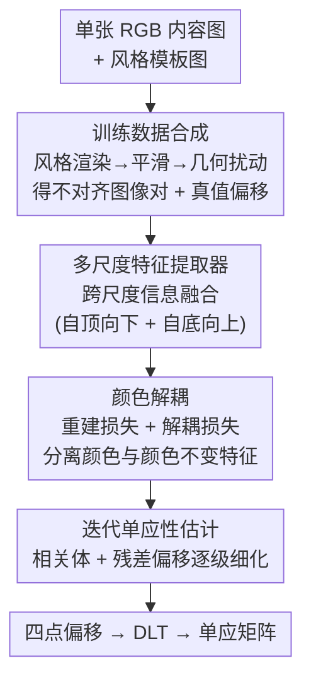

# Towards Generalized Multimodal Homography Estimation

**会议**: CVPR 2026  
**论文**: [CVF Open Access](https://openaccess.thecvf.com/content/CVPR2026/html/You_Towards_Generalized_Multimodal_Homography_Estimation_CVPR_2026_paper.html)  
**领域**: 3D视觉 / 图像配准  
**关键词**: 单应性估计, 多模态配准, 零样本泛化, 数据合成, 风格迁移

## 一句话总结
针对单应性估计模型"换个模态就失灵"的痛点，本文用风格迁移从一张图合成纹理/颜色各异但结构不变的不对齐图像对（自带真值偏移），让模型在合成数据上有监督训练即可零样本泛化到未见模态；同时设计 CCNet 融合跨尺度信息并把颜色从特征中解耦，进一步把跨数据集 MACE 误差大幅压低。

## 研究背景与动机

**领域现状**：单应性估计要找一个投影变换矩阵，把同一场景在不同视角下拍的两张图对齐，是图像拼接、图像融合、引导超分的底层模块。深度方法主流是 DeTone 等人提出的"四点偏移回归"范式——把两张图拼起来喂进网络，回归四个角点的位移，再用直接线性变换（DLT）算出单应矩阵；近年又叠加 inverse compositional Lucas-Kanade（IC-LK）迭代框架反复细化偏移。

**现有痛点**：无论有监督还是无监督方法，都是"为特定模态量身定做"的——在某个数据集（如 GoogleMap）上训练、同数据集测试时精度很高，可一旦换到未见模态（如 RGB-NIR、PDSCOCO），精度断崖式下跌。要救场只能去目标模态再采一批图像对重新训练，时间和人力成本都很高。多模态图像对（不同传感器拍的）的对齐采集本就困难，真值偏移更是难拿。

**核心矛盾**：模型学到的"对齐能力"和"模态外观"被绑死在一起了。有监督方法靠真值适配特定模态的纹理/颜色，无监督方法靠最大化图像对的视觉相似度——两者都默认两张图外观接近，所以一旦跨模态外观差异巨大就失效。此外现有网络还有两个结构性缺陷：只用各尺度内部（intra-scale）信息、忽略了对建立对应有益的跨尺度（cross-scale）互补信息；颜色信息被混进特征里，反而干扰了多模态处理。

**本文目标**：(1) 让模型不依赖目标模态数据就能泛化（零样本多模态单应性估计）；(2) 设计一个本身精度更高、对颜色更鲁棒的估计网络。

**切入角度**：作者观察到——不同模态的差异本质就是纹理和颜色的差异，而几何结构是不变的。既然风格迁移网络擅长把一张图渲染成各种纹理/颜色，那就用它从一张图造出"结构相同、外观千变万化"的训练数据，逼模型只盯结构、不依赖外观。

**核心 idea**：用"风格迁移合成多样外观但结构一致的图像对 + 真值偏移"代替"采集特定模态数据"，把对齐能力从模态外观中剥离出来；再用一个跨尺度融合 + 颜色解耦的网络把估计精度顶上去。

## 方法详解

### 整体框架
方法分两块：一个**训练数据合成**流水线（离线造数据）和一个**跨尺度颜色不变网络 CCNet**（在线估计）。合成端从一张普通 RGB 内容图出发，借风格迁移把它渲染成两种不同外观，再施加已知的几何扰动得到一对"不对齐、结构相同、外观不同"的图像对和真值偏移 $O_{gt}$。训练时把这些合成对当有监督样本喂给 CCNet，优化目标写成

$$\theta^* = \max_{\theta} P(\text{Net}(I_{src}, I_{tar}, \theta), O_{gt})$$

其中 $P(\cdot,\cdot)$ 衡量估计精度。因为训练数据外观足够多样、结构一致，训练好的模型遇到未见模态 $I'_{src}, I'_{tar}$ 仍能保持精度，即 $\max P(\text{Net}(I'_{src}, I'_{tar}, \theta^*), O'_{gt})$。CCNet 内部则负责融合跨尺度信息、把颜色从特征里解耦，并用迭代策略逐级细化偏移。

### 关键设计

**1. 训练数据合成：用风格迁移把对齐能力从模态外观里剥出来**

这一步直接打击"模型把对齐能力和模态外观绑死"的核心矛盾。先从内容数据集随机取一张图 $I_c$，裁出一个比目标尺寸大的 patch $I_{patch}=\text{Crop}(I_c, x, y, S_m+S)$（多留 $S_m$ 的边距是为后续几何扰动留空间）。然后从模板数据集里随机抽两张风格图 $I_t^i, I_t^j$，分别和 $I_{patch}$ 一起喂进风格迁移网络 $\text{Net}_s$，并按内容权重 $\alpha$ 做凸组合：

$$I_{src} = \alpha_i \cdot I_{patch} + (1-\alpha_i)\cdot \text{Net}_s(I_{patch}, I_t^i)$$
$$I_{tar} = \alpha_j \cdot I_{patch} + (1-\alpha_j)\cdot \text{Net}_s(I_{patch}, I_t^j)$$

$\alpha\in[0,1]$ 越大越接近原图——这样能连续控制外观偏离程度。由于风格网络不控制纹理平滑度，再对两张图做平滑 $\text{Smooth}(\cdot,\beta)$，$\beta$ 越大越平滑。最后施加已知几何扰动：$I_{src}=\text{Warp}(I_{src}, O_{gt})$，$O_{gt}$ 的每个元素取自整数集 $\{-p,\dots,p\}$（$p$ 是最大扰动），再从两图中心裁出 $S\times S$ 的 patch，得到一对不对齐图像。

它之所以有效，是因为同一个 $I_{patch}$ 被渲染成两种纹理/颜色完全不同的样子，但底层几何结构原封不动——这恰好模拟了"多模态图像对"的本质（外观异、结构同）。模型在海量这种数据上有监督训练，被迫学会只看结构来找对应，自然就泛化到训练时没见过的真实模态。注意内容图和模板图全是单模态彩色图（如 MSCOCO + Painter by Numbers），不需要任何真实多模态采集，这正是"零样本"的来源。

**2. 跨尺度特征提取：让不同分辨率的特征互相补，而不是各看各的**

针对"现有网络只用尺度内信息、浪费跨尺度互补线索"的缺陷。提取器先用卷积 + 残差块抽出全分辨率浅层特征 $F^1\in\mathbb{R}^{C\times S\times S}$，然后**自顶向下**逐级下采样并聚合：$F^2_i=\text{ResBlock}(\text{ResBlock}_{\downarrow}(F^1_i)\circ \text{MaxPool}_{\downarrow}(F^1_i))$（$\circ$ 是通道拼接，$\downarrow$ 表示分辨率减半），$F^3$ 同理得到，得到 $S$、$S/2$、$S/4$ 三个尺度。关键是它还做**自底向上**回融：把 $F^3$ 上采样两倍后和 $F^2$ 拼接再卷积，$F^2_i=\text{Conv}(F^2_i\circ \text{Up}(F^3_i))$，$F^1$ 用同样方式吸收下层信息。这种双向流动让每个尺度的特征既有自己的细节、又含其它尺度的上下文，对建立鲁棒对应（尤其在低纹理或模态差异大时）更有利。

**3. 颜色解耦：把干扰多模态的颜色信息从特征里"拆走"**

针对"颜色混进特征会损害多模态处理"的痛点。对每个尺度特征 $F^j_i$，用卷积层拆成两支：颜色表示 $F^{j,i}_{color}$ 和颜色不变特征 $F^{j,i}_{invar}$，并用两个损失约束。第一个是**颜色重建损失**，要求从颜色支能还原出原图的颜色直方图：

$$L^{j,i}_{color} = \text{MSE}(\text{Net}_c(F^{j,i}_{color}), \text{Hist}(I_i))$$

这逼颜色支真的承载颜色信息。第二个是**颜色解耦损失**，用余弦相似度的 L1 范数压制两支的相关性：

$$L^{j,i}_{dis} = \|\text{CosSim}(F^{j,i}_{color}, F^{j,i}_{invar})\|_1$$

最小化它鼓励颜色不变特征和颜色特征正交，把颜色从 $F^{j,i}_{invar}$ 里挤出去。只有颜色不变特征 $F_{invar}$ 进入后续估计——这样跨模态时颜色这个最大干扰源被隔离，估计更稳。

**4. 迭代单应性估计：基于相关体的两级残差细化**

复用并强化 IC-LK 式迭代思路在颜色不变特征上做精修。在尺度 $j$、第 $k$ 次迭代时，先用上一步偏移把源特征 warp 过去：$F^{j,k}_{src}=\text{Warp}(F^j_{src}, O^{j,k-1}_{pred}+O^{j+1}_{pred})$，再算它和目标特征在搜索半径 $r$ 内的局部相关体：

$$C^{j,k}(u,v,m,n)=\sum_{u=-r}^{r}\sum_{v=-r}^{r} F^{j,k}_{src}{}^{T}(m+u,n+v)\cdot F^j_{tar}(m,n)$$

这个 4D 张量编码了源/目标的上下文相关性，reshape 后送进估计块更新残差偏移 $O^{j,k}_{pred}=\text{Net}_h(C^{j,k})+O^{j,k-1}_{pred}$。偏移在两级（粗到细）和多次迭代间逐步累加 $O^j_{pred}=O^{j,K}_{pred}+O^{j+1}_{pred}$，$O^1_{pred}$ 即最终输出。把迭代细化放在解耦后的颜色不变特征上，使得每一轮搜索都不被颜色差异带偏。

### 损失函数 / 训练策略
总损失是偏移监督项加上颜色相关项的加权：

$$L = L_{pred} + \lambda \cdot \sum_{i\in\{src,tar\}}\sum_{j=1}^{3}\left(L^{j,i}_{color}+L^{j,i}_{dis}\right)$$

其中 $L_{pred}=\sum_{O_{pred}\in \mathbf{O}}\|O_{pred}-O_{gt}\|_1$ 对所有中间偏移（集合 $\mathbf{O}=\{O^{j,k}_{pred}+O^{j+1}_{pred}\}$）做 L1 监督，把每一级每一轮的预测都拉向真值；颜色两项强制解耦。实现上用 PyTorch + 单卡 RTX A6000，AdamW 优化，风格网络用 IEContraAST，内容图取自 MSCOCO、模板图取自 Painter by Numbers；训练迭代 $1.2\times10^5$、学习率 $4\times10^{-4}$、$\beta=10^{-3}$、$\lambda=0.5$、batch 16、$K=2$、$r=4$。

## 实验关键数据

评测用 MACE（平均角点误差，越小越好）在四个数据集上做：GoogleMap、GoogleEarth、RGB-NIR、PDSCOCO。"∗"=在本文合成数据上训练（零样本），"+"=把合成法当增广用在已有数据集上。

### 主实验：零样本泛化（跨数据集）
下表节选 GoogleMap 上训练、跨到其它三个数据集测试的 MACE（数字越小越好），看合成数据带来的泛化提升：

| 方法 | →GoogleEarth | →RGB-NIR | →PDSCOCO |
|------|------|------|------|
| MHN（原始） | 39.474 | 30.372 | 33.490 |
| MHN∗（合成数据训练） | **3.110** | 7.549 | 4.251 |
| IHN（原始） | 3.038 | 12.491 | 5.352 |
| IHN∗ | 1.853 | 5.647 | 1.684 |
| MCNet（原始） | 20.518 | 16.557 | 8.202 |
| MCNet∗ | 1.402 | 5.239 | 1.423 |

原始模型一旦跨数据集普遍崩盘（MHN 高达 39.47），换成合成数据训练后误差成倍下降。作者报告：除少数 DHN 弱学习器的例外，合成数据带来的提升幅度在 **1.93%～93.17%**，约一半案例提升超 50%。

### 主实验：同数据集 + 零样本统一对比
下表是 CCNet 与各 baseline 在四个数据集上的 MACE（"Zero-shot"=在合成数据上训练）：

| 类型 | 方法 | GoogleMap | GoogleEarth | RGB-NIR | PDSCOCO |
|------|------|------|------|------|------|
| 有监督 | MCNet | 0.261 | 0.577 | 3.226 | 1.062 |
| 有监督 | **CCNet (Ours)** | **0.184** | **0.526** | **2.992** | **1.001** |
| 无监督 | SSHNet | 1.394 | 5.888 | 6.743 | 1.610 |
| 零样本 | MCNet∗ | 5.093 | 1.402 | 5.239 | 1.423 |
| 零样本 | **CCNet∗ (Ours)** | **4.383** | **1.399** | **4.461** | **1.368** |

同数据集设定下 CCNet 比次优方法分别提升 29.50% / 8.83% / 7.25% / 5.74%；零样本设定下提升 13.94% / 0.21% / 14.85% / 3.87%。

### 关键发现
- **合成数据是泛化的主引擎**：原始 baseline 跨模态几乎全崩，合成数据训练后普遍数倍降误差；而且把合成法当增广用在已有数据集上，泛化也能提升 8.82%～79.54%（代价是同数据集精度略降，因为模型被"劝退"去过度利用模态信息）。
- **RGB-NIR 天生更好泛化**：近红外波段捕获的纹理/颜色信息少、结构信息占主导，所以从 RGB-NIR 训练的模型本就比从 GoogleMap/PDSCOCO 训练的更易跨域——侧面印证了"结构主导 = 泛化"的假设。
- **跨尺度 + 颜色解耦各有贡献**：CCNet 在同数据集和零样本两种设定下都超过所有 baseline，作者归因于跨尺度信息融合提升对应质量、颜色解耦削弱多模态时颜色的负面干扰。
- **代价很小**：CCNet 运行时 32.73ms、模型 1.21MB，相比 MCNet（31.01ms / 0.76MB）只小幅增加，却换来明显更高的精度和泛化。

## 亮点与洞察
- **"造数据"而非"采数据"的思路很值得迁移**：把多模态差异抽象成"纹理+颜色变、结构不变"，再用风格迁移廉价合成，绕开了多模态对齐数据采集这一最大瓶颈。任何"外观域变、几何/语义不变"的任务（跨光照配准、跨季节定位）都可借鉴这套合成范式。
- **颜色解耦用"重建+正交"双损失很干净**：一支用颜色直方图重建损失强制承载颜色，另一支用余弦相似度损失把它和主特征拉正交，显式地把干扰因子隔离出去，比隐式"希望网络自己学会忽略颜色"靠谱得多。
- **合成法可当即插即用增广**：不仅能独立支撑零样本，还能叠加在现有数据集上提升泛化，几乎零成本接入已有 pipeline。
- **小代价换大泛化**：在运行时/参数几乎不变的前提下把跨域误差压下来，工程落地友好。

## 局限与展望
- **增广会牺牲同域精度**：把合成法用在已有数据集上虽提升泛化，但同数据集精度下降（模型被劝退不去利用模态特异信息），存在泛化/专精的 trade-off，需按场景权衡。
- **依赖风格迁移网络的质量**：合成数据的多样性与真实感受限于所用风格迁移网络（IEContraAST）和模板库；若目标模态的外观特性超出风格迁移能覆盖的范围（如特殊传感器伪影、强非线性强度映射），合成分布可能仍有 gap。
- **几何扰动是纯单应性**：训练用的 $O_{gt}$ 是整数范围内的角点扰动，假设场景近似平面/纯投影变换；对非平面、视差大或带局部形变的真实多模态对，单应模型本身的表达力是天花板。
- **DHN 等弱学习器获益有限**：合成数据对学习能力弱的模型（DHN）甚至在部分案例反而变差，说明该范式更适合容量足够的网络。

## 相关工作与启发
- **vs 有监督四点偏移范式（DHN / MHN / IHN / MCNet）**：它们靠真值在特定模态上回归偏移、迭代细化，同域强但跨域崩；本文不改变"四点偏移 + 迭代"的骨架，而是从**训练数据来源**下手（合成多外观数据）让同一类网络获得零样本泛化，并额外用跨尺度+颜色解耦提升上限。
- **vs 无监督方法（UDHN / SSHNet / AltO）**：无监督靠最大化图像对视觉相似度或图像翻译统一模态，前者跨模态外观差异大时失效、后者只能处理小形变且会严重损害泛化（SSHNet 在 GoogleMap 同域强，但跨域 MACE 飙到 20+）；本文走有监督路线但不需真实多模态真值，规避了无监督对外观相似的依赖。
- **vs 自监督生成伪对（SCPNet 等）**：同样是"从单图造不对齐对+真值"，但前作主要增强**单模态**能力、靠特征/模态一致性缩小模态 gap；本文用风格迁移显式注入纹理/颜色多样性，直接面向**跨模态零样本**，并在网络侧加入颜色解耦把模态干扰拆掉。
- **vs 风格迁移本身（Gatys / IEContraAST 等）**：本文不创新风格迁移算法，而是把它当作"几何不变的外观增广器"复用——这是一个把生成式工具用作判别式任务数据引擎的好例子。

## 评分
- 新颖性: ⭐⭐⭐⭐ 用风格迁移合成"结构不变、外观多样"数据实现零样本多模态单应性估计，切入角度新颖且实用；网络侧的跨尺度+颜色解耦是稳健组合而非全新机制。
- 实验充分度: ⭐⭐⭐⭐ 四个数据集、跨数据集/同数据集/增广/零样本多设定全覆盖，含计算开销对比，证据链完整；缺对非平面/真实复杂模态的压力测试。
- 写作质量: ⭐⭐⭐⭐ 动机推导清晰、公式与图示对应，方法各模块定义明确；部分指标提升幅度跨度大（1.93%～93%）略显宽泛。
- 价值: ⭐⭐⭐⭐ 直击多模态配准的数据采集瓶颈，合成范式即插即用、代价小，对图像拼接/融合/超分等下游有实际意义。

<!-- RELATED:START -->

## 相关论文

- [\[CVPR 2026\] Omni-3DEdit: Generalized Versatile 3D Editing in One-Pass](omni-3dedit_generalized_versatile_3d_editing_in_one-pass.md)
- [\[CVPR 2026\] Adapting Point Cloud Analysis via Multimodal Bayesian Distribution Learning](adapting_point_cloud_analysis_via_multimodal_bayesian_distribution_learning.md)
- [\[CVPR 2026\] ORD: Object-Relation Decoupling for Generalized 3D Visual Grounding](ord_object-relation_decoupling_for_generalized_3d_visual_grounding.md)
- [\[CVPR 2026\] Multimodal Semantic Bias Mitigation for Diverse Text-To-3D Generation](multimodal_semantic_bias_mitigation_for_diverse_text-to-3d_generation.md)
- [\[ICLR 2026\] MultiMat: Multimodal Program Synthesis for Procedural Materials using Large Multimodal Models](../../ICLR2026/3d_vision/multimat_multimodal_program_synthesis_for_procedural_materials_using_large_multi.md)

<!-- RELATED:END -->
