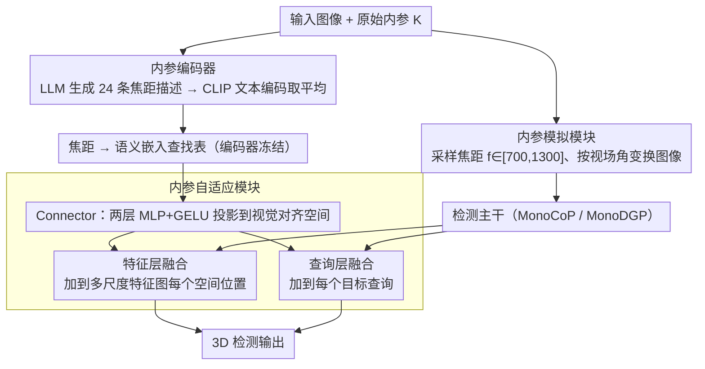

# Towards Intrinsic-Aware Monocular 3D Object Detection

**会议**: CVPR 2026  
**arXiv**: [2603.27059](https://arxiv.org/abs/2603.27059)  
**代码**: [https://github.com/alanzhangcs/MonoIA](https://github.com/alanzhangcs/MonoIA)  
**领域**: 3D视觉  
**关键词**: 单目3D检测, 相机内参, 语言引导表征, 跨数据集训练, 焦距泛化

## 一句话总结

MonoIA 提出将数值型相机内参转化为语言引导的语义表征（通过 LLM 生成内参描述 + CLIP 编码），并通过分层自适应模块将其融入检测网络，实现对未见焦距的零样本泛化和跨数据集统一训练，在 KITTI/Waymo/nuScenes 上达到新 SOTA。

## 研究背景与动机

**领域现状**：单目3D目标检测（Mono3D）从单张 RGB 图像推断3D物体位置和尺寸，是自动驾驶和机器人领域的重要任务。近年来基于 Transformer 的方法（MonoDETR、MonoDGP、MonoCoP）取得了显著进展，但均假设训练和测试时使用相同的相机内参。

**现有痛点**：现有 SOTA 方法对相机内参高度敏感。当测试图像来自不同焦距的相机时，性能急剧下降——例如 MonoCoP 在训练焦距下表现优异，但在未见焦距下精度大幅衰减。实际部署中不同车辆、不同传感器的相机内参差异很大，模型跨相机泛化能力不足严重限制了实际应用。

**核心矛盾**：内参变化不仅是数值差异，更是一种"感知变换"——焦距变化会改变物体的表观大小、透视关系和空间几何。然而现有方法将内参作为原始数值输入，网络难以从有限的监督信号中推断内参变化产生的感知效应，导致要么忽略内参线索，要么过拟合到少数训练值。

**本文目标**：设计一个统一的内参感知框架，使检测器能(1)理解内参变化的感知含义，(2)零样本泛化到未见焦距，(3)支持多数据集联合训练。

**切入角度**：作者的关键洞察是——内参变化的本质是感知变换而非数值差异。短焦距产生宽广视场、强调全局上下文，长焦距压缩透视、放大远处物体。这种"感知效应"可以用自然语言精确描述。

**核心 idea**：用 LLM 为每个焦距生成描述其视觉效应的文本，再通过 CLIP 编码为语义嵌入，将内参建模从数值条件化转变为语义表征，实现对内参变化的深层理解。

## 方法详解

### 整体框架

MonoIA 想解决的是一个很具体的部署痛点：单目检测器一换相机焦距精度就崩。它的做法是把"焦距是多少"这件事，从一个塞进网络的裸数值，改造成一段能被网络读懂的语义信号，整条链路分三步走。训练阶段先用**内参模拟模块**（Intrinsic Simulation Module）对原图做视场变换，造出一批不同焦距的图，让网络见过足够宽的内参分布；与此并行，**内参编码器**（Intrinsic Encoder）把每个焦距翻译成文字再编码成嵌入向量，形成一张"焦距→语义"的查找表；最后**内参自适应模块**（Intrinsic Adaptation Module）负责把这个嵌入桥接进检测网络，在特征图和目标查询两个层面把内参信息注入进去。检测主干直接复用 MonoCoP / MonoDGP，三个模块都是即插即用的外挂。

### 关键设计

**1. 内参模拟模块：把"网络没见过的焦距"补进训练分布**

跨焦距泛化的第一个障碍是训练数据本身焦距太单一，网络根本没机会学到焦距和成像之间的关系。模拟模块用几何变换补这个缺口：给定原图和内参 $\mathbf{K}_{\text{orig}}$，随机采样一个目标焦距 $f_i \in [700, 1300]$，按视场角公式 $\theta = 2\arctan(\frac{w}{2f_i})$ 重新缩放图像——短焦距对应宽视场、物体被推远显小（zoom-out），长焦距压缩透视、远处物体被放大（zoom-in）。值得注意的是，作者明确指出光靠这一步并不够：直接拿模拟图去训 MonoCoP，AP₃D 反而掉了 1.93%。也就是说"多见几种焦距"本身不解决问题，它只是给后面的语义学习铺出一个足够多样的训练分布，真正的理解要靠下一步。

**2. 内参编码器：让数值焦距带上几何结构的语义表征**

这是全文的核心赌注——内参变化不是数值差异而是"感知变换"，那就该用能描述感知的语言去刻画它。编码分两步：先对每个焦距 $f_i$ 把模拟图和数值一起喂给 ChatGPT-4o，让它生成 $N=24$ 条描述该焦距视觉效应的文本（比如"短焦距带来宽广视场、物体显小、强调全局上下文"）；再用 CLIP ViT-H/14 的文本编码器把这些描述全部编码、取平均，得到该焦距的内参嵌入

$$\mathbf{t}_{\text{avg}} = \frac{1}{N}\sum_{i=1}^{N}\text{CLIP}_{\text{text}}(p_i)$$

举个具体的：焦距 800 和 850 这两个相近的值，生成的描述措辞高度相似，CLIP 编码后落在语义空间里几乎挨着；而 800 和 1300 描述差异大、嵌入也拉得远。这正是数值编码做不到的——作者用 cosine 相似度分析发现，把焦距当标量直接线性映射得到的嵌入近乎均匀分布、彼此区分不开；而语言引导的嵌入呈现出随焦距单调变化的有序相似度模式，说明它真的把"焦距变化"这件事的几何结构编进去了，未见焦距也能落到合理位置，这正是零样本泛化的基础。

**3. 内参自适应模块：把冻结的语义嵌入消化进检测网络**

光有一张好的语义查找表还不够，检测网络得真的用上它。这一步先过一个 **Connector**（两层 MLP + GELU），把冻结的内参嵌入投影到一个可训练的视觉对齐空间——之所以保持编码器冻结、只训练这个投影头，是因为消融显示一旦让嵌入跟着梯度更新，精心建立的语义结构就会被任务损失冲垮（掉 2.55%）。投影后做**双层融合**：特征层面，把内参嵌入加到多尺度 backbone 特征图的每个空间位置上

$$\tilde{\mathbf{F}}_i(x,y) = \mathbf{F}'_i(x,y) + \mathbf{t}_{\text{intr}}$$

保证低层几何一致性；查询层面，再把它加到每个目标查询上 $\tilde{\mathbf{q}}_j = \mathbf{q}_j + \mathbf{t}_{\text{intr}}$，让解码器在不同焦距配置下知道该怎么解读手里的视觉证据。消融证明两层缺一不可：去掉特征层融合掉到 23.43%，去掉查询层融合掉到 23.99%，前者管像素级几何、后者管物体级推理，作用并不重叠。

### 损失函数 / 训练策略

训练时 Intrinsic Encoder 保持冻结，仅训练 Intrinsic Adaptation Module 和检测器。采用 DETR 式 Hungarian 匹配，总损失为：

$$\mathcal{L}_{\text{overall}} = \frac{1}{N_{gt}} \sum_{n=1}^{N_{gt}} (\mathcal{L}_{2D} + \mathcal{L}_{3D} + \mathcal{L}_{\text{dmap}})$$

其中 $\mathcal{L}_{2D}$ 为2D框损失，$\mathcal{L}_{3D}$ 监督3D属性，$\mathcal{L}_{\text{dmap}}$ 为物体级深度图预测损失。

推理时采用**混合插值策略（Hybrid Interpolation Strategy）**：对测试内参，找到最近的两个训练焦距及其嵌入。若焦距差 ≤32px 直接复用最近嵌入，否则线性插值合成目标嵌入。32px 阈值对应 backbone 的 32× 空间下采样，更细的差异在特征空间不可区分。

## 实验关键数据

### 主实验

| 数据集 | 指标 | MonoIA | MonoCoP (前SOTA) | 提升 |
|--------|------|--------|------------------|------|
| KITTI Test (Mod.) | AP₃D | 21.57% | 20.39% | +1.18% |
| KITTI Val (Mod.) | AP₃D | 24.40% | 23.98% | +0.42% |
| KITTI Val (Easy) | AP₃D | 33.61% | 32.06% | +1.55% |
| nuScenes Val (Mod.) | AP₃D | 10.74% | 9.71% | +1.03% |
| 多数据集 KIT+NU+Way | AP₃D (KITTI) | 28.91% | 17.26%* | +11.65% |

*MonoCoP 在多数据集训练下严重退化。

### 消融实验

| 配置 | AP₃D (Mod.) | 说明 |
|------|-------------|------|
| 单焦距 baseline (MonoCoP) | 23.64% | 无内参感知 |
| + 多焦距模拟图像 | 21.71% | 仅增加数据反而下降 |
| + 线性内参编码 (替代LLM+CLIP) | 22.16% | 数值编码无几何结构 |
| + 可训练嵌入 (不冻结) | 21.85% | 训练破坏语义结构 |
| + 无 Connector | 22.85% | 缺少空间桥接 |
| + 无特征层融合 | 23.43% | 丧失低层几何一致性 |
| + 无查询层融合 | 23.99% | 影响物体级推理 |
| **MonoIA 完整版** | **24.40%** | 所有组件协同 |

### 关键发现

- 单纯增加多焦距数据训练反而有害（-1.93%），证明"理解内参"比"见过更多内参"更重要
- 冻结 CLIP 编码器至关重要：不冻结导致 -2.55% 性能下降，语义空间的结构被训练梯度破坏
- MonoIA 在内参失配测试中（焦距扰动 ±15px）性能下降最小（18.98% vs 基线 15.42%），鲁棒性显著提升
- 多数据集联合训练优势巨大：MonoIA 从单数据集 24.40% 提升到三数据集 28.91%，而 MonoCoP 从 23.98% 下降到 17.26%
- 模型几乎无额外开销：仅增加 0.13M 参数，GFLOPs 不变

## 亮点与洞察

- **思路的范式转换**：将内参建模从"数值条件化"转向"语义表征"，这一思路具有普遍启发——任何物理参数（如光照、天气、传感器型号）都可能从语言描述中获得更好的表征
- **LLM 作为先验知识源**：巧妙利用 LLM 的世界知识来描述焦距变化的视觉效应，而非依赖人工定义规则
- **实验设计全面**：覆盖了零样本泛化、内参失配、多数据集训练、多骨干网络、多基线方法等多维度评估
- **即插即用设计**：Intrinsic Awareness 模块可以集成到 MonoDGP 和 MonoCoP 等不同检测器上，均有一致提升

## 局限与展望

- MonoIA 需要为每个焦距预先生成 LLM 描述和 CLIP 嵌入，新焦距依赖插值而非真正的泛化
- 当前主要关注焦距变化，对主点位移等其他内参的影响分析较少（作者在附录中指出焦距是主导因素）
- 不是内参不变（intrinsic-invariant）的架构，而是依赖显式嵌入学习
- 未来方向：设计天然内参不变的网络架构；将语言引导表征扩展到外参、天气等其他物理参数
- 多模态基础模型与3D感知的深度集成仍是重要开放问题

## 相关工作与启发

- **MonoDETR/MonoDGP/MonoCoP** 系列：MonoIA 建立在 MonoCoP 基础上，形成了单目3D检测的持续改进链
- **CLIP 在3D任务中的应用**：如 OpenScene、ULIP 等用 CLIP 桥接2D和3D，MonoIA 首次将 CLIP 用于相机内参编码
- **Omni3D** 使用虚拟深度归一化处理跨数据集训练，MonoIA 提供了更优的语义级解决方案
- 启发：在其他传感器标定敏感任务中（如深度估计、BEV 感知），是否也可以引入语言引导的参数表征？

## 评分

- 新颖性: ⭐⭐⭐⭐⭐ （将 LLM+CLIP 引入相机内参建模，思路原创性强）
- 实验充分度: ⭐⭐⭐⭐⭐ （KITTI/Waymo/nuScenes + 多焦距 + 多数据集 + 消融 + 效率分析）
- 写作质量: ⭐⭐⭐⭐⭐ （逻辑链清晰，图表丰富，附录详实）
- 价值: ⭐⭐⭐⭐⭐ （解决实际部署痛点，思路对整个3D感知领域有启发）

<!-- RELATED:START -->

## 相关论文

- [\[CVPR 2026\] MonoSAOD: Monocular 3D Object Detection with Sparsely Annotated Label](monosaod_monocular_3d_object_detection_with_sparsely_annotated_label.md)
- [\[CVPR 2026\] SPAN: Spatial-Projection Alignment for Monocular 3D Object Detection](span_spatial_projection_alignment_mono3d.md)
- [\[AAAI 2026\] MonoCLUE: Object-Aware Clustering Enhances Monocular 3D Object Detection](../../AAAI2026/3d_vision/monoclue_object-aware_clustering_enhances_monocular_3d_object_detection.md)
- [\[CVPR 2025\] MonoPlace3D: Learning 3D-Aware Object Placement for 3D Monocular Detection](../../CVPR2025/3d_vision/monoplace3d_learning_3d-aware_object_placement_for_3d_monocular_detection.md)
- [\[CVPR 2026\] Few-Shot Incremental 3D Object Detection in Dynamic Indoor Environments](few-shot_incremental_3d_object_detection_in_dynamic_indoor_environments.md)

<!-- RELATED:END -->
