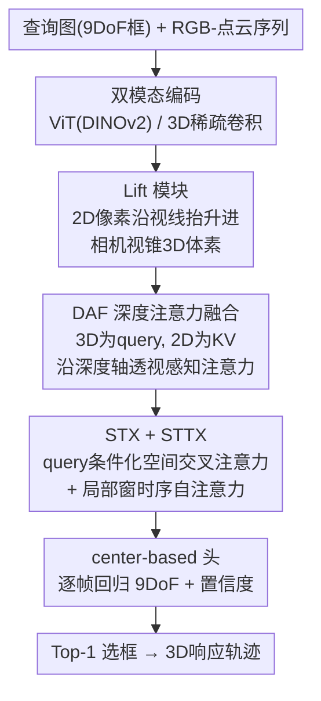

# Towards Visual Query Localization in the 3D World

**会议**: CVPR 2026  
**arXiv**: [2605.01498](https://arxiv.org/abs/2605.01498)  
**代码**: https://github.com/wuhengliangliang/3DVQL (有)  
**领域**: 3D视觉  
**关键词**: 视觉查询定位, 3D多模态, 点云-图像融合, 9DoF定位, 基准数据集

## 一句话总结
把"视觉查询定位（VQL）"从 2D 视频搬到 3D 世界：作者构建了首个 3D 多模态 VQL 基准 **3DVQL**（2002 段序列、17 万帧、6.4K 响应轨迹、38 类、点云+RGB+深度三模态、逐帧 9DoF 框标注），并提出把 2D 特征沿视锥抬升进 3D 体素、再用深度注意力做点云-图像融合的 **LaF** 方法，在所有指标上显著超过基于 VQLoC 改造的多模态基线。

## 研究背景与动机
**领域现状**：视觉查询定位（VQL）是视频理解与具身智能的核心任务——给一张目标的查询图，要在一段很长的第一人称视频里找到该目标**最近一次出现**的时空位置并返回响应轨迹。借助 Ego4D 这类大规模数据集，2D VQL 框架（VQLoC、PRVQL 等）已经做到很高的定位精度。

**现有痛点**：现有 VQL 几乎全在 2D 平面上做，性能天然被"二维"封顶——目标遮挡、外观剧变、视角变化这些真实世界的歧义在 2D 图像里无法消解，和我们本质上是 3D 的世界脱节。而把 VQL 搬到 3D 之所以一直没人做，根本卡点是**没有合适的基准**：3D 数据采集与 9DoF 标注成本极高。

**核心矛盾**：作者在做基线实验时发现一个和 2D 截然相反的现象——2D VQL 里靠加深网络提升单模态特征判别力是涨点的主路，但在 3D 上这招不稳定、甚至掉点。这说明 3D VQL 的真正瓶颈**不是单模态特征够不够强，而是跨模态可观测性与时空对齐**：RGB 受运动模糊和遮挡影响，点云则有远距稀疏、非刚性形变、缺乏细粒度外观三大短板，任一模态单打独斗都撑不起长时程稳定定位。

**本文目标**：(1) 造一个支持单模态/多模态、带高质量 9DoF 标注的 3D VQL 基准；(2) 搞清 3D VQL 的真正难点在哪、给出一套可比的多模态基线；(3) 设计一个真正利用几何对应关系的融合方法。

**核心 idea**：用"先把 2D 特征沿视线抬升进 3D 视锥体素、再沿深度轴做透视感知注意力"来精确对齐点云与图像，替代基线里粗糙的逐元素相加融合，从而解决跨模态对齐这个真正瓶颈。

## 方法详解

### 整体框架
3DVQL 任务的输入是一张目标查询（带 9DoF 查询框）+ 一段同步的 RGB-点云序列，输出是该目标最近一次出现的时间段以及每帧的 9DoF 3D 框和置信度。本文有两条线：一是**基准 + 基线**（基于 VQLoC 架构改造出 AF / GAF / PAF 三个融合变体，差别只在融合模块），二是**提出的 LaF 方法**。

LaF 的 pipeline：RGB 帧用 DINOv2 预训练的 ViT-B/14 编码、点云裁剪到固定工作空间 $\mathcal{W}$ 后体素化（$16^3$ 网格）并用 PV-RCNN 预训练的 3D 稀疏卷积编码；**Lift 模块**把每个 2D 像素 token 沿视线投射成一串 3D 体素候选（只保留落在相机视锥内的）；**DAF（深度注意力融合）**以 3D 特征为 query、抬升后的 2D 特征为 key/value，沿深度轴逐切片做透视感知多头注意力，得到几何对齐的融合特征，再用 3D 查询框 RoI 裁出 query 表征 $Q_f$；**STX（空间 Transformer）**让 $Q_f$ 与搜索帧特征 $C_f$ 做交叉注意力、聚合空间线索，得到 query-to-frame 对应特征 $f$；**STTX（时空 Transformer）**在局部时间窗内对 $f$ 做自注意力、跨帧推理时序一致性，得到 query-video 对应特征 $V^*$；最后上采样到固定分辨率，用 CenterPoint 式的 anchor/center 头逐帧回归 9DoF 框 + 置信度，Top-1 选框后按 query 关联成响应轨迹。

### 关键设计

**1. 3DVQL 基准：把 VQL 任务定义搬进 3D 多模态长序列**

针对"3D VQL 没基准所以做不动"这个根本卡点，作者用搭载 64 线激光雷达 + 深度相机 + RGB 相机的 Clearpath Husky A200 移动机器人，在街道、公园、校园、卧室、图书馆、超市、球场等 18 个真实场景采集了 2002 段同步多模态序列（20 fps），共 17 万帧、6.4K 响应轨迹，覆盖 8 个元类别下的 38 个细类。每帧都人工标注**最紧致的 9DoF 3D 框**（中心 $x,y,z$ + 尺寸 $l,w,h$ + yaw/pitch/roll），并经过"专家示范 → 标注员逐帧标 → 专家核验 → 不一致退回重标"的多轮迭代质检（同时检查时序连续性与几何合理性）。与 2D 的 Ego4D 相比，3DVQL 序列数相当（2002 vs 2538）但轨迹段几乎翻倍（6.4K vs 3.2K），且独家同时支持 PC-only、RGB-PC、RGB-D 等多种设置。采集时特意优选"目标短暂出现 → 离开 → 之后带显著视角/空间变化再回来"的片段，让"最近一次出现"成为真正需要长程回溯的检索答案。

**2. Lift 模块：把 2D 特征沿视线抬升进相机视锥 3D 体素**

基线里 2D 与 3D 特征是直接逐元素相加融合的，没充分利用像素和点之间精确的几何对应。Lift 模块借鉴自动驾驶 BEV 感知的思路：把每个 2D 像素 token 沿它的视线方向展开成 3D 空间里的一条射线，生成一串 3D 体素候选。为保证相关性和计算可行，这个抬升被严格限制在**相机视锥（frustum）内的体素**——即只在"相机真能看到"的那些体素上做跨模态对齐，避免在整个 3D 空间盲目展开。这一步把"2D 图像信息"和"3D 几何位置"在同一个视锥坐标系下对齐，为后续注意力融合提供了几何先验。

**3. DAF 深度注意力融合：沿深度轴做透视感知注意力**

这是 LaF 区别于基线的核心模块。把 2D 抬升进视锥后，还需要决定每个 3D query 到底该聚合哪个深度上的 2D 外观。DAF 用透视感知的多头注意力：以 **3D 特征为 query、抬升后的 2D 图像特征为 key/value**，注意力沿**深度轴逐切片（slice-wise）**计算，从而保证几何感知的对齐——每个 3D query 自适应地从它视线上不同深度的 2D 信息里聚合最相关的外观线索。融合后的特征 $Q_f$ 再用与初始 3D 查询框精确对齐的 3D RoI 裁出。消融显示这个深度注意力是 LaF 涨点的绝对主力（见消融表），因为它把"点云提供哪里、图像提供长什么样"这两件事按真实成像几何精确缝合，而非粗暴相加。

**4. STX + STTX：query 条件化的空间-时序一致性建模**

单帧融合特征还不足以在长视频里稳定跟踪。STX（空间 Transformer）做交叉注意力，让 query 特征 $Q_f$ 去注意并聚合搜索帧特征 $C_f$ 里的相关空间线索，产出帧级的 query-to-frame 对应特征 $f$；STTX（时空 Transformer）则在**局部时间窗 mask** 下做自注意力，让 $f$ 跨多帧推理时序一致性与目标动态，得到 query-video 对应特征 $V^*$。局部窗 mask 既增强了对遮挡/模糊的鲁棒性，又把时序注意力的计算开销控制在可接受范围内——这对 17 万帧规模的长序列检索很关键。

**5. center-based 预测头与训练策略：用中心回归绕开 9DoF IoU 不可导**

在 $\mathcal{W}$ 上铺一个 $16^3$ 的均匀 anchor 网格 $\{\mathbf{a}_n\}$，CenterPoint 式的头对每帧每个 anchor 预测中心偏移、尺寸、旋转和 presence 分数。最终预测取置信度最高的 anchor 解码：

$$n_t^{\ast}=\arg\max_n p_{t,n},\quad \hat{\mathbf{b}}_t=\text{Decode}(\mathbf{a}_{n_t^{\ast}},\text{pred}_{t,n_t^{\ast}})$$

这里有个关键工程取舍：由于目前**缺少支持反向传播的 9DoF IoU 算子**，无法对多候选框做稳定的 IoU 监督，作者改用中心点回归当训练目标。正样本 anchor 的选取规则是：中心落在 GT 中心 $\tau_c=0.3$ m 半径内、且属于最近的 top-5 中心。总损失为

$$\mathcal{L}=\lambda_c\mathcal{L}_c+\lambda_s\mathcal{L}_s+\lambda_r\mathcal{L}_r+\lambda_{\text{cls}}\mathcal{L}_{\text{cls}}+\lambda_{\text{dist}}\mathcal{L}_{\text{dist}}$$

其中 $\mathcal{L}_c/\mathcal{L}_s/\mathcal{L}_r$ 分别是中心、尺寸、旋转的回归 L1 损失，$\mathcal{L}_{\text{cls}}$ 是 presence 的 focal loss，$\mathcal{L}_{\text{dist}}$ 惩罚施加预测偏移后正样本中心与 GT 中心的距离。

### 损失函数 / 训练策略
LaF 端到端训练 400 epochs，峰值学习率 $10^{-4}$、权重衰减 $5\times10^{-2}$；图像缩放到 $448\times448$，点云重采样到 4096 点，RoIAlign 池化尺寸 5；每段裁剪 $T=20$ 帧（随机采样并保证正负帧均衡）。损失权重 $\lambda_c,\lambda_s,\lambda_r,\lambda_{\text{cls}},\lambda_{\text{dist}}$ 经验设为 $1.0, 1.0, 0.1, 100, 0.3$。工作空间 $\mathcal{W}=[0,10]\times[-2,2]\times[-1,1]$ m，内铺 $16^3$ 中心。

## 实验关键数据

### 主实验
评测协议（自定义指标，沿用 2D VQL 精神扩展到 3D）：
- **tAP（Temporal AP）**：预测时间段与 GT 响应轨迹时间范围的匹配度，按 ActivityNet 风格在 tIoU 阈值 $\{0.25,0.5,0.75,0.95\}$ 上算 mAP 并取均值。
- **3D-stAP（3D 时空 AP）**：先算逐帧 9DoF 框的 3D IoU，再沿时间聚合成时空 IoU $\mathrm{stIoU}_{3D}$；因 9DoF 定位极难，额外加了 0.05 这个宽松阈值，在 $\{0.05,0.25,0.5,0.75,0.95\}$ 上取均值。
- **Succ（成功率）**：$\mathrm{stIoU}_{3D}\ge 0.05$ 的 query 占比，衡量"有无有效重叠"。
- **Rec%（恢复率）**：GT 时间段内逐帧 $\mathrm{IoU}_{3D}\ge 0.5$ 的帧占比，借鉴 VOT 鲁棒性精神。
- 此外用 $d_{\text{sep}}=t_{\text{resp\_end}}-t_{\text{query}}$ 刻画需要回溯多远（呈"开头密、长尾稀"分布，约 0–250 帧）。

3DVQL（RGB-PC）测试集主结果，LaF vs 三个基线：

| 方法 | tAP | tAP$_{0.25}$ | stAP | stAP$_{0.05}$ | rec.% | Succ. |
|------|------|------|------|------|------|------|
| AF（anchor + 7DoF GIoU 损失） | 0.181 | 0.442 | 0.003 | 0.015 | 0.093 | 11.693 |
| GAF（Guided-Attention 融合） | 0.291 | 0.597 | 0.015 | 0.075 | 0.049 | 26.309 |
| PAF（Projection-Aware 融合） | 0.224 | 0.577 | 0.021 | 0.104 | 0.115 | 32.156 |
| **LaF（本文）** | **0.293** | **0.607** | **0.044** | **0.222** | **0.264** | **46.041** |

LaF 在全部 6 个指标上最优。相对各指标最强基线的绝对增益：tAP +0.002、tAP$_{0.25}$ +0.010、stAP +0.023、stAP$_{0.05}$ +0.118、rec +0.149、Succ +13.885。可见时序指标（tAP）大家拉不开差距，真正的鸿沟在**空间 9DoF 定位**（stAP、Succ、Rec%）——这正印证了"瓶颈是跨模态对齐而非时序"的判断。

### 消融实验
DAF 模块消融（去掉后 Lift 出的 2D 特征改回与 3D 逐元素相加，其余完全不变）：

| 配置 | tAP | tAP$_{0.25}$ | stAP | stAP$_{0.05}$ | rec.% | Succ. | 说明 |
|------|------|------|------|------|------|------|------|
| LaF (w/o DAF) | 0.134 | 0.347 | 0.007 | 0.033 | 0.029 | 18.027 | 退化成逐元素相加融合 |
| **LaF (w/ DAF)** | **0.293** | **0.607** | **0.044** | **0.222** | **0.264** | **46.041** | 完整模型 |

### 关键发现
- **DAF 是绝对主力**：去掉 DAF 后所有指标断崖式下降，Succ 从 46.0% 跌到 18.0%、stAP 从 0.044 掉到 0.007（差 6 倍多）——说明 LaF 涨点几乎全靠"沿深度轴的透视感知注意力融合"，而非别的组件。
- **加深单模态网络在 3D 上反而不稳**：2D VQL 靠加深 backbone 涨点的策略在 3DVQL 上失效甚至掉点，印证瓶颈是跨模态可观测性与对齐，而非单模态判别力。
- **融合方式差异巨大**：AF/GAF/PAF 三个只在融合模块上不同的基线，Succ 从 11.7% 到 32.2% 跨度极大，凸显"设计鲁棒可泛化的融合模块比优化单模态 backbone 更关键"这一核心结论。

## 亮点与洞察
- **把 BEV 抬升 + 视锥约束注意力迁到 VQL**：Lift 把 2D 沿视线抬升、再把跨模态注意力**限制在相机视锥内**，既保证几何相关性又控住了计算量——这套"先抬升再视锥内注意力"的思路可迁移到任何需要点云-图像精确对齐的检索/跟踪任务。
- **沿深度轴 slice-wise 注意力**很巧妙：它把"该用哪个深度的外观"显式交给注意力按成像几何决定，比无脑相加或全空间注意力都更对、也更省，是消融里唯一的涨点来源。
- **诚实暴露工程约束**：作者明说因缺少可反传的 9DoF IoU 算子才退而用中心回归，没有掩盖这个限制——这个"缺一个可导 9DoF IoU 算子"本身就是值得后续工作攻关的具体洞察。
- **基准设计抓住了 VQL 的灵魂**：优选"离开-返回"片段、用 $d_{\text{sep}}$ 刻画回溯距离长尾，让"最近一次出现"真正成为需要长程检索的难题，而非退化成普通检测。

## 局限性 / 可改进方向
- 作者承认：实验主要聚焦 3DVQL$_{\text{RGB-PC}}$，**没研究 RGB-D 设置**；序列偏短，不适合真正的长时程定位。
- 自己发现的：绝对指标整体偏低（最好的 stAP 也只有 0.044、Succ 46%），9DoF 时空定位远未解决，更多是"立了个能做的基准"而非"做好了这个任务"；中心回归是 IoU 不可导的妥协，可能限制了框的紧致度上限。
- 改进思路：补上 RGB-D / PC-only 基线、采更长序列、研发可反传的 9DoF IoU 算子以支持直接 IoU 监督、把记忆机制（如 PRVQL 的 online memory）引入对抗长缺失段。

## 相关工作与启发
- **vs VQLoC（2D 单阶段端到端）**：VQLoC 用 DINO 特征 + 交叉注意力对齐 query-帧 + 时空 Transformer + 统一预测头，是本文基线和 LaF 的架构母版；本文把它从 2D 扩到 RGB-PC 3D，并发现 2D 上的"加深网络"经验在 3D 失效，瓶颈转为跨模态融合。
- **vs PRVQL（2D 渐进混合）**：PRVQL 用全局检索 + 局部细化 + 在线记忆对抗长缺失与强干扰；本文目前没有显式记忆机制，长缺失鲁棒性是明确的待补项。
- **vs BEVFusion / PointPainting（多模态 3D 检测）**：它们做的是逐帧全场景检测、从首帧初始化；本文是 query 驱动、只定位"最近一次出现"的长视频检索设置，是一个此前没人评测的新问题。LaF 的 Lift 抬升思路与 BEV 系一脉相承，但融合用的是深度轴透视注意力而非统一 BEV 网格。

## 评分
- 新颖性: ⭐⭐⭐⭐⭐ 首个 3D 多模态 VQL 基准 + 视锥内深度注意力融合，开了一个全新设置。
- 实验充分度: ⭐⭐⭐⭐ 主结果 + DAF 消融到位，但只评了 RGB-PC、缺 RGB-D / PC-only 系统对比，更多消融压到了补充材料。
- 写作质量: ⭐⭐⭐⭐ 动机推导（瓶颈是对齐而非判别力）清晰，方法各模块交代明确；个别符号/损失命名略含糊。
- 价值: ⭐⭐⭐⭐⭐ 提供了首个可复现基准 + 一套基线 + SOTA 方法，对具身智能 3D 检索是有价值的奠基性工作。

<!-- RELATED:START -->

## 相关论文

- [\[CVPR 2026\] AsymLoc: Towards Asymmetric Feature Matching for Efficient Visual Localization](asymloc_towards_asymmetric_feature_matching_for_efficient_visual_localization.md)
- [\[CVPR 2026\] VGA: Empowering Aerial-Ground Localization by Visual Geometry Alignment](vga_empowering_aerial-ground_localization_by_visual_geometry_alignment.md)
- [\[CVPR 2026\] ULF-Loc: Unbiased Landmark Feature for Robust Visual Localization with 3D Gaussian Splatting](ulf-loc_unbiased_landmark_feature_for_robust_visual_localization_with_3d_gaussia.md)
- [\[CVPR 2026\] CoLoR: The Devil is in Scene Coordinate Regression for Large-Scale Visual Localization](color_the_devil_is_in_scene_coordinate_regression_for_large-scale_visual_localiz.md)
- [\[CVPR 2026\] Simple but Effective Triplet-Based Compression Strategies for Compact Visual Localization](simple_but_effective_triplet-based_compression_strategies_for_compact_visual_loc.md)

<!-- RELATED:END -->
