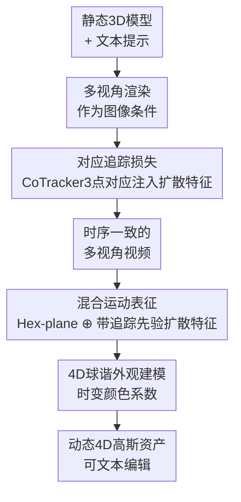

# Tracking-Guided 4D Generation: Foundation-Tracker Motion Priors for 3D Model Animation

**会议**: CVPR 2026  
**论文**: [CVF Open Access](https://openaccess.thecvf.com/content/CVPR2026/html/Sun_Tracking-Guided_4D_Generation_Foundation-Tracker_Motion_Priors_for_3D_Model_Animation_CVPR_2026_paper.html)  
**领域**: 3D视觉 / 4D生成  
**关键词**: 4D生成, 3D模型动画, 点追踪先验, 多视角视频扩散, 4D高斯泼溅

## 一句话总结
Track4DGen 把一个基础点追踪器（CoTracker3）的逐帧点对应关系注入多视角视频扩散模型和 4D 高斯重建的中间特征里，用显式的特征级时序监督压制 4D 资产生成中的外观漂移，在视频生成与 4D 生成两类基准上都超过 Animate3D 等基线。

## 研究背景与动机

**领域现状**：4D 资产生成的目标是从文本、单图、单目视频或一个静态 3D 模型出发，合成一个随时间演变、几何/外观/运动都连贯的可动画 3D 对象。当前主流范式是"两段式"：先用扩散模型生成时序一致的多视角视频，再把这些视频重建/精修成动态表示（可变形神经场、动态 3D 高斯、4D mesh）。其中 3D→4D 这条线（如 Animate3D）尤其实用——给一个现成的静态 mesh，条件化多视角视频扩散模型让它动起来。

**现有痛点**：即便基础多视角视频扩散模型（MV-VDM）单帧画质已经很高，**外观漂移（appearance drift）**仍是顽疾——同一个物体在不同帧之间会逐渐退化或不一致地变化，跨视角也会出现 Janus（多面）效应和时序抖动。在稀疏输入下同时保住外观和运动的时空一致性，是 4D 生成最难的地方。

**核心矛盾**：作者把漂移的根源归到监督信号上——现有方法的监督**只发生在像素/隐空间的视频扩散损失上**（即 $\mathcal{L}_{\text{diff}}$），缺少一个**显式的、特征级的、有时序感知的追踪监督**。扩散损失只要求每一帧"看起来对"，却从不要求"第 t 帧的某个点和第 t+1 帧的同一个点在特征空间里对得上"，于是时序一致性无人看管。

**本文目标**：给扩散生成器和 4D 重建器都补上一条显式的运动先验通道，让生成的中间特征本身就携带"哪个点追踪到哪个点"的信息。

**切入角度**：作者观察到两件事——(1) 扩散模型的隐状态里其实编码了可用于点追踪的判别性特征（前人工作已证），并且通过逐 block 探测发现 **U-Net 解码器第二个时空上采样块的特征对长程时序对应最稳**；(2) 基础追踪器 CoTracker3 用跨轨注意力做联合多点追踪，遮挡鲁棒性强，可以提供高质量的逐帧对应。

**核心 idea**：用基础追踪器导出的稠密点对应，作为辅助监督直接作用在扩散特征上（Stage One），再把这些"带追踪先验的扩散特征"喂进 4D 高斯重建（Stage Two），用显式时序监督替代纯像素监督来根治漂移。

## 方法详解

### 整体框架
Track4DGen 是一个两段式框架。输入是一个现成的静态 3D 模型（mesh）加一句文本提示，输出是一个时序连贯、可文本编辑的动态 4D 资产。**Stage One** 把静态 mesh 渲染成多视角图像作为图像条件，训练一个多视角视频扩散模型生成时序一致的多视角视频；关键在于用 CoTracker3 在真值视频上取稠密点轨迹，再把这些点定位到扩散特征里，用追踪损失逼着特征级对应跨帧对齐。**Stage Two** 把 Stage One 生成的多视角视频重建成动态 4D 高斯（4D-GS）：以静态高斯为标准姿态，用一个混合运动表征（Hex-plane 特征 ⊕ 带追踪先验的扩散特征）预测每帧的位姿形变，并用 4D 球谐建模随时间变化的颜色。两段都靠同一个基础追踪器提供的运动先验来加固。

### 关键设计

**1. 对应追踪损失：把基础追踪器的点对应注入扩散特征，给时序一致性上显式监督**

这是全文的核心，针对的就是"纯扩散损失管不住外观漂移"这个痛点。作者先做了一个特征探测实验：对一段真实视频加轻噪、跑去噪器、逐 block 抽特征图，用余弦相似度最近邻匹配去追踪第一帧上的一组查询点，结果发现 **U-Net 解码器第二个时空上采样块**（尤其是时空注意力里的时序运动模块）的特征对长程对应最强。基于这个发现，每个视角在第一帧用 $15\times 15$ 网格采点、用实例 mask 剔除物体外的点，训练时每视角随机取 8 个点（共 $8n$ 个），用 CoTracker3 追出它们在多视角视频里的轨迹，再借像素坐标到特征图坐标的映射把这些点双线性插值定位到上述扩散特征空间，取出隐描述子 $h(p^{i,j})$。

监督由两项损失组成。**对应损失** $\mathcal{L}_{\text{corr}}$ 要求相邻两帧上追踪到的同一点描述子在特征空间里保持一致，用余弦相似度实现：

$$\mathcal{L}_{\text{corr}} = \frac{1}{nf}\sum_{i=1}^{n}\sum_{j=1}^{f-1}\left(1-\operatorname{cos\_sim}\big(h(p^{i,j}),\,h(p^{i,j+1})\big)\right)$$

**位置损失** $\mathcal{L}_{\text{pos}}$ 则进一步约束几何：在扩散特征空间里用余弦相似度图做 soft-argmax 预测点的位置 $\hat{p}^{i,j}$，再用 Huber 损失把它和追踪真值对齐 $\mathcal{L}_{\text{pos}}=\frac{1}{nf}\sum_i\sum_{j\ge 2}L_{\text{Huber}}(p^{i,j}-\hat{p}^{i,j})$。Stage One 总目标为 $\mathcal{L}_1=\lambda_1\mathcal{L}_{\text{diff}}+\lambda_2\mathcal{L}_{\text{corr}}+\lambda_3\mathcal{L}_{\text{pos}}$。之所以有效，是因为它把"时序对应"从一个隐式期望变成了显式约束直接作用在最敏感的特征层上——而且追踪信息只在训练时当额外约束用，**推理时完全不需要追踪器**，零额外推理开销。网络上沿用 Animate3D 的 MV-VDM 骨干、MVDream 的多视角 3D 注意力、AnimateDiff 的时序注意力，并按 Animate3D 的做法冻结多视角 3D 注意力、只训 MV2V-Adapter 和时空注意力块以省显存。

**2. 混合运动表征：把带追踪先验的扩散特征和 Hex-plane 特征拼起来驱动 4D-GS 形变**

经典 4D-GS 只用 Hex-plane 特征学运动场，没有任何外部运动先验，因此重建出的动态几何容易糊。本文的做法是给每个时空采样点构造一个**混合特征**：既插值 Hex-plane 特征（六个平面 $\zeta_1\in\{(x,y),(x,z),(y,z),(x,t),(y,t),(z,t)\}$），又把 Stage One 那个第二上采样块的扩散特征拼进来——

$$\mathcal{F}=\bigcup_{\text{Hex}}\prod_{\zeta_1}\operatorname{interp}\big(\mathcal{H}^{\zeta_1},(\mathcal{X},f)\big)\;\oplus\;\bigcup_{\text{Diff}}\prod_{\zeta_2}\operatorname{interp}\big(\mathcal{D}^{\zeta_2},K[E](\mathcal{X},f)\big)$$

其中扩散特征是把高斯中心 $\mathcal{X}$ 用相机内参 $K$、外参 $E$ 投到 2D 扩散特征平面上取的；为了避免自遮挡处投错点带来的错误监督，作者还做了基于光线投射的可见性检查，丢弃被遮挡的 3D→2D 投影。混合特征 $\mathcal{F}$ 再过一个三头轻量 MLP 形变解码器 $\phi$，分别预测每帧的位移、旋转、缩放增量 $\Delta\mathcal{X}=\phi_{\mathcal{X}}(\mathcal{F}),\ \Delta r=\phi_r(\mathcal{F}),\ \Delta s=\phi_s(\mathcal{F})$。为什么有效：这些扩散特征是在 Stage One CoTracker 监督下训出来的，本身就编码了运动先验，相当于给 Hex-plane 这个纯几何插值器补上了"这个点该往哪动"的语义指引，从而强化了动态几何和外观的点表征。

**3. 4D 球谐外观建模：把球谐系数变成随时间的傅里叶级数，建模运动物体的时变颜色**

静态 3D-GS 的球谐只表达视角相关的颜色，物体一动起来颜色/光照就建不准。作者把每个球谐系数 $k_l^m$ 替换成一组随时间变化的截断余弦（傅里叶）基系数 $fr_i$，在 GS 优化阶段作为高斯属性一起优化：

$$\mathcal{C}_{4D}=\sum_{l=0}^{l_{\max}}\sum_{m=-l}^{l}k_l^m\,Y_l^m(\psi,\gamma),\qquad k_l^m=\sum_{i=0}^{w-1}fr_i\cos\!\left(\frac{i\pi}{N_t}t\right)$$

其中 $Y_l^m(\psi,\gamma)$ 是实球谐基，$l_{\max}$ 控制角度细节带宽，$N_t$ 是总帧数（设定时间频率尺度），$w$ 是保留的余弦项数。这样每个系数都成了时间 $t$ 的连续函数，颜色就能随运动平滑演化，提升了 4D 资产的颜色保真度。最终标准 4D 高斯在时刻 $t$ 更新为 $\mathcal{G}_{4D}=\{\mathcal{X}+\Delta\mathcal{X},\,\mathcal{C}_{4D},\,\alpha,\,r+\Delta r,\,s+\Delta s\}$，再泼溅、深度排序、$\alpha$ 混合渲出图像。

### 损失函数 / 训练策略
Stage One 用 $\mathcal{L}_1=\lambda_1\mathcal{L}_{\text{diff}}+\lambda_2\mathcal{L}_{\text{corr}}+\lambda_3\mathcal{L}_{\text{pos}}$，其中扩散过程对第 2~f 帧加噪 $z_t^{1:n,2:f}=\sqrt{\bar\alpha_t}z_0+\sqrt{1-\bar\alpha_t}\epsilon$，并对第一帧（多视角条件帧）注入一个时间相关噪声 $z_t^{1:n,1}=z_0+\beta_t\epsilon'$ 以鼓励足够的运动幅度。Stage Two 用 $\mathcal{L}_2=\lambda_4\mathcal{L}_{\text{rec}}+\lambda_5\mathcal{L}_{\text{4D-SDS}}+\lambda_6\mathcal{L}_{\text{ARAP}}$：运动重建损失 $\mathcal{L}_{\text{rec}}$ 用 Stage One 视频和 mask 监督渲染先抓粗运动，$z_0$-重建型 4D-SDS 损失蒸馏扩散先验精修细粒度运动，ARAP 损失约束刚性形变稳定形状。

## 实验关键数据

### 主实验
评测分两块：多视角视频生成（VBench 风格五指标）和 4D 生成（CLIP 语义对齐 + 用户研究）。基线为 Animate3D 和 DG4D。

视频生成（Diffusion4D 过滤集）：

| 方法 | I2V↑ | M.Sm↑ | T.Fli↑ | Dy.Sc↑ | Aest.Q↑ |
|------|------|-------|--------|--------|---------|
| DG4D | 0.834 | 0.983 | 0.982 | 1.019 | 0.445 |
| Animate3D | 0.919 | 0.991 | 0.989 | 1.348 | 0.465 |
| **Ours** | **0.933** | **0.992** | **0.991** | **1.356** | **0.470** |

4D 生成（Sketchfab28，CLIP 指标）：

| 方法 | CLIP-O(img)↑ | CLIP-O(text)↑ | CLIP-F(img)↑ | CLIP-F(text)↑ | CLIP-C↑ |
|------|------|------|------|------|------|
| DG4D | 0.8619 | 0.2578 | 0.8708 | 0.2592 | 0.9700 |
| Animate3D | 0.8812 | 0.2653 | 0.8906 | 0.2634 | 0.9801 |
| **Ours** | **0.8884** | **0.2664** | **0.8955** | **0.2664** | **0.9819** |

用户研究（Sketchfab28，1–5 分）上本文在四项（文本对齐 3.57 / 3D 对齐 3.87 / 运动 3.73 / 外观 3.44）均居首。

### 消融实验

| 配置 | I2V↑ | Aest.Q↑ | Dy.Sc↑ | 说明 |
|------|------|---------|--------|------|
| w/o Corrs. Loss | 0.844 | 0.347 | 1.505 | 去掉对应损失，一致性/美学崩塌 |
| w/o Pos. Loss | 0.921 | 0.462 | 1.435 | 去掉位置损失，一致性下滑 |
| Ours full（视频） | 0.933 | 0.470 | 1.356 | 完整 Stage One |

4D 生成侧消融（Sketchfab28）：

| 配置 | I2V↑ | M.Sm↑ | T.Fli↑ | Aest.Q↑ |
|------|------|-------|--------|---------|
| w/o Di. Feat | 0.932 | 0.994 | 0.990 | 0.532 |
| w/o 4D SH | 0.937 | 0.995 | 0.993 | 0.536 |
| **Ours full** | **0.940** | **0.996** | **0.994** | **0.538** |

### 关键发现
- **对应损失是漂移控制的主力**：去掉它后 I2V 从 0.933 暴跌到 0.844、Aest.Q 从 0.470 跌到 0.347，但 Dy.Sc 反而升到 1.505——说明没有时序约束时运动看似"更动"实则是噪声抖动，外观一致性被牺牲；位置损失则进一步把一致性从 0.921 补到 0.933。这正面印证了"漂移源于缺显式特征级时序监督"的假设。
- **混合扩散特征和 4D SH 各有贡献**：4D 生成侧去掉扩散特征（w/o Di.Feat）或 4D 球谐（w/o 4D SH），I2V/美学等指标都小幅下滑，二者对最终几何与颜色保真度都有正贡献，但增益幅度明显小于 Stage One 的追踪监督。
- **Dy.Sc 上不一定第一**：在 Animate3D 数据集上本文 Dy.Sc 0.778 略低于 Animate3D 的 0.787——追踪监督让运动更"克制干净"而非一味追求动态分，提示该指标对噪声运动有偏好，需结合一致性指标一起看。

## 亮点与洞察
- **把基础追踪器当"时序监督源"而非"推理组件"**：CoTracker3 只在训练时提供对应监督，推理时完全不参与，因此零额外推理成本却显著改善时序一致性——这种"训练时借外部基础模型、推理时丢掉"的范式很值得迁移到其他生成任务。
- **逐 block 探测找最强对应特征层**：先做一个 block-by-block 的特征追踪能力分析、定位到"解码器第二上采样块的时序模块"再施加监督，比盲目在所有层加约束更精准——这套"探测—定位—监督"的方法论可复用于任何想往扩散特征里注入结构先验的工作。
- **共定位特征拼接打通两段**：Stage Two 直接复用 Stage One 在相同特征层训出来的扩散特征，让追踪先验自然流入 4D 重建，而不是重新设计一套运动先验，工程上很省。

## 局限与展望
- **追踪质量是上界**：方法重度依赖 CoTracker3 的对应质量，强自遮挡、薄结构或高度非刚性运动下追踪失败会直接污染监督，虽然做了光线投射可见性检查但只能缓解。
- **每视角仅 8 点的稀疏监督**：训练时每视角只随机取 8 个追踪点，对大面积或细粒度局部运动的覆盖有限，密度和采样策略可能限制了对复杂运动的刻画。
- **评测规模偏小**：4D 生成主要在 Sketchfab28（28 个资产）和 Animate3D（20 个）上评，物体多样性有限；基线也只对比 Animate3D / DG4D 两个，更广的横向对比会更有说服力。
- **Dy.Sc 权衡**：在部分数据上动态分略逊，如何在压制漂移的同时不抑制合理的大幅运动是可继续优化的方向。

## 相关工作与启发
- **vs Animate3D**：最直接的对比对象。Animate3D 同样走 3D→4D、条件化多视角视频扩散再 4D-SDS 精修，但监督只在像素/隐空间，外观漂移仍在；本文在它的骨干上加了特征级追踪监督（Stage One）和混合扩散特征 + 4D SH（Stage Two），漂移和保真度都更好。
- **vs DG4D / EG4D（image-to-4D）**：这类方法先生成多视角视频再重建动态高斯，本文同属"先视频后重建"范式，但额外引入了基础追踪器的运动先验，时序一致性指标全面领先。
- **vs 经典 4D-GS**：经典 4D-GS 只用 Hex-plane 学运动场，本文把带追踪先验的扩散特征拼进去并补上时变球谐，等于给纯几何插值器补了语义运动指引。
- **vs SC4D / DreamMesh4D（video-to-4D）**：它们靠稀疏控制点/绑定 mesh 来解耦运动，本文则靠扩散特征里的稠密对应先验，思路互补。

## 评分
- 新颖性: ⭐⭐⭐⭐ "把基础追踪器的稠密对应当成特征级时序监督注入扩散，且推理时无开销"是一个干净且有道理的新切口。
- 实验充分度: ⭐⭐⭐⭐ 视频生成与 4D 生成双轨评测 + 消融 + 用户研究较完整，但 4D 评测数据集和基线数量偏小。
- 写作质量: ⭐⭐⭐⭐ 动机—假设—方法链条清晰，公式与图配套；部分指标权衡（Dy.Sc）讨论可更深入。
- 价值: ⭐⭐⭐⭐ 漂移是 4D 生成的核心痛点，本文给出可复用的"训练时借追踪监督"方案并附带 Sketchfab28 基准，对社区有实用价值。

<!-- RELATED:START -->

## 相关论文

- [\[CVPR 2026\] KV-Tracker: Real-Time Pose Tracking with Transformers](kv-tracker_real-time_pose_tracking_with_transformers.md)
- [\[CVPR 2026\] RigMo: Unifying Rig and Motion Learning for Generative Animation](rigmo_unifying_rig_and_motion_learning_for_generative_animation.md)
- [\[ICCV 2025\] AnimateAnyMesh: A Feed-Forward 4D Foundation Model for Text-Driven Universal Mesh Animation](../../ICCV2025/3d_vision/animateanymesh_a_feedforward_4d_foundation_model_for_textdri.md)
- [\[CVPR 2026\] Motion 3-to-4: 3D Motion Reconstruction for 4D Synthesis](motion_3-to-4_3d_motion_reconstruction_for_4d_synthesis.md)
- [\[CVPR 2026\] Human Geometry Distribution for 3D Animation Generation](human_geometry_distribution_for_3d_animation_generation.md)

<!-- RELATED:END -->
