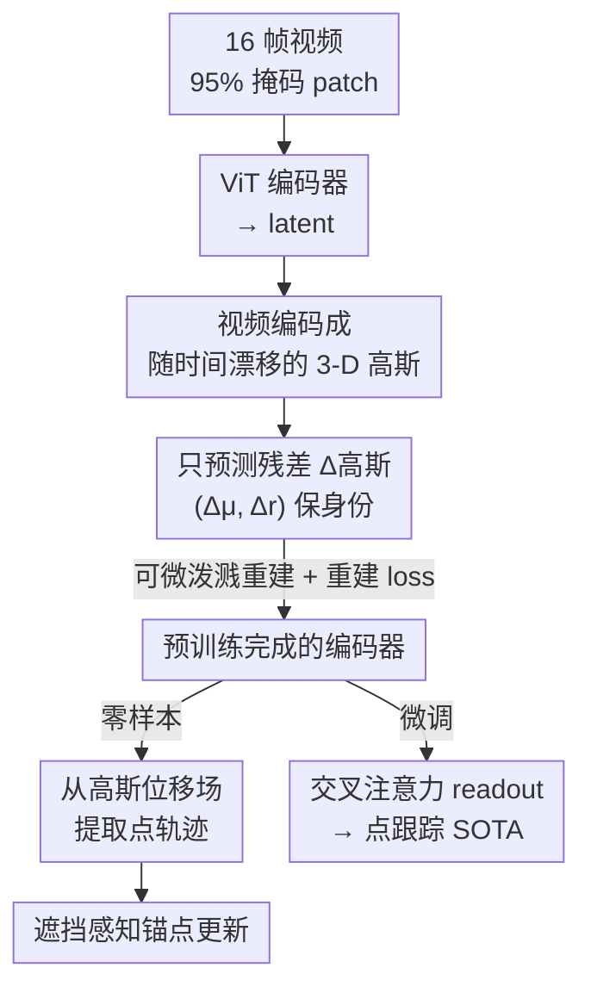

# Tracking by Predicting 3-D Gaussians Over Time

**会议**: CVPR 2026  
**论文**: [CVF Open Access](https://openaccess.thecvf.com/content/CVPR2026/html/Baranwal_Tracking_by_Predicting_3-D_Gaussians_Over_Time_CVPR_2026_paper.html)  
**代码**: https://github.com/tekotan/video-gmae （项目页 https://videogmae.org/）  
**领域**: 3D视觉 / 视频自监督 / 点跟踪  
**关键词**: 高斯泼溅, 自监督视频预训练, 点跟踪, 掩码自编码器, 时序对应

## 一句话总结
Video-GMAE 把一段视频自监督地编码成"一组随时间漂移的 3-D 高斯基元"——首帧预测完整高斯、后续帧只预测残差位移——这个归纳偏置逼着网络学会跨帧像素对应，于是无需任何跟踪标注就能零样本追点，微调后在 Kinetics/Kubric 上分别超过此前自监督方法 34.6% 和 13.1%。

## 研究背景与动机

**领域现状**：视频自监督学习（SSL）的两大主流是判别式（对比学习，如 SimCLR、MoCo、DINO）和重建式（掩码建模，如 MAE、VideoMAE、MAE-ST）。其中 MAE-ST/VideoMAE 用高掩码比（90%+）重建时空 patch，学到的表征在分类、检测上很强。点跟踪（point tracking）这边则是另一条线：RAFT、TAP、CoTracker、TAPIR 等几乎都靠合成数据的监督训练，或专门设计的架构。

**现有痛点**：作者发现一个反差——现有视频 SSL 学到的表征在"点跟踪"任务上表现很差。原因在于经典的"（时空）patch 预测"目标并不强制时序一致性：模型可以把每帧 patch 各自重建好，却完全不理解一个像素在长序列里跑到了哪里。也就是说，重建 loss 在"不懂对应关系"的情况下照样能被优化到很低，对应关系这件事根本没被监督信号逼出来。

**核心矛盾**：监督跟踪方法依赖昂贵的点轨迹标注/合成数据，泛化受限；自监督方法虽然不要标注，却因为目标函数太"松"而学不到对应关系。问题的根子是——**重建式 SSL 的目标里缺少一个把"同一个物理点跨帧保持身份"显式编码进去的归纳偏置**。

**切入角度**：作者的关键观察是，3-D 世界里物体的运动，投影到图像平面上就是点跟踪。如果把视频显式建模成"一个动态 3-D 场景的连续投影"，那么只要让同一个 3-D 基元在时间轴上保持身份、只发生位移，对应关系就被天然地写进了表征里。3-D Gaussian Splatting 提供了一个完全可微的渲染管线，正好可以把这个想法端到端训出来。

**核心 idea**：用"预测一组随时间漂移的 3-D 高斯并可微渲染重建视频"代替"独立重建每帧 patch"，让时序对应作为硬性归纳偏置涌现到表征里，于是跟踪能力零样本地浮现出来。

## 方法详解

### 整体框架
Video-GMAE 是一个 MAE 风格的编码器-解码器：输入 $k=16$ 帧 RGB（每帧切 $16\times16$ patch、95% 掩码比），ViT 编码器只处理可见 patch 得到 latent；ViT 解码器接收 latent + 可学习 query token，输出 $k\times n$ 个高斯基元（$n=256$/帧）。其中**首帧的 $n$ 个是自由空间里的完整高斯**，后续帧解码器**只吐残差 Δ高斯**，逐帧累加得到该帧的高斯集合，再用可微高斯泼溅渲染回所有帧，端到端用重建 loss 训练。训练完成后，模型不仅给出可迁移的 latent，还能通过一套零样本算法直接从高斯轨迹抽点轨迹；要追求 SOTA 则在 latent 上接一个交叉注意力 readout 做微调。

### 关键设计

**1. 把视频编码成随时间漂移的 3-D 高斯：用渲染归纳偏置逼出时序对应**

针对"patch 重建目标太松、不强制对应"的痛点，作者把视频的内部表示换成一组 3-D 高斯基元。每个基元沿用 3DGS 定义：中心 $\mu\in\mathbb{R}^3$、由缩放 $s\in\mathbb{R}^3$ 和四元数 $\phi\in\mathbb{R}^4$ 分解出的协方差 $\Sigma=RSS^TR^T$、颜色 $r\in\mathbb{R}^3$、不透明度 $o\in\mathbb{R}$，合成一个 14 维向量 $g=\{\mu,s,\phi,r,o\}$。关键在于——**同一个高斯在 $N$ 帧里保持身份，只通过位移演化**。由于渲染（投影 + 体素泼溅 alpha 合成）完全可微，重建梯度能一路回流到每个高斯参数。这样一来，"2-D 视频是一个动态 3-D 场景的一致投影"就成了硬性归纳偏置：模型想把视频重建好，就必须搞清楚每个高斯（即每个物理点）跨帧跑到了哪。作者明确指出这个偏置让 SSL 任务变难，从而把长程对应关系逼进 latent。

**2. 只预测残差 Δ高斯（Δμ、Δr）：让"身份保持"成为结构约束而非软监督**

如果每帧都独立预测完整高斯，身份对应就又散掉了。作者的做法是：解码器只在**首帧**预测完整的 $G_0=\{g_1,\dots,g_n\}$，从第 2 帧起只预测残差 $\Delta G_t=\{\Delta\mu_i^{(t)},\Delta r_i^{(t)}\}_{i=1}^n$，然后逐帧积分

$$G_t=\Delta G_t+G_{t-1},\qquad \mu_i^{(t+1)}=\mu_i^{(t)}+\Delta\mu_i^{(t)}.$$

注意残差只覆盖**位置 Δμ 和颜色 Δr**，缩放、旋转、不透明度在时间上保持不变。这种"基元固定、只动位移"的参数化，把"第 $i$ 个高斯在所有帧里是同一个东西"做成了架构层面的约束——它没法在不同帧里换成别的点。消融（表 3 左）验证了正是 **Δμ 这一项**既解锁了零样本跟踪、又改善了微调表征：只积分 Δμ 时 Davis AJ 44.4，只积分 Δr 时 42.5，两者都不积分（静态高斯）掉到 39.1，两者都要时 44.7。

**3. 从高斯位移场零样本提取点轨迹：把 3-D 运动渲染成 2-D 光流再追**

有了随时间漂移的高斯，怎么把它变成可评测的点轨迹？作者设计了一套零样本算法。先把每个高斯的 3-D 中心用训练时同一套相机内参 $K$、外参 $[R|t]$ 投影到像素坐标 $x_i^{(t)}=\Pi(K[R|t],\mu_i^{(t)})$，得到逐帧图像平面位移 $\Delta x_i^{(t+1)}=x_i^{(t+1)}-x_i^{(t)}$。然后**把这个 2-D 位移当成伪 RGB 颜色** $c_i^{(t)}=(\Delta x_{i,x}^{(t)},\Delta x_{i,y}^{(t)},0)$ 重新泼溅到图像平面，用不透明度加权得到一张稠密光流场

$$F^{(t)}(u)=\sum_{i=1}^{n}\alpha_i^{(t)}(u)\cdot\Delta x_i^{(t)},$$

其中 $\alpha_i^{(t)}(u)$ 是高斯 $i$ 在像素 $u$ 的可微泼溅可见度。任意查询点 $p$ 用双线性插值取 $F^{(t)}(p)$，沿光流前进一步就追到了下一帧。妙处在于：**复用了渲染器本身**——同一套泼溅机制，颜色通道一换就从"重建图像"变成"输出运动场"，不需要任何新的可学习模块。

**4. 基于锚点集的遮挡感知更新：用高斯混合权重判可见、抗遮挡抖动**

纯光流推进遇到遮挡会糊。作者借渲染器的软分配再加一层鲁棒性。在 $t=0$ 时一次性为每个点固定一组 top-$k$ 锚点高斯 $\mathcal{S}=\text{Topk}\{\alpha_j^{(t)}(u)\}$，定义逐帧**锚点质量**

$$\omega^{(t)}=\sum_{i\in\mathcal{S}}\alpha_i^{(t)}\big(p^{(t)}\big),$$

并在锚点集上重归一化得到混合权重 $\tilde\pi_i^{(t)}$。当 $\omega^{(t)}\ge\tau_{\text{vis}}$ 判为可见、否则判为遮挡。位置更新在"纯光流推进 $a^{(t)}$"与"top-$k$ 高斯混合提案 $s^{(t+1)}$"之间按 $\beta$ 混合：可见时 $p^{(t+1)}=(1-\beta)a^{(t)}+\beta s^{(t+1)}$，遮挡时直接用 $s^{(t+1)}$。令 $k=n,\tau_{\text{vis}}=0$ 就退化回忽略遮挡的纯光流。若更新后落到画面外则标遮挡。超参 $k=8,\tau_{\text{vis}}=0.5,\beta=0.3$ 在 Kubric 训练集上选定。这套设计正对应了实验里观察到的特性：轨迹更平滑、更"保守"，点一旦可见就持续保持、抖动少，遮挡判断也不像 GMRW-C 那样提前 1–3 帧误判。

### 损失函数 / 训练策略
预训练数据合并 Kinetics、Kubric、Davis 的训练集视频（只用无标注视频），整段端到端用渲染重建 loss 训练，无需任何跟踪标注。规模：64×V100，90 epoch，batch 128，lr 1e-3，AdamW（weight decay 5e-2），2000 步 warm-up + cosine 衰减，梯度裁剪 2.0。微调跟踪时用交叉注意力 readout：对编码器特征做 LayerNorm、加可学习时序嵌入、每帧用 64 维 Fourier 位置 query，16 头交叉注意力 → 残差 MLP（GeLU，hidden 4×）→ 线性层 + sigmoid 输出 3-D 向量（2-D 点 + 遮挡）。冻结评测只训 readout；微调则编码器与 readout 联合训练（单 A100，batch 8，50k 步）。

## 实验关键数据

### 主实验
评测用 TAP-Vid 协议的三个数据集（Kinetics、Davis、Kubric），三项指标：AJ（平均 Jaccard，越高越好）、$\delta^x_{\text{avg}}$（落在阈值像素半径内的预测占比）、OA（遮挡判断准确率）。

表 1：在相同冻结编码器设置下，对比三种视频预训练 backbone（同样用掩码自编码，差别只在 Video-GMAE 的对应感知解码器）。

| Backbone（frozen） | Kinetics AJ | Davis AJ | Kubric AJ |
|--------------------|-------------|----------|-----------|
| MAE-ST | 42.3 | 28.3 | 41.5 |
| VideoMAE | 46.9 | 31.8 | 44.8 |
| **Video-GMAE** | **65.1** | **46.7** | **62.4** |

同样的掩码自编码框架下，只因为换上"对应感知"的高斯残差解码器，三个数据集 AJ 全面大幅领先（Kinetics 相对 VideoMAE +38.8%、Kubric +39.3%），印证了归纳偏置的价值。

表 2（节选）：与自监督/监督跟踪方法的完整对比（stride=5）。

| 方法 | 类型 | Kubric AJ | Davis AJ | Kinetics AJ |
|------|------|-----------|----------|-------------|
| GMRW-C | 自监督 | 54.2 | 41.8 | 31.9 |
| **Video-GMAE zeroshot** | 自监督·零样本 | 54.3 | 41.3 | **60.1** |
| **Video-GMAE large frozen** | 自监督·冻结 | 65.1 | 46.7 | 62.4 |
| CoTracker3 | 监督 | – | 63.8 | 55.8 |
| **Video-GMAE large finetune** | 微调 | **75.1** | 57.9 | **75.1** |

零样本就能在 Kinetics 上（AJ 60.1）大幅超越最强自监督基线 GMRW-C（31.9），在 Kubric/Davis 与之相当；微调后在 Kubric、Kinetics 上超过所有监督方法，仅在 Davis 上落后于 CoTracker3/LocoTrack/BootsTAPIR（受 256 高斯的空间分辨率上限所限）。

### 消融实验

表 3 左（Δ高斯消融，Video-GMAE-large，Davis AJ）+ 右（帧长 vs stride，Video-GMAE-base）：

| 配置 | 关键指标 | 说明 |
|------|---------|------|
| Δμ + Δr（Full） | 44.7 | 完整，位置+颜色残差都积分 |
| 只 Δμ | 44.4 | 去掉颜色残差，几乎不掉 |
| 只 Δr | 42.5 | 去掉位置残差，掉 2.2 |
| 都不积分（静态高斯） | 39.1 | 退化最严重，掉 5.6 |
| 训练 4 帧 / stride 2 | 64.2 | 适度未来信息最有利 |
| 训练 24 帧 / stride 2 | 52.4 | 帧太长，对应正则过强反伤表征 |

### 关键发现
- **位置残差 Δμ 是涌现跟踪的关键**：只保留 Δμ（44.4）几乎不掉点，去掉 Δμ（只 Δr，42.5）或全静态（39.1）显著变差——说明"运动对应"而非"外观变化"才是逼出可跟踪表征的核心。
- **帧长存在甜区**：训练 4–8 帧能引入有用的未来信息（stride=2 时 AJ 49.2→64.2），但 16/24 帧时对应感知正则过强反而压低表征质量（AJ 跌到 57.5/52.4）。这也是作者列出的局限之一。
- **质性上更稳更保守**：相比 GMRW-C，Video-GMAE 轨迹抖动少、遮挡判断不提前误判（OA 普遍更高，如 Kinetics zeroshot OA 90.7 vs 72.9）；代价是 256 个高斯限制了细小快速运动物体的分辨率，这类场景 GMRW-C 反而更准。
- **外观歧义鲁棒性相当**：在自建的"2–5 个近乎一样的物体"Kubric 基准上，Video-GMAE-zeroshot 51.1 AJ vs GMRW-C 48.1，两者都吃力但本文略好。

## 亮点与洞察
- **用"渲染难度"换"表征质量"**：核心洞察是让 SSL 任务变难（强制 3-D 对应）反而让表征更好。这跟"高掩码比让 MAE 更强"是一脉相承的思路，但这里的难度来自显式的物理归纳偏置，更可解释。
- **零样本跟踪器"白送"**：跟踪能力不是训练目标，而是从高斯轨迹里涌现出来的副产品——把渲染器颜色通道一换就得到稠密光流场，无需新参数。这个"复用可微渲染器做两件事"的 trick 很优雅，可迁移到任何把场景表示成可泼溅基元的方法。
- **残差参数化即身份约束**：把"同一个点跨帧是同一个东西"做进网络结构（只动 Δμ/Δr），而不是靠 loss 软约束，是这篇最干净的设计——它让对应关系无处可逃。

## 局限与展望
- **静态相机假设**：预训练假设相机不动，对互联网风格视频不成立，也导致无法恢复 metric 级别的真实 3-D 信息（高斯只是"一致的投影"而非真几何）。引入相机位姿估计是自然的下一步。
- **对应正则在长视频上反噬**：帧数很大时这个正则开始伤害学习（表 3 中 24 帧明显掉点），需要更软/自适应的对应约束才能 scale 到长序列。
- **256 高斯的分辨率上限**：每帧仅 256 个高斯，限制了渲染与表征精度，对小而细、大位移的物体跟踪不如逐像素方法（如 GMRW-C 在这类场景更准）。增大基元数或做自适应密度控制应能直接改善零样本跟踪。

## 相关工作与启发
- **vs VideoMAE / MAE-ST**：都用掩码自编码 + ViT，但它们重建的是 patch、对应关系不被强制；本文把解码目标换成"随时间漂移的 3-D 高斯 + 残差"，在完全相同的冻结评测下三数据集 AJ 大幅领先（如 Kinetics 65.1 vs 46.9），说明涨点来自归纳偏置而非容量。
- **vs GMRW / CRW（自监督跟踪）**：它们把跟踪建模成 patch/pixel 的随机游走 + 循环一致性，是直接为跟踪设计的目标；本文跟踪是预训练的涌现产物，零样本在 Kinetics 上反超 GMRW-C 近一倍，且轨迹更稳、遮挡更准，但在细节丰富的大位移区域不如 GMRW-C。
- **vs CoTracker3 / TAPIR / LocoTrack（监督跟踪）**：这些靠合成数据监督训练；本文微调后在 Kubric/Kinetics 超过它们、仅 Davis 落后，价值在于**几乎不需要跟踪标注**就逼近甚至超过监督 SOTA，把"标注成本"这条线显著拉低。

## 评分
- 新颖性: ⭐⭐⭐⭐⭐ 把视频 SSL 与可微高斯渲染缝合、让跟踪从对应感知预训练里涌现，角度新且自洽。
- 实验充分度: ⭐⭐⭐⭐ 三数据集 × 零样本/冻结/微调全覆盖，消融到位；但仍假设静态相机、缺真实带相机运动视频的评测。
- 写作质量: ⭐⭐⭐⭐ 动机清晰、公式完整、质性分析坦诚（主动讲清自己输给 GMRW-C 的场景）。
- 价值: ⭐⭐⭐⭐⭐ 用无标注视频逼近监督跟踪 SOTA，且给出"对应感知生成式目标"这条可推广的视频 SSL 新路线。

<!-- RELATED:START -->

## 相关论文

- [\[CVPR 2026\] KV-Tracker: Real-Time Pose Tracking with Transformers](kv-tracker_real-time_pose_tracking_with_transformers.md)
- [\[CVPR 2026\] AnthroTAP: Learning Point Tracking with Real-World Motion](anthrotap_learning_point_tracking_with_real-world_motion.md)
- [\[CVPR 2026\] Fast Spatial Tracking with Visual Geometry Transformer](fast_spatial_tracking_with_visual_geometry_transformer.md)
- [\[CVPR 2026\] ZipMap: Linear-Time Stateful 3D Reconstruction via Test-Time Training](zipmap_linear-time_stateful_3d_reconstruction_via_test-time_training.md)
- [\[CVPR 2026\] TESO: Online Tracking of Essential Matrix by Stochastic Optimization](teso_online_tracking_of_essential_matrix_by_stochastic_optimization.md)

<!-- RELATED:END -->
