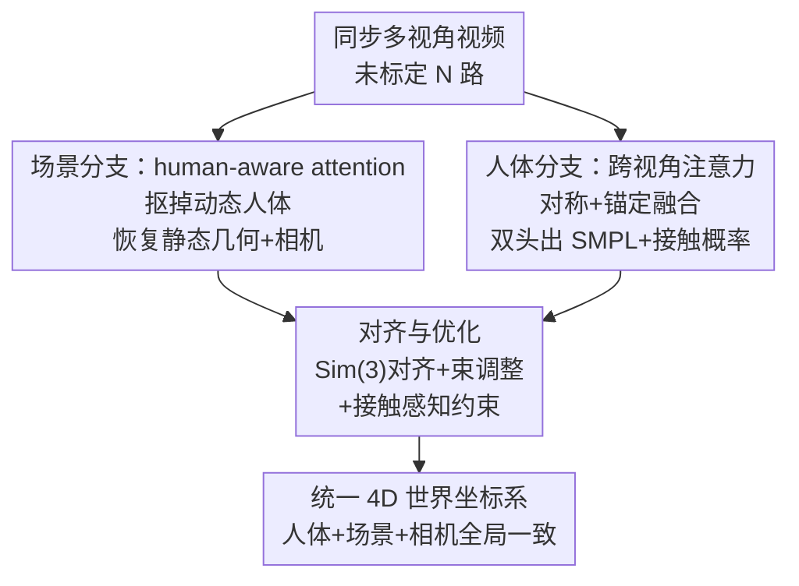

# TROPHIES: Temporal Reconstruction of Places, Humans, and Cameras from Multi-view Videos

**会议**: CVPR 2026  
**论文**: [CVF Open Access](https://openaccess.thecvf.com/content/CVPR2026/html/Liu_TROPHIES_Temporal_Reconstruction_of_Places_Humans_and_Cameras_from_Multi-view_CVPR_2026_paper.html)  
**领域**: 3D视觉  
**关键词**: 多视角视频, 人体-场景联合重建, 4D重建, 相机位姿, 接触约束

## 一句话总结
TROPHIES 提出"多视角视频下统一重建人体、场景、相机"这一新任务，用一个解耦的人体分支 + 即插即用的场景分支 + 全局对齐优化模块，把动态人体、静态几何和相机轨迹放进同一个度量一致的 4D 世界坐标系，在 EgoHumans / EgoExo4D 上把 W-MPJPE 砍掉一半以上。

## 研究背景与动机

**领域现状**：理解人在 3D 环境里如何运动与交互是 CV 和具身智能的长期目标。多年来人体运动估计（HMR2、TRAM、GVHMR 等）和静态场景重建（DUSt3R、MonST3R、CUT3R 等）各自都做得很好，但它们重建的是"互相脱节的两个世界"。

**现有痛点**：人体估计器在局部相机坐标系里预测姿态，时间上会漂移；场景重建管线只能恢复 up-to-scale 的几何、还往往把动态人体当噪声忽略掉。少数联合方法（JOSH、Human3R）只支持单视角且严重依赖先验，导致尺度不一致、人脚穿地/悬空这类物理上不成立的结果；多视角的 HSfM 又是逐帧独立优化，时序上尺度会逐帧漂移、聚合起来人体位置乱跳。

**核心矛盾**：缺一个**把人体、场景、相机一起放进全局一致 4D 世界**的统一框架。难点在于要同时整合几何线索、运动线索和物理约束，并把多个互相独立的坐标系对齐到同一个参考系——单独做好任何一块都不够，关键是"耦合"。

**本文目标**：定义并求解新任务 *unified human–scene–camera reconstruction from multi-view videos*：给定时间同步的多路视频，联合估计动态人体 $H_t^h$、静态场景点图 $S_t^n$ 和相机参数 $(R_t^n, t_t^n, \alpha_t)$，全部统一在一个度量世界坐标系里。

**切入角度**：作者选**多视角**形式，因为多视角能提供更强的几何线索、削弱尺度歧义；同时强调结构是 view-agnostic 的——单视角时退化为一个时序连贯、尺度稳定的版本，因此能覆盖多相机阵列、稀疏相机、手持单目等各种采集。

**核心 idea**：用"人体分支 + 场景分支 + 全局对齐优化"三件套，让场景分支借助 human-aware attention 把动态人体从静态几何里"抠掉"、人体分支借助跨视角注意力拿到多视角一致的 SMPL，最后用 Sim(3) 对齐 + 束调整 + 接触约束把两条分支**紧耦合**到同一坐标系。

## 方法详解

### 整体框架
TROPHIES 输入是一组未标定、时间同步的多视角视频 $\{V^n\}_{n=1}^N$，输出是同一度量世界坐标系下随时间连贯的人体、静态场景点图和相机轨迹。它把重建拆成三个协作组件：**场景分支**用 human-aware attention 在不被人体运动干扰的前提下恢复静态几何与相机位姿；**人体分支**用对称 + 锚定的跨视角注意力从同步多视角里估计时序连贯的 SMPL，并额外吐出"静止/接触概率"；**对齐与优化模块**先用 Sim(3) 把外部估计（SLAM 轨迹、单目深度）配准到场景分支坐标系，再用人体-场景联合束调整 + 接触感知优化把三者拧到一起，得到物理上站得住的 4D 重建。

### 关键设计

**1. 场景分支：用 human-aware attention 在动态人体存在时仍稳住静态几何**

痛点很直接：DUSt3R / MonST3R / CUT3R 这类稠密多视角重建假设场景是静态的，一旦画面里有人在动，人体区域的特征会"污染"跨视角匹配，导致几何和相机轨迹崩坏。常规做法是显式分割再扣掉，但分割不准就连带出错。作者改成在**注意力层里调制权重**来隐式压制动态区域，而且整个分支 **training-free**（骨干冻结，只改推理过程）。

对 DUSt3R / MonST3R，给定不同视角、不同时刻的图像，骨干 $\mathcal{B}$ 预测稠密点图和相机参数，但作者注入一个 human 掩码 $M_{\text{human}}^{a\leftarrow b} = (1-M_{\text{human}}^a)\otimes(M_{\text{human}}^b)^T$（$\otimes$ 为外积），使来自视角 $b$ 人体区域的 token 不向视角 $a$ 的静态区域传信息，实现方式是把对应注意力直接置零：

$$\text{softmax}^{a\leftarrow b}(\hat{A})=\begin{cases}0 & \text{if } M_{\text{human}}^{a\leftarrow b}\\ \text{softmax}(A^{a\leftarrow b}) & \text{otherwise}\end{cases}$$

而 CUT3R 因为带记忆机制没法这样改，作者改用**多记忆解耦**：一个记忆库聚合同一时刻多视角的人体+场景特征（保空间一致），另一个记忆库跨时间存静态场景特征（保时序稳定），从而把静态与动态在时间和视角两个维度上分开。直觉上，同一时刻的不同视角应当共享信息以保证多视角一致，但跨时刻只让**非人体 patch** 交换信息、人体 patch 在注意力里被屏蔽，避免人运动带来的不一致。

**2. 人体分支：两步跨视角注意力（对称交互 + 锚定融合）把多视角线索压进一个锚视角**

单视角人体方法只建模时间依赖、无法解决跨视角歧义、也不保证多相机一致。人体分支对每个视角用一个**权重共享**的 Human Video Transformer 抽时空 token，然后做两步跨视角交互。第一步**对称交互**：所有视角的 token 互相 attend，捕捉几何对应和互补可见性，得到多视角上下文特征 $F'_n$。第二步**锚定融合**：指定一个锚视角（通常是正面/最稳的相机）出 query，其余参考视角出 key/value：

$$F''_{\text{anchor}}=\text{softmax}\!\left(\frac{Q_{\text{anchor}}K_{\text{ref}}^T}{\sqrt{d}}\right)V_{\text{ref}}$$

这样锚视角的表示被参考视角的几何/外观线索增强，但保留自己的空间结构。训练时锚视角随机采样以增强泛化，推理时选人体检测置信度最高的视角，且**只用锚视角的 3D 关节作为输出**——因为它已经通过两步注意力融合了多视角信息，省去多视角后处理。融合后的特征经 Transformer Decoder + Temporal Layer（先跨视角再跨时间的层级建模）解码，由**双头**输出：(1) SMPL 参数 $(\phi_{(n,t)}^h,\theta_{(n,t)}^h,\beta_n^h)$；(2) 静止/接触概率图 $p_{(n,t)}^h$，标出人体哪些区域可能与场景接触，为后续优化提供物理约束。

**3. 对齐与优化：Sim(3) 对齐 + 人体-场景联合束调整 + 接触感知优化，把两条分支拧进同一度量世界**

两条分支各自坐标系/尺度不一致，必须显式耦合。**对齐**阶段对每个外部估计求一个相似变换 $S_i=[s_i,R'_i,T'_i]\in\text{Sim}(3)$，把它配准到场景分支坐标系：

$$S_i=\arg\min_{S\in\text{Sim}(3)}\sum_{\mathbf{x}\in\Omega_i}\left\|S\cdot K^{-1}[\mathbf{x},D_i(\mathbf{x})]-\mathbf{P}_i(\mathbf{x})\right\|_2^2$$

对动态相机序列，先用 DROID-SLAM 求 up-to-scale 的相对位姿，再用 ZoeDepth 估每帧深度补上绝对尺度，二者一起解上式消除单目 SLAM 的尺度歧义；对静态相机则直接用 ZoeDepth 估深度再做同一个 Sim(3) 配准。这样一个目标同时覆盖动/静两种采集。

**优化**阶段做两件事。其一是**人体-场景联合束调整**，把重投影误差在所有帧/视角上最小化，同时更新相机外参、场景几何和人体姿态：$\mathcal{L}_{\text{BA}}=\frac{1}{NT}\sum_{n,t}\mathcal{L}_{\text{Scene}}+\frac{1}{NTH}\sum_{n,t,h}\mathcal{L}_{\text{Human}}$，其中场景项约束点图重投影、人体项约束 SMPL 关节与 2D 检测关节对齐。其二是**接触感知优化**：基于对齐后的重力方向和估计的地面，在 SMPL 手脚上取一组潜在接触顶点 $\mathcal{C}$，鼓励它们贴近场景表面、同时惩罚穿透：

$$\mathcal{L}_{\text{contact}}=\sum_{\mathbf{v}\in\mathcal{C}}\Big(w_c\cdot\text{dist}(\mathbf{v},\mathcal{S}_{\text{surface}})^2+w_p\cdot\max(0,-\mathbf{n}_{\mathcal{S}}^\top(\mathbf{v}-\mathbf{p}_{\mathcal{S}}))^2\Big)$$

第一项维持接触稳定（脚踏实地），第二项惩罚穿到地面以下。总目标 $\mathcal{L}_{\text{opt}}=\mathcal{L}_{\text{BA}}+\lambda_c\mathcal{L}_{\text{contact}}$。正是这一阶段把"重力对齐 + 接触先验 + 跨视角时序一致"显式写成约束，才让人脚不再悬空、人不再穿墙，得到物理上成立的全局重建。

### 损失函数 / 训练策略
场景分支完全 **training-free**（骨干冻结，仅改推理）。人体分支在 2 张 A800 上用 AdamW、batch=16 序列（每序列 16 帧窗口）三阶段训练：① 以 TRAM 权重初始化，冻主干只训接触头 10K 步（3DPW / BEDLAM / Human3.6M）；② 只训锚定跨注意力、冻其余 20K 步（EgoHumans）；③ 全参数微调 2K 步（全部数据集）。

## 实验关键数据

### 主实验
在 EgoHumans 和 EgoExo4D 两个大规模多视角数据集上评测。人体指标用 W-MPJPE / WA-MPJPE / PA-MPJPE / Accel，相机指标用 TE / s-TE / RRA / CCA / s-CCA。三种骨干都接入框架，全面优于逐帧的 HSfM：

| 数据集 | 方法 | W-MPJPE↓ | PA-MPJPE↓ | Accel↓ | TE↓ | s-CCA@100↑ |
|--------|------|----------|-----------|--------|-----|-----------|
| EgoHumans | HSfM* | 227.82 | 21.93 | 57.89 | 1.79 | 0.52 |
| EgoHumans | TROPHIES (DUSt3R) | 106.31 | 22.74 | 13.74 | 1.31 | 0.63 |
| EgoHumans | TROPHIES (CUT3R) | **97.54** | **20.71** | 14.23 | **1.03** | **0.63** |
| EgoExo4D | HSfM* | 123.12 | 17.82 | 49.27 | 2.85 | 0.91 |
| EgoExo4D | TROPHIES (CUT3R) | **91.7** | 16.92 | 16.72 | **1.38** | **0.99** |

相比 HSfM，W-MPJPE 降幅超过 50%、PA-MPJPE 改善 1.5× 以上，Accel（运动平滑度）显著更低，说明全局联合优化比逐帧独立优化在时序一致性上有质变。

### 消融实验
人体分支单独评测（EgoHuman，All Views / Anchor View）：

| 配置 | PA-MPJPE↓ | MPJPE↓ | Accel↓ | 说明 |
|------|-----------|--------|--------|------|
| VIMO (with finetuning) | 41.4 | 81.2 | 17.9 | 最强单视角基线 |
| TROPHIES 人体分支 (w/o gravity) | 39.2 | 79.1 | 17.6 | 加跨视角注意力即超基线 |
| TROPHIES 人体分支 (with gravity) | **38.8** | **77.7** | **16.8** | 再加重力约束最佳 |

场景分支 human-aware attention 即插即用消融（Tab. 4）：

| 骨干 | TE↓ | AE↓ | RRA@100↑ | 说明 |
|------|-----|-----|----------|------|
| DUSt3R | 3.20 | 107.21 | 0.65 | baseline |
| DUSt3R + human-aware attn | 3.05 | 104.93 | 0.69 | TE/AE/RRA 全升 |
| CUT3R | 1.90 | 106.92 | 0.65 | baseline |
| CUT3R + human-aware attn | **1.83** | 103.34 | 0.68 | 受益最大，与多记忆设计协同 |

### 关键发现
- **三种骨干都同等受益**，验证了框架是 backbone-agnostic、即插即用的：场景分支甚至无需训练就能改善 4–6% 的轨迹误差。
- **CUT3R 配多记忆解耦收益最大**（TE 1.90→1.83、s-CCA 0.48→0.52），说明把"静态/动态在时间与视角上解耦"和它本身的记忆机制最契合。
- **重力约束是免费午餐**：人体分支加上重力对齐后 MPJPE 从 79.1→77.7、Accel 从 17.6→16.8，稳定了竖直方向运动、抑制漂移。
- EgoHumans 的相机指标普遍低于 EgoExo4D，因为前者是绑在移动主体上的自我视角相机、视角剧变 + 运动模糊 + 遮挡，是更难的设置。

## 亮点与洞察
- **把"动态人体"从干扰项变成可被注意力显式屏蔽的对象**：用掩码外积 $M^{a\leftarrow b}_{\text{human}}=(1-M^a)\otimes(M^b)^T$ 在注意力层置零，比"先分割再扣掉"更鲁棒，而且对 DUSt3R/MonST3R 完全免训练，迁移成本极低。
- **"对称交互 + 锚定融合 + 只输出锚视角"** 这套两步注意力很巧：既吃到多视角互补信息，又把输出收敛到单个视角的关节，避免多视角结果再做后融合，几何完整性和算力之间取了个聪明的平衡。
- **接触概率头 + 接触感知 loss 的闭环**：人体分支预测的 stationary probability 不是摆设，而是直接喂给优化阶段当物理约束，让"人脚踏地/不穿墙"这种常识以可微方式落地——这种"感知输出反哺优化"的设计可迁移到任何 human-scene 交互任务。
- 整个框架对单视角自然退化（view-agnostic），意味着同一套模型能横跨多相机阵列到手持单目，工程上很实用。

## 局限与展望
- 对齐阶段重度依赖外部组件（DROID-SLAM 求相对位姿、ZoeDepth 补绝对尺度），这些组件若在低纹理/强模糊场景失效，会直接拖累全局尺度恢复，论文未深入讨论其失败模式。
- human-aware attention 依赖人体掩码（EgoHumans 用标注、EgoExo4D 用 Grounded SAM 2），掩码质量是隐形上限；多人重叠或严重遮挡时掩码外积是否仍稳健，缺少专门分析。
- 评测只在 EgoHumans / EgoExo4D 两个数据集，且 EgoHumans 上人体绝对误差仍近百毫米级（W-MPJPE ~97），离"物理精确"还有距离；接触约束的 $w_c, w_p, \lambda_c$ 权重敏感性也未给出。
- 多记忆解耦只对 CUT3R 有效、对掩码类骨干用另一套实现，框架内部并不统一，增加了落地复杂度。

## 相关工作与启发
- **vs HSfM**：HSfM 也做多视角人体-场景，但**逐帧独立优化**，每帧尺度不协调、聚合后漂移；TROPHIES 在整段序列上统一尺度并联合优化全部组件，时序一致性是质的区别（W-MPJPE 直接腰斩）。
- **vs JOSH / Human3R**：它们联合推断人体与场景但局限单视角、重度依赖先验，导致尺度不一致和物理不合理；本文用真·多视角 + Sim(3) 紧耦合 + 接触约束解决了这点。
- **vs DUSt3R / MonST3R / CUT3R**：这些是本文场景分支的骨干，原本假设静态场景、遇到人就退化；本文的 human-aware attention 是给它们打的"动态补丁"，即插即用且（掩码类）免训练。
- **vs TRAM / GVHMR / VIMO 等单视角人体方法**：它们只建模时间、无法解跨视角歧义；本文人体分支显式吃多视角并强制视角一致，在 PA-MPJPE/MPJPE/Accel 上全面更优。

## 评分
- 新颖性: ⭐⭐⭐⭐⭐ 提出并系统求解"多视角人体-场景-相机统一 4D 重建"新任务，三件套设计各有巧思
- 实验充分度: ⭐⭐⭐⭐ 两个大规模数据集 + 三骨干 + 分支级消融较完整，但对外部组件失败模式与权重敏感性分析偏少
- 写作质量: ⭐⭐⭐⭐ 任务定义清晰、公式齐全、图文对照好，个别 OCR/排版瑕疵不影响理解
- 价值: ⭐⭐⭐⭐⭐ 对 AR/VR、机器人、具身智能里"人在场景中如何运动"的全局一致理解有直接价值，且即插即用易扩展

<!-- RELATED:START -->

## 相关论文

- [\[CVPR 2025\] Reconstructing People, Places, and Cameras](../../CVPR2025/3d_vision/reconstructing_people_places_and_cameras.md)
- [\[CVPR 2026\] LiDAR Prompted Spatio-Temporal Multi-View Stereo for Autonomous Driving](lidar_prompted_spatio-temporal_multi-view_stereo_for_autonomous_driving.md)
- [\[CVPR 2026\] 4D Reconstruction from Sparse Dynamic Cameras](4d_reconstruction_from_sparse_dynamic_cameras.md)
- [\[CVPR 2026\] SparseCam4D: Spatio-Temporally Consistent 4D Reconstruction from Sparse Cameras](sparsecam4d_spatio-temporally_consistent_4d_reconstruction_from_sparse_cameras.md)
- [\[CVPR 2026\] WeatherCity: Urban Scene Reconstruction with Controllable Multi-Weather Transformation](weathercity_urban_scene_reconstruction_with_controllable_multi-weather_transform.md)

<!-- RELATED:END -->
