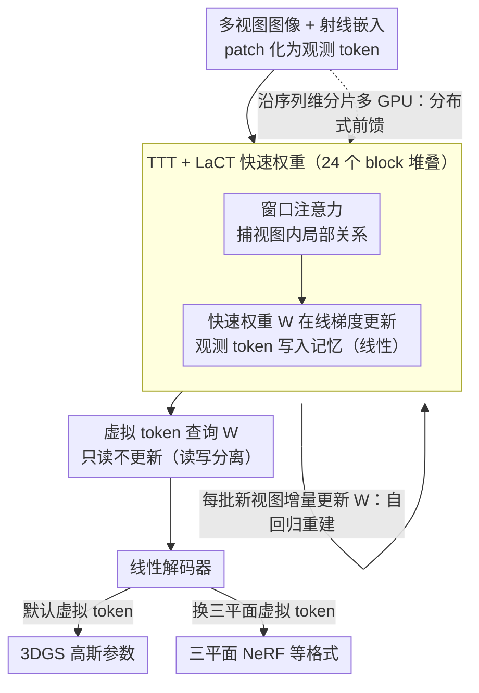

# tttLRM: Test-Time Training for Long Context and Autoregressive 3D Reconstruction

**会议**: CVPR 2026  
**arXiv**: [2602.20160](https://arxiv.org/abs/2602.20160)  
**领域**: 3D视觉  
**关键词**: 3D重建, Test-Time Training, 大重建模型, 高斯溅射, 自回归重建  

## 一句话总结

tttLRM 首次将 Test-Time Training (TTT) 引入大规模3D重建模型，利用 LaCT 层以线性复杂度实现长上下文和自回归3D高斯重建，通过将多视图观测压缩到 TTT 快速权重中形成隐式3D表示，再解码为显式3DGS等格式，在物体和场景级数据集上达到了 SOTA 性能。

## 研究背景与动机

从流式视觉输入中重建显式3D表示是3D视觉的核心目标，但现有方法存在明显瓶颈：

**传统优化方法**（NeRF、3DGS）：需要逐场景优化，耗时数分钟到数小时

**前馈大重建模型**（LRM、GS-LRM）：基于注意力机制，输入视图数受限（通常 ≤4 张），因为注意力复杂度为 $O(N^2)$

**Long-LRM**：虽扩展到 32 视图，但双向注意力仍阻碍进一步扩展，且无法处理流式输入

**隐式潜在3D表示**（LVSM 等）：新视图合成质量好，但渲染速度慢、缺乏可控性和可解释性

核心矛盾在于：**长上下文建模需要超越注意力机制的线性复杂度方案，同时还要支持流式/自回归推理**。

tttLRM 的灵感来源于人类感知的类比：人类观察连续视觉流 → 构建抽象内部表示 → 按需解码为显式3D结构。TTT 框架的快速权重恰好对应这种"内部记忆"机制。

## 方法详解

### 整体框架

tttLRM 想解决的是：现有前馈大重建模型靠注意力，复杂度 $O(N^2)$，输入视图一多就扱不住（GS-LRM ≤ 4 张、Long-LRM 到 32 张就到头，且都没法处理流式输入）。它的破法是把"序列建模"换成 Test-Time Training：把多视图观测压进一组在推理时在线更新的"快速权重"$W$，让 $W$ 充当随观测增多而不断完善的隐式 3D 记忆，再让虚拟视图 token 去查询它、线性解码出显式 3DGS。整条流程三步：图像 patch 化投影成 token → LaCT 层用 token 迭代更新快速权重 $W$ → 虚拟视图 token 查询 $W$、线性解码器输出 3DGS 参数。灵感来自人类感知：看连续视觉流 → 构建抽象内部表示 → 按需解码成显式 3D。

### 关键设计

**1. TTT + LaCT 快速权重：用线性复杂度的在线学习取代注意力**

注意力的平方复杂度是长上下文的根本瓶颈。TTT 把序列建模转成在线学习——快速权重 $W$ 在推理时按输入的 key-value 对做梯度更新，把 KV 缓存压成固定大小的神经记忆：

$$W \leftarrow W - \eta \nabla \mathcal{L}_{\text{MSE}}(f_W(k), v)$$

LaCT（Large Chunk TTT）进一步用大块更新（最多 1M token）、块内梯度累加来吃满 GPU。每个 LaCT 层含三件事：窗口注意力（捕视图内局部关系）、快速权重更新（线性）、快速权重应用（线性）。这样输入视图数不再受平方复杂度限制，更关键的是解锁了注意力模型根本做不到的流式/自回归推理。

**2. 模型架构与虚拟 token 解码：观测进 W、查询出 3D**

模型由 24 个 LaCT block 堆成，隐藏维 768、patch 大小 $8 \times 8$。每张输入图 $\mathbf{I}_i$ 和射线嵌入 $\mathbf{R}_i \in \mathbb{R}^{H \times W \times 9}$ 拼接后 patch 化、token 化，按三步走：

$$\mathbf{T}_i = \mathbf{T}_i + \text{WinAttn}(\mathbf{T}_i)$$
$$W = \text{Update}(\{\mathbf{T}_i\}_{i=1}^N)$$
$$\mathbf{T}_i^v = \text{Apply}(W, \mathbf{T}_i^v)$$

虚拟 token $\mathbf{T}^v$ 只参与 Apply、不更新 $W$，解码器把它转成每 patch 的高斯参数（颜色、尺度、旋转、不透明度、深度）。观测 token 负责"写记忆"、虚拟 token 负责"读记忆"，读写分离。也正因为输出表示完全由虚拟 token 决定，这套架构对 3D 格式是通用的：保持同一组快速权重不变，把虚拟 token 换成三平面 token 去查询 $W$，就能解码成三平面 NeRF 等其他 3D 表示，无需改动 backbone。

**3. 自回归重建：把模型变成类 RNN 的在线流式推理**

因为更新是线性的，模型可以像 RNN 一样增量跑：初始化 $W \leftarrow W_0$，每批次 $b$ 到来时更新 $W \leftarrow \mathcal{F}(W, \mathcal{I}_{(b)})$ 并立刻预测 $G_{(b)} \leftarrow \mathcal{F}(W, \mathcal{I}^v_{(b)})$，返回最终高斯 $G_{(B)}$。每批（如 4 张图）来就增量更新快速权重并即时出 3D 高斯，支持在线渐进重建——这是注意力模型给不了的能力。

**4. 分布式前馈重建：序列并行吃下大量视图**

为了塞进更多视图和更高分辨率，沿序列维把 token 分片到多 GPU：各 GPU 同步快速权重后独立预测自己那批视图的高斯，聚合成完整场景，再各自渲染子集新视图算损失、梯度 All-Reduce。正因为 LaCT 更新是线性的，梯度能简单地 All-Reduce 同步，训练推理都能近线性多卡加速。

### 损失函数 / 训练策略

$$\mathcal{L} = \mathcal{L}_{\text{RGB}} + \lambda_{\text{depth}} \mathcal{L}_{\text{depth}} + \lambda_{\text{opacity}} \mathcal{L}_{\text{opacity}}$$

渲染损失为 MSE + VGG-19 感知损失；深度正则用单目深度估计器生成伪 GT 的尺度不变深度损失；不透明度正则减少不透明高斯数量。

## 实验关键数据

### 物体级重建（GSO 数据集，Tab. 1）

| 方法 | 分辨率 | 视图数 | 时间 (s) | PSNR ↑ | SSIM ↑ | LPIPS ↓ |
|------|--------|--------|----------|--------|--------|---------|
| GS-LRM | 256² | 8 | 0.1 | 31.55 | 0.964 | 0.028 |
| **Ours** | 256² | 8 | 0.1 | **33.14** | **0.972** | **0.024** |
| GS-LRM | 512² | 8 | 0.7 | 32.83 | 0.969 | 0.029 |
| **Ours** | 512² | 8 | **0.3** | **34.02** | **0.974** | **0.025** |
| GS-LRM | 512² | 16 | 2.5 | 33.55 | 0.976 | 0.023 |
| **Ours** | 512² | 16 | **0.8** | **34.67** | **0.978** | **0.022** |
| GS-LRM | 512² | 24 | 5.5 | 33.26 | 0.976 | 0.022 |
| **Ours** | 512² | 24 | **1.1** | **34.80** | **0.979** | **0.022** |

512² 分辨率下推理速度 2× 快于注意力模型，PSNR 提升 **>1 dB**。

### 场景级重建（DL3DV-140 + Tanks&Temples，Tab. 2）

| 视图数 | 方法 | 时间 | DL3DV PSNR ↑ | T&T PSNR ↑ |
|--------|------|------|-------------|------------|
| 16 | Long-LRM | 0.4s | 22.66 | 17.51 |
| 16 | **Ours** | 3.6s | **23.60** | **18.15** |
| 32 | Long-LRM | 1s | 24.10 | 18.38 |
| 32 | Long-LRM + optim | 12s | 24.99 | 18.69 |
| 32 | **Ours** | 7.2s | **25.07** | **19.22** |
| 64 | Long-LRM | 3.7s | 24.63 | 19.11 |
| 64 | **Ours** | 14.8s | **25.95** | **20.31** |

单一模型适用于不同视图数，且持续优于 Long-LRM + 后优化的结果。

### 消融实验

**预训练的影响（Tab. 3）**：

| 3D 表示 | 是否预训练 | PSNR ↑ | LPIPS ↓ |
|---------|-----------|--------|---------|
| GS | 无预训练 | 32.77 | 0.026 |
| GS | **有预训练** | **33.14** | **0.024** |
| Triplane | 无预训练 | 26.40 | 0.093 |
| Triplane | **有预训练** | **27.87** | **0.075** |

从 TTT-LVSM 预训练初始化显著加速收敛并提升最终质量，证明新视图合成知识有效迁移到显式3D重建。

**自回归策略（Tab. 4）**：

| 策略 | PSNR ↑ | SSIM ↑ | LPIPS ↓ |
|------|--------|--------|---------|
| Predict & Merge | 21.50 | 0.891 | 0.318 |
| **完整重构（Ours）** | **23.63** | **0.904** | **0.259** |

"Predict & Merge" 虽计算高效但因累积误差导致质量退化（PSNR 差 2.13 dB）。

## 亮点与洞察

1. **TTT 快速权重作为隐式3D记忆**：这是一个优雅的类比——快速权重在推理时动态更新，自然对应"随着观测增加而完善的3D内部表示"，比固定大小的 KV 缓存更具表达力
2. **线性复杂度的实际意义**：不仅支持更多输入视图，更关键的是解锁了**自回归/流式重建**能力，这是注意力模型根本无法实现的
3. **预训练迁移的有效性**：NVS → 显式3D的迁移学习思路简洁有效，说明隐式3D理解能力可以跨表示格式迁移
4. **多格式输出的统一性**：同一框架仅更换虚拟 token 即可输出 3DGS 或 Triplane NeRF，展示了架构的通用性
5. **序列并行训练**：利用 LaCT 快速权重更新的线性特性，梯度可简单通过 All-Reduce 同步，训练和推理均可多 GPU 线性加速

## 局限性

1. **快速权重固定大小**：神经记忆容量有限，极复杂场景（输入视图极多）可能超出编码能力
2. **质量-速度权衡**：相比预训练的 LVSM 隐式模型，显式3D输出质量略有下降（但换来实时渲染和可控性）
3. **对深度伪 GT 的依赖**：场景级训练依赖单目深度估计器提供伪监督，其误差会传播到3D重建
4. **非实时推理**：虽然比优化方法快百倍，但场景级 64 视图仍需约 15 秒，尚未达到实时流式重建

## 评分

⭐⭐⭐⭐⭐ (5/5)

这是一篇极具前瞻性的工作。将 TTT 机制引入3D重建是一个自然而深刻的创新，线性复杂度使长上下文和自回归建模成为可能。实验全面且有说服力，在物体和场景级均达到 SOTA。从 NVS 预训练迁移到显式3D重建的策略优雅实用。架构设计的统一性和可扩展性为未来实时3D感知系统奠定了基础。

<!-- RELATED:START -->

## 相关论文

- [\[CVPR 2026\] Learning 3D Reconstruction with Priors in Test Time](tco_learning_3d_reconstruction_with_priors_in_test_time.md)
- [\[CVPR 2026\] LongStream: Long-Sequence Streaming Autoregressive Visual Geometry](longstream_long-sequence_streaming_autoregressive_visual_geometry.md)
- [\[CVPR 2026\] VGG-T3: Offline Feed-Forward 3D Reconstruction at Scale](vgg-t3_offline_feed-forward_3d_reconstruction_at_scale.md)
- [\[CVPR 2026\] Ada3Drift: Adaptive Training-Time Drifting for One-Step 3D Visuomotor Robotic Manipulation](ada3drift_adaptive_trainingtime_drifting_for_onest.md)
- [\[CVPR 2026\] Long-SCOPE: Fully Sparse Long-Range Cooperative 3D Perception](long_scope_fully_sparse_long_range_cooperative_3d_perception.md)

<!-- RELATED:END -->
