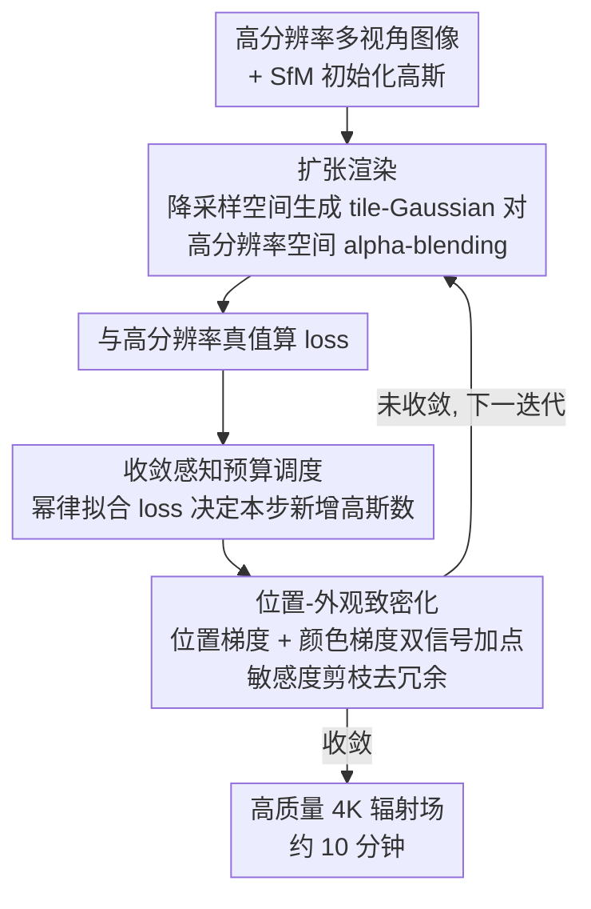

# Turbo-GS: Accelerating 3D Gaussian Fitting for High-Resolution Radiance Fields

**会议**: CVPR 2026  
**arXiv**: [2412.13547](https://arxiv.org/abs/2412.13547)  
**代码**: https://ivl.cs.brown.edu/research/turbo-gs （项目主页）  
**领域**: 3D视觉 / 辐射场 / 高斯泼溅  
**关键词**: 3D Gaussian Splatting、高分辨率、扩张渲染、致密化、训练加速

## 一句话总结
Turbo-GS 通过「只渲染稀疏子像素的扩张渲染 + 幂律收敛感知的高斯预算调度 + 颜色梯度辅助的致密化」三件套，把 4K 场景的 3DGS 拟合从数小时压到约 10 分钟（4K bicycle 仅 13 分钟，比 Taming 3DGS 快 3×、比 3DGS 快 14×），且渲染质量（尤其 LPIPS）不降反升。

## 研究背景与动机

**领域现状**：3D Gaussian Splatting（3DGS）已成为新视角合成（NVS）的主流方案，能在 1K 分辨率下实时渲染高质量图像。但「渲染快」不等于「拟合快」——给一个 200 视角的静态场景拟合一套高质量高斯，1K 要约半小时、4K 要数小时。

**现有痛点**：已有加速工作大多盯着 CUDA 内核（更快的反向传播、更准的 tile-Gaussian 配对、负载均衡）、属性量化、减点、或换二阶优化器，但它们几乎都只在低分辨率上做分析，忽略了真正卡脖子的高分辨率场景。另一类前馈/学习式方法虽然几秒出结果，却被锁死在固定视角数和低分辨率上，根本喂不进 4K 稠密视角。

**核心矛盾**：作者对不同分辨率做 runtime profiling（Fig. 2）发现，随分辨率升高，tile-Gaussian 生成（`duplicateWithKeys`）和深度排序（`sortPairs`）的开销随像素数成正比暴涨，在高分辨率下甚至比 alpha-blending 本身还贵。也就是说，高分辨率下大量算力耗在了「逐像素稠密监督」上，而由于 tile-based 渲染里一个高斯本就影响多个像素，这种稠密监督存在严重冗余。

**本文目标**：在不依赖任何学习先验、不牺牲质量的前提下，专攻高分辨率 3DGS 的逐场景优化，把每一步「花在监督上的算力单元」用满。可拆成两个子问题：(1) 砍掉每次迭代的计算 footprint；(2) 提升每次迭代的优化效率（更好的预算与致密化）。

**切入角度**：既然一个高斯影响多个像素、稠密监督冗余，那就**只渲染一个子集的像素来算 loss**（类比 NeRF 采样射线）。但 3DGS 的 tile-based 渲染和高斯投影耦合很强，没法像 NeRF 那样独立抽取单条射线——这正是本文要攻克的工程难点。

**核心 idea**：用棋盘式「扩张采样」在降采样空间生成 tile-Gaussian 对、却在原始高分辨率空间做 alpha-blending（既省算力又保质量），再叠加幂律收敛感知的高斯预算调度和颜色梯度辅助致密化，让每次迭代既便宜又高效。

## 方法详解

### 整体框架
Turbo-GS 不改 3DGS 的表示，只改「怎么把高斯拟合得又快又好」。它建在 3DGS / Scaffold-GS 之上（再接 Taming 3DGS 的优化 CUDA 反向核），围绕一次训练迭代插入三个相互独立、可叠加的模块：先用**扩张渲染**把这一步的渲染开销降下来（只在降采样网格上算 tile-Gaussian 配对，blending 仍回到高分辨率），再用**收敛感知预算调度**决定这一步该新增多少高斯（按幂律拟合 loss 曲线动态控制增长速度），最后用**位置-外观致密化**决定在哪里加点（位置梯度 + 颜色梯度双信号，补上无纹理区域的梯度消失），并辅以敏感度剪枝去冗余。三个模块对应论文三条贡献，可单独移植到不同 3DGS 变体。

### 关键设计

**1. 扩张渲染：在降采样空间算配对、在高分辨率空间做 blending，既省算力又不掉质量**

针对的痛点是高分辨率下 tile-Gaussian 生成与排序随像素数线性暴涨。Turbo-GS 用棋盘式扩张采样从原图抽一个像素子集（受扩张因子 $d$ 和两个偏移 $(o_x, o_y)$ 控制），形成一张降采样图。关键在两步分离：(1) **tile-Gaussian 配对在降采样图上做**——把高斯 3D 位置投影到分辨率无关的 NDC 空间得 $p^{\mathrm{NDC}}$，再映射到降采样像平面 $p_x^{\mathrm{ds}} = W^{\mathrm{ds}} p_x^{\mathrm{NDC}}$、$p_y^{\mathrm{ds}} = H^{\mathrm{ds}} p_y^{\mathrm{NDC}}$，并用原始焦距算 2D 协方差后取 $3\sigma$ 半径 $r$，在降采样空间的搜索半径为 $r^{\mathrm{ds}} = r/d$，据此求占用 tile；(2) **alpha-blending 仍回到原始高分辨率空间**，降采样像素坐标按 $p_x = d\,p_x^{\mathrm{ds}} + \tfrac{1}{2}(d-1)$（$p_y$ 同理）映射回去，用对应高分辨率真值像素监督。

这样 GPU 的计算、调度、访存都停留在便宜的降采样规模，而 blending 在高分辨率上做、质量不退化。由于 tile 尺寸固定为与分辨率无关的 $16\times16$，降采样空间一个 tile 等价于高分辨率的 $d^2$ 个 tile，会引入轻微的 tile 配置错配；作者用 $d=2$、四个偏移各渲一张再合成一张高分辨率图与原始渲染对比，PSNR 超过 70dB，证明误差可忽略。训练时取 $d=2$、偏移集合 $O=\{(i,j)\},i,j\in\{0,1\}$，每次迭代随机抽一个偏移渲一张低分辨率图监督。这是全文加速的主力（消融里单加扩张渲染就让 3DGS 提速约 2×）。

**2. 收敛感知预算调度：用幂律拟合 loss 曲线，动态决定每一步该新增多少高斯**

针对的痛点是高斯数从初始 $N$ 涨到上限 $M$ 的「增长速度」难以把握——加太快会污染优化、加太慢浪费迭代。作者观察到一个规律（Fig. 4）：初始阶段之后，$\log(\text{loss})$ 与 $\log(\text{iterations})$ 几乎完美线性，说明拟合迭代与收敛遵循幂函数（可归因于 MSE/L1 loss）。于是设计幂律自适应预算：从基准指数 $\alpha_{\text{base}}$ 出发，记录每步 loss（100 步 warm-up 后），周期性地用 EMA 平滑的全部历史 loss 拟合历史指数 $\alpha_{\text{history}}$，再用最近 $k$ 步算局部指数 $\alpha_{\text{recent}}$，用两者之差 $\epsilon = \alpha_{\text{recent}} - \alpha_{\text{history}}$ 调节当前幂：

$$\alpha = \alpha_{\text{base}} + \lambda \cdot \tanh(\epsilon),\qquad B(t) = N + \frac{t^{\alpha} - 1}{100^{\alpha} - 1}\,(M - N).$$

其中 $\lambda=0.5$，$\alpha_{\text{base}}$ 取历史均值，$B(t)$ 是第 $t$ 步允许的高斯总数预算。直觉是：若收敛比幂律预期慢，就放慢致密化；反之加快。它本质是让「新增高斯的速度」和「老高斯被优化好的速度」匹配，避免在模型还没拟合好时就猛加点。

**3. 位置-外观致密化：补上无纹理区域的颜色梯度信号，治梯度消失**

针对的痛点是 3DGS/Scaffold-GS 只在位置梯度强的地方加点，但无纹理区域（如草地）高斯位置稍变也几乎不改变误差，位置梯度趋近于零，导致这些区域点稀、渲染发糊。作者可视化不同属性的梯度（Fig. 5）发现：位置梯度只聚焦少数区域，而**颜色梯度在整体区域、尤其模糊区域提供了更丰富的信号**。于是同时用位置梯度阈值 $\tau_{\text{position}}$ 和颜色梯度阈值 $\tau_{\text{color}}$ 判定是否加点；因颜色梯度数值范围更小，取 $\tau_{\text{color}} = 0.01\,\tau_{\text{position}}$，再沿用 baseline 的多尺度 voxel 加点。由于外观致密化容易过拟合训练视角，只以 20% 概率激活作为位置致密化的补充——即便不常触发也能改善重建。

此外配套**敏感度剪枝**：扩张渲染虽跳过部分像素，但作者用 Speedy-Splat 的 sensitivity score 验证，开/关扩张渲染下致密化产出的高斯敏感度行为一致，说明被选去致密化的 primitive 可靠；据此在 60% 阈值做敏感度剪枝去冗余点而不掉质量。

### 损失函数 / 训练策略
沿用 3DGS 的 MSE + L1 渲染监督（幂律假设正是基于这两类 loss）。3DGS-based 训 30k 迭代；Scaffold-GS-based 为加速只训 10k 迭代、致密化仅在前 3k 内进行（300 步 warm-up 后每 20 步一次）。底层接 Taming 3DGS 的优化 CUDA 反向核。全部在单张 NVIDIA A100 上评测。

## 实验关键数据

### 主实验

4K 场景（MipNeRF-360 9 个场景 + EyefulTower 2 个场景），与原始及「已叠加社区最强加速」的增强 baseline 对比（节选 MipNeRF-360 4K）：

| 方法 | SSIM↑ | PSNR↑ | LPIPS↓ | 训练时间↓ |
|------|-------|-------|--------|-----------|
| 3DGS | 0.797 | 26.75 | 0.410 | 113 m |
| 3DGS-accel | 0.791 | 26.52 | 0.364 | 40 m |
| **Turbo-3DGS (ours)** | **0.805** | **26.80** | **0.327** | **24 m** |
| Scaffold-GS | 0.794 | 26.84 | 0.359 | 143 m |
| Scaffold-GS-accel | 0.784 | 25.81 | 0.373 | 12 m |
| **Turbo-Scaffold-GS (ours)** | 0.800 | 26.65 | **0.327** | **9 m** |

代表性提速：4K bicycle 场景 13 分钟收敛，比 Taming 3DGS（40m）快 3×、比 3DGS（187m）/ Scaffold-GS（185m）快 14×。质量上 LPIPS（高斯渲染最贴近人眼感知的指标）一致更优。

1K 设置（MipNeRF-360 + Deep Blending）下，Turbo-Scaffold-GS 在 MipNeRF-360 仅 6.86 分钟（Scaffold-GS 23.85m），SSIM 0.814、LPIPS 0.208 与重型 baseline 持平甚至更好；Turbo-3DGS 12.18 分钟（3DGS 30.08m）。

### 消融实验

MipNeRF-360 全 9 场景，逐步叠加模块（DR=扩张渲染、CA=收敛感知致密化、CG=颜色梯度）：

| 配置 | 时间 | PSNR | SSIM | LPIPS | 说明 |
|------|------|------|------|-------|------|
| 3DGS（accel） | 31m | 26.52 | 0.791 | 0.364 | 基线 |
| +DR | 14m | 26.66 | 0.799 | 0.338 | 扩张渲染：提速约 2×，质量也升 |
| +CA | 12m | 26.58 | 0.795 | 0.347 | 收敛感知：再省时间 |
| +CG | 16m | 26.75 | 0.803 | 0.328 | 颜色梯度：不影响速度但显著提质 |
| Scaffold-GS（10k） | 12m | 25.81 | 0.784 | 0.373 | 基线 |
| +DR | 7m | 25.58 | 0.780 | 0.375 | 提速主力 |
| +CA | 8m | 26.22 | 0.795 | 0.344 | 对 Scaffold-GS 稳训练、质量大涨 |
| +CG | 9m | 26.34 | 0.797 | 0.332 | 进一步提质 |

### 关键发现
- **扩张渲染是加速主力**：单加 DR 就让 3DGS 整管线提速约 2×，且 SSIM/LPIPS 反而更好（去冗余监督不损质量）。
- **收敛感知致密化对两种 backbone 表现不同**：对 Scaffold-GS 能避免加入无效高斯、稳住训练、质量明显涨（PSNR 25.58→26.22）；但对 3DGS 略有损害，作者推测是 3DGS 的 opacity reset 操作扰动了训练曲线、破坏幂律假设。
- **颜色梯度纯提质不增速**：不影响训练时间，但在无纹理/高频区域（草地、地面、路面）补回细节，LPIPS 持续下降。
- 敏感度剪枝（†）可把高斯峰值数和显存砍掉一半以上（如 MipNeRF-360 由 3.64M→1.29M、861MB→287MB），质量小幅波动但训练时间几乎不变。

## 亮点与洞察
- **「分辨率」是一个被忽视的优化维度**：以往加速都在 CUDA/调度/显存上抠，本文转向「监督过程本身」，质疑每个被用于优化的算力单元是否必要——只在子像素上监督，等于在分辨率维度上做了减法，这个视角很新。
- **扩张渲染的工程巧思在「配对在低分辨率、blending 在高分辨率」的解耦**：直接降采样会掉质量，直接抽射线又被 3DGS 的 tile 耦合卡住；用 NDC 中介把 tile-Gaussian 配对搬到降采样空间、blending 留在高分辨率，70dB 的合成 PSNR 证明错配几乎无损。这个 pipeline 能即插即用到不同 3DGS 变体，迁移性强。
- **用幂律刻画 3DGS 收敛**：把 $\log(\text{loss})$-$\log(\text{iter})$ 的线性观察转成可操作的预算调度，是把「经验曲线」变成「控制律」的漂亮例子，可迁移到其他需要动态控制模型容量增长的拟合任务。
- **梯度可视化驱动致密化改进**：直接画出位置梯度 vs 颜色梯度的空间分布，定位无纹理区梯度消失的根因，再对症加颜色信号——是「先诊断再开方」的范式。

## 局限性 / 可改进方向
- 作者承认本文坚持 learning-free 设计，未探索如何与几何基础模型结合；随着大模型改变社区，未来想借助大模型进一步加速。
- 收敛感知致密化对 3DGS 反而略掉点（疑因 opacity reset 扰动幂律），说明该模块与 backbone 的训练机制耦合，并非普适增益——叠加时需按 backbone 取舍。
- 幂律假设建立在 MSE/L1 loss 之上，若改用感知/对抗类 loss，$\log$-$\log$ 线性是否仍成立、预算调度是否还有效，论文未验证。
- 评测集中在 MipNeRF-360 / EyefulTower / Deep Blending 等相对静态、稠密视角场景；对稀疏视角、动态场景的适配未涉及。

## 相关工作与启发
- **vs Taming 3DGS**：Taming 用 score-based 框架调节高斯分布、优先感知质量，仍需 >10 分钟；Turbo-GS 在「监督像素冗余」这一新维度发力，4K 上快 3×，且 LPIPS 更优。
- **vs Mini-Splatting / Speedy-Splat**：它们主打减点/剪枝控制高斯预算与显存；Turbo-GS 借用了 Speedy-Splat 的 sensitivity score 做剪枝，但核心加速来自扩张渲染而非减点。
- **vs 3DGS-LM**：3DGS-LM 用 LM 二阶优化器换 Adam 来加速收敛；Turbo-GS 不改优化器，而是降低每步 footprint + 调度致密化，两条路线正交、原则上可叠加。
- **vs 前馈/学习式（PixelSplat、MVSplat 等）**：它们几秒出结果但锁死在固定视角数和低分辨率，无法处理 4K 稠密视角；Turbo-GS 保持 learning-free、可处理任意视角数的高分辨率场景。

## 评分
- 新颖性: ⭐⭐⭐⭐⭐ 「在分辨率维度上稀疏监督」+ 低/高分辨率解耦的扩张渲染，是 3DGS 加速里少见的新切入点。
- 实验充分度: ⭐⭐⭐⭐☆ 覆盖 4K/1K、两种 backbone、逐模块消融充分；但缺动态/稀疏视角与非 MSE loss 下的验证。
- 写作质量: ⭐⭐⭐⭐☆ 动机由 profiling 与梯度可视化驱动、逻辑清晰；部分公式符号（如 $\alpha_{\text{base}}$ 取历史均值的循环表述）略绕。
- 价值: ⭐⭐⭐⭐⭐ 把 4K 拟合从数小时压到约 10 分钟、且即插即用可移植，对高分辨率辐射场落地有直接实用价值。

<!-- RELATED:START -->

## 相关论文

- [\[CVPR 2026\] Evidential Neural Radiance Fields](evidential_neural_radiance_fields.md)
- [\[CVPR 2026\] Confidence-Guided Multi-Scale Aggregation for Sparse-View High-Resolution 3D Gaussian Splatting](confidence-guided_multi-scale_aggregation_for_sparse-view_high-resolution_3d_gau.md)
- [\[CVPR 2026\] BEA-GS: BEyond RAdiance Supervision in 3DGS for Precise Object Extraction](bea-gs_beyond_radiance_supervision_in_3dgs_for_precise_object_extraction.md)
- [\[CVPR 2026\] Faster-GS: Analyzing and Improving Gaussian Splatting Optimization](faster-gs_analyzing_and_improving_gaussian_splatting_optimization.md)
- [\[CVPR 2026\] LoG3D: Ultra-High-Resolution 3D Shape Modeling via Local-to-Global Partitioning](log3d_ultra-high-resolution_3d_shape_modeling_via_local-to-global_partitioning.md)

<!-- RELATED:END -->
