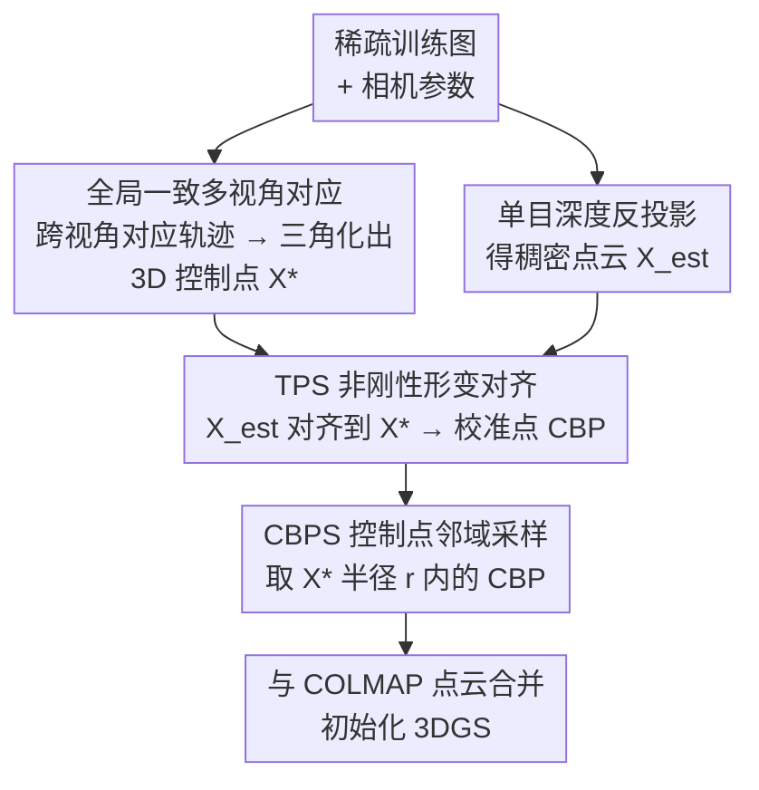

# TWINGS: Thin Plate Splines Warp-aligned Initialization for Sparse-View Gaussian Splatting

**会议**: CVPR 2026  
**arXiv**: [2605.22069](https://arxiv.org/abs/2605.22069)  
**代码**: 无  
**领域**: 3D视觉  
**关键词**: 稀疏视角、3D高斯泼溅、薄板样条、点云初始化、非刚性配准

## 一句话总结
TWINGS 用薄板样条（TPS）把单目深度反投影出来的稠密点云，非刚性地对齐到多视角三角化出的稀疏 3D 控制点上，再在控制点附近采样得到稠密且几何精确的初始点云，作为即插即用模块喂给 3DGS，在 DTU / LLFF / Mip-NeRF360 的极稀疏视角下显著超过现有方法（DTU 3-view PSNR 21.52，比次优高 1.6+ dB）。

## 研究背景与动机
**领域现状**：3D 高斯泼溅（3DGS）的渲染质量高度依赖初始点云的质量。常规做法是用 SfM（COLMAP）从多视角重建出点云来初始化高斯的位置，这些点为优化提供关键的几何约束。

**现有痛点**：在稀疏视角（如 3 张图）场景下，COLMAP 找不到足够的特征匹配，重建出的点云极度稀疏，缺乏约束场景的几何线索。结果 3DGS 容易过拟合训练视角、收敛到错误局部最优、产生漂浮伪影；尽管 3DGS 自带稠密化机制，但初始点太稀疏，它无法把新高斯放到几何上合理的位置。

**核心矛盾**：为缓解稀疏，很多工作引入单目深度作为几何先验。但这里有个根本两难——COLMAP 点云稀疏又不可靠，而替代的单目深度本质上存在**尺度歧义**（scale ambiguity），且这种偏差是**空间变化、非刚性**的。已有方法（如对深度乘单一全局尺度因子 LS、或学一个相关性 CoMapGS）都局限于**单一刚性变换**，根本无法纠正不同视角间复杂的非刚性扭曲，对不齐就把误差带进了初始化。

**本文目标**：把稠密但几何不一致的单目深度点云，warp-align（形变对齐）到真实场景几何上，得到既稠密又几何精确的初始点云。

**切入角度**：作者只在**初始化**这一环节做文章（不改 3DGS 训练流程），并选用薄板样条 TPS 作为形变模型——TPS 专为「对应点驱动的对齐」设计，能在精确插值控制点对应的同时最小化弯曲能量，把可靠参考处的修正平滑传播到邻域，且几秒内完成，不会成为初始化瓶颈。

**核心 idea**：用 TPS 的非刚性形变代替单一全局缩放，把反投影深度对齐到三角化控制点，再在控制点附近采样作为 3DGS 初始化。

## 方法详解

### 整体框架
TWINGS 是一个**即插即用的初始化模块（TWINGS-Init）**，整条流水线分三步：① 在所有训练视角间建立全局一致的多视角对应，并三角化出可靠的 3D 控制点（desired control points，粉色）；② 用单目深度估计器对每张图反投影得到稠密点云（backprojected points，绿色），以「反投影点 ↔ 三角化点」为对应关系拟合一个 TPS 形变场，把整张稠密点云 warp 到场景几何上，得到校准反投影点（CBP）；③ 只在可靠控制点附近半径 $r$ 内采样 CBP（CBPS），与原 COLMAP 点云合并，作为 3DGS 的初始高斯位置。输入是稀疏训练图 + 相机参数，输出是稠密、几何精确的初始点云。

### 关键设计

**1. 全局一致的多视角对应与三角化控制点：给 TPS 提供可靠的「靶点」**

TPS 形变需要一组高质量的目标位置（desired control points）作为对齐靶点，而靶点的几何一致性直接决定形变质量。作者不满足于两两视角的成对匹配，而是用稠密匹配器在所有训练视角间构造**全局对应轨迹**：对每个 query 像素 $p_i^q$，收集它在所有其它图 $I^j(j\neq q)$ 中的匹配 $C^j(p_i^q)$，形成全局对应集合 $\mathcal{M}$（公式 4）。假设一条轨迹里的所有像素观测同一 3D 点 $X_i$，用多视角几何的 DLT 直接线性变换求解 $AX_i=0$（公式 5）得到初始估计，再用非线性优化最小化总重投影误差 $X_i^*=\arg\min_X\sum_{k=1}^{K+1}\|\pi(P^kX)-p_i^k\|_2^2$（公式 6）精修。消融显示，相比只用成对匹配，多视角对应能给出全局更连贯、更准确的 3D 点，进而改善后续 TPS 形变与渲染质量（DTU 3-view PSNR 21.32→21.52）。

**2. TPS 非刚性形变对齐：把稠密深度点云 warp 到真实几何上**

这是全文核心，直击「单目深度尺度歧义是空间变化、非刚性」的痛点。把估计深度 $D_{est}$ 按相机内参 $K$ 反投影（公式 3：$X_{i,j}=K^{-1}[i,j,1]^TD_{i,j}$）得稠密点图 $X_{est}$；在匹配像素处取出「初始控制点」$X_{est}(p^q)$，与三角化得到的「目标控制点」$X^*(p^q)$ 配对，求解 TPS 参数。TPS 形变场写成全局仿射 + 局部非仿射两部分（公式 11）：

$$TPS(X)=t+AX+\sum_{p^q\in M}w_{p^q}\,U(\|X-X^*(p^q)\|)$$

其中 $t\in\mathbb{R}^3$、$A\in\mathbb{R}^{3\times3}$ 是全局仿射（处理整体平移旋转缩放），$w_{p^q}$ 是每个控制点的局部非线性权重，$U(r)=r$ 是径向基函数。这些参数通过控制点对建立的线性系统解出。把 TPS 作用到整张 $X_{est}$ 上，就得到形变后的**校准反投影点 CBP**。与 LS（单一全局尺度+偏移，无法刻画空间变化偏差）、FFD（控制点格栅，不保证反投影点对齐到三角化点）、NURBS（灵活但存储/计算开销大）相比，TPS 精确插值对应点、最小化弯曲能量，性能与计算时间权衡最好——几秒内给出几何精确的形变。

**3. 校准反投影点采样（CBPS）：只信控制点附近的点**

即便 CBP 整体对齐了，远离可靠控制点的区域仍残留几何误差，全用上反而引入噪声。CBPS 因此做一次空间筛选：只保留落在某个三角化控制点半径 $r$ 内的 CBP，

$$\mathcal{S}_{\text{CBPS}}=\bigcup_{x\in X^*}\{\,b\in\mathcal{B}\mid\|b-x\|\le r\,\}$$

其中 $\mathcal{B}$ 是全体 CBP，半径 $r$ 取为场景尺度 $S$（包住所有相机位姿的包围球半径）的一个分数。这样既保留了稠密性、又把初始点锁定在最可靠的几何邻域，得到前景/背景平衡的初始化。$r$ 需随视角数自适应：3-view 时 COLMAP 点极稀疏，需较大半径补足密度（最优 $S\cdot1/8$）；9-view 时点云已较稠密，过大半径反而次优，因为 3DGS 更看重初始点的质量而非数量。

### 损失函数 / 训练策略
TWINGS 只负责初始化，3DGS 训练沿用 DropGaussian 的结构正则策略，总损失（公式 13）为

$$\mathcal{L}=\mathcal{L}_1(\hat I,I)+\lambda_1\mathcal{L}_{D\text{-}SSIM}(\hat I,I)+\lambda_2\mathcal{L}_D(\hat D,D_{est})$$

其中 $\mathcal{L}_1$ 与 $\mathcal{L}_{D\text{-}SSIM}$ 是渲染图与 GT 的光度损失，$\mathcal{L}_D$ 是渲染深度 $\hat D$ 与估计深度 $D_{est}$ 的深度损失，$\lambda_1=0.2$、$\lambda_2=0.01$。整个 TWINGS-Init 仅需约 12.45 s，对 3DGS 训练几乎零额外成本。

## 实验关键数据

### 主实验
DTU 数据集（3/6/9 训练视角），TWINGS 在 PSNR/SSIM/LPIPS/AVGE 四项全 SOTA，3-view 提升最显著：

| 数据集 | 视角 | 指标 | TWINGS | 次优 | 说明 |
|--------|------|------|--------|------|------|
| DTU | 3-view | PSNR↑ | **21.52** | 19.92 (FreeNeRF) | +1.6 dB |
| DTU | 3-view | SSIM↑ | **0.880** | 0.853 (CoR-GS) | |
| DTU | 3-view | LPIPS↓ | **0.107** | 0.119 (CoR-GS) | |
| DTU | 9-view | PSNR↑ | **28.22** | 27.75 (DropGaussian) | |
| Mip-NeRF360 | 12-view | PSNR↑ | **20.35** | 19.74 (DropGaussian) | |
| Mip-NeRF360 | 12-view | SSIM↑ | **0.618** | 0.591 (CoMapGS) | |
| LLFF | 3-view | PSNR↑ | **21.49** | 21.11 (CoMapGS) | |
| LLFF | 3-view | LPIPS↓ | **0.167** | 0.182 (CoMapGS) | |

定性上，竞争方法在 DTU 上重建不出建筑窗框、错位文字、漏掉黑色瞳孔；Mip-NeRF360 上恢复不出白柱及投影、把球渲染得过透明或顶部变形；LLFF 上漏掉天花板喷淋头、在招牌上产生条纹伪影。TWINGS 都能忠实恢复这些高频细节。

### 消融实验
| 配置 | 关键指标 | 说明 |
|------|---------|------|
| Full（multi-view 对应） | DTU 3-view PSNR 21.52 / SSIM 0.880 | 完整模型 |
| w/ pairwise 对应 | DTU 3-view PSNR 21.32 / SSIM 0.875 | 只用成对匹配，全局一致性下降 |
| TPS（本文形变） | LLFF 3-view PSNR 21.49 / SSIM 0.754 | 形变方法最佳 |
| FFD 替换 | LLFF 3-view PSNR 20.96 / SSIM 0.727 | 引入扭曲、破坏结构 |
| Linear Scaling 替换 | LLFF 3-view PSNR 20.90 / SSIM 0.725 | 中心区域局部几何不稳 |

即插即用增益（TWINGS-Init，DTU 3-view）：

| 基线 | PSNR (w/o → w/ Init) | 提升 |
|------|------|------|
| 3DGS | 17.65 → 20.21 | **+2.56 dB** |
| FSGS | 17.24 → 20.42 | +3.18 dB |
| CoR-GS | 19.21 → 21.27 | +1.96 dB（超越原 SOTA） |

### 关键发现
- **初始化单点就能撑起大半性能**：仅把初始化换成 TWINGS-Init，vanilla 3DGS 直接 +2.56 dB 并追平原 SOTA，证明稀疏视角下「好的初始化」本身价值巨大，无需改训练。
- **非刚性形变是关键**：TPS > FFD > LS，验证单目深度的尺度偏差是空间变化的，必须用非刚性模型才能真正对齐。
- **采样半径需随视角数自适应**：3-view 用大半径（$S\cdot1/8$）补密度最好，9-view 时质量优先于数量，过大半径反而掉点。
- **效率友好**：TWINGS-Init 约 12.45 s 完成，TPS 形变本身仅几秒，几乎不增加流水线开销。

## 亮点与洞察
- **把经典 TPS 用在 3DGS 初始化上很巧**：TPS 是图像配准的老工具，作者敏锐地把「对应点驱动 + 最小弯曲能量」这两条性质，对应到「精确贴合可靠三角化点 + 平滑传播到邻域」的初始化需求上，old tool new use。
- **只动初始化、不动训练，天然即插即用**：TWINGS-Init 对 3DGS/FSGS/CoR-GS 全部带来增益，说明它解决的是这一类方法共同的上游瓶颈（初始点云质量），可迁移性强。
- **CBPS 的「只信控制点邻域」很务实**：承认形变在远离可靠参考处仍有残差，用一个简单的半径筛选把噪声挡在外面，比无脑用全部 CBP 更稳——这个「稠密生成 + 可靠筛选」的两段式思路可迁移到其它深度先验初始化场景。
- **诊断到位**：把问题精准归因为「稀疏不可靠 vs 尺度歧义」的两难，并指出已有方法都困在单一刚性变换，论证链条清晰。

## 局限性 / 可改进方向
- **作者承认**：方法针对极稀疏视角下 COLMAP 点云差的场景；当视角增多、或纹理丰富（SfM 本就能可靠重建几何）时，增益会递减。
- **依赖外部组件**：性能受单目深度估计器与稠密匹配器质量影响，深度/匹配差时三角化控制点与反投影点都会退化，TPS 也无从对齐。
- **TPS 控制点规模**：求解 TPS 线性系统的开销随控制点数增长，超大场景或超稠密匹配下可能需要权衡（论文称几秒内完成，但未给极端规模下的扩展性分析）。
- **展望**：作者提出可扩展到 3-view 表面重建用于实时 AR/VR、内容创作，利用其快速精确初始化保留精细面部细节。

## 相关工作与启发
- **vs DNGaussian / FSGS（深度正则）**: 它们在 3DGS 训练中用单目深度作正则来优化高斯位置/不透明度；本文不碰训练损失，专攻初始化，把深度先验在初始化阶段就 warp 对齐好，二者正交、可叠加（FSGS+TWINGS-Init 提升 +3.18 dB）。
- **vs CoMapGS（学相关性）/ Linear Scaling**: 它们用单一全局尺度或学一个相关性对齐深度，本质是刚性/全局变换；本文用 TPS 做空间变化的非刚性形变，能纠正全局变换对不上的复杂扭曲（LLFF 3-view PSNR 21.49 vs 20.90）。
- **vs CoR-GS / DropGaussian（鲁棒训练）**: 它们靠剪枝离群点或随机 dropout 让模型对差初始化更鲁棒；本文从源头改善初始化质量，二者互补——CoR-GS+TWINGS-Init 反而超越原 SOTA。
- **vs FFD / NURBS（其它形变模型）**: FFD 用控制点格栅但不保证反投影点对齐到三角化点，NURBS 灵活但开销大；TPS 专为对应点对齐设计，在精度与速度间取得最佳折中。

## 评分
- 新颖性: ⭐⭐⭐⭐ 把 TPS 非刚性形变引入稀疏 3DGS 初始化，思路清晰且对症，但底层都是成熟组件的组合。
- 实验充分度: ⭐⭐⭐⭐⭐ 三个标准 benchmark × 多视角设置，主实验 + 即插即用 + 形变方法 + 对应方式 + 采样半径全套消融。
- 写作质量: ⭐⭐⭐⭐ 问题诊断（两难）与方法动机表述清楚，公式完整；图依赖较多。
- 价值: ⭐⭐⭐⭐ 即插即用、几秒开销、对多个基线普遍涨点，稀疏视角 3DGS 工程上很实用。

<!-- RELATED:START -->

## 相关论文

- [\[CVPR 2026\] Intrinsic Geometry-Appearance Consistency Optimization for Sparse-View Gaussian Splatting](intrinsic_geometry-appearance_consistency_optimization_for_sparse-view_gaussian_.md)
- [\[CVPR 2026\] DropAnSH-GS: Dropping Anchor and Spherical Harmonics for Sparse-view Gaussian Splatting](dropping_anchor_and_spherical_harmonics_for_sparse-view_gaussian_splatting.md)
- [\[CVPR 2026\] SV-GS: Sparse View 4D Reconstruction with Skeleton-Driven Gaussian Splatting](sv-gs_sparse_view_4d_reconstruction_with_skeleton-driven_gaussian_splatting.md)
- [\[CVPR 2026\] Confidence-Guided Multi-Scale Aggregation for Sparse-View High-Resolution 3D Gaussian Splatting](confidence-guided_multi-scale_aggregation_for_sparse-view_high-resolution_3d_gau.md)
- [\[CVPR 2026\] SGS-Intrinsic: Semantic-Invariant Gaussian Splatting for Sparse-View Indoor Inverse Rendering](sgs-intrinsic_semantic-invariant_gaussian_splatting_for_sparse-view_indoor_invers.md)

<!-- RELATED:END -->
