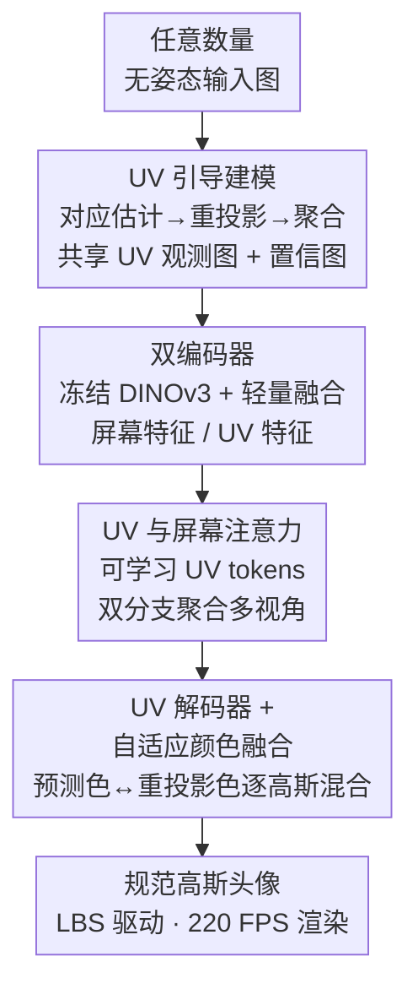

# UIKA: Fast Universal Head Avatar from Pose-Free Images

**会议**: CVPR 2026  
**arXiv**: [2601.07603](https://arxiv.org/abs/2601.07603)  
**代码**: https://zijian-wu.github.io/uika-page/ (项目主页)  
**领域**: 3D视觉  
**关键词**: 3D高斯头部头像、前馈重建、姿态无关、UV注意力、可驱动头像

## 一句话总结
UIKA 提出一个前馈式可驱动 3D 高斯头部头像模型：把任意数量的「无姿态」输入图（单图 / 多视角 / 手机视频均可）通过逐像素人脸 UV 对应关系重投影到共享 UV 空间，再用 UV 注意力分支聚合多视角信息解码出规范空间高斯，单次前向即可重建、并支持 220 FPS 实时驱动，在单目和多视角设定下都超过现有 SOTA。

## 研究背景与动机
**领域现状**：3D 头部头像重建主流有两条路。传统优化式方法（NeRF / 3D Gaussian Splatting）需要影棚级多视角采集系统，对某个特定身份做长时间逐人优化，且要精确的相机标定和表情捕捉。近年兴起的前馈式方法用大重建模型从单图或少量图直接推断头像，免去测试时优化。

**现有痛点**：现有前馈方法各有硬约束。LAM、GAGAvatar 从单图重建、但通常在单目视频上训练，在大相机姿态下做新视角合成时泛化很差；Avat3r 要求固定的四张标定图，限制实用性、且只能在身份稀缺的多视角数据集上训练；GPAvatar、PF-LHM 虽支持任意数量输入，但**缺乏跨帧的显式对应关系**，导致多视角信息聚合不可靠。

**核心矛盾**：要同时满足「灵活采集（任意张数、无相机/表情标注）+ 前馈速度 + 高保真且 3D 一致」非常难。根因在于：无姿态输入图之间没有显式几何对齐，模型只能在屏幕空间用 Transformer 隐式匹配，既不结构化又对极端视角不鲁棒；而显式对齐又传统上依赖相机标定和表情捕捉。

**本文目标**：从任意数量的无姿态图重建照片级、可实时驱动的头像，彻底去掉对相机参数和表情参数估计的依赖。

**切入角度**：作者从「人脸天然有一套与相机姿态、表情无关的 UV 参数化」出发——只要能逐像素估计每个有效人脸像素的 UV 坐标，就能把不同帧的颜色都重投影到同一张共享 UV 图上，从而把「跨视角对齐」这个难题变成在规范 UV 空间里的信息聚合问题。

**核心 idea**：用「逐像素人脸 UV 对应 + UV 空间注意力 + 逐高斯自适应颜色融合」把多张无姿态图对齐进统一规范空间，前馈解码出可 LBS 驱动的规范高斯头像。

## 方法详解

### 整体框架
UIKA 的输入是任意数量 $N$ 张无姿态人脸图 $\{\mathrm{I}_s^i\}_{i=1}^N$（无相机、无表情标注），输出是一组规范空间 3D 高斯 $\mathcal{G}=\{c_k,o_k,\mu_k,s_k,r_k\}$，可直接用 FLAME 的线性混合蒙皮（LBS）驱动并实时渲染。整条管线分四步串行：先用人脸对应估计器给每张图预测逐像素 UV 坐标，把各帧颜色按 UV 重投影并聚合成一张共享 UV 观测图和置信图；屏幕图与重投影 UV 图各过一个冻结 DINOv3 编码器 + 轻量融合，得到屏幕特征与 UV 特征；用可学习 UV tokens 同时做屏幕注意力和 UV 注意力把两类信息注入；最后 UV 解码器结合聚合图把 tokens 解码为规范高斯属性，并对每个高斯做预测颜色与重投影观测颜色的自适应融合。

### 关键设计

**1. UV 引导建模：用逐像素人脸对应把无姿态图对齐进共享 UV 空间**

这一步直接解决「无姿态图之间没有显式几何对齐」的根因。作者受 Pixel3DMM 启发设计了一个人脸对应估计器 $\mathcal{U}(\cdot)$：输入图过冻结预训练编码器，再用可训练 DPT head 解码出稠密的逐像素 UV 坐标图 $\mathrm{U}^i=\mathcal{U}(\mathrm{I}_s^i),\ \mathrm{U}=(u,v)\in[0,1]^2$。有了 UV 坐标，就能把每张屏幕空间图按对应关系重投影到共享 UV 空间 $\mathrm{I}_{uv}^i=\mathrm{Reproj}(\mathrm{I}_s^i,\mathrm{U}^i)$——这一步关键在于 **UV 坐标本身与相机姿态、表情无关**，所以不同帧、不同视角、不同表情的颜色一旦落到 UV 空间就天然像素对齐。随后把 $N$ 张重投影图逐像素平均得到聚合观测 $\mathrm{I}_{aggr}$，并统计每个 UV 像素被多少张图命中 $n_{hit}$ 来定义置信度 $\gamma_{aggr} \coloneqq \mathrm{Norm}(\log(1+n_{hit}))$（min–max 归一化）。命中越多的区域置信越高，这个置信图后面会引导融合，让被多视角观测过的区域更可信。

**2. UV 注意力分支：让可学习 tokens 同时吃屏幕局部细节与 UV 结构化全局上下文**

以往工作（如 LAM、PF-LHM）只在屏幕空间用 Transformer 把可学习 tokens 和图像特征建联系，**缺乏结构化对应**，多视角信息聚合不稳。UIKA 在常规屏幕注意力之外额外引入一条 UV 注意力分支。屏幕图和重投影 UV 图分别过编码器 $\mathcal{E}_j$（冻结 DINOv3 主干 + 可训练轻量 CNN 融合浅层深层特征），拼接得到屏幕特征 $\mathcal{F}_s$ 和 UV 特征 $\mathcal{F}_{uv}$。可学习 UV tokens $\mathcal{Z}\in\mathbb{R}^{L_z\times D}$ 在两个空间各做一次注意力：

$$\Delta\mathcal{Z}_j,\Delta\mathcal{F}_j=\mathrm{Attn}_j(\mathcal{Z},\mathcal{F}_j),\quad \mathcal{Z}'=\mathcal{Z}+\mathrm{MLP}(\mathcal{Z}+\Delta\mathcal{Z}_s+\Delta\mathcal{Z}_{uv})$$

两路增量 $\Delta\mathcal{Z}_s$（屏幕）和 $\Delta\mathcal{Z}_{uv}$（UV）相加后注入 tokens。屏幕分支提供局部高频细节，UV 分支因为已经在结构化的规范坐标里、提供跨视角全局上下文，二者互补——这正是它在多视角设定下不像 GPAvatar/InvertAvatar 那样「输入图越多反而退化」的原因。

**3. 自适应颜色融合：逐高斯权衡「预测颜色」与「重投影观测颜色」**

UV 解码器把多深度（$l=3,6,9,12$ 层）的 tokens 连同聚合图 $\{\mathrm{I}_{aggr},\gamma_{aggr}\}$ 解码出规范高斯属性，包括预测颜色 $\hat{c}_k$、融合权重 $w_k$、不透明度、位置偏移 $\Delta\mu_k$、尺度、旋转。问题在于：网络预测的外观虽然全局连贯、但常缺真实细节；而从输入图重投影来的观测颜色 $c_k^{aggr}$ 精确却可能不完整（有遮挡）。作者据此让每个高斯学一个权重 $w_k$ 来动态混合两者：

$$c_k = w_k\hat{c}_k + (1-w_k)c_k^{aggr}$$

这样「精确但可能残缺的局部观测」与「全局连贯但有时不准的预测」被逐高斯加权——观测充分的区域更信重投影色，被遮挡或没观测到的区域回退到预测色。每个高斯初始化在 FLAME 模板网格表面 $\mu_k^m$ 上，最终位置为 $\mu_k^m+\Delta\mu_k$。驱动时每个高斯继承所在三角形的 LBS 权重 / posedirs / shapedirs（FLAME UV 光栅化 + 重心插值得到），用标准顶点 LBS 把高斯从规范空间形变到目标姿态，再做可微高斯泼溅渲染。整个头像无需推理时额外的神经渲染器，因此能跑到 220 FPS。

**4. 合成多视角头部数据集：补足真实数据的身份、视角与表情缺口**

现有头部数据要么单目（视角受限、表情多为说话相关的小动作），要么多视角但身份数少、影棚光照难泛化到野外。作者搭了一条可扩展的数据生成管线：用 SphereHead（在野外图上训练、覆盖大相机姿态的 3D 头部生成器）为每个身份采样 9 个固定视角渲染出 3D 一致的多视角头像；再用 LivePortrait（高效 2D 肖像驱动模型）配一套统一的驱动动作库，把每个视角驱动出时间同步的多视角序列。最终 curate 出 7500+ 身份、每身份 9 视角、每身份 13000+ 帧，覆盖夸张表情，既避开昂贵影棚采集又提升野外鲁棒性。

### 损失函数 / 训练策略
训练时从同一段视频随机采 1 到 $N_{ref}$ 帧作为源输入重建规范高斯，另采 $N_d$ 帧作为驱动/目标视角做 reenactment 监督。监督用 L1 + SSIM + LPIPS（VGG 感知）的光度组合，外加几何正则 $\mathcal{L}_{reg}=\|\max(\Delta\mu,\epsilon)\|_2$ 防止高斯偏离初始位置太远（$\epsilon$ 取接近 0）。总损失为加权和，$\lambda_{l1}=\lambda_{lpips}=1.0$，$\lambda_{ssim}=\lambda_{reg}=0.1$。Transformer 用 $L=12$ 个 MM-Transformer 块、16 头、隐维 1024；UV tokens 长度 $L_z=9216$ reshape 成 $96\times96$，解码出 $384\times384\times256$ UV 特征图，光栅化 FLAME UV mask 后采约 130K 特征点解码高斯属性。$N_{ref}=16$、$N_d=8$，用 Adam + cosine warm-up 训 150K 步，32 张 H20 约两周。

## 实验关键数据

### 主实验
在 VFHQ + NeRSemble-v2 上评估，分单目和多视角两种输入、自重演（self）和跨重演（cross）两种场景。指标：PSNR/SSIM/LPIPS 测重建质量，CSIM（ArcFace 余弦相似）测身份保持，AED/APD（3DMM 回归）测表情和头姿，AKD 测关键点几何一致。

**单目设定（Table 2，self reenactment）**：

| 方法 | PSNR↑ | SSIM↑ | LPIPS↓ | CSIM↑ | AED↓ | AKD↓ |
|------|-------|-------|--------|-------|------|------|
| Portrait4D-v2 | 21.03 | 0.859 | 0.134 | 0.688 | 0.094 | 3.718 |
| GAGAvatar | 20.34 | 0.850 | 0.160 | 0.693 | 0.071 | 4.372 |
| LAM | 18.29 | 0.810 | 0.206 | 0.602 | 0.104 | 4.631 |
| **UIKA (本文)** | **21.69** | **0.867** | **0.105** | **0.738** | **0.055** | **3.066** |

**多视角设定（Table 3，self reenactment）**：

| 方法 | PSNR↑ | SSIM↑ | LPIPS↓ | CSIM↑ | AED↓ | AKD↓ |
|------|-------|-------|--------|-------|------|------|
| DiffusionRig | 16.97 | 0.768 | 0.395 | 0.598 | 0.209 | 9.585 |
| GPAvatar | 17.11 | 0.783 | 0.313 | 0.553 | 0.129 | 6.423 |
| InvertAvatar | 16.35 | 0.776 | 0.394 | 0.449 | 0.084 | 7.402 |
| **UIKA (本文)** | **22.50** | **0.855** | **0.120** | **0.740** | **0.064** | **3.437** |

多视角设定下优势尤为悬殊：PSNR 比次优的 GPAvatar 高 5+ dB，LPIPS 从 0.31 降到 0.12。作者指出 GPAvatar、InvertAvatar 因缺显式对应，输入图越多反而可能退化，而 UIKA 凭 UV 对应越加图越好。

### 消融实验
单目 NeRSemble-v2、self reenactment（Table 4）：

| 配置 | PSNR↑ | LPIPS↓ | AED↓ | AKD↓ | 说明 |
|------|-------|--------|------|------|------|
| **Full** | 22.61 | 0.082 | 0.055 | 3.037 | 完整模型 |
| w/o synth | 21.86 | 0.093 | 0.060 | 3.078 | 去掉合成数据集，PSNR 掉 0.75 |
| w/o uv_attn | 22.21 | 0.091 | 0.056 | 3.086 | 去 UV 注意力分支，细节明显丢失 |
| w/o aggr | 22.39 | 0.088 | 0.059 | 3.120 | 去聚合 UV 图注入（即自适应融合的观测源），细节不连贯 |

### 关键发现
- **合成数据集贡献最大**：去掉后 PSNR 掉幅最大（0.75）、LPIPS 退化最多，说明真实数据的身份/视角/表情覆盖确实是瓶颈，合成多视角数据带来更好的视角一致性和高频细节。
- **UV 注意力分支管细节**：去掉后 tokens 只能和屏幕 token 做注意力、缺结构化信息，定性上人脸细节显著丢失。
- **自适应融合的观测注入管连贯性**：不把聚合 UV 图注入解码阶段，模型难以产出正确且连贯的细节。
- **越加图越好**：随输入视角增多，UIKA 能逐步对抗初始遮挡、提升 3D 一致性和渲染细节，验证 UV 引导聚合的有效性；还能泛化到 Ava-256 和野外网图等域外数据。

## 亮点与洞察
- **把「跨视角对齐」转成「UV 空间聚合」**：核心洞察是人脸 UV 参数化与相机姿态、表情无关，于是无姿态多图重投影到共享 UV 后天然像素对齐——这把一个几何标定难题巧妙降维成了规范空间里的特征聚合，是整篇论文最「啊哈」的地方。
- **逐高斯自适应颜色融合**：用一个学出来的标量权重在「网络预测色（全局连贯）」和「重投影观测色（局部精确但有遮挡）」之间逐高斯插值，等于让每个点自己决定信预测还是信观测，思路可迁移到任何「生成 vs 观测」需要权衡的重建任务（如稀疏视角 NeRF/3DGS 的颜色补全）。
- **免推理期神经渲染器 → 220 FPS**：直接输出可 LBS 驱动的规范高斯，不像 GAGAvatar/GPAvatar 还要在推理时跑额外神经渲染器，实时性来自表示选择本身，工程上很干净。
- **用生成模型造数据**：SphereHead（3D 多视角）+ LivePortrait（2D 驱动）组合出身份多样、表情夸张的多视角序列，绕开影棚采集，是「数据缺口用生成模型补」的实用范式。

## 局限与展望
- **依赖人脸对应估计器的精度**：整条管线的对齐质量都建立在逐像素 UV 预测准确之上，极端遮挡、配饰、非正脸大角度下若 UV 估计失准，重投影和聚合都会受连带影响（论文未充分讨论失败案例）。
- **FLAME 模板的天花板**：规范高斯初始化在 FLAME 网格表面、驱动靠 FLAME LBS，意味着头发、眼镜、口腔内部等 FLAME 拓扑覆盖不好的区域可能受限。
- **合成数据的域差**：训练重度依赖 SphereHead/LivePortrait 合成数据，其分布偏差（生成器自身的伪影、表情库覆盖）可能引入难以察觉的偏置，野外极端表情下的上限有待更系统验证。
- **训练成本高**：32 张 H20 训两周，复现门槛不低；可探索更高效的对应估计或更小的 UV token 规模。

## 相关工作与启发
- **vs LAM / GAGAvatar**：都用规范高斯表示，但它们从单图、在单目视频上训练，大视角外推时未观测区域退化；UIKA 支持任意张无姿态图、靠 UV 对应显式聚合多视角，单目设定也全面领先（PSNR 21.69 vs 20.34/18.29），且免推理期神经渲染器。
- **vs Avat3r**：Avat3r 固定要四张标定图、只能在身份稀缺的多视角数据上训练；UIKA 接受任意张数且无需相机/表情标注，泛化性更好。
- **vs GPAvatar / InvertAvatar**：它们支持任意张数但缺显式跨帧对应，多视角信息聚合不可靠、加图反而退化；UIKA 用 UV 注意力分支提供结构化对应，输入越多越好（多视角 PSNR 22.50 vs 17.11/16.35）。
- **vs DiffusionRig / CAP4D 等优化/扩散式**：需逐身份微调或迭代去噪、推理慢（DiffusionRig 约 30 分钟）；UIKA 单次前馈 + 220 FPS 实时驱动。
- **启发**：「用与姿态无关的参数化空间做对齐」这一思路对其他需要多视角融合但难标定的任务（手、身体、通用物体的前馈重建）有借鉴价值；自适应融合权衡预测与观测也是稀疏视角重建的通用 trick。

## 评分
- 新颖性: ⭐⭐⭐⭐ UV 引导对齐 + 双注意力分支 + 自适应融合的组合干净有效，但各组件单独看都有前作影子。
- 实验充分度: ⭐⭐⭐⭐ 单目/多视角双设定 + 自/跨重演 + 充分消融 + 野外泛化，覆盖全面；失败案例分析略少。
- 写作质量: ⭐⭐⭐⭐ 动机推导清晰、pipeline 描述到位，公式完整。
- 价值: ⭐⭐⭐⭐ 灵活采集 + 前馈 + 实时驱动三者兼得，实用性强，对生产级头像系统有直接价值。

<!-- RELATED:START -->

## 相关论文

- [\[CVPR 2026\] GeoDiff4D: Geometry-Aware Diffusion for 4D Head Avatar Reconstruction](geodiff4d_geometry-aware_diffusion_for_4d_head_avatar_reconstruction.md)
- [\[CVPR 2026\] Feed-forward Gaussian Registration for Head Avatar Creation and Editing](feed-forward_gaussian_registration_for_head_avatar_creation_and_editing.md)
- [\[CVPR 2026\] Fresco: Frequency-Spatial Consistent Optimization for Fine-Grained Head Avatar Modeling](fresco_frequency-spatial_consistent_optimization_for_fine-grained_head_avatar_mo.md)
- [\[CVPR 2026\] HumanNOVA: Photorealistic, Universal and Rapid 3D Human Avatar Modeling from a Single Image](humannova_photorealistic_universal_and_rapid_3d_human_avatar_modeling_from_a_sin.md)
- [\[CVPR 2026\] Learning Scene Coordinate Reconstruction from Unposed Images via Pose Graph Optimization](learning_scene_coordinate_reconstruction_from_unposed_images_via_pose_graph_opti.md)

<!-- RELATED:END -->
