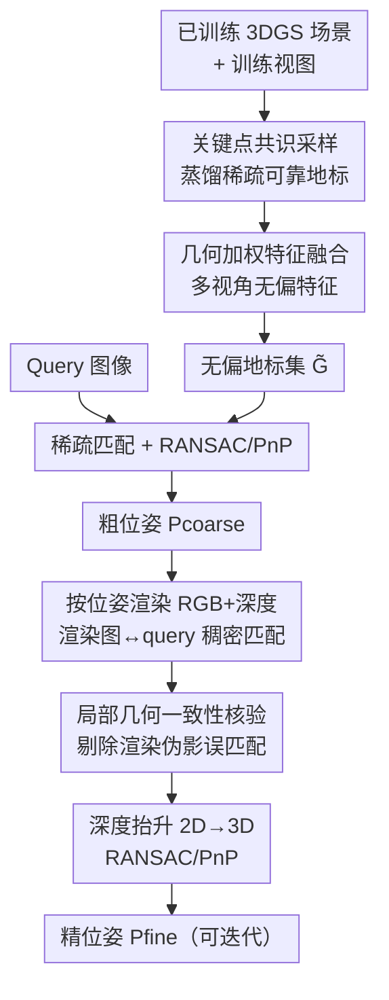

# ULF-Loc: Unbiased Landmark Feature for Robust Visual Localization with 3D Gaussian Splatting

**会议**: CVPR 2026  
**论文**: [CVF Open Access](https://openaccess.thecvf.com/content/CVPR2026/html/Gu_ULF-Loc_Unbiased_Landmark_Feature_for_Robust_Visual_Localization_with_3D_CVPR_2026_paper.html)  
**代码**: 有（论文称已开源，链接见 CVF 页面）  
**领域**: 3D视觉  
**关键词**: 视觉定位、3D高斯泼溅、特征偏差、几何加权融合、位姿估计

## 一句话总结
本文从理论上证明了「用 α-blending 优化 3DGS 特征场」会给 3D 点特征引入固有偏差，进而提出 ULF-Loc：用「几何加权多视角特征融合」替代有偏的特征优化、用「关键点共识采样」选可靠地标、用「局部几何一致性核验」剔除渲染伪影导致的误匹配，在 Cambridge Landmarks 上把平均中值平移误差比 SOTA 降低 17%，同时只需 STDLoc 1/10 的训练时间和 1/6 的显存。

## 研究背景与动机

**领域现状**：视觉定位（从单张图估计 6-DoF 相机位姿）的主流是基于结构的方法（SfM + 特征匹配 + RANSAC/PnP）和基于回归的方法（APR / SCR）。近两年兴起的一条路线是把 3D Gaussian Splatting（3DGS）的高效渲染和特征匹配结合：给每个高斯基元挂一个高维特征向量，通过 α-blending 渲染出稠密 2D 特征图，再用「渲染特征 ↔ 预训练特征」的一致性损失去优化这个 3D 特征场（代表作 GSplatLoc、STDLoc）。定位时直接把 2D query 特征和 3D 高斯特征场做匹配。

**现有痛点**：这类方法默认「优化后的 3D 高斯特征是可靠的」，可以直接拿去做精确的 2D-3D 匹配。但作者发现，这个假设是错的——α-blending 优化出来的 3D 点特征带有系统性偏差，导致匹配频繁出错，最终拖累位姿精度。此外，给每个高斯学一个高维描述子会显著抬高训练时间和显存；而「渲染图 ↔ query 图」匹配路线还会被高斯渲染的模糊和伪影污染。

**核心矛盾**：偏差的根源在于 α-blending 的耦合本质。渲染一个像素的特征时，目标高斯的特征会被强迫去「补偿」邻居高斯的集体贡献，于是优化得到的特征偏离了它本该表示的真值。只要存在遮挡或视角变化（目标高斯无法独占该像素的渲染贡献），偏差就不可避免。这是表示机制层面的缺陷，不是调参能解决的。

**本文目标**：① 在理论上把这个偏差刻画清楚（从哪来、什么时候为零）；② 设计一套不依赖 α-blending 优化的特征构造管线，让 3D 地标特征无偏且视角不变；③ 在此基础上搭一个 coarse-to-fine 定位框架，并处理渲染伪影带来的误匹配。

**切入角度**：既然「优化特征场」本身就是偏差之源，那就干脆不优化它。作者改为：在稀疏的一组可靠 3D 地标上，直接对多视角观测到的 2D 特征做加权平均融合——线性融合天然满足无偏估计，从数学上绕开了 α-blending 的耦合。

**核心 idea**：用「几何加权的多视角特征融合」代替「α-blending 特征优化」，并只在一小批高质量地标上做，从而同时换来无偏特征、高鲁棒匹配和极低的训练/显存开销。

## 方法详解

### 整体框架

ULF-Loc 要解决的是「3DGS 特征定位里 3D 特征有偏」这一根本问题，整条管线分两步走：先**离线构建一组无偏地标**，再**在线做 coarse-to-fine 位姿估计**。

构建阶段：在已训练好的 3DGS 场景上，先用**关键点共识采样（K.C. Sampling）**从稠密、冗余的高斯里蒸馏出一小批几何稳定、分布均匀的地标 $\tilde{\mathcal{G}}$；再用**几何加权特征融合（GWFF）**为每个地标直接聚合多视角的 2D 特征，得到无偏且视角不变的 3D 特征——这一步完全不走 α-blending 优化。

定位阶段：给一张 query 图，先抽 2D 关键点及其描述子，和地标特征做余弦相似度匹配得到稀疏对应 $\mathcal{M}_{coarse}$，用 RANSAC+PnP 解出粗位姿 $P_{coarse}$；然后从该位姿渲染出 RGB 图和深度图，对「渲染图 ↔ query 图」做稠密匹配，期间用**局部几何一致性核验（LGCV）**剔除渲染伪影造成的误匹配，最后用深度图把 2D 匹配抬升到 3D，再次 RANSAC+PnP 得到精位姿 $P_{fine}$（可迭代）。

### 关键设计

**1. α-blending 特征偏差的理论拆解：先证明对手错在哪，再对症下药**

这是全文的立论基石。Feature-3DGS 把像素 $u$ 的渲染特征写成 $F_s(u)=\sum_{i\in\mathcal{N}(u)} f_i\alpha_i T_i$（$T_i$ 是累计透射率）。作者把目标高斯（位于排序中第 $t$ 位）的贡献单独剥离出来，定义其累计权重 $w_k=\alpha_t T_t$，并把其余项归一化成「背景特征」 $B_k=(\sum_{i\neq t} f_i\alpha_i T_i)/(1-w_k)$，于是渲染特征可以写成一个干净的线性组合：

$$F_s(u_k) = w_k f_t + (1-w_k) B_k.$$

再假设第 $k$ 个视角观测到的 2D 特征是真值加噪声 $f_k^{2D}=\mu+\epsilon_k$（$\epsilon_k\sim\mathcal{N}(0,\Sigma)$），α-blending 优化要找的 $f_t^*$ 是让 $F_s(u_k)$ 逼近 $f_k^{2D}$ 的最优解。推导后得到这个最优解相对真值 $\mu$ 的期望偏差：

$$\text{bias} = \mathbb{E}[f_t^*]-\mu = \mathbb{E}\!\left[\frac{1-w_k}{w_k}(\mu - B_k)\right].$$

这个式子一针见血：要无偏只有两条路——(1) **完全贡献**，$w_k=1$，目标高斯独占渲染、毫无背景干扰；或 (2) **背景一致**，$B_k=\mu$，聚合背景恰好等于目标特征。可现实里遮挡和视角变化让 $w_k<1$ 几乎必然成立，而 $B_k$ 是多个不同高斯的平均，几乎不可能正好等于某个目标特征 $\mu$。所以偏差是 Feature-3DGS 表示的固有属性，而不是没调好。作者还在 7Scenes Chess 上画出「特征距离分布」（公式 7 定义 $\mathcal{D}(g_i)=1-\frac{1}{|\mathcal{V}_i|}\sum_{I}\langle f_i, F_t(I)[u_i,v_i]\rangle$）做实证：α-blending 的分布宽而散，融合方案的分布在小距离处尖锐集中，直观印证偏差确实存在。

**2. 关键点共识采样（K.C. Sampling）：从冗余高斯里挑出真正能匹配的地标**

稠密 3DGS 对渲染很好，但对定位高度冗余，而且无纹理/遮挡区的高斯条件很差，直接拿全部基元去匹配既算不动也容易错。作者的洞察是：可靠的匹配候选必须有强多视角一致性。于是给每个高斯 $g_i$ 算一个共识分数——把它的中心投影到所有训练视图，统计有多少视图里它落在某个检测出的 2D 关键点附近：

$$\mathcal{S}^i = \sum_{v\in\mathcal{V}} \mathbb{I}\!\left[\min_{k\in\mathcal{K}_v}\|\mathcal{P}^i_v - k\|\le \tau_D\right],$$

其中 $\mathcal{P}^i_v$ 是 $g_i$ 在视图 $v$ 的投影坐标，$\mathcal{K}_v$ 是该视图的 2D 关键点集，$\tau_D$ 是距离阈值（默认 1 像素）。分数高意味着这个高斯在多个视角都稳定地对齐到可检测的关键点，几何稳定且有区分度。随后在共识分数引导下做随机 k-NN 采样，兼顾空间均匀和判别性，最终得到稀疏地标集 $\tilde{\mathcal{G}}$（默认 2 万个）。这一步把「匹配谁」从几十万高斯收敛到可靠的一小撮，既降算力又降误匹配。

**3. 几何加权特征融合（GWFF）：用线性融合换无偏，用法向夹角抗视角变化**

有了无偏性的理论指引，作者放弃 α-blending，改成对每个地标直接做多视角 2D 特征的加权平均：$f^{fus}=\sum_{k=1}^K w_k f_k^{2D}$，约束 $\sum_k w_k=1$。这个线性融合的期望恰好是 $\mathbb{E}[f^{fus}]=\mu$，从根上避开了设计 1 推出的偏差。但还有一个现实问题：真实表面是非朗伯的，外观随视角剧烈变化，特征提取器抽到的 2D 特征 $f_k^{2D}$ 在不同视角并不等价、有的还不可靠。如果各视角等权平均，会被那些「斜着看」的低质量观测拖累。

GWFF 的做法是按几何关系给视角分配权重：$w_{i,k}=\bm{n}_i\cdot\bm{d}_{i,k}$，其中 $\bm{n}_i$ 是地标 $\tilde{g}_i$ 的表面法向（取最小尺度方向并消歧使 $\bm{n}_i\cdot\bm{d}_{i,k}>0$），$\bm{d}_{i,k}=(C_k-\mu_i)/\|C_k-\mu_i\|$ 是从高斯中心指向相机 $C_k$ 的归一化视线方向。法向和视线越接近正对（夹角越小），权重越大——也就是「越正面看到的观测越可信」。最后跨可见视角归一化再聚合。相比 α-blending，GWFF 既无偏，又因显式建模视角依赖而具更强的视角不变性，匹配在大视角差下也更鲁棒。

**4. 局部几何一致性核验（LGCV）：用三角形拓扑剔除渲染伪影造成的误匹配**

精化阶段要在「渲染图 ↔ query 图」之间做稠密匹配，但高斯渲染的模糊和伪影会让粗匹配（在 1/8 尺度特征图上用 dual-softmax + 互最近邻得到 $\mathcal{M}_c$）里混进大量错配。LGCV 基于「局部刚性」假设来过滤：对每个候选匹配 $(x_i,y_i)$，在其 K 近邻里构造三角形对 $\mathcal{T}_i=\{(\triangle x_ix_jx_k,\,\triangle y_iy_jy_k)\}$，对每对三角形检查两个拓扑约束——**角度一致性** $|\cos\theta_x-\cos\theta_y|<1-\tau_a$（对应角不能差太多），和**尺度一致性** $\max(|s_a-s_b|,|s_a-s_c|,|s_b-s_c|)<\tau_s$（三条边的边长比要彼此接近）。统计每个匹配有多少三角形对同时满足两约束，支持数不够的匹配直接丢弃，得到精炼匹配 $\mathcal{M}'_c$；再在 8×8 局部 patch 上做细匹配得到 $\mathcal{M}_f$。其本质是：正确匹配在局部应保持近似刚性的几何结构，伪影误匹配会破坏这种结构，所以用三角形的角度和尺度做几何「投票」就能把它们筛掉。

### 损失函数 / 训练策略
ULF-Loc 不引入新的特征学习损失——这正是它的卖点：地标特征是融合出来的而非优化出来的。底层 3DGS 仍按原始 3DGS 训练（每场景初始化后训练 30,000 次迭代，只用标准的光度损失），特征提取器用 SuperPoint，位姿求解用 Poselib 的 RANSAC+PnP。采样阶段 $\tau_D=1$ 像素、地标数 20,000、近邻 32；定位阶段 query 取 2,048 个关键点；LGCV 默认 $\tau_a=0.9659$、$\tau_s=0.1$、近邻 8、支持分数阈值 4。全部实验在单张 RTX 4090 上完成。

## 实验关键数据

### 主实验
在 7Scenes、12Scenes、Cambridge Landmarks 三个基准上对比 FM / APR / SCR / NeRF-GS 四大类方法，指标为中值平移/旋转误差（cm/°）。

| 数据集 | 指标(Avg) | 本文 | STDLoc(GS SOTA) | 最佳SCR | 提升 |
|--------|-----------|------|-----------------|---------|------|
| 7Scenes | 中值平移/旋转 | **0.7 / 0.20** | 0.8 / 0.24 | ACE 1.10 / 0.34 | 比 ACE 降约 36% |
| 12Scenes | 中值平移/旋转 | **0.3 / 0.15** | 0.4 / 0.18 | ACE 0.7 / 0.26 | 全场景最优 |
| Cambridge | 中值平移/旋转 | **8.3 / 0.13** | 10.1 / 0.14 | NeuMap 12 / 0.29 | 比 STDLoc 降 17% |

其中 Cambridge 的 Court 大尺度场景最能体现鲁棒性：很多方法在这里失效，ULF-Loc 仍达 7.49cm/0.04°，而 STDLoc 为 15.7cm。召回率上，7Scenes 在 1cm/1° 严苛阈值下达 75%（比 STDLoc +2.2%、比 ACE+GS-CPR +9%）；12Scenes 在 1cm/1° 达 94.1%（比 STDLoc +4%）。

效率是另一张王牌（7Scenes Heads 场景）：

| 方法 | 训练时间↓ | 显存↓ |
|------|-----------|-------|
| PNeRFLoc | 58 min | 6396 MB |
| GSplatLoc | 1.5 h | 6986 MB |
| STDLoc | 50 min | 6566 MB |
| **ULF-Loc** | **5 min** | **1086 MB** |

相对 STDLoc 是 10× 训练加速、1/6 显存——因为它根本不给每个高斯学高维描述子，只在稀疏地标上融合特征。

### 消融实验
在 Cambridge Landmarks 上拆 K.C. 采样 / 特征构造 / LGCV 三件套（recall [50cm/5° | 15cm/5°]，看最终位姿）：

| 配置 | 采样 | 特征 | LGCV | 最终[50/5] | 最终[15/5] |
|------|------|------|------|-----------|-----------|
| #1 | RS | Blending | 无 | 89.3 | 68.2 |
| #6 | RS+K.C. | GWFF | 无 | 91.7 | 70.9 |
| #7 | RS+K.C. | GWFF(去几何权重) | 有 | 93.2 | 70.6 |
| #8 完整 | RS+K.C. | GWFF | 有 | **93.7** | **72.0** |

### 关键发现
- **GWFF 替换 α-blending 是最大功臣**：在初始位姿（仅靠稀疏匹配）上，把 Blending 换成 GWFF 让匹配质量明显提升（如 #2→#6 的初始 recall 从 87.1/60.2 升到 89.4/63.1），印证了「无偏特征确实更可匹配」这一理论预言。
- **K.C. 采样显著优于随机/最远点采样**：在三组对照（#1 vs #2、#3 vs #4、#5 vs #6）里，加上关键点共识采样都稳定抬升，说明「挑多视角一致的高斯当地标」比单纯求空间均匀更重要。
- **几何权重和 LGCV 是锦上添花但有效**：去掉 GWFF 的几何加权（#7 vs #8）在 15/5 上掉 1.4 个点；LGCV（#6 vs #8）在精化阶段把 15/5 从 70.9 提到 72.0，主要在有运动模糊/弱纹理伪影的场景起作用。
- **地标数量很省**：约 1,000 个地标就能拿到不错召回，20,000 处饱和，远低于直接对全部基元匹配的复杂度。

## 亮点与洞察
- **「不优化特征场」反而更好**：全文最漂亮的地方是把一个被默认正确的范式（α-blending 学特征）证伪，并指出更简单的线性融合天然无偏。这是「先做理论诊断、再让方法直接落在病灶上」的范例，而不是堆模块。
- **偏差公式给了清晰的可解释边界**：$\text{bias}=\mathbb{E}[\frac{1-w_k}{w_k}(\mu-B_k)]$ 明确告诉你什么时候 α-blending 没问题（独占渲染或背景一致），这对后续想继续用特征场的人是很有用的诊断工具。
- **法向·视线点积当融合权重**：用 $\bm{n}_i\cdot\bm{d}_{i,k}$ 把「正面观测更可信」这一几何直觉变成一行权重，简单且可迁移到任何「多视角特征聚合」任务（如多视角描述子蒸馏、纹理重建）。
- **效率红利来自表示选择而非工程优化**：10× 加速、1/6 显存是「不学高维描述子」这个设计决策的直接后果，提醒我们表示层的选择往往比 trick 更能决定开销。

## 局限性 / 可改进方向
- **依赖底层 3DGS 重建质量与训练视图覆盖**：地标采样和特征融合都建立在多视角观测之上，视图稀疏或重建退化的区域，共识分数和融合特征都会变差。
- **特征提取器与位姿求解器固定**：实验用 SuperPoint+Poselib，未充分探讨换更强匹配器（如 LightGlue/RoMa）后偏差结论与增益是否依旧；GWFF 的无偏性论证假设 $f_k^{2D}=\mu+\epsilon_k$ 这一加性噪声模型，对强非线性的描述子是否严格成立值得进一步验证（⚠️ 以原文推导为准）。
- **LGCV 的刚性假设在大形变/动态场景可能失效**：局部刚性对静态、近平面区域成立，遇到大尺度透视畸变或动态物体，三角形角度/尺度一致性可能误删正确匹配。
- **法向估计来自最小尺度方向**：对薄结构或各向异性高斯，最小尺度方向未必对应真实表面法向，可能影响权重质量；可改进方向是引入更可靠的法向监督或不确定度加权。

## 相关工作与启发
- **vs STDLoc / GSplatLoc（α-blending 特征场）**：它们走「优化每高斯高维特征 + 渲染特征一致性」路线，本文证明这条路有固有偏差且开销大；ULF-Loc 改为稀疏地标 + 多视角融合，无偏、快 10×、省 6× 显存，且精度更高。这是本文最直接的对手与超越对象。
- **vs SCR 方法（ACE / GLACE / NeuMap）**：SCR 靠回归每像素 3D 坐标建稠密对应，室内精度高但要大量高质量 3D 监督、难扩展；ULF-Loc 不需坐标回归监督，靠几何融合+匹配，在 Cambridge 这类大尺度户外更稳。
- **vs inverse-rendering 位姿优化（iNeRF / GS-CPR / 6DGS）**：那类方法靠反向渲染光度/特征误差迭代精化，对初值敏感且受渲染伪影影响；ULF-Loc 用 coarse-to-fine 显式匹配 + LGCV 直接处理伪影误匹配，对初值更宽容。
- **启发**：「先诊断主流范式的系统性误差、再用最小改动消除它」这一研究范式，以及「多视角特征聚合用几何（法向·视线）加权」的思路，都能迁移到 NeRF/3DGS 的语义场、编辑、跨视角一致性等任务。

## 评分
- 新颖性: ⭐⭐⭐⭐⭐ 把被默认正确的 α-blending 特征学习证伪，并给出闭式偏差公式 + 无偏替代，是机制层面的真创新。
- 实验充分度: ⭐⭐⭐⭐ 三大基准 + 完整消融 + 效率对比都有，唯独未换不同匹配器/求解器做敏感性分析。
- 写作质量: ⭐⭐⭐⭐⭐ 理论推导清晰、动机一步步推到方法、图表组织规整，可读性强。
- 价值: ⭐⭐⭐⭐⭐ 在 SOTA 精度上还把训练/显存降一个量级，对 AR/导航等实际部署很有吸引力。

<!-- RELATED:START -->

## 相关论文

- [\[CVPR 2026\] AsymLoc: Towards Asymmetric Feature Matching for Efficient Visual Localization](asymloc_towards_asymmetric_feature_matching_for_efficient_visual_localization.md)
- [\[CVPR 2025\] Gaussian Splatting Feature Fields for Privacy-Preserving Visual Localization](../../CVPR2025/3d_vision/gaussian_splatting_feature_fields_for_privacy-preserving_visual_localization.md)
- [\[CVPR 2026\] Robust3DGSW: Toward Robust Watermarking for Quantization-Aware 3D Gaussian Splatting](robust3dgsw_toward_robust_watermarking_for_quantization-aware_3d_gaussian_splatt.md)
- [\[CVPR 2026\] Towards Visual Query Localization in the 3D World](towards_visual_query_localization_in_the_3d_world.md)
- [\[CVPR 2026\] Hierarchical Visual Relocalization with Nearest View Synthesis from Feature Gaussian Splatting](hierarchical_visual_relocalization_with_nearest_view_synthesis_from_feature_gaus.md)

<!-- RELATED:END -->
