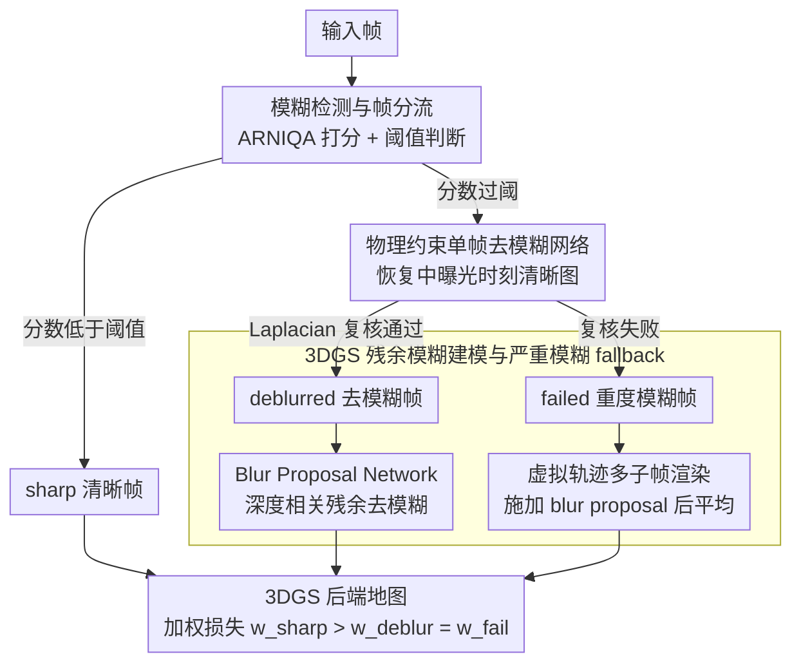

# Unblur-SLAM: Dense Neural SLAM for Blurry Inputs

**会议**: CVPR 2026  
**arXiv**: [2603.26810](https://arxiv.org/abs/2603.26810)  
**代码**: [https://github.com/SlamMate/Unblur-SLAM.git](https://github.com/SlamMate/Unblur-SLAM.git)  
**领域**: 3D 视觉 / 神经 SLAM  
**关键词**: 模糊鲁棒 SLAM、3DGS、单帧去模糊、子帧建模、混合 bundle adjustment

## 一句话总结

Unblur-SLAM 不是简单把去模糊网络塞进 SLAM 前端，而是围绕“哪些模糊帧可以先去模糊再跟踪、哪些模糊帧必须直接在 3D 空间里建模”这一关键决策，设计了模糊检测、物理约束去模糊、3D Gaussian blur refinement 和严重模糊 fallback 的完整流水线，因此能同时处理运动模糊和散焦模糊，并显著提升跟踪与重建质量。

## 研究背景与动机

大多数 SLAM 系统默认输入帧足够清晰。无论是依赖特征点的传统方法，还是更现代的 dense/neural SLAM，本质上都需要在相邻视图间建立可靠对应关系。一旦图像受运动模糊或散焦模糊影响，前端跟踪变弱，后端重建也会被拖垮。

现有去模糊 SLAM 工作主要有两个问题。第一，很多方法默认模糊都来自相机运动，因此重点建模 motion blur，而忽略 defocus blur。可现实数据并非如此，手机、手持相机、室内弱光采集里二者常同时出现。第二，许多 blur-aware SLAM 方法把所有帧都当成模糊帧处理，这会显著增加计算成本，也不符合真实数据里“模糊帧只占一部分”的事实。

作者因此提出一个更精细的问题设置：

- 并不是所有帧都需要昂贵的模糊优化。
- 并不是所有模糊帧都能靠单帧去模糊网络修好。
- 一旦单帧去模糊失败，系统不应直接崩掉，而应切换到更稳的 3D 建模方式。

换句话说，SLAM 需要的不是一个“万能去模糊器”，而是一套对不同模糊程度与模糊类型都能做分流处理的系统。Unblur-SLAM 就是在这个前提下设计的。

## 方法详解

### 整体框架

系统先对输入帧做模糊量评估，再根据结果分成三类：

- **sharp frames**：清晰帧，直接进入 Droid-SLAM 前端和 3DGS 后端，不做额外昂贵处理。
- **successfully deblurred blurry frames**：模糊但可以被单帧去模糊网络修复的帧，先去模糊，再进入跟踪与映射，同时在后端用残余模糊模型继续细化。
- **failed blurry frames**：模糊太重或类型太复杂，单帧去模糊失败。这类帧不再强行送进 tracker，而是通过多子帧渲染和 blur network 直接在 3DGS 空间中解释其成像过程。

这个三分流是整篇文章的核心。它避免了两个极端：既不假设所有帧都必须做重型模糊优化，也不在去模糊失败时简单丢弃信息。

### 关键设计

**1. 模糊检测与帧分流：先把模糊量量化出来，再决定一帧值不值得做重型去模糊**

整条流水线的入口是一个分流决策，而不是去模糊本身。作者的出发点很直白：真实序列里模糊帧只占一部分，对每帧都跑昂贵的模糊优化既慢又没必要。问题是 SLAM 系统怎么知道哪帧模糊、模糊到什么程度。为此作者专门构建了一个包含真实与半合成数据的模糊检测 benchmark，把 39 种图像质量/模糊指标拉到一起横向比较，最终选 ARNIQA 作为默认 blur detector。运行时逻辑是两级判断：先看模糊分数，低于阈值就当清晰帧直接放行；高于阈值则送进去模糊分支，去模糊之后再用 Laplacian ratio 之类的清晰度标准复核一遍，判断这次修复到底成没成功。正是这个"先量化、再分支"的设计，让后面三条路径各司其职，把计算预算压在真正需要的帧上。

**2. 物理约束单帧去模糊网络：恢复曝光中间时刻的真值，而不是单纯把图锐化**

对判定为"可修复"的模糊帧，作者用一个两阶段训练的去模糊网络做前置修复，目标是给前端跟踪和深度估计提供尽量接近中曝光时刻的清晰图像。第一阶段在 RED、GoPro、ReplicaBlurry 等半合成 motion blur 数据上训练，让网络学会恢复曝光区间的中间帧；第二阶段再到 DPDD defocus 数据集上微调，把散焦模糊也覆盖进去。关键不在网络结构，而在训练约束——作者用基于成像物理的中帧约束来监督，逼网络对齐真实的中曝光成像，而不是去追求视觉上更"锐"。这条原则来自 I2-SLAM 一类工作的教训：普通 2D 去模糊网络若不管几何一致性，往往会造出看着清晰、却不利于多视图匹配的伪纹理，反而把 SLAM 的对应关系搞坏。因此这里恢复的是"几何上对的清晰"，不是"观感上的清晰"。

**3. 3DGS 残余模糊建模与严重模糊 fallback：轻度模糊先修后跟踪，重度模糊直接在 3D 里解释它为什么糊**

地图侧用 Splat-SLAM 式的 3D Gaussian Splatting 表示，而模糊在这里被分成两种处置方式。对于已经成功去模糊、但还残留一点模糊的帧，系统借 Blur Proposal Network 估计逐像素的卷积核和 mask，对渲染图像做与深度相关的残余去模糊和细节增强，把"修了一半"的部分在后端补齐。对于去模糊失败的重度模糊帧，作者不再硬塞给 tracker，而是沿虚拟相机轨迹渲染多个子帧，对每个子帧施加 blur proposal 再平均，合成出一个"本来就该这么糊"的观测，直接拟合模糊的成像过程。这背后的判断是：轻中度模糊更适合"先修复再跟踪"，重度模糊则更适合"在 3D 空间里建模它为什么糊"，而不是逼所有帧走同一条路径。

### 一个完整示例：一段序列的三种帧各走哪条路

设想一段手持拍摄的室内序列，相机时快时慢，偶尔还失焦。某一帧拍得很稳，ARNIQA 给出的模糊分数低于阈值，它被判为 **sharp frame**，不做任何额外处理就进入 Droid-SLAM 前端和 3DGS 后端，充当强几何锚点。下一帧相机轻微抖动，模糊分数过阈，进入去模糊分支；网络修复后 Laplacian ratio 复核通过，于是它成为 **deblurred frame**，先以修复图做跟踪，再在后端用 Blur Proposal Network 估计的残余核做一次深度相关细化。再下一帧赶上相机急转加散焦，去模糊后复核仍不达标——它被判为 **failed frame**，系统不把它喂给 tracker，转而沿虚拟轨迹渲染若干子帧、逐个施加 blur proposal 后平均，用这个合成观测在 3DGS 里直接拟合它的模糊成像。三帧走了三条路，而它们在后端用不同权重的损失统一进同一张地图——这正是"分流"二字的落点。

### 损失函数 / 训练策略

后端优化分为三类损失。

- **Sharp frame loss**：对清晰帧赋予更大权重，作为强几何和外观锚点。
- **Deblur frame loss**：对成功去模糊的帧做多尺度 RGB 与深度一致性优化，并加上稀疏 mask 正则。
- **Fail frame loss**：对失败帧使用多子帧合成后的 RGB/Depth 误差优化。

总损失是所有帧的加权和，且 `w_sharp > w_deblur = w_fail`。作者同时保留 sliding-window BA、loop closure 和 global BA，并在全局优化里对 Gaussian 尺度加入正则，防止过度拉伸。

## 实验关键数据

### 主实验

论文分别在极端模糊合成场景、离线去模糊标准集以及真实 SLAM 数据集上测试，既看跟踪 ATE，也看重建 PSNR/SSIM/LPIPS。

| 数据集 / 方法 | 关键指标 1 | 关键指标 2 | 结果 |
|---|---|---|---|
| ArchViz-1 MBA-SLAM | ATE | PSNR | 0.0075 / 28.45 |
| ArchViz-1 Ours | ATE | PSNR | **0.0075 / 28.76** |
| ArchViz-2 MBA-SLAM | ATE | PSNR | 0.0036 / 30.16 |
| ArchViz-2 Ours | ATE | PSNR | **0.0027 / 32.71** |
| ArchViz-3 MBA-SLAM | ATE | PSNR | 0.0141 / 27.85 |
| ArchViz-3 Ours | ATE | PSNR | **0.0067 / 30.09** |
| Deblur-NeRF offline SOTA (CoMoGaussian) | PSNR / SSIM / LPIPS | - | 27.85 / 0.8431 / 0.0822 |
| **Ours** | PSNR / SSIM / LPIPS | - | **29.49 / 0.9213 / 0.0728** |

这张表有两个信息点。第一，Unblur-SLAM 在 ArchViz 这种几乎全是极端模糊的合成场景里，比 MBA-SLAM 更稳，特别是第三个序列 ATE 和 PSNR 都提升明显。第二，更有冲击力的是，在 Deblur-NeRF 这个离线去模糊 benchmark 上，在线方法居然还能超过一批离线方法，说明其 3D blur modeling 非常有效。

### 真实数据与运行效率

作者还在 TUM RGB-D 与 IndoorMCD 上测试轨迹误差，并报告 TUM 上的映射质量和运行速度。

| 实验 | 对比项 | 指标 | 结果 |
|---|---|---|---:|
| TUM 跟踪 | Droid-SLAM | ATE[m] | 0.380 |
| TUM 跟踪 | Ours* | ATE[m] | 0.352 |
| TUM 跟踪 | **Ours** | ATE[m] | **0.336** |
| MCD 跟踪 | Droid-SLAM | ATE[m] | 0.138 |
| MCD 跟踪 | **Ours** | ATE[m] | **0.128** |
| TUM 映射 fr1_desk | I2-SLAM / Ours | PSNR | 27.23 / **28.03** |
| TUM 映射 fr2_xyz | I2-SLAM / Ours | PSNR | **32.06** / 31.14 |
| TUM 映射 fr3_office | I2-SLAM / Ours | PSNR | 28.91 / **29.22** |
| 运行速度 | Splat-SLAM | FPS | 1.24 |
| 运行速度 | I2-SLAM | FPS | 0.095 |
| 运行速度 | Ours w/o ref. | FPS | 0.85 |
| 运行速度 | **Ours** | FPS | **0.74** |

### 关键发现

- 模糊分流非常重要。若所有帧都走重型 blur refinement，系统会明显更慢；若所有模糊帧都简单喂给 tracker，又会导致跟踪失败。Unblur-SLAM 正是靠分流拿到了稳定性与速度之间的平衡。
- 物理约束的中帧去模糊训练是必要的。作者特别指出，普通单帧去模糊若缺少 3D 一致性约束，反而会伤害 SLAM。
- 严重模糊 fallback 并不是少数边角情况。只要相机快速运动或存在明显散焦，这条路径就能避免系统直接丢帧或崩溃。
- 尽管最终速度仍低于纯 Splat-SLAM，但比 I2-SLAM 快很多，说明这套系统还保留了一定的在线可用性。

## 亮点与洞察

- 这篇论文最值得肯定的是系统观。很多相关工作只解决“去模糊更清晰”或“SLAM 更鲁棒”中的一个点，本文则真正围绕整条 pipeline 的失败模式设计了不同分支。
- 作者没有把单帧去模糊神化。它被当作前置修复器，但一旦失败，系统立刻切换到 3D 空间的模糊建模，这是非常成熟的工程思路。
- 成功去模糊帧和失败帧使用不同损失与不同更新策略，也说明作者理解“模糊不是单一强度标量，而是对成像过程的不同扰动”。
- 在线方法在 Deblur-NeRF 上超过离线方法这一点很亮眼，说明 3DGS + blur network 的组合不只是为了 SLAM 服务，本身也具备很强的去模糊能力。

## 局限与展望

- 虽然作者已经比很多 blur-aware SLAM 更快，但 0.74 FPS 与真正实时系统仍有差距，尤其部署在移动平台上时会更吃紧。
- 系统目前主要针对静态场景。若场景中存在明显动态物体，模糊来源与几何变化会耦合，现有模型未必能稳定处理。
- 严重模糊分支依赖虚拟子帧与 blur proposal 网络，参数较多、链路较长，后续可探索更紧凑的表示方式。
- 当前 blur detector 使用固定阈值策略，对不同设备和不同曝光设置的泛化能力仍需要更多外部测试。
- 一个很自然的后续方向，是把 3D foundation model 的空间先验进一步并入 blur-aware SLAM，让模型不只会“看清”，还会“更懂几何”。

## 相关工作与启发

- **vs MBA-SLAM / Deblur-SLAM**：这些方法主要聚焦 motion blur，且通常默认所有帧都模糊；Unblur-SLAM 则同时覆盖 motion blur 与 defocus blur，并显式处理 sharp/blurry/failure 三类帧。
- **vs I2-SLAM**：I2-SLAM 已注意到成像过程建模的重要性，但它对单帧去模糊的一致性利用不够成功；本文通过物理约束训练和 3DGS refinement 把这条路走通了。
- **vs 离线 3DGS 去模糊方法**：像 BAGS、CoMoGaussian 注重离线高质量重建，本文则把这些思想带进在线 SLAM，并增加对严重模糊帧的 fallback。
- 对研究的启发是，感知前处理模块不应孤立设计。真正影响系统表现的，往往是“前处理失败以后怎么办”。Unblur-SLAM 的分流思想在低光、噪声、雨雾等其他困难成像条件下也很值得借鉴。

## 评分

- 新颖性: ⭐⭐⭐⭐ 同时处理运动模糊与散焦模糊，并把去模糊失败分支系统化纳入 SLAM，组合设计很强。
- 实验充分度: ⭐⭐⭐⭐ 合成、真实、离线 benchmark 和运行速度都测了，但更多真实长序列和动态场景仍值得补充。
- 写作质量: ⭐⭐⭐⭐ 方法链路较长，但组织清楚，系统各模块职责明确。
- 价值: ⭐⭐⭐⭐⭐ 对真实世界 SLAM 落地很有意义，尤其适合模糊频发的手持和移动设备场景。

<!-- RELATED:START -->

## 相关论文

- [\[CVPR 2026\] SGAD-SLAM: Splatting Gaussians at Adjusted Depth for Better Radiance Fields in RGBD SLAM](sgad-slam_splatting_gaussians_at_adjusted_depth_for_better_radiance_fields_in_rg.md)
- [\[CVPR 2026\] S2D: Sparse to Dense Lifting for 3D Reconstruction with Minimal Inputs](s2d_sparse_to_dense_lifting_for_3d_reconstruction_with_minimal_inputs.md)
- [\[CVPR 2026\] ODGS-SLAM: Omnidirectional Gaussian Splatting SLAM](odgs-slam_omnidirectional_gaussian_splatting_slam.md)
- [\[CVPR 2026\] Flow4DGS-SLAM: Optical Flow-Guided 4D Gaussian Splatting SLAM](flow4dgs-slam_optical_flow-guided_4d_gaussian_splatting_slam.md)
- [\[CVPR 2026\] SCE-SLAM: Scale-Consistent Monocular SLAM via Scene Coordinate Embeddings](sce-slam_scale-consistent_monocular_slam_via_scene_coordinate_embeddings.md)

<!-- RELATED:END -->
