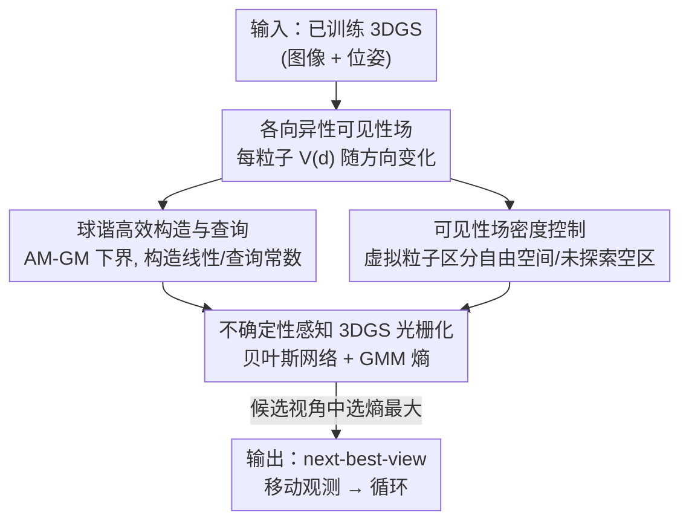

# Uncertainty-driven 3D Gaussian Splatting Active Mapping via Anisotropic Visibility Field

**会议**: CVPR 2026  
**arXiv**: [2605.30342](https://arxiv.org/abs/2605.30342)  
**代码**: 有项目主页（论文标注 Project page，URL 见原文）  
**领域**: 3D视觉 / 3DGS / 主动建图  
**关键词**: 3D高斯泼溅, 不确定性量化, 各向异性可见性场, 主动建图, 球谐函数

## 一句话总结
提出 GAVIS——把 3DGS 中每个高斯粒子相对训练视角的「可见性」建模成一个随观察方向变化的**各向异性可见性场**，用球谐函数解析地（免训练、1 秒内）构造与查询，再接入贝叶斯网络式的不确定性感知光栅化，从而为机器人主动建图提供可靠且 200 FPS 实时的不确定性估计，在精度和效率上全面超越 FisherRF / VIMC / NVF。

## 研究背景与动机
**领域现状**：机器人进入陌生环境要做「主动建图」（active mapping / next-best-view 规划）——一边重建一边选下一个最该去观测的视角，目标是减少地图的不确定性、达到对场景的全覆盖。3DGS 因为重建质量高、渲染快，正成为主动建图的理想表征，但前提是能**准确量化它的不确定性**：哪里建得不可靠，机器人就该去那里。

**现有痛点**：3DGS 参数量巨大，给它做不确定性量化很难。现有方法把机器学习里的「认知不确定性」工具直接搬过来——FisherRF 用 Laplace 近似估 Hessian、VIMC 用变分推断。问题是：主动建图真正关心的是「训练视角从没看过的区域」，这类区域的预测**必然**不可靠、应当被赋予高不确定性；但作为近似方法，这些学习式 UQ 无法保证这一点，反而经常**低估**这些未见的、分布外区域的不确定性，导致机器人没有动机去探索它们。

**核心矛盾**：主动建图需要的「未见即高不确定」的硬性保证，和学习式近似 UQ 的「平滑、会外推」天性是冲突的。NVF（NeRF 上的神经可见性场）抓住了「可见性 = 区域不确定性的关键」这个洞察，但它要为可见性场**训练一个神经网络**（每个规划步重训，耗时数分钟到数小时），且只把可见性建模成**位置的函数**（各向同性），忽略了可见性本质上是「随观察方向变化」的——看墙的一面，对另一面一无所知。

**本文目标**：① 给 3DGS 设计一个能可靠地把高不确定性赋给未观测区域的可见性场；② 把它做成解析、免训练、实时（构造 1 秒内、查询常数时间）；③ 既能独立用，也能作为 post-hoc 模块插进现有 UQ 框架去提升它们。

**切入角度**：既然 3DGS 已经用球谐函数表示「随方向变化的颜色」，那完全可以用同一套球谐机制，把「随方向变化的可见性」也解析地表示出来——不需要再训一个网络。

**核心 idea**：用球谐函数把每个高斯粒子的**各向异性可见性场** $V^{(i)}(\mathbf{d})$ 解析地存下来、常数时间查出来，再把它注入不确定性感知的 3DGS 光栅化，用熵作为主动建图的信息增益目标。

## 方法详解

### 整体框架
GAVIS 的输入是一个已训练好的 3DGS（来自目前为止观测到的图像+位姿），输出是「下一个最该去的相机视角」。整体分三步走：① **构造可见性场（VF CONST）**——对每个高斯粒子，解析地算出它相对所有训练视角的各向异性可见性，用球谐系数 $\{\gamma^{\mathcal{P}}_{\ell m}\}$ 存储；同时撒入「虚拟粒子」把「真·自由空间」和「未探索空区」区分开。② **不确定性感知光栅化**——对从先验分布采样出的一批候选视角，用一个查询可见性场（VF QUERY）的贝叶斯网络式 3DGS 光栅器，把每条光线的颜色分布建模成高斯混合（GMM），用 GMM 的熵作为该视角的不确定性。③ **选视角**——挑熵最大（信息增益最大）的候选视角作为 next-best-view，机器人移动过去观测，循环往复。

整条管线相对 NVF 的本质改进有两点：把「神经网络近似的、各向同性的」可见性场，换成「球谐解析的、各向异性的」可见性场；并用虚拟粒子修补 3DGS 密度控制带来的「空区歧义」。

### 关键设计

**1. 各向异性可见性场：让可见性随观察方向变化，解决自占据**

NVF 把可见性建成位置的标量函数 $V(\mathbf{x})$，但这对 3DGS 不够用：一个高斯粒子会**自占据**——从一个方向看到它，对它背面的样子毫无信息。看到墙的一面，并不代表知道墙背面长什么样，那里就该是高不确定性。为此本文把可见性定义为依赖渲染方向 $\mathbf{d}$ 的函数 $V^{(i)}(\mathbf{d})$。先算粒子 $i$ 相对单个训练视角 $\mathbf{p}$ 的可见性，它由三项相乘：

$$V^{(i)}_{\mathbf{p}}(\mathbf{d}) = \underbrace{\Phi_{i,\mathbf{p}}}_{\text{FOV}} \cdot \underbrace{T_{\mathbf{p}}(t_i^{\mathbf{p}})}_{\text{透射率}} \cdot \underbrace{\nu(\mathbf{d};\mathbf{d}_{\mathbf{p}})}_{\text{方向可见性}}$$

其中 $\Phi_{i,\mathbf{p}}\in\{0,1\}$ 是粒子是否落在相机 $\mathbf{p}$ 视场内的二值指示；$T_{\mathbf{p}}(t_i^{\mathbf{p}})$ 是从相机沿 $\mathbf{d}_{\mathbf{p}}$ 射到该粒子、无遮挡的透射率（可直接从辐射场输出拿到）。前两项就是 NVF 的各向同性可见性。**新增的第三项**方向可见性函数 $\nu(\mathbf{d};\mathbf{d}_{\mathbf{p}}) = \zeta\exp(\kappa\,\mathbf{d}\cdot\mathbf{d}_{\mathbf{p}})$（正比于球面上的 von Mises–Fisher 分布，$\kappa$ 类比高斯方差的倒数控制集中度，$\zeta=\exp(-\kappa)$ 保证 $\mathbf{d}=\mathbf{d}_{\mathbf{p}}$ 时取值为 1），刻画了「渲染方向 $\mathbf{d}$ 越偏离训练方向 $\mathbf{d}_{\mathbf{p}}$，可见性越低、不确定性越高」。最后对整个训练视角集合 $\mathcal{P}$ 用「至少被一个视角看到」的概率聚合：$V^{(i)}(\mathbf{d}) = 1 - \prod_{\mathbf{p}\in\mathcal{P}}\big(1 - V^{(i)}_{\mathbf{p}}(\mathbf{d})\big)$。这样从墙正面看过、从未看过背面，背面方向上的可见性就会低、不确定性高，正好驱动机器人去补观测。

**2. 球谐高效构造与查询：用 AM-GM 下界把复杂度从随视角数平方降到常数**

直接照式子算 $V^{(i)}(\mathbf{d})$ 在真实机器人场景里不可行：每查一个方向都要访问所有历史训练方向 $\mathbf{d}_{\mathbf{p}}$，运行时和内存都随轨迹长度线性增长。本文借鉴 3DGS 用球谐表示方向相关颜色的思路，把可见性也写到球谐正交基 $Y^m_\ell(\mathbf{d})$ 上。难点在于：方向可见性函数 $\nu$ 可以解析展开成球谐（系数 $a_{\ell m} = 4\pi\,i_\ell(\kappa)\,Y^{m*}_\ell(\mathbf{d}_{\mathbf{p}})$，$i_\ell$ 是第一类修正球贝塞尔函数），但聚合式里有**连乘**，球谐的乘法极其昂贵——直接代入算 $V^{(i)}(\mathbf{d})$ 的球谐系数需要 $O(|\mathcal{P}|^4 L^3)$ 构造复杂度、$O(|\mathcal{P}|^2 L^2)$ 内存，查询随训练视角数 $|\mathcal{P}|$ **平方增长**。

本文的关键技巧是用算术-几何均值（AM-GM）不等式给出一个**可避开球谐乘法的下界**：

$$V^{(i)}(\mathbf{d}) \;\ge\; 1 - \Big(1 - \tfrac{\tilde{V}^{(i)}(\mathbf{d})}{|\mathcal{P}|}\Big)^{|\mathcal{P}|}, \qquad \tilde{V}^{(i)}(\mathbf{d}) := \sum_{\mathbf{p}} V^{(i)}_{\mathbf{p}}(\mathbf{d})$$

这里把「连乘」换成了对单视角可见性的「求和」$\tilde{V}^{(i)}$，而求和在球谐空间就是系数相加——于是辅助函数 $\tilde{V}^{(i)}(\mathbf{d})$ 的球谐系数能写成 $\gamma^{\mathcal{P}}_{\ell m} = 4\pi\zeta\,i_\ell(\kappa)\sum_{\mathbf{p}\in\mathcal{P}}\Phi_{i,\mathbf{p}}T_{\mathbf{p}}(t_i^{\mathbf{p}})Y^{m*}_\ell(\mathbf{d}_{\mathbf{p}})$，**构造复杂度随 $|\mathcal{P}|$ 线性**。每个粒子只存 $(L+1)^2$ 个系数（实测 $L=2$ 就足以刻画可见性各向异性，和 3DGS 表颜色用的 SH 阶数一致）。查询时先用系数算出 $\tilde{V}^{(i)}(\mathbf{d})$，再代回 AM-GM 下界（Alg. 1），**常数时间**得到可见性，与轨迹长度无关。结果是构造耗时 <1 秒、比 NVF 快约 500×。

**3. 可见性场密度控制：用虚拟粒子区分「真自由空间」和「未探索空区」**

3DGS 的自适应密度控制会在自由空间剪掉粒子、在感兴趣区致密化，这本是优点，却给不确定性估计埋了坑：未探索区域因为没有 loss、拿不到梯度，**也不会被致密化**，于是「真·空旷的自由空间」和「该去但还没去的未探索空区」在粒子分布上看起来一模一样。以粒子为中心的不确定性度量会把两者都判成低不确定，可主动建图恰恰要把未探索空区标成高不确定。

本文的修法是引入**虚拟粒子**：给定训练好的 3DGS，在场景里均匀撒一批零不透明度的虚拟粒子，按 $1 - \prod_{\mathbf{p}\in\mathcal{P}}(1-\Phi_{i,\mathbf{p}}T_{\mathbf{p}}(t_i^{\mathbf{p}}))$ 算它们相对所有训练视角的可见性。可见性低 = 落在未探索区（保留，并把它在所有方向上的可见性设为 $V^{(i)}(\mathbf{d})=0$，即最高不确定）；可见性高 = 在自由空间（用阈值剪掉）。保留下来的虚拟粒子拼接进原 3DGS 一起做不确定性量化。实测只需约总粒子数的 5–10% 就足以把两类空区分开。

**4. 不确定性感知 3DGS 光栅化与主动建图管线：用 GMM 熵作信息增益目标**

把前面的可见性场接入一个贝叶斯网络式的不确定性感知光栅器。沿每条光线，把观测像素颜色的概率密度建成高斯混合模型，并显式注入可见性修正：

$$p(\mathbf{z}_0) = \sum_i w^*_i\, v_i\, \mathcal{N}(\boldsymbol{\mu}_{\mathbf{c}_i},\mathbf{Q}_{\mathbf{c}_i}) + \mathcal{N}(\boldsymbol{\mu}_0,\mathbf{Q}_0)\sum_i w^*_i(1-v_i)$$

其中 $v_i = V(\mathbf{x}_i)$ 是点 $i$ 沿光线方向 $\mathbf{d}$ 查可见性场得到的可见概率，$\mathcal{N}(\boldsymbol{\mu}_0,\mathbf{Q}_0)$ 是代表「不可见区域颜色」的大方差先验。可见性越低，质量越多落到大方差先验项上，熵越大。把 GMM 的熵作为合成视角的不确定性，主动建图就是在候选视角里选熵最大者 $\tau^* = \arg\max_\tau \mathcal{H}(\mathbf{Z}_\tau)$——这是对「最大化新观测带来的期望信息增益」的实用近似。整套量化达到 200 FPS 实时。

### 损失函数 / 训练策略
GAVIS 本身**不引入训练**：可见性场是在已训练 3DGS 之上解析构造的（球谐系数闭式计算，免梯度）。唯一超参是球谐阶数 $L=2$、von Mises–Fisher 集中度 $\kappa$、虚拟粒子比例（约 5–10%）与剪枝可见性阈值。规划步数按数据集设定：NeRF-Synthetic 10 步、Gibson 40 步、HM3D 80 步（取「最强方法达到合理重建质量的最小步数」）。

## 实验关键数据

### 主实验
三类场景 / 4 个数据集：NeRF-Synthetic（物体重建）、Space（HST + ISS，空间机器人）、室内（HM3D 8 个 + Gibson 8 个，家用机器人）。对比 3DGS 系的 FisherRF、VIMC 与 NeRF 系的 NVF，所有方法用相同的主动建图管线与视角采样器（A40 GPU）。

| 数据集 | 指标 | GAVIS | 次优 | 说明 |
|--------|------|-------|------|------|
| NeRF-Synthetic | PSNR↑ | **24.26** | 23.14 (VIMC) | 全指标第一 |
| Space | PSNR↑ | **26.14** | 24.56 (VIMC) | SSIM 0.857、VIS 0.582 均最佳 |
| Gibson | PSNR↑ | **24.42** | 23.29 (NVF) | FisherRF 仅 18.11、VIMC 15.70 |
| HM3D | PSNR↑ | **23.97** | 22.69 (NVF) | 复杂室内优势最明显 |

效率（UQ FPS 越高越好、$T_{\text{UP}}$ 准备时间越小越好）：

| 方法 | UQ FPS (Gibson) | $T_{\text{UP}}$ (HM3D) | 备注 |
|------|-----------------|----------------------|------|
| GAVIS | **207.3** | **0.79 s** | 构造比 NVF 快 ~500×，UQ 快 ~30× |
| NVF | 4.2 | 285.26 s | 最强 baseline 但需重训神经场 |
| FisherRF | 39.8 | 1.59 s | 需对光栅器反传梯度 |
| VIMC | 50.1 | 14.51 s | 需共训随机辐射场+多次采样光栅化 |

> $T_{\text{UP}}$（Uncertainty Preparation Time）= 训完辐射场后、与候选视角数无关的额外准备时间（GAVIS/NVF 是可见性场构造、FisherRF 是估 Hessian、VIMC 是相对标准训练的额外开销）；UQ FPS = 对每个候选视角量化不确定性的帧率。

### 消融实验
（Tab. 2，所有数据集平均）

| 配置 | PSNR↑ | CR↑ | VIS↑ | 说明 |
|------|-------|-----|------|------|
| GAVIS (Full) | **24.70** | **0.748** | **0.697** | 完整模型 |
| Isotropic | 23.97 | 0.741 | 0.671 | 令 $\nu(\mathbf{d};\mathbf{d}_p)=1$，去各向异性 |
| w/o DC | 24.18 | 0.712 | 0.668 | 去掉可见性场密度控制（虚拟粒子） |
| Iso. w/o DC | 23.38 | 0.691 | 0.625 | 两者都去 = NVF 的 3DGS 直接扩展，最差 |

不确定性质量（Tab. 4，5 个代表场景）：GAVIS 的 **AUSE-D = 0.24、AUSE-V = 0.176**，两项均显著优于 NVF（0.381 / 0.231）、FisherRF（0.463 / 0.496）、VIMC（0.504 / 0.447）。AUSE-V 是本文新提的「基于可见性」的稀疏化误差曲线下面积变体，比标准深度版 AUSE-D 更贴合主动建图目标。

### 关键发现
- **各向异性与密度控制都不可或缺**：单去任一组件全指标都掉，两者全去退化成 NVF 的 3DGS 版、性能最差。各向异性在 PSNR 等图像指标上增益更明显，但在 VIS/网格类**各向同性、方向无关**的指标上增益较小——因为一个网格面被任意方向看一次就算「可见」，没法体现「从多方向重访同一区域」的价值。
- **室内复杂场景增益最大**：Gibson/HM3D 上 GAVIS 远超不建模可见性的 FisherRF、VIMC（差距可达 6–9 dB PSNR），印证了「可见性建模是主动建图主导因素」。
- **post-hoc 即插即用**（Tab. 3）：把 GAVIS 作为 post-hoc 模块插进 FisherRF / VIMC，PSNR 从 20.73→24.70、20.14→24.21 大幅提升。其中 FisherRF+GAVIS 仅略好于 GAVIS 单用，说明可见性几乎是决定性因素；VIMC+GAVIS 反而不如 GAVIS 单用，因为 VIMC 的采样噪声盖过了可见性带来的收益。

## 亮点与洞察
- **用 3DGS 自带的球谐机制顺手把「可见性」也表示了**：既然 3DGS 已用 SH 表方向相关颜色，那方向相关可见性完全可以共用同一套解析表征，免去 NVF 训练神经网络的数分钟开销——「方向相关的量就用球谐」这个思路可迁移到 3DGS 上任何 view-dependent 属性（材质、遮挡、置信度）。
- **AM-GM 下界是真正的工程妙手**：聚合式里的连乘让球谐乘法爆炸（$O(|\mathcal{P}|^4 L^3)$），一个不等式把连乘换成求和、求和在球谐空间就是系数相加，复杂度降到构造线性、查询常数。这种「用可解析的下界替代昂贵精确值」的技巧值得记下。
- **虚拟粒子戳中 3DGS 做不确定性的隐藏坑**：3DGS 密度控制让「自由空间」和「未探索空区」长得一样，是粒子中心 UQ 普遍的盲点；零不透明度虚拟粒子 + 可见性阈值这招简单且只需 5–10% 粒子，是个低成本可复用的修补。
- **AUSE-V 这个评测指标本身就是贡献**：作者指出标准 AUSE-D 与主动建图目标错位，自定义可见性版 AUSE-V 更能反映探索质量——提醒「换了任务就该换评测」。

## 局限与展望
- **各向异性的好处被现有网格/覆盖率指标低估**：作者自己承认 VIS、CR 这类各向同性指标无法体现「多方向重访」的价值，所以方法的部分优势在数字上没充分显现；缺少能量化方向覆盖完整度的指标。
- **高不确定 ≠ 低 GT 可见**：作者指出当测试视角方向严重偏离训练方向时，可能出现高不确定但 GT 可见的情况，可见性与不确定性的对应只是单向保证（低 GT 可见 → 应高不确定），反向不成立——这对依赖该信号的下游决策是潜在噪声源。
- **依赖一个已训练好的 3DGS 和透射率输出**：可见性场构造前提是 3DGS 已训练且能给出靠谱透射率，初始观测极稀疏、3DGS 还没成型时可见性估计的可靠性如何，文中未充分讨论。
- **超参（$\kappa$、虚拟粒子比例、剪枝阈值）的跨场景鲁棒性**：实测值给在窄区间，但对不同尺度/拓扑场景是否稳定需要更多验证。

## 相关工作与启发
- **vs NVF**：NVF 首次指出可见性对主动建图至关重要，但用神经网络近似**各向同性**可见性场，每步重训耗时数分钟到数小时，且忽略方向依赖。GAVIS 改为球谐**解析各向异性**表示，构造快 ~500×、UQ 快 ~30×，且在自占据/小遮挡区域（门后、墙后）的不确定性识别更准。
- **vs FisherRF**：FisherRF 用 Laplace 近似估 3DGS 参数的 Fisher 信息，需对光栅器反传梯度、开销大，且作为学习式近似会**低估未见区不确定性**；GAVIS 用可见性给出「未见即高不确定」的硬保证，在不建模可见性的复杂室内场景上大幅领先。
- **vs VIMC**：VIMC 用变分推断共训随机辐射场、推理时多次采样光栅化，运行时高且采样噪声会盖过可见性收益（故 VIMC+GAVIS 仍不如 GAVIS 单用）；GAVIS 免训练、确定性、实时。
- **启发**：把可见性当作「方向相关属性」并用球谐解析化，这套思路不止用于主动建图，凡是 3DGS 上需要可见性估计的任务（inpainting 找高不确定区、遮挡感知新视角合成、重光照/材质分解）都可借鉴。

## 评分
- 新颖性: ⭐⭐⭐⭐⭐ 把可见性从「位置标量」升级为「球谐表示的方向函数」，并用 AM-GM 下界做到解析免训练，切口和落地都漂亮
- 实验充分度: ⭐⭐⭐⭐ 跨 3 域 4 数据集、含空间机器人场景，主结果/消融/post-hoc/UQ 质量四张表齐全；略欠真实机器人闭环与极稀疏初始的压力测试
- 写作质量: ⭐⭐⭐⭐⭐ 动机—公式—算法—复杂度分析层层递进，把「为什么要各向异性、为什么 AM-GM」讲得很清楚
- 价值: ⭐⭐⭐⭐⭐ 既是独立 SOTA 又能 post-hoc 增强他人，实时性让 3DGS 主动建图真正可上机器人，应用面广

<!-- RELATED:START -->

## 相关论文

- [\[CVPR 2026\] Paparazzo: Active Mapping of Moving 3D Objects](paparazzo_active_mapping_of_moving_3d_objects.md)
- [\[CVPR 2026\] NVGS: Neural Visibility for Occlusion Culling in 3D Gaussian Splatting](nvgs_neural_visibility_for_occlusion_culling_in_3d_gaussian_splatting.md)
- [\[CVPR 2026\] MAGICIAN: Efficient Long-Term Planning with Imagined Gaussians for Active Mapping](magician_efficient_long-term_planning_with_imagined_gaussians_for_active_mapping.md)
- [\[CVPR 2026\] VAD-GS: Visibility-Aware Densification for 3D Gaussian Splatting in Dynamic Urban Scenes](vad-gs_visibility-aware_densification_for_3d_gaussian_splatting_in_dynamic_urban.md)
- [\[AAAI 2026\] Surface-Based Visibility-Guided Uncertainty for Continuous Active 3D Neural Reconstruction](../../AAAI2026/3d_vision/surface-based_visibility-guided_uncertainty_for_continuous_active_3d_neural_reco.md)

<!-- RELATED:END -->
