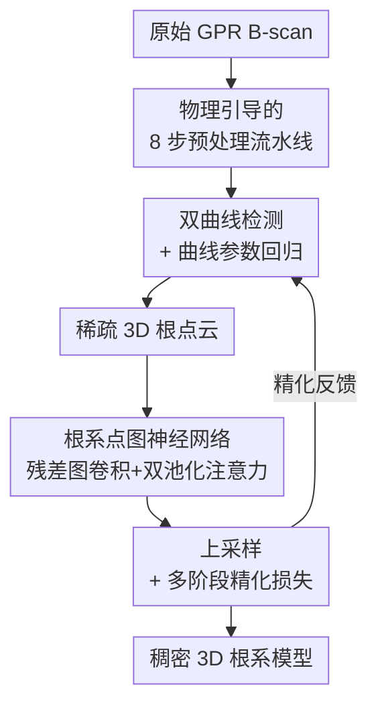

# Underground Plant Exploration: Non-Destructive 3D Root Assessment with GPR Based on Point Graph Neural Network

**会议**: CVPR 2026  
**论文**: [CVF Open Access](https://openaccess.thecvf.com/content/CVPR2026/html/Zhou_Underground_Plant_Exploration_Non-Destructive_3D_Root_Assessment_with_GPR_Based_CVPR_2026_paper.html)  
**领域**: 3D视觉 / 地下探测 / 点云重建  
**关键词**: 探地雷达(GPR), 3D根系重建, 点图神经网络, 双曲线检测, 点云上采样

## 一句话总结
本文用探地雷达(GPR)无损地把植物地下根系重建成 3D 点云：先在 B-scan 雷达图上检测根系反射形成的双曲线并回归其曲线参数得到稀疏 3D 点，再用一个带残差图卷积和双池化注意力的点图神经网络 + 上采样模块把稀疏点补全成稠密根系，在仿真数据上检测 AP 0.857、重建 EMD 5.03% 全面超过对比方法，且参数量仅 20.98M 最小。

## 研究背景与动机

**领域现状**：理解植物根系对作物健康、产量乃至全球粮食安全都很关键，但根系长在地下，传统观测要么挖出来(破坏性)、要么用根窗等成本高昂的装置。探地雷达(GPR)通过发射电磁脉冲、接收地下材料界面的反射回波来无损探测地下目标，已经被广泛用于管线、空洞等"形状规整、反射强"的埋设物探测。

**现有痛点**：把 GPR 用到根系上有两个难处。其一，根系是细枝状、不规则的精细结构，产生的反射又稀疏又弱，常被石块、土壤杂质的反射和系统噪声淹没，传统 GPR 解读高度依赖人工经验；其二，已有的深度学习 GPR 方法几乎都为"大目标分类/检测"(管道、路基缺陷)设计，只会框出矩形包围盒，无法刻画双曲线的精确几何，更没法把多条扫描线上的稀疏反射拼成一个完整的 3D 根系。

**核心矛盾**：根系反射的"稀疏 + 弱 + 细枝分叉"和现有方法擅长的"密集 + 强 + 规则形状"是错位的——既要从噪声里抠出微弱的双曲线信号、又要从极稀疏的 3D 点里恢复出连贯的分枝拓扑，这两件事单靠通用检测器或通用点云补全网络都做不好。

**本文目标**：构建一个端到端框架，输入原始 GPR 信号，输出无损重建的 3D 根系结构，并拆成两个子问题——(a) 在 2D B-scan 上准确检测根系双曲线并回归其曲线参数；(b) 把多张切片得到的稀疏 3D 点补全成稠密、保拓扑的根系模型。

**切入角度**：根系在 GPR B-scan 里的特征签名是"双曲线"(天线正对根时往返时间最短，形成顶点)。作者抓住这个形状先验，不去预测包围盒而是直接回归双曲线参数(顶点、曲率、弧长)，从而把"检测"转成"几何拟合"；3D 阶段则把每个点当图节点、用图神经网络传播局部几何来对抗稀疏。

**核心 idea**：用"双曲线形状先验做检测 + 曲线参数回归"得到稀疏 3D 根点，再用"残差点图神经网络 + 上采样"把稀疏点补成稠密根系，全程无损。

## 方法详解

### 整体框架
整个系统是一条两阶段串行的流水线。**阶段一(根系双曲线检测)**：原始 GPR B-scan 先经过一条物理引导的 8 步预处理流水线去噪、聚焦能量，然后送进一个在 SE-SSD 基础上改造的检测网络(MobileNetV2 主干 + 多任务检测头),同时输出包围盒、类别置信度和双曲线几何参数(顶点、曲率、弧长)。沿扫描轨迹把多条 B-scan 上检出的双曲线顶点投到 3D 空间,就得到一团**稀疏 3D 根点云**。**阶段二(3D 根系重建)**：稀疏点云先经点特征注意力增强,再进入核心的**点图神经网络**(残差图卷积 + 双池化注意力)学习几何拓扑,最后由**上采样模块**插值出稠密点;重建损失分粗(CD)、细(EMD)两级并加孤立点抑制,精化结果还会**反馈**回检测网络提升其精度。

### 关键设计

**1. 物理引导的 8 步 GPR 预处理流水线：先把微弱根信号从地下噪声里抠出来**

根系反射相对背景杂波又稀疏又弱,这一步是后续一切的前提,做不好则检测、重建全崩。作者没有简单套一个去噪滤波,而是按 GPR 物理过程串了 8 步:① 零时校正把最强响应对齐地表保证深度估计准;② Dewow 滤波去掉天线感应饱和带来的低频直流漂移(紧接零时校正做,防低频偏置遮住浅层根信号);③ 水平噪声去除压制天线振铃、电磁干扰造成的近水平条纹;④ 均值道减背景——从每道减去所有道的平均 A-scan,这一步对压制水平分层土壤反射和天线耦合伪影"最关键",因为根反射太弱必须先把这类强水平杂波剔掉;⑤ 带通 FIR 滤波,且截止频率按目标根径范围调,既保粗根又保细侧根、同时滤掉小土粒的高频噪声;⑥ SEC 增益补偿,用"几何扩散 + 指数介电吸收"联合模型补偿随深度衰减,比线性增益更物理准确;⑦ 土壤介电校正,用土壤介电常数标定电磁波速度——不做这步深度误差可超 20–30%,直接毁掉 3D 几何精度;⑧ Kirchhoff/f-k 偏移,把双曲线绕射图样收回到点源真实空间位置。整条流水线把"难辨的双曲线"清晰化,是把通用 GPR 处理针对"稀疏弱根反射"做的定制。

**2. 双曲线检测 + 曲线参数回归网络：不框矩形，直接回归根的双曲线几何**

通用检测器只会给矩形框,无法刻画根反射的精确曲线,后续 3D 投点就不准。作者在 SE-SSD 框架上改造:用 MobileNetV2(取前 6 个倒残差块到 conv_6,再接 conv_7–conv_11 共 5 层卷积扩大感受野捕获多尺度上下文)做主干,选它是因为精度-效率折中好、适合处理海量 GPR 道。每个特征层接一个混合检测头,含四个模块:候选框生成、定位精修、分类置信度、以及关键的**曲线拟合模块**——后者每个检测回归三个参数:弧长 $len$、顶点坐标 $vert=(x_v,t_v)$、曲率 $K=a/b^2$($a,b$ 为拟合双曲线的横/共轭半轴),真值由 gprMax 仿真中已知根位置和土壤介电常数解析推出。定位损失对宽高用对数空间项保证尺度不变、坐标项按真值归一化:

$$L_{local}=\sum_{i\in P}\sum_{k\in\{w,h\}}\!S_{L1}\!\left(\log\frac{P^i_k}{D^{j(i)}_k}\right)+\sum_{i\in P}\sum_{k\in\{x,y\}}\!S_{L1}\!\left(\frac{P^i_k-D^{j(i)}_k}{D^{j(i)}_k}\right)$$

曲线拟合损失 $L_{curve}=\frac{1}{N}\sum_q\sum_{n\in\{len,vert,K\}}S_{L1}(F^q_n-G^q_n)$,总检测目标 $L_{det}=L_{local}+w_1 L_{conf}+w_2 L_{curve}$($w_1=1.0,w_2=0.5$),其中置信度损失对正样本和困难负样本分别计算、训练时保持 1:3 正负比并做困难负样本挖掘。直接回归曲线参数让网络"拟合并恢复出精确曲线而非矩形框",这是它比对比检测器更适合根系的根本原因。

**3. 根系点图神经网络：用残差图卷积 + 双池化注意力，从极稀疏点里恢复分枝拓扑**

稀疏根点直接喂 GNN 容易过拟合、特征退化,而深层 GNN 又会过平滑(各节点特征趋同、性能下降)。作者把每个 3D 点当节点、用 KNN 建边,在图卷积里同时引入残差连接和层归一化,节点更新规则为:

$$h^{(l+1)}_i=\sigma\!\Big(\mathrm{LN}\big(\sum_{j\in N(i)}\tfrac{1}{Z_{ij}}W^{(l)}h^{(l)}_j\big)+h^{(l)}_i\Big)$$

那个加性跳连 $+h^{(l)}_i$ 把低层几何线索逐层保留下来,直接针对稀疏点上堆叠多层图卷积导致的"特征坍塌"。聚合时每个节点拼接三种互补信息 $h_i=G(h_{ij}-h_i,\,h_i,\,f_{pos})$:相对边特征 $h_{ij}-h_i$ 编码局部几何变化(类似点面梯度)、绝对特征 $h_i$ 给点级上下文、可学习位置编码 $f_{pos}\in\mathbb{R}^3$ 把表示锚到真实扫描几何。在此之上再加**双池化注意力**强化分枝交叉等关键区域:对节点特征做最大池化 $F_{max}$(抓显著峰)和平均池化 $F_{avg}$(留分布上下文),逐元素相乘 $F_{att}=F_{max}\odot F_{avg}$ 得到既敏感于峰值又敏感于局部连贯性的注意力权重,增强特征 $F_{enh}=F_{att}+G_1(h_i)$;输出再减去注意力前特征 $h'_i=G_2(F_{enh})-h_i$,这一减法抑制注意力前已表达好的成分、只留增量响应,锐化根/非根区分。重建前还有一个点特征注意力模块:对两路特征算注意力 $A_1,A_2=\sigma(\mathrm{BN}(WF+b))$、算差分 $F_s=F(F_1-F_2)$、拼接归一化后得 $F_a=F_c+F_s\odot A_1\odot A_2$,进一步突出根节点、分枝点等关键结构。

**4. 上采样 + 多阶段精化损失：把稀疏补稠密，并用粗-细两级损失 + 孤立点抑制保几何**

学到几何后要把稀疏点插值成稠密根系,但插值容易丢特征、把同一根段的点打散。上采样模块先用最远点采样(FPS)选代表点,对每个采样点聚合其 KNN 特征 $F_{agg,i}=G_\theta([f_i,p_i])$ 使同段点聚簇、减小插值误差;再做仿射归一化 $F_m=(F_{agg,i}-\mu)/\sigma$ 稳定特征,最后拼回原嵌入和位置编码 $F_u=[F_m,g_i,f_{pos}]$ 防信息丢失。重建损失走分层精化:粗阶段点少、用 Chamfer 距离 $L_{coarse}$ 做双向最近邻对齐;细阶段用 Earth Mover's 距离 $L_{fine}=\min_\phi\sum_x\|x-\phi(x)\|^2$(双射映射)做更严格的结构一致。针对土壤杂质/石块带来的离群点,加孤立损失 $L_{iso}=\frac{1}{\|x\|}\sum_p w_p\cdot\frac{1}{k}\sum_{p'\in kNN(p)}\|p-p'\|^2$,其中点到其 k 近邻平均距离超过(按全局成对距离标准差动态设定的)阈值时 $w_p=1$ 否则 0,自适应地把孤立噪声点拉回。重建总损失 $L_{recon}=L_{coarse}+w_3 L_{fine}+w_4 L_{iso}$($w_3=1.0,w_4=0.2$)。值得注意的是,精化结果还会**反馈**回双曲线检测网络提升其精度,使检测与重建相互促进。

### 损失函数 / 训练策略
整个学习由两个核心损失共同引导:检测网络的 $L_{det}=L_{local}+w_1 L_{conf}+w_2 L_{curve}$($w_1=1.0,w_2=0.5$)与重建网络的 $L_{recon}=L_{coarse}+w_3 L_{fine}+w_4 L_{iso}$($w_3=1.0,w_4=0.2$)。检测端用困难负样本挖掘维持 1:3 正负比、NMS(IoU 阈值 $\tau$)去冗余;重建端用 CD 管粗对齐、EMD 管细一致、孤立损失抑离群,粗-细分工是因为粗输出点数本就比真值少、不适合直接上 EMD。

## 实验关键数据

### 主实验
数据集由合成 + 真实 GPR 组成:合成端用 Unity 生成 200 个 3D 根模型,每个 6 方向 × 15 截面 = 90 扫描,共 18,000 张 2D B-scan(gprMax 3.0 仿真,含根面和土壤杂质),原始 3D 模型当真值;真实端用 SIR-4000 + 800D 天线采集(因无法无损建真值,仅做检测的视觉对比)。检测用 AP/AP50/AP75 评估,重建用 8192 点上的 CD/EMD 评估。

检测对比(仿真 2D GPR,均以 COCO 预训练初始化):

| 方法 | 主干 | AP | AP-50 | AP-75 |
|------|------|------|-------|-------|
| SE-SSD | VGG-16 | 0.784 | 0.870 | 0.802 |
| Feng et al. | ResNet-50 | 0.834 | 0.880 | 0.851 |
| Feng et al. | ResNet-101 | 0.836 | 0.882 | 0.849 |
| DiffusionDet300 | Swin | 0.840 | 0.874 | 0.853 |
| DiffusionDet500 | Swin | 0.838 | 0.897 | 0.859 |
| **本文** | MobileNet | **0.857** | **0.902** | **0.870** |

3D 重建对比(CD/EMD,均 ×100,5 个随机测试根,越低越好):

| 根 ID | Polis et al. | VAPCNet | PointLLM-V2 | 本文 |
|-------|------|------|------|------|
| 001 | 2.51 / 6.11 | 2.98 / 7.54 | 2.47 / 6.27 | **1.94 / 4.93** |
| 003 | 3.30 / 7.47 | 3.91 / 8.17 | 3.39 / 7.96 | **1.83 / 5.41** |
| Mean | 2.90 / 7.08 | 3.29 / 7.57 | 3.00 / 7.12 | **2.03 / 5.03** |

本文在检测三项指标和重建 CD/EMD 上全面领先:平均 EMD 5.03% 显著优于 7.08/7.57/7.12;平均 CD 2.03% 也低于 2.90/3.29/3.00,说明它能更忠实地恢复细枝。

### 消融实验
消融(Fig.11,CD/EMD ×100,越低越好)对比完整网络与去掉各模块:

| 配置 | 相对效果 | 说明 |
|------|---------|------|
| Full model | 最佳 | CD/EMD 始终最小 |
| w/o 点图神经网络 | 明显变差 | 对点云正确性和根系完整性影响最大 |
| w/o 上采样网络 | 明显变差 | 与去图网络同属影响最大的一档 |
| w/o 点特征注意力 | 略变差 | 影响小于上面两者 |

模型复杂度:本文 20.98M 参数,小于 VAPCNet(22.15M)、PointLLM-V2(25.26M),远小于 Feng et al.(63.48M,约 3 倍),适合算力受限的田间根系表型设备。

### 关键发现
- **点图神经网络和上采样模块贡献最大**:去掉任一个对点云正确性和根系完整性的破坏都明显大于去掉点特征注意力,说明"传播几何拓扑"和"补稠密"是恢复细枝的主干能力,注意力是锦上添花。
- **检测精度提升不靠堆参数**:本文用最小的 20.98M 参数拿到最高 AP,得益于 MobileNetV2 的高效主干和针对双曲线的曲线回归,而非更大模型。
- **真实数据只能定性**:由于根在地下且持续生长、无损前提下建不出真值,真实 GPR 上只有视觉对比,定量优势全部来自仿真数据。

## 亮点与洞察
- **把"检测"重新表述成"双曲线几何回归"**:抓住根反射在 B-scan 上必为双曲线这一物理先验,直接回归顶点/曲率/弧长而非矩形框,既给后续 3D 投点提供精确几何,又让小模型也能打赢大模型——形状先验比模型容量更值钱。
- **8 步预处理是"物理 + 学习"协同的范例**:每一步都对应一个明确的物理噪声源(直流漂移、天线振铃、几何扩散、介电速度),其中均值道减背景被点名为"最关键",提醒做地下/弱信号感知时,前端物理去噪往往比后端换更大网络更划算。
- **残差 + 层归一化对抗稀疏点上的过平滑**:在极稀疏(根点本就少)场景下,加性跳连保住低层几何线索、双池化注意力(max⊙avg)同时抓峰值和连贯性,这套组合可迁移到任何"稀疏 + 需保拓扑"的点云补全任务(如血管、神经突触重建)。
- **重建反馈检测的闭环**:精化后的点云回灌检测网络,让两阶段互相促进,而不是单向流水线,这种闭环思路在多阶段几何重建里值得借鉴。

## 局限与展望
- **真实场景缺定量评估**:无损前提下建不出真值,真实 GPR 只有视觉对比,泛化能力(不同土壤、湿度、根种)缺硬数据支撑;仿真到真实的域差距未被定量刻画。
- **强依赖仿真生成的真值**:曲线参数真值、3D 模型都来自 gprMax/Unity 仿真,仿真假设(土壤均匀、介电常数已知)与真实田间的复杂土壤可能不符。
- **双曲线先验的适用边界**:方法吃定根反射是清晰双曲线,但极细侧根、重叠根、深层弱反射可能不形成可辨双曲线,这类"漏检"会直接缺失对应 3D 点,文中未量化。
- **多扫描线拼 3D 的配准未细讲**:从多条 B-scan 顶点投到统一 3D 坐标依赖精确的天线轨迹/速度标定,土壤介电校正误差会沿轨迹累积,鲁棒性有待考察。可改进方向:引入真实标注子集做半监督域适应、对双曲线不显著区域加不确定性估计。

## 相关工作与启发
- **vs SE-SSD / Feng et al.(Faster R-CNN) / DiffusionDet**: 这些通用检测器只输出矩形框、为大目标(管线、缺陷)设计,本文在 SE-SSD 上加曲线拟合头直接回归双曲线参数,既得到精确几何又用更小的 MobileNet 主干打赢它们;劣势是高度专用于双曲线签名、换探测目标需重新设计回归量。
- **vs PointNet/PointNet++ 系点云重建(VAPCNet、PointLLM-V2、Polis et al.)**: 通用点云补全在大而均匀的物体(车、楼)上效果好,但根系细枝分叉、点又稀疏,它们易模糊/重叠/受石块杂质干扰;本文用残差点图卷积 + 双池化注意力 + 孤立点抑制专门保拓扑,CD/EMD 全面更低且参数更省。
- **vs 传统 GPR 解读(Kirchhoff/相移偏移、Hough 变换、Liu/Molon/Wu 等根系研究)**: 传统方法靠人工经验或只估根径/生物量,难以输出完整 3D 结构;本文是端到端深度学习,把检测到 3D 重建一气呵成,并可扩展到土木、地质、环境监测等地下探测场景。

## 评分
- 新颖性: ⭐⭐⭐⭐ 把双曲线形状先验回归 + 残差点图网络组合用于 GPR 无损 3D 根系重建,问题新、方案针对性强,但各组件多为已有技术的巧妙改造组合。
- 实验充分度: ⭐⭐⭐ 检测/重建/消融/复杂度齐全且全面领先,但真实数据只有定性视觉对比、定量全靠仿真,泛化证据偏弱。
- 写作质量: ⭐⭐⭐⭐ 方法叙述清晰、公式完整、物理动机交代到位,流水线和损失分工讲得明白。
- 价值: ⭐⭐⭐⭐ 无损 3D 根系表型对农业科研和粮食安全有实际意义,小模型(20.98M)利于田间部署,且方法可迁移到土木/地质等地下探测。

<!-- RELATED:START -->

## 相关论文

- [\[CVPR 2026\] QD-PCQA: Quality-Aware Domain Adaptation for Point Cloud Quality Assessment](qd-pcqa_quality-aware_domain_adaptation_for_point_cloud_quality_assessment.md)
- [\[CVPR 2026\] Topology-aware Feature Propagation for Unsupervised Non-rigid Point Cloud Correspondence](topology-aware_feature_propagation_for_unsupervised_non-rigid_point_cloud_corres.md)
- [\[CVPR 2026\] MHopReg: Efficient Hierarchical Multi-Hop Graph Search for Point Cloud Registration](mhopreg_efficient_hierarchical_multi-hop_graph_search_for_point_cloud_registrati.md)
- [\[CVPR 2026\] RINO: Rotation-Invariant Non-Rigid Correspondences](rino_rotation-invariant_non-rigid_correspondences.md)
- [\[ECCV 2024\] Equi-GSPR: Equivariant SE(3) Graph Network Model for Sparse Point Cloud Registration](../../ECCV2024/3d_vision/equi-gspr_equivariant_se3_graph_network_model_for_sparse_point_cloud_registratio.md)

<!-- RELATED:END -->
