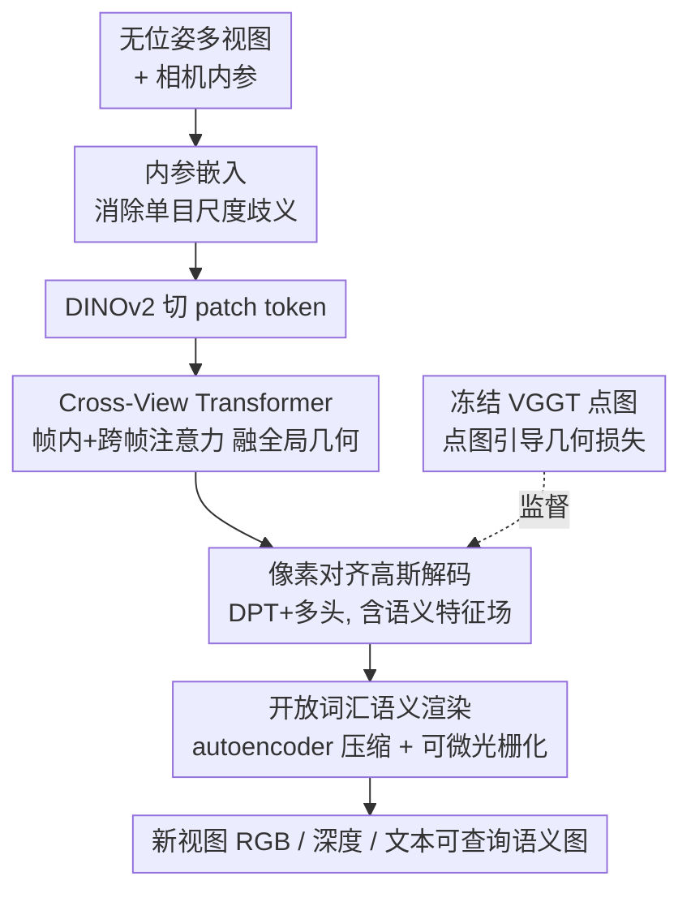

# Uni3R: Unified 3D Reconstruction and Semantic Understanding via Generalizable Gaussian Splatting from Unposed Multi-View Images

**会议**: CVPR 2026  
**论文**: [CVF Open Access](https://openaccess.thecvf.com/content/CVPR2026/html/Sun_Uni3R_Unified_3D_Reconstruction_and_Semantic_Understanding_via_Generalizable_Gaussian_CVPR_2026_paper.html)  
**代码**: https://horizonrobotics.github.io/robot_lab/uni3R/ （项目页）  
**领域**: 3D视觉  
**关键词**: 3D高斯泼溅, 前馈重建, 开放词汇语义, 无位姿多视图, VGGT

## 一句话总结
Uni3R 用一个 VGGT 风格的 Cross-View Transformer，从任意数量、无相机位姿的多视图图像里一次前馈预测出带语义特征的 3D 高斯，让新视图合成、开放词汇 3D 分割、深度估计在单次 0.15 秒的前向里同时完成，并在 RE10K/ScanNet 等多个 benchmark 上刷新 SOTA。

## 研究背景与动机

**领域现状**：从稀疏 2D 图像重建 3D 场景，主流走两条路。一条是 NeRF / 3DGS 这类高保真表示，但都要逐场景优化、几分钟到几十分钟一个场景，没法泛化到新场景；另一条是 pixelSplat、MVSplat、DepthSplat 等可泛化前馈方法，跨场景学几何先验、一次前向出高斯，但它们只管几何和外观，完全不碰语义。

**现有痛点**：要让 3D 表示"看得懂"，现有做法各有硬伤。LangSplat、Feature-3DGS 把 CLIP/语义特征蒸馏进高斯，但仍然逐场景优化，零样本上线不现实；LSM、UniForward 想把语义场和辐射场统一前馈推理，却都建立在 DUSt3R 之上——DUSt3R 天生只为**两视图**设计，扩到多视图就得做昂贵的成对特征匹配，既慢又因为缺乏全局 3D 上下文而重建碎裂、视图间不一致。

**核心矛盾**：「可泛化前馈」「多视图全局一致」「语义理解」三者很难同时拿到。基于两视图配对架构（DUSt3R 系）的方法，给多视图就退化；而能扛多视图的几何基础模型，又没人把它接到外观渲染和语义上来。

**本文目标**：造一个真正前馈、不依赖相机位姿、支持任意视图数的统一模型，一次前向同时给出新视图、开放词汇 3D 分割、深度。

**切入角度**：作者观察到几何基础模型 VGGT 的 Cross-View Transformer（交替帧内/跨帧注意力）天生能融合任意视图、产出全局一致的几何特征，而且它预测的稠密点图本身就是强几何先验。那么——能不能把这个"只做几何估计"的强模型，扩展去同时支撑光度重建和语义理解？

**核心 idea**：以 VGGT 为骨架做跨视图融合，回归一组**像素对齐、带语义特征场的 3D 高斯**，再用冻结 VGGT 的点图当几何监督把训练稳住——用一个统一表示同时承载几何、外观、开放词汇语义。

## 方法详解

### 整体框架

Uni3R 的输入是任意张无位姿的多视图图像（外加相机内参），输出是一组 3D 高斯基元，每个高斯同时带着位置/尺度/旋转/不透明度/颜色和一个高维语义特征向量；这组高斯可被实时可微光栅化，渲染出新视图 RGB、深度图、以及可用文本查询的语义图——全部在单次前向里完成，无需逐场景优化。

整条管线是：每张图先拼上**内参嵌入**消除尺度歧义，过 DINOv2 切成 patch token；token 进 **Cross-View Transformer** 做帧内+跨帧注意力，融成全局一致的潜表示；潜表示经 DPT 解码 + 多个 MLP 头回归出像素对齐的**高斯参数（含语义特征）**；高斯经可微光栅化渲染出 RGB / 深度 / 语义特征图，语义特征在渲染前先被 autoencoder 压缩以省显存。训练端由三路损失驱动：RGB 光度损失、向 LSeg 蒸馏的语义损失、以及用冻结 VGGT 点图做监督的几何损失。

### 关键设计

**1. Cross-View Transformer 编码器：用 VGGT 的全局注意力一次吃下任意视图**

DUSt3R 系方法只能两视图、扩多视图要成对匹配的根本原因，是它的架构没有"全局 3D 上下文"这个东西。Uni3R 直接换骨架——沿用 VGGT 的 Cross-View Transformer，由一串交替执行**帧内自注意力**和**跨帧全局注意力**的 Transformer 块组成（论文设 $L=24$ 层）。帧内注意力在单视图 token 集合内细化局部特征；跨帧注意力把所有视图的 token 聚到一起、建立视图间对应、推理全局 3D 几何。为支持任意视图数并保持置换等变性，每个视图追加一个可学习的相机 token。这样输出的潜 token 编码的是对整个场景**全局一致**的理解，而不是一堆两两匹配拼起来的碎片，从架构层面解决了多视图扩展和一致性问题。

**2. 像素对齐高斯解码 + 语义特征场：让一个高斯同时背几何、外观、语义**

光有全局特征还不够，得把它变成能渲染、能查询的显式表示。融好的潜表示先过 DPT（Dense Prediction Transformer）逐层把粗 patch 特征和细节融成稠密的逐像素特征图，再用一组独立 MLP 头预测**像素对齐**的高斯。每个高斯被参数化为 $G_j = \{\mu_j, \alpha_j, c_j, s_j, r_j, f_j^{\text{sem}}\}$，其中 $\mu_j\in\mathbb{R}^3$ 是中心、$s_j\in\mathbb{R}^3$ 尺度、$r_j\in\mathbb{R}^4$ 旋转四元数、$\alpha_j\in[0,1]$ 不透明度、$c_j\in\mathbb{R}^3$ 颜色、$f_j^{\text{sem}}\in\mathbb{R}^d$ 是高维语义特征。关键在于：点头（point head）用预训练 VGGT 权重初始化、再用渲染监督微调以对齐真实度量尺度，各参数过专门激活约束到合法区间：

$$\alpha_j = \sigma(f_j^\alpha),\quad s_j = \exp(f_j^s)\cdot d_{\text{median}},\quad r_j = \text{normalize}(f_j^r)$$

其中 $d_{\text{median}}$ 是预测 3D 位置算出的中位深度，用来归一化尺度、跨场景稳住数值。把语义特征直接焊进高斯，意味着语义和几何外观天然共享同一套 3D 锚点，渲染时一并 alpha-blend，无需额外的 3D 标注。

**3. 开放词汇语义渲染：autoencoder 压特征 + 向 LSeg 蒸馏，文本即可查询**

高维语义特征直接渲染显存爆炸，且要"开放词汇"得对齐到 CLIP 空间。Uni3R 用一个 autoencoder 把 $f_j^{\text{sem}}$ 压成低维 $\hat f_j^{\text{sem}}=\mathcal{F}_{\text{enc}}(f_j^{\text{sem}})$ 再参与渲染，渲染端语义特征同样用 alpha-blending 聚合：

$$\hat F = \sum_i \hat f_i^{\text{sem}}\,\alpha_i\prod_{j=1}^{i-1}(1-\alpha_j),\qquad \hat F' = \mathcal{F}_{\text{dec}}(\hat F)$$

autoencoder 端到端训练，使解码后的渲染特征对齐 CLIP 图像特征。推理时分割就是把逐像素语义特征和文本 prototype 做余弦相似度：给定类别文本（如 "wall"、"chair"、"sofa"），CLIP 文本编码器产出 $f^{\text{txt}}\in\mathbb{R}^{N_C\times C}$，语义 logits $S_p = \text{softmax}(f^{\text{txt}}\cdot\hat F')$。妙处在于：因为语义被融进**全局一致的 3D 表示**，多视图几何相当于一个空间滤波器，把单视图里 LSeg 的错误"投票投掉"——所以 Uni3R 不只是模仿 LSeg，反而比当老师的 LSeg 更准（见实验）。

**4. 点图引导几何损失：借冻结 VGGT 的点图当软先验，治 RGB-only 监督的塌缩**

只用 RGB 监督时，模型对预测点云没有显式几何约束，容易陷入局部极小、收敛不稳。Uni3R 引入受 PM-Loss 启发的点图正则：用冻结 VGGT 生成稠密点图 $\hat\mu^{(i)}\in\mathbb{R}^{3\times H\times W}$ 当几何监督。但 VGGT 在反光面、重遮挡区并不可靠，于是配一个**置信度掩码**——取 VGGT 置信图里 top-k 最可信像素（实验取 90%）构成二值掩码 $M^{(i)}$；预测点图先用 Umeyama 算法和 $\hat\mu^{(i)}$ 对齐，再在掩码后的点云间算**单向 Chamfer 距离**：

$$\mathcal{L}_{\text{geo}} = \sum_{i=1}^{N}\frac{1}{N_{pts}^{(i)}}\sum_{x\in X_U^{(i)}}\min_{x'\in X_V^{(i)}}\|x-x'\|_2^2$$

它一边提升结构精度（尤其物体边界、更低的 AbsRel 深度误差），一边在预测自由 3D 点分布时把训练从局部极小里拽出来稳住——是把"几何基础模型不只做几何估计、还能提供潜在几何引导"这一论点落到 loss 上的具体实现。

### 损失函数 / 训练策略

总目标是三路加权和 $\mathcal{L}_{\text{total}} = \mathcal{L}_{\text{rgb}} + \lambda_{\text{sem}}\mathcal{L}_{\text{sem}} + \lambda_{\text{geo}}\mathcal{L}_{\text{geo}}$，$\lambda_{\text{sem}}=0.02$、$\lambda_{\text{geo}}=0.005$。

- **光度损失** $\mathcal{L}_{\text{rgb}}$：像素级 L1 + LPIPS，$\lambda_{\text{LPIPS}}=0.05$。
- **语义损失** $\mathcal{L}_{\text{sem}}$：从冻结的 2D 视觉语言模型 LSeg 蒸馏，渲染语义图与 LSeg 图像特征做余弦相似度对齐 $\mathcal{L}_{\text{sem}}=\sum_i\big(1-\frac{\tilde F^{(i)}\cdot\hat F^{(i)'}}{\|\tilde F^{(i)}\|\cdot\|\hat F^{(i)'}\|}\big)$，把 2D 语义提到 3D，零样本可查询、不需 3D 标注。
- 编码器/解码器用预训练 VGGT 初始化，内参层和高斯头随机初始化；DINOv2 为图像编码器（patch size 16），Cross-View Transformer 24 层；8×A100、2 视图训练约 22 小时，全部结果在 256×256 下报。

## 实验关键数据

### 主实验

在 ScanNet 上同时评新视图合成 / 深度 / 开放词汇分割（Tab.1）：

| 方法 | 重建耗时↓ | mIoU↑ | Acc↑ | AbsRel↓ | PSNR↑ | SSIM↑ | LPIPS↓ |
|------|-----------|-------|------|---------|-------|-------|--------|
| LSeg（2D 老师） | N/A | 0.482 | 0.793 | - | - | - | - |
| Feature-3DGS | 18min+SfM | 0.422 | 0.717 | 12.95 | 24.49 | 0.813 | 0.229 |
| LSM*（需 3D 标注） | 0.108s | 0.508 | 0.769 | 3.38 | 24.39 | 0.807 | 0.251 |
| **Uni3R（本文）** | 0.162s | **0.558** | **0.827** | 3.87 | **25.53** | **0.873** | **0.138** |

无位姿多视图新视图合成（Tab.3/Tab.4，RE10K & ScanNet）：

| 设置 | 方法 | PSNR↑ | SSIM↑ | LPIPS↓ |
|------|------|-------|-------|--------|
| RE10K 2-view | NoPoSplat（前 SOTA） | 25.04 | 0.838 | 0.162 |
| RE10K 2-view | **Uni3R** | **25.07** | 0.837 | **0.158** |
| RE10K 8-view | VicaSplat | 24.50 | 0.806 | 0.164 |
| RE10K 8-view | **Uni3R** | **26.63** | **0.874** | **0.118** |
| ScanNet 8-view | VicaSplat | 23.66 | 0.777 | 0.262 |
| ScanNet 8-view | **Uni3R** | **26.02** | **0.858** | **0.193** |

视图越多优势越明显：8 视图下比强基线 VicaSplat 平均高约 **2.0 dB**，比逐场景优化的 Feature-3DGS（≈40–60min/场景）快了几个数量级（0.36–0.64s）还更准。

### 消融实验

ScanNet 上逐项去除（Tab.7）：

| 配置 | mIoU↑ | AbsRel↓ | τ↑ | PSNR↑ | 说明 |
|------|-------|---------|----|-------|------|
| Full（Ours） | 0.548 | 3.9 | 61.2 | 25.53 | 完整模型 |
| frozen 全 transformer | 0.063 | 51.1 | 7.6 | 5.49 | 不微调骨架直接崩 |
| w/o 语义损失 | 0.018 | 5.8 | 47.4 | 25.38 | 分割彻底塌缩 |
| w/o 渲染损失 | 0.265 | N/A | N/A | N/A | 不收敛 |
| w/o 尺度不变 | 0.538 | 5.8 | 47.9 | 24.95 | 渲染稳定性下降 |
| w/o 内参嵌入 | 0.547 | 6.5 | 42.5 | 25.35 | 深度精度掉、跨尺度对齐变差 |
| w/o 几何损失 | 0.554 | 5.6 | 48.2 | 25.53 | 深度误差升、τ 降，3D 一致性变差 |

### 关键发现

- **语义损失和渲染损失是命门**：去掉语义损失 mIoU 从 0.548 崩到 0.018，去掉渲染损失直接不收敛——说明统一监督里这两路缺一不可。
- **几何损失主要补几何而非分割**：去掉它 mIoU 几乎不变（0.554），但 AbsRel 从 3.9 升到 5.6、τ 从 61.2 掉到 48.2，证明它的价值在深度/点云一致性和训练稳定，而非语义。
- **多视图越多越强**：与多数两视图方法相反，Uni3R 在 8 视图、宽基线下反而 PSNR 更高（ScanNet 2→8 view，mIoU 0.542→0.554），印证 Cross-View Transformer 的全局融合能吃长序列。
- **学生超过老师**：被 LSeg 监督，分割却比 LSeg 更准（mIoU 0.558 vs 0.482），靠 3D 多视图一致性把单视图语义错误"投票投掉"。

## 亮点与洞察
- **把几何基础模型"复用"成统一 3D 理解骨架**：核心洞察是 VGGT 的跨帧注意力不仅能估几何，其全局一致特征 + 点图还能同时撑起渲染和语义——一个预训练几何模型被开发出三种用途，省了从零设计多视图融合。
- **语义焊进高斯 + autoencoder 压特征**：让"高维语义直接渲染显存爆炸"和"要可微渲染"这对矛盾被一个端到端 autoencoder 化解，是可复用到任何 feature-3DGS 类工作的工程 trick。
- **冻结 VGGT 点图当软几何先验 + 置信度掩码**：RGB-only 监督容易塌缩，借现成基础模型的点图（且只信 top-90% 置信像素、Umeyama 对齐后单向 Chamfer）当正则，思路可迁移到任何缺显式几何约束的前馈重建。
- **"3D 一致性当空间滤波器"**：学生反超老师这件事点明了多视图 3D 表示的额外价值——它能去噪单视图 2D 预测，这个视角对所有 2D→3D lifting 任务都有启发。

## 局限与展望
- **语义上限受 2D 老师约束**：语义来自蒸馏 LSeg，开放词汇能力和细粒度受限于 LSeg/CLIP 本身；老师在某些类别上弱，3D 投票也只能缓解不能根治。
- **依赖冻结 VGGT 的点图质量**：几何监督建立在 VGGT 之上，虽然有置信度掩码挡掉反光/遮挡区，但 VGGT 系统性偏差仍可能传导进重建；论文未充分讨论 VGGT 失效场景下的表现。
- **分辨率与规模受限**：为公平对比都在 256×256 报结果，高分辨率、室外大场景的可扩展性未验证；训练只用 1,565 个室内场景（ScanNet/ScanNet++）为主，跨域虽有 Mip-NeRF360 验证但优势变窄（8-view PSNR 19.20 仅略高于 AnySplat 18.81）。
- **arbitrary-view 训练略有波动**：Tab.6 里 4 视图 mIoU（0.402）反而低于 2/8 视图，说明任意视图训练的稳定性还有打磨空间。

## 相关工作与启发
- **vs NoPoSplat / Splatt3R（DUSt3R 系无位姿前馈）**：它们也无位姿前馈出高斯，但骨架是为两视图设计的 DUSt3R，扩多视图要成对匹配、缺全局上下文导致碎裂；Uni3R 换成 VGGT 的 Cross-View Transformer 天然吃任意视图、全局一致，且额外带了语义。
- **vs LSM / UniForward（统一语义+辐射场）**：同样想统一前馈推理几何+外观+语义，但都困在两视图、且 LSM 还要 3D 真值点云监督；Uni3R 支持任意视图、零 3D 标注，分割/渲染都更强（ScanNet mIoU 0.558 vs LSM 0.508）。
- **vs Feature-3DGS / LangSplat（语义 3DGS）**：它们把语义蒸进高斯但逐场景优化、几十分钟一个场景；Uni3R 前馈 0.16s 出结果且泛化到新场景，分割与渲染全面更优。
- **vs VicaSplat（无位姿视频序列）**：VicaSplat 专做序列渲染，Uni3R 8 视图平均高约 2.0 dB，且多了开放词汇语义和深度。

## 评分
- 新颖性: ⭐⭐⭐⭐ 首个从无位姿任意多视图统一前馈出"几何+外观+开放词汇语义"的框架，但多处部件（VGGT 骨架、NoPoSplat 内参嵌入、PM-Loss 几何正则）是已有组件的巧妙组合。
- 实验充分度: ⭐⭐⭐⭐ 覆盖 RE10K/ScanNet/ACID/Mip-NeRF360 多 benchmark、三任务、消融完整；但分辨率仅 256、室外大场景与高分辨率验证不足。
- 写作质量: ⭐⭐⭐⭐ 动机—架构—损失逻辑清晰，图表充分；部分公式在缓存 OCR 里残缺需对照原文。
- 价值: ⭐⭐⭐⭐ 单次前向 0.15s 同时给重建+分割+深度，对机器人/自动驾驶实时 3D 感知有直接落地价值。

<!-- RELATED:START -->

## 相关论文

- [\[CVPR 2026\] Generalizable Human Gaussian Splatting via Multi-view Semantic Consistency](generalizable_human_gaussian_splatting_via_multi-view_semantic_consistency.md)
- [\[CVPR 2026\] BRepGaussian: CAD Reconstruction from Multi-View Images with Gaussian Splatting](brepgaussian_cad_reconstruction_from_multi-view_images_with_gaussian_splatting.md)
- [\[CVPR 2026\] Generalizable Sparse-View 3D Reconstruction from Unconstrained Images](generalizable_sparse-view_3d_reconstruction_from_unconstrained_images.md)
- [\[CVPR 2026\] UniSplat: Learning 3D Representations for Spatial Intelligence from Unposed Multi-View Images](unisplat_3d_representations_unposed.md)
- [\[CVPR 2026\] EcoSplat: Efficiency-controllable Feed-forward 3D Gaussian Splatting from Multi-view Images](ecosplat_efficiency-controllable_feed-forward_3d_gaussian_splatting_from_multi-v.md)

<!-- RELATED:END -->
