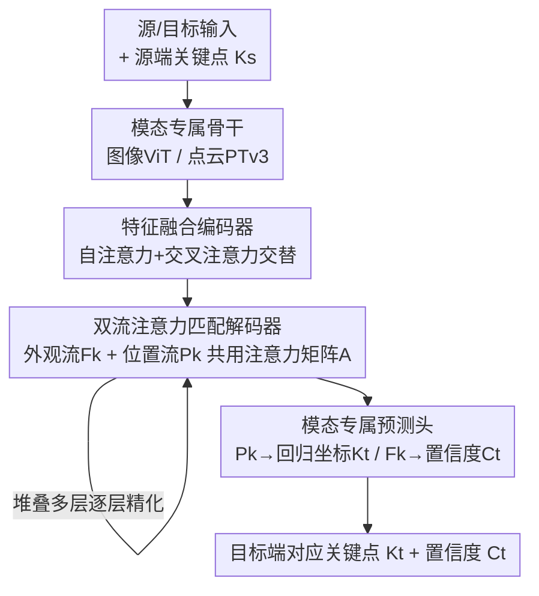

# UniCorrn: Unified Correspondence Transformer Across 2D and 3D

**会议**: CVPR 2026  
**arXiv**: [2605.04044](https://arxiv.org/abs/2605.04044)  
**代码**: https://neu-vi.github.io/UniCorrn/ (项目主页)  
**领域**: 3D视觉  
**关键词**: 几何对应、跨模态匹配、双流注意力、点云配准、统一模型

## 一句话总结
UniCorrn 用一套**共享权重**的 Transformer，把图像-图像（2D-2D）、图像-点云（2D-3D）、点云-点云（3D-3D）三类几何对应统一成同一个"查询关键点→回归对应坐标"的任务，靠一个**双流注意力解码器**（外观流 + 位置流共用同一张注意力矩阵）实现可堆叠的端到端匹配，在 2D-2D 上持平 SOTA，在 7Scenes（2D-3D）和 3DLoMatch（3D-3D）的配准召回率上分别超过此前最优方法 8% 和 10%。

## 研究背景与动机
**领域现状**：视觉对应（在同一场景的不同观测之间找匹配特征）是 3D 视觉的地基，支撑点云配准、相机位姿估计、SfM/SLAM。它按模态可分三类：2D-2D（图像匹配）、2D-3D（图像配点云）、3D-3D（点云配准）。这三类问题结构高度相似——都是"给定源端关键点，找目标端对应位置"——但学界一直是**每类各练一个专用模型**，各搞各的网络设计与监督方式。

**现有痛点**：2D 领域虽然有一些"统一匹配"的尝试，但没人把它扩展到 3D。作者把现有 2D 统一方法归为三类，逐一指出它们为什么迁不到 3D：① **代价体（cost volume）方法**靠局部范围算相似度+图像金字塔/RNN 做粗到细，但金字塔深度固定、RNN 串行，表达力受限，处理点云这种"稀疏、不规则、对应可能跨很大空间距离"的结构力不从心；② **最近邻（NN）搜索**匹配稠密描述子，但 NN 只能做一次、无法塞进堆叠的网络层做端到端训练，也就无法迭代精化跨模态对齐；③ **直接回归位移**的方法（如 UFM）在需要显式 3D 几何推理的 2D-3D/3D-3D 上实验表现很差。

**核心矛盾**：要做一个真正统一的模型，匹配机制必须同时满足三点——(1) 能通过**可堆叠的层**端到端学习，(2) 能处理跨模态的**不规则结构**，(3) 能**迭代精化**对应估计。现有三类范式各缺其中一两条，没有一个全占。

**核心 idea**：作者的关键洞察是——**Transformer 的注意力矩阵天生就在度量两组特征的相似度，而相似度正是所有对应任务的本质**。于是把"算注意力"直接当成"算匹配代价"。但要把注意力堆叠成多层迭代精化，会遇到一个具体障碍（更新后的 query 只剩位置编码、丢了外观特征，没法进入下一层匹配），UniCorrn 用**双流设计**（把外观特征和位置编码拆成两条独立残差流，共用同一张注意力矩阵）解决，从而让"注意力即匹配"这件事可堆叠、可端到端、可跨模态。

## 方法详解

### 整体框架
UniCorrn 把三类对应任务统一成同一个查询接口：输入源、目标两端 $\mathbf{I}_s, \mathbf{I}_t$（每端是图像或点云，维度 $m\in\{2,3\}$），外加源端一组感兴趣关键点 $\mathbf{K}_s\in\mathbb{R}^{N\times m}$（可来自检测器，也可均匀网格采样）；输出目标端对应关键点坐标 $\mathbf{K}_t\in\mathbb{R}^{N\times l}$（$l\in\{2,3\}$）和每个对应的置信度 $\mathbf{C}_t\in\mathbb{R}^N$（用来标记天空、遮挡、半透明等不确定区域）。

整条管线分四个模块：**模态专属骨干**先把图像/点云各自编码（图像用 ViT、点云用 Point Transformer v3，同模态时 Siamese 共享权重）；**特征融合编码器**不区分模态，用自注意力+交叉注意力交替的块让源、目标互相交换信息；**匹配解码器**（本文核心贡献）先把融合特征上采样，再用一摞**双流 Transformer 层**逐层精化，输出位置编码 $\mathbf{P}_k$ 和外观特征 $\mathbf{F}_k$；**模态专属预测头**把 $\mathbf{P}_k$ 喂给（2D 或 3D 的）线性层回归出对应坐标，把 $\mathbf{F}_k$ 喂给一个共享 MLP 估置信度。除了首尾的骨干和预测头是模态专属的，中间的融合编码器和匹配解码器在三类任务上**权重完全相同**——这正是"统一"的来源。

### 关键设计

**1. 一套权重统管三类任务：模态专属首尾 + 共享中段**

痛点直接对准"每类对应任务各练一个模型"的现状。UniCorrn 把网络切成"模态专属的首尾"和"模态无关的共享中段"：骨干（图像 ViT / 点云 PTv3）和最终预测的线性头必须区分模态，因为图像 token 和点云 token 的原始结构不同、输出是 2D 还是 3D 坐标也不同；但中间的特征融合编码器和匹配解码器在 2D-2D、2D-3D、3D-3D 三种输入组合上用**完全相同的权重**。这样做不只是省工程，更重要的是**让三类任务联合训练时共享几何先验**——数据丰富的 2D-2D 能反哺数据稀缺的 2D-3D/3D-3D。两端都用旋转位置编码（RoPE）编码相对位置，使图像和点云 token 在位置表达上统一。

**2. 双流注意力解码器：把外观和位置拆成两条残差流（核心贡献）**

这是全文的灵魂，解决"注意力即匹配，但没法堆叠"这个具体障碍。先看朴素想法：把源关键点描述子 $\mathbf{F}_k$ 当 query、目标特征 $\mathbf{F}_t$ 当 key，注意力矩阵 $\mathbf{A}=\texttt{Softmax}(\mathbf{F}_k'\mathbf{F}_t'^{T}/\sqrt{D})$ 就是一张"匹配代价表"——理想情况下每行是 one-hot，1 的位置就是正确对应。若把 value 设成目标端每个像素的**绝对位置编码**，那么更新后的 query $\mathbf{Q}=\mathbf{A}\mathbf{V}+\mathbf{Q}$ 就携带了正确对应位置的编码，直接能回归坐标。

问题来了：这样更新后的 query**只剩位置编码、丢了外观特征**，没法在下一层继续按外观去算匹配，于是无法堆叠多层。UniCorrn 的解法是开**两条独立残差流**：外观流 $\mathbf{F}_k=\mathbf{A}(\mathbf{W}_V\mathbf{F}_t)+\mathbf{F}_k$ 用同一张 $\mathbf{A}$ 去聚合目标外观特征；位置流 $\mathbf{P}_k=\mathbf{A}(\texttt{AbsPE}(\mathbf{X}_t))+\mathbf{P}_k$ 用同一张 $\mathbf{A}$ 去聚合目标坐标的可学习绝对位置编码 $\texttt{AbsPE}(\mathbf{X}_t)=\mathbf{W_p}\mathbf{X}_t+\mathbf{b_p}$（$\mathbf{P}_k$ 初始化为零）。实现上两条流沿通道维拼接、并行过注意力，再切开各自更新。关键在于**两条流都被同一张注意力矩阵驱动，而这张矩阵又由外观+位置共同算出**——于是外观流保住了"下一层还能继续匹配"的能力，位置流累积了"对应在哪"的信息，两者随层数加深一起被精化，注意力矩阵越来越准，对应估计也越来越准。消融显示这个设计优于 COTR 的序列拼接、UFM 的直接回归等其它 Transformer 匹配范式。

**3. 高斯核注意力 + 用伪逆回归坐标**

朴素点积注意力等价于用**线性核**算相似度，只能捕捉线性相关，且对特征幅值尺度敏感。UniCorrn 把它换成**高斯核变体**：$\mathbf{A}=\texttt{Softmax}\big(-\texttt{Pair\_L2}(\mathbf{F}_k',\mathbf{F}_t')/D\big)$，即用成对 L2 距离取负做 softmax，类比经典描述子匹配里用高斯核捕捉非线性复杂相关，实验证明更好。坐标回归则利用了位置编码 $\texttt{AbsPE}$ 是个可学习的**双射线性映射**这一性质：既然 $\mathbf{P}_k$ 是目标坐标经 $\mathbf{W_p}$ 映射并被注意力混合的结果，就能用 $\mathbf{W_p}$ 的 Moore–Penrose 伪逆反解回坐标 $\mathbf{K}_t=\mathbf{W_p^{+}}(\mathbf{P}_k-\mathbf{b_p})$。这套设计让"匹配"和"回归坐标"在同一个注意力机制里闭环，无需额外的解码网络。

### 损失函数 / 训练策略
总损失把三类任务相加 $\mathcal{L}_{total}=\mathcal{L}_{2d2d}+\mathcal{L}_{2d3d}+\mathcal{L}_{3d3d}$，每类任务用三项 $\mathcal{L}_{task}=\mathcal{L}_{conf}+\mathcal{L}_{aux}+\beta\mathcal{L}_{desc}$：

- **置信度感知 L1 损失** $\mathcal{L}_{conf}=\frac{1}{N}\sum_i \mathbf{C}_t(i)\|\mathbf{K}_t(i)-\bar{\mathbf{K}}_t(i)\|_1-\alpha\log\mathbf{C}_t(i)$（改自 MASt3R）：用 L1 直接监督预测坐标误差，同时让模型对天空/遮挡等难区域学会输出低置信度（前项让高置信度区域误差被放大惩罚，后项 $-\alpha\log\mathbf{C}_t$ 防止模型对所有点都摆烂给低置信度）。
- **对比损失** $\mathcal{L}_{desc}=\mathcal{L}_c(\mathbf{F}_s^{desc},\mathbf{F}_t^{desc})+\mathcal{L}_c(\mathbf{F}_k,\mathbf{F}_t^{desc})$：用 InfoNCE 监督真值对应对的描述子一一对齐，既约束融合特征也约束解码器输出 $\mathbf{F}_k$，目的是改善注意力矩阵质量。
- **辅助监督** $\mathcal{L}_{aux}=\sum_{l=1}^{L}\gamma^{L-l}\frac{1}{N}\sum_i\|\mathbf{K}_t^{(l)}(i)-\bar{\mathbf{K}}_t(i)\|_1$（$\gamma=0.9$）：在**每一层**解码器都回归一次坐标并监督，越靠后的层权重越大，鼓励逐层精化真正生效。

**混合数据**是训练能跑通的关键。2D-3D/3D-3D 真值对应标注稀缺，作者把 DUSt3R 训练用的深度图转成**伪点云**，与少量高质量 3D 标注（ScanNet++、ARKitScenes 等）混合，让模型在数据匮乏模态上也能学到稳健几何先验。骨干用预训练 CroCo v2 提图像特征，大模型约 600M 参数，分两阶段训练。

## 实验关键数据

### 主实验
跨三类任务对比 SOTA 专用模型（IR=内点率、FMR=特征匹配召回、RR=配准召回、AUC=位姿误差曲线下面积）：

| 任务 / 数据集 | 指标 | 本文 | 此前最优 | 提升 |
|--------|------|------|----------|------|
| 2D-2D / MegaDepth-1500 | AUC@5° | 55.5 | RoMa 62.6 / MASt3R 53.1 | 持平/超 MASt3R |
| 2D-2D / ScanNet-1500 | AUC@20° | 71.3 | LoFTR 50.6（非ScanNet训练中最优之一） | 强泛化 |
| 2D-3D / 7Scenes | RR | 91.0 | B2-3Dnet 77.7 / Diff-Reg 83.8 | **+8%** |
| 2D-3D / RGB-D Scenes V2 | RR | 92.5 | Diff-Reg 87.4 | +5% |
| 3D-3D / 3DLoMatch | RR | 86.7 | PEAL-3D 79.0 | **+10%** |
| 3D-3D / 3DMatch | RR | 97.5 | Diff-Reg 95.0 | +2.5% |

2D-2D 上 UniCorrn 排第三（DKM/RoMa 靠高分辨率特征 warp 取得更高亚像素精度，但 warp 无法用于 2D-3D，因为 2D 网格→3D 没有定义）；在它真正占优的 2D-3D 和 3D-3D 上，单一统一模型直接刷新 SOTA。

### 消融实验
匹配范式对比（小模型，同骨干换不同匹配头，RR/IR）：

| 匹配范式 | MegaDepth AUC@10° | 7Scenes RR | 3DMatch RR | 说明 |
|------|------|------|------|------|
| 最近邻 | 67.1 | 63.4 | 87.5 | 2D-3D/3D-3D 明显弱于本文 |
| 全局匹配 | 64.9 | 75.8 | 96.5 | 接近本文但训练耗时约 2× |
| 直接回归 | 1.5 | 17.0 | 18.2 | 几乎崩溃 |
| 序列拼接 (COTR式) | 22.1 | 21.1 | 7.3 | 远差 |
| **本文双流解码器** | **67.1** | **77.8** | **96.9** | 兼顾精度与效率 |

逐组件累加（MegaDepth-1500 AUC）：

| 配置 | AUC@5° | 增量来源 |
|------|---------|------|
| I 基线 (D=256,H=16,朴素注意力) | 36.4 | — |
| II + 高斯注意力 | 37.3 | 非线性相似度 |
| III + 800 关键点查询 | 38.2 | 更多监督 |
| IV + 单头注意力 (H=1) | 39.5 | 单头≈最近邻 |
| V + 对比损失 | 43.9 | 描述子质量 |
| VI + 4× 上采样 (D=64) | 48.5 | 空间分辨率（增益最大） |
| VII 最终 (上采样后保持 D=256) | **50.6** | — |

### 关键发现
- **双流解码器是核心贡献**：直接回归（AUC@10° 仅 1.5）和 COTR 式序列拼接（22.1）几乎崩溃，证明"可堆叠的注意力匹配"不是可有可无的工程细节，而是跨模态成立的前提。
- **增益最大的两步是特征上采样和对比损失**：4× 上采样把 AUC@5° 从 43.9 拉到 48.5；解码器层数堆到 3 层后小模型因容量受限收益饱和；上采样到 8× 后也不再涨，故折中取 4×。
- **联合训练有协同也有冲突**：在 7Scenes（2D-3D）上联合训练 RR 从单任务 67.7 暴涨到 91.0，说明数据丰富的 2D-2D 能反哺；但 2D-2D 自身（54.2 vs 单任务 56.5）略降。用 GCD 梯度冲突分析发现大部分参数梯度对齐到正交（干扰小），**唯独归一化层冲突严重**——因为它要同时容纳 2D 图像和 3D 点特征差异巨大的统计量。

## 亮点与洞察
- **"注意力矩阵 = 匹配代价体"这个等价视角很漂亮**：作者点明注意力矩阵就是可学习代价体的归一化版本，理想下每行 one-hot。这把"对应匹配"从专用代价体设计直接收编进通用 Transformer，是统一三类任务的概念基础。
- **双流设计解决的是一个非常具体的障碍**：朴素做法更新后 query 只剩位置编码无法再匹配——这个"为什么不能堆叠"的诊断很清晰，外观流/位置流共用一张注意力矩阵的解法也干净，可迁移到任何"既要回归坐标又要迭代精化"的任务（如关键点追踪、光流）。
- **用伪逆从位置编码反解坐标**是个巧思：因为 AbsPE 是可学习双射线性映射，回归坐标不需要额外解码头，直接 $\mathbf{W_p^{+}}$ 反算，把匹配和定位闭合在同一机制里。
- **伪点云补数据**这条工程路径实用：3D 对应标注稀缺时，把深度图转伪点云填充，是让数据稀缺模态搭上数据丰富模态便车的低成本办法。

## 局限与展望
- **归一化层是统一的瓶颈**（作者承认）：2D/3D 特征统计量差异大，共享归一化层梯度冲突严重，导致联合训练在 2D-2D 上反而略掉点，未来需要更好的归一化或跨模态对齐策略。
- **2D-2D 仍非最强**：在 MegaDepth 上落后 DKM/RoMa，因为它们靠高分辨率特征 warp 取亚像素精度，而这条路天然无法迁到 2D-3D；UniCorrn 是用"通用性"换了一点 2D 精度。
- **评测用了真值关键点**（作者主动讨论）：2D-3D/3D-3D 评测时用 GT 关键点查询，虽然作者论证这未必占便宜（别人用 GT 变换对齐预测、本文直接回归坐标），但端到端纯检测器查询下的表现仍有待更充分验证。
- 小模型堆 3 层解码器即饱和，能力受容量限制；大模型的层数-精度上限论文未充分展开。

## 相关工作与启发
- **vs 2D 统一匹配 (UFM / MatchAnything / MATCHA)**：它们都局限在 2D 图像域内统一（几何/语义/光流/时序追踪），靠代价体、最近邻或直接回归。UniCorrn 第一次跨到 2D-3D/3D-3D，且作者实证 UFM 式直接回归在需要 3D 几何推理的设定下崩溃，从而论证为何必须用可堆叠注意力。
- **vs 2D-3D 专用方法 (2D3D-MATR / B2-3Dnet / FreeReg / Diff-Reg)**：这些方法每个数据集单独训练评测，常用 circle loss + 粗到细，或引入扩散（代价是采样耗时）。UniCorrn 用单一统一模型在 7Scenes RR 上反超它们 8%，且无扩散采样开销。
- **vs 3D-3D 配准 (Predator / GeoTransformer / RoITr / PEAL-3D)**：它们用 Transformer 交叉注意力增强超点特征、直接监督 SE(3) 变换以省去稠密描述子匹配。UniCorrn 在低重叠的 3DLoMatch 上 RR 超 PEAL-3D 10%，说明把匹配显式做成可堆叠注意力对难样本更稳健。
- **vs 查询式匹配 (COTR / VGGT)**：COTR/VGGT 让用户在一张图上查询关键点、在另一张图上估对应，但查询范式多用于视频追踪、在几何匹配上未充分探索。UniCorrn 把查询接口推广到跨 2D/3D，并用双流设计补上了 COTR 序列拼接堆叠不动的短板。

## 评分
- 新颖性: ⭐⭐⭐⭐⭐ 首个共享权重统一 2D-2D/2D-3D/3D-3D 的对应模型，双流注意力解码器设计干净且有洞察
- 实验充分度: ⭐⭐⭐⭐⭐ 三类任务多 benchmark 全覆盖，匹配范式对比 + 逐组件消融 + 联合训练梯度冲突分析都做了
- 写作质量: ⭐⭐⭐⭐ 动机和方法推导清晰，"为什么不能堆叠→双流"的逻辑讲得透；个别公式细节需查附录
- 价值: ⭐⭐⭐⭐⭐ 在 2D-3D/3D-3D 上刷新 SOTA，统一接口降低工程复杂度，是通向通用对应模型的扎实一步

<!-- RELATED:START -->

## 相关论文

- [\[CVPR 2026\] RnG: A Unified Transformer for Complete 3D Modeling from Partial Observations](rng_a_unified_transformer_for_complete_3d_modeling_from_partial_observations.md)
- [\[CVPR 2026\] MimiCAT: Mimic with Correspondence-Aware Cascade-Transformer for Category-Free 3D Pose Transfer](mimicat_mimic_with_correspondence-aware_cascade-transformer_for_category-free_3d.md)
- [\[CVPR 2026\] Generalizable Structure-Aware Keypoint Correspondence for Category-Unified 3D Single Object Tracking](generalizable_structure-aware_keypoint_correspondence_for_category-unified_3d_si.md)
- [\[CVPR 2026\] Best Segmentation Buddies for Image-Shape Correspondence](best_segmentation_buddies_for_image-shape_correspondence.md)
- [\[CVPR 2026\] Generalized-CVO: Fast and Correspondence-Free Local Point Cloud Registration with Second Order Riemannian Optimization](generalized-cvo_fast_and_correspondence-free_local_point_cloud_registration_with.md)

<!-- RELATED:END -->
