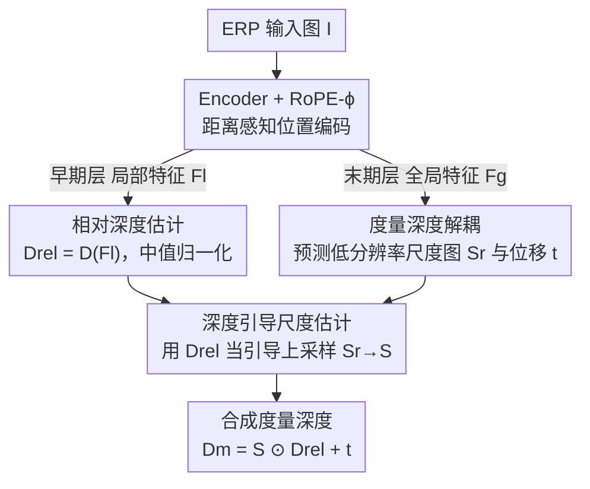

# UniDAC: Universal Metric Depth Estimation for Any Camera

**会议**: CVPR 2026  
**论文**: [CVF Open Access](https://openaccess.thecvf.com/content/CVPR2026/html/Ganesan_UniDAC_Universal_Metric_Depth_Estimation_for_Any_Camera_CVPR_2026_paper.html)  
**代码**: https://girish1511.github.io/UniDAC （项目页）  
**领域**: 3D视觉  
**关键词**: 单目度量深度、跨相机泛化、ERP、尺度估计、旋转位置编码

## 一句话总结
UniDAC 把单目度量深度拆成「相对深度 + 空间变化的尺度图」两部分，用一个仅靠透视图训练的统一模型，在鱼眼/360° 等大视场相机上实现零样本度量深度估计，并靠一个深度引导的尺度上采样模块和一个适配 ERP 几何的位置编码 RoPE-ϕ，在跨相机泛化上全面超过此前 SOTA。

## 研究背景与动机
**领域现状**：单目度量深度估计（MMDE）要从一张图直接回归出带真实物理尺度的深度。近年的方法（UniDepth、Metric3Dv2 等）通过条件化相机参数、映射到规范空间、或显式估计尺度，已经能在透视相机上做到不错的零样本度量深度。

**现有痛点**：这些方法几乎都是在透视图上开发的，一旦换成鱼眼或 360° 相机就崩。两条已有的"统一相机"路线各有硬伤：UniK3D 用球谐角度表示统一各种相机，但它**训练时必须喂进大视场数据**（和测试分布相近，算"作弊"）；DAC 只用透视图训练、把图投影到等距柱状投影（ERP）规范空间，跨相机泛化强，但**必须为室内、室外各训一个模型**，一旦合成单个统一模型性能就掉。

**核心矛盾**：根因是不同域的深度量程差异巨大——室内最大深度约 10 米、室外约 80 米。如果让模型直接回归这个跨度极大的绝对深度，它会"精神分裂"；而 DAC 那种统一模型又试图用**单个全局标量**去对齐两个域，自然学不好。

**本文目标**：在不显著增大模型/数据规模的前提下，造一个**单一模型**就能同时跨「相机几何」和「场景域」泛化的 MMDE 框架。

**切入角度**：作者的关键观察是——度量深度可以解耦成两个依赖**不同上下文范围**的成分：相对深度只依赖局部像素结构（物体形状、边界），是域无关的；尺度/位移则依赖整张图的全局语义（室内还是室外），是域相关的。两者还恰好能从预训练 backbone 的不同层受益。

**核心 idea**：把度量深度拆成「相对深度（用 encoder 早期局部特征预测）+ 空间变化的尺度图（用 encoder 末期全局特征预测）」，再用相对深度当引导把粗尺度图上采样到高分辨率，从而既统一了相机又统一了场景域。

## 方法详解

### 整体框架
给定一张被投影到 ERP 空间的输入图 $I \in \mathbb{R}^{H\times W\times 3}$，UniDAC 的主线是「一次编码，分两路解码，再融合成度量深度」：encoder $E$ 提取特征后拆成局部特征 $F_l$（早期层，富含结构细节）和全局特征 $F_g$（末期层，富含场景级语义）；局部路用解码器 $D$ 出相对深度 $D_{rel}$，全局路出一张尺度图 $S$；最后按 $D_m = S \odot D_{rel} + t$ 逐像素合成度量深度。理论上相对深度和度量深度只差一对全局标量 $\{s,t\}$（见公式 1），但实践中相对深度在不同区域会被局部误差/遮挡"拉伸或压缩"，所以作者不预测一个标量、而预测一张**逐像素尺度图** $S$ 来吸收这些不规则性。尺度图先在低分辨率上预测、再用相对深度当引导上采样，几乎不增加算力。此外 encoder 的位置编码从普通 2D-RoPE 换成距离感知的 RoPE-ϕ，让 ERP 上的像素距离更贴合球面真实测地距离。

### 关键设计

**1. 度量深度解耦：用局部/全局两套特征分别管相对深度和尺度**

这一步直接针对"不同域量程差异大、单模型学不好绝对深度"的痛点。作者依据公式 1 的分解 $D_m = sD_{rel} + t$，把度量深度拆成**域无关的相对深度**和**域相关的尺度位移**：相对深度 $D_{rel}$ 只看局部像素变化，所以用 encoder 早期层的局部特征 $F_l$ 经解码器预测；尺度 $s$、位移 $t$ 是整张图的低维全局量，所以用末期层全局特征 $F_g$ 预测（$t$ 由 $F_g$ 的 CLS token 过一个浅 MLP 得到）。预测出的相对深度还会先做中值归一化 $D_{rel} = \hat{D}_{rel}/\hat{s},\ \hat{s} = \text{Median}(\hat{D}_{rel})$，把任意尺度拉到统一基准，免得污染后续尺度估计。这样拆开之后，模型不必再纠结"这是室内 10 米还是室外 80 米"，相对深度这一路在任何域都长得差不多，统一性就来了——消融里直接回归度量深度的版本在室内 ScanNet++ 上还行、到室外 KITTI-360 就崩，正说明解耦的必要性。

**2. 深度引导尺度估计（DGSE）：用相对深度当引导，把粗尺度图升成高分辨率**

理论上一个全局标量就够，但实践中相对深度被局部误差/遮挡搞得空间上不均匀缩放，单标量补不回来（论文 Fig.2 直接展示了中值缩放后残差仍然成片）。最朴素的修法是用一串转置卷积直接吐出高分辨率 $S$，但既贵又难学。DGSE 的做法是"先粗后精、且上采样不带参数"：先对全局特征做自注意力再过浅 MLP，得到低分辨率尺度图 $S_r = \text{MLP}(\text{SelfAttn}(F_g))$（自注意力让相似的 patch 拿到相似尺度）；再用相对深度当**非参数引导**把 $S_r$ 升到 $S$。具体地，对 $D_{rel}$ 做核与步长均为 $r$ 的中值池化得到低分辨率 $D_{rel}^{r}$，每个高分辨率像素 $p$ 映射到 $p_r=[\lfloor u/r\rfloor, \lfloor v/r\rfloor]$，在 $3\times3$ 邻域 $\Omega$ 上算距离

$$\Delta[p] = \{\,|D_{rel}[p] - D_{rel}^{r}[p_r+\delta p]| : \forall \delta p \in \Omega\,\},$$

对负距离做 softmax 得到权重 $W[p] = \text{softmax}(-\Delta[p]) \in \mathbb{R}^{H\times W\times 9}$，最后 $S[p] = W[p,:]^\top N(S_r, p_r)$ 把邻域尺度按权重加权汇聚。这本质上是把相对深度里现成的物体边界信息当"路由信号"——边界一致的区域共享一致尺度，边界处不串味，而整个上采样不含可学参数、几乎零额外开销。这是它比简单最近邻上采样（不尊重边界）和转置卷积（贵且难训）都好的原因。

**3. RoPE-ϕ：让位置编码尊重 ERP 球面的测地距离而非像素距离**

把图投到 ERP 之后再喂给带 2D-RoPE 的 transformer 会有个隐患：2D-RoPE 的相对位置只看像素坐标 $p=[u,v]$，这对透视图没问题，但 ERP 是球面展开，**同样的像素间距在不同纬度对应的真实球面（测地）距离并不相等**——越靠近两极，固定经度差对应的测地距离越小（论文 Fig.5）。两像素的测地距离为

$$G(p_1,p_2) = \arccos(\sin\phi_1\sin\phi_2 + \cos\phi_1\cos\phi_2\,\Delta\theta).$$

当同纬度（$\Delta\phi=0$）时近似 $G \propto \cos\phi\,\Delta\theta$。据此作者给 2D-RoPE 的旋转矩阵乘上一个纬度相关的余弦权重：

$$R_\phi[n] = R[n]\,w(\phi_n), \quad w(\phi) = \delta + (1-\delta)\cos\phi,$$

其中 $\delta$ 控制向两极的衰减下限，使 $w(\phi)\in[\delta,1]$；令 $\delta=1$ 就退回普通 2D-RoPE，所以 2D-RoPE 是它的特例。这样高纬度（接近极区、ERP 上被严重拉伸）的位置距离会被适当压缩，更贴合球面上真实的几何邻近关系，让 transformer 在大视场失真区域的注意力更合理。

### 损失函数 / 训练策略
两路输出各配一个 SILog 损失。SILog 可改写成 $L_{SIlog} = \sqrt{V[\epsilon_p] + (1-\lambda)E^2[\epsilon_p]}$，其中 $\epsilon_p = \ln\bar{D}[p] - \ln D[p]$，$\lambda$ 控制尺度不变/尺度相关成分的混合。作者据此让相对深度损失取纯尺度不变版 $L_{rel} = L_{SIlog}^{\lambda=1}$，度量深度损失取标准混合版 $L_m = L_{SIlog}^{\lambda=0.85}$——相对深度本就不该被绝对尺度约束，所以用 $\lambda=1$ 正好。训练用 ViT-L（DINO 预训练）当 encoder、DPT 当 decoder，AdamW + 余弦退火，120k 迭代、batch 128，并沿用 DAC 的 FoV 对齐、多分辨率采样和 ERP 增强。

## 实验关键数据

### 主实验
训练只用透视相机的 7 个数据集（室内 HM3D/Hypersim/Taskonomy，室外 DDAD/LYFT/Argoverse2/A2D2，共 110 万张），测试在 2 个鱼眼（ScanNet++、KITTI-360）和 2 个 360°（Pano3D-GV2、Matterport3D）数据集上零样本评估。下表为"通用域鲁棒性"评测（所有方法都用室内+室外混合训练；UniK3D 训练含大视场数据，参数列为模型规模）：

| 数据集 | 指标 | UniDAC-V | DACU-S | UniK3D-V |
|--------|------|----------|--------|----------|
| ScanNet++ | δ1 ↑ | **0.918** | 0.658 | 0.651 |
| ScanNet++ | A.Rel ↓ | **0.097** | 0.233 | 0.253 |
| Pano3D-GV2 | δ1 ↑ | 0.768 | 0.684 | **0.785** |
| KITTI-360 | δ1 ↑ | **0.836** | 0.708 | 0.817 |
| 模型规模 | params | 1.45M | 0.79M | 7.94M |

在 ScanNet++ 上 δ1 比 UniK3D / DACU 高约 26%；KITTI-360 上比 UniK3D 高约 2%（即便 UniK3D 训练集里含室外鱼眼数据 aiMotive）；Pano3D-GV2 上与 UniK3D 持平（UniK3D 训练含相似的 360° 数据 Matterport3D，仍只打平，说明 UniDAC 的鲁棒性）。

跨相机泛化（Tab.2，含 Matterport3D，对比域专用/统一的各种 DAC）核心结论：DAC 的室内模型 DACI、室外模型 DACO 一旦跨域就**灾难性下降**；统一的 DACU 因为只学单一全局尺度，整体也泛化不好；UniDAC 在四个数据集上对 DACU 全面且显著领先，印证了"解耦相对深度与尺度"的价值。

### 消融实验
消融在 HM3D + KITTI-360 上用 ViT-B 训练。

| 配置 | ScanNet++ δ1 ↑ | KITTI-360 δ1 ↑ | 说明 |
|------|------|------|------|
| 直接回归度量深度（不解耦） | 0.782 | 0.563 | 室内尚可、室外崩（数据室内偏置：HM3D 310K vs DDAD 80K） |
| 单标量尺度 $s\in\mathbb{R}$ | 0.773 | 0.601 | 解耦但只用一个全局标量 |
| 尺度图 $S\in\mathbb{R}^{H\times W}$（本文） | **0.792** | **0.622** | 比单标量约 +2% |

| 位置编码 | ScanNet++ δ1 ↑ | ScanNet++ A.Rel ↓ | KITTI-360 δ1 ↑ |
|----------|------|------|------|
| 2D RoPE | 0.750 | 0.177 | 0.592 |
| RoPE-ϕ（本文） | **0.792** | **0.140** | **0.622** |

### 关键发现
- **尺度图 > 单标量 > 不解耦**：直接回归度量深度在室外（KITTI-360）只有 0.563，解耦后即便用单标量也升到 0.601，再换成空间变化的尺度图升到 0.622，逐级验证了"先解耦、再用空间尺度图补不规则性"两步都有用。
- **RoPE-ϕ 对大视场密集深度增益更明显**：ScanNet++ 提升幅度大于 KITTI-360，作者解释是 KITTI-360 的有效深度集中在赤道附近的窄带，而 ScanNet++ 提供跨大 FoV 的稠密深度图，更能体现纬度加权的好处。
- **参数效率高**：UniDAC 可训练规模 1.45M，远小于 UniK3D 的 7.94M，却在多数指标上反超——说明性能来自解耦设计而非堆参数。

## 亮点与洞察
- **"分而治之"的解耦切得很准**：把度量深度按"局部 vs 全局上下文范围"拆成相对深度和尺度，并对应到 backbone 的早期/末期特征，是一个既符合物理直觉、又能直接复用预训练特征层次的漂亮切分；这个思路可迁移到任何"局部结构 + 全局量纲"耦合的回归任务。
- **非参数的深度引导上采样很巧**：不额外加参数，纯用已有相对深度的边界信息当路由权重去升采尺度图，几乎零开销却尊重物体边界——这种"用已预测的高分辨率信号引导另一路低分辨率信号上采样"的 trick，可复用到分割、法向等需要边界对齐上采样的稠密任务。
- **RoPE-ϕ 把几何先验注入位置编码**：让人"啊哈"的是它把 ERP 的球面失真直接写进了 RoPE 的旋转权重，且证明普通 2D-RoPE 是 $\delta=1$ 的特例，改动极小却有效，是把领域几何知识注入 transformer 的范例。

## 局限与展望
- **仍依赖 ERP 规范空间**：方法建立在把各种相机投影到 ERP 的前提上，对极端畸变或非中心投影相机是否同样有效未充分讨论。
- **transformer 的尺度等变弱点未解**：作者自己观察到在 ResNet backbone 的 DACI 上、Pano3D-GV2/Matterport3D 部分指标打不过，归因于 transformer 在尺度等变上吃亏——这是该路线的结构性短板，没在本文解决。
- **依赖相对深度的边界质量**：DGSE 的上采样完全靠相对深度提供边界路由，若相对深度本身在某些区域出错，尺度图会跟着错；缺乏对引导信号失效情形的鲁棒性分析。
- **评测以仿真/采集的大视场数据集为主**：真实鱼眼/360° 设备的端到端部署与时延未给出，"单模型统一"的工程收益还需实测。

## 相关工作与启发
- **vs UniK3D**：UniK3D 用球谐角度表示统一相机，但训练时必须喂大视场数据（接近测试分布），UniDAC 只用透视图训练就能泛化到大视场，参数还少 5 倍多，说明"训练时见过相似相机"不是跨相机泛化的必要条件。
- **vs DAC**：两者都靠 ERP 规范空间 + 透视图训练，但 DAC 要为室内/室外各训一个模型、合成统一模型就掉点（因为学单一全局尺度），UniDAC 用一个模型 + 空间尺度图覆盖两域，正是对 DAC "单标量尺度"瓶颈的针对性修补。
- **vs UniDepth / Metric3Dv2**：它们在透视图上零样本度量深度很强，但都没解决大视场失真，UniDAC 把失真显式建进 ERP + RoPE-ϕ，补上了这块短板。

## 评分
- 新颖性: ⭐⭐⭐⭐ 解耦相对深度/尺度图 + 非参数深度引导上采样 + 距离感知 RoPE-ϕ 三件套组合清晰且有针对性，单点创新中等但拼得巧。
- 实验充分度: ⭐⭐⭐⭐ 4 个零样本测试集、与多种 DAC 变体和 UniK3D 充分对比，消融逐项验证；缺真实设备部署与失败案例分析。
- 写作质量: ⭐⭐⭐⭐ 动机推导（量程差异→解耦）和每个模块的"为什么"讲得清楚，图示到位。
- 价值: ⭐⭐⭐⭐ 单模型跨相机+跨域、参数小、只需透视图训练，对自动驾驶/AR-VR 等多相机系统实用价值高。

<!-- RELATED:START -->

## 相关论文

- [\[CVPR 2026\] MD2E: Modeling Depth-to-Edge Cues for Monocular Metric Depth Estimation](md2e_modeling_depth-to-edge_cues_for_monocular_metric_depth_estimation.md)
- [\[CVPR 2025\] Depth Any Camera: Zero-Shot Metric Depth Estimation from Any Camera](../../CVPR2025/3d_vision/depth_any_camera_zero-shot_metric_depth_estimation_from_any_camera.md)
- [\[CVPR 2026\] Depth Any Panoramas: A Foundation Model for Panoramic Depth Estimation](depth_any_panoramas_a_foundation_model_for_panoramic_depth_estimation.md)
- [\[CVPR 2026\] Radar-Guided Polynomial Fitting for Metric Depth Estimation](radar-guided_polynomial_fitting_for_metric_depth_estimation.md)
- [\[CVPR 2026\] The Midas Touch for Metric Depth](the_midas_touch_for_metric_depth.md)

<!-- RELATED:END -->
