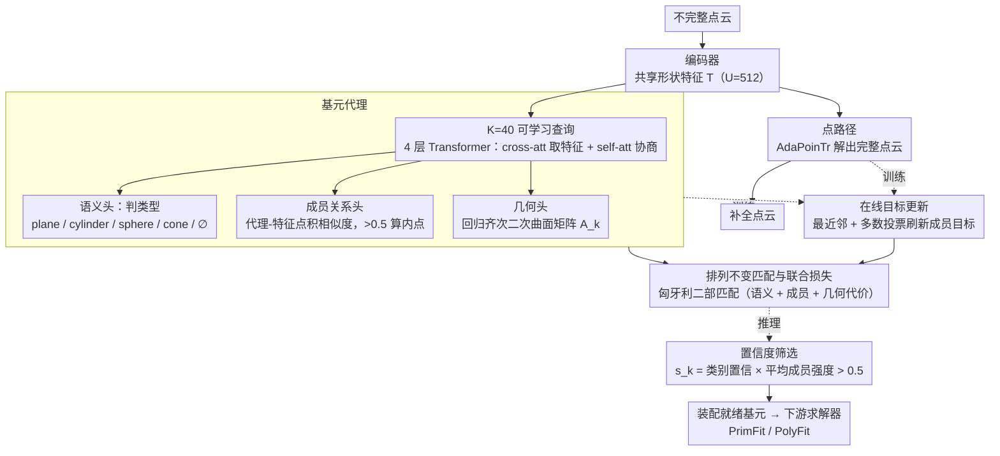

# Unified Primitive Proxies for Structured Shape Completion

**会议**: CVPR 2026  
**arXiv**: [2601.00759](https://arxiv.org/abs/2601.00759)  
**代码**: [https://unico-completion.github.io](https://unico-completion.github.io)  
**领域**: 3D视觉  
**关键词**: 形状补全, 基元装配, 3D重建, Transformer, 结构化理解

## 一句话总结
提出 UniCo，通过基元代理（primitive proxies）在共享形状特征上学习统一的基元表示，在单次前向传递中联合预测完整点云和装配就绪的二次曲面基元（含几何、语义和成员关系），在合成/真实点云 benchmark 上 Chamfer 距离降低最高 50%，法线一致性提升最高 7%。

## 研究背景与动机

1. **领域现状**：3D 形状补全旨在从不完整扫描恢复缺失几何。主流方法（PoinTr、AdaPoinTr、ODGNet 等）优化逐点差异，能恢复局部几何但缺乏结构化理解。基元装配（primitive assembly）将表面建模为参数化基元的紧凑集合，提供结构化、可解释的几何表示，适合后续编辑和拓扑控制任务。

2. **现有痛点**：当前做法是"先补全再装配"的级联方式（cascade），但存在根本问题：(a) 装配求解器（如 PrimFit、PolyFit）期望结构化输入，而逐点补全的输出是非结构化的；(b) 级联 pipeline 容易传播早期误差——基元数量或参数的错误会影响后续的关联步骤；(c) 像 PaCo 这样的两阶段方法先回归基元参数再强制成员关系，在稀疏证据区域容易过拟合，且仅支持平面基元。

3. **核心矛盾**：点补全和基元推断由不同的监督信号驱动——前者需要逐点引导，后者依赖离散和关系型线索。如何让两者协调优化而非级联？

4. **本文目标** 如何在单次前向传递中从不完整点云直接预测装配就绪的结构化基元（包含几何、语义类型和内点成员关系）。

5. **切入角度**：三个设计原则——(a) 协调路径：点补全和基元推断并行解码共享特征；(b) 统一表示：用可学习查询（primitive proxies）聚合特征上分散的结构信息；(c) 一致优化：在线更新基元目标，配合排列不变匹配。

6. **核心 idea**：用可学习的基元代理查询共享形状特征，在单个网络中联合预测点补全和装配就绪的基元。

## 方法详解

### 整体框架
输入一团不完整点云，UniCo 要在一次前向里同时交出两样东西：补全后的密集点云，和一组装配就绪的二次曲面基元。它先用编码器把输入压成一组共享形状特征 $\mathcal{T} = \{\mathbf{t}^u\}_{u=1}^U$（$U=512$），随后兵分两路并行解码同一份特征：点路径沿用 AdaPoinTr 解出完整点云，基元路径则放出 $K=40$ 个可学习的"基元代理"查询去这份特征里捞结构。两路共享同一份特征是关键——补全和基元推断不再是先后级联，而是被同一份表示同时约束，早期误差也就没了往下游传播的通道。训练时靠在线目标更新和匈牙利匹配让两路协调，推理时再用置信度分数挑出真正有效的基元交给下游装配求解器。

### 关键设计

**1. 基元代理（Primitive Proxies）：把散落在共享特征里的结构信息汇聚成统一的基元级表示**

逐点补全得到的特征是非结构化的，可下游装配求解器偏偏要结构化输入；UniCo 的办法是派一组可学习查询主动去"问"。$K=40$ 个查询 $\mathcal{R}^{(0)}$ 经 4 层 Transformer 解码器逐层上下文化，每层先做 cross-attention 让查询去共享特征 $\mathcal{T}$ 里取信息，再做 self-attention 让查询之间互相协商（避免两个代理抢同一块基元）：

$$\mathcal{R}^{(l)} = \text{self-att}\big(\text{cross-att}(\mathcal{R}^{(l-1)}, \text{MLP}(\mathcal{T}))\big)$$

上下文化后的代理由三个头共享：语义头用 MLP + softmax 判类型（plane / cylinder / sphere / cone / $\emptyset$）；成员关系头把代理嵌入和每个形状特征投到同一潜空间做点积相似度 $m_k^u = \text{sigmoid}(\langle \text{MLP}(\mathbf{r}_k), \text{MLP}(\mathbf{t}^u)\rangle)$，过 0.5 阈值就算内点；几何头则回归一个齐次二次曲面矩阵 $\mathbf{A}_k \in \mathbb{R}^{4 \times 4}$，用同一套参数统一表达平面、圆柱、球、锥。这套查询思路和 Mask2Former 的实例分割同源——都用查询替掉手工聚类——但区别在于这里输入残缺、还要同时吐出几何参数，所以代理必须和点补全路径共享同一份特征，而不是各管各的。

**2. 在线目标更新（Online Target Update）：让成员关系监督跟上不断变化的点预测**

补全网络吐出的点在训练中一直在动，如果还按固定点集去监督"哪个点属于哪个基元"，对应关系就会错位、优化也跟着抖。UniCo 干脆每次迭代都重算一遍目标：先让每个预测点 $\hat{\mathbf{y}}_j^u$ 用最近邻找到对应 GT 点的基元标签 $p_{i^*}$，再对每个 patch 做多数投票得到 patch 级标签 $\hat{\mathcal{P}}^u$，最后把投到同一基元的 patches 收成在线目标 $\mathcal{I}_g$。这些目标随预测一起刷新，分配和网络参数就被绑在一起联合优化。它的分量从消融里看得最直白：去掉在线更新，CD 从 2.44 直接崩到 12.22（5 倍），NC 从 0.924 跌到 0.631——这是全篇最不能动的一处设计。

**3. 排列不变匹配与联合损失：把无序的预测基元对齐到 GT，并统一打分筛选**

预测出的基元集合是无序的，没法逐个对号入座，UniCo 借 DETR 那套二部匹配来解决。它先在预测与 GT 之间建一张代价矩阵，把三类代价摊进去——语义代价（分类对不对）、成员关系代价（CE + Dice）、几何代价（内点的 Chamfer 距离加参数 L1 距离），再用匈牙利算法求最优匹配。总损失就是匹配上的基元代价之和，外加一项全局对象级 Chamfer 距离；没匹配上的预测则用语义项降权，缓解类别不平衡。这相当于把 DETR 的检测匹配扩到了"语义 + 几何 + 成员关系"的多任务版本。到推理阶段，同一批头的输出还要再合成一个置信度分数来筛基元：

$$s_k = \pi_k[\hat{c}_k] \cdot \frac{1}{|\hat{\mathcal{I}}_k|} \sum_{u \in \hat{\mathcal{I}}_k} m_k^u$$

也就是"类别置信 × 内点平均成员强度"，只有 $s_k > 0.5$ 的基元才会被留下、送进下游装配求解器（PrimFit / PolyFit 等）。

## 实验关键数据

### 主实验（ABC-multi + PrimFit 装配）

| 方法 | 基元提取器 | CD ↓ | HD ↓ | NC ↑ | FR ↓ |
|------|----------|------|------|------|------|
| AdaPoinTr | HPNet | 4.41 | 13.36 | 0.872 | 8.97% |
| ODGNet | HPNet | 4.33 | 13.63 | 0.873 | 7.41% |
| ODGNet | RANSAC | 4.80 | 22.15 | 0.868 | 0.39% |
| SymmComplete | HPNet | 4.57 | 13.58 | 0.865 | 9.84% |
| **UniCo (Ours)** | **内置** | **2.18** | **7.53** | **0.935** | **1.49%** |

### 消融实验（ABC-multi, 200 epochs）

| 配置 | CD ↓ | NC ↑ |
|------|------|------|
| Full model (UniCo) | 2.44 | 0.924 |
| no param. head | 2.52 (-0.08) | 0.921 |
| no prim. Chamfer | 2.53 (-0.09) | 0.920 |
| CE-only membership | 2.53 (-0.09) | 0.923 |
| Dice-only membership | 2.66 (-0.22) | 0.914 |
| **no online target** | **12.22 (-9.78)** | **0.631** |
| two-stage training | 2.55 (-0.11) | 0.919 |

### 真实数据（Building-PCC + PolyFit）

| 方法 | CD ↓ | HD ↓ | NC ↑ | FR ↓ |
|------|------|------|------|------|
| AdaPoinTr | 4.87 | 10.61 | 0.934 | 0.85% |
| ODGNet | 3.97 | 9.09 | 0.947 | 0.87% |
| PaCo | 4.89 | 10.74 | 0.932 | 0.54% |
| **UniCo (Ours)** | **3.84** | **9.18** | **0.949** | **0.39%** |

### 关键发现
- 在线目标更新是最关键的设计——去掉后 CD 灾难性恶化 5 倍（2.44 → 12.22），NC 从 0.924 暴跌至 0.631。这说明在补全任务中，动态同步基元监督与不断变化的点预测是必要的
- 逐点指标好不代表重建好：SymmComplete 逐点 CD 最低但装配后 CD 反而最高之一，说明结构化输出比裸点精度更重要
- UniCo 在 4 种不同装配求解器（PrimFit、PolyFit、KSR、COMPOD）上一致优于基线，证明其基元质量的通用性
- 鲁棒性测试：不完整度从 25% 到 75%，UniCo 的 CD 仅从 1.8 升至 2.7，而基线翻倍到 ~6.0
- 有趣观察：基元代理自动发展出一致的代理级语义——特定代理在不同输入中始终代表相同物体部件

## 亮点与洞察
- 将 DETR 风格的查询机制引入 3D 形状补全是一个优雅的迁移：基元代理类似 object queries，但扩展到同时处理补全场景下的几何、语义和成员关系
- 在线目标更新解决了一个根本性问题——当预测持续变化时如何提供稳定的结构化监督，这个思路可以推广到其他预测目标动态变化的学习任务
- 齐次二次曲面参数化统一表示了平面、圆柱、球、锥体等多种基元，简化了网络设计且易于扩展新基元类型

## 局限与展望
- 优先考虑装配就绪的结构而非逐点精度——对于高度非结构化几何，基元抽象的收益有限
- 最终重建质量依赖于下游装配求解器
- $K=40$ 代理数是预设的，对于更复杂模型可能不够
- 未来方向：利用基元代理的涌现对应关系做部件感知装配；扩展到大规模场景

## 相关工作与启发
- **vs PaCo**：PaCo 是级联方式（先预测基元参数再关联内点），仅支持平面。UniCo 联合优化两路径且支持混合基元类型，在 ABC-plane 上 CD 从 1.87 降至 1.69，在 Building-PCC 上从 4.89 降至 3.84
- **vs AdaPoinTr/ODGNet**：这些方法逐点指标好但装配后差，因为它们的输出缺乏基元感知的结构化信息。UniCo 的结构化补全直接产出装配就绪的基元
- **vs Point2CAD/BSP-Net**：这些重建方法在部分输入上表现差。即使给最好的点补全作为输入（ODGNet），Point2CAD 的 CD 仍比 UniCo 高 55%

## 评分
- 新颖性: ⭐⭐⭐⭐ 基元代理概念新颖，将查询机制引入结构化补全；在线目标更新解决了关键训练难题
- 实验充分度: ⭐⭐⭐⭐⭐ 三个数据集（合成+真实）、四种装配求解器、详细消融和鲁棒性分析
- 写作质量: ⭐⭐⭐⭐⭐ 设计原则清晰，从问题到方案推导逻辑严密
- 价值: ⭐⭐⭐⭐ 为 3D 结构化理解提供了有效 recipe，但应用场景偏专业

<!-- RELATED:START -->

## 相关论文

- [\[CVPR 2026\] RnG: A Unified Transformer for Complete 3D Modeling from Partial Observations](rng_a_unified_transformer_for_complete_3d_modeling_from_partial_observations.md)
- [\[CVPR 2025\] ESCAPE: Equivariant Shape Completion via Anchor Point Encoding](../../CVPR2025/3d_vision/escape_equivariant_shape_completion_via_anchor_point_encoding.md)
- [\[ECCV 2024\] Transferable 3D Adversarial Shape Completion using Diffusion Models](../../ECCV2024/3d_vision/transferable_3d_adversarial_shape_completion_using_diffusion_models.md)
- [\[NeurIPS 2025\] Learning Generalizable Shape Completion with SIM(3) Equivariance](../../NeurIPS2025/3d_vision/learning_generalizable_shape_completion_with_sim3_equivariance.md)
- [\[CVPR 2026\] SGI: Structured 2D Gaussians for Efficient and Compact Large Image Representation](sgi_structured_2d_gaussians_for_efficient_and_compact_large_image_representation.md)

<!-- RELATED:END -->
