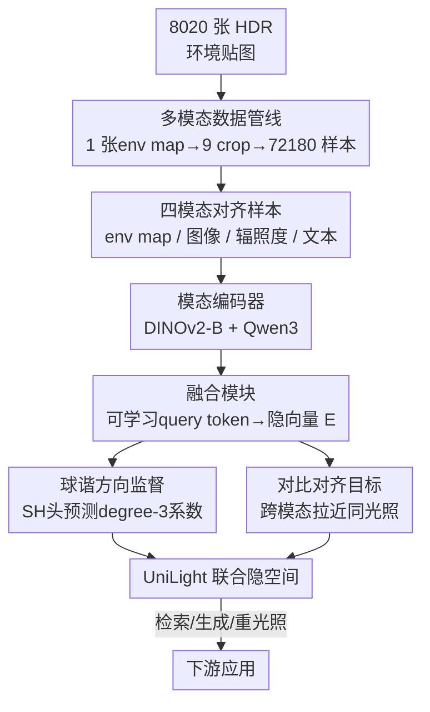

# UniLight: A Unified Representation for Lighting

**会议**: CVPR 2026  
**论文**: [CVF Open Access](https://openaccess.thecvf.com/content/CVPR2026/html/Zhang_UniLight_A_Unified_Representation_for_Lighting_CVPR_2026_paper.html)  
**代码**: 项目页 https://lvsn.github.io/UniLight （代码待确认）  
**领域**: 3D视觉 / 光照表示 / 重光照  
**关键词**: 统一光照表示, 跨模态对比学习, 环境贴图, 球谐函数, 重光照

## 一句话总结
UniLight 把环境贴图、图像、辐照度图、文本这四种历来互不兼容的光照表示，用对比学习压进同一个联合隐空间，并加一个球谐预测辅助任务来锁住光的方向信息，从而支持跨模态光照检索、环境贴图生成和扩散模型重光照三类下游任务。

## 研究背景与动机
**领域现状**：光照对图像外观影响巨大，但表示光照的方式五花八门——环境贴图（environment map）、辐照度图（irradiance）、球谐系数（SH）、参考图像、文本描述各有所长。环境贴图保真度高但难获取；文本直观但模糊；辐照度图在生成式渲染管线里常用却不含全局方向。

**现有痛点**：这些表示彼此**不兼容**，导致几乎所有光照估计 / 控制方法都是围绕单一表示设计的，换一种输入就用不了。比如一个为环境贴图设计的重光照模型，没法直接吃用户给的一句文本；一个文本驱动的方法又没法利用现成的辐照度图。用户被锁死在某一种光照接口上。

**核心矛盾**：光照本质是同一个物理量（场景里光从哪来、什么颜色、多亮），但不同模态是它的不同"投影"，信息量还不对等（文本远比环境贴图稀疏）。要让它们互通，就得找到一个**与具体模态解耦、但保留光照结构（尤其是方向）的公共空间**。已有的隐式光照表示（NeRF 类、PCA、优化得到的可解释方向）要么任务专用、要么需要人工标注，做不到通用对齐。

**本文目标**：学一个联合隐空间，让"描述同一光照条件"的不同模态映射到相近的向量，从而一次训练、跨模态复用。

**切入角度**：作者借鉴 CLIP 式的多模态对比对齐，但发现纯对比学习抓不准**光的方向**（这恰恰是光照最关键的属性）。于是额外让隐向量去预测球谐系数，把方向性显式注入隐空间。

**核心 idea**：用"对比对齐 + 球谐方向监督"把四种光照模态统一进一个 512 维隐空间，使光照可以在模态之间自由翻译和迁移。

## 方法详解

### 整体框架
UniLight 的输入是四种光照模态之一（360° 环境贴图、普通图像、辐照度图、文本），输出是一个统一的隐向量 $E \in \mathbb{R}^{T \times D}$（默认 $T=8$ 个 token、$D=512$ 维）。图像类模态各自过一个 DINOv2-B 主干，文本过 Qwen3-Embedding 主干；各主干输出再经一个轻量"融合模块"（learnable query tokens + 注意力）压成定长隐向量。训练时用一个跨全模态的对比损失把"同一光照"的不同模态拉近，同时挂一个球谐预测头，用辐照监督让隐空间显式编码光方向。训练好后，这个隐空间直接驱动三类下游：跨模态检索、环境贴图生成（微调 SD3.5）、重光照（接入 X→RGB）。

为了训练，作者先用一条多模态数据管线，从 8,020 张 HDR 环境贴图自动派生出 72,180 条对齐样本。

### 关键设计

**1. 多模态数据管线：把一张环境贴图自动展开成四模态对齐样本**

跨模态对齐的最大障碍是没有"同一光照、多种表示"的成对数据。作者的解法是以 HDR 环境贴图为"真相之源"，自动派生其余模态。具体地，从每张环境贴图绕竖直轴每隔 $40°$ 旋转、投影出 9 张 $512\times512$、$90°$ 视场的透视图（用 Reinhard 亮度映射 $F_d=0.35$ 自动曝光、$\gamma=2.2$ 色调映射）；对每张图用 Prism 做内禀分解得到辐照度图；用 InternVL3-38B 这个 VLM 生成光照文本——关键是先在 HDR 环境贴图里检测**亮度高于阈值的大连通域**来定位主光源（阈值从 $\tau_0=4$ 起，每次按 $\tau_{i+1}=\tau_i/\sqrt{2}$ 降一档直到检出），把主光方向写进结构化 prompt 喂给 VLM，使生成的文本带准确方向线索；再用 DiffusionLight-Turbo 为每张图估一张环境贴图、并拟合 degree-3 球谐系数。这样一来，8,020 张环境贴图变成 72,180 条"环境贴图 / 图像 / 辐照度 / 文本 / SH / 估计环境贴图"完全对齐的样本，为对比训练提供了天然正样本对。

**2. HDR 感知的模态编码器：让一个 DINOv2 同时吃得下 HDR、LDR 和方向**

环境贴图是 HDR、且自带经纬方向，直接当普通图喂 DINOv2 会丢掉高动态范围和方向信息。作者为环境贴图设计了三通道复合输入 $\{I_{ldr}, I_{log}, I_{dir}\}$：$I_{ldr}$ 是 Reinhard 色调映射后的 LDR 图；$I_{log}=\log(I_{hdr}+1)/\log(I_{max})$（取 $I_{max}=1000$ 做归一化、超出即截断）保留 HDR 动态范围；$I_{dir}$ 是逐像素 $x,y,z$ 坐标编码，对应经纬投影、显式提供方向。训练时环境贴图随机从真值或 DiffusionLight-Turbo 估计中采样，并对 $I_{log}$ 通道做随机 dropout——这样模型既兼容估计得到的环境贴图，也能在只有 LDR 输入时正常工作。图像和辐照度模态则各用一个独立的 DINOv2-B 直接编码；文本用 0.6B 的 Qwen3-Embedding，并在 prompt 里追加"编码光照、主光位置、整体亮度与色温"的指令后再做微调。每个模态一套专用编码器，保证各模态的特性都被照顾到。

**3. 可学习 query token 融合模块：把变长主干特征压成定长光照隐向量**

不同主干输出的序列长度 $T_{backbone}$ 和维度 $D_{backbone}$ 都不一样，无法直接对齐。融合模块给每个模态配 $T$ 个**可学习 query token**，让它们通过多头注意力去"询问"主干特征（注意力后接 LayerNorm），再用线性投影映射到共享隐空间 $E \in \mathbb{R}^{T \times D}$，默认 $T=8$、$D=512$。这个 summary 机制把任意长度、任意维度的主干特征统一成定长定维的光照向量，是各模态能在同一空间里比较的前提；消融显示 token 数从 1 增到 16 检索精度只是小幅提升（R@1 从 23.8 到 26.5），所以 8 个 token 是精度与内存的折中，下游若有内存/精度偏好可换成 1 或 16。

**4. 对比对齐 + 球谐方向监督：用辅助任务把"光从哪来"焊进隐空间**

光照最核心的属性是方向，但纯对比学习只拉近"成对模态"，并不保证隐空间显式编码方向。作者在对比损失之外加了一个球谐监督项。对比损失 $L_C$ 在一个 batch 内对所有模态两两算余弦相似度、用交叉熵最大化匹配对的一致性；球谐头从隐向量预测 degree-3 的 SH 系数，用与真值的均方误差监督 $L_{SH}=\|SH_{pred}-SH_{GT}\|_2^2$，总损失 $L=L_C+L_{SH}$。这个辅助任务效果立竿见影：消融里去掉 SH 监督（NOSH），R@1 从 24.9 暴跌到 10.2、MRR 从 0.367 掉到 0.215；而 degree-3 是甜点，degree-1 太粗（R@1 仅 20.7）、degree-5 反而略降。把环境贴图绕竖直轴旋转后，隐向量的余弦相似度随旋转角单调下降，直接证明隐空间确实把光方向编码了进去。

### 损失函数 / 训练策略
总损失为对比项与球谐项之和 $L = L_C + L_{SH}$，二者等权，无额外权重调参。对比项是跨全部四模态的对称交叉熵；球谐项是 degree-3 系数的 MSE。环境贴图输入在真值与 DiffusionLight-Turbo 估计间随机采样、并对 log-HDR 通道随机 dropout，以提升对不同输入格式的鲁棒性。

## 实验关键数据

### 主实验
跨模态检索上，UniLight 这个为光照定制的隐空间，远胜通用嵌入。下表是在 603 条测试样本上、Image↔Text 双向检索的平均值（与 CLIP / Qwen3-VL 对齐口径比较）：

| 方法 | R@1↑ | R@5↑ | R@10↑ | MRR↑ | 中位排名↓ |
|------|------|------|-------|------|-----------|
| CLIP ViT-B/32 | 2.6 | 10.8 | 16.9 | 0.077 | 72.0 |
| Qwen3-VL 2B | 8.9 | 26.3 | 37.1 | 0.179 | 36.6 |
| UniLight (8 token, SH3) | 24.9 | 49.0 | 60.6 | 0.367 | 9.8 |

环境贴图生成上，把估计出的 HDR 环境贴图渲染后比较，UniLight 在全部 6 个指标上压过 DiffusionLight-Turbo：

| 方法 | PSNR↑ | RMSE↓ | SI-RMSE↓ | SSIM↑ | MAE↓ | LPIPS↓ |
|------|-------|-------|----------|-------|------|--------|
| DiffusionLight-Turbo | 27.77 | 0.157 | 0.062 | 0.902 | 0.148 | 0.088 |
| UniLight | **28.85** | **0.133** | **0.060** | **0.915** | **0.124** | **0.079** |

### 消融实验
| 配置 | R@1 | R@5 | MRR | 说明 |
|------|-----|-----|------|------|
| 8 token, SH3（完整） | 24.9 | 49.0 | 0.367 | 默认配置 |
| 8 token, NOSH | 10.2 | 31.9 | 0.215 | 去掉球谐方向监督，崩塌 |
| 8 token, SH1 | 20.7 | 43.3 | 0.320 | SH 阶数太低，方向太粗 |
| 8 token, SH5 | 24.1 | 47.7 | 0.358 | 阶数过高反而略降 |
| 1 token, SH3 | 23.8 | 47.4 | 0.355 | token 减到 1 仅小幅掉点 |
| 16 token, SH3 | 26.5 | 50.7 | 0.382 | token 增到 16 小幅提升 |

### 关键发现
- **球谐监督是命门**：去掉 SH（NOSH）后 R@1 几乎腰斩（24.9→10.2），说明纯对比对齐学不出方向，方向必须靠辅助任务显式注入；degree-3 是甜点，degree-1 太粗、degree-5 过拟无益。
- **token 数对精度不敏感**：1→16 个 token，R@1 仅 23.8→26.5，所以可按内存预算自由取舍，8 是折中默认值。
- **文本模态检索最弱**：文本的 R@K 明显低于其他模态（如 Text→其他的 R@5 仅约 0.19–0.25），源于文本描述本身的模糊性；但即便如此，从文本预测的 SH 仍能与真值大致对齐，说明稀疏文本也被映进了正确的光照区域。
- **估计环境贴图天然偏弱**：用 DiffusionLight-Turbo 估出的环境贴图作为模态，相似度分数低于真值环境贴图，属预期内的估计误差。

## 亮点与洞察
- **"以环境贴图为锚自动造对齐数据"很聪明**：从 8,020 张 HDR 贴图自动派生 72,180 条四模态对齐样本，绕开了多模态成对标注的天坑，VLM + 主光连通域检测让文本也带上准确方向，这条管线本身就可复用到别的光照任务。
- **辅助任务定向修补对比学习的盲区**：CLIP 式对齐对"方向"无感，作者不去改对比损失而是挂一个轻量 SH 头把物理先验灌进去，消融数据证明这一步几乎决定成败——这是"用任务监督补表示缺陷"的范例。
- **一个隐空间打通三类下游**：检索、环境贴图生成（SD3.5 的文本分支被替换成光照嵌入）、重光照（接 X→RGB）共用同一表示，无需各自重训表示层，体现了统一表示的真正价值——光照可以在模态间翻译。
- **HDR 三通道编码可迁移**：把 LDR+log-HDR+方向坐标拼起来喂 LDR 预训练的 DINOv2，加 dropout 兼容纯 LDR 输入，这套"让 LDR 骨干吃 HDR"的技巧对任何 HDR 视觉任务都有借鉴意义。

## 局限与展望
- **作者承认不建模空间变化光照**：当前表示只编码全局光方向，不含逐点的 spatially-varying 光照，对复杂室内场景（同一房间多光源、局部阴影）是硬伤；作者建议未来融合更多空间模态做局部控制。
- **文本模态偏弱**：文本检索和 SH 重建都明显逊于图像类模态，本质是文本信息量稀疏；想用纯文本精细控光仍受限。
- **自己发现的局限**：表示的"上限"被数据管线里的现成工具锁死——文本靠 InternVL3、辐照度靠 Prism、估计环境贴图靠 DiffusionLight-Turbo，这些工具的偏差会直接传进隐空间；HDR 归一化常数 $I_{max}=1000$ 是硬编码，对超高动态范围的强光场景可能截断失真。
- **改进思路**：作者提到把嵌入对齐到已有流行编码器（如 CLIP/SDXL 文本编码器）可简化扩散模型微调甚至支持零样本使用；引入 shading-based 等更多表示也能扩展用户交互方式。

## 相关工作与启发
- **vs DiffusionLight-Turbo（环境贴图估计）**：DL-Turbo 只支持图像条件、单模态估计，UniLight 支持四模态条件且环境贴图生成质量全指标更优（PSNR 28.85 vs 27.77）；UniLight 还把 DL-Turbo 当数据管线里的一环来用。
- **vs CLIP / Qwen3-VL（通用多模态嵌入）**：通用嵌入抓语义但对光照不敏感，CLIP R@1 仅 2.6、Qwen3-VL 2B 仅 8.9，UniLight 因专注光照达 24.9；说明"为特定物理属性定制表示"比直接用大通用模型更有效。
- **vs X→RGB / LumiNet / DiffusionRenderer（单模态重光照）**：这些方法各自只吃一种光照控制（文本 / 图像 / 环境贴图），UniLight 把统一嵌入接进 X→RGB 的文本条件分支，使同一个重光照模型能接受任意模态的光照指令，且在环境贴图旋转时阴影高光会随之联动（Qwen3-VL 嵌入则常让阴影"卡住"不动）。
- **vs 隐式光照表示（NeRF 类 / PCA / 优化方向）**：已有隐式方法要么任务专用、要么需人工标注可解释方向，UniLight 直接学一个无需标注、跨模态通用的联合隐空间。

## 评分
- 新颖性: ⭐⭐⭐⭐ 首次把四种历来不兼容的光照模态对齐进单一隐空间，并用 SH 辅助任务补上对比学习的方向盲区，组合新颖。
- 实验充分度: ⭐⭐⭐⭐ 检索 / 生成 / 重光照三类下游 + token 与 SH 阶数双消融，覆盖到位；但缺少与更多近期重光照 SOTA 的量化对比，重光照主要靠定性。
- 写作质量: ⭐⭐⭐⭐ 动机—数据—方法—应用脉络清晰，图示充分；部分关键超参（如总损失等权、$I_{max}$）解释偏简。
- 价值: ⭐⭐⭐⭐ 提供了一个可复用的统一光照接口与数据管线，对光照估计、可控生成、重光照社区有实用价值。

<!-- RELATED:START -->

## 相关论文

- [\[CVPR 2026\] OLATverse: A Large-scale Real-world Object Dataset with Precise Lighting Control](olatverse_a_large-scale_real-world_object_dataset_with_precise_lighting_control.md)
- [\[CVPR 2026\] LuxRemix: Lighting Decomposition and Remixing for Indoor Scenes](luxremix_lighting_decomposition_and_remixing_for_indoor_scenes.md)
- [\[ICLR 2026\] Learning Unified Representation of 3D Gaussian Splatting](../../ICLR2026/3d_vision/learning_unified_representation_of_3d_gaussian_splatting.md)
- [\[CVPR 2026\] SunFaded: Illumination-Aware Gaussian Splatting for Dark Scenes with Camera-Mounted Active Lighting](sunfaded_illumination-aware_gaussian_splatting_for_dark_scenes_with_camera-mount.md)
- [\[ACL 2026\] CodeBind: Decoupled Representation Learning for Multimodal Alignment with Unified Compositional Codebook](../../ACL2026/3d_vision/codebind_decoupled_representation_learning_for_multimodal_alignment_with_unified.md)

<!-- RELATED:END -->
