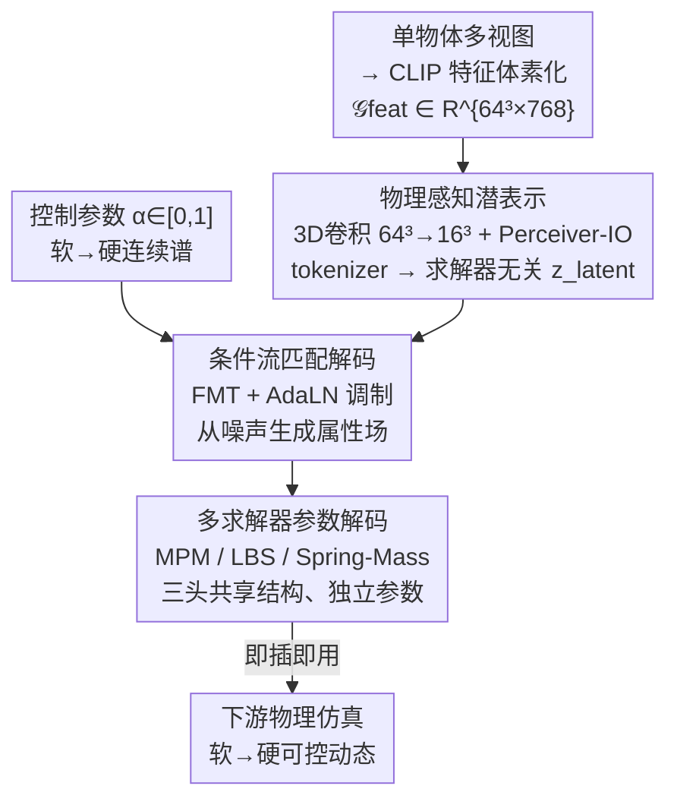

# UniPixie: Unified and Probabilistic 3D Physics Learning via Flow Matching

**会议**: CVPR 2026  
**arXiv**: [2606.05399](https://arxiv.org/abs/2606.05399)  
**代码**: https://unipixie.github.io/ (项目主页)  
**领域**: 3D视觉 / 物理属性预测 / 流匹配生成  
**关键词**: 物理属性预测, 流匹配, 可控生成, 多求解器, 软硬连续谱

## 一句话总结
UniPixie 把"从视觉推断物体物理属性"从确定性点估计改写成可控的概率分布建模——用一个共享 Perceiver-IO 编码器 + 条件流匹配解码器，从单张视觉输入沿"最软到最硬"连续谱生成物理参数，并首次用统一架构同时产出 MPM / LBS / Spring-Mass 三种求解器即插即用的参数，杨氏模量误差比最强确定性 baseline 降低 50% 以上。

## 研究背景与动机

**领域现状**：3D 高斯泼溅等技术能从图像重建出逼真的静态数字孪生，但这些模型对"物体怎么动、怎么形变"一无所知。于是出现了"Physics-from-Pixels"任务——直接从视觉推断杨氏模量、密度等材料属性。现有做法分两类：一是测试时优化（test-time optimization），对每个新场景反向传播可微仿真器迭代拟合参数；二是前馈预测，代表作 PIXIE 用 U-Net 在大规模数据上训练，一次前向就给出材料属性。

**现有痛点**：测试时优化每个物体要算几个小时、且不泛化到新物体；前馈方法（PIXIE）虽快，但**本质是确定性的——对一个物体只吐出一个点估计**。更要命的是，所有现有方法都和单一仿真范式（几乎都是 MPM）深度绑定，预测出的参数换个求解器就用不了，可移植性极差。

**核心矛盾**：物理现实本身是**有歧义的**——一个外观完全相同的物体，可能对应一整段合理的刚度范围（同一个泰迪熊可软可硬）。确定性点估计从根本上无法刻画这种歧义，强行回归到单点反而丢掉了"真实物理就是一段分布"这个关键事实。

**本文目标**：(1) 把物理预测重构成学习一段**可控的物理连续谱**而非回归单点；(2) 用一套统一架构同时服务多种异构物理求解器。

**切入角度**：作者抓住物理歧义最主要的一根轴——物体从"最软态"到"最硬态"的连续区间，用一个标量参数 $\alpha\in[0,1]$ 去控制它；并把这件事交给生成模型（流匹配）来做，因为流匹配天生擅长建模"从噪声到一段分布"的映射。

**核心 idea**：用条件流匹配在共享潜空间里建模"软→硬"物理连续谱，再通过不同解码头解码成 MPM / LBS / Spring-Mass 三种求解器的参数——把"点估计回归"换成"可控分布生成 + 多求解器统一解码"。

## 方法详解

### 整体框架
UniPixie 是一个前馈框架：输入是物体的多视图 CLIP 特征，输出是可直接喂给物理引擎的仿真参数，整条链路由"统一编码器 → 条件流匹配解码器 → 多求解器解码头"三段组成。

具体地：先把多视图图像的 dense CLIP 特征提升到 3D 并体素化，得到稀疏特征网格 $\mathcal{G}_{\text{feat}}\in\mathbb{R}^{N\times N\times N\times D}$（$N=64,D=768$）；统一的 Grid Encoder 把它压成一组求解器无关（solver-agnostic）的潜在 token $\boldsymbol{z}_{\text{latent}}\in\mathbb{R}^{L\times C}$。这组潜表示是整个框架可移植性的关键——它不针对任何特定求解器。随后，一个用户给定的控制参数 $\alpha$（0=最软、1=最硬）连同 $\boldsymbol{z}_{\text{latent}}$ 一起送进条件流匹配 Transformer（FMT）解码器，生成对应刚度的物理属性场。最后，三个共享网络结构、但各自独立参数的专用解码头分别把同一份潜表示解码成 MPM、LBS、Spring-Mass 三种引擎所需的参数格式。训练标签来自新构建的 PixieMultiVerse 数据集（标注的是属性范围 $[\boldsymbol{y}_{\min},\boldsymbol{y}_{\max}]$ 而非单值），中间任意 $\alpha$ 的目标值由线性插值得到。

### 关键设计

**1. 物理感知潜表示：用统一编码器学一份求解器无关的"物理几何"表示**

为了让一份表示能同时服务三种异构求解器，编码器必须学到与具体仿真范式解耦的物理几何结构。UniPixie 的 Grid Encoder $\mathcal{E}$ 借鉴 Perceiver-IO，分两步：先用 3D 卷积主干把输入网格从 $64^3$ 逐步下采样到 $16^3$，既降低后续注意力的开销，又逼迫网络抽取更高层的几何结构；再用 $N_{\text{blocks}}$ 个级联块去更新 $L$ 个可学习的 latent query——每个块先做 latent query 对卷积特征的 cross-attention，再接两层 self-attention 精炼，最终得到 $\boldsymbol{z}_{\text{latent}}=\mathcal{E}(\mathcal{G}_{\text{feat}})\in\mathbb{R}^{L\times C}$。这组 token 是统一的、求解器无关的潜表示，正是它让"同一份编码 → 多种求解器"的可移植性成为可能。

**2. 条件流匹配生成：用一个标量 α 控制"软→硬"连续谱**

要把确定性点估计升级成可控分布，作者把物理属性生成建模成条件流匹配（CFM）问题。训练时，目标属性由软硬两端线性插值（LERP）合成：

$$\boldsymbol{y}_{\text{target}}=(1-\alpha)\boldsymbol{y}_{\min}+\alpha\boldsymbol{y}_{\max}$$

把 $\boldsymbol{y}_{\text{target}}$ 当作流匹配的终点 $\boldsymbol{x}_1$，模型学一个向量场 $\boldsymbol{v}_\theta$ 把高斯噪声 $\boldsymbol{x}_0\sim\mathcal{N}(0,\boldsymbol{I})$ 沿直线推到目标，损失为 $\mathcal{L}_{\text{CFM}}=\mathbb{E}_{t,\boldsymbol{x}_0,\boldsymbol{y}_{\text{target}},\boldsymbol{c}}\lVert\boldsymbol{v}_\theta(\boldsymbol{x}_t,t,\boldsymbol{c})-(\boldsymbol{y}_{\text{target}}-\boldsymbol{x}_0)\rVert_2^2$，其中 $\boldsymbol{x}_t=(1-t)\boldsymbol{x}_0+t\boldsymbol{y}_{\text{target}}$。关键在于控制参数 $\alpha$ 被编码进条件信号 $\boldsymbol{c}$，并通过自适应层归一化（AdaLN）调制 Transformer 各层——这样推理时只需平滑插值这一个 $\alpha$，就能连续生成从软到硬的整段合理材料场，而不是被钉死在一个点估计上。相比 PIXIE 用 U-Net 回归单点，这种生成式表述既捕获了物理歧义，又把"可控"做成了一个直观旋钮。

**3. 多求解器统一解码：同一潜表示，三个解码头适配异构引擎**

现有方法被单一求解器（多为 MPM）绑死，是可移植性差的根因。UniPixie 让三个解码头都条件于同一份 $\boldsymbol{z}_{\text{latent}}$，但各自适配求解器的参数结构：
- **MPM**：FMT 解码器 $\mathcal{D}_{\text{MPM}}:(\boldsymbol{z}_{\text{latent}},\alpha)\to\{(E_i,\nu_i,\rho_i,l_i)\}_{i=1}^K$，为全部 $K$ 个前景体素生成空间变化的材料场（杨氏模量 $E$、泊松比 $\nu$、密度 $\rho$ 连续值 + 离散材料类别 $l$）。
- **LBS**：采用双解码器设计。连续材料属性 $(E,\nu)$ 仍由标准 FMT 解码器生成体素场；但形变模型需要不同的参数化——借鉴 Vid2Sim，用一个 HyperNetwork 从全局潜 token 直接回归物体专属的 LBS 参数 $\theta_{\text{LBS}}$（skinning 权重网络的参数）。值得注意的是形变结构保持静态，软硬连续谱完全由 $\alpha$ 调制的材料场驱动。
- **Spring-Mass**：解码器 $\mathcal{D}_{\text{Spring}}:(\boldsymbol{z}_{\text{latent}},\alpha)\to\boldsymbol{m}_{\text{spring}}=(\boldsymbol{k},\eta)$，输出 $N_a$ 个锚点的刚度向量 $\boldsymbol{k}\in\mathbb{R}^{N_a}$ 和一个全局软度标量 $\eta$（沿用 Spring-Gaus 的简化设计）。

这是首个能为根本不同的下游物理后端产出一致、即插即用参数的统一架构，把"换求解器要重训"变成"换个解码头"。

### 损失函数 / 训练策略
核心训练目标是条件流匹配损失 $\mathcal{L}_{\text{CFM}}$（式 3），目标属性由式 2 的软硬端点 LERP 合成、$\alpha$ 在训练中随机采样。数据侧依赖 PixieMultiVerse：MPM 端用 Actor-Critic VLM + 人工核验标注属性范围 $[\boldsymbol{y}_{\min},\boldsymbol{y}_{\max}]$（GPT-4o 作 Actor 提议范围与跨部件约束如 $E_{\text{trunk}}\gg E_{\text{leaf}}$，Gemini-2.5-Flash 作 Critic 选最几何一致的查询，再人工经边界值仿真核验，拒绝率 8.9%、修正率 38.3%）；LBS / Spring-Mass 端不直接标注，而是在软（$\alpha=0$）、硬（$\alpha=1$）两端用 MPM 生成 ground-truth 仿真视频，再用慢速测试时方法（Vid2Sim / Spring-Gaus）拟合各求解器参数并人工修正，中间 $\alpha$ 的标签由插值得到——保证同一控制状态 $\alpha$ 下三种求解器的目标动态行为一致。

## 实验关键数据

### 主实验
PixieMultiVerse 基于 PIXIEVERSE 的 1410 个高质量资产重标注；MPM 测试集 41 个物体，LBS / Spring-Mass 在 10 个弹性物体子集上评估。连续属性用 log 空间 MSE（$\log E,\log\rho$）和线性空间 $\nu$ MSE，材料分类用 Accuracy，仿真质量用 PSNR / SSIM / LPIPS。

**与确定性 baseline 的属性回归对比（生成模型在 $\alpha\in\{0,0.5,1\}$ 上平均）**：

| 方法 | $\log E$ MSE ↓ | $\log\rho$ MSE ↓ | $\nu$ MSE ↓ | 材料 Acc. ↑ | 运行时 ↓ |
|------|------|------|------|------|------|
| NeRF2Physics | 0.5236 | 0.2958 | 0.3430 | 63.4% | 119.5s |
| PUGS* | 1.0591 | 0.2335 | — | 36.3% | 36.3s |
| PIXIE*（最强确定性） | 0.0205 | 0.0244 | 0.0557 | **97.3%** | **0.137s** |
| 3D U-Net（消融） | 0.0410 | 0.1464 | 0.4604 | 96.3% | 10.77s |
| **UniPixie** | **0.0091** | **0.0194** | **0.0240** | 93.9% | 12.16s* |

UniPixie 的 $\log E$ MSE 0.0091，比此前最佳 PIXIE 的 0.0205 准确一倍多（>50% 降误差）；$\rho$、$\nu$ 也都最优。代价是离散材料分类略逊于 PIXIE（93.9% vs 97.3%）。运行时 12.16s 为 MPM 单解码头推理，三求解器全量生成约 21.6s。

**多求解器视频重建保真度（PSNR，节选三端）**：

| 求解器 / 方法 | $\alpha{=}0$ 软 | $\alpha{=}0.5$ 中 | $\alpha{=}1$ 硬 | 运行时 ↓ |
|------|------|------|------|------|
| MPM: PIXIE | 23.16 | 30.17 | 26.04 | 0.14s |
| MPM: **UniPixie** | **29.25** | **30.43** | **32.87** | 21.6s |
| LBS: Vid2Sim(full) | 28.30 | **36.94** | 40.13 | 521s |
| LBS: **UniPixie** | **33.83** | 36.81 | **41.63** | **21.6s** |
| Spring: Spring-Gaus(tuned) | 30.53 | 37.60 | 36.57 | 4375s |
| Spring: **UniPixie** | **33.88** | **38.79** | **38.51** | **21.6s** |

一套统一模型在三种求解器上普遍打平甚至超过专用模型，且比测试时优化（Vid2Sim 521s、Spring-Gaus 4375s）快两到三个数量级。

### 消融实验
| 配置 | $\log E$ MSE ↓ | 说明 |
|------|------|------|
| UniPixie（流匹配） | 0.0091 | 完整生成模型 |
| 3D U-Net（换生成 backbone） | 0.0410 | 同为生成模型但用 3D 扩散 U-Net，误差升约 4.5 倍 |
| PIXIE（确定性点估计） | 0.0205 | 单点回归，无可控分布 |

### 关键发现
- **学分布反而比学单点更准**：UniPixie 在 $\alpha$ 平均下的点预测比专门优化单点的 PIXIE 还准一倍多——作者认为学连续分布逼出了更鲁棒、更准确的底层表示。
- **生成 backbone 选型重要**：同样是生成式，换成 3D 扩散 U-Net 后 $\log E$ MSE 从 0.0091 涨到 0.0410，说明流匹配 + Transformer 的组合是有效配方，而非"只要是生成模型就行"。
- **α 学到了有意义的物理映射**：$\alpha=0$ 与 $\alpha=1$ 的预测分布清晰可分、且与 GT 软硬边界对齐；橡皮鸭在 $\alpha=0$ 受击形变、$\alpha=1$ 近乎刚体，连续谱直接 translate 成可控动态。
- **统一不牺牲精度**：单一统一模型在 LBS / Spring 上的软端、硬端这些更难的极端刚度区反而比专用 baseline 更稳。

## 亮点与洞察
- **把物理歧义显式建模成一个可控旋钮**：以往物理预测都在追求"唯一正确答案"，本文承认"同一外观对应一段合理刚度"才是物理现实，用单标量 $\alpha$ 把这段歧义变成用户可控的连续谱——视角转换很漂亮，且让生成模型（流匹配）有了用武之地。
- **求解器无关潜表示 + 多解码头**：把"和单一求解器绑死"这个老问题解成"共享编码 + 可插拔解码头"，思路可直接迁移到任何"一份感知、多种下游引擎"的场景（如同一份场景表示喂给不同渲染器/仿真器）。
- **跨求解器标注的偷懒技巧很实用**：LBS / Spring 不直接标注，而是只在软硬两端用 MPM 生成 GT 视频、再用慢速方法蒸馏回前馈模型，中间靠插值——把"昂贵的多求解器标注"降维成"两端标注 + 插值"，是可复用的数据工程 trick。

## 局限与展望
- **离散材料分类略退步**：材料类别准确率 93.9% 低于 PIXIE 的 97.3%，生成式表述对离散标签的处理不如确定性回归干净。
- **只建模了软-硬这一根轴**：物理歧义被简化成单维 $\alpha$ 连续谱，作者承认未来需要探索多维材料流形（multi-dimensional material manifold），现实物理歧义远不止刚度一维。
- **遮挡区域无解**：属性预测依赖可见视觉特征，作者把"估计被遮挡区域属性"列为待解决问题。
- **三求解器全量推理仍要 ~21.6s**：比测试时优化快几个数量级，但相比 PIXIE 的 0.14s 还是慢两个数量级，离实时交互有距离。

## 相关工作与启发
- **vs PIXIE（前作）**：PIXIE 用 U-Net 从蒸馏 CLIP 特征回归单点确定性属性、且只服务 MPM；本文换成流匹配 Transformer 生成连续谱 + 统一多求解器架构，$\log E$ 误差降一半多，代价是材料分类略降——核心区别是"点估计 vs 可控分布""单求解器 vs 多求解器"。
- **vs 测试时优化（Vid2Sim / Spring-Gaus）**：它们对每个场景反传可微仿真器迭代拟合，质量高但每物体几百到几千秒、不泛化；UniPixie 前馈一次 ~21s 出全部三求解器参数，且把它们当作 GT 来源蒸馏进自己。
- **vs VLM 零样本（NeRF2Physics / PUGS）**：直接查询 VLM 拿粗粒度 part 级属性，快但噪声大、只能粗分；本文产出细粒度体素级材料场，精度高得多（$\log E$ MSE 0.0091 vs 0.52/1.06）。
- **vs PhysX-3D 等 3D 物理生成**：那类方法学形状与物理的联合分布去生成全新资产；本文不造新资产，而是给已有 3D 物体增广一段可控物理连续谱，是首个为静态 3D 物体生成连续体素材料场的条件流匹配框架。

## 评分
- 新颖性: ⭐⭐⭐⭐⭐ 把物理预测从点估计重构成可控分布 + 首个多求解器统一架构，两个角度都新。
- 实验充分度: ⭐⭐⭐⭐ 三求解器、多 baseline、消融齐全，但测试集偏小（41/10 物体）。
- 写作质量: ⭐⭐⭐⭐ 动机清晰、公式与多求解器解码讲得明白，图表完整。
- 价值: ⭐⭐⭐⭐⭐ 求解器无关表示 + 可控物理谱的范式对"感知到仿真"链路有较强可迁移价值。

<!-- RELATED:START -->

## 相关论文

- [\[CVPR 2026\] Optical Flow Matching: Reframing Optical Flow as Continuous Transport Dynamics](optical_flow_matching_reframing_optical_flow_as_continuous_transport_dynamics.md)
- [\[CVPR 2026\] ARES: Unifying Asymmetric RGB-Event Stereo for Probabilistic Scene Flow Estimation](ares_unifying_asymmetric_rgb-event_stereo_for_probabilistic_scene_flow_estimatio.md)
- [\[CVPR 2026\] GeodesicNVS: Probability Density Geodesic Flow Matching for Novel View Synthesis](geodesicnvs_probability_density_geodesic_flow_matching_for_novel_view_synthesis.md)
- [\[ICML 2026\] PLAID: A Unified Data Model for Machine Learning on Heterogeneous Physics Simulations](../../ICML2026/3d_vision/plaid_a_unified_data_model_for_machine_learning_on_heterogeneous_physics_simulat.md)
- [\[CVPR 2025\] Flow-NeRF: Joint Learning of Geometry, Poses, and Dense Flow within Unified Neural Representations](../../CVPR2025/3d_vision/flow-nerf_joint_learning_of_geometry_poses_and_dense_flow_within_unified_neural_.md)

<!-- RELATED:END -->
