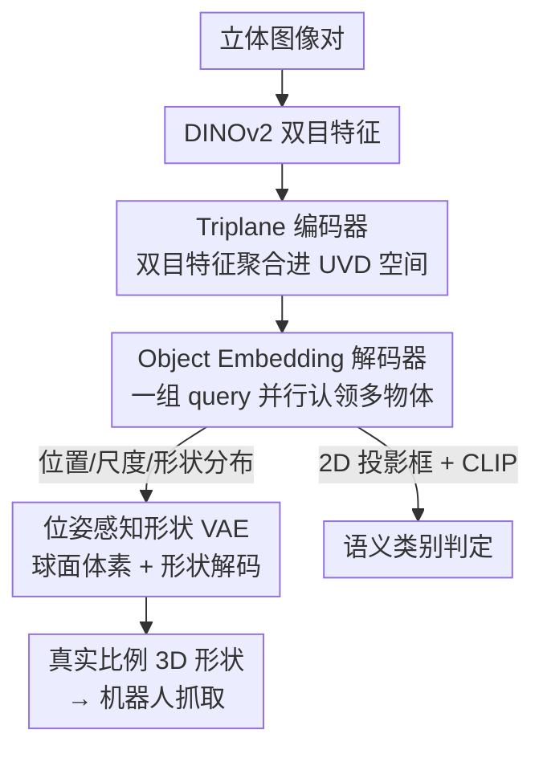

# UniPR: Unified Object-level Real-to-Sim Perception and Reconstruction from a Single Stereo Pair

**会议**: CVPR 2026  
**论文**: [CVF Open Access](https://openaccess.thecvf.com/content/CVPR2026/html/Zhang_UniPR_Unified_Object-level_Real-to-Sim_Perception_and_Reconstruction_from_a_Single_CVPR_2026_paper.html)  
**领域**: 3D视觉 / 物体级 real-to-sim / 6D 位姿与形状重建  
**关键词**: 立体视觉、real-to-sim、端到端重建、位姿感知形状表示、机器人抓取

## 一句话总结
UniPR 用一对立体图像、一次前向推理，同时检测场景里所有物体并重建它们带真实物理比例的 3D 形状，靠立体几何约束消除尺度歧义、靠位姿感知形状表示（PASR）甩掉"每类预定义规范空间"，相比 image-to-3D 模型把整场景重建快了 100×、形状比例精度提升约 3×。

## 研究背景与动机
**领域现状**：把现实物体搬进仿真器（object-level real-to-sim transfer）是机器人操作的刚需——既要视觉像，更要几何位置物理上准，机器人才能可靠抓取。当前主流做法是一条模块化流水线：2D 检测 → 分割 → 形状重建 → 位姿估计，逐个物体串行处理。

**现有痛点**：这条流水线有三个老毛病。其一是**误差累积**：每一级只拿到上一级裁出来的局部信息（bbox、mask），丢掉了全局上下文，前面错了后面一路放大，遮挡场景尤其糟。其二是**效率低**：物体得一个一个过，近期火热的大规模 image-to-3D 生成模型（HunYuan3D、Trellis）一次只能吃一个物体，整场景要跑很多遍。其三是**比例失真**：单目 image-to-3D 只有视觉输入、没有度量信息，存在天然的**尺度歧义**，生成的网格比例往往是错的，机器人按这个尺寸去抓就会失败。

**核心矛盾**：模块化把"感知"和"重建"硬拆成互不通信的阶段，每一步都在局部精修却丢全局；而单目输入根本无法恢复 metric scale。要物理上准，就得既打通信息流、又引入能定标的几何约束。

**本文目标**：(1) 把检测/分割/重建/位姿估计这些中间模块全部干掉，做成真正端到端；(2) 让一次前向就并行处理整场景所有物体；(3) 重建出带真实物理比例、世界坐标对齐的形状。

**切入角度**：作者押注两件事——用**立体（双目）**提供消除尺度歧义所需的几何约束（三角化天然带 metric scale，对透明物体也比深度传感器靠谱）；用**位姿感知的形状表示**把"位姿估计"和"形状重建"两个任务焊在一起，绕开类别级方法那套"预定义规范空间"。

**核心 idea**：把物体的位姿和几何**直接编码在观测空间里**（而不是先归一化到某个类别规范坐标系再对齐），让网络用一个 transformer decoder、一组 object query，端到端地从立体图像里并行预测每个物体的位置、尺度和"已经摆好姿态"的 3D 形状。

## 方法详解

### 整体框架
UniPR 是一个 single-forward 网络：输入一对立体图像，输出场景里每个物体的语义标签、3D 位置 $(x,y,z)$、物理尺度 $s$，以及一个带姿态的 3D 形状（occupancy 表示，可转成相机坐标系下的点云/网格）。中间不再有任何"先检测再分割再重建"的串行子模块。

整条管线分四步走：(1) 用 DINOv2 从左右两张图各抽 2D 特征；(2) 把双目特征通过 stereo cross-attention 聚合进一个 **Tri-Plane View (TPV)** 全局表示，建立带深度维的 UVD 空间作为统一坐标框架；(3) 一组 object query 在 transformer decoder 里跟 TPV 特征交互，并行地"认领"各个物体，产出 object embedding；(4) 几个轻量预测头从 object embedding 解出位置、尺度、形状分布，再喂给一个**预训练好的 PASR 形状解码器**算出 occupancy，恢复物体形状。其中形状解码器来自一个单独预训练的**位姿感知形状 VAE**——先把它学好，再把 decoder 冻进主管线当 shape decoder 用。

### 关键设计

**1. 位姿感知形状表示 PASR：把位姿和形状焊在一起，扔掉类别规范空间**

类别级方法（如 NOCS 那一脉）要先为每个类别定义一个"规范空间"，把物体归一化进去再预测相对位姿。问题是定义规范朝向很难、类内变化又大，所以这类方法大多只能撑住不到 6 个类别，根本没法 scale 到几百类。PASR 的做法是**直接在观测空间里联合编码物体的位姿和几何**——形状本身就是"已经摆成它在世界里那个姿态"的形状，于是位姿估计和形状重建从两个解耦的任务变成一个紧耦合的预测。这样既去掉了对预定义规范空间的依赖（数据集能轻松扩到 192 类、6300+ 物体），又消除了"几何相似的不同类别因规范定义不同而产生的旋转歧义"——消融里把 PASR 换回常规规范形状重建，Hard 子集的 ACD 暴涨近 10×，说明规范表示对几何多样的物体根本建不起稳健的类别先验。

**2. 位姿感知形状 VAE + 球面体素空间：让旋转后的物体不再尺度漂移**

PASR 要处理的是"旋转过的物体"，而传统立方体体素空间有个隐患：物体归一化进单位立方体后，一旦旋转就可能超出边界，重新归一化又会让"感知到的尺度随朝向变化"，训练时就乱了。作者改用**球面体素空间**，用单位球归一化——无论物体怎么转都待在球内，从根上消除了这种旋转引起的尺度歧义（消融 Table 5 显示 Hard 子集上换球面体素 AP 从 0.677 升到 0.752）。VAE 这边：给定物体表面点云 $P_{\text{surface}} \in \mathbb{R}^{N\times3}$，先做位置编码得到 surface embedding，再用 cross-attention 把它压成一个紧凑的物体级 embedding $z_{\text{object}} = \text{CrossAttn}(z_{\text{object}}, z_{\text{surface}})$；两个 MLP 预测高斯分布的 $\mu, \sigma^2$ 并加 KL 正则。解码时从分布采样 $z_{\text{sampled}} = \mu + \sigma \cdot \epsilon$（$\epsilon \sim \mathcal{N}(0,1)$），经 cross/self-attention 还原表面分布，最后 MLP 把 query 点投影成 occupancy：

$$\mathcal{O}(x,y,z) = \phi(z_{\text{query}}(x,y,z))$$

这个紧凑 embedding 之所以重要，是因为它要能塞进检测管线、当成 object embedding 的一部分被回归出来。

**3. Tri-Plane View 编码器：把双目信息抬进一个利于检测的 UVD 全局坐标**

要并行重建整场景，得有一个能同时容纳"空间位置"和"几何"的全局表示。作者初始化三个正交平面特征 $T = [T_{UV}, T_{UD}, T_{VD}]$，其中 $U,V$ 是图像平面维度、$D$ 是深度维，构成 **UVD 空间**（比常规 XYZ 体素更贴合相机空间下的物体检测）。对每个体素 $(u,v,d)$，把它反投影到左右两图找到对应像素，再用 **stereo cross-attention** 把左右特征 $F_l, F_r$ 聚合进 TPV：$T(u,v,d) = \mathcal{F}(T(u,v,d), F_l(u_l,v_l), F_r(u_r,v_r))$，并辅以 self-attention 在三个平面间融合，重复 $N$ 层。正是"双目 + 反投影"这一步引入了几何约束，让重建带上 metric scale，从源头解决单目方法的尺度歧义。

**4. Object Query 解码器 + CLIP 开放类别：一次前向并行出多物体，且不被分类头拖累**

借 DETR 那套：$L$ 层 decoder，每层 self-attention 让 object query 之间交互、cross-attention 吸收 TPV 里的立体特征、FFN 更新 query。迭代后每个 query 编码一个物体的高层信息，再分头解出：3D MLP 回归位置和尺度，shape MLP 回归形状分布 $(\mu, \sigma^2)$，最后过冻结的 PASR 解码器算 occupancy。一个反直觉的设计是**砍掉分类头**——作者发现分类头反而会拖垮检测，尤其对难区分的类别；于是改用 CLIP：拿 3D 位置在图像上的 2D 投影框去匹配预设类别集，既支持开放词表又不干扰检测；推理时靠回归一个 confidence score 判断该 query 是不是有效物体。

### 损失函数 / 训练策略
分两阶段。VAE 预训练阶段：occupancy 用二值交叉熵 $\mathcal{L}_{\text{recon}} = \text{BCE}(\hat{\mathcal{O}}(X), \mathcal{O}(X))$，外加把编码分布拉向标准高斯的 KL 正则。主检测管线阶段：用匈牙利算法做 GT 与预测的一对一匹配（同 DETR），位置和尺度用 L1，形状分布用 KL 衡量预测分布与 GT 分布的距离，总损失为 $\mathcal{L}_{\text{detection}} = \mathcal{L}_{\text{position}} + \mathcal{L}_{\text{scale}} + \lambda_{\text{shape}} \cdot \mathcal{L}_{\text{shape}}$。实现细节：VAE 输入 2048 个表面点、特征维 256、KL 通道 64，对所有物体做随机旋转得到约 76M 训练对；UniPR 用 AdamW、初始学习率 $2\times10^{-4}$、cosine 退火，8 卡 RTX 3090 训 24 epoch。

## 实验关键数据

### 主实验
作者构建了 **LVS6D** 数据集（整合 OmniObject3D 与 Google Scanned Objects，192 类、6300+ 物体，约 0.4M 训练立体图、1000 测试图、500+ HDRI 背景），按物体复杂度分 Easy/Medium/Hard。

重建质量上，把 GT 的 2D 框、mask、位姿全喂给 baseline（对它们其实更友好），UniPR 仍全面领先；且单物体推理 0.63s，整场景（5 物体）也是 0.63s，而 baseline 整场景要几十到几百秒：

| 方法 | 输入需求 | CD ↓ | F-Score ↑ | SPE ↓ | 单物体时间(s) | 整场景时间(s) |
|------|----------|------|-----------|-------|---------------|---------------|
| Trellis | 需 2D框/mask/位姿 | 0.1096 | 0.334 | 0.475 | 8.62 | 43.08 |
| HunYuan2.1 | 需 2D框/mask/位姿 | 0.0644 | 0.553 | 0.320 | 74.16 | 370.78 |
| **UniPR (本文)** | 仅立体图 | **0.0083** | **0.883** | **0.109** | **0.63** | **0.63** |

注：SPE = Shape Proportion Error，衡量物体宽/高/深相对误差，是本文为"物理比例是否准"专门引入的指标；CD 为 Chamfer Distance。整场景 0.63s 相比 HunYuan2.1 的 370.78s 即约 100× 加速。

在 LVS6D 检测+重建联合评测上（AP 为 3D IoU@50% 的平均精度，APE 为平均位置误差，ACD 为平均 Chamfer 距离），UniPR 全面碾压唯一可比的立体类别级方法 Coders，难子集差距最大：

| 子集 | 方法 | AP ↑ | APE ↓ | ACD ↓ |
|------|------|------|-------|-------|
| Easy | Coders | 0.102 | 2.200 | 2.348 |
| Easy | **Ours** | **0.702** | **0.885** | **0.413** |
| Hard | Coders | 0.070 | 2.230 | 10.146 |
| Hard | Coders + PASR | 0.483 | 1.711 | 1.816 |
| Hard | **Ours** | **0.752** | **1.248** | **1.224** |

把 PASR 单独接到 Coders 上（Hard 子集 ACD 从 10.146 降到 1.816），直接证明收益主要来自 PASR 而非整体架构堆料。

### 消融实验
| 配置 | Hard 子集 AP ↑ | Hard 子集 ACD ↓ | 说明 |
|------|----------------|-----------------|------|
| 完整 UniPR | 0.752 | 1.224 | — |
| w/o PASR（换回规范形状） | 0.196 | 12.363 | ACD 暴涨近 10×，规范表示建不起稳健先验 |
| Monocular（只用左图） | 0.270 | 2.444 | 单目缺深度，几何恢复大幅退化 |
| w/o 球面体素（换立方体） | 0.677 | 1.310 | 旋转引入尺度歧义，训练不稳 |

### 关键发现
- **PASR 是头号功臣**：去掉它 Hard 子集 ACD 从 1.224 飙到 12.363（近 10×），而把它单独移植给 Coders 也能让 Hard ACD 从 10.146 砍到 1.816——收益可独立验证、可迁移。
- **立体不可替代**：只用单目（左图）时各项指标大跌，印证了"靠双目几何约束消除尺度歧义"这条主线，且在透明物体数据集 TOD 上优势更明显（没有深度传感器时立体更关键）。
- **球面体素是稳训练的小而关键的设计**：仅在最容易出现旋转归一化问题的 Hard 子集上就带来 AP +0.075，验证了"旋转一致性"这个动机不是空话。
- **越难越拉得开**：随类别复杂度上升，Coders 因规范空间歧义和类内变化崩得越厉害，UniPR 在 Hard 子集的相对优势最大。

## 亮点与洞察
- **"位姿+形状焊死在观测空间"这一刀切得漂亮**：把类别级方法最大的脚镣——预定义规范空间——直接拿掉，换来从 <6 类到 192 类的可扩展性，且天然消除几何相似类别的旋转歧义。这思路可迁移到任何"先归一化再对齐"的位姿任务。
- **球面体素替立方体体素**：一个看似工程化的小改动，却精准命中"旋转后归一化导致尺度随朝向漂移"这个隐蔽 bug，是很值得复用的 trick——凡是要对旋转物体做体素归一化的场景都可借鉴。
- **砍掉分类头改用 CLIP**：发现分类头会拖累检测，转而用"3D 位置的 2D 投影框 + CLIP 开放词表"判类，既解耦又免训练、还顺手拿到开放类别能力，是个反直觉但实用的设计。
- **DETR 式 object query 用在 real-to-sim 上**：把"并行检测"和"并行重建"用同一组 query 一次前向打通，是 100× 加速的结构性来源，而不是靠工程优化。

## 局限与展望
- **作者承认的局限**：UniPR 强依赖立体输入，单目设置下因缺深度信息性能明显下降（消融已证实）。作者设想引入大规模深度模块，让 PASR 能在更简单的相机配置下工作。
- **数据偏合成**：LVS6D 主要来自 OmniObject3D / GSO 合成渲染，虽有少量真实场景和真机抓取验证，但训练分布与真实工业/家居杂乱场景的差距、跨域泛化的系统评估仍偏薄。
- **occupancy 分辨率天花板**：球面体素 occupancy 表示对薄壁、细长、镂空结构的刻画能力有限，论文未充分讨论这类极端几何下的表现。
- **可改进方向**：把立体几何约束与单目深度先验融合，做成"有双目用双目、没双目退化到单目+深度先验"的弹性方案；或把 CLIP 判类换成更细粒度的开放词表 grounding，缓解难区分类别的语义混淆。

## 相关工作与启发
- **vs 实例级方法（Any6D / OnePoseViaGen 等）**：它们靠 CAD 模型或多视图 NeRF 重建再估相对位姿，依赖物体特定先验、对未见物体泛化差，且大多在 2D 检测分割后逐个串行处理。UniPR 不需任何物体先验、一次前向并行整场景，优势在效率和泛化；代价是需要立体相机。
- **vs 类别级方法（NOCS 一脉）**：它们在预定义规范空间里重建形状并预测相对位姿，受限于规范空间难定义、类内变化大，普遍 <6 类。UniPR 用 PASR 直接在观测空间编码位姿+形状，扩到 192 类，且消除规范定义歧义。
- **vs 大规模 image-to-3D 生成模型（HunYuan3D / Trellis）**：它们零样本视觉保真度高，但继承单目尺度歧义、比例失真，且一次只能一个物体、还要上游 mask。UniPR 在相同 GT mask/位姿条件下 SPE 仍显著更低、整场景快约 100×。
- **vs Coders（立体类别级 6D 位姿与形状）**：是本文最直接的可比 baseline，但用预定义规范形状 VAE。UniPR 在 LVS6D 全子集、公开立体集 TOD/SS3D 上均更优，且把 PASR 接到 Coders 上即可大幅提升，干净地隔离出 PASR 的贡献。

## 评分
- 新颖性: ⭐⭐⭐⭐⭐ 首个端到端 object-level real-to-sim 框架，PASR + 球面体素 + 立体约束三连击，每一招都直击模块化流水线的具体病灶。
- 实验充分度: ⭐⭐⭐⭐ 自建 192 类大词表数据集 + 公开立体集 + 真机抓取，消融把 PASR/立体/球面体素逐一拆开且可迁移验证；扣分在真实复杂场景的系统泛化评估偏薄、合成依赖较重。
- 写作质量: ⭐⭐⭐⭐ 动机—矛盾—方法的逻辑链清晰，图 1/2/3 把"端到端 vs 模块化""PASR vs 规范空间"讲得直观；公式排版（缓存里）略乱但不影响理解。
- 价值: ⭐⭐⭐⭐⭐ 直击机器人 real-to-sim 的真实痛点（物理比例 + 效率），100× 加速 + 3× 比例精度 + 真机验证，落地潜力强。

<!-- RELATED:START -->

## 相关论文

- [\[CVPR 2026\] SPARK: Sim-ready Part-level Articulated Reconstruction with VLM Knowledge](spark_sim-ready_part-level_articulated_reconstruction_with_vlm_knowledge.md)
- [\[CVPR 2026\] H²A²: Homogeneity-Aware and Heterogeneity-Aware Feature Perception for Unified Indoor 3D Object Detection](h2a2_homogeneity-aware_and_heterogeneity-aware_feature_perception_for_unified_in.md)
- [\[CVPR 2026\] Generalizable Structure-Aware Keypoint Correspondence for Category-Unified 3D Single Object Tracking](generalizable_structure-aware_keypoint_correspondence_for_category-unified_3d_si.md)
- [\[CVPR 2026\] SE(3)-Equivariance with Geometric and Topological Guidance for Category-Level Object Pose Estimation](se3-equivariance_with_geometric_and_topological_guidance_for_category-level_obje.md)
- [\[CVPR 2026\] PE3R: Perception-Efficient 3D Reconstruction](pe3r_perception-efficient_3d_reconstruction.md)

<!-- RELATED:END -->
