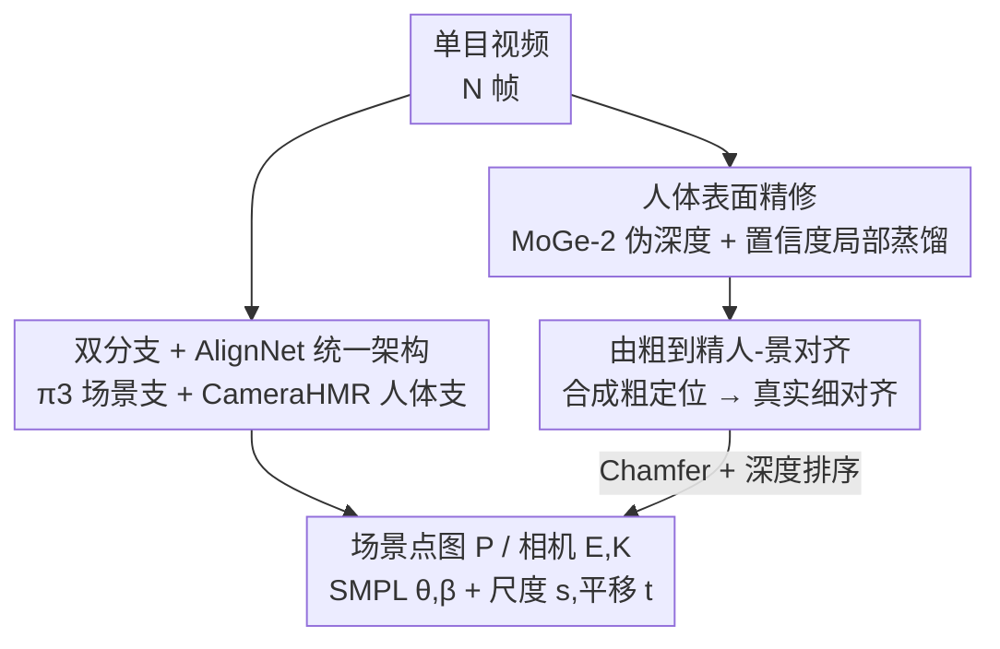

# UniSH: Unifying Scene and Human Reconstruction in a Feed-Forward Pass

**会议**: CVPR 2026  
**论文**: [CVF Open Access](https://openaccess.thecvf.com/content/CVPR2026/html/Li_UniSH_Unifying_Scene_and_Human_Reconstruction_in_a_Feed-Forward_Pass_CVPR_2026_paper.html)  
**代码**: 项目页 https://murphylmf.github.io/UniSH/（代码待确认）  
**领域**: 3D视觉 / 人体重建 / 前馈三维重建  
**关键词**: 场景-人体联合重建, 前馈, SMPL, 度量尺度对齐, sim-to-real

## 一句话总结
UniSH 用一个前馈网络从单目视频里同时吐出场景几何、相机参数和度量尺度的 SMPL 人体，靠"专家深度模型蒸馏 + 由粗到精的人-景对齐"把合成数据训练的先验迁移到真实野外视频，实现单次前向的场景+人体联合重建。

## 研究背景与动机

**领域现状**：3D 场景重建（DUSt3R/VGGT/π3 这条 "3R" 前馈线）和人体网格恢复（HMR，如 CameraHMR）这两条线长期各做各的——前者只管静态场景几何+相机，后者只管人体姿态形状，谁也不管"人到底站在场景的哪个绝对位置上"。

**现有痛点**：要把两者拼起来做"人在场景中"的联合 4D 重建，目前要么走优化路线（HSfM、JOSH、SyncHMR），每个场景都要逐场景优化，慢得没法用；要么像 JOSH3R 那样在场景骨干上挂个人体跟踪头做成前馈，但它用两帧推理，会累积漂移、全局不一致，而且训练时需要昂贵的 3D 标注。

**核心矛盾**：真正卡脖子的不是网络结构，而是**数据**。同时带"3D 场景 + 人体运动 + 相机参数"标注的大规模真实数据几乎不存在，逼得大家只能用 BEDLAM 这种合成数据训练。但合成数据场景多样性太差、且存在严重的 sim-to-real 域差——直接迁到野外视频会出现场景质量崩、人体表面糊、SMPL 和场景对不齐三宗罪。

**本文目标**：做一个单次前向就能联合输出"高保真场景点云 + 相机 + 度量尺度且与场景对齐的 SMPL 人体"的模型，关键是要能**吃无标注的真实野外视频**来跨越域差。

**切入角度**：不从零训，而是站在两个已经很强的预训练先验肩膀上——场景用 π3、人体用 CameraHMR——然后专门设计一套训练范式去"对齐+精修"这两套异构先验，让无标注真实数据也能用起来。

**核心 idea**：用一个轻量 AlignNet 把两支强先验融合成统一的度量尺度输出；再用"专家深度模型蒸馏精修人体表面 + 由粗到精的人-景几何对齐"这套训练范式，靠无标注真实视频补上合成数据填不了的窟窿。

## 方法详解

### 整体框架
UniSH 输入一段 $N$ 帧单目视频 $I=\{I_i\}_{i=1}^N$，单次前向输出每帧的度量尺度点图 $P=\{P_i\}$（人体与场景共用一张点图）、相机外参 $E=\{[R_i|T_i]\}$ 与内参 $K$，以及每帧相机系下的 SMPL 姿态 $\theta_i$、平移 $t_i$ 和一组跨帧共享的体型 $\beta$。

整个网络由三块组成：**场景重建分支**（借 π3 先验，出场景几何+相机+置信度）、**人体分支**（借 CameraHMR 先验，出每帧姿态与共享体型）、以及把两支特征融合的 **AlignNet**（预测全局尺度 $s$ 和每帧 SMPL 平移 $t_i$，把人放进度量场景里）。但光有这个架构还训不出来——真正让它能跑通野外视频的是后面两套训练范式：先用专家深度蒸馏把人体表面精修出细节（Stage 1），再用由粗到精的对齐把 SMPL 钉到场景正确位置（Stage 2/3）。

### 关键设计

**1. 双分支 + AlignNet 统一架构：一次前向同时出场景和度量尺度人体**

要联合重建，最直接的想法是让场景分支直接被合成数据监督去预测"度量尺度几何 + SMPL 位置"。但作者发现这么干会**摧毁 π3 预训练先验**，且因为 sim-to-real 域差在野外视频上泛化极差（消融图 5a）。UniSH 的做法是把"绝对尺度"这个最依赖标注、最容易过拟合合成数据的部分单独剥离出来，交给一个轻量两层 transformer 解码器 AlignNet 去学，从而保住两支主干的强先验。

具体地，场景支用 π3 架构：图像编码器+跨帧编码器抽出统一几何特征 $F_{geo}$，再经三个解码器分别出相机 $E$、点图 $P$、置信度 $C$，内参 $K$ 从点图反解。人体支用 CameraHMR：先用现成检测器抠出人体框 $b_i$，连同由 $K_i$ 推出的焦距一起喂进去，得到每帧姿态 $\theta_i$ 和共享体型 $\beta$。AlignNet 把 $F_{geo}$ 当 key-value，把"可学习尺度 token $T_s$ + 每帧 HMR token $F_{hmr}$"拼成 query，回归出全局尺度和每帧平移：

$$(s, T) = \text{AlignNet}(F_{geo},\ [T_s|F_{hmr}])$$

这样人体就被放进了度量尺度场景里，且全局一致——不像 JOSH3R 那样两帧推理累积漂移。

**2. 人体表面精修：用专家深度模型的高频细节蒸馏出清晰人体几何**

通用场景重建模型在人身上往往糊成一团，因为它们没专门为人体优化过。一个朴素思路是拿合成数据（BEDLAM）用原始训练目标微调场景支，但作者实测这反而**有害**——域差会拖垮真实输入上的表现、破坏预训练结构先验。

UniSH 改走可扩展路线：自建一个大规模无标注野外人体视频集，用 SOTA 单目深度估计器 MoGe-2 生成伪深度标签。但伪深度直接拿来监督不行——逐帧深度没有时序一致性、全局尺度乱跳、人体边界和背景处噪声大。于是作者提出**置信度感知的局部人体损失**：在 SAM2 给出的前景人体 mask $M_i$ 上采 $K$ 个锚点，每个锚点 $X_k$ 取阈值 $\tau$ 内的邻域 $N_k=\{X_k^j\mid \|X_k^j-X_k\|_2\le\tau\}$；为消除单目深度固有的局部尺度/平移歧义，对每个局部块用 ROE Solver 估一对最优 $(s_k,t_k)$ 把模型预测对齐到伪深度，再算置信度加权的 L1：

$$L_{h,i} = \frac{1}{K}\sum_{k=1}^{K}\left(\frac{1}{|N_k|}\sum_{j=1}^{|N_k|} C_k^j\cdot \left|(s_k\cdot \hat D_k^j + t_k) - D_k^j\right|\right)$$

为防灾难性遗忘，再加一项正则 $L_{preg}$ 罚预测点图偏离原始预训练输出 $P_i^{orig}$，Stage 1 总损失为 $L_{stage1}=\frac{1}{N}\sum_i(\lambda_h L_{h,i}+\lambda_{preg}\|P_i-P_i^{orig}\|_1)$。这一阶段只训点图解码器、冻住其余参数。妙在它**只精修可见人体表面**、且只蒸"高频局部细节"而非全局深度，绕开了伪深度全局尺度不可靠的硬伤。

**3. 由粗到精的人-景对齐：先合成粗定位，再用真实数据细对齐 SMPL 与场景**

只用合成数据学尺度和 SMPL 平移，野外泛化照样差（图 5b）。UniSH 设计了由粗到精两阶段对齐。**粗对齐（Stage 2）**用合成 BEDLAM 学初始定位：用 ROE Solver 估全局最优尺度 $s_{opt}$，把预测平移监督到真值，损失 $L_{smpl,i}$ 综合顶点、3D/2D 关键点、姿态、体型、平移多项 HMR 监督（2D 点由 $J_{2d,i}=\Pi(K_i,J_{3d,i})$ 投影得到），整阶段还直接监督全局尺度 $L_{stage2}=\frac{\lambda_{smpl}}{N}\sum_i L_{smpl,i}+\lambda_{scale}\|s-s_{opt}\|_1$。这步冻住已精修的场景支，只训人体支和 AlignNet——它的作用是给出一个稳定的初始 SMPL 摆放，因为下一阶段要靠 SMPL 投影。

**细对齐（Stage 3）**才是跨域差的关键：在无标注真实数据上，直接最小化预测 SMPL 网格与重建人体点云之间的几何误差。先用可微渲染器拿到 SMPL 可见性 mask $M_{vis,i}$，源点云取可见顶点 $V_{src,i}=V_{smpl,i}[M_{vis,i}]$；目标点云由重建几何缩放并用 SAM2 mask 过滤得到 $V_{tgt,i}=(s\cdot P_i)[M_i]$。主对齐损失是从可见 SMPL 顶点到目标点云的单向 Chamfer 距离 $L_{align,i}=\sum_{v_{src}}\min_{v_{tgt}}\|v_{src}-v_{tgt}\|_2^2$。再加一项**深度排序正则** $L_{dreg,i}=\mathrm{ReLU}(\bar d_{tgt,i}-\bar d_{src,i})$，强制"重建人体点云应更靠近相机、不该被 SMPL 网格遮挡"这一物理先验。Stage 3 只用真实数据微调 AlignNet，总损失 $L_{stage3}=\frac{1}{N}\sum_i(\lambda_{align}L_{align,i}+\lambda_{depth}L_{dreg,i}+\lambda_{j2d}L_{j2d,i})$，其中 2D 重投影损失用预训练 CameraHMR 的伪标注监督。靠真实数据上的几何对应直接优化，SMPL 终于能稳稳钉在野外场景的正确位置。

### 损失函数 / 训练策略
三阶段串行训练：Stage 1 只训点图解码器做表面精修（$L_{stage1}$）；Stage 2 冻场景支、训人体支+AlignNet 在 BEDLAM 上做粗对齐（$L_{stage2}$）；Stage 3 只训 AlignNet 在无标注真实数据上做细对齐（$L_{stage3}$）。逐级解冻、逐级缩小可训练范围，既保住强先验又渐进引入真实数据监督。

## 实验关键数据

### 主实验

人体中心视频深度估计（Bonn 数据集，衡量场景重建质量）：

| 方法 | Abs Rel ↓ | δ<1.25 ↑ | 说明 |
|------|-----------|----------|------|
| VGGT | 0.057 | 0.966 | 强前馈重建基线 |
| π3 | 0.049 | 0.975 | UniSH 的场景先验来源 |
| MonST3R | 0.072 | 0.957 | 动态场景重建 |
| **UniSH (Ours)** | **0.035** | **0.980** | 显著超过所有重建基线 |

全局人体运动估计（EMDB-2 / RICH，关节误差 mm，越小越好）：

| 方法 | 前馈 | 重建场景 | EMDB-2 WA-MPJPE ↓ | EMDB-2 W-MPJPE ↓ | EMDB-2 RTE% ↓ |
|------|------|----------|-------------------|------------------|---------------|
| JOSH | ✗(优化) | ✓ | 68.9 | 174.7 | 1.3 |
| GVHMR | ✓ | ✗ | 111.0 | 276.5 | 2.0 |
| WHAM | ✓ | ✗ | 135.6 | 334.8 | 6.0 |
| JOSH3R | ✓ | ✓ | 220.0 | 661.7 | 13.1 |
| **UniSH (Ours)** | ✓ | ✓ | **118.5** | **270.1** | **5.8** |

UniSH 是表中**唯一同时做到"前馈 + 联合重建场景"**的方法：相比同类前馈联合基线 JOSH3R，三项指标全面大幅领先（W-MPJPE 661.7→270.1）；相比那些不重建场景的专用 HMR 方法（GVHMR/WHAM）也很有竞争力，仅落后于昂贵的优化方法 JOSH。

### 消融实验

人体表面精修策略（Bonn 数据集）：

| 训练数据 | Abs Rel ↓ | δ<1.25 ↑ | 说明 |
|----------|-----------|----------|------|
| No Refinement (π3) | 0.049 | 0.975 | 不精修的基线 |
| BEDLAM | 0.062 | 0.960 | 合成 GT 微调，反而变差 |
| BEDLAM + Real | 0.051 | 0.968 | 混合训练仍不如基线 |
| **Real (Ours)** | **0.035** | **0.980** | 仅用无标注真实数据 + 蒸馏损失，最佳 |

Pipeline 设计（图 5 定性消融）：(a) 让场景支直接被监督预测度量尺度 → 摧毁 π3 先验、重建崩、野外拿不到度量尺度；(b) 只做合成粗对齐 → 域差导致 SMPL 与场景对不齐；(c) 完整由粗到精 → 用真实数据细对齐解决，人-景对齐稳健。

### 关键发现
- **合成数据微调反而有害**：BEDLAM 微调把 Abs Rel 从 0.049 拉差到 0.062，混合训练 0.051 也不如不练——印证 sim-to-real 域差是核心瓶颈，无标注真实数据 + 蒸馏才是解药。
- **尺度预测必须解耦**：直接让场景支学度量尺度会破坏强结构先验，把这一职责剥给轻量 AlignNet 才能两全。
- **细对齐阶段不可省**：只做合成粗对齐在野外视频上 SMPL 与场景脱节，Stage 3 用真实点云-网格几何对应才把人钉到正确位置。
- **可解释的权衡**：UniSH 在纯运动指标上不如专用 HMR，但它额外重建了场景且只靠弱监督，作者把这视为预期内的 trade-off。

## 亮点与洞察
- **"剥离绝对尺度"的设计很巧**：把最依赖标注、最易过拟合合成数据的"度量尺度"单独交给轻量 AlignNet，主干强先验得以保全——这个"哪部分该单独学"的拆分思路可迁移到很多"强先验 + 弱标注"的任务。
- **用无标注真实数据跨域差是真正的贡献点**：不是改网络，而是设计了一套"专家蒸馏 + 由粗到精对齐"的训练范式让野外视频也能用，绕开了联合标注数据稀缺这个死结。
- **局部块 + ROE Solver 蒸馏深度细节**：通过局部对齐消除单目深度的尺度/平移歧义、只蒸高频细节，是把"不可靠伪标签"榨出有用监督的可复用技巧。
- **深度排序正则编码物理先验**：用一个 ReLU 项强制"人体点云该比 SMPL 网格更靠相机、不被遮挡"，把朴素的几何常识变成可微约束，简单但有效。

## 局限与展望
- **非参数人体几何仍有伪影**：作者承认重建的人体表面会出现 floater 等瑕疵，未来可用对齐好的 SMPL 当几何先验反过来正则化/精修人体表面。
- **依赖一串外部专家模型**：MoGe-2（伪深度）、SAM2（人体 mask）、现成人体检测器、CameraHMR（2D 伪标注）缺一不可，整条管线的上限被这些模型的质量牵制，误差也会传导。
- **纯运动精度落后专用方法**：在 WA-MPJPE 等指标上不如 GVHMR/WHAM 和优化式 JOSH，联合重建是以牺牲单任务精度换来的，需要场景几何时才划算。
- **三阶段训练较重**：逐级解冻、各阶段冻不同模块，训练流程和超参（多个 $\lambda$）较多，复现成本不低。

## 相关工作与启发
- **vs JOSH3R（同类前馈联合重建）**：JOSH3R 在场景骨干上挂人体跟踪头、用两帧推理，会累积漂移和全局不一致；UniSH 用统一架构 + AlignNet 单次前向出全局一致结果，三项运动指标全面大幅领先。
- **vs JOSH / SyncHMR（优化式联合重建）**：它们逐场景优化、慢；UniSH 是前馈，速度优势明显，精度上 UniSH 略逊 JOSH 但换来了无需逐场景优化。
- **vs π3 / VGGT（纯场景重建）**：它们不管人、人体表面糊；UniSH 在其先验上加人体精修，Bonn 深度估计反超 π3（0.049→0.035）。
- **vs GVHMR / WHAM（纯 HMR）**：它们运动精度高但不重建场景；UniSH 牺牲一点运动精度换来场景+人体的联合重建，且主要靠无标注弱监督训练。

## 评分
- 新颖性: ⭐⭐⭐⭐ 用无标注真实数据 + 专家蒸馏 + 由粗到精对齐跨越 sim-to-real 域差的训练范式有新意，架构本身是融合既有先验。
- 实验充分度: ⭐⭐⭐⭐ 场景重建 SOTA、运动估计有竞争力，消融清楚地论证了各设计的必要性，但缺代码与更多野外定量评测。
- 写作质量: ⭐⭐⭐⭐ 动机-痛点-方案逻辑清晰，公式完整；三阶段训练细节稍密。
- 价值: ⭐⭐⭐⭐ 单次前向联合重建场景+度量尺度人体对 AR/VR、具身智能有实用价值，"剥离尺度 + 弱监督跨域"思路可迁移。

<!-- RELATED:START -->

## 相关论文

- [\[CVPR 2026\] Coherent Human-Scene Reconstruction from Multi-Person Multi-View Video in a Single Pass](coherent_humanscene_reconstruction_from_multiperso.md)
- [\[CVPR 2026\] PanoVGGT: Feed-Forward 3D Reconstruction from Panoramic Imagery](panovggt_feed-forward_3d_reconstruction_from_panoramic_imagery.md)
- [\[CVPR 2026\] MoRe: Motion-aware Feed-forward 4D Reconstruction Transformer](more_motion-aware_feed-forward_4d_reconstruction_transformer.md)
- [\[CVPR 2026\] VGG-T3: Offline Feed-Forward 3D Reconstruction at Scale](vgg-t3_offline_feed-forward_3d_reconstruction_at_scale.md)
- [\[CVPR 2026\] AMB3R: Accurate Feed-forward Metric-scale 3D Reconstruction with Backend](amb3r_accurate_feed-forward_metric-scale_3d_reconstruction_with_backend.md)

<!-- RELATED:END -->
