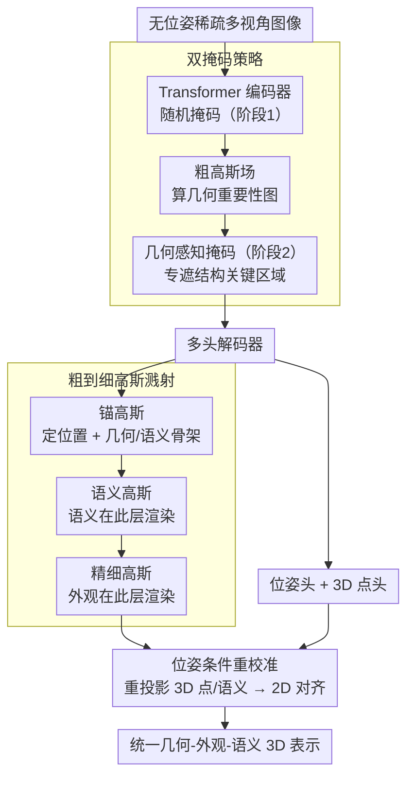

# UniSplat: Learning 3D Representations for Spatial Intelligence from Unposed Multi-View Images

**会议**: CVPR 2026  
**arXiv**: [2604.10573](https://arxiv.org/abs/2604.10573)  
**代码**: [https://bobochow.github.io/UniSplat](https://bobochow.github.io/UniSplat)  
**领域**: 3D视觉  
**关键词**: 3D表示学习, 空间智能, 高斯溅射, 自监督学习, 无位姿多视角

## 一句话总结
UniSplat 通过双掩码策略、粗到细高斯溅射和位姿条件重校准三个组件，从无位姿多视角图像中学习统一的几何-外观-语义 3D 表示，为空间智能奠定感知基础。

## 研究背景与动机

**领域现状**：3D 表示学习正从监督方法（需要标定位姿）向自监督方法（直接从原始多视角图像学习）发展，但现有自监督方法普遍存在几何感知弱、外观细节不足、几何-语义不一致的问题。

**现有痛点**：(1) 掩码自编码等方法缺乏严格的全局 3D 一致性；(2) 新视角合成方法假设已知位姿或依赖密集视频；(3) 无位姿方法虽然联合估计相机和场景，但三个维度耦合不够。

**核心矛盾**：几何、外观和语义各有不同的最优粒度——语义天然粗粒度而外观需要细粒度——直接统一学习会导致互相干扰。

**本文目标**：设计一个前馈框架，从无位姿稀疏多视角图像中统一学习几何、外观和语义表示。

**核心 idea**：用三个互补机制分别解决几何感知（双掩码）、外观精度（粗到细溅射）和一致性（位姿重校准）问题。

## 方法详解

### 整体框架
UniSplat 要解决的是一个很拧巴的任务：只给几张没有位姿标定的稀疏多视角图像，就要同时把场景的几何、外观、语义都学出来，还得保证三者互相自洽。它的做法是一条前馈管线——多视角图像先送进一个带掩码的 Transformer 编码器抽特征，再由多头解码器分别预测点云、语义和外观；这些预测不是直接输出，而是先组装成一个**由粗到细的三级高斯场**去做可微渲染，最后用位姿头估计出的相机参数把各个头的预测互相重投影对齐。整条链路里有三个关键机关：让编码器真正"看懂"几何的双掩码、协调语义与外观粒度的粗到细溅射、以及把几何和语义拴在一起的位姿重校准。

### 关键设计

**1. 双掩码策略：逼编码器学 3D 推理，而不是补纹理**

自监督方法常用随机掩码训练，但随机遮的位置很可能是无关紧要的背景，模型靠局部纹理就能补回来，根本没学到 3D 结构。UniSplat 把掩码拆成两步：第一步在编码器侧用随机掩码遮一部分 token，先抽出一版初步特征并溅射出一个粗高斯场；第二步从这个粗高斯场算出一张重要性图，专挑结构关键的区域（边缘、几何转折处）生成"几何感知掩码"，再去遮解码器侧的 token。这样解码器拿到的证据是被刻意抠掉关键结构的，它只能靠跨视角的几何关系把缺失部分推理出来，而不是抄旁边的纹理。两阶段的区别就在于：随机掩码遮的是哪儿全凭运气，几何引导掩码遮的是模型最需要理解的地方。

**2. 粗到细高斯溅射：把语义和外观放在各自合适的粒度上渲染**

几何、外观、语义如果硬塞进同一层高斯一起优化会互相打架——语义天然是物体级的粗粒度信号，外观却要细到纹理级，混在一起两边都学不好。UniSplat 用三级层次的高斯场把它们错开：最上层是**锚高斯**，只带位置和几何/语义特征，定下场景的骨架；中间层是**语义高斯**，在锚点上加偏移、附上粗外观和语义，语义就在这一层渲染输出；最底层是**精细高斯**，从 2D 特征图上采样把高频细节注进去，外观在这最细的一层渲染。换句话说，语义在较粗的层级出图、外观在最细的层级出图，各取所需，不再为了照顾对方而妥协。比如一面砖墙，语义层只需知道"这是墙"这种物体级判断，精细层才去补每块砖的纹理高频，两者落在不同层级就不会互相干扰。

**3. 位姿条件重校准：用重投影把几何和语义拴在一起**

多头解码常见的毛病是各头各干各的——点云头和语义头独立输出，没人保证它们说的是同一个 3D 世界，结果几何和语义可能自相矛盾。UniSplat 借位姿头估计出的相机参数补上这个约束：把 3D 点云头和语义头的预测按估计位姿重投影回 2D 图像平面，再和对应的 RGB、语义预测对齐，差异作为重投影一致性损失回传。位姿在这里既是被估计的目标，又顺势变成了把各头预测锚到同一坐标系的桥梁，于是几何与语义被强制对齐，而这一切不需要任何额外标注。

### 损失函数 / 训练策略
训练同时用自监督信号和知识蒸馏：新视角合成的光度损失约束外观，3D 点云蒸馏损失（教师为 DUSt3R / VGGT）和语义特征蒸馏损失（教师为 DINOv2 / SigLIP）分别监督几何与语义，再加上前面的重投影一致性损失把各头拴在一起。

## 实验关键数据

### 主实验

| 任务 | 数据集 | 指标 | UniSplat | 之前SOTA |
|------|--------|------|----------|----------|
| 新视角合成 | RealEstate10K | PSNR | 竞争性 | SelfSplat |
| 相机位姿估计 | CO3Dv2 | RTE | 改进 | RayZer |
| 深度估计 | ScanNet | Abs Rel | 改进 | 基线 |

### 消融实验

| 配置 | 关键指标 | 说明 |
|------|---------|------|
| Full model | 最优 | 完整模型 |
| w/o 双掩码 | 下降 | 几何感知能力减弱 |
| w/o 粗到细 | 下降 | 外观-语义不一致加剧 |
| w/o 重校准 | 下降 | 跨任务一致性变差 |

### 关键发现
- 三个组件相互补充，任何一个的缺失都导致性能下降
- 几何引导掩码比随机掩码更有效地增强了 3D 推理能力
- 统一表示在下游任务（导航、操作）上表现出良好泛化

## 亮点与洞察
- **粒度解耦**：粗到细策略巧妙地解决了语义和外观的粒度矛盾，这个思路可迁移到其他多任务 3D 学习
- **重投影作为自然对齐**：利用估计的位姿做跨头一致性约束，既不需要额外标注又提供了强监督信号

## 局限与展望
- 依赖知识蒸馏的教师模型质量
- 计算开销较大（多头解码器+多层高斯）
- 未来可探索更轻量的架构和更大规模的预训练

## 相关工作与启发
- **vs RayZer**: RayZer 用隐式渲染器，UniSplat 用显式高斯溅射提供更好的可解释性
- **vs SelfSplat**: SelfSplat 深度和位姿模块分离，UniSplat 通过重校准实现更紧耦合

## 评分
- 新颖性: ⭐⭐⭐⭐ 三个组件的协同设计有新意但每个单独看并不全新
- 实验充分度: ⭐⭐⭐⭐ 多任务评估全面
- 写作质量: ⭐⭐⭐⭐ 框架描述清晰
- 价值: ⭐⭐⭐⭐ 为空间智能的感知基础提供了实用方案

<!-- RELATED:START -->

## 相关论文

- [\[CVPR 2026\] Learning Multi-View Spatial Reasoning from Cross-View Relations](learning_multi-view_spatial_reasoning_from_cross-view_relations.md)
- [\[CVPR 2026\] BRepGaussian: CAD Reconstruction from Multi-View Images with Gaussian Splatting](brepgaussian_cad_reconstruction_from_multi-view_images_with_gaussian_splatting.md)
- [\[ICCV 2025\] Towards Scalable Spatial Intelligence via 2D-to-3D Data Lifting](../../ICCV2025/3d_vision/towards_scalable_spatial_intelligence_via_2d-to-3d_data_lifting.md)
- [\[NeurIPS 2025\] Concerto: Joint 2D-3D Self-Supervised Learning Emerges Spatial Representations](../../NeurIPS2025/3d_vision/concerto_joint_2d-3d_self-supervised_learning_emerges_spatial_representations.md)
- [\[ICLR 2026\] UFO-4D: Unposed Feedforward 4D Reconstruction from Two Images](../../ICLR2026/3d_vision/ufo-4d_unposed_feedforward_4d_reconstruction_from_two_images.md)

<!-- RELATED:END -->
