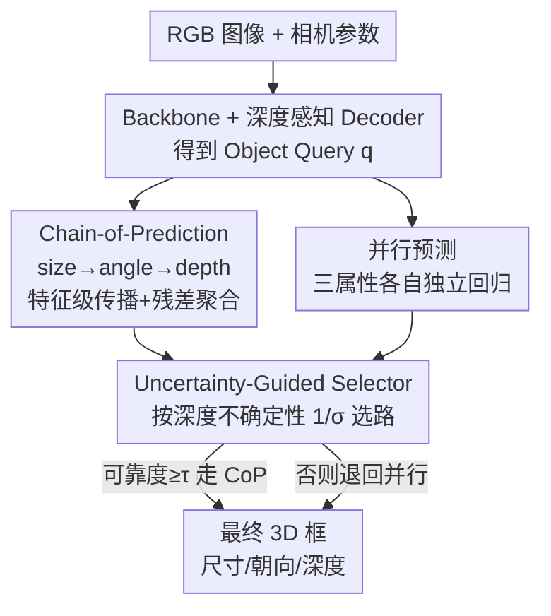

# Unleashing the Power of Chain-of-Prediction for Monocular 3D Object Detection

**会议**: CVPR 2026  
**论文**: [CVF Open Access](https://openaccess.thecvf.com/content/CVPR2026/html/Zhang_Unleashing_the_Power_of_Chain-of-Prediction_for_Monocular_3D_Object_Detection_CVPR_2026_paper.html)  
**代码**: https://github.com/alanzhangcs/MonoCoP  
**领域**: 3D视觉 / 单目3D检测  
**关键词**: 单目3D检测, 属性相关性, 链式预测, 不确定性路由, 深度估计

## 一句话总结
MonoCoP 把单目 3D 检测里互相耦合的尺寸/朝向/深度三个属性，从"各自并行预测"改成**特征层面的链式预测**（size→orientation→depth 逐级传播再残差聚合），并用一个**按深度不确定性动态切换链式/并行**的选择器，让 KITTI、nuScenes、Waymo 上的 3D 检测尤其是远处目标显著涨点。

## 研究背景与动机
**领域现状**：单目 3D 检测（Mono3D）只用一张 RGB 图就要推断物体的 3D 尺寸 $s=(w,h,l)$、朝向 $\omega$ 和深度 $z_c$。由于没有 LiDAR/双目这类深度传感器，3D→2D 投影本身带来深度歧义，所以深度估计一直是这个任务的核心瓶颈。主流做法（MonoDETR、MonoDGP 等）把这几个 3D 属性用各自的预测头**并行**回归出来。

**现有痛点**：并行预测把每个属性当成相互独立的量，忽略了它们其实是通过同一套投影几何**耦合**在一起的——同样大小的 2D 框，可能是"近处小车"也可能是"远处大车"；同一辆车换个朝向，2D 上的视尺寸也会变。也就是说，多种 3D 配置会投出几乎一样的 2D 外观，孤立地估其中一个属性必然是欠定的。

**核心矛盾**：既然属性相关，最直白的补救是**序列化预测**（autoregressive）：先估尺寸，再用尺寸条件估朝向，再用朝向条件估深度。但作者指出，传统序列预测是在**输出值层面**条件化的，一旦前一步估错（尤其遮挡/截断目标的尺寸、朝向本就不准），误差会沿链条放大，反而把深度搞得更糟。于是出现一个两难：并行预测丢掉了属性相关性，刚性序列预测又会累积误差，**两者都不是最优**。更关键的是——建模相关性带来的收益**因目标而异**：清晰可见的目标用并行就够了，遮挡/模糊目标才真正需要相关性。

**本文目标**：(1) 在保留属性相关性的同时避免序列预测的误差累积；(2) 让模型自己决定**什么时候**该用相关性、**什么时候**该退回独立预测。

**核心 idea**：把"序列条件化"从输出层搬到**特征层**——即 Chain-of-Prediction（CoP），逐级学习、传播、聚合各属性专属特征，在单次前向里联合优化，从源头削弱误差累积；再加一个 **Uncertainty-Guided Selector（GS）**，按每个目标的深度不确定性在 CoP 与并行两条路之间动态选最可靠的那条。

## 方法详解

### 整体框架
MonoCoP 建立在 DETR 风格的单目检测器（沿用 MonoDETR / MonoDGP 的骨干、深度感知 decoder、视觉编码器）之上：图像经 backbone + 深度感知 decoder 得到一批 object query，每个 query 要输出类别、2D 框、3D 尺寸、朝向、深度。类别与 2D 框走常规并行头；真正改动的是**3D 属性（size / angle / depth）这三个头**。

对这三个属性，MonoCoP 同时维护**两条通路**：一条是新提的 **Chain-of-Prediction（CoP）**，让 size 的特征流向 angle、再流向 depth，逐级传播并残差聚合；另一条是传统的**并行预测**，三个属性互不依赖各自回归。两条路对同一个 query 都会算出结果，最后由 **Uncertainty-Guided Selector（GS）** 根据该目标预测出的深度不确定性，挑出更可信的一条作为最终输出。直觉是：当属性相关性能被高置信地估出来时走 CoP（吃相关性红利），当不确定性高、相关性反而可能传毒时退回并行（保独立性）。

### 关键设计

**1. Chain-of-Prediction（CoP）：把属性相关性从输出层搬到特征层，用三段式特征流取代输出值条件化**

针对"并行丢相关性、序列条件化又累积误差"这个核心矛盾，CoP 不在预测出来的数值上做条件化，而是在**特征**上做。它分三步走：

- **Feature Learning（特征学习）**：先用一个轻量的 AttributeNet（AN）从 object query $q$ 里抽出三个属性专属特征。每个子模块就是两层带激活的 MLP：$A(q)=\sigma(qW_1)W_2$，分别得到 $f_s=A_s(q),\ f_a=A_a(q),\ f_d=A_d(q)$。
- **Feature Propagation（特征传播）**：此时三个特征还彼此独立，CoP 把它们串成一条链，让前一个属性的特征去**指导**下一个属性的预测，形成 $f_s=A_s(q),\ f_a=A_a(f_s),\ f_d=A_d(f_a)$。预测顺序固定为 **3D 尺寸 → 朝向 → 深度**，因为这三者所需的空间理解逐级加深：尺寸只看物体范围，朝向要推 3D 旋转，深度则需要最完整的空间上下文。
- **Feature Aggregation（特征聚合）**：纯链式传播仍会"特征遗忘"和误差累积，于是每一步引入残差聚合，把当前预测特征与它的输入相加：

$$\tilde f_s = A_s(q)+q,\quad \tilde f_a = A_a(\tilde f_s)+\tilde f_s,\quad \tilde f_d = A_d(\tilde f_a)+\tilde f_a.$$

这样深度那一步能直接看到尺寸、朝向乃至原始 query 的全部信息，而不是只接收上一跳被压缩过的结果。和传统在输出值上条件化的序列预测相比，特征层 + 残差聚合让整条链能在单次前向里**联合优化**，误差不再像数值条件化那样逐级单向放大——这正是 CoP 区别于以往点云序列检测（在输出层做相关性）的关键。

**2. Uncertainty-Guided Selector（GS）：用深度不确定性给每个目标动态选"链式 or 并行"，规避不可靠的相关性传播**

CoP 强化了相关性建模，但相关性的可靠程度**因目标而异**：遮挡/缺乏清晰线索的目标，其朝向、尺寸本就估不准，此时硬走链式只会让深度跟着崩。GS 的作用就是让"固定走链式"变成"逐目标自适应"。

它先做**不确定性估计**：假设预测深度 $\hat z$ 服从以真值 $z^*$ 为中心、尺度为 $\sigma$ 的 Laplace 分布 $p(z^*\mid\hat z,\sigma)=\frac{1}{2\sigma}\exp(-\frac{|z^*-\hat z|}{\sigma})$，最小化负对数似然得到深度损失

$$\mathcal L_{depth}=\sqrt{2}\,e^{-\log\sigma}\,|\hat z - z^*| + \log\sigma,$$

让模型在回归深度的同时吐出一个表征置信度的 $\sigma$。再做**选路**：把可靠度定义为不确定性的倒数 $r=1/\sigma$，CoP 通路给出可靠度 $\tilde r(\text{CoP})$，并设一个阈值超参 $\tau$：

$$b^*=\begin{cases}\text{CoP}, & \tilde r(\text{CoP})\ge\tau\\ \text{Par}, & \text{otherwise}\end{cases}$$

即相关性能高置信估出时走链式吃红利，不确定性高时退回并行避免传毒。消融显示 GS 的路由准确率达 82.18%，逼近用真值选路的 oracle（100%），远超随机选路（50%）——说明"深度不确定性"确实是判断该不该信相关性的有效信号。

## 实验关键数据

### 主实验
KITTI Val/Test（IoU3D ≥ 0.7，Car，单位 AP），MonoCoP 在不使用任何额外数据（LiDAR/深度）的前提下全面 SoTA，甚至超过用了额外数据的方法：

| 数据集/设置 | 指标 | 本文 MonoCoP | 之前最好（MonoDGP, CVPR25） | 提升 |
|------|------|------|----------|------|
| KITTI Val | AP3D Easy/Mod/Hard | 32.06 / 23.98 / 20.64 | 30.76 / 22.34 / 19.02 | +1.30 / +1.64 / +1.62 |
| KITTI Val | APBEV Easy/Mod/Hard | 42.20 / 31.29 / 27.58 | 39.40 / 28.20 / 24.42 | +2.80 / +3.09 / +3.16 |
| KITTI Test | AP3D Easy | 27.54 | 26.35 | +1.19 |
| nuScenes Val | AP3D Mod (IoU 0.7) | 9.71 | 8.78 | +0.93 |
| Waymo Val L1 | APH3D All (IoU 0.5) | 11.65 | 10.06 | +1.59 |

MAE 分距离段分析（Fig. 4）显示，相比并行预测的 MonoDETR/MonoDGP，MonoCoP 在所有距离段误差都更低，且**越远的目标（深度歧义越严重）提升越明显**，印证了建模属性相关性主要补的是远处深度。

### 消融实验
| 配置 | AP3D Mod (KITTI Val, IoU 0.7) | 说明 |
|------|---------|------|
| Baseline（并行） | 21.12 | 起点 |
| + CoP | 23.64 | 加链式预测 +2.52 |
| + CoP + GS（Full） | 23.98 | 再加不确定性选路，累计 +2.86 |

CoP 内部三段拆解与预测顺序：

| 维度 | 配置 | AP3D Easy/Mod/Hard | 结论 |
|------|------|------|------|
| CoP 组件 | 仅 FL | 29.67 / 21.74 / 18.23 | 单学特征收益小 |
| CoP 组件 | FL+FP | 29.33 / 22.22 / 19.26 | 加传播 Mod 涨 |
| CoP 组件 | FL+FP+FA | 32.06 / 23.98 / 20.64 | 残差聚合是关键 |
| 预测顺序 | z→s→ω | 30.54 / 22.54 / 19.37 | 逆几何依赖最差 |
| 预测顺序 | ω→s→z | 29.87 / 23.08 / 19.62 | 次优 |
| 预测顺序 | **s→ω→z** | 32.06 / 23.98 / 20.64 | 顺几何依赖最好 |

### 关键发现
- **残差聚合（FA）是 CoP 涨点的主力**：只有 FL+FP 时 Mod 仅 22.22，补上 FA 直接跳到 23.98，说明纯链式传播确实会"特征遗忘/误差累积"，残差把全部前置信息保留下来才是关键。
- **预测顺序必须顺着几何依赖**：s→ω→z（尺寸→朝向→深度，空间理解逐级加深）最优；把深度放最前面（z→s→ω）最差，验证了"深度需要最丰富空间线索、应放在链尾"的设计假设。
- **GS 主要救 Moderate/Hard**：Full 模型在 Easy 上相比仅 CoP 反而略降（清晰目标本就不需要切换），但在含遮挡/模糊目标的 Mod/Hard 上稳涨——GS 的价值正是在不确定场景下避免相关性传毒。
- **几乎零成本**：相比 MonoDGP，MonoCoP 仅 +3.60M 参数、+2.78 GFLOPs，却换来 +2.86 AP3D（21.12→23.98），得益于 AttributeNet 只是两层 MLP。

## 亮点与洞察
- **"特征层链式 vs 输出层链式"的区分很精准**：以往序列预测（含点云 3D 检测）在预测**数值**上条件化，天然单向且会累积误差；MonoCoP 把条件化挪到**特征**并加残差，使整条链可联合优化，这个迁移既简单又抓住了序列预测失败的根因。
- **用不确定性做"要不要信相关性"的开关**，而不是无脑全程序列化——把"建模相关性的收益因目标而异"这个观察直接落成可学习的路由，且 82% 路由准确率逼近 oracle，是很干净的自适应设计。
- 先用 Pearson 相关（深度-尺寸 r=0.35、深度-朝向 r=0.11）做实证、再用针孔投影对 $dz_c/d\omega\neq0$ 做解析推导来论证"属性几何耦合"，动机扎实，不是拍脑袋。
- 两个模块都是即插即用的轻量头，几乎不增成本，容易迁移到其它 DETR 式单目 3D 检测器上。

## 局限性 / 可改进方向
- **作者承认**：GS 的路由不保证每次都对（准确率 82%），Easy 集上引入 GS 会带来轻微掉点，说明对清晰目标切换机制有副作用。
- **相关性偏弱**：实测深度-朝向相关系数仅 0.11，属性耦合在统计上是"弱到中等"，CoP 的收益更多集中在远处/遮挡这类深度歧义大的子集，普适收益有限。
- 阈值 $\tau$ 是手设超参，论文未充分讨论其敏感性与跨数据集可迁移性；GS 只用深度不确定性一个信号选路，尺寸/朝向自身的不确定性没纳入。
- 预测顺序被硬编码为 s→ω→z，虽有几何依据但固定；是否存在按目标自适应的最优顺序、或更长的属性链，值得探索。

## 相关工作与启发
- **vs 并行预测（MonoDETR / MonoDGP）**: 它们把 size/angle/depth 用独立头并行回归，忽略投影耦合；MonoCoP 显式在特征层建模相关性并自适应选路，远处目标深度误差明显更低。
- **vs 传统序列/自回归预测（点云 3D 检测 [38,76]）**: 它们在预测**输出**上逐步条件化，易累积误差且无法跨属性联合优化；MonoCoP 把条件化下沉到**特征层**并加残差聚合，单次前向联合优化。
- **vs HTL [43] / CoOp [85] 等替代相关性建模**: 消融里 HTL（分阶段优化各属性）反而掉点、CoOp（为每属性学可学习 embedding）仅微涨，MonoCoP 明显优于两者（Mod 23.98 vs 21.23 / 18.42），说明"特征级链式 + 不确定性路由"比这些通用方案更契合 Mono3D 的几何结构。

## 评分
- 新颖性: ⭐⭐⭐⭐ 把序列条件化从输出层下沉到特征层 + 不确定性路由，角度新颖且有几何论证支撑
- 实验充分度: ⭐⭐⭐⭐⭐ KITTI/nuScenes/Waymo 三库 + 分距离 MAE + 组件/顺序/路由/backbone 全套消融，5 次跑取中位
- 写作质量: ⭐⭐⭐⭐ 动机—实证—解析—方法链条清晰，图示到位；个别记号偏密
- 价值: ⭐⭐⭐⭐ 几乎零成本即插即用、稳定涨点，对单目 3D 检测远处深度有实用意义

<!-- RELATED:START -->

## 相关论文

- [\[CVPR 2026\] Towards Intrinsic-Aware Monocular 3D Object Detection](towards_intrinsic-aware_monocular_3d_object_detection.md)
- [\[CVPR 2026\] MonoSAOD: Monocular 3D Object Detection with Sparsely Annotated Label](monosaod_monocular_3d_object_detection_with_sparsely_annotated_label.md)
- [\[CVPR 2026\] GeoSAM2: Unleashing the Power of SAM2 for 3D Part Segmentation](geosam2_unleashing_the_power_of_sam2_for_3d_part_segmentation.md)
- [\[CVPR 2026\] SPAN: Spatial-Projection Alignment for Monocular 3D Object Detection](span_spatial-projection_alignment_for_monocular_3d_object_detection.md)
- [\[CVPR 2026\] MSGNav: Unleashing the Power of Multi-modal 3D Scene Graph for Zero-Shot Embodied Navigation](msgnav_unleashing_the_power_of_multi-modal_3d_scene_graph_for_zero-shot_embodied.md)

<!-- RELATED:END -->
