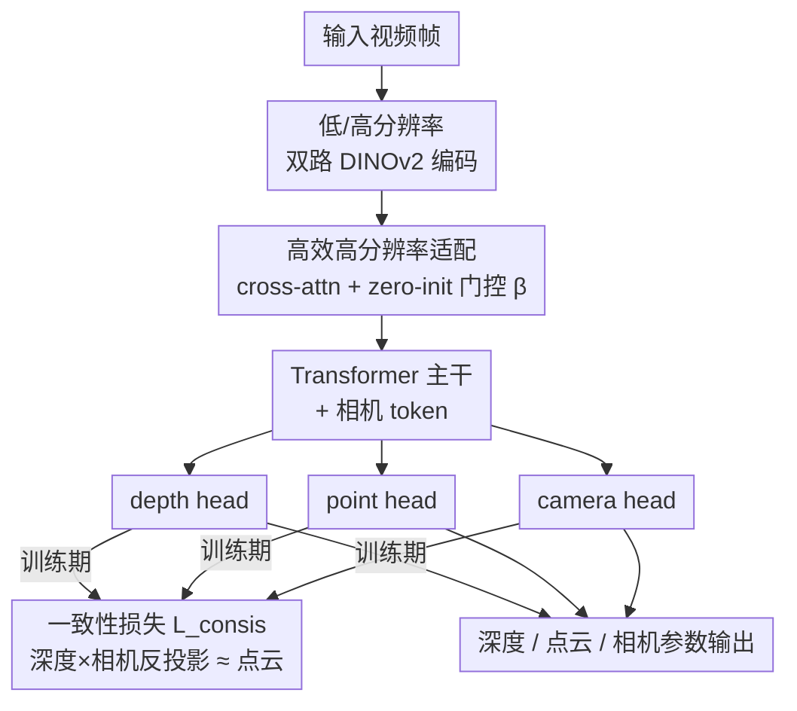

# Unlocking the Power of Critical Factors for 3D Visual Geometry Estimation

**会议**: CVPR 2026  
**arXiv**: [2604.21713](https://arxiv.org/abs/2604.21713)  
**代码**: https://github.com/aim-uofa/CARVE （有）  
**领域**: 3D视觉  
**关键词**: 前馈视觉几何估计、点云重建、视频深度、相机位姿、消融研究

## 一句话总结
本文用一套严格消融把前馈多帧视觉几何估计（以 VGGT 为代表）里"哪些训练因素真正决定性能"挖出来，发现常用的置信度损失和空间梯度损失其实在拖后腿、局部区域对齐会掉点，并据此提出一致性损失 + 高效高分辨率适配，整合成 CARVE 模型，在点云重建、视频深度、相机位姿三类任务的 7 个 benchmark 上取得领先且稳健的成绩。

## 研究背景与动机
**领域现状**：从单目视频恢复 3D 点云、相机参数和深度，目前有两条路线。优化派（SfM / MVS / SLAM）靠特征匹配最小化重投影误差，重建稀疏且依赖可靠对应点；学习派端到端回归 3D 属性，又分单帧方法（MoGe 等）和多帧方法（DUSt3R、VGGT、Pi3 等）。

**现有痛点**：一个反常的观察是——多帧方法虽然能看到跨帧信息、跨帧一致性更好，却在单帧精度上常常打不过强单帧方法。多帧方法主要赢在"时序一致"，单帧方法赢在"每一帧更准"。这种优势通常被笼统归因于"精心设计的训练目标、高分辨率输入、合理的训练课程"，但到底是哪个因素在起作用、起多大作用，没人系统量化过。

**核心矛盾**：性能提升被一堆"看起来合理"的设计（可学习置信度加权、空间梯度损失、局部区域对齐、直接喂高分辨率）裹挟，但这些设计有的可能根本是负作用，只是从没被单独拆出来验证过。

**本文目标**：(1) 用严格消融把决定性能的关键因素逐个拆出来定量验证；(2) 把优化派的几何约束和高分辨率信息的优势，以低代价整合进前馈模型。

**切入角度**：直接在一个有代表性的多帧方法 VGGT 上做控制变量实验——固定其他一切，只改数据/损失/对齐/分辨率一个维度，看排名（Rank）怎么变。

**核心 idea**：与其堆"看起来高级"的损失，不如先搞清楚哪些设计真有用、哪些是反作用；据此用"固定 inverse-depth 权重 + 序列级/帧级对齐 + 几何一致性损失 + 高效高分辨率融合"重组训练配方，造出 CARVE。

## 方法详解

### 整体框架
论文分两步走。第一步是**诊断**：以 VGGT 为基线（DINOv2 编码器把图像 patch 成 token，连同可学习相机 token 送进 transformer，再用 depth/point/camera 三个 head 分别输出深度图 $\hat{0pt}\in\mathbb{R}^{T\times H\times W}$、世界坐标点图 $\hat{\mathbf{P}}\in\mathbb{R}^{T\times H\times W\times 3}$、相机参数 $\hat{\mathbf{g}}\in\mathbb{R}^{T\times 9}$=四元数+平移+视场角），冻结 ViT 只训其余部分，分别在数据、损失、分辨率三个维度做控制变量消融，用"全指标平均排名 Rank↓"量化每个因素的真实贡献。第二步是**改进**：把诊断出的好配方（更大更杂的数据、固定 inverse-depth 权重、序列级+帧级对齐）固化下来，再叠加两个新组件——几何一致性损失 $\mathcal{L}_{\text{consis}}$（训练期约束深度、相机、点云三者满足投影几何）和高效高分辨率适配模块（用 cross-attention 把高分辨率特征以残差形式融进低分辨率主干），整合成 CARVE。

下图是 CARVE 的推理架构与训练期约束（数据/损失加权这类训练配方选择不是图上的节点，属于训练设置）：

### 关键设计

**1. 三因素系统性消融：把"经验直觉"逐项证伪**

这是论文的诊断主体，针对"多帧方法优势被笼统归因、没人量化"这个痛点。作者在 VGGT 上固定其余变量，只动一个维度：① **数据**——从 Data1（仅高质量数据）→ Data2（增加多样性仍保质量）→ Data3（再掺入带噪数据），平均 Rank 从 2.50→2.25→1.00 单调变好，说明即便是 SOTA 模型、即便已大规模预训练，继续扩充数据的多样性和数量仍能解锁性能；带噪数据非但不拖累，反而有用。② **对齐策略**——损失计算前如何把预测对齐到 GT 很关键：在序列级全局尺度对齐基础上再加帧级 scale-shift 对齐（$\mathcal{L}_{\text{F}}$）能涨点，但再叠加局部 3D 球形区域对齐（$\mathcal{L}_{\text{S}}$，把点云切成半径 $r_j$ 的局部球各自对齐）反而掉点——局部对齐过度迁就局部、破坏了全局几何。这两条都是反直觉、却被消融钉死的结论。

**2. 反直觉的损失加权：固定 inverse-depth 权重取代可学习置信度 / 空间梯度**

针对痛点：VGGT 沿用的可学习置信度损失 $\mathcal{L}_{\text{conf}}(\mathbf{W})=\mathbb{E}_{p\in\mathcal{M}}|-\alpha\log\mathbf{W}_p|$ 和空间梯度损失 $\mathcal{L}_{\text{sg}}$ 看似合理，实则有害。作者发现：$\mathcal{L}_{\text{sg}}$ 过度关注局部邻域像素差异，牺牲了整体精度；可学习置信度更糟——模型会找捷径，对难学区域直接调低 $\mathbf{W}_p$ 来压低总 loss，于是"逃避"困难区域而非学好它们。替代方案是把权重图固定为**深度的倒数** $\mathbf{W}_{\text{inv}}$（即 $\mathcal{L}_{\text{reg}}(\mathbf{W}_{\text{inv}})$），天然让模型聚焦相对近处区域，不给逃避难区的捷径。消融里 Rank 从 2.00（reg+conf）降到 1.33（reg with $\mathbf{W}_{\text{inv}}$）。此外作者验证时序梯度损失 $\mathcal{L}_{\text{tg}}$（监督相邻帧时间差分）同样负作用（叠加后 Rank 飙到 5.17）。结论很硬：少即是多，丢掉这些"高级"损失反而更好。

**3. 一致性损失 $\mathcal{L}_{\text{consis}}$：把投影几何约束塞进训练**

针对痛点：模型预测的深度图、相机参数、点云三者之间并不天然满足"2D 像素经深度和相机反投影应回到 3D 点云"的几何约束，常出现彼此打架。优化派会把这个约束当后处理来过滤不准区域，本文反其道——把它直接做成训练损失。具体地，由预测视场角算出焦距 $\hat{f}_x=\frac{W}{2\tan(\hat{\bm\theta}_x/2)}$、主点取图心 $\hat{c}_x=W/2$ 组成内参 $\hat{\mathbf{K}}$，把四元数 $\hat{\mathbf{r}}$ 转旋转矩阵 $\hat{\mathbf{R}}$，再用深度把每个像素反投影到世界系：

$$\hat{\mathbf{P}}_{\text{unproj}}(p)=\hat{\mathbf{R}}\big(\hat{0pt}(p)\,\hat{\mathbf{K}}^{-1}p\big)+\hat{\mathbf{t}},\quad \mathcal{L}_{\text{consis}}=\mathbb{E}_{p\in\mathcal{M}}\big|\hat{\mathbf{P}}_{\text{unproj}}(p)-\hat{\mathbf{P}}(p)\big|$$

即强制"由深度+相机反投影得到的点"与"point head 直接预测的点"一致。这把 depth/camera/point 三个 head 用一条可微的透视投影链拴在一起，互相校准，提升了鲁棒性和精度。

**4. 高效高分辨率适配：cross-attention + 零初始化门控融合双分辨率特征**

针对痛点：高分辨率输入普遍能涨点，但直接把图像上采样 2× 会让 token 翻 4 倍、注意力复杂度涨 16 倍——实测 VGGT 高分辨率下 TFLOPs ×4、显存 ×3~4、FPS 只剩 0.1×。本文不直接喂高分辨率图，而是分别用同一编码器抽低分辨率特征 $\hat{\mathbf{f}}_{\text{img\_low}}$ 和高分辨率特征 $\hat{\mathbf{f}}_{\text{img\_high}}$，以低分辨率特征为 query、高分辨率特征为 key/value，做帧内 cross-attention，把结果当**残差**加回主干，并乘一个**零初始化**的可学习门控 $\beta$：

$$\hat{\mathbf{f}}_{\text{img}}=\hat{\mathbf{f}}_{\text{img\_low}}+\beta\cdot\mathrm{CrossAttn}(\hat{\mathbf{f}}_{\text{img\_low}},\hat{\mathbf{f}}_{\text{img\_high}})$$

零初始化（借鉴 ResNet 残差思想）保证训练初期等价于原低分辨率模型，不破坏 VGGT 预训练权重，再逐步学会利用高分辨率细节；融合后特征维度与低分辨率特征一致，可无缝替换进后续 transformer。depth/point head 则只在最后几个卷积前上采样特征。这套设计不仅比"不加高分辨率"更好，还反超"直接上采样"的暴力做法，且只需 0.3×~0.4× 显存、0.5× TFLOPs，推理 FPS 最高提升 6×。

### 损失函数 / 训练策略
最终训练损失把诊断结论固化为：回归损失用固定 inverse-depth 权重 $\mathcal{L}_{\text{reg}}(\mathbf{W}_{\text{inv}})$ + 帧级 scale-shift 对齐 $\mathcal{L}_{\text{F}}$ + 一致性损失 $\mathcal{L}_{\text{consis}}$，相机损失保留 $\mathcal{L}_{\text{cam}}=\mathbb{E}_t\|\hat{\mathbf{g}}_t-\mathbf{g}_t\|$，并**丢弃** $\mathcal{L}_{\text{sg}}$、$\mathcal{L}_{\text{conf}}$、$\mathcal{L}_{\text{tg}}$、$\mathcal{L}_{\text{S}}$。训练时用 VGGT 预训练权重初始化、冻结 ViT 特征提取器，动态 batch（最多 24 帧），训练 30K 迭代；评测时在均匀采样关键帧上做（最多 200 帧/视频），损失计算前预测点云/深度/相机平移按 per-sequence 尺度对齐到 GT。

## 实验关键数据

**指标说明**：C-L1 为点云重建的 Chamfer L1 距离（↓）；F@τ 为重建在阈值 τ 下的 F-score（↑，单位 %）；Rel 为深度的绝对相对误差（↓）；δ 为 δ<1.25 深度准确率（↑）；ATE 为绝对轨迹误差、RPE-R/RPE-T 为相对位姿旋转/平移误差（↓）；FoV Rel 为视场角相对误差（↓）；Rank 为所有指标上的平均排名（↓越好）。

### 主实验

点云重建（C-L1↓ / F@25↑，对比强基线 VGGT、Pi3）：

| 数据集 | 指标 | CARVE | VGGT | Pi3 |
|--------|------|-------|------|-----|
| KITTI | C-L1↓ | **0.238** | 0.296 | 0.273 |
| KITTI | F@25↑ | **0.767** | 0.688 | 0.749 |
| 7-Scenes | C-L1↓ | **0.043** | 0.049 | 0.049 |
| TUM | C-L1↓ | **0.029** | 0.051 | 0.032 |
| HAMMER | C-L1↓ | **0.012** | 0.035 | 0.013 |
| 综合 Rank↓ | — | **1.42 / 1.92** | 2.75 / 3.00 | 1.67 / 1.17 |

视频深度估计（7 数据集平均 Rank↓）：CARVE **1.50** vs Pi3 1.57 vs VGGT 3.21；在 HO3D（Rel 0.220）、HAMMER（Rel 0.020）等难集上明显领先。
相机位姿与内参（KITTI/7-Scenes/TUM/HO3D）：CARVE Rank **1.69** vs Pi3 2.31 vs VGGT 2.69，FoV Rel 在多数集上最低。

效率（单张 H200，序列长 32）：

| 模型 | 分辨率 | 参数(M) | FPS |
|------|--------|---------|-----|
| VGGT | 518² | 1189 | 24.85 |
| VGGT | 1036² | 1189 | 2.54 |
| CARVE | 1036² | 1214 | **15.26** |

CARVE 在 1036² 高分辨率下只比 VGGT 多 25M 参数，FPS 是 VGGT 同分辨率的 6×；128 帧时 VGGT-1036² 直接 OOM，CARVE 仍可运行。

### 消融实验

| 配置 | 平均 Rank↓ | 说明 |
|------|-----------|------|
| Data1 → Data2 → Data3 | 2.50→2.25→1.00 | 数据越多越杂越好（含带噪数据） |
| $\mathcal{L}_{\text{reg}}$+$\mathcal{L}_{\text{conf}}$+$\mathcal{L}_{\text{sg}}$ (VGGT) | 2.08 | 原始损失 |
| $\mathcal{L}_{\text{reg}}$+$\mathcal{L}_{\text{conf}}$ | 2.00 | 去掉 $\mathcal{L}_{\text{sg}}$ 反而更好 |
| $\mathcal{L}_{\text{reg}}(\mathbf{W}_{\text{inv}})$ | 1.33 | 固定 inverse-depth 权重，最优单项 |
| +$\mathcal{L}_{\text{sg}}$ | 4.17 | 加回空间梯度损失，掉惨 |
| +$\mathcal{L}_{\text{tg}}$ | 5.17 | 时序梯度损失负作用最大 |
| +$\mathcal{L}_{\text{F}}$ | 2.33 | 帧级对齐有益 |
| +$\mathcal{L}_{\text{F}}$+$\mathcal{L}_{\text{S}}$ | 3.08 | 再加局部区域对齐反而掉点 |
| +$\mathcal{L}_{\text{F}}$+$\mathcal{L}_{\text{consis}}$ (Our Loss) | 1.92 | 一致性损失带来鲁棒提升 |
| w/o 高分辨率 → w/ 高效高分辨率 | 1.42→1.33 | 高效高分辨率适配再涨 |

### 关键发现
- **数据仍是第一生产力**：哪怕是 SOTA、哪怕已大规模预训练，扩充数据多样性/数量仍单调涨点，且带噪数据有益——说明现有视觉几何模型远未数据饱和。
- **"高级"损失多是反作用**：可学习置信度让模型走捷径逃避难区、空间/时序梯度损失过度关注局部，三个都该删；一个简单的固定 inverse-depth 权重就是最优单项配置。
- **对齐粒度有甜区**：序列级+帧级对齐好，但更细的局部区域对齐过犹不及，会破坏全局几何一致性。
- **高分辨率要"巧"用**：直接上采样代价爆炸还未必更好，cross-attn 残差融合 + 零初始化门控既省算力又超越暴力上采样，作者推测一是多分辨率特征互补，二是高分辨率直接输入会和低分辨率预训练权重冲突。

## 亮点与洞察
- **"做减法"的勇气**：这篇最让人"啊哈"的是它敢把同行普遍在用的置信度损失、空间/时序梯度损失逐一证伪并删掉——很多性能提升不是加了什么，而是去掉了拖后腿的设计。这种"严格消融驱动的负结果"对整个前馈几何社区是高价值信息。
- **置信度损失的捷径漏洞**：可学习权重让模型靠"调低难区权重"而非"学好难区"来降 loss，这个机制分析很犀利，可迁移到任何用可学习不确定性加权的任务（深度、光流、分割），提醒慎用自适应置信度。
- **零初始化门控的工程巧思**：$\beta$ 零初始化让新增高分辨率分支训练初期等价恒等映射、不破坏预训练权重，是给预训练大模型"无痛加模块"的通用范式（与 ControlNet/LoRA 的 zero-init 同源），可直接搬到其他需要扩展输入模态/分辨率的前馈模型。
- **一致性损失把三个 head 拴成几何闭环**：用可微透视投影链强制 depth/camera/point 自洽，把优化派的几何约束以"训练损失"而非"后处理"的形式注入，是连接优化派与学习派的优雅做法。

## 局限性 / 可改进方向
- **本质上是"重组配方"而非全新架构**：核心骨干仍是 VGGT，贡献集中在训练配方诊断 + 两个增量模块，新颖性更多体现在系统性 insight 而非范式突破。
- **结论的可迁移性存疑**：所有消融都在 VGGT 上做，"置信度/梯度损失有害""带噪数据有益""局部对齐掉点"等结论是否在 Pi3、DUSt3R 等其他架构上同样成立，论文未验证。
- **与 Pi3 互有胜负**：在 ETH3D 点云、KITTI 深度等部分场景 Pi3 仍领先，CARVE 并非全面碾压；不同数据集难度不一，Rank 平均会掩盖具体场景的此消彼长。
- **高分辨率仍需双路编码**：高效适配虽省算力，但要跑两遍编码器抽高/低分辨率特征，相比纯低分辨率仍有额外开销；门控 β 与分辨率比例的敏感性未充分展开。

## 相关工作与启发
- **vs VGGT（基线）**：CARVE 直接站在 VGGT 肩上，沿用其编码器+transformer+三 head 结构，但删掉其置信度/空间梯度损失、换上 inverse-depth 权重+一致性损失+高效高分辨率适配；在几乎所有 benchmark 上反超 VGGT，且高分辨率推理快 6×。
- **vs Pi3**：Pi3 靠 permutation-equivariant 设计去掉固定参考视角，是另一条改架构的路；CARVE 不改宏观架构，靠训练配方和高分辨率融合取胜，两者在不同数据集互有领先，CARVE 综合 Rank 略优。
- **vs MoGe（单帧）**：本文借用了 MoGe 的 inverse-depth 权重和帧级 scale-shift 对齐思想，但指出 MoGe 的局部区域对齐 $\mathcal{L}_{\text{S}}$ 在多帧设定下反而掉点——揭示单帧的好设计未必能照搬到多帧。
- **vs 优化派（SfM/SLAM）**：优化派把几何投影约束当显式最小化目标，CARVE 把同样的约束做成可微的一致性损失嵌进前馈训练，兼得优化派的几何严谨与学习派的稠密快速。

## 评分
- 新颖性: ⭐⭐⭐⭐ 严格消融驱动的负结果 + 两个实用增量，insight 价值高但骨干沿用 VGGT
- 实验充分度: ⭐⭐⭐⭐⭐ 三类任务、7 个 benchmark、数据/损失/分辨率全维度消融，效率指标完整
- 写作质量: ⭐⭐⭐⭐ 逻辑清晰、结论可操作，公式与消融表对应明确
- 价值: ⭐⭐⭐⭐⭐ "哪些设计真有用"的可复现配方对整个前馈几何社区直接有用，代码开源

## 评分
- 新颖性: 待评
- 实验充分度: 待评
- 写作质量: 待评
- 价值: 待评

<!-- RELATED:START -->

## 相关论文

- [\[CVPR 2026\] MoRE: 3D Visual Geometry Reconstruction Meets Mixture-of-Experts](more_3d_visual_geometry_reconstruction_meets_mixture-of-experts.md)
- [\[CVPR 2026\] Fast Spatial Tracking with Visual Geometry Transformer](fast_spatial_tracking_with_visual_geometry_transformer.md)
- [\[CVPR 2026\] Homaloidal parametrization for detecting critical two-view configurations](homaloidal_parametrization_for_detecting_critical_two-view_configurations.md)
- [\[CVPR 2026\] Geometry-Guided 3D Visual Token Pruning for Video-Language Models](geometry-guided_3d_visual_token_pruning_for_video-language_models.md)
- [\[CVPR 2026\] LongStream: Long-Sequence Streaming Autoregressive Visual Geometry](longstream_long-sequence_streaming_autoregressive_visual_geometry.md)

<!-- RELATED:END -->
