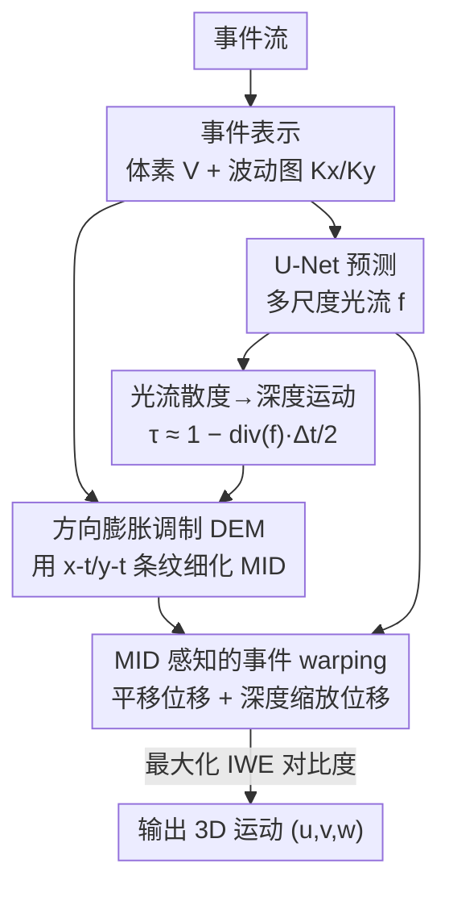

# Unsupervised 3D Motion Estimation Using Event Camera

**会议**: CVPR 2026  
**论文**: [CVF Open Access](https://openaccess.thecvf.com/content/CVPR2026/html/Han_Unsupervised_3d_Motion_Estimation_Using_Event_Camera_CVPR_2026_paper.html)  
**领域**: 3D视觉 / 事件相机  
**关键词**: 事件相机, 3D运动估计, 光流, 深度运动, 对比度最大化, 无监督学习

## 一句话总结
利用事件相机在不同投影轴上呈现的膨胀/收缩条纹隐含深度变化这一线索，本文推导出光流散度与"深度运动"（motion in depth）之间的解析关系做初值、再用一个方向膨胀调制模块（DEM）细化，最后把深度运动写进事件级 warping 并用对比度最大化联合优化，从而完全无监督地同时估计 2D 光流与沿视线方向的运动，在 CarlaEvent3D 上取得了远超无监督基线的精度。

## 研究背景与动机

**领域现状**：场景点的 3D 运动通常被拆成两部分——图像平面上的 2D 光流 $(u,v)$，以及沿相机视线方向的"深度运动"（Motion in Depth, MID, 记作 $w$ 或深度比 $\tau$）。主流学习方法（E-RAFT、ScaleFlow、EMoTive 等）走的是监督回归路线：从稠密标注的 3D 运动场直接回归。

**现有痛点**：监督方法严重依赖标注样本的分布，且没有显式引入支配运动的几何约束，于是容易过拟合到某个数据集特有的运动模式，换到没见过的环境就泛化崩塌。已有的无监督方案虽然用光度/几何一致性来回避标注，但大多依赖同步立体相机对，需要精确外参标定，且受图像表示固有的几何畸变和投影歧义影响。

**核心矛盾**：无监督 3D 运动估计本身有两个死结。其一，沿视线方向的运动**不可观测**——同时估光流和深度运动需要强先验，而无监督设定下没有这种先验。其二，光流和深度运动通过投影几何**耦合**在一起：每个像素的运动既来自 2D 平移，又来自深度引起的缩放（近大远小），二者从观测中天然难以分离。

**切入角度**：事件相机以微秒级延迟异步记录每像素亮度变化，提供了极高的时间分辨率和运动连续性。作者观察到一个关键现象：把事件流投影到不同坐标轴（x-y、x-t、y-t）时，x-t 和 y-t 投影上会暴露出**局部膨胀/收缩的条纹**，这些条纹恰好编码了相对深度变化和运动几何——这正是图像表示里没有、却对解耦深度运动至关重要的互补线索。

**核心 idea**：用事件投影里的膨胀/收缩线索把"不可观测的深度运动"变成"可观测"，从光流散度解析地推出深度运动初值，再用专门模块细化，并把深度运动塞回对比度最大化的事件 warping 里，让光流与深度运动在一个统一目标下联合优化、互相去歧义。

## 方法详解

### 整体框架
输入是一段事件流 $\epsilon=\{x_i,y_i,t_i,p_i\}$，输出是每像素的 3D 运动 $(u,v,w)$。整条管线分三步走：先把事件体素化喂进一个带循环单元的 U-Net 编解码器，预测多尺度光流；然后用一条解析公式（Eq.7）从光流散度直接算出一个**粗糙的深度运动** $\hat\tau$；接着用 DEM 模块结合事件"波动图"（kymograph）对 $\hat\tau$ 做细化得到 $\tilde\tau$；最后训练时把深度运动引入的缩放写进事件 warping，和光流位移一起生成 warped 事件图（IWE），在对比度最大化目标下联合优化光流和深度运动。整个过程没有任何 3D 运动标注。

### 关键设计

**1. 光流散度→深度运动的解析桥（用几何把不可观测变可观测）**

深度运动本身不可观测，监督方法只能硬回归。作者从针孔相机模型出发：3D 点 $(X,Y,Z)$ 投影为 $x=fX/Z,\ y=fY/Z$。假设纯沿视线方向运动，瞬时光流满足 $u=-x\dot Z/Z,\ v=-y\dot Z/Z$。对光流场求散度：

$$\text{div}(f)=\frac{\partial u}{\partial x}+\frac{\partial v}{\partial y}=-2\alpha-(x\partial_x\alpha+y\partial_y\alpha),\quad \alpha=\frac{\dot Z}{Z}$$

在深度变化平缓的局部邻域里，把空间导数项 $(x\partial_x\alpha+y\partial_y\alpha)$ 忽略，就得到 $\dot Z/Z\approx-\tfrac12\text{div}(f)$。再把连续时刻离散化——定义深度运动为相邻两帧深度比 $\tau=Z(t+\Delta t)/Z(t)$，一阶 Taylor 展开后得到核心关系式：

$$\tau\approx 1-\frac{1}{2}\,\text{div}(f)\,\Delta t \quad (\text{Eq.7})$$

这条式子的价值在于：**深度运动不必另起炉灶去回归，而是从已经估出的光流场散度里直接读出来**——光流向外发散（散度为负）意味着物体在逼近（深度变小），向内收敛意味着远离。它把"不可观测的深度"接到了"可观测的光流"上，给无监督估计提供了初值。代价是这里用了"局部刚性 patch + 主导平移运动"的简化假设，所以只是粗糙初值 $\hat\tau$，后续靠网络放松。

**2. 方向膨胀调制 DEM（用事件投影条纹补回被忽略的深度梯度）**

Eq.7 丢掉了空间导数项，在深度梯度大的地方（近处地面、物体边界）误差最大。DEM 就是来补这一刀的。它不依赖光流，而是直接看事件在 x-t、y-t 投影（波动图）上的膨胀/收缩条纹。先用 1D 卷积从两个方向的时序投影特征 $F_{ht},F_{wt}$ 提取方向膨胀率：

$$e_h=\tanh\!\big(\text{Conv}^h_{1D}(F_{ht})\big),\quad e_w=\tanh\!\big(\text{Conv}^w_{1D}(F_{wt})\big)$$

把 $e_h,e_w$ 沿空间维广播并拼成双轴膨胀先验 $E\in\mathbb{R}^{2\times H\times W}$，再用一个轻量 2D 卷积把它嵌入特征域，去调制光流编码器提取的上下文特征 $F_c$：$F_m=F_c\odot\text{Conv2D}(E)$。之后用一个紧凑的自注意力块聚合长程空间上下文，再过一组膨胀率 $\{1,2,4\}$ 的空洞深度可分卷积把方向线索传播到多尺度，融合出稠密的 **MID 残差图** $R$。这个残差加回 $\hat\tau$ 得细化估计 $\tilde\tau$，最后线性重缩放 $\tau=0.75\tilde\tau+1.25$ 保持数值稳定。一句话：DEM 把"光流推不出来的那部分深度变化"，从事件投影的膨胀条纹里捞回来。

**3. MID 感知的事件级 warping（把深度缩放写进对比度最大化，又躲开事件坍缩）**

光看深度运动还不够，得让它真正参与无监督训练目标。对比度最大化框架原本只用光流把所有事件 warp 到参考时刻 $t_r$：$\binom{x_i^{t_r}}{y_i^{t_r}}=\binom{x_i}{y_i}+(t_r-t_i)\binom{u}{v}$，对齐好则 warped 事件图（IWE）锐利、对比度高。问题是深度变化会带来近大远小的缩放，光流 warping 没建模它。直接照搬图像方法在局部 patch 上做膨胀/收缩又行不通——事件是异步稀疏点，硬塞缩放极易触发已知的"事件坍缩"（event collapse）退化。

作者的解法是在**事件级**重写缩放。由针孔模型，2D 投影面积 $A_{2d}=(f/Z)^2A_{3d}$，于是两时刻的 2D 尺度比 $s=\sqrt{A_1^{2d}/A_0^{2d}}=Z_0/Z_1=1/\text{MID}$。由于事件异步触发，对每个事件按时间戳线性插值它经历的缩放：$\lambda_j=\frac{t_1-t_j}{t_1-t_0},\ s_j=1+\lambda_j(s-1)$，保证形变随时间平滑连续。事件相对 patch 中心 $(x_m,y_m)$ 的深度诱导位移为：

$$\binom{\Delta x_j^{t_1}}{\Delta y_j^{t_1}}=\binom{(s_j-1)x_j+(1-s_j)x_m}{(s_j-1)y_j+(1-s_j)y_m}$$

把这个深度缩放位移叠加到光流位移上，就得到每个事件的最终 warp 位置，平移运动和缩放运动被统一处理。训练用对比度最大化目标（度量 warped 时间戳的逐像素时间方差，越小越锐利）加 Charbonnier 平滑正则。因为缩放是按事件时间戳逐点插值、相对 patch 中心算的，不需要构造结构化 patch 对应，从根上避开了稀疏事件硬缩放导致的坍缩。

### 损失函数 / 训练策略
最终目标是对比度最大化损失（warped 时间戳的逐像素时间方差，鼓励同一物理边缘的事件在时空上对齐成锐利 IWE），外加 Charbonnier 平滑先验正则相邻运动估计、保持局部一致。前向、后向（向末时刻与初始时刻）warping 都做。训练用 Adam，学习率 $10^{-4}$，梯度裁剪全局范数 100，batch size 4，训 100 epoch，每 5 次前向做一次后向更新以稳定训练。每个事件窗口固定 6000 个事件，x-y 平面体素化 10 个时间 bin，x-t/y-t 投影时间分辨率 120。

## 实验关键数据

数据集为 CarlaEvent3D，含 Sunset、Noon、Night、Cloudy、Foggy、Rainy 六种天气。由于对比度最大化假设光照恒定（事件只由运动而非光照变化触发），模型**只在 Sunset 序列上训练**，却在全部六种天气上测试，直接考验泛化。

### 主实验（3D 运动估计，EPE↓ / F1↓ / log-mid↓）
SL = 监督，USL = 无监督。下表摘录 Sunset、Night、Cloudy 三种天气：

| 方法 | 类型 | Sunset EPE | Sunset F1 | Night EPE | Cloudy EPE | Cloudy F1 |
|------|------|-----------|-----------|-----------|-----------|-----------|
| EMoTive | SL | 1.852 | 19.22 | 2.008 | 2.629 | 24.16 |
| EV-FlowNet | USL | 3.597 | 50.25 | 3.152 | 2.925 | 39.05 |
| Expansion | USL | 8.499 | 56.63 | 7.963 | 8.583 | 59.86 |
| **本文** | USL | **3.520** | **44.59** | 3.392 | **2.833** | **34.83** |

在所有无监督方法里本文 EPE/F1 最优，且把强基线 Optical Expansion 的 EPE（8.5 量级）压到 3.5 量级，差距悬殊。和监督方法相比误差仍偏高，但考虑到只用 Sunset 训练、零标注，差距已相当接近，泛化性强。

### 场景流估计（EPE3D↓ / ACC0.1↑）
ACC0.1 是 3D 误差 < 10cm 的点占比，更看重精细局部精度：

| 方法 | 类型 | Sunset EPE3D | Sunset ACC0.1 | Night ACC0.1 | Rainy ACC0.1 |
|------|------|-------------|---------------|--------------|--------------|
| EMoTive | SL | 0.176 | 43.8% | 42.9% | 37.1% |
| Expansion | USL | 0.812 | 2.3% | 1.4% | 2.4% |
| **本文** | USL | 1.062 | **12.7%** | **13.2%** | **14.3%** |

EPE3D 和 Expansion 接近，但 ACC0.1 实现了 **6–7 倍**提升，说明本文的误差分布更紧凑一致——这归功于 DEM 对深度运动的细化。

### 消融实验
| 配置 | EPE↓ | log-mid↓ | 说明 |
|------|------|---------|------|
| w/o DEM | 3.38 | 644.56 | 仅用 Eq.7 推出的粗糙 MID |
| w/ DEM（完整）| **3.29** | **364.01** | DEM 细化后 |

去掉 DEM 后 MID 明显不连续、log-mid 几乎翻倍（644.56 vs 364.01），且 MID 精度下降还会经由 warping 反向拖累最终光流精度（EPE 3.38 vs 3.29）。

### 关键发现
- DEM 是深度运动质量的命门：去掉它 log-mid 从 364 飙到 645，可视化上 MID 变得断续。
- Eq.7 推出的 MID 误差**主要集中在近处地面和物体边界**——这两处深度梯度大，恰好是 Eq.7 忽略的空间导数项不可忽略的地方，与理论分析自洽。
- 在 Noon 和 Rainy 上掉点：前者太阳频繁进入视野、后者地面积水反光和雨滴都会触发非运动的光照事件，违反亮度恒定假设。
- 近地面区域纹理少、触发事件稀疏，运动线索不足，导致该区域 3D 运动误差偏大并传播到场景流重建。

## 亮点与洞察
- **把"不可观测"变"可观测"的几何巧思**：用光流散度去解析地推深度运动，等于借光流场的发散/收敛把深度变化暴露出来，免去对深度运动的直接监督——这是整篇无监督方案能成立的支点。
- **事件级重写缩放躲开事件坍缩**：直接在稀疏事件上按时间戳插值缩放、相对 patch 中心算位移，不构造结构化 patch 对应，从机制上绕开了硬缩放导致的优化退化，这个 trick 对所有"想把图像端 warping 搬到事件端"的工作都有借鉴价值。
- **跨投影轴取线索**：x-t/y-t 波动图里的膨胀条纹被当成深度线索喂给 DEM，提示事件流的多轴投影本身就是一座没被充分挖掘的几何信息富矿。
- **只训一种天气测六种**的设定很硬核，直接把泛化性做成了卖点而非附带结论。

## 局限与展望
- **亮度恒定假设是硬伤**：对比度最大化要求事件只由运动触发，于是 Noon（阳光入镜）和 Rainy（积水反光、雨滴闪烁）这类光照诱导事件多的场景明显掉点，作者也坦承无法可靠抑制这类噪声。
- **稀疏区域失效**：近地面低纹理处事件稀疏、线索不足，逐事件优化在这里给出不准的 3D 运动并污染下游场景流，图 5(a) 里近相机点位误差明显偏大。
- **Eq.7 的简化假设**：局部刚性 + 主导平移的假设虽被网络部分放松，但深度梯度剧烈处（边界、近地面）仍是误差重灾区；引入显式的边界/深度梯度感知项或许能进一步压低 log-mid。
- 只在 CarlaEvent3D 合成数据上验证，真实事件相机数据上的表现仍是开放问题。

## 相关工作与启发
- **vs Optical Expansion [37]**: 它用局部投影间的仿射变换估深度运动，在异步稀疏事件和复杂运动下局部对应不可靠、产生噪声扭曲的深度场（ACC0.1 仅 2–3%）；本文用解析关系+事件级连续缩放，无需显式 patch 对应，深度运动更平滑（ACC0.1 提升 6–7 倍）。
- **vs EV-FlowNet [39]**: 经典事件无监督光流网络，只估 2D 光流；本文显式建模平面运动与深度运动的耦合，因而 EPE 更低，还多产出一个深度运动维度。
- **vs EMoTive / ScaleFlow / E-RAFT（监督）**: 这些直接回归 3D 运动场、依赖稠密标注，精度高但泛化受限；本文牺牲一点绝对精度换来零标注与跨天气泛化。
- **vs 对比度最大化框架 [Gallego et al.]**: 本文继承其事件对齐思想，但把深度诱导缩放首次以事件级、时间插值的方式纳入 warping，扩展了该框架从纯 2D 光流到 3D 运动的边界。

## 评分
- 新颖性: ⭐⭐⭐⭐ 把光流散度→深度运动的解析关系、事件投影膨胀线索、事件级缩放 warping 三者串成一套自洽的无监督 3D 运动方案，几何直觉清晰且少见。
- 实验充分度: ⭐⭐⭐⭐ 六天气泛化测试 + 3D 运动与场景流双任务 + DEM/Eq.7 消融较完整，但仅在合成 CarlaEvent3D 上验证，缺真实数据。
- 写作质量: ⭐⭐⭐⭐ 几何推导一步步衔接、动机与误差分析自洽，公式与图示对得上。
- 价值: ⭐⭐⭐⭐ 为事件相机无监督 3D 运动估计提供了可复用的几何桥与事件级 warping 范式，对机器人/自动驾驶的动态感知有实用潜力。

<!-- RELATED:START -->

## 相关论文

- [\[CVPR 2026\] FastEventDGS: Deformable Gaussian Splatting for Fast Dynamic Scenes from a Single Event Camera](fasteventdgs_deformable_gaussian_splatting_for_fast_dynamic_scenes_from_a_single.md)
- [\[CVPR 2026\] AIMDepth: Asymmetric Image-Event Mamba for Monocular Depth Estimation](aimdepth_asymmetric_image-event_mamba_for_monocular_depth_estimation.md)
- [\[CVPR 2026\] Geometric-Photometric Event-based 3D Gaussian Ray Tracing](geometric-photometric_event-based_3d_gaussian_ray_tracing.md)
- [\[CVPR 2026\] Depth Hypothesis Guided Iterative Refinement for Event-Image Monocular Depth Estimation](depth_hypothesis_guided_iterative_refinement_for_event-image_monocular_depth_est.md)
- [\[CVPR 2026\] UniDAC: Universal Metric Depth Estimation for Any Camera](unidac_universal_metric_depth_estimation_for_any_camera.md)

<!-- RELATED:END -->
