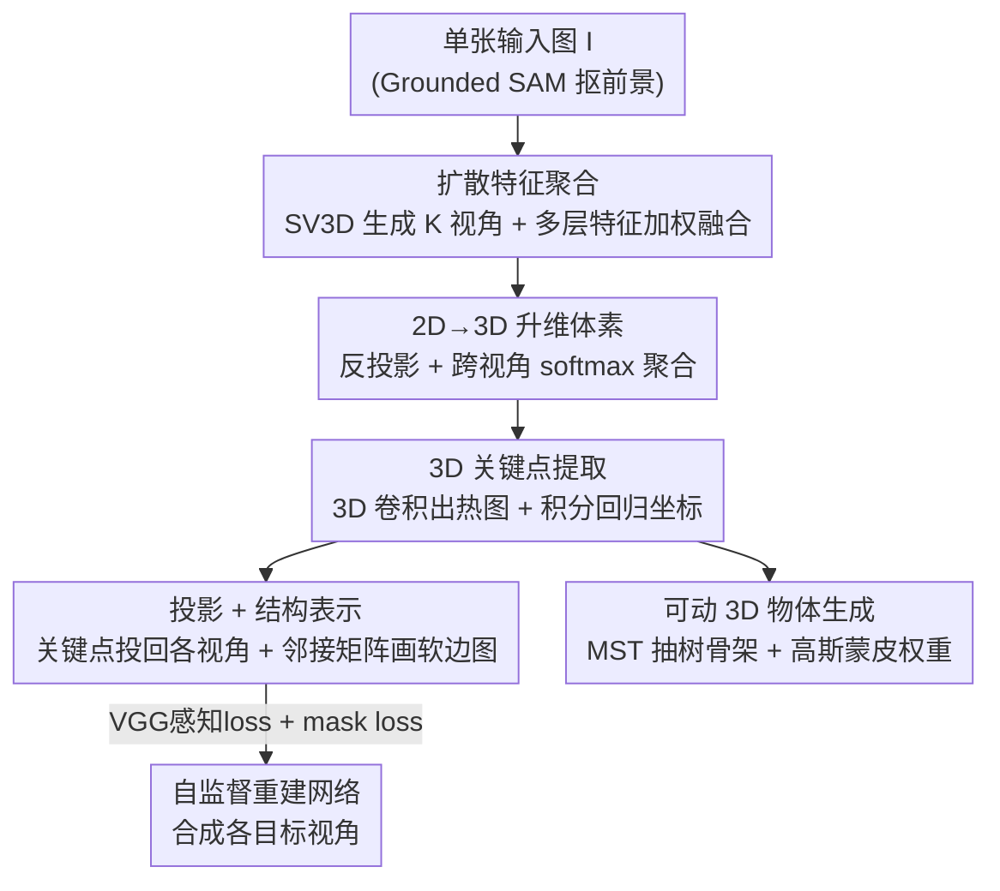

# Unsupervised Monocular 3D Keypoint Discovery from Multi-View Diffusion Priors

**会议**: CVPR 2026  
**arXiv**: [2507.12336](https://arxiv.org/abs/2507.12336)  
**代码**: 无  
**领域**: 3D视觉 / 扩散模型  
**关键词**: 无监督关键点、单目3D、多视角扩散先验、体素特征、自监督重建

## 一句话总结
KeyDiff3D 把预训练多视角扩散模型当作"几何先验来源"——既用它从单张图生成多视角图像做自监督信号，又从它的中间特征里抽出隐含的 3D 几何线索升维成显式体素，从而在没有任何 3D 标注、相机参数或多视角采集的情况下，仅凭一张图就预测出准确且可泛化的 3D 关键点（Human3.6M 单视角 MPJPE 119mm，超过所有单视角无监督基线，甚至打平部分多视角方法）。

## 研究背景与动机

**领域现状**：3D 关键点（人体关节、面部 landmark 等）是描述物体几何结构的紧凑、可解释表示，是姿态估计、动画、交互分析等下游任务的基础。监督方法需要数千个 3D 标注，昂贵且只覆盖人体这类研究充分的类别；无监督关键点发现（KeypointNet、BKinD-3D、Honari et al.）则通过图像重建训练网络，绕开人工标注，理论上能扩展到任意类别。

**现有痛点**：现有无监督 3D 方法仍然要"标定好的、以物体为中心的多视角图像"作为输入或重建目标。要拿到这种数据，必须有受控的、同步多相机的采集环境，这极大限制了多视角数据集的多样性，使得方法很难推广到 in-the-wild 和长尾类别。换句话说，它们只是把"标注成本"换成了"多视角采集成本"。

**核心矛盾**：单目图像远比多视角图像易得，是可扩展 3D 理解的关键入口；但从单张图、没有相机参数也没有标注地恢复 3D 结构，是一个本质上欠约束的问题——深度歧义和遮挡让单目 3D 关键点几乎成了无人区。所以矛盾在于：**可扩展性（只要单图）** 和 **3D 可解性（需要多视角几何约束）** 之间难以兼得。

**本文目标**：做一个只用无约束单视角图像就能训练、单图就能推断、且能泛化到 in-the-wild 与 out-of-domain 的无监督单目 3D 关键点框架。

**切入角度**：作者观察到预训练的**多视角扩散模型**（如 SV3D）本身就在生成几何一致的新视角时编码了强大的 3D 几何先验。既然扩散模型"心里有 3D"，那就让它充当两个角色——既造多视角图当监督，又当多视角特征提取器把隐式先验掏出来。

**核心 idea**：用多视角扩散模型替代昂贵的多视角采集，把它隐式的 3D 先验"显式化"成体素特征，从单图回归 3D 关键点。

## 方法详解

### 整体框架
输入是单张图像 $I$，输出是一组 3D 关键点 $\mathbf{S}=\{\mathbf{s}_n\}_{n=1}^N$（$\mathbf{s}_n\in\mathbb{R}^3$）和一个可学习的邻接矩阵 $\mathcal{A}\in\mathbb{R}^{N\times N}$（描述关键点之间的连接权重）。整条管线分三大块：先用扩散模型从单图生成多视角并抽取多层中间特征做**扩散特征聚合**；再把这些 2D 多视角特征反投影（unproject）升维成 3D 体素特征、回归出 3D 关键点（**3D 关键点提取**）；最后把预测的 3D 关键点重新投影回各生成视角，画成关键点热图 + 软边图，喂给重建网络做**自监督训练**——整个监督信号都来自扩散生成的图，不需要任何真值。训练完成后还可外接一条**可动 3D 物体生成**管线，把关键点与扩散重建的 mesh 绑成可驱动骨架。

关键之处在于：扩散模型不是被当成"图像生成器"用（直接拿生成图当输入会引入噪声），而是被当成"几何特征提取器"——抽它的 U-Net 解码器中间特征，这些特征比渲染出来的图含有更纯的 3D 先验。

### 关键设计

**1. 扩散特征聚合：把扩散模型当多视角特征提取器，而非图像生成器**

最直接的思路是拿扩散生成的多视角图当输入或重建目标，但生成图本身有噪声、伪影，会污染 3D 估计。作者改成抽扩散模型的**中间特征**。具体地，从纯噪声 $t=T$ 去噪到目标时刻 $\tau=500$，缓存 U-Net 解码器各层的中间特征。借鉴 Diffusion Hyperfeatures，训练一个轻量聚合网络，把多层特征 $\mathbf{f}_l$ 上采样到统一分辨率、过 bottleneck $B_l$ 投到统一通道维 $C'$，再用可学习标量权重 $w_l$ 加权求和：

$$\mathbf{F}_{\text{agg}}=\sum_{l=1}^{L}w_l\cdot B_l(\mathbf{f}_l),\quad \mathbf{F}_{\text{agg}}\in\mathbb{R}^{C'\times K\times H\times W}.$$

聚合网络由自监督目标驱动，专门挑出"跨多个生成视角都一致"的位姿相关特征。消融证明这步是命门：用 ResNet50/CLIP/DINOv2 这些通用 2D backbone 替换扩散特征，MPJPE 从 121 掉到 136~143，说明多视角扩散特征里的 3D 几何意识确实更强，而且中间特征比渲染出的图先验更纯。

**2. 2D→3D 体素升维：用反投影把隐式先验变成显式 3D 体积**

有了多视角 2D 特征，怎么变成 3D？作者定义一个 $M\times M\times M$（$M=72$）的规则体素网格，坐标系对齐扩散模型学到的世界空间。先用浅层 keypoint head $\phi_{\text{kp}}$ 把聚合特征转成关键点特征 $\mathbf{F}_{\text{kp}}$；然后对每个体素中心 $\mathbf{x}$，用相机投影矩阵 $\mathbf{P}_k$ 投到第 $k$ 个视角的图像平面得到亚像素坐标 $u_k(\mathbf{x})$，双线性采样取出特征 $\mathbf{f}_k(\mathbf{x})$。多视角特征沿视角维做 softmax 注意力聚合：

$$\mathbf{V}(\mathbf{x})=\sum_{k=1}^{K}\omega_k\cdot\mathbf{f}_k(\mathbf{x}),\quad \omega_k=\text{softmax}_k(\{\mathbf{f}_k\}_{k=1}^K).$$

softmax 权重让被遮挡/不可靠视角自动降权。这一步把扩散里"隐式"的 3D 线索变成"显式"的体素 $\mathbf{V}\in\mathbb{R}^{C''\times M\times M\times M}$。消融里另一条路线"先 2D 检测再三角化"MPJPE 129.6，比直接体素建模（121.3）差，说明在 3D 空间里显式建模比 2D 后处理更几何自洽。

**3. 3D 关键点提取（积分回归）：让定位全程可微**

体素特征过 3D 卷积网络 $\phi_{\text{vol}}$ 输出每个关键点的 3D 热图 $\mathbf{H}_n\in\mathbb{R}^{M\times M\times M}$。坐标用 integral regression（soft-argmax）取热图的期望位置：

$$\mathbf{s}_n=\sum_{\mathbf{x}\in\Omega}\mathbf{x}\cdot\text{softmax}(\mathbf{H}_n(\mathbf{x})).$$

这种期望形式让从热图到坐标的整个过程可微，能端到端用重建 loss 反传，而不是用不可微的 argmax。

**4. 投影 + 软边图 + 自监督重建：用扩散生成图当多视角监督**

没有真值，监督从哪来？作者把预测的 3D 关键点用 $\mathbf{P}_k$ 投影回 $K$ 个扩散生成视角得到 2D 关键点 $\mathbf{S}^{(k)}$。为了进一步约束结构，在每对关键点 $(i,j)$ 之间画可微高斯线段构成软边图：先算像素到线段的距离 $d$，再渲染 $\mathbf{L}_{ij}(u)=w_{ij}\exp(-d^2/(2\sigma^2))$，其中边权 $w_{ij}=\text{softplus}(A_{ij})$ 由可学习邻接矩阵 $\mathcal{A}$ 门控（这也是邻接图被同时学出来的地方）。各对线段按像素取最大值聚成边图 $\mathbf{E}^{(k)}$，与关键点热图拼接后送进重建网络，让它用输入图的外观特征 + 这些结构线索去合成目标视角 $\hat{I}^{(k)}$，监督信号是扩散生成的参考图 $I^{(k)}$。整个闭环逼着关键点"摆"在能解释多视角外观的位置上，结构（邻接图）也随之涌现。

### 损失函数 / 训练策略
重建用 VGG 感知 loss + 边图 mask loss，对 $K$ 个视角平均：

$$\mathcal{L}=\frac{1}{K}\sum_{k=1}^{K}\left(\lambda_{\text{vgg}}\cdot\mathcal{L}_{\text{vgg}}^{(k)}+\lambda_{\text{mask}}\cdot\mathcal{L}_{\text{mask}}^{(k)}\right),$$

其中 $\mathcal{L}_{\text{vgg}}^{(k)}=\|\psi(\hat{I}^{(k)})-\psi(I^{(k)})\|_1$（VGG 特征 L1），$\mathcal{L}_{\text{mask}}^{(k)}=\|\mathbf{E}^{(k)}-\mathbf{M}^{(k)}\|_2^2$（边图对齐扩散图的前景二值 mask）。输入图先做随机仿射增强。超参 $\lambda_{\text{vgg}}=1.0$、$\lambda_{\text{mask}}=0.5$。

backbone 用 SV3D-p（生成 21 个几何一致视角，训练取 $K=4$：输入视角 + 3 个生成视角），$\tau=500$、$T=1000$。预处理用 Grounded SAM 抠前景。除重建网络外用 AdamW（lr $1\times10^{-4}$），重建网络 lr $1\times10^{-3}$；训练 20000 步、2×A100（40GB）、总 batch 4；$M=72$、默认 $N=18$ 关键点。

**可动 3D 物体生成（推断期外接管线）**：用 Gaussian Frosting（基于 3DGS）从生成图重建出 mesh + 3D 高斯；对关键点的稠密边图算最小生成树（MST，结合预测边权与欧氏距离）抽出 $N-1$ 条树边骨架；再用高斯距离函数 $G(\mathbf{v}_i,E_l)=\exp(-\alpha\cdot d(v_i,E_l)^2/(2\sigma^2))$ 算顶点到边的蒙皮权重 $\mathbf{W}_{i,l}$（归一化）。由于预测天然与扩散坐标系对齐，无需额外配准即可像常规骨架一样驱动物体形变。

## 实验关键数据

### 主实验

Human3.6M 上 3D 关键点估计（MPJPE/N-MPJPE/P-MPJPE，单位 mm，越低越好；`*` 为六动作简化子集）：

| 方法 | 视角数 | 关键点 | 回归器 | MPJPE | P-MPJPE |
|------|--------|--------|--------|-------|---------|
| KeypointNet [56] | 1 | 32 | 2-hid MLP | 158.7 | 112.9 |
| Honari et al. [16]（单视角） | 1 | 32 | 2-hid MLP | 125.73 | 89.05 |
| BKinD-3D [54] | 2 | 15 | Linear | 155 | 117 |
| BKinD-3D [54] | 4 | 15 | Linear | 125 | 105 |
| **Ours** | **1** | 32 | 2-hid MLP | **119.07** | **85.37** |
| **Ours** | **1** | 18 | 2-hid MLP | 121.34 | 85.26 |
| Ours `*` | 1 | 18 | 2-hid MLP | 85.47 | 66.73 |

关键发现：仅用单视角就**超过所有单视角无监督基线**，且 MPJPE 119 已优于多视角 BKinD-3D（2 视角 155、4 视角 125），P-MPJPE 还优于用了人体专属先验的单目姿态方法——而本文不依赖任何人体专属先验。

CUB-200-2011 上 2D 关键点（把 3D 投影到 2D 评测，L2 距离按图尺寸归一化，越低越好）：本文 CUB-aligned 5.16、CUB-all 7.7，与 StableKeypoints（5.06/5.4）等 2D 专用方法相当——注意这套 2D 评测并不能完全体现其 3D 优势。

### 消融实验

| 配置 | MPJPE | N-MPJPE | P-MPJPE | 说明 |
|------|-------|---------|---------|------|
| (a) ResNet50 特征 | 138.97 | 136.34 | 101.55 | 通用 2D backbone |
| (a) CLIP 特征 | 143.23 | 139.96 | 103.13 | 通用 2D backbone |
| (a) DINOv2 特征 | 136.17 | 133.53 | 101.91 | 通用 2D backbone |
| (a) **Ours (SV3D)** | **121.34** | **118.29** | **85.26** | 扩散特征 |
| (b) 2D 检测 + 三角化 | 129.63 | 126.96 | 93.68 | 替换 3D 升维策略 |
| (b) **3D 特征 → 3D 关键点** | **121.34** | **118.29** | **85.26** | 本文体素建模 |
| (c) 1 视角（仅输入） | 166.29 | 157.94 | 104.22 | 几何线索不足 |
| (c) 2 视角 | 132.36 | 129.41 | 92.36 | |
| (c) 3 视角 | 121.58 | 118.75 | 86.59 | 接近饱和 |
| (c) 4 视角 | 121.34 | 118.29 | 85.26 | 默认（精度/效率平衡） |
| (c) 5 视角 | 119.77 | 117.42 | 82.94 | 继续微涨 |

### 关键发现
- **扩散特征是涨点主力**：换成 ResNet50/CLIP/DINOv2 掉 15~22mm，证明多视角扩散中间特征比通用 2D backbone、也比扩散渲染出的图含有更强的 3D 几何先验。
- **3D 体素建模优于 2D 后三角化**：直接在 3D 空间显式建模（121.3）比"2D 检测 + 三角化"（129.6）更几何自洽。
- **视角数边际递减**：从 1 视角（166）到 2 视角（132）暴涨，3 视角后基本饱和，$K=4$ 是精度/效率折中。
- **视角越少越显优势**：定性上 BKinD-3D 在 2 视角时膝盖等难关节明显掉点，本文单视角仍稳健。

## 亮点与洞察
- **"扩散当几何提取器"而非"当图像生成器"**：核心洞见是生成图带噪声、但中间特征里的 3D 先验更纯——消融直接量化证明（特征 vs 通用 backbone 差 15mm+）。这条思路可迁移到任何想白嫖扩散几何先验的 3D 感知任务（深度、法向、对应）。
- **用扩散生成图把"多视角自监督"的采集成本归零**：传统无监督 3D 关键点的瓶颈是标定多相机，本文用扩散"凭空造"几何一致的多视角当监督，把这条成本彻底消掉，是真正解锁 in-the-wild 与长尾类别（鸟、狗、斑马、熊猫）的关键。
- **关键点与扩散坐标系天然对齐 → 免配准驱动**：因为关键点和重建 mesh 共享扩散世界坐标系，直接 MST 抽骨架 + 高斯蒙皮就能驱动物体，无需手工 rigging 或额外配准，是个很实用的副产品。
- **邻接图随重建涌现**：软边图里的 $w_{ij}=\text{softplus}(A_{ij})$ 让连接结构在自监督重建中被一并学出来，而非预定义骨架，这也是它能跨物种泛化的原因。

## 局限性 / 可改进方向
- **强依赖多视角扩散 backbone 的质量**：整套先验来自 SV3D，扩散生成失败/几何不一致的类别（极端形变、强遮挡、罕见拓扑）会直接拖垮关键点，论文也只在能被 SV3D 较好生成的类别上验证。
- **绝对精度仍偏高**：单视角 MPJPE 119mm 对真实下游（如医疗、动捕）还远不够准，且本质受单目深度歧义限制；多视角监督方法在精度上限上仍有优势。
- **动物等类别缺 3D 真值，只能定性 + 2D 投影评测**：CUB/Stanford Dogs 没有 3D GT，定量只能退化到 2D 投影评测，无法直接验证其 3D 结构的准确性。
- **特征提取要跑扩散去噪到 $\tau=500$**，推断开销不小（21 视角生成 + 多层特征缓存 + 3D 卷积），实时性存疑。

## 相关工作与启发
- **vs BKinD-3D [54] / Honari et al. [16]**：它们也做无监督 3D 关键点，但训练/推断要标定多视角图像与已知相机参数；本文用扩散"造"多视角替代真实采集，只需单视角图就能训练，且单视角推断精度反超它们的 2 视角设定。
- **vs KeypointNet [56]**：同为单图推断，但 KeypointNet 训练时要多视角一致性约束（多视角输入）；本文训练也只需单图，靠扩散先验补足几何。
- **vs StableKeypoints [15]**：StableKeypoints 用 2D 扩散做无监督 2D 关键点，本文把这一范式扩展到 3D——用多视角扩散的空间先验做单目 3D 估计，是从"2D 扩散先验"到"3D 多视角扩散先验"的自然延伸。
- **vs 单目人体姿态（Sosa/Kundu/Yang）**：这些方法靠人体专属先验（不成对 2D/3D 姿态、骨长比、关节连接）；本文不用任何人体先验却在 P-MPJPE 上更优，因而能无缝迁到鸟、狗等非人类类别。

## 评分
- 新颖性: ⭐⭐⭐⭐⭐ 首个把多视角扩散先验同时用于"造监督"和"提特征"来解无监督单目 3D 关键点，思路干净且填补了单目 3D 关键点这个无人区
- 实验充分度: ⭐⭐⭐⭐ 人体定量 + 动物/in-the-wild/out-of-domain 定性 + 三组消融较完整，但动物类别缺 3D 真值、绝对精度未拉满
- 写作质量: ⭐⭐⭐⭐ 逻辑清晰、公式完整，pipeline 三块划分明了
- 价值: ⭐⭐⭐⭐⭐ 把多视角采集成本归零、可泛化到任意类别，并附带免 rigging 的可动 3D 物体生成，对可扩展 3D 理解很有启发

<!-- RELATED:START -->

## 相关论文

- [\[CVPR 2026\] SPE-MVS: Spatial Position Encoding Enhanced Multi-View Stereo with Monocular Depth Priors](spe-mvs_spatial_position_encoding_enhanced_multi-view_stereo_with_monocular_dept.md)
- [\[CVPR 2026\] VDFE: Difference-Aware 3D Scene Editing with Non-Intrusive Video Diffusion Priors for Multi-View Consistency and Efficiency](vdfe_difference-aware_3d_scene_editing_with_non-intrusive_video_diffusion_priors.md)
- [\[CVPR 2026\] Iris: Bringing Real-World Priors into Diffusion Model for Monocular Depth Estimation](iris_bringing_realworld_priors_into_diffusion_model_for_monocular_depth_estimation.md)
- [\[CVPR 2026\] Generative Diffusion Priors for 3D Mapping of the Dark Universe](generative_diffusion_priors_for_3d_mapping_of_the_dark_universe.md)
- [\[CVPR 2026\] Multi-view Consistent 3D Gaussian Head Avatars 'without' Multi-view Generation](multi-view_consistent_3d_gaussian_head_avatars_without_multi-view_generation.md)

<!-- RELATED:END -->
