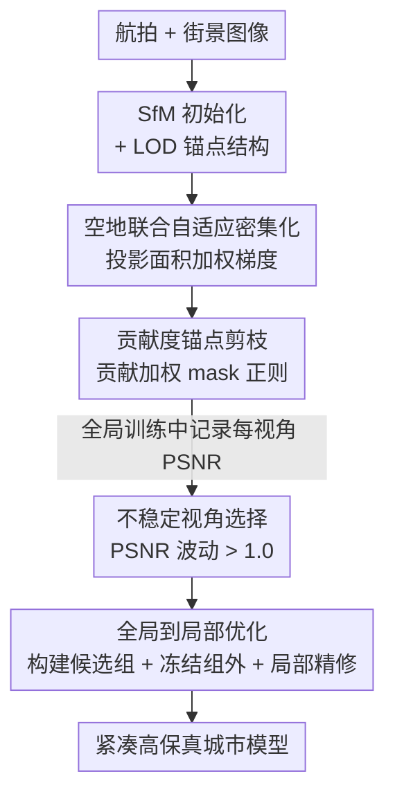

<!-- 由 tmp/gen_cvf_stubs.py 自动生成（CVF-only，无 arXiv） -->
# Urban-GS: A Unified 3D Gaussian Splatting Framework for Compact and High-Fidelity Aerial-to-Street Reconstruction

**会议**: CVPR 2026  
**论文**: [CVF Open Access](https://openaccess.thecvf.com/content/CVPR2026/html/Wang_Urban-GS_A_Unified_3D_Gaussian_Splatting_Framework_for_Compact_and_CVPR_2026_paper.html)  
**代码**: 待确认  
**领域**: 3D视觉  
**关键词**: 3D高斯泼溅, 城市重建, 空地联合, 自适应密集化, 锚点剪枝

## 一句话总结
Urban-GS 把无人机俯拍（aerial）和街景平拍（street）两类视角统一进一套 3D 高斯泼溅框架，用「投影面积加权的密集化 + 贡献度加权的锚点剪枝 + 全局到局部的二阶段优化」三招同时解决跨视角尺度冲突、显存爆炸和欠优化区域问题，在多个城市场景上渲染质量超越 SOTA 的 Horizon-GS，同时把锚点存储平均降低 41%。

## 研究背景与动机

**领域现状**：3DGS 让城市场景的实时高保真渲染成为可能，但绝大多数方法只吃**单一类型视角**——要么纯航拍（CityGaussian、DoGaussian），要么纯街景（Hierarchical-3DGS）。航拍能给出大范围的整体几何，街景能给出地面细节，二者天然互补。

**现有痛点**：单视角训练出来的模型，一旦渲染视角大幅偏离训练视角（比如从空中俯拍切到地面平视，或大幅水平/垂直平移），就会出现明显的针状伪影和模糊。要想得到一个空中地面都能自由漫游的统一城市模型，就必须把两类视角**联合**重建。但联合训练带来三个棘手问题：① 两类视角的场景细节尺度差异极大，导致密集化时**梯度累积冲突**，该长高斯的地方长不出来；② 要刻画多尺度细节就得堆大量高斯，**显存和计算开销爆炸**；③ 视角分布严重不均衡 + 遮挡，使部分区域长期**欠监督**，训练再久也优化不好。

**核心矛盾**：作者发现了一个反直觉现象——把航拍和街景**合并**做密集化，效果竟然比**只用航拍**或**只用街景**还差（见下文 Tab.1）。这说明问题不在"信息不够"，而在于现有密集化判据（对所有视角的位置梯度求**简单平均**）会把"在某些视角贡献极高、但在其他视角几乎不可见"的高斯给误杀掉。

**本文目标**：在一套框架里同时做到（a）解决跨视角的密集化冲突、（b）压缩存储、（c）补救欠优化区域。

**切入角度**：作者深挖那个反直觉现象，发现"航拍/街景"这种人为标签其实和辐射场无关，真正起作用的是**高斯投影面积（projected radius）的剧烈变化**——观测距离差异导致同一高斯在不同视角的投影面积天差地别，简单平均梯度会掩盖局部的高贡献。

**核心 idea**：用「投影面积」作为权重去重新加权梯度与剪枝判据，让密集化和剪枝都按"实际贡献"而非"视角标签"或"简单平均"来决策；再加一个 PSNR 波动驱动的局部精修阶段补欠优化区域。

## 方法详解

### 整体框架
Urban-GS 接收航拍 + 街景两组图像，先用 SfM 初始化出 LOD 结构的锚点（基于 Scaffold-GS 的结构化表示，每个锚点解码出 $k$ 个 neural Gaussian）。整个训练分**两大阶段**：

- **全局训练阶段（Global Training）**：在全部视角上联合建模，期间由两个模块协同——**空地联合自适应密集化（AJAD）**负责"该长的地方长出来"，**贡献度锚点剪枝（CAP）**负责"没用的锚点删掉"，得到一个高质量又省显存的全局模型；同时持续记录每个视角的 PSNR 曲线。
- **局部精修阶段（Local Refinement）**：全局训练结束后，根据 PSNR 波动挑出"不稳定视角"，为每个不稳定视角构建一个共享锚点的候选视角组，冻结组外参数后做有针对性的局部优化，补救欠优化区域。

### 关键设计

**1. 空地联合自适应密集化（AJAD）：用投影面积加权，救回被简单平均误杀的高斯**

痛点直接来自那个反直觉现象：合并航拍 + 街景做密集化，反而不如单视角。作者用 Tab.1 量化了这件事，又用梯度/投影半径分布图（Fig.3）找到了根因——有一批 neural Gaussian 在航拍视角下梯度很高、足以触发密集化，但在街景视角下梯度几乎为零；原始 3DGS 的判据（公式 3）对所有视角的位置梯度做**简单算术平均**，这批高斯被低梯度视角一拉平，整体均值就掉到阈值 $\tau_{pos}$ 之下，于是该密集化的地方密集化不了。进一步分析发现，位置梯度的大小本质上随高斯的**投影面积**增大而增大（覆盖像素多），而投影面积的剧烈变化恰恰源于空地视角观测距离的巨大差异。

所以解法是把梯度按投影面积（用贡献像素数 $|P_i^v|$ 近似）加权再平均，让"近距离大投影"的视角对该高斯的密集化决策有更大话语权：

$$\frac{\sum_{v\in V}|P_i^v|\cdot\sqrt{\left(\sum_{p\in P_i^v}\frac{\partial L_p^v}{\partial \mu_{i,x}^v}\right)^2+\left(\sum_{p\in P_i^v}\frac{\partial L_p^v}{\partial \mu_{i,y}^v}\right)^2}}{\sum_{v\in V}|P_i^v|}>\tau_{pos}$$

这一改的妙处在于把"航拍/街景"这种人为标签彻底抛开，回到尺度本身——作者特别指出，尺度冲突不仅存在于航拍 vs 街景之间，**航拍内部**（不同飞行高度）和**街景内部**（前景-背景过渡）同样有，因此 Horizon-GS 那种"按视角类型分两阶段采样"的做法是过度简化，而面积加权是更本质、更通用的方案。

**2. 贡献度锚点剪枝（CAP）：让"稀疏但关键"的锚点不被全局 mask 误删**

要刻画多尺度细节就得堆大量锚点，显存随之爆炸，必须剪枝。作者先把结构化表示与可学习的概率 mask 结合：给每个锚点 $a$ 分配可学 mask 分数，用 Gumbel-Softmax 采出可微二值 $M_a\in\{0,1\}$，把它乘进 alpha-blending（公式 7），$M_a=0$ 的锚点不参与渲染、持续为零即被剪。MaskGaussian 原本用一个全局正则 $L_{mask}=(\frac{1}{N}\sum_i M_i)^2$ 去压低 mask。

但在空地联合场景里，很多细节天生是**视角特定、稀疏可见**的：街景的精细地面细节航拍根本看不到，航拍能看到的大片区域又常被街景遮挡。这种全局 mask 会因为"观测次数少"把这些局部关键锚点误剪，哪怕它们对局部可见细节至关重要。作者的修法是把正则项改成**贡献度加权**：先定义 neural Gaussian 在某视角下的贡献 $w_i^v$ 为它在贡献像素上的 $T\cdot\sigma$ 相对该像素最大 $T\cdot\sigma$ 的占比（公式 9），再同样按投影面积聚合得到 $w_i$（公式 10），最终正则为：

$$L_m=\frac{1}{kN}\sum_{i=1}^{kN}(1-w_i)m_i$$

即贡献越高的锚点（$w_i$ 大），$(1-w_i)$ 越小，被压低 mask 的惩罚越小，越容易被保留。这样就能在更大的损失权重 $\lambda_m$ 下激进地删冗余锚点、同时稳稳保住高贡献锚点——消融里它用 $\lambda_m=0.003$ 反而比 MaskGaussian 用 $\lambda_m=0.001$ 质量更高、锚点更少。

**3. 全局到局部优化（GLO）：用 PSNR 波动定位欠优化区域，定向精修且不遗忘**

视角分布不均衡 + 遮挡，让全局训练在均匀采样下出现"有的视角拟合很好、有的视角再练也练不好"的失衡。作者的关键观察是：欠优化区域会在训练后期表现为 **PSNR 持续波动而非收敛**。于是在全局训练阶段持续监控每个视角的 PSNR，凡是最后三次记录值中最大差异超过 1.0 的视角，判为**不稳定视角** $v_{us}$。

对每个不稳定视角，构建一个优化视角组 $V_{us}$：候选视角只要与目标视角共享足够多的渲染锚点就纳入组内，判据为

$$\frac{|A_{target}\cap A_{candidate}|}{\min(|A_{target}|,|A_{candidate}|)}>\tau_{group}$$

其中 $A$ 是渲染该视角时有贡献的锚点集合。局部精修时，每个视角组**独立**优化固定迭代数、采样只来自组内；为防止灾难性遗忘，**冻结所有 MLP 参数和目标集 $A_{target}$ 之外的锚点**，只允许目标锚点和局部新生成的锚点可训练。这种"聚焦欠优化区"的采样让密集化时的梯度累积和参数更新更稳定，比单纯多练 20k 步的均匀采样有效得多（消融见 Tab.8）。

### 损失函数 / 训练策略
沿用 Horizon-GS 的 $L_1$、$L_{ssim}$、Scaffold-GS 的体积正则 $L_{vol}$，并加入深度监督 $L_d=\frac{1}{hw}\sum|D-\hat D|$ 保证高斯覆盖完整几何，以及 alpha-mask 正则 $L_o$（公式 13）压制天空、移动车辆和行人带来的伪影。配合本文的 mask 正则 $L_m$，总目标为：

$$L=L_1+\lambda_{ssim}L_{ssim}+\lambda_{vol}L_{vol}+\lambda_d L_d+\lambda_o L_o+\lambda_m L_m$$

训练共 100k 迭代：80k 全局（密集化到 40k 停）+ 20k 局部（密集化到 10k 停）。局部阶段前 10k 按组逐个独立优化 200 迭代/组，后 10k 回到均匀采样。$\lambda_m=0.003$，$\tau_{group}=0.1$，单卡 A100-80G 训练，渲染速度在 RTX 4090 测。

## 实验关键数据

### 主实验
在 Horizon-GS 数据集 5 个城市场景上的新视角渲染对比（节选 PSNR/SSIM/LPIPS）：

| 场景 | 指标 | Horizon-GS (SOTA) | Urban-GS (本文) |
|------|------|-------------------|-----------------|
| Colosseum | PSNR / SSIM / LPIPS | 26.16 / 0.898 / 0.135 | **26.88 / 0.913 / 0.132** |
| Elvenruin | PSNR / SSIM / LPIPS | 28.10 / 0.875 / 0.155 | **28.78 / 0.899 / 0.128** |
| Citysample | PSNR / SSIM / LPIPS | 26.46 / 0.854 / 0.224 | **27.66 / 0.886 / 0.185** |
| Road | PSNR / SSIM / LPIPS | 21.40 / 0.657 / 0.349 | **21.72 / 0.691 / 0.312** |
| Park | PSNR / SSIM / LPIPS | 22.64 / 0.710 / 0.304 | **22.87 / 0.722 / 0.288** |

效率对比（锚点数越少越好，FPS 越高越好）：

| 场景 | Horizon-GS 锚点 / FPS | Urban-GS 锚点 / FPS |
|------|----------------------|--------------------|
| Colosseum | 2332k / 64.7 | **1801k / 83.3** |
| Elvenruin | 2903k / 57.2 | **1856k / 95.8** |
| Road | 6071k / 67.9 | **2712k / 89.8** |
| Park | 9756k / 42.2 | **2143k / 83.1** |

SSIM/LPIPS（更贴近人眼感知）全面领先，锚点平均减少 41%，FPS 显著提升。在 UC-GS 数据集上，除了 View(+1m) 等少数场景 PSNR 略低于 Horizon-GS，SSIM/LPIPS 仍更优，细节更清晰。

### 消融实验
主成分消融（Elvenruin/Citysample/Road 均值）：

| 配置 | PSNR↑ | SSIM↑ | LPIPS↓ | Anchors↓ | 说明 |
|------|-------|-------|--------|----------|------|
| Baseline | 25.20 | 0.797 | 0.257 | 2774k | 起点 |
| + AJAD | 25.66 | 0.820 | 0.209 | 9713k | 密集化救回细节，质量大涨但锚点暴增 |
| + CAP | 25.50 | 0.815 | 0.216 | 2785k | 锚点从 9713k 砍到 2785k，质量仅微降 |
| + GLO | **26.05** | **0.825** | **0.208** | **2682k** | 局部精修再提质量，锚点还略降 |

密集化策略对比（替换 AJAD）：

| 配置 | PSNR↑ | SSIM↑ | LPIPS↓ | 说明 |
|------|-------|-------|--------|------|
| Base (3DGS 判据) | 25.20 | 0.797 | 0.257 | 简单平均梯度 |
| w/ Hier-GS (最大梯度) | 25.47 | 0.813 | 0.213 | 易受离群梯度干扰 |
| w/ Abs-GS (同向梯度) | 25.25 | 0.806 | 0.229 | 没考虑投影面积变化 |
| w/ ours (面积加权) | **25.66** | **0.820** | **0.209** | 最优 |

### 关键发现
- **AJAD 与 CAP 是一对"放大-收缩"组合拳**：AJAD 让该密集化的地方真的长出来，锚点从 2774k 飙到 9713k、质量大涨；CAP 紧接着把冗余锚点砍到 2785k，质量几乎不掉。两者缺一不可——只密集化会爆显存，只剪枝救不回细节。
- **贡献度加权剪枝能扛更大的剪枝力度**：用 $\lambda_m=0.003$ 时，朴素 MaskGaussian 质量崩了（PSNR 24.99），而本文仍只微降（PSNR 25.50），且锚点更少、质量反超 MaskGaussian 的 $\lambda_m=0.001$ 版本。说明"按贡献保留"比"按观测频次保留"更可靠。
- **欠优化区要靠定向采样而非堆迭代**：GLO 对比单纯多练 20k 步均匀采样（PSNR 25.59）几乎无提升，而 GLO 带来明显增益（PSNR 26.05），验证了"把注意力分配给难优化区"比"无差别多练"更有效。
- **SSIM/LPIPS 领先幅度大于 PSNR**：作者强调这两个指标更贴近人眼感知，对应视觉上更少的针状伪影和模糊（橱窗、白色扶手等细节重建更忠实）。

## 亮点与洞察
- **把"视角类型"问题还原成"投影面积"问题**：最让人"啊哈"的地方是作者没有停在"航拍 vs 街景有尺度冲突"这个表层结论，而是用梯度/投影半径分布图证明真正的变量是投影面积，从而推翻了 Horizon-GS 按视角类型分阶段的假设，得到一个对"航拍内部/街景内部尺度变化"也通用的判据。这种"剥掉人为标签、回到物理量"的分析方法可迁移到任何多尺度/多分辨率的重建任务。
- **面积加权这一招同时用在密集化和剪枝两处**：公式 6（密集化）和公式 10（剪枝聚合）用的是同一套 $|P_i^v|$ 加权逻辑，思路一致、实现复用，是很优雅的统一。
- **PSNR 波动作为"欠优化区探测器"**：用训练过程中现成的 PSNR 曲线波动来无监督地定位难优化视角，不需要额外标注或不确定性建模，这个轻量信号可复用到主动学习式的采样调度上。
- **冻结组外参数的局部精修**：通过"只放开目标锚点 + 局部新生锚点、冻 MLP 和组外锚点"来实现"补局部不忘全局"，是处理灾难性遗忘的一个干净做法。

## 局限性 / 可改进方向
- **训练成本偏高**：100k 迭代、单卡 A100-80G，全局阶段密集化后锚点一度暴涨到近千万级（9713k），峰值显存压力大；二阶段 + 逐组优化也让训练流程更复杂。
- **依赖若干人工阈值**：不稳定视角判据（PSNR 差异 > 1.0）、视角组构建阈值 $\tau_{group}=0.1$、$\gamma_{scale}$ 等都是手调超参，论文未充分讨论其跨场景敏感性，泛化到差异更大的新数据集时可能需要重调。
- **静态场景假设**：虽然用 alpha-mask 正则压制了移动车辆/行人/天空，但本质仍是静态重建，动态城市元素只是被"屏蔽"而非建模。
- **改进方向**：可探索把投影面积加权做成连续的、自适应阈值的密集化调度；用不确定性或几何先验替代手调的视角组阈值；以及把局部精修做成在线增量式，降低二阶段的额外开销。

## 相关工作与启发
- **vs Horizon-GS**：二者都做空地联合重建。Horizon-GS 把航拍/街景当两个独立集合、用 coarse-to-fine（先航拍建粗几何、再街景补细节）+ 固定采样频率；本文指出这忽略了**类内尺度变化**、且固定采样限制泛化，改用投影面积加权的统一密集化 + 贡献剪枝 + 局部精修，质量和效率（锚点 -41%、FPS 更高）双赢。
- **vs UC-GS**：UC-GS 引入跨视角不确定性来增强外推视角细节，但无法应对空地间的大尺度变化；本文直接针对尺度变化设计判据。
- **vs Hier-GS / Abs-GS（密集化策略）**：Hier-GS 用最大梯度密集化，易被离群梯度带偏；Abs-GS 用同向位置梯度解决大高斯密集化难题，但同样没考虑投影面积剧变。本文的面积加权在空地场景下都更优。
- **vs MaskGaussian（剪枝）**：MaskGaussian 用全局 mask 正则按观测频次压低，会误删稀疏但关键的局部锚点；本文用贡献度加权正则，按"对局部细节的实际贡献"决定去留，能扛更大剪枝力度。

## 评分
- 新颖性: ⭐⭐⭐⭐ 把空地尺度冲突还原为投影面积问题并统一用于密集化与剪枝，分析扎实、视角新颖，但都是在 Scaffold-GS/MaskGaussian/Horizon-GS 既有组件上的改进与组合。
- 实验充分度: ⭐⭐⭐⭐ 两个数据集 7 场景、多基线对比 + 逐组件消融 + 密集化/剪枝/优化三处细致对照，证据链完整；主要短板是缺训练耗时/显存峰值的系统报告。
- 写作质量: ⭐⭐⭐⭐ 反直觉现象→根因分析→对应解法的叙事清晰，图表支撑到位；部分公式排版和符号略显密集。
- 价值: ⭐⭐⭐⭐ 空地统一城市重建是自动驾驶/数字孪生/AR-VR 的实际需求，质量更高 + 存储降 41% 的组合很实用，方法对多尺度重建有可迁移的启发。

<!-- RELATED:START -->

## 相关论文

- [\[CVPR 2026\] VAD-GS: Visibility-Aware Densification for 3D Gaussian Splatting in Dynamic Urban Scenes](vad-gs_visibility-aware_densification_for_3d_gaussian_splatting_in_dynamic_urban.md)
- [\[CVPR 2026\] Seele: A Unified Acceleration Framework for Real-Time Gaussian Splatting on Mobile Devices](seele_a_unified_acceleration_framework_for_real-time_gaussian_splatting_on_mobil.md)
- [\[CVPR 2026\] 3D Gaussian Splatting with Self-Constrained Priors for High Fidelity Surface Reconstruction](3d_gaussian_splatting_with_self-constrained_priors_for_high_fidelity_surface_rec.md)
- [\[CVPR 2026\] HyperGaussians: High-Dimensional Gaussian Splatting for High-Fidelity Animatable Face Avatars](hypergaussians_high-dimensional_gaussian_splatting_for_high-fidelity_animatable_.md)
- [\[CVPR 2026\] Uni3R: Unified 3D Reconstruction and Semantic Understanding via Generalizable Gaussian Splatting from Unposed Multi-View Images](uni3r_unified_3d_reconstruction_and_semantic_understanding_via_generalizable_gau.md)

<!-- RELATED:END -->
