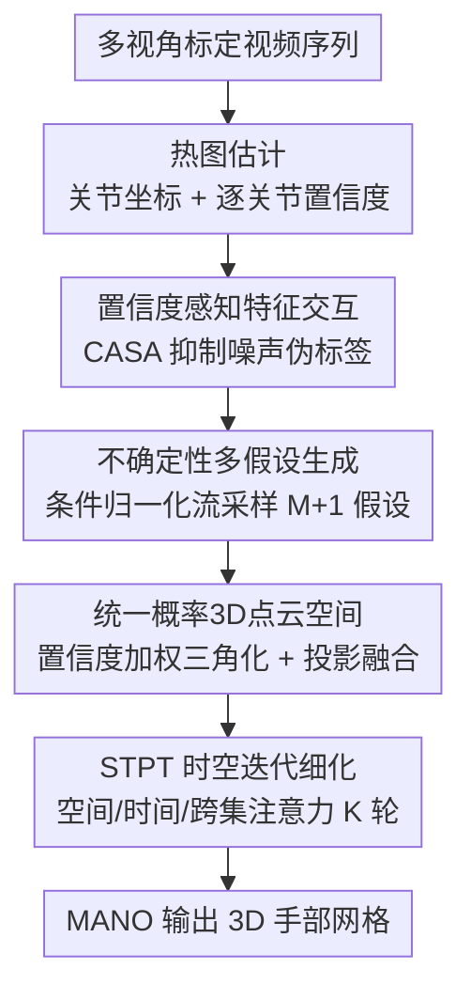

# UST-Hand: An Uncertainty-aware Spatiotemporal Point Cloud Interaction Network for 3D Self-supervised Hand Pose Estimation

**会议**: CVPR2026  
**arXiv**: [2605.17742](https://arxiv.org/abs/2605.17742)  
**代码**: 无  
**领域**: 3D视觉 / 人体理解  
**关键词**: 自监督手部姿态估计, 不确定性建模, 归一化流, 概率点云, 时空注意力

## 一句话总结
UST-Hand 用条件归一化流把每个视角的 2D 手部关节建成一个**概率分布**而非确定点，采样出多个假设后三角化进一个统一的概率 3D 点云空间，再用时空点 Transformer（STPT）迭代细化，从而在只有含噪 2D 伪标签监督的自监督设定下，把多视角手部网格误差（MPVPE）相对前 SOTA 最多降低 37.8%。

## 研究背景与动机
**领域现状**：3D 手部姿态/网格估计在有大规模精标数据时已经做得很好，但精确的 3D 手部标注极其昂贵、耗时。为摆脱标注依赖，自监督方法（如 S2Hand、HaMuCo）改用现成 2D 关节检测器产出的**伪标签**来监督——靠"渲染输出 vs 输入图像的差异"或"多视角一致性"作为优化信号，逐步refine姿态。

**现有痛点**：2D 伪标签本身带有大量噪声（遮挡、截断时尤甚），而现有方法把这些伪标签当成**确定的真值**直接拿来监督，噪声会主导训练、导致网络训练不稳定、过拟合到错误标签上。同时它们大多在 2D 视觉空间里做跨视角交互，没有充分挖掘 3D 空间里的细粒度空间相关性与时序动态。

**核心矛盾**：单视角 2D 估计天然是**有歧义、不确定**的（2D→3D 抬升本身一对多），但确定性方法把这份不确定性"拍平"成一个点，既丢掉了消歧所需的信息，又让噪声无处可去——一旦某个视角的伪标签错了，确定性聚合就会被它带偏（deterministic collapse）。

**本文目标**：① 在监督信号本身就含噪的前提下让训练稳定、不被噪声主导；② 真正利用多视角 + 时序线索在一个连续 3D 空间里做姿态消歧与细粒度时空建模。

**切入角度**：与其消灭单视角估计的不确定性，不如**保留并显式建模**它——把每个视角的关节位置建成一个概率分布，采样出一束假设，让"靠谱的视角多发言、被遮挡的视角少发言但仍参与"，在一个统一的概率 3D 空间里用多视角与时序证据互相消歧。

**核心 idea**：用**条件归一化流**对手部姿态分布建模、采样多假设，把它们抬升进**统一概率 3D 点云空间**，再用**时空点 Transformer**迭代细化——以"概率"替代"确定点"来对抗伪标签噪声。

## 方法详解

### 整体框架
UST-Hand 输入是一组**标定且同步**的多视角视频序列 $\mathcal{I}=\{I_{v,t}\}$（$V$ 个视角、$T$ 帧），输出是 21 个 3D 关节 $\mathcal{J}^{3D}$ 与 778 个 MANO 网格顶点 $\mathcal{V}^{3D}$；训练时**只用**离线 2D 检测器给的伪标签 $\mathcal{J}^{2D}_{\text{pse}}$ 监督，没有任何 3D 标注。整条管线刻意把"2D 检测的噪声"和"3D 抬升"解耦成两个协同阶段：**(1) 概率化的 2D 多假设生成**——先用 CNN 主干出热图与逐关节置信度，经置信度感知交互融合跨视角特征，再用条件归一化流把每视角关节采成一束假设；**(2) 3D 点云时空交互**——把多假设三角化进一个统一概率点云空间，用 STPT 迭代细化后经 MANO 出网格。

### 关键设计

**1. 置信度感知特征交互（CASA）：让低质量伪标签在跨视角聚合里自动闭嘴**

确定性方法的第一个漏洞是"所有视角一视同仁"，被遮挡视角的烂伪标签和清晰视角的好伪标签一起平等地参与融合。UST-Hand 先用残差 CNN 主干出多尺度热图，对每个关节同时解出坐标 $\mathbf{p}_i=\sum_{h_u,h_v}(h_u,h_v)\cdot\tilde{\mathbf{H}}_i$（热图软-argmax）和**置信度** $\text{conf}_i=\max(\mathbf{H}_i)$（热图峰值，作为伪标签可靠性的指示器，后续三角化和 loss 加权都复用它）。构图时把空间感知关节特征 $\mathbf{G}_{\text{pose}}$（SAIGB 从高分辨率特征图取）和关节对齐局部特征 $\mathbf{G}_{\text{jaf}}$（双线性插值取）拼成初始图 $\mathbf{G}_{\text{init}}$，再把置信度**直接拼进特征** $\tilde{\mathbf{G}}=[\mathbf{G}_{\text{init}}\,\|\,\mathbf{c}]$ 后做自注意力 $\text{Attn}=\text{softmax}(\mathbf{QK}^\top/\sqrt{d})\mathbf{V}$。妙处在于：把置信度嵌进 $\mathbf{Q}/\mathbf{K}/\mathbf{V}$ 后，低置信度的 token 天然产生更小的 query/key 幅值、更弱的互相亲和度，于是它们对融合结果的影响被**自适应压低**，而不需要人为设阈值硬剔除。交替堆叠自适应 GCN 与 CASA 层后得到鲁棒的跨视角交互图，经 MLP 出融合特征 $\mathbf{F}_{\text{fuse}}$。

**2. 不确定性多假设生成：用条件归一化流把"一个点"换成"一束假设"**

这是全文的核心。与其相信单视角伪标签是确定真值，UST-Hand 用条件归一化流 RealNVP 学一个**可逆映射**，把隐变量先验 $\mathbf{z}\sim\mathcal{N}(0,I)$ 双向映到 2D 关节位置 $\mathbf{x}$，并以跨视角特征 $\mathbf{F}_{\text{fuse}}$ 为条件：$\mathbf{x}=f_\theta(\mathbf{z};\mathbf{F}_{\text{fuse}})$。其条件分布由变量替换公式给出

$$\hat{p}(\mathbf{x}\mid\mathbf{F}_{\text{fuse}})=p(\mathbf{z})\left|\det\frac{\partial f_\theta(\mathbf{z},\mathbf{F}_{\text{fuse}})}{\partial\mathbf{z}}\right|^{-1}.$$

训练时用逆变换 $f_\theta^{-1}$ 把伪标签拉回隐空间、最大化对数似然 $\log\hat{p}(\mathbf{x}_{\text{pse}}\mid\mathbf{F}_{\text{fuse}})$；推理时从先验采 $M$ 个随机实例 $\mathbf{z}_r$、再取均值得一个关键实例 $\mathbf{z}_0$，经 $f_\theta$ 生成 $M+1$ 个假设 $\{\mathbf{x}_0;\mathbf{x}_r\}$。直觉上，归一化流给每个视角预测的是一个**软的、连续的可靠性分布**，而不是 RANSAC 那种硬几何约束——部分遮挡的视角被降权但仍贡献，不可靠信号被有效压制，从而**显式阻止噪声证据主导后续聚合**，这正是训练稳定性大幅提升的来源。

**3. 统一概率 3D 点云空间：把 2D 不确定性抬升成可推理的 3D 几何场**

光有 2D 多假设还不够，得有个能做多视角 + 时序联合推理的载体。UST-Hand 对采样出的多假设关键点做**置信度加权 DLT 三角化**，在世界坐标里生成点云 $\mathcal{P}=\{P_A;P_Q\}$：由随机采样 $\mathbf{x}_r$ 三角化出的**锚点云** $P_A$ 被**固定**下来，专门保留分布不确定性（相当于"证据库"）；由众数 $\mathbf{x}_0$ 三角化出的**查询点云** $P_Q$ 是细化目标，会动态地从 $P_A$ 聚合信息。为给这个纯几何空间注入视觉语义，把多尺度特征图加上 2D 正弦位置编码 $\mathbf{F}_{\text{ms}}=\mathbf{F}_{\text{ms}}+\mathbf{F}_{\text{PE}}$，再把每个 3D 点投影回各视角图像坐标 $(u_p,v_p)$、双线性插值采集多视角视觉特征，经 bottleneck 融成逐点特征 $\mathbf{F}_P$（即"投影融合模块"）。最终得到一个**同时编码几何与视觉线索**的概率点云空间，为时空交互打底。

**4. 时空点 Transformer（STPT）：在点云上做空间-时间-跨集三重注意力迭代细化**

有了概率点云就要在上面"推理"。STPT 把查询点云 $P_Q=(\mathbf{C}_Q,\mathbf{F}_Q)$ 通过双阶段注意力迭代细化。**空间自注意力**先建帧内几何关系：对每个查询点取 $k$ 近邻，用相对位置编码 $\delta_s=\theta(\mathbf{C}_{Q,i}-\mathbf{C}_{Q,j})$ 捕捉局部结构依赖，得 $\mathbf{F}_Q^{s}$。随后把特征 reshape 成 $(B,T,J,D)$，沿时间轴对每个关节加可学习帧位置编码做**时间自注意力**，捕捉跨帧的手部运动模式 $\mathbf{F}_Q^{st}$。最后是**跨集注意力**：让带时序信息的查询特征与锚点云 $P_A$ 建立跨集对应 $\tilde{\mathbf{F}}_{Q,i}=\text{CrossAttn}(\mathbf{F}_{Q,i}^{st},\{\mathbf{F}_{A,j}\}_{j\in\mathcal{X}_i})$，从而把保留下来的分布不确定性引入细化，并以残差方式更新坐标 $\tilde{\mathbf{C}}_{Q,i}=\mathbf{C}_{Q,i}+\text{FFN}(\tilde{\mathbf{F}}_{Q,i})$。如此迭代 $K$ 轮，逐步把空间邻域、时序运动、锚点分布不确定性三类信息融进姿态；最后用 MANO 从细化后的关节生成显式 3D 手部网格。

### 损失函数 / 训练策略
全程只用离线检测器的 2D 关节作伪标签，总损失为四项加权：
$$\mathcal{L}=\lambda_0\mathcal{L}_{\text{hmap}}+\lambda_1\mathcal{L}_{\text{hm2d}}+\lambda_2\mathcal{L}_{nll}+\lambda_3\mathcal{L}_{\text{proj2d}}.$$
其中 $\mathcal{L}_{\text{hmap}}$ 用 $\sigma=2$ 高斯生成的伪标签热图监督预测热图（MSE）；$\mathcal{L}_{\text{hm2d}}$ 监督从热图解码出的 2D 关节；$\mathcal{L}_{nll}=-\log\hat{p}(\mathbf{x}\mid\mathbf{F}_{\text{fuse}})$ 为归一化流的负对数似然，控制多假设采样的不确定性分布；$\mathcal{L}_{\text{proj2d}}$ 把细化后查询点与 MANO 关节投影回各视角像素空间、用伪标签做 L2，且**逐关节用 $\text{conf}_i$ 加权**——可靠关节权重大、含噪关节权重小，再次让置信度抑制噪声。权重取 $\lambda_0=0.001,\lambda_1=10,\lambda_2=0.1,\lambda_3=10$。训练 30 epoch、batch 8、Adam（lr $3\times10^{-4}$，epoch 20 降十倍），ResNet34 主干，时序滑窗长 5、步长 1，序列边界用复制填充。

## 实验关键数据

### 主实验
三个多视角数据集（HanCo 8 视角、DexYCB-MV 8 视角、OakInk-MV 4 视角），与唯一同样用多视角自监督的前 SOTA HaMuCo、以及强离线检测器 Wilor 对比。MPVPE = 每顶点平均位置误差（778 顶点欧氏距离均值），MPJPE = 每关节平均位置误差（21 关节），PA-* 为 Procrustes 对齐后的变体，AUC-V/J 为 PCK 曲线下面积（阈值 0–50mm），F@5/F@15 为 5mm/15mm 阈值下的 F-score；误差单位 mm。

| 数据集 | 指标 | UST-Hand | HaMuCo | 提升 |
|--------|------|---------|--------|------|
| HanCo | MPVPE↓ | **5.82** | 9.35 | −37.8% |
| HanCo | AUC-V↑ | **0.884** | 0.813 | +8.7%（绝对 +0.071） |
| DexYCB-MV | MPVPE↓ | **8.16** | 9.54 | −14.5% |
| OakInk-MV | MPVPE↓ | **10.02** | 13.04 | −23.2% |

UST-Hand 在三个数据集所有指标上全面领先；对比能直接出 3D 网格的强检测器 Wilor（HanCo MPVPE 12.70）同样大幅领先，说明优势来自网络结构与训练策略而非伪标签本身。

### 消融实验（HanCo，MPVPE）
| 配置 | MPVPE↓ | 相对完整模型 | 说明 |
|------|--------|------|------|
| Full model | 5.82 | — | 完整 UST-Hand |
| w/o heatmap（置信度全设 1） | 6.42 | +10.3% | 去掉置信度加权初始化 |
| w/o projection fusion | 6.14 | +5.5% | 仅拼接 2D 特征、不建几何-视觉对应 |
| w/o STPT（直接从查询特征回归 MANO） | 6.05 | +4.0% | 去掉时空迭代细化 |

三个数据集上去 heatmap 分别掉 10.3% / 9.6% / 17.3%，去投影融合掉 5.5% / 6.6% / 3.9%，去 STPT 掉 4.0% / 7.6% / 7.5%。

### 关键发现
- **置信度加权初始化贡献最大**：去掉 heatmap、把所有置信度设为 1 后掉点最多（HanCo +10.3%，OakInk 高达 +17.3%），印证"用置信度区分伪标签好坏"是对抗噪声的关键开关。
- **对伪标签质量极其鲁棒（Tab.3，HanCo MPJPE）**：低质量 OpenPose 伪标签下 UST-Hand 7.5 vs HaMuCo 8.8（−14.8%）；强 Wilor 伪标签下 5.2 vs 8.7（−26.4%）；用 2D GT 监督的上界下 3.7 vs 6.0（−38.3%）。确定性的 HaMuCo 倾向过拟合伪标签噪声，而本文的不确定性建模能"去噪"。
- **稀疏视角下优势更突出（Tab.2，单帧变体 UST-Hand_t1）**：2/4/6/8 视角下 MPJPE 比 HaMuCo 分别低 2.96 / 3.59 / 3.25 / 3.35mm，即使不用时序线索、即使视角很少也不发生确定性坍塌。
- 预测置信度与关节误差呈显著**负相关**，说明模型学到的置信度真实反映了预测质量。

## 亮点与洞察
- **"保留不确定性"而非"消灭不确定性"的范式转换**：面对含噪监督，主流做法是想办法把伪标签洗干净再当真值用；本文反其道而行，用归一化流把单视角估计建成分布、把噪声留在"锚点云"里当证据，让多视角/时序去消歧——这是对抗噪声监督的一种更优雅的思路。
- **置信度当作"软门控"贯穿全流程**：同一个 $\text{conf}_i$ 既进 CASA 的 Q/K/V、又进三角化加权、还进投影损失加权，一处算出、多处复用，让"低质量信号自动降权"成为系统级的统一机制，而非某一层的局部 trick。
- **锚点-查询双点云解耦"保不确定性"和"出结果"**：锚点云固定以保留分布、查询点云动态细化以出姿态，把"探索证据"与"收敛答案"分到两套点云上——这种"固定证据池 + 可动查询"的结构可迁移到其他需要在噪声证据下迭代推理的 3D 任务。
- 作者把方法定位为"含噪监督下通用铰接物体重建"的范式，思路不限于手。

## 局限与展望
- **强依赖多视角标定**：方法建立在"同步且标定好的多视角视频"上，三角化、跨视角融合都需要相机参数；单目场景虽称支持，但其概率消歧的核心优势来自多视角，单目下收益会打折。
- **伪标签质量仍设天花板**：虽然对噪声鲁棒，但 Tab.3 显示用 2D GT 监督仍明显优于用 OpenPose/Wilor，说明上限仍受检测器质量约束，并非完全摆脱伪标签影响。
- **计算与超参成本**：每帧采 $M+1$ 个假设、STPT 迭代 $K$ 轮、四项损失需要平衡 $\lambda$（跨 3 个数量级），多假设数 $M$、迭代轮数 $K$、滑窗长度等超参对效率/精度的权衡论文未充分给出敏感性分析。
- 评测集中在手部，作者宣称的"通用铰接物体重建"尚未在手以外的对象上验证。

## 相关工作与启发
- **vs HaMuCo**：同为多视角自监督手部姿态，HaMuCo 在 2D 视觉空间做跨视角协同学习、用确定性伪标签，易过拟合噪声；本文把伪标签建成分布、在概率 3D 点云空间做时空交互，鲁棒性与精度全面更优（HanCo MPVPE −37.8%）。
- **vs S2Hand**：S2Hand 开创"靠渲染-输入差异 + 2D 伪标签"的自监督路线，但单视角、确定性；本文继承"用现成 2D 检测器作监督"的思路，但以不确定性建模 + 多视角概率融合解决其训练不稳定问题。
- **vs 既有多假设方法（VAE / 多回归头 / 随机采样 / Ge et al. 离散 refine）**：以往多假设用于缓解 2D→3D 歧义，但多在 2D 或离散阶段细化；本文独特之处是用**条件归一化流**采样视角特定假设、再抬升进**统一概率点云空间**做稳定的时空消歧。
- **vs POEM 等确定性点云手部方法**：POEM 用多视角视锥交集做确定性点云表示；本文显式构建**概率**点云空间，并用 STPT 迭代整合分布不确定性，捕捉细粒度空间相关与时序动态。

## 评分
- 新颖性: ⭐⭐⭐⭐⭐ 用"概率点云 + 归一化流多假设 + 时空点 Transformer"系统性地把不确定性建模引入含噪自监督手部重建，范式有辨识度。
- 实验充分度: ⭐⭐⭐⭐ 三数据集 + 三档伪标签质量 + 稀疏视角 + 逐模块消融较完整，但缺多假设数/迭代轮数等关键超参的敏感性分析。
- 写作质量: ⭐⭐⭐⭐ 两阶段动机清晰、公式完整，部分模块（SAIGB/BLI 等）依赖引用、自包含性一般。
- 价值: ⭐⭐⭐⭐⭐ 显著降低 3D 标注依赖、对伪标签噪声鲁棒，对 AR/VR、手势交互等大规模无标注落地有实际意义。

## 评分
- 新颖性: 待评
- 实验充分度: 待评
- 写作质量: 待评
- 价值: 待评

<!-- RELATED:START -->

## 相关论文

- [\[CVPR 2026\] PAD-Hand: Physics-Aware Diffusion for Hand Motion Recovery](pad-hand_physics-aware_diffusion_for_hand_motion_recovery.md)
- [\[CVPR 2026\] Rethinking Pose Refinement in 3D Gaussian Splatting under Pose Prior and Geometric Uncertainty](rethinking_pose_refinement_in_3d_gaussian_splatting_under_pose_prior_and_geometr.md)
- [\[CVPR 2026\] PointINS: Instance-Aware Self-Supervised Learning for Point Clouds](pointins_instance-aware_self-supervised_learning_for_point_clouds.md)
- [\[CVPR 2026\] SCAPO: Self-Supervised Category-Level Articulated Pose Estimation from a Single 3D Observation](scapo_self-supervised_category-level_articulated_pose_estimation_from_a_single_3.md)
- [\[CVPR 2026\] ForeHOI: Feed-forward 3D Object Reconstruction from Daily Hand-Object Interaction Videos](forehoi_feed-forward_3d_object_reconstruction_from_daily_hand-object_interaction.md)

<!-- RELATED:END -->
