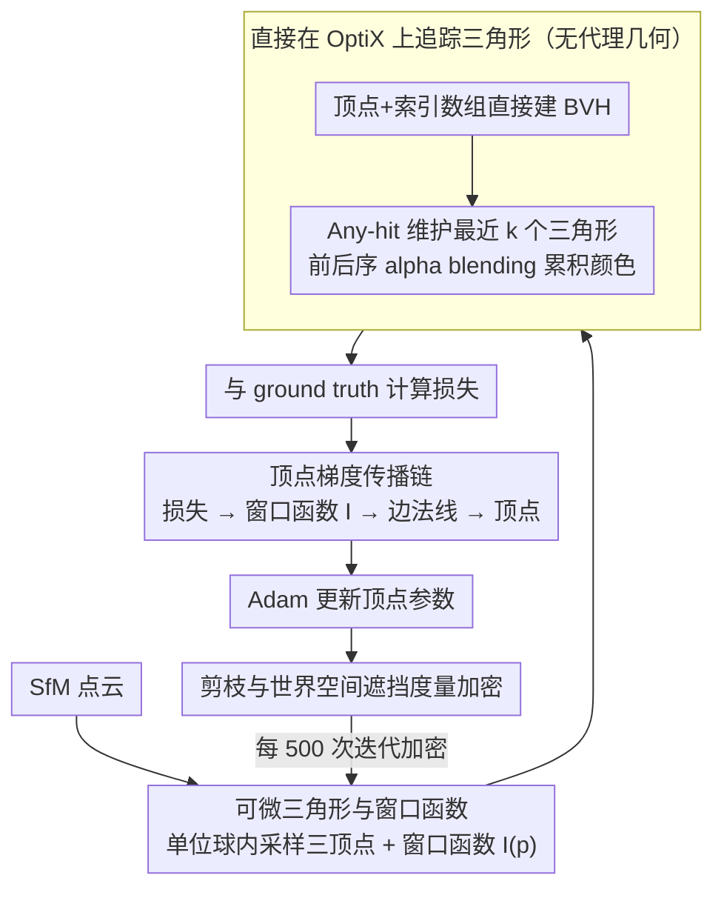

# UTrice: Unifying Primitives in Differentiable Ray Tracing and Rasterization via Triangles for Particle-Based 3D Scenes

**会议**: CVPR 2026  
**arXiv**: [2512.04421](https://arxiv.org/abs/2512.04421)  
**代码**: [https://github.com/waizui/UTrice](https://github.com/waizui/UTrice)  
**领域**: 3D视觉  
**关键词**: 可微光线追踪, 三角形图元, 3D Gaussian Splatting, 新视角合成, BVH加速

## 一句话总结

UTrice 提出以三角形替代高斯椭球作为可微光线追踪的统一图元，无需代理几何体即可直接在 OptiX BVH 中追踪三角形，在保持实时渲染性能的同时显著超越 3DGRT 的渲染质量，并天然兼容光栅化方法 Triangle Splatting 优化的三角形，实现了光栅化与光线追踪的图元统一。

## 研究背景与动机

**领域现状**：3D Gaussian Splatting（3DGS）凭借出色的渲染质量和实时性能成为新视角合成的主流方法。后续工作如 2DGS 用 2D 平面高斯盘替代 3D 高斯、Triangle Splatting（3DTS）进一步用三角形替代高斯，在保真度和训练速度上持续提升。与此同时，光线追踪作为计算机图形学中的经典技术，能够实现景深、折射、环境光照等物理真实效果，3DGRT 率先将光线追踪引入 3DGS 体系。

**现有痛点**：3DGRT 的核心问题在于——高斯核定义在无限光滑的凸支撑上，无法直接作为 BVH 的几何图元。因此 3DGRT 不得不为每个高斯粒子构造一个正二十面体（icosahedron）作为代理几何体来封闭高斯粒子，再在此几何体上进行光线相交测试。这引入了大量额外开销：代理几何的构建耗费内存、BVH 的构建时间占据总运行时间的很大比例、自定义相交测试增加了实现复杂度。

**核心矛盾**：高斯粒子本身不适合同时作为光线追踪和光栅化的统一图元。光栅化方法可以投影后排序混合，但光线追踪需要在 BVH 中进行精确的几何相交，高斯的无界特性使其必须依赖代理几何，导致两套渲染管线使用不同的图元表示，无法统一。

**本文目标**（1）消除光线追踪中对代理几何的依赖，降低 BVH 构建和相交测试的开销；（2）实现光栅化与光线追踪使用同一种图元，使两种渲染管线可以无缝衔接；（3）保持或提升渲染质量的同时维持实时性能。

**切入角度**：作者受 Triangle Splatting 启发——三角形是计算机图形学中最通用的图元，天然支持 BVH 加速结构和硬件光线追踪，不需要任何代理几何。如果能把三角形做成可微的、可优化的图元用于光线追踪，就能一举解决上述所有问题。

**核心 idea**：用可微三角形直接替代高斯+代理几何作为光线追踪图元，通过精心设计的窗口函数和梯度传播链，实现三角形在光线追踪管线中的端到端优化，同时天然兼容光栅化管线。

## 方法详解

### 整体框架

UTrice 的流程如下：输入是 SfM 点云，首先按照 Triangle Splatting 的方式初始化三角形（在单位球内采样三个顶点）。然后计算这些三角形的索引缓冲区，将顶点数组和索引缓冲区直接传入 OptiX 构建 BVH。在光线追踪阶段，每条光线使用 $k$ 元素缓冲区记录最近的 $k$ 个相交三角形信息，迭代处理直到满足终止条件。渲染结果与 ground truth 计算损失后，通过自定义 CUDA kernel 反传梯度到三角形参数，用 Adam 优化器更新。剪枝与世界空间加密周期性地调整三角形分布，整个训练在这个回环里迭代——全程不需要任何代理几何体，三角形直接就是 BVH 中的图元。

### 关键设计

**1. 可微三角形与窗口函数：把硬边三角形变成有平滑梯度的可优化图元**

三角形原本是硬边几何，要么命中要么不命中，没法对它的形状求导。UTrice 给每个三角形配一套连续参数——三个顶点 $\mathbf{v}_1, \mathbf{v}_2, \mathbf{v}_3 \in \mathbb{R}^3$、球谐编码的颜色 $c$（degree 3）、平滑因子 $\sigma$ 和不透明度 $o$——并在光线 $r_o + t r_d$ 与三角形平面的交点 $\mathbf{p}$ 处定义一个窗口函数，把"命中"变成一个有梯度的连续响应：

$$I(\mathbf{p}) = \text{ReLU}\left(\frac{\phi(\mathbf{p})}{\phi(\mathbf{s})}\right)^\sigma$$

其中 $\mathbf{s}$ 是三角形内心，$\phi(\mathbf{p}) = \max_{i \in \{1,2,3\}} L_i(\mathbf{p})$，$L_i(\mathbf{p}) = \mathbf{n}_i \cdot \mathbf{p} + d_i$ 是 $\mathbf{p}$ 到第 $i$ 条边的有符号距离。这个函数在内心处取 1、在三条边上为 0、在三角形外为 0，平滑因子 $\sigma$ 控制内部的衰减快慢：$\sigma \to 0$ 时三角形近似全实心，$\sigma$ 越大响应对位置越敏感。关键区别在于它定义在世界空间而非 3DTS 的图像空间——作者证明在相同 $\sigma$ 下 $I$ 对线性变换保持不变，于是 3DTS 光栅化优化出来的三角形可以原封不动喂给 UTrice 的光线追踪器渲染，这正是"图元统一"成立的数学前提。

**2. 直接在 OptiX 上追踪三角形：省掉代理几何与自定义相交测试**

3DGRT 的麻烦在于高斯核没有边界、不能直接进 BVH，只好给每个高斯套一个正二十面体代理再写自定义相交测试。换成三角形后这层包袱整个消失：OptiX 构建 BVH 只需要顶点数组和索引缓冲区，三角形本来就是硬件光追的原生图元。Ray Generation 程序发射光线，Any-hit 程序用插入排序维护光线方向上最近的 $k$ 个三角形，再按前后顺序做 alpha blending 累积颜色：

$$\mathcal{C} = \sum_{i=1}^{N} T_i \alpha_i c_i, \quad T_i = \prod_{j=1}^{i-1}(1 - \alpha_j)$$

累积透射率低于阈值或遍历完所有三角形时终止。这样既省掉了代理几何的内存与 BVH 构建开销，也省掉了自定义包围盒逻辑；而且接口只吃光线起点和方向数组，不绑定任何相机模型，天然能扩展到 LiDAR、鱼眼等非针孔成像。

**3. 顶点梯度传播链：让损失直接驱动三角形旋转和缩放**

三角形不像高斯那样有显式的位置、尺度参数，它的全部几何信息都藏在三个顶点里，所以优化器必须能把渲染损失一路反传到顶点坐标。UTrice 搭的传播链是：损失 $\to$ 窗口函数 $I$ $\to$ 边法线 $\mathbf{n}_i$ $\to$ 顶点 $\mathbf{v}_i$，其中边法线由叉积构造：

$$\mathbf{N}_i = [(\mathbf{v}_i - \mathbf{v}_{i+2}) \times (\mathbf{v}_{i+1} - \mathbf{v}_{i+2})] \times (\mathbf{v}_{i+1} - \mathbf{v}_i)$$

单位化得 $\mathbf{n}_i = \mathbf{N}_i / \|\mathbf{N}_i\|$。当 $\sigma > 0$ 时三角形内部各点响应不同，这些响应的梯度顺着这条链回到顶点，优化器就能据此旋转、缩放三角形去贴合 ground truth。作者强调这条公式是反复试验才调稳的——叉积加归一化建立起从窗口函数到顶点的可微链路，是让"顶点即唯一可学参数"这个设计真正跑起来的关键。

**4. 剪枝与世界空间遮挡度量加密：在世界空间正确区分大小三角形**

剪枝从三个角度筛掉无用三角形：不透明度过低的删、$\omega = T \cdot o \cdot \rho$（透射率 × 不透明度 × 窗口响应）低于阈值的删、被少于两个相机视角击中的删。加密这一步是从图像空间迁到世界空间后最棘手的地方——3DTS 在图像空间用投影足迹衡量三角形大小，但 UTrice 的优化发生在世界空间，没有图像足迹可用。作者改用世界空间遮挡度量：测量每个顶点到光线原点的向量与三角形质心到光线原点的向量之间的夹角，用角度而非像素面积衡量"占多大"，这样靠近相机的小三角形和远处的大三角形会被等效看待，距离因素天然被纳入。两个机制各管一头：视角剪枝挡住退化三角形产生的极小梯度（否则多重乘法会下溢成 NaN 导致训练崩溃），世界空间遮挡度量让 MCMC 加密在世界空间里仍能分清大小三角形，缺了它训练速度会暴降 5 倍甚至无法收敛。

### 损失函数 / 训练策略

总损失函数为：

$$\mathcal{L} = (1 - \lambda_c)\mathcal{L}_1 + \lambda_c \mathcal{L}_{\text{D-SSIM}} + \lambda_o \mathcal{L}_o + \lambda_n \mathcal{L}_n + \lambda_s \mathcal{L}_s$$

其中 $\mathcal{L}_1$ 和 $\mathcal{L}_{\text{D-SSIM}}$ 分别是像素级和结构相似性损失，$\mathcal{L}_n$ 是法线损失（来自 2DGS），$\mathcal{L}_o$ 是不透明度损失，$\mathcal{L}_s$ 是鼓励三角形面积增大的尺寸损失：$\mathcal{L}_s = 2 \cdot \|(\mathbf{v}_1 - \mathbf{v}_0) \times (\mathbf{v}_2 - \mathbf{v}_0)\|_2^{-1}$。训练使用 PyTorch + 自定义 CUDA kernel，Adam 优化器，加密间隔 500 次迭代，加密从 500 到 25000 次迭代。

## 实验关键数据

### 主实验

在 Mip-NeRF 360 和 Tanks & Temples 数据集上评估，与 3DGS、2DGS、3DTS、3DGRT 对比：

| 方法 | Mip-NeRF360 PSNR↑ | SSIM↑ | LPIPS↓ | T&T PSNR↑ | SSIM↑ | LPIPS↓ |
|------|----------|-------|--------|----------|-------|--------|
| 3DGS | 28.69 | 0.870 | 0.182 | 23.14 | 0.841 | 0.183 |
| 2DGS | 28.56 | 0.862 | 0.190 | 23.13 | 0.832 | 0.212 |
| 3DTS | 28.95 | 0.876 | 0.153 | 23.06 | 0.842 | 0.164 |
| 3DGRT | 28.32 | 0.859 | 0.235 | 22.76 | 0.844 | 0.201 |
| **UTrice** | **28.70** | **0.866** | **0.163** | **22.88** | **0.849** | **0.150** |

UTrice 在 LPIPS 指标上比 3DGRT 提升约 **30%**（0.235→0.163），在 T&T 上提升约 **25%**（0.201→0.150），表明感知质量和细节保留能力显著更优。渲染速度方面：

| 方法 | Mip-NeRF360 FPS↑ | T&T FPS↑ |
|------|----------|----------|
| 3DGRT (performance) | 78 | 190 |
| 3DGRT (quality) | 55 | 143 |
| UTrice | 37 | 119 |

UTrice 比 3DGRT (quality) 慢约 30%，但管线尚未优化，仍属近实时范围。

### 消融实验

| 配置 | PSNR↑ | SSIM↑ | LPIPS↓ | 说明 |
|------|-------|-------|--------|------|
| Full model | 28.70 | 0.866 | 0.163 | 完整模型 |
| w/o 世界空间遮挡度量 | N/A | N/A | N/A | bicycle 场景训练降速 5x，无法收敛 |
| w/o 视角剪枝 | N/A | N/A | N/A | stump 场景出现 NaN，训练崩溃 |
| w/o $\mathcal{L}_n$ | 28.69 | 0.865 | 0.163 | 轻微质量下降 |
| w/o $\mathcal{L}_s$ | 28.54 | 0.864 | 0.164 | 质量下降，三角形数量增加 0.1% |

### 关键发现

- **世界空间遮挡度量是必需的**：没有它 MCMC 加密无法区分大小三角形，直接导致训练崩溃。这是从图像空间迁移到世界空间光线追踪最关键的适配。
- **视角剪枝防止数值不稳定**：退化三角形的极小梯度在多重乘法中会下溢为 NaN，视角剪枝通过移除仅被单视角击中的三角形来避免此问题。
- **3DGRT 在高频区域过度平滑**：高斯核的平滑特性导致细节丢失，甚至在远景区域引入高频颜色噪声（如 truck 场景的玻璃区域）。UTrice 不存在这些问题。
- **UTrice 的图元数量与 3DTS 相当**（Mip-NeRF360 平均 3.32M vs 3.22M），但远少于 3DGRT（3.36M），在 T&T 上优势更明显（2.19M vs 3.88M）。

## 亮点与洞察

- **图元统一是核心贡献**：因为窗口函数在世界空间下对线性变换不变，3DTS 光栅化优化的三角形可以直接用 UTrice 光线追踪渲染。这意味着可以先用快速的光栅化管线训练，再切换到光线追踪管线获得景深、折射等效果，两阶段无缝衔接。
- **消除代理几何的思路很优雅**：3DGRT 的复杂性很大程度来自正二十面体代理和自定义相交测试，UTrice 通过更换图元一次性消除这些问题，BVH 构建变成 OptiX 原生支持的三角形流程。
- **世界空间遮挡度量**是一个可迁移的 trick：任何在世界空间做图元优化的方法（而非图像空间投影）都可以借鉴用角度而非像素面积来衡量图元大小，天然考虑了距离因素。
- **光线输入接口的通用性**：光线追踪器只接受光线起点和方向数组，不依赖任何相机模型，可直接扩展到全景、鱼眼、LiDAR 等非针孔成像系统。

## 局限与展望

- **图元数量偏多**：生成的三角形 soup 没有网格连通性，相邻顶点被冗余存储，增加内存和计算开销。可以考虑共享顶点的 mesh 结构来减少冗余。
- **训练速度慢于 3DGRT 约 2x**：管线包含计算冗余，且缺乏极端三角形（极小/极大）的处理机制。
- **PSNR 不如 3DGS**：平面图元（三角形、2D 高斯）在 PSNR 上普遍不如 3D 高斯，因为 3D 高斯的平滑核可以人为提升 PSNR（但这其实是过度平滑的副作用）。
- **渲染速度有提升空间**：当前实现未经优化（37 FPS vs 55 FPS），工程优化后有望接近甚至超越 3DGRT。
- **仅支持单次弹射**：当前的折射和反射效果仅用单次弹射，未实现完整的介电 BSDF 模型，物理准确性有限。

## 相关工作与启发

- **vs 3DGRT**：3DGRT 用高斯+正二十面体代理进行光线追踪，需要自定义 BVH 图元和相交测试；UTrice 直接用三角形，利用 OptiX 原生支持，BVH 构建更简单高效。UTrice 在 LPIPS 上大幅领先（约30%），但 FPS 略低（37 vs 55）。
- **vs Triangle Splatting（3DTS）**：3DTS 用三角形做光栅化，UTrice 用同样的三角形做光线追踪，两者用相同的图元。UTrice 的渲染质量在感知指标上接近 3DTS，但可以额外获得景深、折射等光线追踪效果。
- **vs 2DGS**：都用平面图元，但 2DGS 用 2D 高斯盘，UTrice 用三角形。三角形更通用且能更好保留高频细节和锐利边缘。
- 这篇论文的"统一图元"思路对任何需要同时支持多种渲染管线的 3D 表示方法都有启发意义。

## 评分

- 新颖性: ⭐⭐⭐⭐ 用三角形替代高斯作为光线追踪图元的思路自然但有效，核心贡献在于可微三角形的梯度设计和世界空间适配
- 实验充分度: ⭐⭐⭐⭐ 在标准数据集上全面对比，消融实验揭示了关键组件的必要性，但缺少更多场景和下游应用验证
- 写作质量: ⭐⭐⭐⭐ 论文结构清晰，动机阐述充分，公式推导完整（含补充材料），图示辅助理解效果好
- 价值: ⭐⭐⭐⭐ 实现了光栅化与光线追踪图元的统一，为后续同时利用两种渲染范式提供了基础框架，实用价值较高

<!-- RELATED:START -->

## 相关论文

- [\[CVPR 2026\] Geometric-Photometric Event-based 3D Gaussian Ray Tracing](geometric-photometric_event-based_3d_gaussian_ray_tracing.md)
- [\[CVPR 2026\] D-Prism: Differentiable Primitives for Structured Dynamic Modeling](d-prism_differentiable_primitives_for_structured_dynamic_modeling.md)
- [\[CVPR 2026\] Prune Wisely, Reconstruct Sharply: Compact 3D Gaussian Splatting via Adaptive Pruning and Difference-of-Gaussian Primitives](prune_wisely_reconstruct_sharply_compact_3d_gaussian_splatting_via_adaptive_prun.md)
- [\[CVPR 2026\] DiffSoup: Direct Differentiable Rasterization of Triangle Soup for Extreme Radiance Field Simplification](diffsoup_direct_differentiable_rasterization_of_triangle_soup_for_extreme_radian.md)
- [\[ICCV 2025\] Radiant Foam: Real-Time Differentiable Ray Tracing](../../ICCV2025/3d_vision/radiant_foam_real-time_differentiable_ray_tracing.md)

<!-- RELATED:END -->
