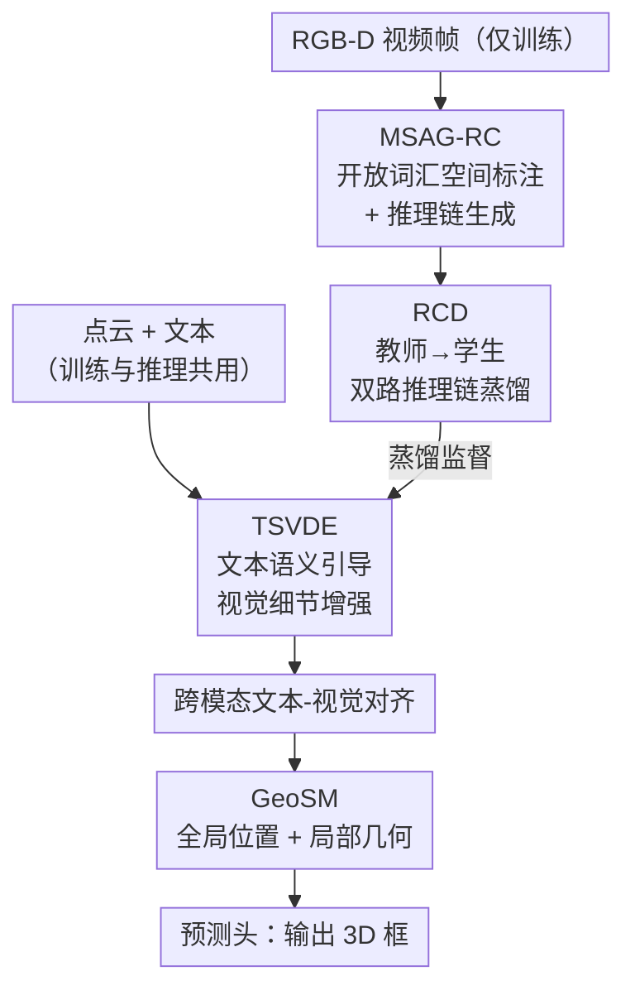

# UZ3DVG: Unaided Zero-Shot 3D Visual Grounding with Generated Language Conditions

**会议**: CVPR 2026  
**论文**: [CVF Open Access](https://openaccess.thecvf.com/content/CVPR2026/html/Tan_UZ3DVG_Unaided_Zero-Shot_3D_Visual_Grounding_with_Generated_Language_Conditions_CVPR_2026_paper.html)  
**代码**: https://github.com/tanwb/UZ3DVG  
**领域**: 3D视觉  
**关键词**: 零样本3D视觉定位, 点云, 推理链蒸馏, 伪标签, 几何感知

## 一句话总结
UZ3DVG 把 VLM 从推理链路里彻底踢出去——只在训练时用它给 RGB-D 场景自动生成「3D 空间描述伪标签 + 推理链」，再把这套推理逻辑蒸馏进一个轻量学生网络，使得推理阶段**只吃点云和文本**、不依赖任何 2D 图像或 LLM/VLM 交互，在 ScanRefer / NR3D 上取得零样本 SOTA 的同时把速度拉到 7.69 FPS（比现有方法快约 38 倍）。

## 研究背景与动机
**领域现状**：3D 视觉定位（3DVG）要在点云场景里根据一句自然语言（"靠右墙的黑桌子，旁边围着椅子"）框出目标物体。主流的全监督方法（EDA、MCLN、TSP3D）精度高，但依赖 ScanRefer / ReferIt3D 这种「语言-3D 框」人工对齐标注，标注成本极高、换个新场景就失灵。

**现有痛点**：为了摆脱标注，零样本路线（ZSVG3D、SeeGround、VLM-Grounder）转而在**推理时**调用 LLM/VLM——把 3D 场景渲染成多视角 2D 图、丢给 VLM 反复多轮对话推理。问题是 VLM 既不能直接读点云，又慢又贵：SeeGround 只有 0.2 FPS、ZSVG3D 0.14 FPS，还得带着 2D 图像和外部大模型一起部署，落地复杂度很高。

**核心矛盾**：零样本的「无需标注」和「VLM 推理」是绑在一起的——你想要 VLM 的开放词汇推理能力，就得忍受它在推理时的高延迟、对 2D 图像的依赖、以及对外部模型的部署耦合。能不能把 VLM 的推理能力「拿走」、但只在训练时用？

**本文目标**：拆成三个子问题——(1) 如何在没有人工标注的情况下，自动从开放场景生成高质量的 3D 空间标注和结构化推理监督；(2) 如何把 VLM 的空间推理逻辑压缩进一个不含 VLM 的轻量网络；(3) 如何让稀疏卷积提取的视觉特征真正具备「左/右/上方」这类空间关系建模能力。

**切入角度**：作者的关键观察是——VLM 在 3DVG 里其实只扮演了「监督信号生产者」的角色，它产出的空间描述和推理链是可以离线生成、一次性蒸馏掉的。换句话说，把 VLM 从「推理时的在线裁判」改造成「训练时的离线老师」。

**核心 idea**：用 VLM 离线生成「空间描述伪标签 + 推理链」当监督，把推理逻辑蒸馏进轻量学生网络，让推理阶段只靠点云+文本独立完成定位（论文称之为 "Unaided" 无外援范式）。

## 方法详解

### 整体框架
UZ3DVG 分**训练**和**推理**两个相位，二者的差别就是这篇论文的核心卖点。

训练时双分支并行：先由 **MSAG-RC**（开放词汇多源空间标注与推理链生成器）把 RGB-D 视频帧转成「3D 空间描述伪标签 + 结构化推理链」；这套监督送进一个大教师网络抽取推理知识，再通过 **RCD**（推理链蒸馏）把推理逻辑传给轻量学生网络；学生侧的文本特征经 **TSVDE**（文本语义引导的视觉细节增强）补充细粒度视觉细节，与 SpConv 点云特征做跨模态对齐后，交给 **GeoSM**（几何感知空间建模）显式建模全局布局和局部几何，最后预测头输出 3D 框。

推理时，MSAG-RC、教师网络、推理链全部丢弃，**只剩点云 + 文本**走学生网络 → 跨模态对齐 → GeoSM → 预测头，独立完成定位。这是它能跑到 7.69 FPS 的根本原因——没有任何 2D 图像渲染或 VLM 调用挂在关键路径上。

### 关键设计

**1. MSAG-RC：把 RGB-D 自动炼成 3D 空间伪标签和推理链**

这一步要解决「零样本没有人工标注、且 2D 图像和 3D 定位之间存在表征鸿沟」的痛点。流程是先用开放词汇检测器（Grounding DINO）在 RGB 图上预测粗 2D 框 $b^{2D}_{i,j}$，再用 SAM2 把框细化成像素级掩码 $M_{i,j}=\mathrm{SAM2}(I_i, b^{2D}_{i,j})$；过滤无效深度后，把有效像素用深度内参 $K_d$ 和相机位姿反投影到场景坐标系：

$$\widetilde{P}_{i,j} = A\, T^{(i)}_{c2w}\, D_i[u,v]\, K_d^{-1}[u,v,1]^\top$$

由点云极值得到轴对齐 3D 伪框 $b^{3D}_{i,j}=[c_{i,j}, s_{i,j}]$，中心 $c_{i,j}=(p^{max}+p^{min})/2$、尺寸 $s=p^{max}-p^{min}$。拿到物体级 3D 几何后，作者设计了一个**符号逻辑式的空间提示构造器**，把类别 $\kappa$、伪框、空间上下文 $C$ 连同标注好目标框的 RGB 图喂给 VLM，生成房间级的自然语言空间描述 $d_{i,j}$；紧接着用预定义模板让 VLM 产出含 **Anchor / References / Reasoning** 三段结构的推理链 $R_{i,j}$，并自检 $R_{i,j}$ 与 $d_{i,j}$ 是否一致、纠正定位失败，最后返回 $(d_{i,j}, R_{i,j}, \gamma_{i,j})$，$\gamma$ 是自评置信度。之所以有效，是因为它不靠任何人工标注就把 2D 基础模型的开放词汇能力「翻译」成了带几何约束的 3D 监督，消融里把它替成纯 2D 描述会让 Acc@0.5 暴跌 16.64 个点。

**2. RCD：双路推理链蒸馏，把 VLM 的推理逻辑塞进轻量学生**

光有推理链监督还不够——基础模型知识和 3DVG 之间存在固有偏移，直接拿推理链当文本喂学生学不到「逻辑」。RCD 用「教师网络 + 学生网络 + 蒸馏损失」三件套解决。**教师网络**分三段：先用冻结的 RoBERTa 把推理链的 Anchor / Reference / Reasoning 分别编码成 $C^{tea}_{chain}$；再用一个**质量门控**按全局文本上下文过滤噪声组件 $C^{filt}_{chain}=\mathrm{Gate}(C^{tea}_{chain}, T_{ovsd})$、配合自注意力建模组件间逻辑依赖；最后把增强后的文本表示与教师视觉特征做三层双向跨模态注意力，产出对齐后的 $(V^{tea}_{out}, T^{tea}_{out})$ 作为蒸馏目标。**学生网络**结构同构但容量更小，它对池化后的全局文本特征用轻量 query 生成器「伪造」出三个推理组件 $R^{stu}_{comp}$ 来模仿教师的 Anchor/Reference/Reasoning，聚合成 $R^{stu}$。

蒸馏在三个层面对齐：推理组件+全局表示一致性 $L_r=L^{comp}_r+L^{global}_r$；更巧的是作者定义了**推理增益** $G^{tea}=T^{tea}_{out}-T_{ovsd}$、$G^{stu}=T^{stu}_{out}-T_{ovsd}$，用 $L_g=L_{cos}+L_{mse}+L_{mag}$ 分别约束增益的方向、归一化幅度和整体增强强度——蒸的不是绝对特征而是「教师把特征增强了多少、往哪个方向增强」这个动态量；视觉侧再用前景-背景混合损失 $L_v=L_{fg}+L_{bg}$ 蒸馏。这套设计让学生在不调用 VLM 的前提下内化了空间推理能力，消融里加上 RCD 带来 2.51 / 2.47 个点的提升。

**3. GeoSM：给稀疏卷积特征补上显式的全局+局部几何**

推理链里满是「左于、上方」这类空间谓词，但 SpConv 提取的视觉特征缺乏显式空间关系建模，导致推理映射不到视觉上。GeoSM 双管齐下补几何：**全局**上把对齐视觉特征对应的坐标归一化、做正弦位置编码

$$\hat{p}_i = 2\cdot\frac{p_i - p_{min}}{p_{max}-p_{min}+\varepsilon} - 1$$

经线性投影得全局布局特征 $f^{pos}_i$；**局部**上对每个点 $p_i$ 建 KNN 邻域，算相对位移 $\Delta p_{ij}=p_j-p_i$，把邻居特征与 $\Delta p_{ij}$ 拼接后过 MLP + max pooling 得局部关系特征 $f^{rel}_i$。两者拼成 $g_i=[f^{pos}_i, f^{rel}_i]$ 再残差加回原视觉特征。它直接补齐了「文本推理 ↔ 3D 结构」对应缺失的那一环，消融里在 TSVDE 之上加 GeoSM 带来 2.40 / 2.29 个点提升。

**4. TSVDE：文本语义引导的视觉细节增强**

推理链需要细粒度视觉证据，但常规上采样会均匀对待所有区域。TSVDE 在上采样阶段用文本语义和推理增强后的视觉特征做**相似度引导采样**，重点放大与文本语义高度对齐的区域，从而把推理链关心的细节补进来。它相对随机采样基线带来约 1.08 / 1.03 个点的提升——是四个模块里增益最小但作为视觉细节入口不可或缺的一环。

### 损失函数 / 训练策略
总损失为定位损失加三项蒸馏损失：

$$L_{total} = \lambda_{rec}L_{rec} + \lambda_g L_g + \lambda_v L_v + \lambda_r L_r$$

其中 $L_{rec}$ 是指代定位损失（含框回归 $L_{bbox}$ 和分类 $L_{cls}$），$L_g$ / $L_v$ / $L_r$ 分别监督推理增益、视觉特征、推理组件的蒸馏；教师预热损失见原文补充材料。训练用 Qwen3-VL-Plus 和 Doubao-seed-1.6 当 VLM 生成伪标签，所有 RGB-D 图像来自与 ScanRefer 验证集**不相交**的场景以避免数据泄漏。

## 实验关键数据

### 主实验
在 ScanRefer 验证集（9508 条描述）上，UZ3DVG 在零样本设定下全面领先，且速度碾压：

| 设定 | 方法 | Overall Acc@0.25 | Overall Acc@0.5 | Multiple Acc@0.5 | FPS |
|------|------|------|------|------|------|
| Mask3D 精炼 | ZSVG3D (CVPR'24) | 36.40 | 32.70 | 24.60 | 0.14 |
| Mask3D 精炼 | SeeGround (CVPR'25) | 44.10 | 39.40 | 30.00 | 0.20 |
| Mask3D 精炼 | **UZ3DVG** | **45.42** | **41.08** | **36.33** | **7.69** |
| 非 Mask3D | ZSVG3D | 20.00 | 17.60 | 14.60 | 0.21 |
| 非 Mask3D | **UZ3DVG** | **43.13** | **35.05** | **31.21** | **9.43** |

带 Mask3D 后处理精炼时比 SeeGround 高 1.32 / 1.68 个点、速度约 38 倍；不带 Mask3D 时直接把 ZSVG3D 拉高 23.13 / 17.45 个点、约 45 倍提速。在最考验空间区分的 "Multiple" 子集上比 SeeGround 高 6.49 / 6.33 个点，说明推理链蒸馏确实带来了更强的空间判别力。NR3D 上（直接用 ScanRefer 训练的 checkpoint 零迁移、不微调）整体 46.5%，比 SeeGround 高 0.4，Hard 子集 40.8% 比 SeeGround 高 2.5，泛化性可观。

### 消融实验
三大模块逐个叠加（ScanRefer，带 Mask3D 精炼）：

| TSVDE | RCD | GeoSM | Acc@0.25 | Acc@0.5 |
|------|------|------|------|------|
| ✗ | ✗ | ✗ | 40.75 | 37.18 |
| ✓ | ✗ | ✗ | 41.83 | 38.21 |
| ✓ | ✓ | ✗ | 43.26 | 39.65 |
| ✓ | ✗ | ✓ | 43.15 | 39.47 |
| ✓ | ✓ | ✓ | **45.42** | **41.08** |

MSAG-RC 的价值单列了一张表，对比直接从 2D 框生成描述：

| 配置 | Acc@0.25 | Acc@0.5 |
|------|------|------|
| 纯 2D Info | 34.16 | 22.83 |
| MSAG-RC（无推理链） | 43.15 (+8.99) | 39.47 (+16.64) |
| MSAG-RC（含推理链） | 45.42 (+2.27) | 41.08 (+1.61) |

### 关键发现
- **MSAG-RC 是最大功臣**：从纯 2D 描述升级到 MSAG-RC 的 3D 投影+上下文增强，Acc@0.5 暴涨 16.64 个点——把 2D 检测「抬」进 3D 并补充空间上下文，对定位精度的影响远超其他模块。
- **三模块互补、缺一不可**：RCD（+2.51/+2.47）≈ GeoSM（+2.40/+2.29）> TSVDE（+1.08/+1.03），三者叠加比单模块累加更高，存在协同效应。
- **伪标签数量有边际递减**：10K→20K→30K 增益明显（Acc@0.25 各 +11.17 / +6.48），但 40K 时仅 +2.06，作者归因于伪标签噪声开始抵消数量收益——盲目扩量不如控质量。
- **VLM 质量直接决定上限**：Doubao-seed-1.6（45.42）略优于 Qwen3-VL-Plus（43.87），说明伪标签质量直接传导到学生的空间推理能力。

## 亮点与洞察
- **范式级创新——把 VLM 从在线裁判改成离线老师**：这是全文最"啊哈"的地方。其他零样本方法默认 VLM 必须在推理时在场，UZ3DVG 证明它的推理能力可以被一次性蒸馏掉，推理时只剩点云+文本，直接换来 38~45 倍提速。这个「在线能力 → 离线监督」的思路可迁移到任何「推理时依赖大模型 API」的任务。
- **蒸"推理增益"而非"绝对特征"**：RCD 里的 $G=T_{out}-T_{ovsd}$ 把蒸馏目标定义成「教师对特征的增强量及方向」，比直接对齐绝对特征更聚焦于推理逻辑本身，是一个很巧的蒸馏视角。
- **结构化推理链当监督**：强制 VLM 输出 Anchor/References/Reasoning 三段式 + 自检置信度，把模糊的"空间推理"显式化成可蒸馏的结构，这种「让大模型产出结构化中间产物再蒸馏」的做法值得复用。
- **几何先验显式注入**：GeoSM 用正弦位置编码（全局）+ KNN 相对位移（局部）补齐 SpConv 缺失的空间关系，是低成本嫁接几何归纳偏置的实用方案。

## 局限与展望
- **精度仍落后全监督**：在 Multiple 子集上 MCLN（40.76）、TSP3D（46.71 Overall）等全监督方法精度更高，UZ3DVG 卖的是「零标注 + 高速」，绝对精度还有差距。
- **强依赖伪标签质量与 VLM 选型**：消融已显示换 VLM 会有 1.5+ 个点波动、伪标签噪声在 40K 后反噬，整个学生的上限被离线 VLM 的生成质量牢牢卡住——这是「离线蒸馏」范式的固有软肋。
- **依赖 RGB-D 训练数据**：虽然推理时只要点云，但训练阶段 MSAG-RC 需要带深度和位姿的 RGB-D 序列，对纯点云数据集或缺标定的场景不友好。
- **可改进方向**：可探索伪标签自动质检/过滤（按 $\gamma$ 置信度加权或剔除噪声链）、或引入主动学习只对高价值场景生成伪标签，缓解 40K 后的噪声边际递减。

## 相关工作与启发
- **vs ZSVG3D / SeeGround（零样本 3DVG）**：它们在推理时把 3D 渲染成 2D 多视角图、多轮调 VLM，慢（0.14~0.2 FPS）且依赖外部模型；UZ3DVG 把 VLM 移到训练侧蒸掉，推理只用点云+文本，精度反超、速度快 38~45 倍。这是本文最核心的对比。
- **vs 全监督 3DVG（EDA / MCLN / TSP3D）**：它们靠人工「语言-3D 框」标注拿高精度但换场景失灵；UZ3DVG 用 VLM 自动生成伪标签换来零标注泛化，精度逼近但仍略低。
- **vs 弱监督 WS-3DVG**：弱监督整体只有 22% 上下，UZ3DVG 的零样本伪标签路线（45.42）显著更强。
- **启发**：「把推理时调用的大模型蒸馏成离线监督」这条路线对所有受 LLM/VLM 推理延迟困扰的任务都有借鉴意义——只要大模型的角色是「产出可结构化的中间监督」，就有机会用蒸馏换部署效率。

## 评分
- 新颖性: ⭐⭐⭐⭐⭐ 「VLM 从在线推理裁判改造为离线监督老师」是真正的范式级转变，而非增量改进。
- 实验充分度: ⭐⭐⭐⭐ 两个主基准 + 模块/VLM/伪标签量/MSAG-RC 四组消融充分，但缺更大规模场景和更多 VLM 的稳健性测试。
- 写作质量: ⭐⭐⭐⭐ 动机清晰、训练/推理相位对比鲜明，公式与模块命名稍密，初读需对照框架图。
- 价值: ⭐⭐⭐⭐⭐ 38~45 倍提速 + 零标注 + 纯点云部署，对机器人/AR/VR 这类资源受限的实时 3DVG 落地价值很高。

<!-- RELATED:START -->

## 相关论文

- [\[CVPR 2026\] MonoVLM: Monocular 3D Visual Grounding with Vision Language Models](monovlm_monocular_3d_visual_grounding_with_vision_language_models.md)
- [\[CVPR 2026\] Zero-Shot Depth Completion with Vision-Language Model](zero-shot_depth_completion_with_vision-language_model.md)
- [\[CVPR 2026\] ORD: Object-Relation Decoupling for Generalized 3D Visual Grounding](ord_object-relation_decoupling_for_generalized_3d_visual_grounding.md)
- [\[CVPR 2025\] SeeGround: See and Ground for Zero-Shot Open-Vocabulary 3D Visual Grounding](../../CVPR2025/3d_vision/seeground_see_and_ground_for_zero-shot_open-vocabulary_3d_visual_grounding.md)
- [\[CVPR 2026\] Zoo3D: Zero-Shot 3D Object Detection at Scene Level](zoo3d_zero-shot_3d_object_detection_at_scene_level.md)

<!-- RELATED:END -->
