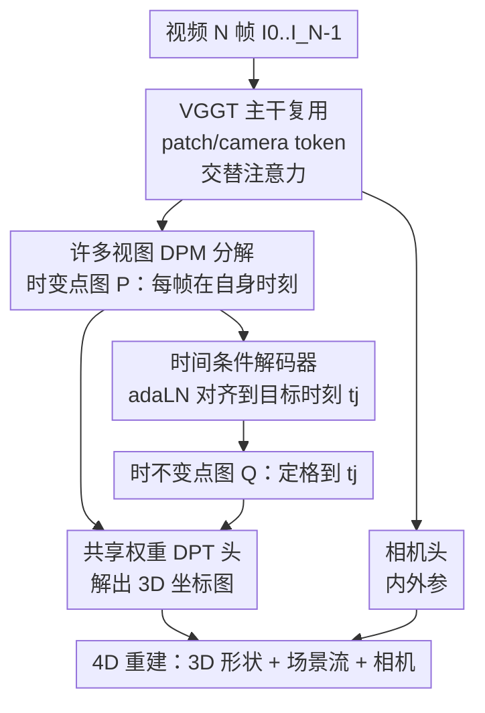

# V-DPM: 4D Video Reconstruction with Dynamic Point Maps

**会议**: CVPR 2026  
**论文**: [CVF Open Access](https://openaccess.thecvf.com/content/CVPR2026/html/Sucar_V-DPM_4D_Video_Reconstruction_with_Dynamic_Point_Maps_CVPR_2026_paper.html)  
**领域**: 3D视觉 / 4D 动态重建  
**关键词**: 动态点图, 前馈 4D 重建, 场景流, VGGT, 视频深度

## 一句话总结
V-DPM 把只能处理图像对的「动态点图（Dynamic Point Map, DPM）」扩展到整段视频，通过一个「时变 + 时不变」两阶段点图分解和一个时间条件解码器，在预训练好的静态重建器 VGGT 上只用少量合成数据微调，就实现了单次前馈的 4D 重建——同时恢复出 3D 形状、相机参数和场景中每个点的运动，2-view 误差比此前 SOTA 低约 5 倍。

## 研究背景与动机
**领域现状**：前馈式 3D 重建近年进展很快，核心推手是 DUSt3R 提出的「视点不变点图（point map）」——它把 3D 形状和相机运动统一编码成一张和图像同分辨率的「3D 坐标图」，非常适合神经网络直接回归。后续工作（VGGT、Fast3R 等）进一步把它从图像对扩展到多视图单次前馈，得到又快又准的多视图重建器。

**现有痛点**：点图的原始定义假设场景是**静态**的，无法表达运动。可现实应用（影视、机器人、AR）几乎都要重建会动、会形变的动态场景。已有的 4D 工作要么不用点图（MonST3R 之外的一类），要么虽然用点图却必须额外挂一个 2D 点追踪器才能拿到场景流，管线割裂。

**核心矛盾**：Dynamic Point Map（DPM，[17]）本来已经解决了「同时表达 3D 形状 + 3D 运动 + 相机内外参」的统一表示问题，做到视点不变**且**时间不变。但它和 DUSt3R 一样只算**图像对**的 DPM——一旦输入超过两张图，就得退回到逐对预测 + 优化后处理来融合，既慢又丢失了跨帧的时序上下文。而且怎么把成对 DPM「正确地」推广到多帧并不显然：朴素地让三个下标都遍历 $N$ 个时刻会产生 $N^3$ 张点图，计算上不可行。

**本文目标**：设计一个能**一次前馈**吃下整段视频、直接吐出 4D 重建（每个像素的 3D 位置 + 它随时间的运动）的网络，而且不需要从头训练或海量 4D 标注数据。

**切入角度**：作者发现两件事可以利用。其一，$N^3$ 张点图是高度冗余的——只要把所有点图都表达到同一个参考视点 $\pi_0$，相机一旦恢复，其余视点的点图都能由刚体变换推出，于是 $N^3$ 直接降到 $N^2$。其二，VGGT 这类在**静态**数据上预训练的强重建器，其输出的点图和动态场景所需的「时变点图」只差一点点，完全可以拿来当底座微调，绕开 4D 数据稀缺的瓶颈。

**核心 idea**：把多视图 4D 重建拆成「先预测时变点图 $\mathcal{P}$、再用一个时间条件解码器把它们对齐到统一参考时刻得到时不变点图 $\mathcal{Q}$」两步，整体只需预测 $2N-1$ 张点图，并把这套结构嫁接到 VGGT 上少量微调。

## 方法详解

### 整体框架
V-DPM 的输入是一段视频的 $N$ 帧 $I_0,\dots,I_{N-1}$（带时间戳 $t_i$，实际可当作帧索引），输出是两组点图：一组**时变**点图 $\mathcal{P}$，描述每帧在它**自己时刻**的 3D 形状；一组**时不变**点图 $\mathcal{Q}$，把所有帧的点都对齐到一个**统一参考时刻** $t_j$。有了这两组、再加上相机内外参，就能完整重建出动态场景的 3D 形状、相机运动，以及每个像素随时间的 3D 运动（场景流）。

DPM 表示记为 $P_i(t_j,\pi_k)\in\mathbb{R}^{3\times H\times W}$：下标 $i$ 表示这张点图的像素和图像 $I_i$ 对齐，$\pi_k$ 是表达坐标用的参考视点，$t_j$ 是这些 3D 点所处的时刻——关键就在于 $t_j$、$\pi_k$ 都**可以不等于**图像本身的 $t_i$、$\pi_i$，正是这种「错位」让同一套表示能同时编码形状与运动。比如检查 $P_0(t_0,\pi_0)(u)=P_1(t_0,\pi_0)(v)$ 即可判断两帧像素是否对应（都拉到同一时刻同一视点）；而 $P_0(t_1,\pi_0)(u)-P_0(t_0,\pi_0)(u)$ 就直接是像素 $u$ 的场景流。

整体计算分两阶段串行（见下图）：阶段一让网络预测时变点图 $\mathcal{P}$（每帧在自己时刻、统一视点 $\pi_0$ 下的 3D 点），这部分和 VGGT 原本输出的静态点图几乎同构，所以能直接复用预训练权重；阶段二用时间条件解码器，把阶段一的特征「搬运」到目标时刻 $t_j$，输出时不变点图 $\mathcal{Q}$。改变 $t_j$ 只需重跑解码器、复用主干计算，因此能高效地把整个场景「定格」到任意时刻。

### 关键设计

**1. 多视图 DPM 分解：把 $N^3$ 张点图压成两套共 $2N-1$ 张**

朴素地把 DPM 推广到 $N$ 帧，会让图像下标 $i$、时刻下标 $j$、视点下标 $k$ 各自遍历 $N$ 个值，产生 $N^3$ 张点图，根本算不动。作者的第一刀是「视点归一」：所有只在视点 $\pi_k$ 上不同的点图，彼此只差一个刚体变换，因此一旦相机被恢复，把全部点图都表达到公共视点 $\pi_0$ 即可，无损地把 $N^3$ 砍到 $N^2$。但 $N^2$ 仍然太多，于是第二刀是只挑两个有用子集、并让它们**先后**计算：

阶段一预测**时变点图** $\mathcal{P}=(P_0(t_0,\pi_0), P_1(t_1,\pi_0),\dots,P_{N-1}(t_{N-1},\pi_0))$，即每帧在它**自己时刻**、统一视点下的 3D 点；它视点不变但时间不变性缺失，所以不能直接拿来算场景流，但它和 MonST3R、以及 VGGT 现成输出的点图几乎一样，便于复用预训练。阶段二预测**时不变点图** $\mathcal{Q}=(P_0(t_j,\pi_0),\dots,P_{N-1}(t_j,\pi_0))$，把所有帧的点都「搬」到同一参考时刻 $t_j$，从而同时拿到视点和时间不变性。两套加起来恰好 $2N-1$ 张（$\mathcal{P}$ 有 $N$ 张，$\mathcal{Q}$ 在固定 $t_j$ 时与 $\mathcal{P}$ 共享第 $j$ 张）。这个「先 $\mathcal{P}$ 后 $\mathcal{Q}$」的分解之所以聪明，是因为它把「恢复视点+时间不变表示」这个难任务拆成两个网络更好学的逻辑步骤：要确定 $P_1(t_j,\pi_0)$（点在 $t_j$ 时刻的位置），第二阶段只需把阶段一已算好的 $P_1(t_1,\pi_0)$ 和 $P_j(t_j,\pi_0)$ 做匹配，推断点「怎么移动」即可。

**2. 时间条件解码器：用目标时刻 token + adaLN 把点「定格」到任意时刻**

阶段二的核心难点是：目标时刻 $t_j$ 不再对应任何一帧输入，必须作为**额外输入**喂进去，并让网络跨所有帧推理运动、把动态点对齐到这个共同时刻。作者为此加了一个**时间条件 Transformer 解码器**，由交替的帧内注意力（frame attention）和全局注意力（global attention）块组成，处理的是和时变点图 DPT 头**同一批**主干特征 $\hat{p}_i$；解码器迭代地把这些特征对齐到 $P_j(t_j,\pi_0)$（其特征保持不变作为锚点）。

「告诉解码器目标时刻是 $t_j$」靠两个改动实现：其一，在 VGGT 输入端额外塞一个**目标时刻 token** $t_j$，经主干变成输出 token $\hat{t}_j$；其二，解码器的每个 Transformer 块用**自适应 LayerNorm（adaLN）** 做条件化（沿用 FiLM/DiT 思路）——去掉 LayerNorm 里学到的 scale/shift，改用 $\hat{t}_j$ 的线性投影来调制归一化后的 patch token，自注意力输出再被第二个投影 gate 一道。这样做的好处是把「时刻」这一连续条件以一种轻量、可微的方式注入每一层，且不破坏特征分布；更妙的是推理时主干只跑一次得到 $\hat{p}_i$，之后想定格到哪个时刻，只需换 $\hat{t}_j$ 重跑解码器，$t_j$ 变化时省掉绝大部分计算。解码器输出最后过一个**与原 VGGT 共享权重**的 DPT 点图头，保证输出特征分布和主干一致。

**3. 嫁接预训练 VGGT + 少量合成数据微调：绕开 4D 标注稀缺**

4D 重建最大的现实障碍是大规模动态 4D 数据极难获得。V-DPM 的应对是**最大化复用静态预训练**：直接拿在纯静态场景上训练、但性能极强的 VGGT 当主干。VGGT 输入图像、输出相机、逐帧深度和点图；V-DPM 删掉冗余的深度预测分支，复用它从四层主干抽 token、经 DPT 头解码点图的机制来产出时变点图 $\mathcal{P}$，相机姿态回归器原样保留来出内外参，只在其上新增时间条件解码器并整体微调。微调用一个**静态 + 动态混合**数据集（静态：ScanNet++、BlendedMVS；动态：Kubric-F、Kubric-G、PointOdyssey、Waymo），按 DPM 的处理方式扩展成视频片段，训练时采样 5/9/19 帧片段（更长片段利于泛化到复杂运动），用 DPM 的置信度校准损失加 VGGT 的相机姿态回归损失监督。与 DPM 不同的一点细节是：把 GT 点图缩放到「到原点单位平均距离」，让网络像 VGGT 那样自行预测正确尺度。整套方案证明了一个有价值的判断——在静态数据上学到的强先验，只用「适度的算力 + 合成数据」就能改造成动态重建器。

### 损失函数 / 训练策略
监督信号 = DPM 的置信度校准点图损失 + VGGT 式相机姿态回归损失。训练混合静态与动态数据集，按 5/9/19 帧采样视频片段；GT 点图归一到单位平均范数、尺度交由网络预测。受硬件限制只能微调到 20 帧片段，但实测能泛化到约 50 帧；更长序列（数百帧）在测试时用滑动窗口 + 类似 DUSt3R/MonST3R 的 bundle-adjustment 优化，把重叠窗口的预测融合起来（用窗口级约束而非两视图法的成对约束）。

## 实验关键数据

### 主实验：2-view 4D 重建（End-Point Error，越低越好）
在 PointOdyssey / Kubric-F / Kubric-G / Waymo 四个数据集上，按 DPM 协议采样两帧（间隔 2 或 8 帧），在第一帧视点 $\pi_0$ 的世界坐标系下评 EPE（隐含考察相机估计与点追踪精度）。下表取间隔 2 帧、各数据集四张点图的平均量级对比：

| 方法 | PointOdyssey | Kubric-F | Kubric-G | Waymo |
|------|------|------|------|------|
| St4RTrack | ~0.147 | ~0.149 | ~0.182 | ~0.226 |
| TraceAnything | ~0.161 | ~0.070 | ~0.087 | ~0.150 |
| DPM | ~0.115 | ~0.032 | ~0.040 | ~0.083 |
| **V-DPM** | **~0.031** | **~0.018** | **~0.024** | **~0.064** |

V-DPM 在全部四个 benchmark 上明显领先，比此前最好的 St4RTrack / TraceAnything 误差约低 5 倍，比同样用点图的 DPM 也低一个量级——证明在 VGGT 上做 V-DPM 是有效策略，且静态预训练模型经适度微调确能泛化到动态场景。

### 视频级 3D 稠密追踪（10 帧片段，Tracking EPE）
采样 10 帧（每帧间隔 2）的片段，追踪第一帧的 3D 点，评平均 EPE。这组实验同时充当**消融**，对比「整段视频联合处理」与「退回成对预测」：

| 方法 | PointOdyssey | Kubric-F | Kubric-G | Waymo | 说明 |
|------|------|------|------|------|------|
| DPM | 0.114 | 0.088 | 0.109 | 0.103 | 只能成对预测，无时序上下文 |
| V-DPM（2 帧输入） | 0.037 | 0.066 | 0.079 | 0.094 | 退化成成对运行 |
| **V-DPM（整段视频）** | **0.032** | **0.027** | **0.035** | **0.042** | 联合处理全片段 |

DPM 在视频设定下精度相比两视图明显下滑（无法利用时序上下文），而 V-DPM 保持与两视图实验相近的精度；把 V-DPM 强行退化成「逐对输入」也会显著掉点——说明**整段视频联合推理时序动态**正是 V-DPM 的关键增益来源。

### 视频深度估计（Sintel / Bonn）
作为旁证（这两个数据集缺长程追踪标注，只能评时变点图质量）：

| 方法 | Sintel AbsRel↓ | Sintel δ<1.25↑ | Bonn AbsRel↓ |
|------|------|------|------|
| MonST3R | 0.335 | 58.5 | 0.063 |
| DPM | 0.311 | 58.0 | 0.064 |
| VGGT（骨干） | 0.242 | 65.9 | 0.056 |
| **V-DPM** | 0.247 | 69.4 | 0.057 |
| $\pi^3$（并发工作） | 0.210 | 72.6 | 0.043 |

V-DPM 大幅超越除并发工作 $\pi^3$ 外的全部已有方法；落后 $\pi^3$ 作者归因于规模——$\pi^3$ 用了 14 个公开数据集 + 内部动态集训练，V-DPM 只用 6 个，且 $\pi^3$ 本身比 V-DPM 的骨干 VGGT 还强。相机姿态估计（Sintel/TUM-dynamics，报 ATE / RPE trans / RPE rot）结论类似：V-DPM 有竞争力，仅被 $\pi^3$ 超过。

### 关键发现
- **联合视频处理 > 成对处理**：V-DPM 全片段 EPE 比「退化成 2 帧输入」普遍更低（如 Kubric-F 0.027 vs 0.066），整段推理带来的时序上下文是核心增益；而 DPM 受困于成对预测，视频场景下掉点严重。
- **静态预训练可迁移到动态**：把纯静态训练的 VGGT 仅用少量合成 4D 数据微调，就拿下 2-view SOTA，说明强静态先验 + 时间条件解码器这条「轻量改造」路线成立。
- **差距来自数据/骨干规模而非方法**：唯一压过 V-DPM 的 $\pi^3$ 靠更多训练数据和更强骨干取胜，作者预期把 V-DPM 架在 $\pi^3$ 上能进一步提升——这是方法正交性的有力证据。
- **统一表示的独特价值**：与 P3 等 VGGT 动态扩展只恢复动态深度不同，V-DPM 凭 DPM 同时恢复出每个点的 3D 运动（场景流），定性上轨迹更平滑、更自洽，且在 fishtank、网球选手等他法失败的序列上仍能合理重建。

## 亮点与洞察
- **「先时变、后时不变」的两阶段分解很巧**：把「同时实现视点+时间不变」这个难目标拆成两个网络好学的逻辑步骤——先在各自时刻重建（同构于静态点图，可复用预训练），再用解码器对齐到统一时刻（只需做点图间匹配推运动）。这种「分解到能复用现成能力」的思路可迁移到任何想给静态前馈模型加时间维的任务。
- **目标时刻当成可控 token + adaLN 调制**：把「定格到哪个时刻」做成连续条件注入，使得主干跑一次、解码器按需切换 $t_j$，既省算力又让「连续时间查询」成为一等公民。这套时间条件化机制对视频/4D 生成类任务普遍有借鉴价值。
- **$N^3\to N^2\to 2N-1$ 的复杂度收敛**：用「视点归一靠刚体变换可推」+「只取两个有用子集」把组合爆炸压回线性级，是把理论表示落地为可前馈网络的关键工程洞察。
- **最「啊哈」之处**：一个**从未见过动态数据**的静态重建器，只靠适度合成数据微调就成了 4D SOTA——再次印证大规模预训练学到的几何先验有很强的跨任务迁移性。

## 局限与展望
- **依赖骨干上限**：V-DPM 性能被 VGGT 骨干封顶，视频深度/相机姿态上输给 $\pi^3$ 主要因为后者骨干更强、训练数据更多；作者明确建议换用 $\pi^3$ 当骨干来缩小差距，说明当前结果未触及方法天花板。
- **长序列依赖优化后处理**：受硬件限制只能微调到 20 帧（测试泛化约 50 帧），数百帧序列仍需滑动窗口 + bundle-adjustment 优化融合——这部分又回到了「前馈 + 优化」混合模式，并非纯前馈，长视频的端到端能力仍是开放问题。
- **训练数据规模偏小**：仅用 6 个数据集，作者自承规模是落后并发工作的主因；动态 4D 数据稀缺仍是根本瓶颈，合成数据的 sim-to-real 差距对真实复杂运动的影响未充分量化。
- **缺乏系统消融**：除「联合视频 vs 成对」外，对时间条件解码器的注意力设计、adaLN vs 其他条件化方式、片段长度等超参的独立消融较少，部分设计的必要性论证偏弱。

## 相关工作与启发
- **vs DUSt3R / VGGT（静态点图）**：它们只输出静态点图、无法表达运动；V-DPM 复用其架构与预训练权重，新增时变/时不变两套点图和时间条件解码器，把静态重建器升级成 4D 重建器——是「站在静态巨人肩上做动态扩展」。
- **vs DPM（原始动态点图，[17]）**：DPM 首创时间+视点不变的统一表示，但只算图像对、多帧需优化后处理融合；V-DPM 把它原生扩展到整段视频、单次前馈出 $2N-1$ 张点图，利用全片段时序上下文，视频场景下误差低一个量级。
- **vs MonST3R / St4RTrack / TraceAnything**：这些 4D 方法要么不用统一点图、要么需额外 2D 追踪器拿场景流；V-DPM 用一套 DPM 表示同时给出形状、运动、相机，2-view EPE 约低 5 倍且轨迹更平滑。
- **vs P3 / $\pi^3$（VGGT 的动态扩展）**：P3 类方法只恢复动态深度；V-DPM 凭 DPM 额外恢复每点 3D 运动。$\pi^3$ 因更强骨干 + 更多数据在深度/姿态上略胜，但与 V-DPM 的表示创新正交，可叠加。

## 评分
- 新颖性: ⭐⭐⭐⭐ 把成对 DPM 原生扩展到视频、用两阶段分解 + 时间条件解码器实现单次前馈 4D，表示与架构层面都有清晰创新。
- 实验充分度: ⭐⭐⭐⭐ 覆盖 4D 重建、视频追踪、视频深度、相机姿态多任务且对比充分，2-view 提升显著；但独立模块消融偏少。
- 写作质量: ⭐⭐⭐⭐ 表示动机与 $N^3\to2N-1$ 推导讲得清楚，图文配合到位；部分实现细节需对照附录。
- 价值: ⭐⭐⭐⭐ 给「静态重建器→4D」提供了一条数据高效、可与更强骨干叠加的实用路线，对机器人/AR/影视的动态重建有直接应用价值。

<!-- RELATED:START -->

## 相关论文

- [\[CVPR 2026\] PackUV: Packed Gaussian UV Maps for 4D Volumetric Video](packuv_packed_gaussian_uv_maps_for_4d_volumetric_video.md)
- [\[CVPR 2026\] Vista4D: Video Reshooting with 4D Point Clouds](vista4d_video_reshooting_with_4d_point_clouds.md)
- [\[ICCV 2025\] Dynamic Point Maps: A Versatile Representation for Dynamic 3D Reconstruction](../../ICCV2025/3d_vision/dynamic_point_maps_a_versatile_representation_for_dynamic_3d_reconstruction.md)
- [\[CVPR 2026\] 4D Reconstruction from Sparse Dynamic Cameras](4d_reconstruction_from_sparse_dynamic_cameras.md)
- [\[CVPR 2026\] Motion 3-to-4: 3D Motion Reconstruction for 4D Synthesis](motion_3-to-4_3d_motion_reconstruction_for_4d_synthesis.md)

<!-- RELATED:END -->
