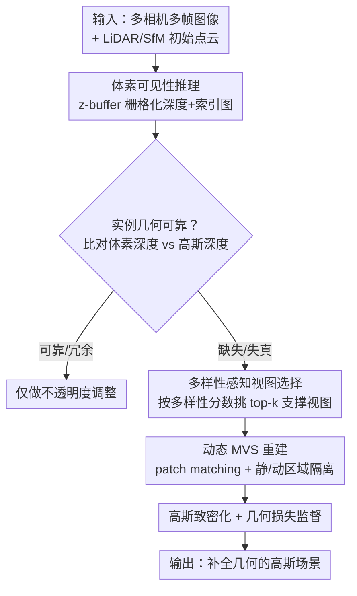

# VAD-GS: Visibility-Aware Densification for 3D Gaussian Splatting in Dynamic Urban Scenes

**会议**: CVPR 2026  
**论文**: [CVF Open Access](https://openaccess.thecvf.com/content/CVPR2026/html/Zhang_VAD-GS_Visibility-Aware_Densification_for_3D_Gaussian_Splatting_in_Dynamic_Urban_CVPR_2026_paper.html)  
**代码**: 项目页 mias.group/VAD-GS/（代码待确认）  
**领域**: 3D视觉  
**关键词**: 3D高斯泼溅、动态城市场景、可见性推理、多视图立体、致密化

## 一句话总结
VAD-GS 针对自动驾驶城市场景里点云稀疏、相机视野几乎不重叠的问题，用体素可见性推理主动找出几何缺失/失真的实例，再挑选跨相机跨时刻的支撑视图做多视图立体（MVS）重建，把缺失结构补成可靠的几何先验来初始化新高斯，并首次把这套 MVS 致密化扩展到运动物体上，在 Waymo 和 nuScenes 上同时刷新了渲染质量和几何一致性。

## 研究背景与动机

**领域现状**：3D 高斯泼溅（3DGS）能实时合成高保真新视角，在城市场景重建（StreetGaussians、OmniRe、PVG 等）里被广泛扩展。它的标准做法是从 SfM 或 LiDAR 累积得到初始点云，训练时只靠对已有高斯做 clone / split（克隆 / 分裂）来加密，靠光度误差的梯度去优化几何。

**现有痛点**：这套范式有两个致命假设在城市场景里站不住。第一，质量强依赖初始点云的完整性——而车载多相机是向外朝向、相邻相机重叠常常低于 15%，立体匹配不可靠；nuScenes 用 32 线 LiDAR，每帧才约 34k 点，覆盖严重不均，大量结构（比如超出 LiDAR 垂直视野的交通标志牌）根本没有初始点。第二，clone/split 只能从"已有"高斯里复制，无法凭空重建"缺失"的结构。

**核心矛盾**：当某块几何在初始点云里缺失时，渲染产生的光度误差会被错误地"甩锅"给后面的背景结构（标志牌后的树、建筑），梯度于是把本不该动的、被遮挡的或不可见的高斯也拿去 split/clone。结果是：对训练视角的渲染看着变好了，但底层几何被扭曲，换个没见过的视角就露馅（深度图、法向图全乱）。这是被动响应光度误差的范式本身的缺陷。

**已有改进的不足**：GeoTexDensifier、DNGaussian 加深度/法向先验引导分裂，但只能修"已有高斯"的区域，对完全没初始点的空洞无能为力；GaussianPro 用 patch matching 补几何点云，能处理未初始化区域，但只适用于静态场景、且只用单相机相邻帧，丢掉了长程时序和跨相机线索，无法处理动态物体。

**核心 idea**：与其被动跟着光度误差走，不如**主动评估结构完整性、主动重建**——用体素可见性推理判断哪块几何不可靠，挑出能提供最强立体约束的支撑视图，用 MVS 把缺失结构补出来当几何先验，并把这套流程扩展到运动中的物体。

## 方法详解

### 整体框架
VAD-GS 的输入是城市场景的多相机多帧图像 + LiDAR/SfM 初始点云，输出是补全了缺失几何、并被几何先验约束过的高斯场景。整条管线针对**每一个**静态或动态实例独立运转：先把初始点云体素化并做可见性推理，逐实例比对"体素深度 vs 高斯渲染深度"来判定它是否几何缺失/失真；对被标记的实例，按一个多样性分数挑出 top-k 支撑视图（跨相机、跨时刻），喂给 patch matching 式 MVS 做稠密重建；重建出的可靠 3D 点既用来初始化新高斯（致密化），又作为深度/法向监督加进损失里。整个致密化通过 CUDA 嵌进高斯训练框架，每次约 48 ms、且只在检测到缺失时触发，开销可忽略。

### 关键设计

**1. 体素可见性推理：用 z-buffer 把"谁可见"算清楚，再据此定位几何缺失**

痛点是：直接用单视图取点覆盖太少，把所有时刻的点云堆一起又没有遮挡意识——射线会穿过被遮挡的结构，导致对不可见几何的错误更新。VAD-GS 先把初始点云体素化以保证均匀密度，把每个体素的可见性定义为其内部点所关联观测视图的并集（LiDAR 点来自单帧，SfM 点至少由两视图三角化）。然后用经典 z-buffering 对"可见体素"做栅格化，得到两张图：一张**栅格化深度图**（比稀疏点云+最近邻搜索更稠密可靠，深度误差被限制在体素分辨率内，且天然剔除藏在不完整前景后面的被遮挡体素，从源头防止训练时的错误更新）；一张**2D 索引图**（只存每条像素射线上第一个被命中且可见的体素索引，建立"像素↔3D 结构"的映射，可快速查 3D 位置、法向、邻接关系）。

定位缺失靠一个直白的深度比对：用离线实例分割把车、树、建筑等切成实例，按索引图把每个实例的像素映射到对应体素，对每个实例比两个深度——体素 z-buffer 深度 $d_{voxel}$ 与高斯泼溅渲染深度 $d_{gs}$。若 $d_{gs}$ 持续小于 $d_{voxel}$，说明几何已补全或只是可接受的冗余，调不透明度即可；若 $d_{gs}$ 缺失或显著大于 $d_{voxel}$，说明几何要么没初始化、要么早期优化时被扭曲了，该实例就被标记为需要重初始化。实现上用了双阈值：当渲染深度/体素深度之比 > 1.1，或某实例 >25% 的像素累积不透明度 < 0.7 时触发重初始化。

**2. 多样性感知视图选择：用一个几何分数挑出立体约束最强的支撑视图**

痛点是：MVS 重建质量极度依赖选哪些视图。静态场景里单相机连续帧能提供足够重叠，但驾驶场景同时有动态物体和持续自车运动，必须从不同相机、不同时刻里选视图才能兼顾视锥重叠和三角化质量。作者定义了一个量化两视图几何多样性的分数：

$$s = \frac{N \, d_R^\top d_S}{\sqrt{t_x^2 + t_y^2}} \cdot \frac{1}{|t_z| + \epsilon} \cdot \sin\theta$$

其中 $N$ 是参考视图与支撑视图共同可见的体素数，$d_R, d_S$ 是这 $N$ 个体素到各自视点的距离向量，$t=(t_x,t_y,t_z)^\top$ 是两视图相对平移，$\theta$ 是朝向角差，$\epsilon$ 保数值稳定（公式形式以原文为准）。直观上：体素越密越近、横向位移（$t_x,t_y$）越大、纵向位移（$t_z$）越小、朝向差越大，分数越高——这恰好对应"立体线索强"的条件。基于这个分数为每个参考视图取 top-k 子集（实现里用最大权重 k-clique 优化，最大化候选视图间的两两相似度之和，$k=4$），同时考虑支撑视图之间的两两多样性，避免选到一堆几乎一样的视角。

**3. 扩展到动态物体的 MVS 重建：用可见体素当遮挡感知的分割提示，隔离静/动区域**

痛点是：patch matching 式 MVS 在静态场景成熟（假设局部平面，像素 $p=(u,v)^\top$ 关联一个局部 3D 平面 $z\,n^\top K^{-1}\tilde{p} + d = 0$，把参考视图的平面假设 $(d,n)$ 经 $\tilde{p}' \simeq K(R - \frac{tn^\top}{d})K^{-1}\tilde{p}$ 投到支撑视图，warp patch 后查 RGB 光度一致性 + 深度/法向几何一致性，迭代传播邻域候选），但对动态物体失效。理论上刚体车辆可通过把所有观测视图变换到其局部坐标系当成静态处理，可实践中难点在于精确的前景/背景掩膜：3D 框导出的掩膜分不清前景背景边界，混进背景像素会误导匹配、破坏运动物体的局部几何一致性假设；而实例分割掩膜虽更贴边界，却对提示（prompt）质量很敏感——单帧 LiDAR 提示覆盖不全，时序聚合点云提示又会混进不相关的遮挡结构。

VAD-GS 的巧解是：用第 1 步栅格化得到的**可见体素**当分割提示——它本身就带遮挡线索，能提供更准的实例级 prompt。于是 patch matching 被限制在"全部相关视图里的静态区域内 或 动态区域内"，跨区域干扰被压到最低，重建精度大幅提升。另外，高斯渲染结果被当作 patch matching 的合理初始猜测，在缺乏一致匹配时显著减少随机重采样的迭代次数。

### 损失函数 / 训练策略
总损失是四项加权和：

$$L = L_{color} + \lambda_{normal} L_{normal} + \lambda_{hard} L_{hard} + \lambda_{soft} L_{soft}$$

其中 $L_{color}$ 是渲染图与观测图的光度差；$L_{normal}$ 是渲染法向与 patch matching 法向的角度偏差；$L_{hard}$、$L_{soft}$ 分别用固定不透明度和可学习不透明度衡量深度误差。实现里 $\lambda_{normal}=0.02$、$\lambda_{depth}=0.1$，$\lambda_{hard}$ 在训练进行到 80% 后关闭；训练视图无放回采样以缓解采样不均导致的光度过拟合；体素可见性致密化每完成 5 个完整采样周期执行一次。全部实验在单张 RTX 4090 上完成。

## 实验关键数据

### 主实验
Waymo Open（8 个动态序列，每序列约 100 帧，5 相机 + 5 LiDAR、每帧约 177k 点）。PSNR* 表示只在动态物体上评测。

| 方法 | PSNR↑ | PSNR*↑ | SSIM↑ | LPIPS↓ |
|------|-------|--------|-------|--------|
| 3DGS | 29.64 | 21.25 | 0.918 | 0.117 |
| EmerNeRF | 30.87 | 21.67 | 0.905 | 0.133 |
| PVG | 31.82 | 24.68 | 0.910 | 0.122 |
| OmniRe | 31.12 | 25.20 | 0.902 | 0.123 |
| StreetGS | 34.61 | 30.23 | 0.938 | 0.079 |
| **VAD-GS** | **35.59** | **31.31** | **0.950** | **0.047** |

VAD-GS 在所有指标上全面领先：PSNR 较次优约 +2.8%，动态物体 PSNR* 约 +3.6%，SSIM/LPIPS 各超次优 0.012 / 0.032。作者特别说明：Waymo 上的提升只反映了策略潜力的一小部分，因为为公平比较被迫沿用 baseline 的"仅前向相机"设置，恰好限制了 VAD-GS 最大的优势——跨相机线索。

nuScenes（32 线 LiDAR、每帧约 34k 点，更稀疏不均，更考验初始化和致密化）逐场景结果（节选，"#G"为高斯数）：

| 场景 | StreetGS PSNR↑ | StreetGS SSIM↑ | VAD-GS PSNR↑ | VAD-GS SSIM↑ |
|------|------|------|------|------|
| Scene 00 | 22.87 | 0.65 | **25.54** | **0.81** |
| Scene 03 | 24.18 | 0.77 | **26.57** | **0.88** |
| Scene 06 | 23.58 | 0.70 | **25.64** | **0.83** |
| Scene 05 | 20.20 | 0.50 | 20.06 | **0.56** |

在大多数场景上 SSIM 提升超 0.06、PSNR 增益超 0.78 dB。例外是 Scene 05：自车走直线轨迹导致视点采样稀疏、跨相机重叠极小，退化成等价于单相机独立重建，跨相机线索几乎用不上。

### 消融实验
nuScenes 上去掉单个组件（三组件相互依赖，去掉可见性推理会连带禁用其余组件）：

| 配置 | PSNR↑ | PSNR*↑ | SSIM↑ | LPIPS↓ | 说明 |
|------|-------|--------|-------|--------|------|
| w/o 体素可见性推理 | 23.79 | 22.75 | 0.753 | 0.215 | 仅光度致密化，几何被扭曲 |
| w/o 视图选择 | 23.92 | 22.83 | 0.757 | 0.212 | 固定连续帧，前后景误匹配生 floater |
| w/o 几何损失 | 24.59 | 22.78 | 0.764 | 0.194 | 光度指标略好但大视角偏移下表面粗糙 |
| 完整模型 | 24.51 | **23.16** | **0.765** | 0.199 | 动态物体 PSNR* 与几何一致性最佳 |

### 关键发现
- **体素可见性推理是地基**：去掉它（连带禁用其余组件）PSNR 掉到 23.79，几何被错误梯度严重扭曲——它既是定位缺失的依据，也是后续视图选择/MVS 的输入来源。
- **视图选择主要救动态与 floater**：去掉后用固定连续帧，静态区域致密化尚可，但缺乏静/动分离会产生严重 floater 伪影。
- **几何损失是个有意思的反直觉点**：去掉它光度指标（PSNR/LPIPS）反而略好，因为纯靠图像相似度会过拟合外观；但完整模型在动态物体 PSNR* 和大视角偏移下的几何质量更优，说明几何损失牺牲一点训练视角光度换来了泛化几何。
- **高斯数略增是定向加密而非冗余膨胀**：VAD-GS 的 #G 偏高，源于对欠表达区域的针对性致密化，而非在已初始化良好区域的无控增长。

## 亮点与洞察
- **从"被动响应"到"主动重建"的范式转变**：以往致密化是跟着光度误差的梯度走，VAD-GS 主动评估结构完整性、主动用立体几何补洞——这是它能修复纯光度方法修不了的"完全缺失结构"的根本原因。
- **可见体素一物三用很巧**：同一套 z-buffer 栅格化既给出稠密深度监督、又给出像素↔3D 索引映射、还顺手当上了遮挡感知的实例分割提示，避免了"单帧 LiDAR 提示覆盖不全 / 聚合点云提示混入遮挡"的两难。
- **把静态 MVS 扩展到动态多相机**是真正的工程贡献：通过把刚体变换到局部坐标系 + 用可见体素做静/动区域隔离，让 patch matching 在运动物体上也能工作，这是 GaussianPro 等做不到的。
- **可迁移思路**：把"渲染深度 vs 几何先验深度"的比对当作触发重建的信号，这种"先判断哪里不可靠再定向修"的思路，可迁移到其他 NVS/重建任务里替代无差别的全局加密。

## 局限与展望
- **刚性假设是硬伤**：作为放宽动态 MVS 假设的代价，方法对物体施加刚体约束。对行人这类可变形/非刚体物体，致密化退化回标准的梯度致密化——这也是它在以行人为主的几个场景里 LPIPS 不是最优的原因。作者把非刚体运动的处理留作未来工作。
- **依赖外部模块**：流程依赖离线实例分割网络的质量，分割不准会直接影响实例级缺失判定和 MVS 区域隔离。
- **跨相机线索受轨迹制约**：当自车走直线、视点稀疏时（如 Scene 05），跨相机重叠太小，方法优势几乎消失，退化成单相机重建。
- **几何完成缺乏定量评估**：未见轨迹下没有几何真值，结构补全的好坏只能靠偏离视角的定性可视化佐证，无法定量量化。

## 相关工作与启发
- **vs StreetGaussians / OmniRe / PVG**：它们把动态前景建成刚体高斯组、复合动态图或周期振动高斯，但新高斯仍靠 clone/split 从已有高斯生成，重建质量受初始点云完整性绑架；VAD-GS 用跨相机跨时刻的 MVS 主动补出缺失几何，故在稀疏的 nuScenes 上拉开差距。
- **vs GeoTexDensifier / DNGaussian**：它们加深度/法向先验引导分裂，但只能改善"已有高斯"的区域，对完全未初始化的空洞无能为力；VAD-GS 能在没有初始点的区域生成新高斯。
- **vs GaussianPro**：同样用 patch matching 补几何，但 GaussianPro 限于静态场景、只用单相机相邻帧，丢失长程时序和跨相机线索；VAD-GS 把 MVS 一致性扩展到动态、多相机驾驶场景，既做致密化又做场景一致性约束。

## 评分
- 新颖性: ⭐⭐⭐⭐ 把"主动可见性推理 + 多相机跨时刻 MVS"引入动态城市 3DGS 致密化，并首次扩展到运动物体，思路清晰且填补了 GaussianPro 留下的动态空白。
- 实验充分度: ⭐⭐⭐⭐ Waymo + nuScenes 双数据集、逐场景结果 + 消融齐全；但缺几何完成的定量评估，且 Waymo 上被迫用单相机设置削弱了核心优势的展示。
- 写作质量: ⭐⭐⭐⭐ 动机推导扎实、图示（可见性推理、视图选择）到位；部分公式符号偏密，需对照原文细读。
- 价值: ⭐⭐⭐⭐ 直击自动驾驶仿真里稀疏点云重建的真实痛点，对工业级街景重建有实用价值，刚性假设是主要适用边界。

<!-- RELATED:START -->

## 相关论文

- [\[CVPR 2026\] Urban-GS: A Unified 3D Gaussian Splatting Framework for Compact and High-Fidelity Aerial-to-Street Reconstruction](urban-gs_a_unified_3d_gaussian_splatting_framework_for_compact_and_high-fidelity.md)
- [\[CVPR 2026\] NVGS: Neural Visibility for Occlusion Culling in 3D Gaussian Splatting](nvgs_neural_visibility_for_occlusion_culling_in_3d_gaussian_splatting.md)
- [\[CVPR 2026\] Part$^{2}$GS: Part-aware Modeling of Articulated Objects using 3D Gaussian Splatting](part2gs_part-aware_modeling_of_articulated_objects_using_3d_gaussian_splatting.md)
- [\[CVPR 2026\] Uncertainty-driven 3D Gaussian Splatting Active Mapping via Anisotropic Visibility Field](uncertainty-driven_3d_gaussian_splatting_active_mapping_via_anisotropic_visibili.md)
- [\[CVPR 2026\] Space-Time Forecasting of Dynamic Scenes with Motion-aware Gaussian Grouping](space-time_forecasting_of_dynamic_scenes_with_motion-aware_gaussian_grouping.md)

<!-- RELATED:END -->
