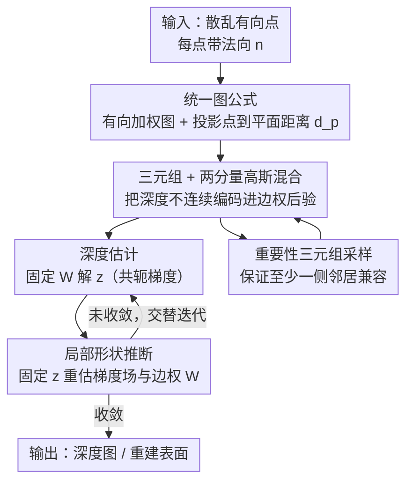

# Variational Graph-based Normal Integration

**会议**: CVPR 2026  
**论文**: [CVF Open Access](https://openaccess.thecvf.com/content/CVPR2026/html/Chen_Variational_Graph-based_Normal_Integration_CVPR_2026_paper.html)  
**领域**: 3D视觉 / 表面重建 / 法向积分  
**关键词**: 法向积分, 深度不连续, 有向加权图, 变分推断, 散乱点云

## 一句话总结
本文把"法向图 → 深度"的法向积分问题重写成有向加权图上的一个统一优化目标，用三元组 + 两分量高斯混合显式建模深度不连续，再用变分推断交替求解深度和图权重；它不仅在规则网格上超过当前 SOTA（BiNI），还能直接处理 BiNI 这类方法做不了的散乱点（scattered oriented points）。

## 研究背景与动机
**领域现状**：法向积分（normal integration）是一个经典的逆问题——给定一张法向图，反推出每个像素的深度，是光度立体（photometric stereo）、shape-from-shading、单视图稠密重建等低层 3D 视觉任务的关键后处理。主流做法把表面当成一个标量高度场 $z(u,v)$，在规则网格上存储梯度 $p=-n_x/n_z,\ q=-n_y/n_z$，然后最小化一个能量泛函（式 1），用 PDE 求解器去积分。当前最强的是 Bilateral Normal Integration（BiNI）及其变体，它在局部邻域里用一种半可微的连通模式去参数化权重函数，从而能处理深度不连续（depth discontinuity）。

**现有痛点**：这套范式被"规则网格"绑死了。深度不连续会在空间上造成不规则性，而基于网格的数值微分（沿固定的 $u/v$ 轴做轴对齐差分）天然抓不住这种不规则。更要命的是，今天的数据越来越多以**散乱有向点**（scattered oriented points，每点有位置 + 法向但没有规则拓扑）的形式出现，BiNI 这类需要规则网格 + 轴对齐比较器的方法根本不直接支持这种输入。

**核心矛盾**：作者点出问题的根在于"模型复杂度"和"求解器复杂度"成反比——你想要一个足够灵活、能用随机分布的点参数化表面并显式建模深度不连续的几何模型，又想要一个能稳定处理这些点、可靠估计参数的优化器，两者是耦合的。现有方法把这两件事拆开硬凑：场守恒（field conservation）靠单独的启发式例程加，深度不连续靠逐像素、轴对齐的比较器处理，整个流程零碎且不统一。

**本文目标**：给"半可微表面"（semi-differentiable surface，即分片光滑、允许若干深度断裂的表面）设计一个统一的框架，既能表达深度不连续，又能稳定地恢复深度，而且对输入是规则网格还是散乱点**一视同仁**。

**核心 idea**：把法向积分搬到**有向加权图**上——每个点是一个顶点，每条有向边编码两点间的几何兼容性（用一个"投影点到平面距离"度量），边权 $w_{ij}$ 表示这条边是否跨越了深度断裂；于是积分变成在图上最小化加权点到平面距离的最优化问题，再用变分推断把"深度"和"图权重"当成两组变量交替推断。

## 方法详解

### 整体框架
输入是一组从表面采样的有向点（每点带法向 $\vec{n}$），输出是每个点沿视线方向的深度 $z$（或在透视情形下的 log-depth $d$）。方法分三步搭起来：

1. **建图**：按点的 $x\text{-}y$ 坐标离线建一个有向图（如 KNN，$K=8$），每条有向边写下一条"点 $i$ 到点 $j$ 所在切平面"的正交方程，并定义**投影点到平面距离** $d_p(i,j)$ 来量化两点的几何兼容性。整张图上 $\sum_{ij} w_{ij} d_p(z_i,z_j)$ 就是统一的加权最小二乘目标（式 7），网格数据和散乱数据共用这一个目标。

2. **配三元组 + 高斯混合**：把每个中心点和它的两个邻居组成一个三元组，用两分量高斯混合把它建模成"由两个邻居联合采样生成的样本"，深度不连续就体现为后验概率（边权）的失衡。

3. **变分推断交替优化**：固定权重 $W$ 解深度 $\vec{z}$（深度估计阶段），固定深度推断权重 $W$（形状推断阶段），两阶段交替迭代。直观上这相当于让一张初始平面"连续形变"逼近目标形状。

整个 pipeline 是一个清晰的交替迭代环路，画成框架图：

### 关键设计

**1. 有向加权图统一公式：用"投影点到平面距离"把网格和散乱点统一起来**

痛点是现有方法把表面当成网格上的标量高度场、靠轴对齐数值差分，既绑死了规则拓扑也抓不住不规则的深度断裂。本文换了个几何视角：给每条从点 $i$ 指向邻居 $j$ 的有向边，写一条正交条件 $(\vec{x}_i + d_{ij}\vec{r}_i - \vec{x}_j)\cdot\vec{n}_j = 0$，其中 $\vec{r}_i$ 是 $i$ 的投影射线。把它展开就得到**投影点到平面距离**

$$d_p(i,j) = (\bar{x}_j-\bar{x}_i)\cdot\vec{n}_j + (z_j - z_i)\,\vec{r}_i\cdot\vec{n}_j,$$

这是一个非对称的符号距离，当两点共面（无深度断裂）时它为零。于是法向积分被改写成在所有有向边上最小化 $\sum_{i,j} w_{ij}\, d_p(z_i,z_j)$（式 7），其中 $w_{ij}\in[0,1]$ 是边权，0 表示两点完全脱离（跨越深度断裂）、1 表示完全相关。这个公式之所以强，是因为它只依赖点坐标 + 法向 + 图连通性，对正交投影（物体空间，式 4）和透视投影（log-depth 空间，把 $n_z,\Delta z$ 换成变换后的 $\bar{n}_z,\Delta u,\Delta v$）是同一套，对网格点和散乱点也是同一套——不需要切换模式或特殊配置。这正是 BiNI 做不到散乱点的根因被绕开的地方：BiNI 的距离定义在深度而非几何上、且邻域轴对齐，而这里的 $d_p$ 定义在几何上、邻域由图连通性给出。

**2. 三元组 + 两分量高斯混合：把深度不连续变成可闭式求解的后验概率**

边权 $w_{ij}$ 该怎么定？作者用**三元组**（triplet）来推断：中心点 $\vec{x}_0$ 连着两个邻居 $\vec{x}_{+1},\vec{x}_{-1}$，构成两条边、两个 $d_p$。把 $\vec{x}_0$ 建模成由两个邻居所在高斯分量**联合采样**生成的样本（式 8）：

$$p(\vec{x}_0) = \pi_{+1}\mathcal{N}(\vec{x}_0\,|\,\vec{x}_{+1},\vec{n}_{+1}) + \pi_{-1}\mathcal{N}(\vec{x}_0\,|\,\vec{x}_{-1},\vec{n}_{-1}),$$

其中每个分量取 $\mathcal{N}(\vec{x}_0|\vec{x}_{+1},\vec{n}_{+1}) = e^{-d_p^2(0,+1)\cdot k}$，$k$ 是衡量几何兼容度的精度变量。这样边权就直接是后验概率，且有闭式：

$$w_{0,+1} = \sigma_k\!\big(d_p^2(0,-1) - d_p^2(0,+1)\big),\qquad w_{0,+1}+w_{0,-1}=1,$$

$\sigma_k$ 是被 $k$ 调节的 sigmoid。这个设计的精妙在于它把"三种邻域连通情形"自然区分开：无深度断裂时两个 $d_p$ 近似相等、边权各半；断裂只切在一侧时 $|d_p(0,-1)-d_p(0,+1)|$ 很大、权重明显偏向兼容那侧；两侧都断裂（中心点完全脱离）时无法推断——这第三种情形通过采样（设计 4）排除掉。作者明确指出 BiNI 是这套框架的一个**受限特例**：BiNI 的三元组是确定性、轴对齐的，隐含等先验，精度 $k$ 固定且距离定义在深度而非几何上；本文则放开成随机三元组、位置自适应的 $k$、几何距离。

**3. 变分推断交替优化：把深度恢复看成"形状连续形变"**

式 11 的最优性条件 $D_z^\top W D_z\,\vec{z} = -D_z^\top W\vec{b}$ 里，深度 $\vec{z}$ 和权重矩阵 $W$ 互相依赖，没法一步解。作者在变分推断框架下交替估计：把 $\vec{z}$ 看成由某个被 $W$ 配置的形状所生成的样本，每轮迭代 $t$ 执行两步——**深度估计**（给定 $W^t$，用共轭梯度从式 11 解出 $\vec{z}^{t+1}$，相当于把每个点沿视线移到其两个邻居所"期望"的位置）和**局部形状推断**（给定 $\vec{z}^{t+1}$，重估梯度场 $\vec{g}(x,y)$，再据式 10 反推新的 $W^{t+1}$）。形状推断这一步特意去估梯度场而非逐点独立算，是为了捕捉"同一顶点被多个三元组共享"带来的依赖、做到图上一致的推断；估到 $\vec{g}$ 后由 $g_x n_z=n_x,\ g_y n_z=n_y,\ n_z=1/\sqrt{g_x^2+g_y^2+1}$ 还原法向 $\vec{n}^t$，再喂回式 10。这个交替过程有一个干净的几何解释：表面从初始配置（如一张平面）**连续形变**逼近目标几何，类似 EM 里交替学习两分量高斯混合的结构。位置自适应精度 $k(\vec{n}_{gt},\vec{n}_{est})=1-\vec{n}_{gt}\cdot\vec{n}_{est}$（式 14，用估计法向与上一轮的余弦距离）让"距离差异只在中心点很可能脱离某邻居时才容易被检测到"，从而把不连续判定做得更稳。

**4. 重要性三元组采样：避开"中心点和两边都不兼容"的退化配置**

三种邻域情形里，第三种（中心点和两个邻居都被断裂切开）什么都推不出来，而当 $\vec{x}_{-1},\vec{x}_{+1}$ 共位时这种情形又常发生。作者用**重要性边采样**保证每个三元组至少一侧兼容、且两条边在图像平面上充分分离：先选与中心最兼容（$d_p$ 最小）的邻居 $\vec{x}_{0,+1}$ 确保单侧附着，再选 $\vec{x}_{0,-1}$ 使三元组两边夹角最接近 $\pi$；第二个三元组同理，但为避免共线，让 $\vec{x}_{0,+2}$ 与第一条边夹角接近 $\pi/2$。每个邻域取 4 个邻居组成 2 个三元组（半可微表面定向至少需要 $K\ge 2$）。这一步把不可解的配置在采样阶段就过滤掉，是整套迭代能稳定收敛的实际保障。

### 损失函数 / 训练策略
本方法是纯优化、无学习参数。核心是式 7 的加权最小二乘目标，落到式 11 的加权正规方程 $D_z^\top W D_z\,\vec{z} = -D_z^\top W\vec{b}$，深度估计和梯度场估计（式 13，$\Delta_{xy}^\top W\Delta_{xy}\,\vec{g}=-\Delta_{xy}^\top W\Delta_z$）都用**共轭梯度**求解大规模稀疏系统（用 Scipy 实现）。另有一个保守更新策略：把高频成分引起的 $d_p$ 裁剪为 $\min(d_p(i,j),\delta z_{ij})$，抑制噪声法向带来的抖动。

## 实验关键数据

### 主实验
评测指标是 Mean Absolute Depth Error（MADE，越低越好），主数据是 DiLiGenT-MV，用网格表示验证向后兼容性。下表为正交投影、正视图（front）下各物体的 MADE：

| 方法 | bear | buddha | cow | pot | reading |
|------|------|--------|-----|-----|---------|
| **GNI（本文）** | **0.60** | **1.91** | 5.62 | **0.59** | **2.42** |
| BiNI | 0.74 | 2.07 | **0.65** | 1.30 | 14.73 |
| IPF | 24.29 | 8.23 | 2.50 | 4.07 | 33.59 |
| MD | 0.68 | 6.73 | 1.67 | 1.33 | 10.50 |

GNI 在 5 个模型里 4 个优于 BiNI（仅 cow 落后），在 reading 上从 14.73 降到 2.42 提升尤其大。侧视图（side）结论一致，GNI 同样 4/5 优于 BiNI。透视投影 + 真实 DiLiGenT 数据（Tab 5）上，除自遮挡严重的 goblet 外，GNI 在大多数物体上也略优于或持平 BiNI（如 harvest 3.34→2.83，reading 0.32→0.26）。

### 消融实验
散乱点（Halton 采样约保留 20% 点、彻底打掉轴对齐）上，比较有无三元组采样（正视图 MADE）：

| 配置 | bear | buddha | cow | pot | reading | 说明 |
|------|------|--------|-----|-----|---------|------|
| GNI（含三元组采样） | 1.26 | 6.05 | 18.72 | 1.29 | 5.08 | 完整模型 |
| GNI（去三元组采样） | 1.91 | 7.71 | 35.70 | 1.73 | 10.14 | 关掉边重加权的基线 |

去掉三元组采样后所有物体误差显著上升（cow 从 18.72 翻到 35.70、reading 从 5.08 翻到 10.14），证明三元组配置对深度边的保持是关键。侧视图上同样的趋势（如 reading 17.62→31.23）。

### 关键发现
- **三元组采样是处理深度不连续的核心模块**：关掉它误差普遍翻倍，pot、reading 侧视图这类深度边明显的物体退化最严重。
- **网格 vs 散乱表现一致但散乱会"放大"误差**：跨表保持同样的相对优劣排序，但散乱表示让误差被放大（如 cow 正视图退化明显），原因是深度断裂常与遮挡区重合，散乱采样下更难识别处理。
- **主要失败源是单视图自遮挡**：buddha（侧）、pot（侧）、cow（正）误差偏大，根因是自遮挡让物体分裂成多个互不相连的部分，却被塞进一个单连通图分量——这类相对深度在单视图下本就不可解，落在问题定义之外，不算方法本身的缺陷。

## 亮点与洞察
- **把法向积分从"网格 PDE"抽象成"图上加权最小二乘"**，一个 $d_p$ 距离 + 一个统一目标同时吃下正交/透视、网格/散乱四种组合，无需切换模式——这种"统一公式"是最让人"啊哈"的地方，也解释了为何它能做散乱点。
- **用两分量高斯混合的后验当边权**，把"是否跨越深度断裂"这个离散判断软化成闭式 sigmoid，可微、可迭代、还能给出 BiNI 是其特例的清晰理论关系，定位非常漂亮。
- **"交替优化 = 表面连续形变"的几何解释**很有迁移价值：把变分推断的 E/M 两步对应到"深度估计 / 形状推断"，让一个抽象优化过程变得可视化、可调试。
- 位置自适应精度 $k=1-\vec{n}_{gt}\cdot\vec{n}_{est}$ 的小技巧（用法向余弦距离当不连续探测的敏感度）可复用到其他需要"在边界附近自适应放大信号"的几何优化里。

## 局限与展望
- **依赖均匀采样假设**：作者承认输入点需近似均匀采样，horse、torso 这类局部分布极不均匀的真实点云上，均匀三元组采样器抓不住强空间不规则性、精度下降；改进留作未来工作。
- **单视图自遮挡无解**：多个互不相连部件被当成单连通图，相对深度无法恢复——这是单视图测量的固有歧义，需要多视图或额外先验才能突破。
- **纯优化、逐物体求解**：每个实例都要跑交替迭代解大规模稀疏系统，没有学习/摊销，规模化到海量点云时的速度与可扩展性论文未深入讨论。
- 个人看法：边权后验里精度 $k$ 由法向余弦驱动，但法向本身在迭代早期可能很不准，$k$ 的早期可靠性、以及共轭梯度在含大量深度断裂时的收敛性，值得更系统的稳定性分析。

## 相关工作与启发
- **vs BiNI（双边法向积分）**：BiNI 在局部邻域用半可微连通模式参数化权重、是当前 SOTA，但三元组确定性轴对齐、精度固定、距离定义在深度上，只能处理规则网格。本文把 BiNI 严格证明为自己的受限特例（随机三元组 + 位置自适应 $k$ + 几何距离），并把适用范围扩到散乱点，网格上也多数超过 BiNI。
- **vs IPF / MD（逆平面拟合 / 网格抽取积分）**：这两者作为传统/基线方法在大多数物体上误差大一个数量级（如 IPF 在 bear 上 24.29 vs GNI 0.60），说明显式建模深度不连续的重要性。
- **vs 点云法向/滤波类学习方法**：这类工作（加权平均、局部自适应多项式、隐式 0-level set、图拉普拉斯滤波）大多假设**已知**逐点深度、聚焦去噪；本文相反——点云结构和底层图都未知，要从纯法向反推深度，是更难的设定。
- **vs 图像到 3D 基础模型**：近期 image-to-shape 基础模型能生成细纹理 3D，但法向积分在保证"图像-形状一致性"上仍有不可替代的优势，二者互补而非替代。

## 评分
- 新颖性: ⭐⭐⭐⭐⭐ 把法向积分统一成图上变分推断、并把 SOTA 收为特例，同时打开散乱点这一新设定，公式层面的创新扎实。
- 实验充分度: ⭐⭐⭐⭐ 覆盖网格/散乱、正交/透视、合成/真实，消融到位；但缺运行时间/收敛性与大规模点云的系统评估。
- 写作质量: ⭐⭐⭐⭐ 推导严谨、几何解释清晰，理论定位漂亮；公式密集、缓存中部分符号有 OCR 噪声，阅读门槛偏高。
- 价值: ⭐⭐⭐⭐ 为散乱有向点的深度恢复提供了统一可用的框架，对光度立体/单视图重建后处理有实用价值，理论也具启发性。

<!-- RELATED:START -->

## 相关论文

- [\[CVPR 2025\] Feature-Preserving Mesh Decimation for Normal Integration](../../CVPR2025/3d_vision/feature-preserving_mesh_decimation_for_normal_integration.md)
- [\[CVPR 2026\] VENI: Variational Encoder for Natural Illumination](veni_variational_encoder_for_natural_illumination.md)
- [\[CVPR 2026\] HAMMER: Harnessing MLLMs via Cross-Modal Integration for Intention-Driven 3D Affordance Grounding](hammer_harnessing_mllms_via_cross-modal_integration_for_intention-driven_3d_affo.md)
- [\[CVPR 2026\] GP-4DGS: Probabilistic 4D Gaussian Splatting from Monocular Video via Variational Gaussian Processes](gp-4dgs_probabilistic_4d_gaussian_splatting_from_monocular_video_via_variational.md)
- [\[CVPR 2026\] BrickNet: Graph-Backed Generative Brick Assembly](bricknet_graph-backed_generative_brick_assembly.md)

<!-- RELATED:END -->
