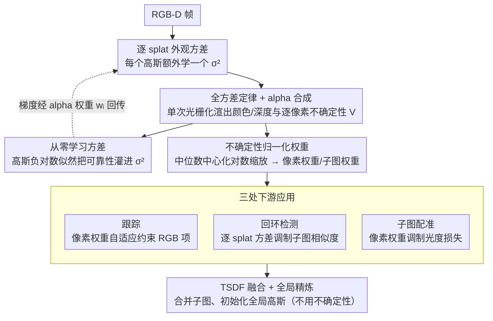

# VarSplat: Uncertainty-aware 3D Gaussian Splatting for Robust RGB-D SLAM

**会议**: CVPR2026  
**arXiv**: [2603.09673](https://arxiv.org/abs/2603.09673)  
**代码**: [项目主页](https://anhthuan1999.github.io/varsplat/)  
**领域**: 3D视觉  
**关键词**: 3D Gaussian Splatting, SLAM, uncertainty modeling, RGB-D, alpha合成

## 一句话总结

提出 VarSplat，首个在3DGS-SLAM中学习**逐splat外观方差** $\sigma^2$ 并通过全方差定律渲染**逐像素不确定性图** $V$ 的系统，将不确定性统一应用于跟踪、子图配准和回环检测，在4个数据集上取得鲁棒且领先的性能。

## 背景与动机

3DGS-SLAM 通过光栅化各向异性高斯实现快速可微分渲染，在重建质量和速度上远超 NeRF-SLAM。然而现有方法普遍存在一个关键缺陷：**测量可靠性未被显式建模**。当场景中出现低纹理区域、透明表面、反射表面或深度不连续边界时，均匀的光度权重会导致位姿估计产生漂移。

现有不确定性建模方案的不足：

- **几何端不确定性**（如 CG-SLAM 的深度方差、UncLe-SLAM 的逐像素深度不确定性）：仅建模几何维度，忽略外观不稳定性
- **预训练预测器**（如 WildGS-SLAM 基于 DINOv2 特征预测不确定性图）：依赖外部模型，无法端到端优化
- **射线终止概率**（如 Uni-SLAM 的 termination-probability field）：不确定性不来自光栅化器本身

VarSplat 的核心想法是：**直接学习每个高斯的外观方差 $\sigma_i^2$，通过全方差定律和 alpha 合成传播到逐像素不确定性 $V$，在单次光栅化 pass 中完成**。

## 核心问题

1. 如何在3DGS中显式建模外观不确定性，且不引入额外网络或预训练模型？
2. 如何将逐splat方差高效传播为逐像素不确定性图？
3. 如何将不确定性统一用于SLAM三个关键环节：跟踪、配准、回环检测？

## 方法详解

### 整体框架

VarSplat 针对的是 3DGS-SLAM 里一个被忽视的问题：测量可靠性没被显式建模，碰上低纹理、透明、反射或深度不连续的区域，均匀的光度权重会把位姿估计带偏。它的核心想法是直接给每个高斯学一个外观方差 $\sigma_i^2$，通过全方差定律 + alpha 合成把它在单次光栅化里传播成逐像素不确定性图 $V$，再把这套不确定性统一用到跟踪、子图配准、回环检测三个环节，让可靠区域监督更强、不可靠区域被自动压低权重。

### 关键设计

**1. 逐 splat 外观方差 + 全方差定律：单次光栅化里渲出逐像素不确定性**

标准 3DGS 每个高斯有 $\mu_i, \alpha_i, s_i, \Sigma_i, c_i$，VarSplat 额外加一个三通道外观方差 $\sigma_i^2 \in \mathbb{R}^3$，表示该 splat 颜色均值附近的不确定程度，子图记为 $P^s = \{G_i^s(\mu_i, \Sigma_i, \alpha_i, s_i, c_i, \sigma_i^2) \mid i=1,\ldots,N^s\}$。它和空间协方差 $\Sigma_i$（定几何范围）、SH 系数（定均值外观）都不同——即便 SH 把视角相关的均值颜色建对了，在深度不连续/遮挡边界/反射区，微小视角变化就改变重叠 splat 的可见性和 alpha 权重、造成不一致的颜色观测，此时 $\sigma_i^2$ 会学到较大值。沿用标准 alpha 合成的透射率与权重 $w_i = T_i \alpha_i,\ T_i = \prod_{j}^{i-1}(1-\alpha_j)$，渲染颜色深度 $C = \sum_i w_i c_i,\ D = \sum_i w_i z_i$；不确定性则由全方差定律分解：

$$\text{Var}[X] = \mathbb{E}[\text{Var}[X|Z]] + \text{Var}(\mathbb{E}[X|Z])$$

第一项（期望逐 splat 方差）由 alpha 合成 $\sum_i w_i \sigma_i^2$ 得到，第二项（splat 均值方差）由二阶矩 $\sum_i w_i c_i^2 - (\sum_i w_i c_i)^2$ 得到，合并：

$$V = \sum_i w_i(\sigma_i^2 + c_i^2) - \left(\sum_i w_i c_i\right)^2$$

关键在于 $V$ 和颜色/深度共享同一次光栅化 pass，不需要额外前向或蒙特卡洛采样，保持实时。

**2. 从零学习方差：用高斯负对数似然把可靠性灌进 $\sigma_i^2$**

子图按 LoopSplat/Gaussian-SLAM 策略管理（相机移动超阈值或累计跟踪不确定性超限就开新子图，首帧深度反投影初始化、后续帧在未观测区添加或合并高斯）。方差不靠标注、而是受 ActiveNeRF 似然视角启发用负对数似然从零学：

$$\mathcal{L}_{\text{var}} = \frac{1}{2V}\left(\|\hat{I}-I\|_2^2 + \|\hat{D}-D\|_2^2\right) + \log(V)$$

设计要点：残差用平方 L2（MSE）而非 L1，因为 L1 对应 Laplace 分布会破坏高斯假设；同时纳入颜色和深度残差，让方差反映几何+外观综合可靠性；梯度 $\frac{\partial \mathcal{L}_{\text{var}}}{\partial \sigma_i^2} = \frac{\partial \mathcal{L}_{\text{var}}}{\partial V} \cdot w_i$，方差通过 alpha 权重 $w_i$ 传回每个 splat。

**3. 不确定性归一化权重 + 三处下游应用：一套方差贯穿跟踪/回环/配准**

为了把方差变成可用权重，采用中位数中心化对数缩放，对像素级和子图级分别算：

$$\widetilde{w}_p = \exp[-(\log V - \widetilde{V})/\tau], \quad \widetilde{w}_s = \exp[-(\log \sigma^2 - \widetilde{\sigma^2})/\tau]$$

$\widetilde{V}, \widetilde{\sigma^2}$ 为对应对数量的中位数，$\tau > 0$ 控锐度，方差大于中位数的像素/splat 权重衰减。三处应用：**跟踪**时用像素权重自适应约束 RGB 项 $\mathcal{L}_{\text{track}} = \sum \lambda_c (\widetilde{w_p} \odot \|\hat{I}-I\|_1) + (1-\lambda_c)\|\hat{D}-D\|_1$，并冻结方差参数、停掉 $\widetilde{w_p}$ 梯度以免和位姿优化冲突；**回环检测**用逐 splat 方差调制子图相似度，算方差加权不透明度比率 $r = \frac{\sum_j \widetilde{w_s} \alpha_j}{\sum_j \alpha_j}$、$\text{sim} = \text{cross\_sim} \odot (r_q \cdot r_{db})$，$r$ 编码子图还剩多少可靠外观；**配准**把查询关键帧定位到数据库子图，用像素权重调制光度损失 $\mathcal{L}_{\text{registration}} = \sum \widetilde{w_p} \odot \|\hat{I}-I\|_1 + \|\hat{D}-D\|_1$。最后用 TSDF 融合合并所有子图、用融合几何初始化全局高斯中心、以 $\mathcal{L}_{\text{color}}$ 精炼（此阶段不用不确定性，因不稳定区已在前面环节被控住）。

### 损失函数 / 训练策略

建图总损失：

$$\mathcal{L}_{\text{map}} = \lambda_{\text{color}} \cdot \mathcal{L}_{\text{color}} + \lambda_{\text{depth}} \cdot \mathcal{L}_{\text{depth}} + \lambda_{\text{reg}} \cdot \mathcal{L}_{\text{reg}} + \lambda_{\text{var}} \cdot \mathcal{L}_{\text{var}}$$

颜色损失 $\mathcal{L}_{\text{color}} = (1-\lambda_{\text{SSIM}})\|\hat{I}-I\|_1 + \lambda_{\text{SSIM}}(1-\text{SSIM}(\hat{I},I))$，深度损失 $\mathcal{L}_{\text{depth}} = \|\hat{D}-D\|_1$，正则 $\mathcal{L}_{\text{reg}} = \|\hat{s}-s\|_1$ 控高斯尺度，方差损失即上面的高斯负对数似然。

## 实验关键数据

### 跟踪性能（ATE RMSE ↓，cm）

| 数据集 | 最佳基线 | VarSplat | 提升 |
|--------|---------|----------|------|
| Replica (8场景均值) | LoopSplat: 0.26 | **0.23** | ~12% |
| ScanNet++ (5场景均值) | LoopSplat: 2.05 | **1.69** | ~18% |
| TUM-RGBD (5场景均值) | LoopSplat: 3.33 | **3.20** | ~4% |
| ScanNet (6场景均值) | Loopy-SLAM: 7.7 | **6.5** | ~16% |

### 渲染与重建性能

| 指标 | 数据集 | VarSplat | 对比（LoopSplat） |
|------|--------|----------|------------------|
| PSNR ↑ | Replica | 37.15 | 36.63 |
| SSIM ↑ | Replica | 0.986 | 0.985 |
| LPIPS ↓ | Replica | 0.109 | 0.112 |
| Depth L1 ↓ | Replica | 0.50 | 0.51 |
| F1 ↑ | Replica | 90.2% | 90.4% |
| NVS PSNR ↑ | ScanNet++ | **21.33** | 21.30 |

### 消融实验

不确定性在三个环节的逐步叠加效果（ScanNet 6场景均值 ATE RMSE）：

- 无不确定性：8.20 → +跟踪：7.63 → +回环：7.49 → +配准（全部启用）：**6.53**，总提升约 **20%**

运行时间（Replica/Room0，A100 80GB）：Mapping 1.9s/帧，Tracking 2.0s/帧，与 LoopSplat（1.2s/1.8s）相当。

## 亮点

1. **数学优雅**：通过全方差定律将逐splat方差传播到逐像素不确定性，无需蒙特卡洛采样或额外前向传递，完全在单次光栅化 pass 中完成
2. **端到端学习**：方差 $\sigma_i^2$ 作为可微分参数与位姿和高斯参数联合优化，不依赖预训练模型
3. **统一不确定性应用**：同一套方差信号贯穿跟踪（像素级）、回环（子图级）、配准（像素级）三个环节
4. **冻结策略**：跟踪和回环时冻结方差参数，避免梯度冲突，设计合理
5. **鲁棒性提升明显**：在真实数据集（ScanNet/ScanNet++/TUM-RGBD）上比基线稳定得多

## 局限与展望

1. **仅支持 RGB-D 输入**：未扩展到纯 RGB（单目/双目）场景，限制应用范围
2. **计算开销增加**：Mapping 从 LoopSplat 的 1.2s/帧增至 1.9s/帧（+58%），对实时性敏感的应用可能不友好
3. **合并阶段丢弃不确定性**：TSDF 融合后的全局精炼未使用 $V$，可能损失最终重建质量
4. **方差建模假设**：使用各向同性的逐通道方差 $\sigma_i^2 \in \mathbb{R}^3$，未建模通道间协方差
5. **动态场景**：未考虑动态物体的处理，在动态环境下可能失效

## 与相关工作的对比

| 方法 | 不确定性类型 | 来源 | 在线学习 | 单次pass |
|------|------------|------|---------|---------|
| CG-SLAM | 深度方差 | 几何驱动 | ✓ | ✓ |
| Uni-SLAM | 射线终止概率 | 隐式场 | ✓ | ✗ |
| WildGS-SLAM | DINOv2特征图 | 预训练 | ✗ | ✓ |
| ActiveNeRF | 逐像素方差 | 神经网络 | ✓ | ✗ |
| **VarSplat** | **逐splat外观方差** | **全方差定律** | **✓** | **✓** |

VarSplat 的核心优势在于：不确定性直接来自3DGS表示本身（而非外部模型），通过闭式公式传播（而非采样），且在线端到端优化（而非后处理）。

## 启发与关联

- **方差冻结策略**值得借鉴：在不同阶段选择性地冻结/训练方差参数，避免梯度冲突，这对多任务联合优化有普适指导意义
- 全方差定律的分解 $V = \mathbb{E}[\text{Var}] + \text{Var}(\mathbb{E})$ 可推广到3DGS的其他属性（如语义、法线）的不确定性估计
- 类似的不确定性加权思路可迁移到 3DGS-based 的其他任务：自由视点合成中的主动视角选择、场景补全、语义分割等

## 评分

- 新颖性: ⭐⭐⭐⭐ — 全方差定律+alpha合成的公式推导干净优雅，是3DGS不确定性建模的自然而新颖的方案
- 实验充分度: ⭐⭐⭐⭐⭐ — 4个数据集（合成+真实），与12+基线对比，消融覆盖三个下游任务和方差训练策略
- 写作质量: ⭐⭐⭐⭐ — 公式推导清晰，动机阐述充分，实验组织有条理
- 价值: ⭐⭐⭐⭐ — 为3DGS-SLAM系统提供了一种高效实用的不确定性建模范式，有较强的方法论贡献

<!-- RELATED:START -->

## 相关论文

- [\[CVPR 2026\] AERGS-SLAM: Auto-Exposure-Robust Stereo 3D Gaussian Splatting SLAM](aergs-slam_auto-exposure-robust_stereo_3d_gaussian_splatting_slam.md)
- [\[CVPR 2026\] Rethinking Pose Refinement in 3D Gaussian Splatting under Pose Prior and Geometric Uncertainty](rethinking_pose_refinement_in_3d_gaussian_splatting_under_pose_prior_and_geometr.md)
- [\[CVPR 2026\] ODGS-SLAM: Omnidirectional Gaussian Splatting SLAM](odgs-slam_omnidirectional_gaussian_splatting_slam.md)
- [\[CVPR 2026\] DROID-W: DROID-SLAM in the Wild](droid-slam_in_the_wild.md)
- [\[CVPR 2026\] FastGS: Training 3D Gaussian Splatting in 100 Seconds](fastgs_training_3d_gaussian_splatting_in_100_seconds.md)

<!-- RELATED:END -->
