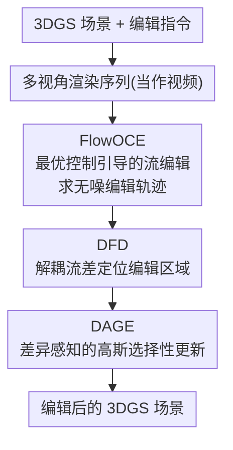

# VDFE: Difference-Aware 3D Scene Editing with Non-Intrusive Video Diffusion Priors for Multi-View Consistency and Efficiency

**会议**: CVPR 2026  
**代码**: 待确认  
**论文**: [CVF Open Access](https://openaccess.thecvf.com/content/CVPR2026/html/Zhang_VDFE_Difference-Aware_3D_Scene_Editing_with_Non-Intrusive_Video_Diffusion_Priors_CVPR_2026_paper.html)  
**领域**: 3D视觉 / 3D编辑  
**关键词**: 文本驱动3D编辑, 3D高斯泼溅, 视频扩散先验, 最优控制, 多视图一致性

## 一句话总结
VDFE 把文本驱动的 3D 场景编辑拆成「先用视频扩散先验做多视图一致的流编辑、再靠流差精确定位编辑区域、最后只更新该区域的高斯」三步，在不侵入式利用预训练视频扩散模型的前提下，实现了对 3D Gaussian Splatting 场景既精确又高效的可控编辑。

## 研究背景与动机
**领域现状**：随着 NeRF、3D Gaussian Splatting（3DGS）等重建技术成熟，文本驱动 3D 编辑试图让用户用一句话直观地改造场景（换材质、换物体、改颜色）。

**现有痛点**：现有方法在**可控性**和**一致性**上常出问题——编辑会"溢出"到非目标区域、不同视角间编辑结果不一致（同一物体在不同视图被改成不一样），且优化整套 3D 表示效率低。

**核心矛盾**：2D 编辑模型（如基于交叉注意力的扩散编辑）缺乏多视图一致性约束，逐视图编辑再回灌到 3D 会相互打架；而要保证一致性又往往得侵入式改造或微调扩散模型，代价高。

**本文目标**：在不侵入（non-intrusive，不微调）预训练**视频扩散**模型的前提下，做到多视图一致、定位精确、更新高效的 3D 场景编辑。

**核心 idea**：用视频扩散先验天然的帧间一致性来保证多视图一致，把编辑建模成**最优控制问题**求一条无噪编辑轨迹，再用**流差（flow difference）**精确圈出要改的区域，只对该区域的高斯做选择性更新。

## 方法详解

### 整体框架
输入是一个已重建好的 3DGS 场景 + 一句编辑指令，输出是编辑后的 3DGS 场景。VDFE 把多视角渲染序列当作"视频"喂给预训练视频扩散模型，串起三个模块：FlowOCE 负责把编辑过程当最优控制求一条平滑、不污染非目标区的编辑轨迹；DFD 通过分析流差生成高精度的编辑区域定位图；DAGE 利用该定位图只选择性更新需要修改的高斯，完成高效精修。

### 关键设计

**1. FlowOCE：把编辑当最优控制问题，求一条不污染非目标区的无噪轨迹**

针对"编辑溢出到非目标区域、视角间不一致"的痛点，FlowOCE（Optimal Control Guided Flow Editing）把编辑过程建模成一个**最优控制**问题：优化一条无噪声（noise-free）的编辑轨迹，使非目标区域的意外改动最小化，同时产出多视图一致、过渡平滑的编辑结果。借助视频扩散先验的帧间一致性，跨视角的编辑天然保持连贯，避免了逐视图独立编辑互相打架。论文显示 FlowOCE 在高保真视频编辑上即取得优异结果，是后续 3D 编辑一致性的基础。

**2. DFD：用解耦流差精确定位编辑区域，替代交叉注意力**

交叉注意力定位编辑区域往往粗糙、边界模糊。DFD（Decoupled Flow Difference）改为**分析流差**——比较编辑前后的光流/特征流，直接生成高精度的"流差图"，标出到底哪些区域需要改、哪些应保持不动。相比交叉注意力，它定位更准、且无需额外训练即可直接产出差异图，为后续优化提供精确的区域先验。这一步是"精确可控"的关键：定位准了，才能只改该改的地方。

**3. DAGE：差异感知地只更新需要修改的高斯，提升效率与精度**

有了 DFD 的精确定位，DAGE（Difference-Aware Gaussians Editing）就**选择性地只更新落在编辑区域内的 3D 高斯**，而不是优化整套高斯。这样既避免了对非目标高斯的无谓扰动（保精度、防细节丢失），又大幅减少了优化量（提效率）。消融显示 DAGE 带来的性能提升最显著——它把"精确定位"真正转化为"精确且高效的 3D 更新"。

## 实验关键数据

### 主实验
在 FIVE 等编辑基准上，用 CLIP-sim（编辑后与指令的语义相似度）与 CLIP-dir（编辑方向一致性）评测，3D 与视频编辑任务上均达 SOTA：

| 方法 | CLIP-sim | CLIP-dir | 说明 |
|------|----------|----------|------|
| 现有 baseline | 较低 | 较低 | 可控性/一致性受限 |
| **VDFE（本文）** | **最高** | **最高** | 3D + 视频编辑双任务 SOTA |

（论文报告 FlowOCE 结合 DFD 即在 FIVE 基准上超越所有 baseline 达到 SOTA；具体数值以原文表格为准 ⚠️。）

### 消融实验
| 配置 | 效果 | 说明 |
|------|------|------|
| 完整 VDFE | 最佳 | 三模块协同 |
| w/o DFD | 定位变差 | 编辑区域定位不准，精度下降 |
| w/o DAGE | 细节丢失 + 非目标区被误改 | 缺精确选择性更新 |
| 仅 FlowOCE | 视频编辑强但 3D 精度有限 | 缺定位与选择性更新 |

### 关键发现
- **DAGE 贡献最大**：去掉它会出现细节丢失和非目标区域误改，说明"精确定位 + 选择性更新"是 3D 编辑质量的决定环节。
- **DFD 优于交叉注意力定位**：流差直接产出高精度差异图，无需额外训练，给优化提供了更可靠的区域先验。
- **FlowOCE 提供一致性底座**：最优控制求得的无噪轨迹保证了多视图一致与平滑过渡，是把 2D/视频编辑安全迁到 3D 的前提。

## 亮点与洞察
- **非侵入式用视频扩散先验**是巧妙之处：不微调大模型、直接借其帧间一致性来解决 3D 多视图一致这个老难题，迁移成本低。
- **把编辑建模为最优控制**给"不污染非目标区"提供了原理性手段，而非靠掩码硬裁。
- **流差定位 > 交叉注意力**这一观察可迁移到任何需要精确编辑区域定位的 2D/3D 编辑任务。

## 局限与展望
- 依赖预训练视频扩散先验的质量与渲染序列的连贯性；先验本身的偏差可能传导到编辑结果。
- 流差定位对大幅几何改动（新增/删除物体而非改材质颜色）的鲁棒性，正文论证以外观级编辑为主。
- 论文方法描述较概括，FlowOCE 最优控制的具体目标函数、DFD 流差的精确计算式在正文偏简，复现需依赖补充材料 ⚠️。

## 相关工作与启发
- **vs 基于交叉注意力的编辑定位**：VDFE 用流差替代交叉注意力，定位更精确且免训练。
- **vs 逐视图 2D 编辑回灌 3D**：那类方法缺一致性约束，VDFE 借视频扩散先验从源头保证多视图一致。
- **vs 全量优化 3DGS 的编辑**：VDFE 用 DAGE 只更新目标区高斯，更高效、更不易破坏非目标细节。

## 评分
- 新颖性: ⭐⭐⭐⭐ 非侵入视频先验 + 最优控制 + 流差定位的组合较新
- 实验充分度: ⭐⭐⭐⭐ 3D/视频双任务 + 模块消融充分，正文数值偏简
- 写作质量: ⭐⭐⭐⭐ 三模块动机与分工清晰
- 价值: ⭐⭐⭐⭐ 对可控、一致、高效的 3D 场景编辑有实用价值

<!-- RELATED:START -->

## 相关论文

- [\[CVPR 2026\] Unsupervised Monocular 3D Keypoint Discovery from Multi-View Diffusion Priors](unsupervised_monocular_3d_keypoint_discovery_from_multi-view_diffusion_priors.md)
- [\[CVPR 2026\] HAD: Hallucination-Aware Diffusion Priors for 3D Reconstruction](had_hallucination-aware_diffusion_priors_for_3d_reconstruction.md)
- [\[CVPR 2026\] EcoSplat: Efficiency-controllable Feed-forward 3D Gaussian Splatting from Multi-view Images](ecosplat_efficiency-controllable_feed-forward_3d_gaussian_splatting_from_multi-v.md)
- [\[CVPR 2026\] Coherent Human-Scene Reconstruction from Multi-Person Multi-View Video in a Single Pass](coherent_humanscene_reconstruction_from_multiperso.md)
- [\[CVPR 2026\] 3D-Aware Multi-Task Learning with Cross-View Correlations for Dense Scene Understanding](3d-aware_multi-task_learning_with_cross-view_correlations_for_dense_scene_unders.md)

<!-- RELATED:END -->
