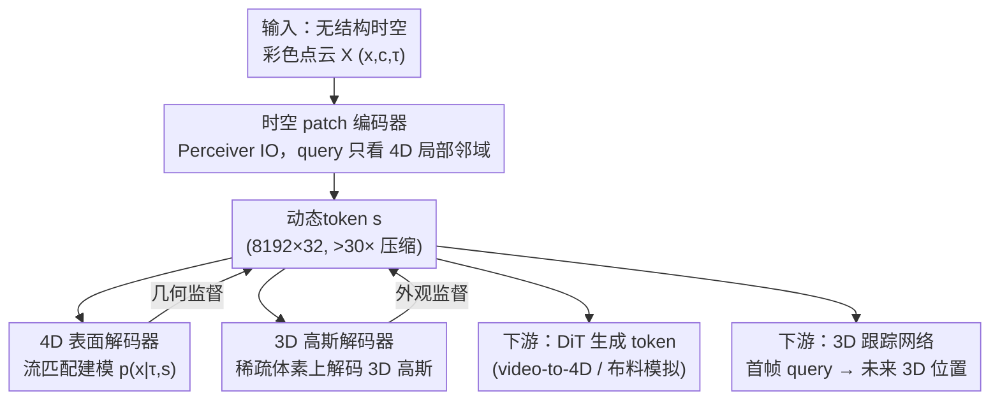

# Velox: Learning Representations of 4D Geometry and Appearance

**会议**: CVPR 2026  
**arXiv**: [2605.04527](https://arxiv.org/abs/2605.04527)  
**代码**: https://apple.github.io/ml-velox (项目主页)  
**领域**: 3D视觉  
**关键词**: 4D表示学习, 动态点云, 动态token, 流匹配, 3D高斯

## 一句话总结
Velox 用一个 Perceiver 编码器把无结构的时空彩色点云压成一小组"动态token"（>30× 压缩），再用两个互补解码器（流匹配 4D 表面解码器学几何 + 3D 高斯解码器学外观）联合监督，得到一个无需时间对应关系、同时刻画 4D 几何与外观的通用潜在表示，可直接复用到 video-to-4D 生成、3D 跟踪、布料模拟三个下游任务并取得 SOTA。

## 研究背景与动机
**领域现状**：表示学习是 2D/3D 视觉进步的核心——自监督重建得到的特征能很好迁移到下游任务，潜在表示也是生成与编辑的基础。作者想把这一思路推广到时空（4D）域：能不能只靠重建，学到一个对动态物体通用的 4D 表示。

**现有痛点**：一个理想的 4D 表示应同时满足三点——**descriptive**（忠实刻画随时间变化的几何与外观）、**compressive**（紧凑、便于下游处理）、**accessible**（只依赖易获取的输入）。但现有方法没有一个能全占：① 很多方法是为单一任务（视图合成 / 角色动画 / 3D 跟踪）定制的，会丢掉通用理解所需的信息，且维度过高难以适配异质下游任务；② 朝"通用 4D 物体表示"努力的工作，要么**只建几何、忽略外观**，要么依赖**时间对应关系（correspondences）**作为编码器输入或监督——而对应关系在复杂动态场景里极难获取，既限制了可用训练数据，也把推理管线绑死。

**核心矛盾**：把每帧独立的 3D 表示拼起来虽能表达动态物体，却忽略了时间连续性，产生高维、时序不一致的特征（抖动、几何不稳）；而要建模时间连续性，主流又退回到"对应关系/形变场"，对应关系本身就是难题，且形变建模在"物体出现/消失"这类场景下根本定义不清。

**本文目标**：学一个**单一**潜在表示，既不依赖对应关系作为编码器输入，又能联合刻画动态几何与外观，并能用最小输入（一段无结构动态彩色点云）构建。

**切入角度**：把 4D 表面看作"局部时空 patch"的集合，用 Perceiver 式跨注意力在空间和时间上聚合信息（每个 query 只看自己 4D 邻域），从而**不需要点之间的时间对应**就能编码时序连续性；几何用"时间条件的概率密度 $p(\mathbf{x}|\tau,\mathbf{s})$"建模（而非形变场），天然能处理出现/消失。

**核心 idea**：用一组 latent "动态token"统一承载 4D 几何 + 外观，几何走流匹配表面解码器、外观走 3D 高斯解码器双路监督，把表示学习与下游任务彻底解耦。

## 方法详解

### 整体框架
Velox 学习的目标是一组**动态token** $\mathbf{s}$——含 $k$ 个维度为 $d$ 的 token（实现里 latent 形状为 $8192\times32$）。编码器 $E$ 的输入是一段无结构时空彩色点云 $\mathcal{X}=\{(\mathbf{x}_i\in\mathbb{R}^3,\ \mathbf{c}_i\in[0,1]^3,\ \tau_i\in\mathbb{R})\}_{i=1}^N$，即每个点带空间坐标、RGB 颜色和时间戳；输出 $\mathbf{s}=E(\mathcal{X})$。这组 token 被两个互补解码器**联合监督**：4D 表面解码器学几何、3D 高斯解码器学外观。整套模型只需多视角 RGBD 视频（及其反投影点云）即可训练，无需像 SDF/占据表示那样依赖水密网格和繁重预处理。

训练完成后，动态token 成为一个"地基"，三个下游任务都搭在它之上：**video-to-4D 生成**和**布料模拟**用一个 DiT 直接在 token 空间里生成 token（条件是 DINOv2 图像/视频特征），再用高斯解码器渲染；**3D 跟踪**则在 token 上训一个 Perceiver 编码器，把首帧 query 点的 3D 位置映射到未来各帧。

### 关键设计

**1. 时空 patch 编码器：用局部跨注意力替代对应关系**

针对"复杂动态场景拿不到时间对应关系"这个痛点，Velox 不再要求点之间的对应，而是借鉴 3D 表示工作，把 4D 时空表面切成局部 patch 来编码。具体用 Perceiver IO 架构：从输入点云 $\mathcal{X}$ 里采 $k$ 个点作为 query，每个 query **只跨注意到离它最近的那些点**（即只观察自己在 4D 空间里的局部邻域），再用窗口化自注意力把这些局部 patch 信息在 query 之间传播，兼顾感受野与计算效率。这样时序连续性是靠"同一片 4D 邻域里的跨时刻点被一起聚合"隐式获得的，而非显式对应关系，使表示对下游任务**accessible**；同时 $8192\times32$ 的 latent 相对原始 4D 点云实现了 >30× 压缩，满足 **compressive**。

**2. 流匹配 4D 表面解码器：把几何建成"时间条件的概率密度"**

要满足 **descriptive** 中的"几何忠实"，且能按需采任意时刻的表面点。一个自然做法是把 4D 表面建成联合分布 $p(\mathbf{x},\tau|\mathbf{s})$，但这样很难直接采到"某个目标时刻 $\tau$"对应的点（下游如逐帧渲染就需要这个）。于是 Velox 改建**条件分布** $p(\mathbf{x}|\tau,\mathbf{s})$——给定时刻 $\tau$ 时 3D 点 $\mathbf{x}$ 的概率密度（在 $p(\tau)$ 均匀假设下，它只是联合分布的一个缩放）。解码器 $V$ 接收 latent $\mathbf{s}$、流匹配时间 $t$、目标帧时间 $\tau$ 和带噪表面点 $\mathbf{x}_t=\alpha_t\mathbf{x}+\sigma_t\boldsymbol{\epsilon}$（$\mathbf{x}$ 取自帧时间为 $\tau$ 的点、$\boldsymbol{\epsilon}$ 为标准正态），预测流匹配速度 $\mathbf{v}=V(\mathbf{s},\mathbf{x}_t,t,\tau)$，损失为

$$\mathcal{L}_V=\lVert \mathbf{v}-\dot{\alpha_t}\mathbf{x}-\dot{\sigma_t}\boldsymbol{\epsilon}\rVert^2.$$

推理时把 $\mathbf{v}$ 从 $t=0$ 积分到 $t=1$ 即可采出 $\tau$ 时刻的表面点云。相比"形变场"路线，这种时间条件密度建模天然能处理物体**出现/消失**（形变在这类场景定义不清）。

**3. 3D 高斯解码器：在稀疏体素上解码外观，避开形变假设**

为给 token 注入外观、并让 token 能渲染成图像供下游用，Velox 解码 3D 高斯。理想是一次解出整段场景所有时刻的高斯，但显存吃不消；"先建一套规范高斯再随时间形变"又会在出现/消失场景失效。Velox 改为直接训练 $G(\mathbf{s},\tau)$：对给定时刻 $\tau$ 直接把动态token 映射成 3D 高斯，且为助收敛只在**稀疏占据体素 'Vox'** 上用 Perceiver IO 解码。监督损失是渲染图与真值图的 L2：

$$\mathcal{L}_{GS}=\lVert I_{GT}-\text{Render}(G(\text{Vox},\mathbf{s},\tau),\text{H}_I)\rVert^2,$$

其中 $\text{H}_I$ 为相机内外参。训练时 'Vox' 用输入点云算出的真值体素；推理时既可查 4D 表面解码器现采体素，也可——为省采样时间——额外训一个**轻量体素解码器**直接从动态token 预测占据体素（几何信息已因 $\mathcal{L}_V$ 嵌进 token），从而大幅加速高斯解码。

**4. 即用即弃的纹理增强：补足动态数据集的外观多样性**

作者发现动态序列里物体常是低频、单色纹理，外观多样性不足，会让外观重建（甚至几何）变差。于是训练时**实时随机重纹理**：给首帧 mesh 赋 UV，UV 沿动画传到后续帧以保证跨帧颜色一致，从 OpenImages 随机取图当纹理，用 nvdiffrast（>500 fps）即时渲染。关键是——mesh 对应关系**只用于数据增强、不作为模型输入或监督**，是可选项，因此不破坏"无需对应关系"的核心主张。消融显示去掉它外观和几何指标都明显下降。

### 损失函数 / 训练策略
总目标在几何损失、外观损失之外，再加一个对动态token 的 KL 正则（与标准正态的 KL 退化为 token 的 L2，$\mathcal{L}_C=\lVert\mathbf{s}\rVert^2$）：

$$\mathcal{L}=\mathcal{L}_V+\mathcal{L}_{GS}+\gamma\mathcal{L}_C,\quad \gamma=10^{-4}.$$

下游任务各自单独训练：video-to-4D / 布料模拟用 DiT（token 用可学习零初始化位置编码，DINOv2 编码图像；video-to-4D 还把每帧输入时间编进位置编码）直接生成 token；3D 跟踪用 Perceiver IO，把首帧 3D query 当 query、动态token 当 key/value，预测未来各帧 3D 位置，刻意保持简单（不做迭代细化/微调），以凸显 token 本身就携带了跟踪所需信息。

## 实验关键数据

### 主实验

**重建质量（Objaverse 留出 256 个场景，Chamfer ×10⁵）**

| 方法 | PSNR↑ | SSIM↑ | LPIPS↓ | FVD↓ | CVVDP↑ | Chamfer↓ |
|------|-------|-------|--------|------|--------|----------|
| GVF（形变场） | 26.45 | 0.952 | 0.051 | 173.62 | 7.620 | - |
| LiTo（逐帧, GT 体素） | 32.55 | 0.972 | 0.037 | 126.38 | 8.544 | 38.17 |
| **Ours (GT vox.)** | **35.39** | **0.984** | **0.021** | **48.99** | **8.910** | **36.36** |
| Ours (dec. vox.) | 35.11 | 0.983 | 0.022 | 50.68 | 8.877 | 36.36 |
| Ours (samp. vox.) | 34.25 | 0.981 | 0.024 | 59.37 | 8.811 | 36.36 |

Velox 在几何与外观、时序一致性（FVD/CVVDP）上全面超过逐帧的 LiTo 与形变场的 GVF；且训练好的体素解码器（dec. vox.）几乎追平 GT 体素，远快于现采点云。

**Video-to-4D 生成（随机相机距离，Objaverse / Consistent4D；输入视图 vs 9 个新视图）**

| 数据集 | 方法 | 输入 PSNR↑ | 输入 LPIPS↓ | 新视图 PSNR↑ | 新视图 LPIPS↓ | 新视图 FVD↓ |
|--------|------|-----------|------------|-------------|--------------|------------|
| Obj | L4GM | 22.59 | 0.074 | 18.30 | 0.146 | 498 |
| Obj | GVF | 18.21 | 0.117 | 16.41 | 0.157 | 663 |
| Obj | **Ours** | **24.04** | **0.056** | **20.62** | **0.104** | **373** |
| C4D | L4GM | 21.87 | 0.080 | 17.71 | 0.147 | 432 |
| C4D | **Ours** | **22.95** | **0.072** | **18.98** | **0.120** | **431** |

L4GM 靠像素对齐高斯在输入视图很准，但新视图有 floater；GVF 在 Consistent4D 上还行但泛化差。Velox 在输入视图重建和新视图生成上都更优，对不同相机设置更鲁棒。

**3D 跟踪（Objaverse；全部点 / 可见点）**

| 方法 | L²₍all₎↓ | L²₍vis₎↓ | APD₍all₎↑ | APD₍vis₎↑ | AJ³ᴰ↑ | OA↑ |
|------|---------|---------|-----------|-----------|-------|-----|
| SpatialTrackerV2 | 0.068 | 0.056 | 0.600 | 0.627 | 0.444 | **0.897** |
| CoTracker3 (+GT 深度) | 0.060 | 0.039 | 0.755 | 0.803 | 0.648 | 0.889 |
| **Ours** | **0.025** | **0.020** | **0.835** | **0.857** | **0.709** | 0.871 |

Velox 在 L2/APD/AJ 全面领先，尤其擅长无纹理物体/区域（因为联合建几何+外观）；唯独遮挡精度 OA 略低——因为它没有直接预测可见性，而是用"3D 轨迹点比 RGBD 表面更远即判遮挡"的简单规则。

**布料模拟**：从单帧初始位置生成完整 4D 轨迹，质心位置 RMSE 仅 **1 cm（场景最大尺寸的 0.5%）**；生成轨迹的位置/速度/加速度与参考高度吻合，能复现 $\tau\approx0.5$ 触地后的回弹。

### 消融实验

| 配置 | PSNR↑ | LPIPS↓ | Chamfer↓ | 说明 |
|------|-------|--------|----------|------|
| Ours-S w/ aug. | 33.93 | 0.029 | 38.79 | 小模型 + 纹理增强 |
| Ours-S w/o aug. | 32.41 | 0.036 | 43.34 | 去掉纹理增强 |
| Ours (samp. vox.) | 34.25 | 0.024 | 36.36 | 现采点云做体素（点不够导致掉点） |
| Ours (dec. vox.) | 35.11 | 0.022 | 36.36 | 体素解码器，接近 GT 且更快 |
| LiTo（逐帧） | 32.55 | 0.037 | 38.17 | 不做联合时序处理 |

### 关键发现
- **联合时序编码是关键**：逐帧处理的 LiTo 重建质量更低，且可视化有明显时序闪烁，证明跨时间联合处理点云能压住抖动。
- **纹理增强出乎意料地同时帮几何**：去掉后不仅外观指标大跌，几何也明显退化——说明丰富外观监督反过来约束了几何学习。
- **建几何条件密度 > 建形变场**：GVF 只建形变，在"组件出现/消失"等复杂真实动态上不够；Velox 的时间条件几何/外观更稳。
- **体素来源影响渲染**：现采点云体素点数不足会掉质量，训练的体素解码器几乎追平 GT 体素且快得多。

## 亮点与洞察
- **"无对应关系"的局部 patch 聚合**：用 Perceiver query 只看 4D 局部邻域 + 窗口自注意力传播，把"时序连续性"从显式对应关系解放成隐式聚合，既扩了可用训练数据，又让表示对异质下游通用——这是整篇最巧的地方。
- **几何用"时间条件密度"而非形变场**：一个看似微小的建模选择（$p(\mathbf{x}|\tau,\mathbf{s})$ 而非形变），却直接换来处理"出现/消失"场景的能力，是形变场范式难做到的。
- **一表多用的强证据**：同一组动态token 不动结构就服务生成、跟踪、物理模拟三类差异极大的任务，且跟踪刻意"不加迭代细化"仍 SOTA，说明信息确实压进了 token 里。
- **可迁移 trick**：实时纹理增强（UV 随动画传递 + nvdiffrast >500fps 即时重纹理）几乎零成本，可直接搬到任何外观多样性不足的动态/3D 数据集；"训练用 GT 体素、推理用轻量体素解码器"的两段式也可复用于高斯解码加速。

## 局限与展望
- **解码器逐帧独立 → 残留闪烁**：受 GPU 显存所限，高斯解码器对每个输出帧独立处理，复杂纹理/大运动区域仍有 flickering；作者建议设计能联合处理多时刻高斯的更省显存解码器。
- **生成质量受生成模型容量限制**：video-to-4D 在高频纹理输入下纹理偏弱，重建与生成之间存在差距，根因是底层生成模型规模与现有 3D 生成方法相当、容量有限。
- **训练成本高**：训练动态token 需大量算力和长时间，且缺少可初始化的大规模 4D 基础模型；未来预训练或能大幅降本。
- （自己看）评测主要在合成 Objaverse/PyFlex 数据上，真实采集的 RGBD 动态场景泛化、以及多物体复杂交互场景的表现还有待验证；遮挡建模目前是后处理规则、未端到端学习。

## 相关工作与启发
- **vs GVF（形变场 4D 表示）**: GVF 学一个 4D 形变潜空间，建"规范形状 + 随时间形变"；Velox 改建"时间条件的几何/外观密度"。区别在于形变路线在组件出现/消失时定义不清、对复杂真实动态泛化差，而 Velox 无此假设——重建、生成、几何指标全面胜出。
- **vs LiTo（SOTA 3D 表示, 逐帧喂入）**: LiTo 每帧独立编码再拼接，忽略时间连续性，导致时序不一致/闪烁；Velox 联合时空处理，外观更忠实、FVD/CVVDP 更好。
- **vs 依赖对应关系的 4D 表示（如需 correspondences 作输入/监督的方法）**: 这类方法被对应关系的可获取性绑死、限制训练数据与推理管线，且常只建几何或把几何与外观分开；Velox 不需对应关系、单一表示联合建几何+外观，管线更简单、适用面更广（如直接做 3D 跟踪）。
- **vs L4GM（像素对齐高斯 video-to-4D）**: L4GM 直接预测像素对齐高斯，输入视图很准但缺乏真正的 4D 建模，新视图有 floater；Velox 在 token 空间生成、输入与新视图都更稳。

## 评分
- 新颖性: ⭐⭐⭐⭐⭐ 用"无对应关系的局部 patch 聚合 + 时间条件几何密度 + 高斯外观"统一 4D 表示，建模选择干净且解决了形变范式的硬伤
- 实验充分度: ⭐⭐⭐⭐⭐ 重建 + 生成 + 跟踪 + 布料模拟四设定全覆盖，含多组消融与多 baseline，结论自洽
- 写作质量: ⭐⭐⭐⭐ 动机—方法—实验链条清晰，公式与图配合好；架构细节多放补充材料，正文略需对照
- 价值: ⭐⭐⭐⭐⭐ 一个通用 4D 表示一表多用，且开源模型/代码，对 4D 生成与表示学习社区有较强地基价值

<!-- RELATED:START -->

## 相关论文

- [\[CVPR 2026\] MotionScale: Reconstructing Appearance, Geometry, and Motion of Dynamic Scenes with Scalable 4D Gaussian Splatting](motionscale_reconstructing_appearance_geometry_and_motion_of_dynamic_scenes_with.md)
- [\[CVPR 2026\] Intrinsic Geometry-Appearance Consistency Optimization for Sparse-View Gaussian Splatting](intrinsic_geometry-appearance_consistency_optimization_for_sparse-view_gaussian_.md)
- [\[CVPR 2026\] Learning to Infer Parameterized Representations of Plants from 3D Scans](learning_to_infer_parameterized_representations_of_plants_from_3d_scans.md)
- [\[CVPR 2026\] 4DEquine: Disentangling Motion and Appearance for 4D Equine Reconstruction from Monocular Video](4dequine_disentangling_motion_and_appearance_for_4d_equine_reconstruction_from_m.md)
- [\[CVPR 2026\] Learning Compact 3D Representations from Feed-Forward Novel View Synthesis](learning_compact_3d_representations_from_feed-forward_novel_view_synthesis.md)

<!-- RELATED:END -->
