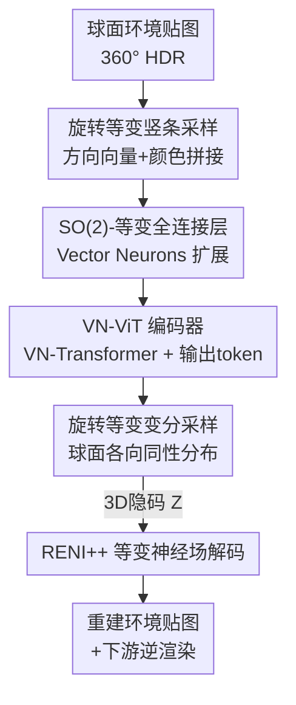

# VENI: Variational Encoder for Natural Illumination

**会议**: CVPR 2026  
**论文**: [CVF Open Access](https://openaccess.thecvf.com/content/CVPR2026/html/Walker_VENI_Variational_Encoder_for_Natural_Illumination_CVPR_2026_paper.html)  
**项目页**: https://paul-pw.github.io/veni  
**领域**: 3D视觉 / 逆渲染 / 自然光照先验  
**关键词**: 旋转等变, 变分自编码器, 球面神经场, 环境贴图, Vector Neurons

## 一句话总结
VENI 用一个 SO(2) 旋转等变的变分自编码器为户外自然光照建立先验：以新的 Vector Neuron Vision Transformer（VN-ViT）作编码器、沿用 RENI++ 的等变神经场作解码器，把球面环境贴图直接编码成结构良好、唯一性强的隐空间，从而比只有解码器的 RENI++ 插值更平滑、可扩展到大数据集，并提升逆渲染等下游任务表现。

## 研究背景与动机

**领域现状**：逆渲染（从一张图反推形状、材质、光照）天生是病态问题，同一张图可由无数种「形状+材质+光照」组合生成。为了约束解空间，常见做法是引入光照先验。自然户外光照虽然复杂，却有很强的统计规律——光源主要是太阳和天空、颜色范围有限、并且存在一个明确的「上方」方向，绕竖直轴的任意旋转都同样合理。近期工作用球面神经场（RENI、RENI++）把光照建成可从任意方向查询的连续表示，并利用了「绕上轴旋转等变」这一物理性质。

**现有痛点**：当前最强的光照先验 RENI++ 采用 **autodecoder（只有解码器）** 架构——每张训练/测试图的隐码都是随机初始化、再和模型一起联合优化出来的。这带来两个硬伤：一是**隐空间不唯一**，两张相似的图可能被初始化成完全不同的隐码，同一张图在隐空间里被表示成多个点；二是**无法扩展到大数据集**，每张图都要单独优化一个隐码，相似图越多、唯一性退化越严重，性能反而随数据量增大而下降（见表 3）。

**核心矛盾**：要的是「旋转等变 + 神经场的连续表示」这两个优点，但等变**编码器**很难造——正因为造不出等变编码器，RENI++ 才退而求其只有解码器。于是「等变性」和「结构良好、可前向编码的隐空间」之间形成对立。

**本文目标**：造出一个既保持绕上轴旋转等变、又能用一次前向把图编码成隐码的架构，让相似图自然映射到相似隐码，从而隐空间唯一、可扩展、可平滑插值。

**核心 idea**：用一个 **SO(2)-等变的变分自编码器**取代 RENI++ 的 autodecoder——关键是设计出一个能处理球面信号、绕上轴旋转等变的 ViT 编码器（VN-ViT），解码器直接沿用 RENI++。

## 方法详解

### 整体框架

VENI 的目标是学一个「结构良好的自然光照隐空间」，让隐空间里的操作（尤其是插值）具有语义意义。它把球面 360° HDR 环境贴图当作真正的球面信号处理，不做 2D 投影，整条链路是：**环境贴图 → 竖条 patch 采样（把方向向量和颜色拼在一起）→ SO(2)-等变投影成 patch embedding → VN-Transformer → 取输出 token → SO(2)-等变投影出 $\mu$ 与 $\log(\sigma^2)$ → 球面重参数化得到 3D 隐码 $Z$ → RENI++ 等变神经场解码 → 重建环境贴图**。整个编码器对「绕上轴旋转输入」等变：输入转多少，隐码和重建结果就跟着转多少（图 2）。

### 关键设计

**1. SO(2)-等变全连接层：让「方向」等变、「颜色」不变，又互相影响**

原版 Vector Neurons 提供的是完整 SO(3) 等变（绕任意轴旋转都等变）。但对户外光照来说，只有**绕上轴（xy 平面内）的旋转**才会产生另一个合理的环境，绕其它轴旋转、尤其旋转颜色向量会得到不真实的光照。所以这里只想要 x、y 两维等变，而 z 和 RGB 颜色这几维应当对 xy 平面旋转**保持不变**。难点在于：既要等变维和不变维各自的对称性，又要二者能互相传递信息。VENI 把输入拆成等变分量 $X_{eq}\in\mathbb{R}^{d_{in}\times 2}$（x、y）和不变分量 $X_{inv}\in\mathbb{R}^{d_{in}\times c_{inv}}$（z+颜色，$c_{inv}=4$），并在一个神经元里同时做等变与不变运算。等变输出是 $X_{eq}$ 与不变量的**双线性**组合：$\mathbf{T}_{inv}=[X_{inv},\mathbf{1}]$（拼一列 1 以引入偏置），$Y_{eq,o,v}=\sum_i\sum_k W_{eq,o,k,i}\,T_{inv,i,k}\,X_{eq,i,v}$；不变输出则让 $X_{inv}$ 与等变向量的模长 $\lVert X_{eq}\rVert$ 一起线性组合（$\mathbf{T}'_{inv}=[X_{inv},\lVert X_{eq}\rVert]$），$Y_{inv}=W_{inv}\,T'_{inv}+B_{inv}$。用模长而非分量来喂不变支路，正是「让不变输出依赖等变输入又不破坏不变性」的关键。消融（表 5）显示，仅把这层用在编码器的输入/输出投影上效果最好，全程换成 SO(2) 反而更差——也就是说，把等变保证从 SO(3) 降到 SO(2) 只需在投影处「松绑」即可。

**2. VN-ViT 编码器 + 旋转等变竖条采样：把 ViT 整体「等变化」**

这是全文核心贡献：一个能把球面图像编码成 SO(2)-等变隐码的 Vision Transformer。痛点是标准 ViT 既靠位置编码、又只吃 2D 投影图，两者都会破坏等变性。VENI 的做法是把 ViT 的每个组件都换成 Vector Neuron 版本：**不用位置编码**（会破坏等变），而是把每个采样点的颜色和它被采样的方向向量拼接起来作为「自带坐标」的输入（即 VN-Transformer 里的 early fusion）。Patch 采样用**球面上的竖直条带**：绕上轴旋转环境贴图整数倍条宽，等价于把各 patch 里的颜色做一次排列；由于 transformer 对排列不变，再叠加方向向量提供的方位信息，整体就变成对绕上轴旋转 SO(2)-等变。为避免赤道/两极采样不均，方位角 $\varphi$ 均匀采，极角按 $\theta=\arccos(x),\,x\in[-1,1]$ 分布，从而在球面上均匀取点、**省掉投影畸变校正**。Patch 经 SO(2) 投影成 embedding，前置一个**只在不变维可学、等变维置零**的输出 token（若在等变维可学会破坏等变），喂入标准 SO(3) 的 VN-Transformer，取输出 token 的结果作为整图表示，再投影出隐码。实践中用 64 个 patch 在显存与等变粒度间折中。

**3. 旋转等变变分采样：在 3D 隐空间里用各向同性球面分布**

把 autodecoder 换成 VAE 后，采样必须发生在 3D 隐空间，而朴素地对三个 1D 分布各自采样会得到一个**轴对齐**的分布，它不是旋转等变的——隐码一旦转动，分布形状就变了。VENI 改成从一个由 3D 均值向量 + 1D 方差定义的**球面正态分布**采样，这个分布各向同性、因而旋转等变。对应地，KL 正则也要改成 3D 各向同性版本：$\mathcal{L}_{KLD}=\frac{1}{D}\sum_i -0.5\,(3+3\log\sigma_i-\lVert\mu_i\rVert^2-3\sigma_i)$。正是「等变采样 + 前向编码」让相似图被编码到相似隐码，从根上消除了 RENI++ 隐码随机初始化导致的非唯一性。解码端直接沿用 RENI++：神经场 $D(d,Z)$ 输入方向 $d$ 与 3D 隐码 $Z$、输出该方向颜色，通过把方向相对隐码编码 $d'=Z^\top d$ 并对隐码施加 VN-Invariant 层 $Z'=\text{VN-Inv}(Z)$，使 $D(Rd,RZ)=D(d,Z)$，从而只对 $Z$ 的旋转等变。

**4. HDR 训练损失 + streetlearn 预训练课程：喂饱大动态范围与高频细节**

自然光的动态范围极大，模型必须在 log 空间训练，否则高亮区会盖过中低亮度的重要特征；同时 HDR 图曝光未知、只有相对亮度，存在尺度歧义。为此 VENI 全部用**尺度不变**的损失：借用深度预测里的 Mean Absolute Gradient Error（MAGE，$\mathcal{L}_{MAGE}=\frac{1}{M}\sum_j\frac{1}{N_j}\sum_i\sin(\theta_i)\lvert\nabla_S f(\mathbf I)^j_i-\nabla_S\mathbf I^j_i\rvert$，用 Scharr 算子在 log 空间对梯度算误差，专治日轮与天空交界这类高频细节）、scale-invariant 损失（在整图上算相对误差）、cosine 损失（对 RGB 方向算相似度、约束颜色），都用 $\sin\theta_i$ 加权以补偿等距柱投影的采样不均。总损失为 $\mathcal{L}=0.5\,\mathcal{L}_{MAGE}+\mathcal{L}_{scale\text{-}inv}+\mathcal{L}_{cosine}+0.01\,\mathcal{L}_{KLD}$。由于 360° HDR 户外数据稀缺（RENI++ 数据集仅 1,694 张 128×64），VENI 先在 43,310 张由 streetlearn 街景 LDR 转 HDR 的大数据上**预训练**、再在高质量 RENI++ 数据上**微调**——既吃到 VAE 可扩展的红利，又修正了转换数据偏城市、质量偏低的问题。

### 损失函数 / 训练策略
见上方关键设计 4：log 空间下 MAGE + scale-inv + cosine + 3D-KLD 的加权组合，配合「大 streetlearn 预训练 → RENI++ 微调」的两阶段课程。

## 实验关键数据

### 主实验
在 RENI++ 测试集上比较重建质量（LDR tone-mapped 空间的 PSNR/SSIM/LPIPS，以及线性 HDR 空间的 PSNR），跨隐维 $D=27/147/300$。VENI 报告两种用法：完整自编码器前向（AE）与仅解码器的隐码优化（optimization，更可比 RENI++）。

| 隐维 D | 指标 | RENI++ (opt) | Ours (AE) | Ours (opt) |
|--------|------|--------------|-----------|------------|
| 27 | PSNR↑ | 18.02 | 18.78 | **20.33** |
| 27 | SSIM↑ | 0.39 | 0.46 | **0.51** |
| 27 | LPIPS↓ | 0.62 | 0.62 | **0.61** |
| 147 | PSNR↑ | 21.13 | 19.40 | **21.89** |
| 300 | PSNR↑ | 22.10 | 19.47 | **22.68** |

低维（$D=27$）下优势最大，Ours(opt) 把 PSNR 从 18.02 提到 20.33（+2.3 dB）；高维下 Ours(opt) 仍稳定领先 RENI++。

### 唯一性与可扩展性
| 隐维 D | Uniqueness↓ RENI++ | Uniqueness↓ Ours | Recon. Consistency↑ RENI++ | Recon. Consistency↑ Ours |
|--------|------|------|------|------|
| 27 | 1.46 | **0.04** | 0.17 | **0.50** |
| 147 | 1.11 | **0.43** | 0.12 | **0.30** |
| 300 | 1.03 | **0.57** | 0.07 | **0.23** |

Uniqueness 是「同一张图优化出两个隐码、取其插值中点重建图与第一个隐码重建图之间的 MSE」（越低越唯一）；Reconstruction Consistency 是「随机隐码对的隐空间距离与图像空间距离的 Spearman 相关」（越高越好）。VENI 在 $D=27$ 把唯一性误差从 1.46 压到 0.04，相关性从 0.17 提到 0.50，差距悬殊。

数据集规模实验（表 3，在转换后的 streetlearn 上训练/评测）更说明问题：

| 数据规模 | RENI++ | Ours (AE) | Ours (opt) |
|----------|--------|-----------|------------|
| 1,500 | 20.11 | 16.00 | 20.99 |
| 43,260 | 17.14（↓） | 16.77（↑） | 19.90 |

RENI++ 随数据增大反而从 20.11 跌到 17.14，而 VENI 的 AE 前向随数据增大从 16.00 升到 16.77——印证了 autodecoder 的唯一性退化与 VAE 的可扩展性。

### 消融实验
| 配置 | PSNR@27 | PSNR@147 | PSNR@300 | 说明 |
|------|---------|----------|----------|------|
| Ours (完整) | 18.78 | 19.40 | 19.47 | AE 前向完整模型 |
| − scale-inv & MAGE loss | 17.32 | 18.47 | 18.80 | 退回 MSE，高频细节变差 |
| − streetlearn 预训练 | 17.37 | 18.07 | 17.88 | 直接训 RENI++ 数据 |
| − SO(2) 线性投影 | 16.89 | 17.49 | 17.30 | 投影换回标准 VN |

另有 SO(2) 用法对比（表 5）：仅在投影层用 SO(2)（18.78/19.40/19.47）> 整个编码器都用 SO(2)（17.89/18.18/17.93）> 整个编码器用原版 VN（17.74/18.80/18.60）。

### 关键发现
- **SO(2) 投影层贡献最大**：去掉它在 $D=27$ 掉到 16.89（−1.9 dB），且「只在投影松绑到 SO(2)」优于「整模型都松绑」，说明降等变要降在对的地方。
- **预训练课程不可省**：去掉 streetlearn 预训练后高维 $D=300$ 反而掉得更多（19.47→17.88），数据稀缺时大规模弱标注预训练价值很高。
- **唯一性是真正的分水岭**：定量上 VENI 的唯一性误差比 RENI++ 低一个量级，插值时 RENI++ 会在雪景中凭空生出太阳、在天空引入噪点（图 4/5），VENI 则平滑过渡。
- **下游收益**：更唯一的隐空间更利于逆渲染优化，图 6 中各隐维下 VENI 的重建 PSNR 均优于 RENI++（如 $D=300$：26.19 vs 24.68）。

## 亮点与洞察
- **把「物理对称性」精确建进网络**：户外光照只有绕上轴旋转才合理，于是不要满血 SO(3)、而是设计 SO(2)，并通过「等变维双线性 + 不变维用模长耦合」让方向与颜色互通信息——这种「按物理裁剪等变群」的思路可迁移到任何有明确重力/上方向的球面信号（全景分割、天空建模、户外重光照）。
- **VAE 替 autodecoder 一举解决两个老问题**：前向编码天然保证「相似输入→相似隐码」，既治好隐空间非唯一、又解锁大数据扩展，这是把表示学习常识用对地方的范例。
- **跨任务搬损失**：把深度预测里的 MAGE、scale-invariant 损失搬到 HDR 光照重建，专门救高频与尺度歧义，是很实用的 trick。
- **无投影直接处理球面**：用「方向向量+颜色 early fusion + 竖条采样」绕开等距柱投影畸变，省掉所有畸变校正模块。

## 局限与展望
- **只对户外自然光照成立**：方法假设存在明确地平线与上轴、只绕上轴旋转，室内/人造光照（无明确上方向、对称性不同）不适用，作者也明确把适用范围限定在户外。
- **依赖 RENI++ 解码器与其数据范式**：解码端整体沿用 RENI++，HDR 户外数据稀缺仍是瓶颈，streetlearn 转 HDR 质量有限、偏城市场景，可能限制隐空间多样性。
- **patch 数量是显存/等变折中**：仅 64 个竖条 patch，等变粒度受限于条宽（只能对「整数倍条宽」的旋转严格等变），更细的连续旋转等变未解决。
- **可改进方向**：把解码器也换成可前向、更高分辨率的等变神经场；引入更高质量的 360° HDR 生成数据扩库；探索把同一套 SO(2) 思路用于带方向先验的法线/反照率估计。

## 相关工作与启发
- **vs RENI++**：同为旋转等变自然光照先验，RENI++ 用 autodecoder（隐码逐图优化），导致隐空间非唯一、不可扩展；VENI 用 VAE + VN-ViT 编码器把图前向编码，隐空间唯一、可扩展，解码器则直接复用 RENI++。这是本文的核心对照与超越对象。
- **vs SG / SH 等参数化光照**（Spherical Gaussians / Spherical Harmonics）：它们无投影畸变但表达力有限；神经场（Boss et al.、RENI++）用更少参数捕捉更细环境，VENI 沿用神经场解码并补上等变编码器。
- **vs LDR→HDR 全景外推**（Zhan、Dastjerdi、Wang 等用 GAN 从一张 LDR crop 外推 360° HDR）：这类方法需要场景里能看见部分光照、无法当通用先验；VENI 不依赖可见光源，是纯先验模型。
- **vs 全景 ViT**（用切线 patch 或可变形卷积处理等距柱畸变）：它们仍在 2D 上补偿畸变，VENI 直接在 3D 球面上操作、从根上免去畸变处理。
- **vs Vector Neurons / VN-Transformer**：VENI 把 VN 框架从 SO(3) 扩展出 SO(2) 全连接层，是对 VN 工具箱的一个具体增量，并首次把 VN-ViT 用于球面光照编码。

## 评分
- 新颖性: ⭐⭐⭐⭐⭐ 首个旋转等变的光照 VAE 编码器，配套 SO(2)-等变层与球面变分采样，思路干净且针对性强。
- 实验充分度: ⭐⭐⭐⭐ 跨隐维、跨数据规模、唯一性/一致性专门指标 + 多组消融较全面，但下游应用主要靠逆渲染优化定性展示、缺更多真实场景定量。
- 写作质量: ⭐⭐⭐⭐ 动机—架构—等变性论证链条清晰，公式与图配合到位；部分等变性证明放在附录、SO(2) 层张量记号略密集。
- 价值: ⭐⭐⭐⭐ 提供了一个唯一、可扩展、可平滑插值的光照先验，对逆渲染/重光照等下游任务有直接复用价值。

<!-- RELATED:START -->

## 相关论文

- [\[CVPR 2026\] Variational Graph-based Normal Integration](variational_graph-based_normal_integration.md)
- [\[CVPR 2026\] Illumination-Consistent Human-Scene Reconstruction from Monocular Video](illumination-consistent_human-scene_reconstruction_from_monocular_video.md)
- [\[CVPR 2026\] Glove2Hand: Synthesizing Natural Hand-Object Interaction from Multi-Modal Sensing Gloves](glove2hand_synthesizing_natural_hand-object_interaction_from_multi-modal_sensing.md)
- [\[CVPR 2026\] Color-Encoded Illumination for High-Speed Volumetric Scene Reconstruction](color-encoded_illumination_for_high-speed_volumetric_scene_reconstruction.md)
- [\[CVPR 2026\] GP-4DGS: Probabilistic 4D Gaussian Splatting from Monocular Video via Variational Gaussian Processes](gp-4dgs_probabilistic_4d_gaussian_splatting_from_monocular_video_via_variational.md)

<!-- RELATED:END -->
