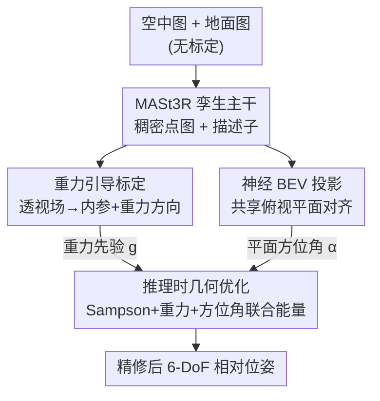

# VGA: Empowering Aerial-Ground Localization by Visual Geometry Alignment

**会议**: CVPR 2026  
**论文**: [CVF Open Access](https://openaccess.thecvf.com/content/CVPR2026/html/Lin_VGA_Empowering_Aerial-Ground_Localization_by_Visual_Geometry_Alignment_CVPR_2026_paper.html)  
**领域**: 3D视觉  
**关键词**: 空地定位, 相对位姿估计, 重力先验, BEV对齐, 推理时优化

## 一句话总结
VGA 针对无标定的空中无人机视角与地面视角之间的极端宽基线 6-DoF 相对位姿估计，在 MASt3R 主干上额外学习两个物理先验——从透视场推出的重力对齐先验、把两视角投到共享俯视平面后做 Procrustes 对齐的平面方位先验，再用一个推理时联合优化把两类先验当几何约束去精修位姿，在 MatrixCity / ACC-NVS1 / ULTRRA 上把 AUC@30° 较次优方法提升约 11%。

## 研究背景与动机

**领域现状**：让一张地面视角图像相对一张空中无人机/卫星图像求出 6-DoF 相对位姿（即"空地定位"），是地空协同、自主导航、跨视角场景理解的基础问题。主流路线有两条：一条是经典/学习式的对应匹配 + 位姿求解（SfM、COLMAP、SuperPoint+SuperGlue，以及近年的 3D 基础模型 DUSt3R、MASt3R、VGGT、π³），靠跨视角找点对再解本质矩阵；另一条是细粒度跨视角定位，把地面图投到俯视（BEV）平面，估计相对卫星图的方位角和平面平移。

**现有痛点**：第一条路线在空地配对上"水土不服"——地面图是近水平视角、空中图是高空斜视，可见表面、遮挡、尺度、分辨率差异都极大，细结构在斜视图里直接糊掉，导致对应匹配大面积失败，3D 基础模型的精度在空地对上断崖式下跌（表 1 里 MASt3R 原版甚至全线失败）。第二条路线虽然能稳定估方位角和平移，但它假设地面相机高度恒定、且依赖标定良好的卫星正射图，碰到无人机的可变高度、斜视角和重新冒出来的尺度歧义就失效。

**核心矛盾**：空地极端视角差让"纯靠像素级对应"这条信息通道变得极不可靠，而现有学习式回归/匹配模型又缺乏对未见视角、未见高度的泛化能力（纯几何回归一旦换分布就崩）。问题的根源是搜索空间太大、又没有物理约束去收紧它。

**本文目标**：在无标定、跨高度的空地图像对上，稳健估计完整 6-DoF 相对位姿，同时顺带把每视角内参、重力方向、度量尺度也预测出来。

**切入角度**：作者注意到城市场景里有大量"重力对齐"的视觉线索（竖直的建筑边、消失点可定 roll/pitch；水平的路面、屋顶可定俯仰），而一旦两视角都对齐到重力方向并投到同一个俯视度量平面，6-DoF 匹配就被降维成只剩平面内旋转（方位角 α）和平面平移的 4-DoF 问题——这是一个远比透视空间直接匹配稳定的设置。

**核心 idea**：把两个"物理上有意义"的几何先验（重力对齐 + 共享 BEV 平面对齐）从视觉输入直接学出来，再在推理时用它们作为旋转的全局正则项去联合优化前馈给出的相对位姿，用物理约束补上学习式方法的泛化缺口。

## 方法详解

### 整体框架
VGA 是一个两阶段框架。第一阶段是一个稠密几何回归网络：用 MASt3R 的孪生（Siamese）ViT 主干同时吃进空中图 $I^a$ 和地面图 $I^g$，除了原本的稠密 3D 点图、置信度、描述子之外，额外挂两条分支——**标定分支**预测每视角内参 $\xi^v=(\mathrm{vfov},c_x,c_y,\theta,\phi)^v$ 和稠密透视场 $(\mathbf{u},\varphi)^v$，**BEV 分支**用一个 Neural BEV Projector 把特征投到共享俯视平面，解码出 BEV 点图、置信度和 BEV 描述子。第二阶段是推理时的 Post-Geometry Optimization：把第一阶段预测的重力方向、BEV 方位角当几何约束，和透视空间的重投影误差一起塞进一个联合能量函数，迭代精修相对位姿 $P^{ag}=[R^{ag}\mid t^{ag}]$，输出全局一致的 6-DoF 结果。整个优化只增加几毫秒开销。

### 关键设计

**1. 重力引导标定：用透视场把 roll/pitch 锚到物理重力方向，砍掉旋转搜索空间**

空地匹配里 6-DoF 旋转的歧义太大，作者的做法是把旋转分解为"重力对齐分量 + 残差方位角 α"，先把前者用物理线索钉死。具体在主干上加一组标定 token，经 Transformer Decoder 与图像特征交互得到标定嵌入 $\mathbf{c}^v$，再用轻量 MLP 头回归出 $\xi^v=(\mathrm{vfov},c_x,c_y,\theta,\phi)^v$，其中 $(\theta,\phi)$ 就是相对重力的俯仰和滚转。同时用一个 DPT 头解出稠密透视场：每个像素的上向量 $\mathbf{u}_p=\frac{\Pi(X_p-c\vec{\mathbf{g}})-\Pi(X_p)}{\lVert\Pi(X_p-c\vec{\mathbf{g}})-\Pi(X_p)\rVert_2}$ 描述该点 3D 向上方向在像平面的投影，纬度 $\varphi_p=\arcsin\!\big(\frac{\mathbf{r}_p\cdot\vec{\mathbf{g}}}{\lVert\mathbf{r}_p\rVert_2}\big)$ 描述视线与水平面的夹角。上向量来自竖直结构（楼边、树），纬度来自水平面（路、屋顶），都是城市场景里稳定可见的线索。关键在于：虽然透视场理论上能由重力方向和 3D 点算出，VGA 仍显式把它当独立输出回归，因为这样才能在推理时用 Levenberg–Marquardt 进一步精修标定 $\xi_v^*=\mathrm{LM}(\xi^v,\mathbf{u}^v,\varphi^v)$，拿到优化后的重力向量当全局先验——比让网络隐式吐一个数更可控、更物理。

**2. 神经 BEV 投影：把跨视角匹配从 6-DoF 降到 4-DoF 平面对齐**

地面近水平视角和空中斜视之间几乎没有像素级重叠，直接在透视空间找对应注定不稳。作者的解法是把两视角都映射到同一个重力对齐的俯视度量平面：在这个平面里，未知量只剩平面内旋转 α 和平面平移，匹配设置远比透视空间稳。但现成 BEV 投影法都假设已知内参且图像直立，没法用在无标定、任意朝向的空地场景。于是作者提出 Neural BEV Projector $f(\cdot)$，让它吃进隐式内参和重力嵌入 $\mathbf{c}^v$ 以及特征 token $T^v$，把可学习查询 $Q^v$ 解码成规范 BEV 表示：$X^v_{\mathrm{bev}},C^v_{\mathrm{bev}},D^v_{\mathrm{bev}}=f(Q^v,T^v,\mathbf{c}^v)$。监督时的 BEV 真值由两视角的 GT 3D 点图在空中坐标系合并、再投到规范 BEV 得到——这种融合逼着网络整合空地互补的空间线索、缓解遮挡歧义。这样学出来的 BEV 描述子既视角不变、又保留来自标定参数的真实度量尺度，让没有像素重叠的两视角也能在平面上对齐。

**3. 推理时几何优化：把两个物理先验当旋转正则，联合精修位姿**

前馈网络给出的位姿在宽基线、训练分布外的场景容易泛化失败，作者不重训网络，而是在推理时加一个联合能量去精修：

$$\{R^{ag}\}^*,\{t^{ag}\}^*=\arg\min_{R^{ag},t^{ag}}\ \lambda_S\,\mathcal{E}_S+\lambda_g\,\mathcal{E}_g+\lambda_\alpha\,\mathcal{E}_\alpha.$$

三项各管一件事：$\mathcal{E}_S$ 是 MASt3R 内点对应上的 Sampson 重投影误差，提供透视空间的对极几何约束、可分解出旋转平移；$\mathcal{E}_g=\lVert R^{ag}\vec{\mathbf{g}}^g-\vec{\mathbf{g}}^a\rVert_2^2$ 用设计 1 的重力向量正则化旋转的 roll/pitch 分量，把每个视角锚到物理直立朝向；$\mathcal{E}_\alpha=\lVert\log({R^{ag}_z}^\top R_z(\alpha))\rVert_2^2$ 用设计 2 的 BEV 平面方位角 α 约束剩余的绕重力轴旋转，其中 α 由两视角 BEV 点图经 Kabsch–Umeyama 求解器在 RANSAC 循环里做 Procrustes 对齐得到 $(\alpha,\Delta x,\Delta y,s)$。三项合起来把 6-DoF 搜索空间从两个正交方向（重力轴外的 roll/pitch、重力轴内的方位角）同时收紧，于是即便对应稀少也能稳定收敛到全局一致的位姿。权重取 $\lambda_S=10^{-2},\lambda_g=5\times10^{-2},\lambda_\alpha=10^{-3}$。

### 损失函数 / 训练策略
训练分两阶段：先按 MASt3R 默认设置和 AerialMegaDepth 协议在空地对上微调主干 20 epoch（8×48G L40，有效 batch 32），再固定主干、用总损失训练新分支 50 epoch（AdamW，lr $1\times10^{-4}$，cosine 调度 + 5 epoch warm-up，共约 60 小时）。总损失为

$$\mathcal{L}=\lambda_{Pers}\mathcal{L}_{Pers}+\lambda_\xi\mathcal{L}_\xi+\lambda_{conf}\mathcal{L}^{\text{bev}}_{\text{conf}}+\lambda_{match}\mathcal{L}^{\text{bev}}_{\text{match}},$$

其中透视场损失 $\mathcal{L}_{Pers}=\sum_p\arccos(\mathbf{u}^{gt}_p\cdot\mathbf{u}_p)+\lVert\varphi^{gt}_p-\varphi_p\rVert_1$ 监督方向与纬度，标定损失 $\mathcal{L}_\xi=\sum\lVert\xi^{gt}-\xi\rVert_1$，BEV 几何用置信度加权的度量回归损失，BEV 匹配用 InfoNCE 在 GT 对应上做对比学习（每对图随机采 2048 个对应，BEV 局部特征维度 24，BEV 网格 200×200 覆盖地面 100m×100m）。

## 实验关键数据

### 主实验
两套训练数据：MatrixCity（UE5 渲染的合成大城市，作者整出 309,330 对空地图像对）与 AerialMegaDepth（真实+伪合成，约 105k 对，专训 BEV 分支）。评测指标用 RRA@τ / RTA@τ（相对旋转/平移精度低于阈值 τ 的配对占比）和 AUC@30°。

MatrixCity (BigCity) 主结果（粗体为最优）：

| 方法 | RTA@25° | RRA@25° | AUC@30° |
|------|---------|---------|---------|
| ROMA | 10.82 | 4.60 | 3.59 |
| VGGT | 11.74 | 1.96 | 1.66 |
| π³ | 17.48 | 16.00 | 1.52 |
| MASt3R (AerialMegaDepth) | 24.92 | 13.52 | 9.78 |
| MASt3R (AMD+MatrixCity) | 37.10 | 33.54 | 29.12 |
| **VGA (Ours)** | **45.64** | **46.70** | **34.97** |

ACC-NVS1 + ULTRRA 零样本泛化（未做数据集专门微调）：

| 方法 | RTA@25° | RRA@25° | AUC@30° |
|------|---------|---------|---------|
| MASt3R (AerialMegaDepth) | 54.94 | 52.90 | 34.75 |
| VGGT | 40.82 | 54.72 | 25.13 |
| π³ | 71.26 | 75.70 | 43.45 |
| **VGA (Ours)** | **72.74** | **76.34** | **47.45** |

VGA 在两套零样本基准上都建立新 SOTA，RRA@25° 较次优（π³）高约 6.9%、AUC@30° 高约 4.0%；论文摘要给出的整体提升是较次优方法约 11% AUC@30°。值得注意的是 MASt3R 原版发布权重在 BigCity 上全线失败（表内标 "-"），π³ 虽也在 MatrixCity 上训过却无法在 BigCity 恢复一致对齐，说明纯前馈几何模型在这种极端配对上很脆。

### 消融实验
在 MatrixCity (BigCity) 上拆开两个先验（Baseline = MASt3R 前馈输出、不做后优化）：

| 配置 | RTA@25° | RRA@25° | AUC@30° | 说明 |
|------|---------|---------|---------|------|
| Baseline | 37.10 | 33.54 | 29.12 | 纯前馈，无后优化 |
| + Planar Alignment | 37.92 | 35.62 | 31.36 | 只加 BEV 平面方位约束 |
| + Gravity Prior | 40.60 | 41.28 | 33.38 | 只加重力先验 |
| Joint Optimization | 45.64 | 46.70 | 34.97 | 两者联合（完整模型） |

### 关键发现
- **重力先验是涨点主力**：单加重力先验就把 AUC@30° 从 29.12 推到 33.38、RRA@25° 从 33.54 推到 41.28，说明把 roll/pitch 锚到物理直立朝向对宽基线下的旋转稳定性贡献最大。
- **BEV 平面对齐增益较小但互补**：单加平面对齐只把 AUC@30° 提到 31.36，作者归因于 BEV 投影本身比透视场预测更难学、投影不完美；但它提供的方位角约束与重力先验正交，两者联合（34.97）明显高于任一单项，证明两个先验在"重力轴外旋转 + 绕重力轴旋转"上互补。
- **后优化几乎零成本**：联合优化仅增加几毫秒、却把 RTA@25° 从 33.54 一路抬到 46.70，整体 5–8% 的稳定增益，性价比很高。

## 亮点与洞察
- **把"匹配难"问题降维成"对齐易"问题**：核心洞察是先用重力把 roll/pitch 钉死、再投到共享 BEV 平面，让 6-DoF 退化成 4-DoF 平面对齐——这把空地匹配里最难啃的尺度+视角歧义绕开了，思路可迁移到任何宽基线、低重叠的跨视角位姿问题。
- **显式回归透视场是为了可优化，而非冗余**：透视场本可由重力和 3D 点算出，作者偏要显式输出，就为了能在推理时用 LM 反过来精修标定——这种"为下游优化预留接口"的设计值得借鉴。
- **不重训、只在推理时加物理约束补泛化**：把学习式前馈位姿和物理先验解耦，用一个轻量联合能量在推理时收紧搜索空间，绕开了纯回归模型换分布就崩的老问题，零样本基准上直接 SOTA。

## 局限与展望
- **只做两视角配对**：当前框架假设成对空地输入，没利用时序或多视角一致性；作者自己指出未来要扩到多帧/序列设置以获得时间一致的位姿。
- **BEV 投影是短板**：消融显示 BEV 平面对齐增益偏小，作者承认 BEV 投影比透视场更难学、投影质量有限，这块的上限尚未被充分挖掘。
- **额外预测的内参/度量尺度没被正式评测**：VGA 顺带预测了内参和度量尺度，但标准评测协议假设已知内参，这些输出未被显式验证，其真实精度存疑（自标定、跨传感器对齐等下游价值仍待证）。
- **依赖城市重力线索**：重力先验靠竖直/水平结构（楼边、路面）支撑，在缺乏规则人造结构的自然/野外场景里这类线索可能不可靠。

## 相关工作与启发
- **vs 3D 基础模型（DUSt3R / MASt3R / VGGT / π³）**：它们靠多视角 3D 提升 + 对应匹配联合预测位姿，但在空地极端视角差下精度断崖式下跌（VGGT、原版 MASt3R 在 BigCity 近乎失败）。VGA 直接在 MASt3R 主干上加物理先验和后优化，相当于给基础模型补了一层几何约束。
- **vs 细粒度跨视角定位（Xia et al. 等卫星-地面方法）**：它们也用 BEV + Procrustes 估方位角和平移，但假设地面相机高度恒定、依赖标定卫星正射图。VGA 处理的是可变高度、斜视的无人机图，把这类方法的平面对齐思想搬到无标定空地设置，并补上重力分支解决朝向歧义。
- **vs 端到端相对位姿回归（RPR）**：纯回归换视角/高度分布就泛化失败，VGA 用推理时的物理先验优化显式收紧搜索空间，证明"几何先验 + 学习式 3D 表示"组合比纯回归更稳。

## 评分
- 新颖性: ⭐⭐⭐⭐ 把重力对齐 + 共享 BEV 平面对齐两个物理先验组合进 MASt3R 并用推理时联合优化收紧 6-DoF 搜索空间，针对空地宽基线场景的切入角度新颖。
- 实验充分度: ⭐⭐⭐⭐ 三套基准（含两套零样本）+ 先验拆解消融较扎实，但内参/度量尺度预测未被正式评测、BEV 增益偏小的原因只定性解释。
- 写作质量: ⭐⭐⭐⭐ 动机链条清晰、公式完整，两阶段框架讲得明白；少量符号和缓存 OCR 噪声需对照原文。
- 价值: ⭐⭐⭐⭐ 空地协同/跨视角定位是有实用需求的硬问题，"推理时物理约束补泛化"的范式对其他宽基线位姿任务有迁移价值。

<!-- RELATED:START -->

## 相关论文

- [\[CVPR 2026\] Towards Visual Query Localization in the 3D World](towards_visual_query_localization_in_the_3d_world.md)
- [\[CVPR 2026\] AsymLoc: Towards Asymmetric Feature Matching for Efficient Visual Localization](asymloc_towards_asymmetric_feature_matching_for_efficient_visual_localization.md)
- [\[CVPR 2026\] PV-Ground: Text-Guided Point-Voxel Interaction for 3D Visual Grounding](pv-ground_text-guided_point-voxel_interaction_for_3d_visual_grounding.md)
- [\[AAAI 2026\] Griffin: Aerial-Ground Cooperative Detection and Tracking Dataset and Benchmark](../../AAAI2026/3d_vision/griffin_aerial-ground_cooperative_detection_and_tracking_dataset_and_benchmark.md)
- [\[CVPR 2026\] Simple but Effective Triplet-Based Compression Strategies for Compact Visual Localization](simple_but_effective_triplet-based_compression_strategies_for_compact_visual_loc.md)

<!-- RELATED:END -->
