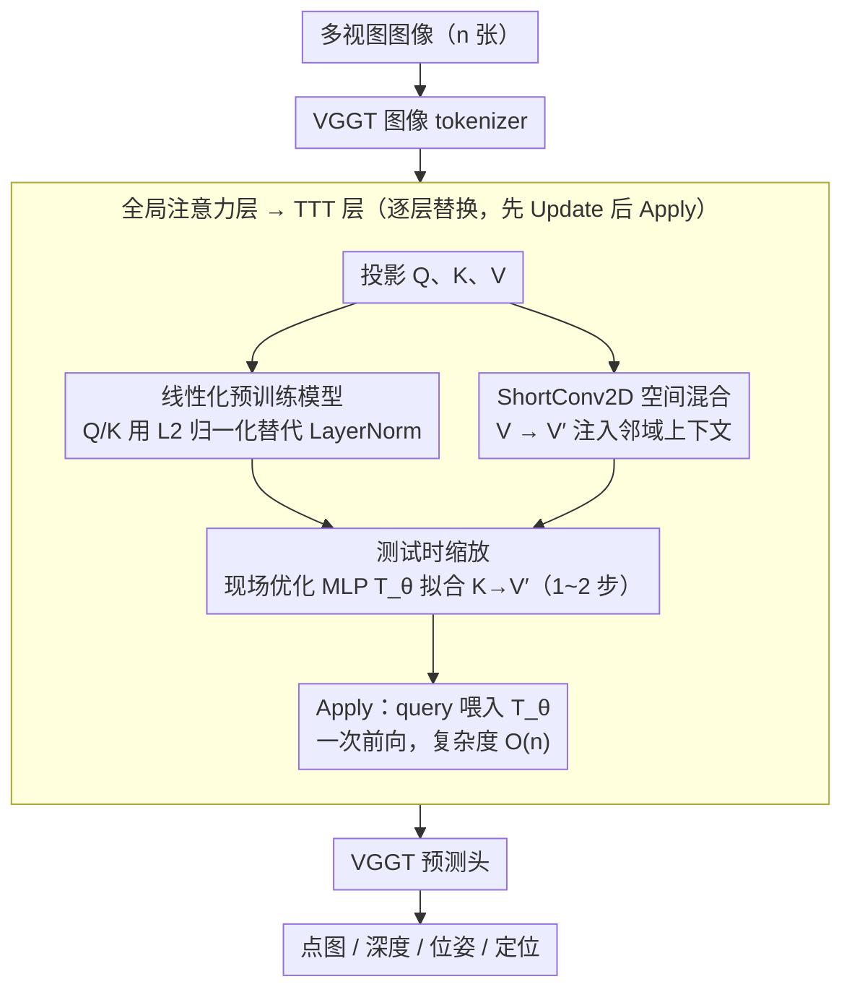

# VGG-T3: Offline Feed-Forward 3D Reconstruction at Scale

**会议**: CVPR 2026  
**arXiv**: [2602.23361](https://arxiv.org/abs/2602.23361)  
**代码**: 无  
**领域**: 3D Vision / 三维重建  
**关键词**: 3D重建, Test-Time Training, 线性复杂度, KV压缩, 视觉定位  

## 一句话总结

提出VGG-T3，通过**测试时训练(TTT)**将VGGT中全局注意力层的变长KV表示压缩为固定大小MLP，将离线前馈三维重建的计算复杂度从 $O(n^2)$ 降至 $O(n)$，实现了千张图片级别的大规模场景重建（1k张图仅需58秒）。

## 研究背景与动机

**领域现状**：前馈式多视图三维重建（如VGGT、Fast3R）利用Transformer全局自注意力实现多视图推理，精度已可媲美经典COLMAP流水线，且在困难条件下更鲁棒。

**现有痛点**：这些方法的计算复杂度和显存需求随输入图像数量 $n$ **二次增长**，核心瓶颈在于全局softmax注意力操作需查询所有图像token构成的变长KV空间。VGGT处理1k张图片耗时超过11分钟。

**核心矛盾**：现有加速方法（如FastVGGT的token合并、SparseVGGT的稀疏注意力）虽然降低常数因子，但**渐近复杂度仍为二次**：$O(n^2) \to O(n/r)^2$。在线方法（如CUT3R、Must3R）使用固定大小隐式记忆但精度受限且容易漂移。

**本文目标**：在保持全局离线重建精度优势的同时，将复杂度降至线性 $O(n)$，支持任意规模图像集合的重建。

**切入角度**：受DeepSDF启发——将变长表示压缩为固定大小的可优化参数。将VGGT全局注意力层的变长KV空间通过TTT蒸馏到固定大小MLP的权重中。

**核心idea**：用TTT机制学习一个MLP $T_\theta$，使其学会从Key到Value的映射关系（$\arg\min_\theta \sum_i L_t(T_\theta(k_i) - v_i)$），推理时只需将query输入这个MLP即可获得输出，操作对序列长度是线性的。

## 方法详解

### 整体框架

VGG-T3 想解决的事很具体：VGGT 靠全局 softmax 注意力做多视图推理，每加一张图都要把它的 token 塞进一个变长的 KV 空间里被所有 query 查询，于是计算量随图片数 $n$ 二次膨胀，1k 张图要跑 11 分钟。VGG-T3 的做法是不再保留这个会越长越大的 KV 空间，而是把它"背"进一个固定大小的 MLP 权重里——这正是从 DeepSDF 借来的直觉：用一组可优化的固定参数去编码一个实例的几何。

它保留 VGGT 的图像 tokenizer 和各个预测头，只把所有**全局注意力层**换成 TTT 层，每一层内部分两步走。先是 **Update**：把本层输入 token 投影成 Q、K、V，然后在测试时现场优化一个 MLP $T_\theta$，让它学会从 key 映射到 value（$\arg\min_\theta \sum_i L_t(T_\theta(k_i), v_i)$）——优化完，整个变长的 KV 关系就被压进了 $\theta$ 里。再是 **Apply**：把这一层的 query $q$ 直接喂进优化好的 $T_\theta$ 拿到输出 token，传给下一层。关键在于 Apply 只是一次前向，对序列长度是 $O(n)$ 的，KV 空间多大都不再影响推理复杂度。

### 关键设计

**1. 线性化预训练模型：让 TTT 能在 VGGT 权重上快速收敛**

直接拿 VGGT 的预训练权重起步，保留它的 $W_q, W_k, W_v$ 投影矩阵，省去从头训练。但有个坑：VGGT 的 QK 投影带 LayerNorm（$q_i = \text{LN}_q(W_q x_i)$），而 LN 里那组可学习的缩放/平移参数会在 TTT 现场优化时扭曲输入空间，让 MLP 收敛慢到几乎没法用。解法是把 QK 上的 LN 换成参数无关的 $L_2$ 归一化，输入空间稳定下来后 TTT 一两步就能拟合，快速收敛被解锁。这种"先拿大模型权重、再换掉碍事的归一化做线性化"的 post-training linearization 思路在 LLM 里已被验证过，迁来这里把微调成本压得很低。

**2. ShortConv2D 非线性空间混合：堵死 TTT 的平凡解**

如果不加处理，TTT 目标其实学不到东西：$K = W_k x$、$V = W_v x$ 都是同一个 $x$ 的线性投影，理论上存在 $V = W_v W_k^{-1} K$ 的闭式解，MLP 只要逼近这个线性映射就能把 loss 压到零，等于什么几何都没学到。VGG-T3 在 value 这一侧插入一个 ShortConv2D，把目标从 $K \to V$ 改成 $K \to V'$，其中 $V'$ 已经混进了局部空间上下文：先把 1D token 序列 reshape 成 $(N, H/p, W/p, d)$ 的 2D 图像网格，过一层 2D 卷积聚合邻域信息，再 flatten 回 1D。这样 K 到 V' 之间不再是简单线性关系，MLP 被迫从单个 token 的特征去预测一个含邻域信息的目标，学到的才是更鲁棒的几何场景表示而非恒等近似。

**3. 测试时缩放：让固定容量的 MLP 也能吞下千张图的大场景**

训练时每层 TTT 通常 1 步优化就够，但推理碰到 1k 张图这种远超训练分布的规模时，要把这么大一个场景压进固定维度的 MLP，1 步根本压不下，重建会明显变差。这里不需要复杂调度——把优化步数从 1 步加到 2 步，就能在序列长度大幅增长时把精度拉回接近小规模时的水平，实现近乎恒定的长度泛化。代价只是推理时多跑一轮内层优化，换来对任意规模图像集合的支撑。

### 损失函数与训练

TTT 内层用 dot product loss 做优化目标：

$$L_t(T_\theta(k_i), v_i) = T_\theta(k_i)^T v_i$$

快速权重网络 $T_\theta$ 用 SwiGLU MLP、内层用 Muon 优化器（沿用 LaCT 的配置）。外层训练时冻结所有原始 VGGT 参数，只微调被换成 TTT 层的那些全局注意力层，共训 100k 步，总成本约为从头训练一个 VGGT 的 12%。

## 实验关键数据

### 主实验：标准基准

| 方法 | 复杂度 | DTU CD↓ | ETH3D CD↓ | NRGBD-D CD↓ | 7scenes-D NC↑ |
|------|--------|---------|-----------|-------------|---------------|
| VGGT | $O(n^2)$ | 1.537 | 0.279 | 0.014 | 0.668 |
| SparseVGGT | $O(n^2)$ | 1.541 | 0.327 | 0.018 | 0.665 |
| TTT3R | $O(n)$ | 5.708 | 0.885 | 0.071 | 0.666 |
| **VGG-T3** | $O(n)$ | **1.654** | **0.480** | **0.029** | **0.679** |

- 点图估计：在所有数据集上**大幅超越**唯一的 $O(n)$ 基线TTT3R（DTU误差降低2-2.5×），与 $O(n^2)$ 方法保持竞争力
- 视频深度估计：KITTI上 $\delta<1.25$ 达到0.967，与 $O(n^2)$ 方法持平

### 大规模重建性能

| 图像数量 | VGG-T3 | VGGT | FastVGGT | TTT3R |
|----------|--------|------|----------|-------|
| 1k张 | **58s** | 11min (11.6×慢) | 4min (4.3×慢) | ~60s |
| 2k张(4GPU) | **48.5s** | 1590s | N/A | N/A |

### 消融实验

| 设计 | DTU CD↓ | ETH3D CD↓ |
|------|---------|-----------|
| 无ShortConv2D | 性能显著下降 | 显著下降 |
| LayerNorm代替L2 Norm | 收敛极慢 | - |
| 1步TTT（1k图） | 误差增加~5× | - |
| 2步TTT（1k图） | 接近小规模精度 | 稳定 |

### 关键发现

1. VGG-T3在重建质量上与 $O(n^2)$ 方法的差距**随图像数量增加而缩小**
2. 支持单GPU处理任意大小图像集合（通过minibatch offload到CPU），也支持多GPU分布式推理
3. 视觉定位：冻结TTT-MLP后可执行前馈定位，7scenes上 $e_r=6.71°, e_t=0.15$m

## 亮点

1. **优雅的核心洞察**：将注意力中的KV空间视为"变长场景表示"，通过TTT压缩为"固定大小场景表示"，类比DeepSDF的思路——非常自然且深刻
2. **实用的大规模方案**：TTT目标的可加性（梯度可按minibatch累加）天然支持分布式推理和CPU offloading，这是softmax attention无法实现的
3. **统一重建与定位**：同一个模型、同一个TTT-MLP既能mapping也能localization，开辟了全新的统一端到端方案
4. **低微调成本**：冻结VGGT大部分参数，仅训练全局注意力层新参数，成本约为从头训练的12%

## 局限性

1. **相机位姿估计较弱**：TTT线性化模型在pose estimation上表现不佳，可能与VGGT中camera token的异构设计有关，是未来需要重点解决的问题
2. **与softmax attention仍有差距**：尤其在宽基线设置下，MLP的固定容量限制了场景表达能力
3. **训练成本仍然不低**：虽然是VGGT的12%，但仍需8×A100-80GB训练100k步
4. **视觉定位验证有限**：仅在7scenes和Wayspots上展示，与专用定位管线（如Reloc3R）仍有明显差距

## 相关工作

- **VGGT**：本文基础架构，全局softmax attention实现多视图推理，精度高但O(n²)复杂度
- **FastVGGT / SparseVGGT**：通过token merging / block-sparse attention加速，渐近复杂度不变
- **TTT3R**：并行工作，基于CUT3R的自回归TTT模型，O(n)但精度较低且不支持无序输入
- **CUT3R / Must3R / Point3R**：在线方法，使用固定大小隐式/空间记忆，线性但全局一致性差
- **LaCT (Sun et al.)**：TTT框架提出者，VGG-T3采用其SwiGLU MLP + Muon优化器
- **DeepSDF**：隐式表示经典工作，本文核心"固定大小网络编码实例几何"思路与之一脉相承

## 评分

- 新颖性: ⭐⭐⭐⭐ — 将LLM领域post-training linearization和TTT巧妙迁移至3D重建，ShortConv2D设计有针对性
- 实验充分度: ⭐⭐⭐⭐⭐ — 覆盖pointmap、深度、位姿、定位四大任务，含大规模评测和分布式推理，消融完整
- 写作质量: ⭐⭐⭐⭐ — 逻辑清晰，motivation层层递进，图表信息量大
- 价值: ⭐⭐⭐⭐⭐ — 解决前馈3D重建可扩展性瓶颈，11.6×加速下精度损失极小，对大规模场景重建有直接实用价值

<!-- RELATED:START -->

## 相关论文

- [\[CVPR 2026\] Speed3R: Sparse Feed-forward 3D Reconstruction Models](speed3r_sparse_feed-forward_3d_reconstruction_models.md)
- [\[CVPR 2026\] PanoVGGT: Feed-Forward 3D Reconstruction from Panoramic Imagery](panovggt_feed-forward_3d_reconstruction_from_panoramic_imagery.md)
- [\[CVPR 2026\] MoRe: Motion-aware Feed-forward 4D Reconstruction Transformer](more_motion-aware_feed-forward_4d_reconstruction_transformer.md)
- [\[CVPR 2026\] Particulate: Feed-Forward 3D Object Articulation](particulate_feed-forward_3d_object_articulation.md)
- [\[ICML 2026\] Trust3R: Evidential Uncertainty for Feed-Forward 3D Reconstruction](../../ICML2026/3d_vision/trust_it_or_not_evidential_uncertainty_for_feed-forward_3d_reconstruction_with_t.md)

<!-- RELATED:END -->
