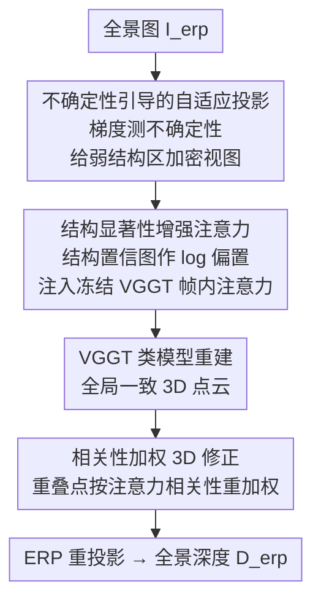

# VGGT-360: Geometry-Consistent Zero-Shot Panoramic Depth Estimation

**会议**: CVPR 2026  
**论文**: [CVF Open Access](https://openaccess.thecvf.com/content/CVPR2026/html/Yuan_VGGT-360_Geometry-Consistent_Zero-Shot_Panoramic_Depth_Estimation_CVPR_2026_paper.html)  
**代码**: https://github.com/Yuanjiayii/VGGT-360  
**领域**: 3D视觉  
**关键词**: 全景深度估计, 零样本, VGGT, 训练无关, 几何一致性

## 一句话总结
VGGT-360 把全景单目深度估计重新表述为"先用 VGGT 类 3D 基础模型从多视角重建一个全局一致的 3D 模型、再投影回全景"的问题，通过三个免训练即插即用模块（不确定性引导的自适应投影、结构显著性增强注意力、相关性加权 3D 修正）把过去各视角独立推理的碎片化深度统一成跨视图一致的结果，在多个室内外数据集上零样本超过有监督和免训练 SOTA。

## 研究背景与动机
**领域现状**：360° 全景图通常以等距柱状投影（ERP）存储，全景单目深度估计（MDE）是全向 SLAM、VR、自动导航的基础能力。现有方法分两类：一类是**有监督**的球面/畸变感知网络（BiFuse、UniFuse、HoHoNet 等），直接在 ERP 域回归深度；另一类是**免训练**方法（360MD、HDE360、RPG360），把全景切成若干透视视图，用预训练的透视 MDE 模型（MiDaS、Depth Anything）逐视图推理再融合回 ERP。

**现有痛点**：有监督方法被标注全景数据的稀缺卡死——大规模带 GT 深度的全景数据极难获取，导致精度和泛化都受限。免训练方法虽然绕开了标注，却有一个结构性缺陷：**各透视视图是相互独立推理的，缺乏跨视图交互**，于是产生尺度歧义（每个视图各自估一个尺度对不齐）和跨视图深度断裂，最终几何保真度和结构细节都差。Fig.1 给出对比：传统免训练方法（360MD）Abs Rel 0.141、耗时 13.31s，而本文 0.055、1.54s。

**核心矛盾**：全景深度的本质是一个**全局一致的几何场**，但"切片—独立推理—融合"的范式从根上就是在拼接互不知情的局部预测，再怎么融合也补不回缺失的跨视图几何约束。

**切入角度**：作者注意到 VGGT 这类 3D 基础模型与普通深度基础模型有本质区别——VGGT 不是从 2D 数据里学隐式几何先验，而是用跨视图几何线索**显式重建一个一致的 3D 表示**。如果先让 VGGT 从多视图把场景重建成一个全局一致的 3D 模型，再把这个 3D 模型投影回全景取深度，那"跨视图一致性"就天然内建了，碎片化问题自然消失。

**核心 idea**：把全景深度估计从"逐视图深度融合"改写成"全景 → 3D（VGGT 重建）→ 全景深度（ERP 重投影）"。难点在于 VGGT 原本只在透视图上训练，直接喂全景切片会遇到球面畸变、非均匀分辨率、360° 环绕连续性等域差，所以需要三个免训练模块在"投影—重建—修正"三个环节分别加固。

## 方法详解

### 整体框架
给定单张等距柱状全景 $I_{erp}\in\mathbb{R}^{H\times W\times 3}$，VGGT-360 的流水线是：先**自适应地**把全景切成多张透视视图，喂给冻结的 VGGT 类模型做多视角 3D 推理重建出全局一致的点云（point map），最后把 3D 模型经 ERP 投影重投回全景得到深度图 $D_{erp}\in\mathbb{R}^{H\times W}$。整套框架不动 VGGT 任何预训练权重，三个模块都是即插即用的，可无缝换用 VGGT、π³、Fastvggt 等不同骨干。

三个模块各管一个环节：(1) **不确定性引导的自适应投影**解决"喂什么进 VGGT"——不再均匀切片，而是把更多视图分配给几何信息贫乏的区域；(2) **结构显著性增强注意力**解决"VGGT 重建时在弱结构区会崩"——往帧内注意力里注入结构置信度先验，把注意力引向几何可靠区；(3) **相关性加权 3D 修正**解决"重叠区多视图点对不齐"——用注意力推出的相关性给重叠点重新加权，让重投影有干净的几何基础。

### 关键设计

**1. 不确定性引导的自适应投影：把视图预算花在几何最难的地方**

痛点是过去切片用固定方案（cubemap 等均匀投影），假设所有朝向同等重要——但实际上墙面、天花板这类弱结构区几何线索极少、最难估深度，均匀切片白白把视图浪费在好估的区域。本设计分两步把预算挪给难区。先做**不确定性打分**：从 $N_B$（$N_B\ge 6$）张全覆盖、可控重叠的基础视图出发，用 Sobel 梯度幅值衡量边缘丰富度/几何显著性，逐像素算不确定图 $U(p)=\sigma(-Z(p))$，其中

$$Z(p)=\big(G(p)-\mathrm{median}_{p'\in\Omega(v_b)}(G(p'))\big)/\tau$$

$G(p)$ 是 Sobel 梯度幅值、$\tau$ 控归一化灵敏度；再对有效像素做面积加权得到视图分数 $S(v_b)=\frac{\sum_{p}\mathbb{1}_{valid}(p)U(p)}{\sum_{p}\mathbb{1}_{valid}(p)}$。注意梯度大 → $Z$ 大 → $-Z$ 小 → 经 $\sigma$ 后 $U$ 小，所以梯度稀疏（弱结构）的视图反而拿到高不确定分。然后做**自适应邻域增广**：取不确定分最高的 top-$K$ 视图 $B^*$，为每张选中视图按预定 yaw/pitch 偏移（中心的右上、左下）生成两张邻居视图 $N(v_b^*)$，最终视图集 $V_{per}=B\cup N(B^*)$。这样在固定预算下既保住全局覆盖，又在几何模糊区加密采样，给 VGGT 更可靠的几何信息输入（实现取 $N_B{=}8$、$K{=}2$）。

**2. 结构显著性增强注意力：不改权重，把 VGGT 的注意力按住在可靠几何上**

痛点是 VGGT 虽然零样本泛化强，但在弱结构区（缺可靠几何线索）容易产生伪影和幻觉深度。本设计往 VGGT 的帧内注意力里注入一张**结构感知置信图** $M_s$，把多视图聚合引向几何稳定区，且**完全不动预训练权重**。$M_s$ 由两部分构成：用 Sobel 算的梯度几何先验 $M_g(p)=\sigma(Z(p))$ 高亮结构可靠区；再加一个**边缘带先验** $E(p)=\mathbb{1}[\max(|x|,|y|)\ge 1-m]$（$(x,y)\in[-1,1]^2$ 是归一化坐标，$m$ 控带宽），专门强调视图边缘附近的不确定像素以鼓励重叠边界处的跨视图交互。两者合成

$$M_s(p)=\mathbb{1}_{valid}(p)\cdot\big[(1-E(p))\cdot M_g(p)+E(p)\big]$$

随后把 $M_s$ 当作**加性 log-置信偏置**塞进注意力分数：

$$M_{Attn}=\mathrm{softmax}\big(QK^\top/\sqrt{d}+\log(M_s)\big)$$

由于是 log 偏置，$M_s$ 低的可靠性差的 key 被压低、高的被抬升，注意力被"按"在结构稳定的 key 上，从而在弱结构区抑制伪影、在重叠边界保持特征连续。它有效是因为没碰骨干权重就把先验软约束进了注意力分布，等于给冻结模型免费打了个结构补丁。

**3. 相关性加权 3D 修正：用注意力本身判断哪个重叠点可信**

痛点是同一 ERP 像素往往被多张视图观测到、重建出多个 3D 点，这些点在重叠区互相打架，直接平均会把不可靠点的误差也吃进去。本设计给每个重叠点一个**相关性分数**（从 VGGT 最后一层帧内注意力图 $\widetilde{M}_{Attn}$ 推出），分越高越可信、权重越大。对被 $N_K$ 张视图观测的 ERP 像素 $r$，最终深度是多视图深度的加权聚合：

$$D_{erp}(r)=\frac{\sum_{v_k}C_{v_k}(p_k)D_{v_k}(p_k)}{\sum_{v_k}C_{v_k}(p_k)}$$

相关权重 $C_{v_k}(p_k)$ 由三个互补度量相加归一化得到。**锐度 Sharpness** 用归一化 Shannon 熵衡量注意力是否集中：$S_{sharp}(p_k)=1-H(p_k)/\log|\Omega(v_k)|$，熵越低注意力越尖锐、说明模型自信地锁定了少数稳定对应，几何越可靠。**局部性 Locality** 用高斯核给空间距离加权 $S_{loc}(p_k)=\sum_p \widetilde{M}_{Attn}(p_k,p)G(\|x_p-x_{p_k}\|)$，因为稳定几何区通常局部注意、远程注意往往意味着局部特征不可靠要靠远处补。**对称性 Symmetry** 用 Bhattacharyya 系数 $S_{sym}(p_k)=\sum_u\sqrt{\widetilde{M}_{Attn}(p_k,p)\widetilde{M}'_{Attn}(p_k,p)}$ 衡量注意力是否双向（$p_k$ 强烈关注 $p$，可靠对应下 $p$ 也该回看 $p_k$），$\widetilde{M}'_{Attn}$ 是归一化转置。三者预归一化后相加再归一化：$C_{v_k}(p_k)=\mathrm{Norm}(S_{sharp}+S_{loc}+S_{sym})$。这一步有效在于它不引入任何外部监督，纯靠 VGGT 注意力的统计特征自评可靠性，把重叠区的表面连续性和精度都拉上去。

## 实验关键数据

### 主实验
在 Matterport3D、Stanford2D3D、Replica360-2K 三个标准室内基准上对比（↓越低越好，δ↑越高越好）。VGGT-360 用三种 VGGT 类骨干都全面领先，甚至在各数据集**官方训练集上训练过的有监督方法**也被零样本超越。

| 数据集 | 方法 | 训练设置 | Abs Rel↓ | δ1↑ |
|--------|------|----------|----------|------|
| Matterport3D | Depth Anywhere (BiFuse++) | 有监督 M+ | 0.085 | 0.917 |
| Matterport3D | RPG360 (Metric3D v2) | 免训练 | 0.203 | 0.859 |
| Matterport3D | **VGGT-360 (Fastvggt)** | **免训练** | **0.078** | **0.943** |
| Stanford2D3D | Depth Anywhere (BiFuse++) | 有监督 M+ | 0.083 | 0.930 |
| Stanford2D3D | 360MD (MiDaS v2) | 免训练 | 0.268 | 0.636 |
| Stanford2D3D | **VGGT-360 (π³)** | **免训练** | **0.065** | **0.952** |
| Replica360-2K | HDE360 (HoHoNet) | 免训练 | 0.107 | 0.910 |
| Replica360-2K | **VGGT-360 (Fastvggt)** | **免训练** | **0.069** | **0.950** |

论文报告在 Stanford2D3D 和 Replica360-2K 上 Abs Rel 比此前 SOTA 提升约 27–36%。三种骨干（VGGT / π³ / Fastvggt）表现都很接近，印证模块的即插即用通用性。

### 消融实验
基于 VGGT 骨干在 Stanford2D3D 上逐组件消融（Table 2，Baseline Abs Rel 0.080 / RMSE 0.354 / 1.41s）。

| 模块 | 配置 | Abs Rel↓ | RMSE↓ | Time |
|------|------|----------|-------|------|
| 结构注意力 | Baseline | 0.080 | 0.354 | 1.41s |
| 结构注意力 | + $M_g$ | 0.075 | 0.343 | 1.43s |
| 结构注意力 | + $M_g$ + $E$ | 0.073 | 0.346 | 1.44s |
| 结构注意力 | + $M_g$ + $E$ + $\mathbb{1}_{valid}$ | 0.072 | 0.340 | 1.45s |
| 3D 修正 | + $S_{sharp}$ | 0.074 | 0.328 | 1.43s |
| 3D 修正 | + $S_{loc}$ | 0.073 | 0.327 | 1.44s |
| 3D 修正 | + $S_{sym}$ | 0.074 | 0.328 | 1.44s |
| 3D 修正 | + 三者全开 | 0.071 | 0.325 | 1.46s |

### 关键发现
- **三模块对不同骨干都正向且互补**（Fig.9）：换 VGGT / π³ / Fastvggt 三种骨干，三个模块都稳定涨点，证明设计的通用性，而且全程免重训。
- **自适应投影优于盲目堆视图**（Fig.10）：均匀投影 $N_B{=}6$ 性能有限，单纯加视图数收益边际却显著加大算力；$N_B{=}8$ + top-$K{=}2$ 邻居增广拿到最好的精度—效率折中，印证"动态聚焦不确定区"胜过固定采样。
- **结构注意力三件套各司其职**：梯度显著先验 $M_g$ 靠强调结构边缘把 Abs Rel 从 0.080 拉到 0.075（单步最大贡献），边缘带 $E$ 修边界、有效掩码 $\mathbb{1}_{valid}$ 收尾到 0.072，三者互补。
- **相关性三度量协同最好**：sharpness/locality/symmetry 单加任意一个都涨（RMSE 从 0.354 降到 ~0.327），三者全开到 0.325，说明它们从不同角度（注意力集中度、空间紧致、双向一致）共同筛出可靠 3D 结构。
- 整套流水线耗时仅 ~1.46s（RTX 4090 / TITAN RTX），相比传统免训练 360MD 的 13.31s 快近一个数量级，因为是单次前向重建而非逐视图优化融合。

## 亮点与洞察
- **范式重写最值钱**：把"逐视图深度融合"改成"重建一致 3D 模型再重投影"，一举从根上消掉了跨视图尺度歧义和断裂——跨视图一致性不是后处理融合补出来的，而是 3D 重建天然内建的。这个 reframe 比任何单个模块都重要。
- **三模块精准对应三个失效环节**：投影管"输入质量"、注意力管"重建鲁棒"、相关性管"重叠修正"，不是堆 trick 而是沿流水线把每个薄弱点各加固一处，逻辑很干净。
- **不动权重的注意力软先验可迁移**：用 $\log(M_s)$ 当加性偏置往冻结注意力里注入结构置信，是一个非常便宜的"给基础模型打补丁"范式，凡是想给冻结 ViT/注意力模型注入领域先验又不想微调的场景都能借鉴。
- **用注意力自己判断可信度**：sharpness（熵）/locality（高斯距离）/symmetry（Bhattacharyya 双向一致）三个从注意力图统计量推出的可靠性度量，是一个无监督的"自我置信评估"思路，可迁移到任何多视图/多源融合的可信加权问题上。

## 局限与展望
- **强依赖 VGGT 类基础模型的上限**：整个框架的几何保真度被 VGGT/π³/Fastvggt 的重建能力封顶，骨干在极端弱纹理或大尺度室外场景的失效会直接传导到深度（室外只有定性结果、无 GT 评测，说明定量泛化尚未充分验证）。
- **评测以室内为主**：三个定量基准都是室内，室外（OmniPhotos）仅靠视觉合理性定性比较，缺真实 GT 下的室外定量证据。
- **超参与启发式较多**：base 视图数、top-$K$、边缘带宽 $m$、邻居偏移方向都是手工设定的启发式；不确定性靠 Sobel 梯度、相关性靠三个加性度量，这些设计点的最优性和对场景的敏感性还有探索空间。
- **改进方向**：把不确定性打分从手工梯度换成可学习/几何驱动的信号、让自适应投影的视图预算端到端优化、或把三个相关性度量学成一个轻量打分头，都可能进一步提升弱结构区表现。

## 相关工作与启发
- **vs 360MD / RPG360 / HDE360（免训练逐视图融合）**：它们都是切片 → 各视图独立用透视 MDE 推理 → 优化/蒸馏融合回 ERP，缺跨视图几何约束导致尺度不齐和断裂；本文换成统一 3D 重建再投影，从结构上消除碎片化，Abs Rel 与耗时都大幅领先。
- **vs Depth Anywhere / BiFuse++ 等有监督方法**：它们需要 Matterport3D（甚至额外 Structured3D 伪标签）训练，受限于全景标注稀缺、泛化弱；VGGT-360 零训练零标注，却在它们的主场训练集上反超，凸显几何接地设计的泛化力。
- **vs 普通深度基础模型（MiDaS / Depth Anything / Metric3D）**：这些模型学的是 2D 隐式几何先验、逐图独立出深度；VGGT 显式重建跨视图一致 3D，本文正是抓住这点把它接到全景上——是首个把 VGGT 类模型扩展到全景深度的工作。

## 评分
- 新颖性: ⭐⭐⭐⭐⭐ 首个把 VGGT 类 3D 基础模型引入全景深度，并把任务从逐视图融合重写为 3D 重建+重投影，范式层面的创新。
- 实验充分度: ⭐⭐⭐⭐ 三基准 + 三骨干 + 细致逐组件消融很扎实，但室外仅定性、缺真实 GT 下的室外定量评测。
- 写作质量: ⭐⭐⭐⭐⭐ 动机—矛盾—三模块对应失效环节的逻辑非常清晰，公式和图示完整。
- 价值: ⭐⭐⭐⭐⭐ 免训练即插即用、单次前向 ~1.5s、零样本超有监督 SOTA，对全向感知/VR/SLAM 落地价值高。

<!-- RELATED:START -->

## 相关论文

- [\[CVPR 2026\] SO(3)-Equivariant ViT-Adapter for Data-Efficient Zero-Shot Sim-to-Real Indoor Panoramic Depth Estimation](so3-equivariant_vit-adapter_for_data-efficient_zero-shot_sim-to-real_indoor_pano.md)
- [\[CVPR 2026\] Depth Any Panoramas: A Foundation Model for Panoramic Depth Estimation](depth_any_panoramas_a_foundation_model_for_panoramic_depth_estimation.md)
- [\[CVPR 2026\] ConceptPose: Training-Free Zero-Shot Object Pose Estimation using Concept Vectors](conceptpose_training-free_zero-shot_object_pose_estimation_using_concept_vectors.md)
- [\[CVPR 2026\] Zero-Shot Depth Completion with Vision-Language Model](zero-shot_depth_completion_with_vision-language_model.md)
- [\[CVPR 2026\] LaS-Comp: Zero-shot 3D Completion with Latent-Spatial Consistency](las-comp_zero-shot_3d_completion_with_latent-spatial_consistency.md)

<!-- RELATED:END -->
