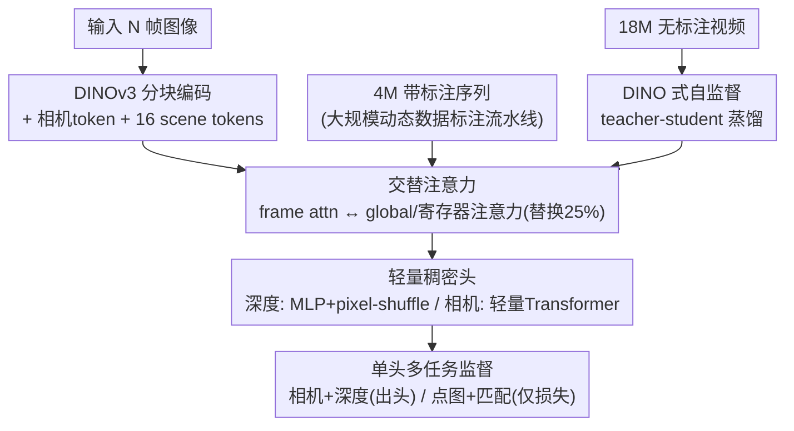

# VGGT-$\Omega$

**会议**: CVPR 2026 (Oral)  
**arXiv**: [2605.15195](https://arxiv.org/abs/2605.15195)  
**代码**: 项目页 http://vggt-omega.github.io/ （代码待确认）  
**领域**: 3D视觉 / 前馈式三维重建  
**关键词**: 前馈重建, 寄存器注意力, scene tokens, 动态场景, 数据规模化, 自监督蒸馏

## 一句话总结
把 VGGT 这类前馈三维重建模型系统性地"做大做强"：通过寄存器注意力 + 轻量稠密头 + 单头多任务监督把训练显存压到原来的约 30%，再配一条能标注动态视频的大规模数据流水线和 DINO 式自监督蒸馏，用 15× 的数据把模型从 0.2B 扩到 10B，在静态/动态六大基准上全面刷新 SOTA（如 Sintel 相机位姿 AUC@3° 22.5→40.0，相对提升 77%，且比 MegaSaM 快 50×）。

## 研究背景与动机
**领域现状**：以 VGGT、DUSt3R/MASt3R、PI3、Depth Anything 3（DA3）为代表的"前馈式重建"已经能在很多场景下匹敌甚至超过传统 SfM/COLMAP 这类基于优化的管线——直接把多张图像喂进一个 Transformer，一次前向就吐出相机参数和深度/点图，而且学到的 token 还能当"几何感知特征"迁移到别的任务上。这暗示**重建可以当作学习空间理解表征的代理任务（proxy task）**。

**现有痛点**：在语言/图像基础模型里"scaling law"早被研究透了，但在 3D 视觉里前馈重建到底能不能 scale、scale 了有什么好处，几乎没人系统验证过。原因很现实——VGGT 这类模型**训练显存爆炸**：① 跨帧的全局注意力是 token 数的二次复杂度，是主要计算瓶颈；② DPT 稠密头里的高分辨率卷积层为存前向激活吃掉了不成比例的显存（FSDP、梯度检查点都救不了）；③ VGGT 靠多个稠密头（点图、追踪特征等）做多任务，每个头都要存激活。这些让"加大模型 + 加大数据"在工程上根本跑不动。

**核心矛盾**：要验证 scaling 必须同时放大模型和数据，但放大数据又被两件事卡住——既缺**算力效率**（显存装不下），又缺**数据量**（带精确几何标注的多视图数据稀缺，尤其是动态视频，而网上海量视频几乎都含运动，没法直接用静态 SfM 标注）。

**本文目标**：把前馈重建推到前所未有的规模，并回答"它能不能像基础模型一样随规模可预测地变好"。这分解为三个子问题：怎么省显存、怎么搞到 15× 的标注数据、怎么利用没有标注的海量视频。

**切入角度 + 核心 idea**：作者观察到 VGGT 的全局注意力图其实**非常稀疏**——少数 token 就足够交换跨帧信息。于是用 register（寄存器/scene token）当"信息瓶颈"去聚合并重分发全局信息，部分替代昂贵的全局注意力；同时把多个稠密头砍成单个深度头、用 MLP+pixel-shuffle 换掉高分辨率卷积。三招合起来省 70% 训练显存，腾出的空间用来上 15× 数据，再用一条保守的标注流水线 + DINO 式自监督把静态和动态视频都喂进去。

## 方法详解

### 整体框架
VGGT-$\Omega$ 是一个前馈 Transformer $f$：输入 $N$ 张图像 $I_1,\dots,I_N\in\mathbb{R}^{3\times H\times W}$，输出每张图的相机参数 $g_i=(q_i,t_i,f_i)\in\mathbb{R}^9$（旋转四元数 + 平移 + 视场角，主点假设在图像中心）和深度图 $D_i$。注意它**不直接预测点图和追踪特征**（这是与 VGGT 最大的结构差异），但仍通过对应的损失去监督它们。

前向分四步：① 用 DINOv3 初始化的 ViT 把每帧切块编码成 token $z_i^F$，并给每帧追加 1 个相机 token 和 16 个寄存器（scene token）；② 交替注意力——逐帧自注意力（frame attention，保证对帧数/帧序的置换等变，无需帧索引嵌入）与跨帧全局注意力（global attention）交替堆叠，其中 25% 的全局注意力层被**寄存器注意力**替换；③ 轻量头解码——深度用 MLP+pixel-shuffle 上采样头，相机用一个作用在相机 token 上的轻量 Transformer 一次性回归（不再像 VGGT 那样迭代精修）；④ 四项损失（相机/深度/点图/匹配）做多任务监督。

训练分三段共 240K 步：先 160K 步在 ~4M 带标注序列上监督训练，再 50K 步在 1800 万无标注视频上做自监督蒸馏，最后 30K 步监督收尾。带标注数据中约 80 万来自作者新建的标注流水线（其中约 1/3 是动态场景），其余来自约 30 个公开数据集。

### 关键设计

**1. 寄存器注意力与 scene tokens：用稀疏瓶颈替代昂贵全局注意力，还顺手得到可复用的几何表征**

针对"全局注意力是二次复杂度瓶颈、但注意力图本就很稀疏"这一观察，作者给每帧追加 16 个寄存器（称为 scene token），并在 25% 的全局注意力层里把跨帧信息交换**限制在寄存器之间**：形式上 $z'=\text{attn}_{\text{scene}}(z)$，即只让各帧的寄存器 $(z_1^{\text{scene}},\dots,z_N^{\text{scene}})$ 参与跨帧自注意力；被更新过的寄存器再在随后的逐帧注意力层里与本帧图像 token 局部交互，把聚合到的全局场景信息重新分发回去。这样寄存器就成了一个"先聚合、再广播"的信息瓶颈，被迫承载整段序列的全局信息。好处有二：其一，替换 25% 全局层省下约 23% backbone FLOPs 和 16% 显存，性能几乎不掉（点误差 0.071→0.073）——而若把全局层**全部**换成寄存器注意力，FLOPs 能降到原来的 6% 但性能明显下滑，所以 25% 是甜点；其二，与以往把 register 当辅助物推理时丢弃的做法不同，这些寄存器在无显式监督下竟能提供对 VLA 机器人策略和语言对齐都有用的特征，等于把重建当成了学空间表征的代理任务。

**2. 轻量稠密头：MLP + pixel-shuffle 取代 DPT 高分辨率卷积**

DPT 头里在高于 1/4 输入分辨率上操作的卷积块虽然参数占比很小，却为存前向激活吃掉大量显存，且 FSDP/梯度检查点救不了。作者把这些块换成"单个 MLP + pixel-shuffle"：MLP 输出 $2u^2$ 通道（实现中 $u=4$），pixel-shuffle 把 $(H'\times W',\,2u^2)$ 重排成 $(uH')\times(uW')\times 2$，两个输出通道分别是深度和置信度。值得一提的是作者也试过**纯 MLP、完全无卷积**的解码器，基准上数值很好，但定性上会在天空、远山这类深度无界的区域产生块状伪影，所以保留了 DPT 里廉价的低分辨率卷积层——是一个"基准分数好不等于质量好"的诚实取舍。

**3. 单稠密头 + 多任务"虚拟监督"：要多任务的好处，不要多个头的开销**

VGGT 证明了同时监督深度、点图、追踪特征有益，但每个稠密头都要存激活，难以 scale。VGGT-$\Omega$ 只保留**一个深度稠密头 + 一个稀疏相机头**，点图和匹配这两个任务**只出损失、不出头**：点图损失 $\mathcal{L}_{\text{point}}$ 直接复用深度损失，只是把残差从 $e_i=\hat D_i-D_i$ 换成 $e_i=\pi^{-1}(\hat D_i,\hat g_i)-P_i$（即把预测深度按预测相机反投影成点图后再比对），因此点图监督完全由深度+相机派生，不需要独立预测分支；匹配损失 $\mathcal{L}_{\text{match}}$ 作用在最后一层 token 上，把对应同一 3D 位置的正样本 token 对拉近、负样本推远，本质是带权二元交叉熵 $\mathcal{L}_{\text{match}}=\mathbb{E}_{\text{pos}}[-\log\sigma(s)]+\mathbb{E}_{\text{neg}}[-\log(1-\sigma(s))]$，$s$ 是 $\ell_2$ 归一化 token 的余弦相似度。消融显示这套"虚拟监督"几乎达到 VGGT 多头方案的精度（0.078 vs 0.070），却省下大量显存。

**4. 面向规模的动态数据标注流水线：宁缺毋滥地从 4000 万网络视频里榨出 80 万高质量标注**

要 scale 就必须吃动态视频（绝大多数网络视频都含运动），但动态场景缺精确几何标注。作者搭了一条多模型串联、激进过滤的流水线，从约 4000 万 Internet 风格视频中只保留约 80 万条（约 1/3 动态）：VLM 预筛（直接判 50% 视频"难以重建"、40%"可重建但精度低"，只留 10% 进下一阶段，并顺带抽取"是否动态"等元数据）→ 用 Grounding DINO 检测人/车等可动物体框、从匹配与验证中**剔除动态区域** → 用 SIFT/SuperPoint+SuperGlue/ALIKED+LightGlue/VGGSfM Tracker 集成做匹配与追踪 → 当 RANSAC 内点太少时用原版 VGGT 初始化相机、再用 COLMAP 做 BA 与过滤，并用启发式（配准率 <99.5%、视场角不在 $[30°,120°]$、畸变比 >0.1 等）激进剔除退化运动 → patch-based MVS 估稠密深度 → 多视一致性检查（反投影再投影比对深度，有效像素 <5% 的序列丢弃）→ 最后用手标的 500 静态 +500 动态序列训练一个 XGBoost+随机森林+CatBoost 的集成分类器，按相机上向量一致性、视差角、轨迹平滑度等手工特征做几何过滤。整条流水线刻意保守：稍有歧义的序列或无法可靠验证的像素一律丢弃，因为作者发现"小而准"的伪标注比"大而噪"更有用——验证表明其伪标注在 Sintel 上达 96.4% AUC@30° 与 99.3% $\delta_{1.25}$，远超 MegaSaM 的 62.1%/77.2%。

**5. DINO 式自监督 teacher-student 蒸馏：把 1800 万无标注视频也用起来**

为进一步提升泛化，作者从监督好的 VGGT-$\Omega$ 检查点同时初始化 student 和 teacher：同一段视频喂给两者但施加**独立的随机增广**（色彩抖动、模糊、随机 90° 旋转、随机块遮挡、随机重排帧序——后者会改变参考帧的选择）；把两路恢复到同一帧序后，要求 student 在多层 token 上用 $\ell_2$ 特征匹配损失对齐 teacher，并对相机、深度施加回归损失；为防坍缩，自监督阶段**冻结相机头和深度头**，且 teacher 只用 EMA 更新 $\theta_T\leftarrow m\theta_T+(1-m)\theta_S$ 而非梯度下降。这套蒸馏强制模型对外观变化和帧序保持不变，从而能从海量无标注视频里学到更强的分布外泛化（点误差 0.073→0.070）。

### 损失函数 / 训练策略
总损失为四项加权：$\mathcal{L}=\lambda_{\text{cam}}\mathcal{L}_{\text{cam}}+\lambda_{\text{depth}}\mathcal{L}_{\text{depth}}+\lambda_{\text{point}}\mathcal{L}_{\text{point}}+\lambda_{\text{match}}\mathcal{L}_{\text{match}}$。其中相机损失用 $\ell_1$（$\mathcal{L}_{\text{cam}}=\sum_i|\hat g_i-g_i|$，比 VGGT 的 Huber 更稳）；深度损失沿用 VGGT 的不确定性加权 + 梯度一致项并考虑相对尺度：$\mathcal{L}_{\text{depth}}=\sum_i\big(\|c_i^D\odot(1+D_i^{-1})\odot e_i\|+\|c_i^D\odot\nabla e_i\|\big)-\alpha\sum_i\log c_i^D$，$c_i^D$ 是预测的不确定性图；点图、匹配损失如上文。训练用 AdamW 跑 240K 步（160K 监督 + 50K 自监督 + 30K 监督收尾），5% 线性 warm-up 后余弦衰减，监督峰值学习率 $2\times10^{-4}$、自监督 $1\times10^{-4}$；每个 batch 帧数从 $[1,24]$ 均匀采样，图像面积约 $512\times512$、长宽比随机扰动；128 张 96GB H100、bfloat16、梯度检查点、FSDP。模型有 200M/500M/1B/10B 四档（交替注意力块 12/12/24/16，隐藏维 384/768/1024/4096），ViT 由 DINOv3 初始化且不冻结。

## 实验关键数据

### 主实验
评测用三个静态数据集（7-Scenes、NRGBD、ETH3D）+ 三个动态数据集（DyCheck、Sintel、TUM-Dynamic），每场景随机采 10 帧。相机位姿用 AUC（越高越好），深度用 $\delta_{1.25}$（越高越好）和 AbsRel（越低越好）。

深度估计（Table 2，节选 $\delta_{1.25}\uparrow$ / AbsRel$\downarrow$）：

| 方法 | ETH3D（静态） | Sintel（动态） | TUM-Dynamic（动态） |
|------|--------------|---------------|---------------------|
| MonST3R | 95.8 / 0.056 | 71.9 / 0.263 | 85.0 / 0.148 |
| MegaSaM（优化式） | 94.8 / 0.083 | 74.1 / 0.207 | 92.9 / 0.083 |
| VGGT | 97.4 / 0.036 | 79.2 / 0.189 | 92.2 / 0.064 |
| PI3 | 99.6 / 0.016 | 82.5 / 0.144 | 95.5 / 0.046 |
| DA3（Giant 1B） | 99.6 / 0.015 | 86.1 / 0.118 | 94.3 / 0.049 |
| **Ours-1B** | 99.8 / 0.012 | 89.5 / 0.097 | 97.4 / 0.041 |
| **Ours-10B** | **99.8 / 0.009** | **93.5 / 0.081** | **98.3 / 0.035** |

相机位姿（Sintel 高亮）：前馈模型在静态/宽松阈值上强，优化式 MegaSaM 在动态序列上更有竞争力但在宽基线/弱纹理场景退化；VGGT-$\Omega$ 在严格与宽松阈值、静态与动态上**全面领先**——Sintel AUC@3° 从 22.5（MegaSaM）→ **40.0**（相对 +77%），AUC@30° 58.3→**79.1**（+35%），深度 $\delta_{1.25}$ 74.1→**93.5**（+26%），同时比 MegaSaM 快约 **50×**。10B 始终优于 1B，说明放大重建模型能同时提升相机和深度精度。

效率（训练侧）：

| 改动 | 收益 |
|------|------|
| 寄存器注意力（替换 25% 全局层） | backbone 省 ~23% FLOPs、16% 显存，性能不掉 |
| 三项架构改动合计 | 训练显存降 70%，仅用前代约 30% GPU 显存 |
| 显存腾出后 | 监督数据量 15×（约 4M 序列）+ 1800 万无标注视频 |

### 消融实验
统一指标为"点误差"（point error，把深度按相机反投影成 3D 点后与真值算 $\ell_2$ 距离，六数据集平均，越低越好；用点误差而非 Chamfer 是为避免墙面/地面这类大面积区域主导最近邻匹配）。

| 配置 | 点误差 | 说明 |
|------|--------|------|
| 数据 2K → 2M 序列 | 0.275 → 0.073 | 每 10× 数据单调下降，疑似幂律 |
| 模型 0.2B → 10B | 0.107 → 0.046 | 同 token 预算下放大模型持续变好 |
| 纯全局注意力 | 0.071 | 上限参考 |
| **+ 25% 寄存器注意力** | 0.073 | 几乎无损但省算力 |
| 去掉 point+match 损失 | 0.078 | 多任务"虚拟监督"有效 |
| VGGT 原多头多任务 | 0.070 | 略好但多头难 scale |
| **+ 自监督蒸馏（10% 步数）** | 0.073 → 0.070 | 无标注数据提升泛化 |

### 关键发现
- **scaling 真的成立**：模型从 0.2B→10B、数据从几千→两百万序列，点误差都单调下降且曲线形状像幂律——这是本文最核心的结论，前馈重建可以像基础模型一样 scale。
- **寄存器注意力是"几乎免费"的省算力**：换 25% 全局层不掉点，但换 100% 会明显掉点，说明全局信息确实能压进少量寄存器、但不能压得太狠。
- **标注质量比数量重要**：保守流水线产出的伪标注在 Sintel 上的相机/深度精度（96.4%/99.3%）远超被广泛使用的 MegaSaM（62.1%/77.2%），印证"小而准 > 大而噪"。
- **重建表征可迁移**：把冻结的 scene token 拼进 OpenVLA-OFT，LIBERO 四类任务平均成功率 97.1→98.5；寄存器还能做 CLIP 式语言对齐，说明重建是学空间理解的好代理任务。

## 亮点与洞察
- **"稀疏注意力图 → 寄存器瓶颈"的观察→设计闭环很漂亮**：先可视化证明全局注意力本就稀疏，再用 16 个寄存器当"先聚合后广播"的瓶颈替代它，既省算力又意外得到可迁移表征——是把一个分析性发现直接变成架构创新的范例。
- **"虚拟监督"思路可复用**：想要多任务正则的好处又不想付多头显存，就让辅助任务（点图、匹配）只出损失、用主输出派生——点图由深度+相机反投影得到，匹配作用在 token 上，这个"砍头留损失"的 trick 可迁移到任何多任务稠密预测模型。
- **诚实的工程取舍**：明确写出纯 MLP 解码器"基准好但定性差（天空/远山块状伪影）"，因此保留廉价低分辨率卷积——这种把"分数"和"质量"分开看的态度值得学。
- **数据流水线是真正的隐形主角**：6 阶段串联 + XGBoost 几何分类器 + 宁缺毋滥，把动态视频这块"不可标注"的硬骨头啃下来，才是 15× 数据得以成立的前提。

## 局限与展望
- **标注流水线刻意"挑食"**：VLM 直接判掉 50% 难视频、又只留 10% 进重建，极端相机运动、强动态、纹理稀疏场景会被系统性排除——好处是干净，但训练分布可能偏向"温和"场景，对真正狂野的动态/大运动泛化是否够强，论文主要靠合成数据补，仍有疑问。
- **不显式建模运动**：作者刻意只出深度+相机、不出 motion mask / ray map / 动态点图，对"相机静止但物体大幅运动"这类场景靠数据先验隐式处理；对需要显式物体轨迹/分割的下游任务可能要额外模块。⚠️ 具体动态重建质量需结合定性图与原文判断。
- **算力门槛极高**：128 张 96GB H100、10B 参数、4M+18M 数据，复现成本巨大，开源与否、是否放出小模型对社区影响很大（代码以项目页待确认为准）。
- **"幂律"是观察不是证明**：scaling 曲线"像"幂律，但点数有限，外推到更大规模是否继续成立尚需更多实验。

## 相关工作与启发
- **vs VGGT**：本文是 VGGT 同一团队的直接升级。VGGT 用多个稠密头（深度/点图/追踪）+ 全 DPT 头 + 全局注意力 + Huber 相机损失；VGGT-$\Omega$ 砍成单深度头（点图/追踪仅作损失）、MLP+pixel-shuffle 头、25% 寄存器注意力、$\ell_1$ 相机损失、相机一次性回归不迭代——核心区别是**为 scaling 重写了效率**，省 70% 显存换来 15× 数据。
- **vs DA3 / PI3**：都是 VGGT 式前馈、都支持动态。DA3 用 vanilla DINO 主干并预测深度+ray map，PI3 去掉对固定参考帧的依赖。VGGT-$\Omega$ 不出 ray map（认为它昂贵且会把相机信息和外观变化纠缠），只出深度+相机，靠数据规模和寄存器表征取胜，在 Sintel 等动态基准上大幅超过两者。
- **vs MegaSaM（优化式动态重建）**：MegaSaM 把前馈深度 + 优化式非刚性重建结合，在动态序列上一度最强，但在宽基线/弱纹理/航拍场景会几何漂移、且慢。VGGT-$\Omega$ 纯前馈即全面超越且快 50×。
- **vs DINOv2/3 register 工作**：register token 最早是为修复 ViT 高范数离群 token、保持 patch 特征空间一致性而提出，推理时常被丢弃；本文把它升级为跨帧聚合全局信息的 scene token，并证明它推理时**不该丢**——是 register 概念从"清洁工"到"主力表征"的再定位。

## 评分
- 新颖性: ⭐⭐⭐⭐ 寄存器注意力 + "砍头留损失" + 数据流水线组合扎实，但更多是把已知组件为 scaling 重新工程化，单点创新中等偏上
- 实验充分度: ⭐⭐⭐⭐⭐ 六大基准 + 模型/数据双向 scaling 曲线 + 多项消融 + VLA/语言两个下游验证，覆盖非常全面
- 写作质量: ⭐⭐⭐⭐⭐ 逻辑清晰、动机—观察—设计闭环漂亮，且诚实给出失败取舍
- 价值: ⭐⭐⭐⭐⭐ 首次系统验证前馈三维重建的 scaling law 并刷新 SOTA，CVPR Oral，对 3D 基础模型方向有方向性意义

<!-- RELATED:START -->

## 相关论文

- [\[CVPR 2026\] VGGT-Det: Mining VGGT Internal Priors for Sensor-Geometry-Free Multi-View Indoor 3D Object Detection](vggt-det_mining_vggt_internal_priors_for_sensor-geometry-free_multi-view_indoor_.md)
- [\[CVPR 2026\] VGGT-360: Geometry-Consistent Zero-Shot Panoramic Depth Estimation](vggt-360_geometry-consistent_zero-shot_panoramic_depth_estimation.md)
- [\[CVPR 2025\] VGGT: Visual Geometry Grounded Transformer](../../CVPR2025/3d_vision/vggt_visual_geometry_grounded_transformer.md)
- [\[AAAI 2026\] VGGT-DP: Generalizable Robot Control via Vision Foundation Models](../../AAAI2026/3d_vision/vggt-dp_generalizable_robot_control_via_vision_foundation_models.md)
- [\[CVPR 2025\] FrameVGGT: Frame Evidence Rolling Memory for streaming VGGT](../../CVPR2025/3d_vision/framevggt_frame_evidence_rolling_memory_for_streaming_vggt.md)

<!-- RELATED:END -->
