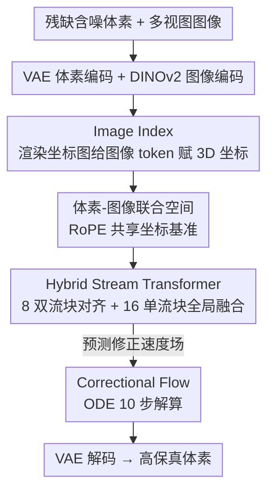

# VIAFormer: Voxel-Image Alignment Transformer for High-Fidelity Voxel Refinement

**会议**: CVPR 2026  
**论文**: [CVF Open Access](https://openaccess.thecvf.com/content/CVPR2026/html/Fang_VIAFormer_Voxel-Image_Alignment_Transformer_for_High-Fidelity_Voxel_Refinement_CVPR_2026_paper.html)  
**关键词**: 体素优化, 多视图引导, Flow Matching, 跨模态对齐, 3D 生成

## 一句话总结
VIAFormer 把"修补残缺含噪体素"定义成一个**多视图图像引导的体素修正（Conditioned Voxel Refinement）**任务，用 Image Index 给 2D 图像 token 显式赋予 3D 坐标、用 Correctional Flow 直接学"从脏体素到干净体素"的修正轨迹、用 Hybrid Stream Transformer 做双向跨模态融合，在 VFM 输出和合成噪声两类退化上都刷到 SOTA（合成噪声 IoU 提升达 39.1%）。

## 研究背景与动机

**领域现状**：体素网格是 3D 生成/重建管线里最基础的表示之一。一边是 Vision Foundation Models（VFM，如 Pi3、VGGT）和 3D 扫描能很快产出**粗糙体素**；另一边是高保真生成模型（如 Trellis 的"where→what"两阶段范式）需要**干净完整的体素**作为输入。这两端之间存在明显的质量鸿沟，需要一道"体素优化（Voxel Refinement）"工序来填补。

**现有痛点**：传统体素补全方法（DiffComplete、PatchComplete、WSSC）有两个硬伤。其一，它们**只吃几何**，完全不用多视图图像这种宝贵的多模态监督；其二，它们多用显式 3D 空间上的卷积网络，分辨率从 $32^3$ 升到 $64^3$ 内存就爆炸，可扩展性差，而且往往依赖小规模、按类别、带标签的数据集，泛化到大规模无标签数据时力不从心。

**核心矛盾**：即便强行给现有方法加上图像条件（如标准 cross-attention），效果也几乎为零。作者诊断发现根因是**注意力坍缩（Attention Collapse）**——标准 cross-attention 里 3D 体素 token 和 2D 图像 token 没有共享的空间基准，任一图像 token 的影响几乎均匀地摊到所有体素 token 上，模型干脆把图像当成一个全局特征忽略了位置信息。

**本文目标**：(1) 把任务重新形式化为大规模（$64^3$）、跨类别、多模态的 Conditioned Voxel Refinement；(2) 设计一个能真正用上图像引导、又能扩展到 $64^3$ 的架构。

**切入角度**：既然有了 VFM 给的"虽脏但富含结构信息"的初始体素，就不该从纯噪声生成，而应学一条从脏到净的**直接修正路径**；同时必须给图像 token 一个显式的 3D 落点，才能打破注意力坍缩。

**核心 idea**：用"显式 3D 坐标对齐（Image Index）+ 修正流（Correctional Flow）+ 混合流 Transformer"三件套，把多视图图像稳稳地嫁接到体素修正上。

## 方法详解

### 整体框架

VIAFormer 解决的是：给定一个残缺含噪体素 $\tilde{v}$ 和 $S$ 张标定好的多视图图像 $\{I_i\}_{i=1}^S$，输出修正后的高保真体素 $\hat{v}$，即 $\hat{v} = F_\theta(\tilde{v}, \{I_i\}, c)$，其中条件 $c$ 包含估计的相机位姿 $\{\tilde{T}_i\}$。

整条管线是：脏体素经预训练稀疏结构 VAE 编码器 $\mathcal{E}_V$（来自 Trellis）压成几何 latent $z_V$，多视图图像经 DINOv2 编码器 $\mathcal{E}_I$ 抽成 patch token $\{z_{I,i}\}$；**Image Index** 把每个图像 token 标注上 3D 坐标，与体素 token 一起进入"体素-图像联合空间（Union-Space）"；**Hybrid Stream Transformer**（8 个双流块 + 16 个单流块）在这个联合空间里做跨模态融合，并在 **Correctional Flow** 目标下预测一条把 $z_V$ 拉回干净 latent $z_{gt}$ 的速度场；最后 ODE 解算器走 10 步得到干净 latent，再由 VAE 解码器还原成 $\hat{v}$。

### 关键设计

**1. Correctional Flow：不从噪声生成，而学一条从脏体素到干净体素的直达修正轨迹**

传统扩散/Flow Matching 把简单高斯分布映射到目标分布，相当于"从零生成"。但这里手上已经有一个虽脏却富含目标几何结构的 $\tilde{v}$，从纯噪声重新生成既浪费又容易丢掉已有结构。作者因此定义一条**两端 latent 之间的线性路径** $z_t = (1-t)z_V + t\cdot z_{gt}$，其中 $z_V = \mathcal{E}_V(\tilde{v})$ 是脏体素 latent、$z_{gt} = \mathcal{E}_V(v_{gt})$ 是干净体素 latent，网络只需预测这条路径上的恒定速度场，即"修正向量" $(z_{gt} - z_V)$：

$$\mathcal{L}_{\text{FM}} = \mathbb{E}_{t, \tilde{v}, v_{gt}, c}\left[\left\| f_\theta(z_t, t, c) - (z_{gt} - z_V) \right\|_2^2\right].$$

这样学习目标从"凭空生成"收紧成"几何修正"这一更受约束的问题。消融里把它换成从纯噪声起步训练（w/o Correctional Flow），IoU 从 0.446 暴跌到 0.310——证明充分利用 VFM 初始先验是性能的命脉。

**2. Image Index 与 Voxel-Image Union-Space：给 2D 图像 token 显式赋 3D 坐标，破解注意力坍缩**

标准 cross-attention 之所以失效，是因为体素 token 和图像 token 没有共享的空间坐标系，注意力图呈"均匀条纹"——这就是注意力坍缩。作者的解法是给**每个图像 token 也算出一个 3D 坐标**，让它和天然带 3D 坐标的体素 token 站到同一个坐标系里。具体做法（Image Index）是一个高效的渲染过程：先把 $\tilde{v}$ 简单三角化成网格、把每个源体素的 3D 整数坐标编码进面片颜色，再从各相机位姿 $\{\tilde{T}_i\}$ 渲染出 2D 索引图（背景像素置空），最后按 DINOv2 的 patch 大小切块、对每个 patch 内非空像素坐标做平均池化，得到该图像 token 的一个浮点 3D 坐标。

拿到坐标后，2D 和 3D token 的坐标都转成正弦嵌入并通过 RoPE 注入各自 token，于是物理上越接近的 token 在嵌入空间越相似，注意力分数自然偏向空间邻近的 token，注意力坍缩被打破，跨模态信息得以双向流动。值得注意的是，Image Index 来自含噪的 $\tilde{v}$ 和估计位姿，本身只是一个**粗对齐先验**，但作者论证"哪怕粗对齐也远胜于无"——它提供了引导注意力机制启动所需的"空间握手"。消融里把 Image Index 换成普通 ViT 式位置编码（w/o Image Index），IoU 从 0.446 掉到 0.418，验证了显式空间锚定才是有意义多模态融合的关键。

**3. Hybrid Stream Transformer：先双流对齐、后单流全局融合的 24 层架构**

联合空间的概念由一个仿照 OmniControl 设计的 24 层 Transformer 落地，分两阶段。**前 8 层是双流块**：体素 latent $z_V$ 和多视图 latent $\{z_{I,i}\}$ 各用不共享权重的 MLP 投影出 $Q/K/V$ 以保留各自特征，再把两路的 key/value 拼成统一的键值空间 $K_{\text{union}} = \text{Concat}(K_V, K_{I,1}, \cdots)$、$V_{\text{union}} = \text{Concat}(V_V, V_{I,1}, \cdots)$，让两路都来查询这个共享空间，实现真正的双向注意力共同演化：$z_V \mathrel{+}= \text{Attention}(Q_V, K_{\text{union}}, V_{\text{union}})$，图像流同理更新。**后 16 层是单流块**：此时两路已有共享几何锚定，被拼成单一序列 $z_{\text{unified}} = \text{Concat}(z_V, z_{I,1}, \cdots)$ 做标准自注意力，进行全局特征融合、把场景当成整体来推理。这种"先对齐后融合"的设计也让模型能灵活吃可变数量的视图。

### 损失函数 / 训练策略

训练目标即上面的 Correctional Flow 速度场回归损失 $\mathcal{L}_{\text{FM}}$。数据合成采取**双源 1:1 混合**：一路是把多视图图像经 Pi3 重建点云再体素化（贴近真实 VFM 退化），另一路是程序化噪声管线（表面噪声、体积漂浮物/团块、粗粒度块状遮挡，外加更激进的半空间删除制造严重结构缺失）。1:1 混合是为了防止模型从 VFM 数据里学到"在本该底部开口的物体上幻觉出一个幽灵底座"这类由俯视主导数据集带来的伪相关，逼模型形成更鲁棒可泛化的几何理解。模型 0.61B 参数，AdamW（lr $=3\times10^{-4}$），16 张 H20 训练 7 天；推理用 10 步 ODE，单张 V100 上每样本约 14.5 秒。

## 实验关键数据

### 主实验

训练数据约 478k 个 3D 资产（ObjaverseXL / ABO / 3D-FUTURE / HSSD），在留出的 Toys4k 与 Dora 上评测，指标为体积准确率 IoU 与表面保真度 Chamfer Distance（CD）。所有 baseline 都被统一适配到同一 VAE 的 $64^3$ latent 空间并重训为修正流目标，以隔离架构差异。

| 数据集 | 指标 | VIAFormer | 最强 baseline | 提升 |
|--------|------|-----------|---------------|------|
| Toys4k（VFM 退化） | IoU ↑ | 0.4460 | 0.4255（24L Cross-Attn） | +5.0% |
| Toys4k（VFM 退化） | CD ↓ | 0.0163 | 0.0175 | 更低 |
| Dora（VFM 退化） | IoU ↑ | 0.4585 | 0.4356（24L Cross-Attn） | +3.4% |
| Toys4k（合成噪声） | IoU ↑ | 0.8580 | 0.2776（24L Self-Attn） | +39.1% |
| Toys4k（合成噪声） | CD ↓ | 0.0027 | 0.0766 | 大幅更低 |

在 VFM 输出修正上 IoU 提升约 3.4%~5.0%；而在合成噪声上提升尤为惊人，IoU 高达 0.858，把第二名（自注意力 0.278）远远甩开，说明在受控退化下多视图引导威力极大。

### 消融实验

| 配置 | Toys4k IoU ↑ | 说明 |
|------|-------------|------|
| VIAFormer (Full) | 0.4460 | 完整模型 |
| w/o Image Index | 0.4176 | 换成 ViT 式位置编码，掉 0.028 |
| w/o Correctional Flow | 0.3102 | 改从纯噪声生成，暴跌 0.136 |
| 24-Layer Cross-Attn | 0.4255 | 标准跨注意力，几乎不如纯几何 |
| 24-Layer Self-Attn（纯几何） | 0.4111 | 无图像引导基线 |
| Cross-Attn + VGGT 条件 + 3MLP | 0.4055 | 加强条件信号仍无效 |
| Cross-Attn + VGGT 条件 + 8 Self-Attn | 0.4076 | 加强适配器仍无效 |

### 关键发现
- **Correctional Flow 贡献最大**：去掉它（从噪声生成）IoU 从 0.446 跌到 0.310，证明"利用 VFM 脏先验做修正"远胜"从零生成"。
- **注意力坍缩是真问题，不是条件弱**：把图像条件换成更强的 VGGT 特征、再加 3-layer MLP 或 8-layer 自注意力适配器，IoU 仍停在 0.405~0.408，几乎不超纯几何的 0.411——证明问题是结构性的（缺共享空间基准），不是信号或适配器复杂度不够。
- **视图数非单调**：性能从 $S=0$ 显著上升，在 3~4 视图达峰，再增多反而略降——作者推测过多视图带来收益递减，且不完美预测累积的噪声会稀释注意力，反而更难蒸馏出一致形状。

## 亮点与洞察
- **"渲染坐标当索引"很巧**：把体素 3D 坐标编码成网格面片颜色再渲染，就能给每个图像 patch 反查出 3D 落点——用一个轻量渲染步骤换来跨模态的显式空间对齐，绕开了需要可微对应学习的复杂方案。
- **把"修复"和"生成"解耦的视角值得迁移**：当你手里已有一个有结构但带噪的初值（不止体素，也可以是深度图、点云、mesh），与其从噪声生成，不如学 $(z_{gt}-z_V)$ 这条修正向量，问题更受约束、更稳。
- **注意力坍缩的诊断方法可复用**：用注意力图是否呈"均匀条纹"来判断跨模态条件是否真被用上，这个排查手段对任何"加了条件但没涨点"的多模态融合都适用。

## 局限与展望
- **依赖估计相机位姿与初始体素质量**：Image Index 继承了 $\tilde{v}$ 和 $\{\tilde{T}_i\}$ 的几何误差，只是粗先验；位姿严重不准或初值极差时，"空间握手"可能失灵。
- **推理偏慢**：单 V100 每样本 14.5 秒、需 10 步 ODE，处理 9572 个 token，离实时还有距离，难直接用于交互式创作。
- **分辨率仍止于 $64^3$**：虽比传统方法的 $32^3$ 高，但对极精细几何（薄壁、细丝结构）可能仍受限。
- **视图数收益递减未根治**：超过 4 视图反而掉点，说明对多视图噪声的鲁棒聚合还有改进空间（如按可靠度加权融合）。

## 相关工作与启发
- **vs DiffComplete / PatchComplete / WSSC**: 它们纯靠几何、在显式 $32^3$ 空间卷积、依赖按类别小数据；本文引入多视图图像条件、在 $64^3$ latent 空间用 Transformer、跨类别大数据训练。即便把它们适配到同一修正流设置，IoU 仍明显落后。
- **vs 标准 Cross-Attention / ControlNet 式注入（如 Trellis cross-attn 变体、LAS-Diffusion）**: 它们没显式学 3D-2D token 对应，导致注意力坍缩；本文用 Image Index + RoPE 共享坐标建立 Union-Space，让空间邻近 token 注意力天然更高。
- **vs 2D-lift-to-3D 路线**: 那类方法能借 2D 先验但 3D 质量普遍不高；本文走 3D-native 修正路线，把体素优化当作"where→what"两阶段范式里稳定低成本的"where"环节，给下游高保真生成喂干净几何。

## 评分
- 新颖性: ⭐⭐⭐⭐⭐ Image Index 把图像 token 显式 3D 锚定、Correctional Flow 把生成改成修正，两点都切中跨模态体素优化的真痛点。
- 实验充分度: ⭐⭐⭐⭐ 双数据集 + VFM/合成两类退化 + 大量适配过的强 baseline + 关键消融齐全；略缺真实扫描数据与更高分辨率验证。
- 写作质量: ⭐⭐⭐⭐⭐ 任务形式化清晰，注意力坍缩诊断有图有据，方法与动机环环相扣。
- 价值: ⭐⭐⭐⭐ 作为 3D 创作管线里 VFM 输出与高保真生成之间的"桥梁"很实用，但推理速度与分辨率限制了即时落地。

<!-- RELATED:START -->

## 相关论文

- [\[CVPR 2026\] Easy3E: Feed-Forward 3D Asset Editing via Rectified Voxel Flow](easy3e_feed-forward_3d_asset_editing_via_rectified_voxel_flow.md)
- [\[CVPR 2026\] DynamicTree: Interactive Real Tree Animation via Sparse Voxel Spectrum](dynamictree_interactive_real_tree_animation_via_sparse_voxel_spectrum.md)
- [\[CVPR 2026\] MeshWeaver: Sparse-Voxel-Guided Surface Weaving for Autoregressive Mesh Generation](meshweaver_sparse-voxel-guided_surface_weaving_for_autoregressive_mesh_generatio.md)
- [\[CVPR 2026\] PatchScene: Patch-based Voxel Diffusion Model for Large-Scale Scene Completion](patchscene_patch-based_voxel_diffusion_model_for_large-scale_scene_completion.md)
- [\[CVPR 2026\] CrowdGaussian: Reconstructing High-Fidelity 3D Gaussians for Human Crowd from a Single Image](crowdgaussian_reconstructing_high-fidelity_3d_gaussians_for_human_crowd_from_a_s.md)

<!-- RELATED:END -->
