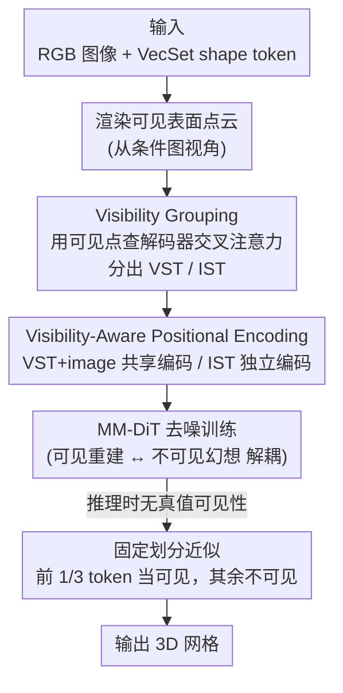

# ViLearn: Accelerating Training Convergence of Image-to-3D Generation via Visibility Learning

**会议**: CVPR 2026  
**论文**: [CVF Open Access](https://openaccess.thecvf.com/content/CVPR2026/html/Chen_ViLearn_Accelerating_Training_Convergence_of_Image-to-3D_Generation_via_Visibility_Learning_CVPR_2026_paper.html)  
**关键词**: 单图到3D生成、VecSet潜在扩散、可见性学习、收敛加速、位置编码

## 一句话总结
ViLearn 把"单图到 3D"中**可见区域重建**和**不可见区域幻想**两个本质不同的子任务在训练阶段显式拆开：先用预训练 VecSet 解码器的交叉注意力把无序 shape token 分成可见 / 不可见两组（VG），再用可见性感知的位置编码（VAPE）强化"图像 token ↔ 可见 token"的对应、弱化与不可见 token 的纠缠，从而在不改主干、不加推理开销的情况下把 VecSet 扩散模型的训练收敛速度提升最多 4.4 倍，且最终质量超过 vanilla 基线。

## 研究背景与动机

**领域现状**：当前主流的单图到 3D 形状生成走的是 VAE–LDM 路线——先用 3D VAE 把网格压成紧凑的潜在 token，再训一个条件扩散模型在这个潜空间里根据输入图像预测 token。其中 VecSet 表示（把形状压成几千个无序 1D token）因为 token 少、能端到端训练而成为效率与质量兼顾的主力，TripoSG、Hunyuan3D 2.0、Step1X-3D 等 SOTA 都属于这一派。

**现有痛点**：单图到 3D 本质是**病态（ill-posed）**问题——一张图根本无法唯一确定被遮挡的几何。这造成一个**非均匀的学习问题**：可见区域被输入图像强约束，而不可见区域只能靠先验"幻想"出来。VecSet 方法为了保持集合的置换不变性，刻意**不加位置编码**，把 shape token 当成完全无序的集合。结果就是扩散模型必须在一个巨大的、置换不变的 token 空间里**同时**学两件性质完全不同的事：从图像里找可见对应、从先验里编造不可见几何。

**核心矛盾**：可见重建和不可见幻想被塞进了同一个无差别 token 空间里联合优化，模型没有任何线索区分"哪些 token 该听图像的、哪些 token 该听先验的"。这种纠缠让有效的 2D→3D 映射空间被无谓地放大，严重拖慢收敛、破坏训练稳定性。值得注意的是，已有的"3D 加速"工作（如 FlashVDM 加速推理、Direct3D-S2 / ULTRA3D 用稀疏注意力降低单步训练成本）都在降低**每一步**的代价，而没人去解决**收敛效率**——让固定步数内学到更多。

**核心 idea**：与其降低每一步的成本，不如**显式告诉扩散模型哪些 shape token 对应可见几何、哪些对应被遮挡区域**，把两个子任务在结构上解耦，从而缩小假设空间、给优化提供清晰的结构指引。这就是 ViLearn = Visibility Grouping（VG，划分 token）+ Visibility-Aware Positional Encoding（VAPE，把可见性注入注意力）。

## 方法详解

### 整体框架

ViLearn 是一套**训练范式**，不改 MM-DiT 主干、不引入额外推理估计开销，只在两处动手：数据准备阶段把 shape token 按可见性分组，训练阶段把分组信息通过位置编码注入注意力。

输入是一张 RGB 图像（经 DINOv2 编成 image token）、对应形状的 VecSet shape token（来自预训练 VecSet VAE），以及从条件图像视角渲染出的可见表面点云。处理分两步：(1) **VG** 用可见点作为查询、在预训练 VecSet 解码器的交叉注意力里找到每个可见点最对应的 token，去重后得到"可见 token 集 VST"，其余为"不可见 token 集 IST"——这一步只在数据准备时做一次，几乎零训练开销；(2) **VAPE** 在 MM-DiT 的双流注意力块里，给 image token 和 VST 赋予**共享**的位置编码以放大它们的跨模态对应，给 IST 赋予**不同**的编码以标记"这部分要靠先验幻想"。两者协同，把"可见重建"和"不可见幻想"在注意力图上自然分离开。推理时没有真值可见性，于是用一个固定划分近似（见下文）。

### 关键设计

**1. Visibility Grouping：用预训练解码器的"空间局部性"白嫖一张可见性划分**

痛点是 VecSet token 名义上无序，看不出哪个对应可见面。作者抓住一个已被前人验证的事实：**VecSet token 虽形式上无序，实践中却有很强的空间局部性**——每个 token 编码一块紧凑的局部 3D 区域，且 VecSet VAE 解码器的交叉注意力高度局部化（表面点查询会强烈关注它在空间上对应的 token）。于是 VG 复用预训练解码器的交叉注意力来做划分：对条件图视角渲染出的可见点云 $P_{visible}\in\mathbb{R}^{M\times3}$ 作为查询、shape token 集 $S$ 作为键，算交叉注意力分数

$$A = (W_q P_{visible})(W_k S)^T,$$

其中 $W_q, W_k$ 直接借用解码器里预训练好的投影层。每个可见点取分数最高的 token 作为其对应：$a_i = \arg\max_{j\in\{1,\dots,N\}} A_{i,j}$，去重后得到可见 token 索引集 $I_{visible}$，落在里面的是 VST、其余是 IST。作者把两组分别送回解码器渲染几何法线验证（论文 Fig. 2）：VST 重建出可见表面、IST 编码被遮挡区域，证明这个划分确实把互补的几何信息干净地分开了。妙处在于整个划分**不训练、不加网络**，纯靠现成解码器的注意力，且只在数据准备时跑一遍。

**2. VAPE：把"谁对齐图像、谁靠先验"写进注意力的位置编码**

光分好组还不够，得让扩散模型在注意力里**用上**这个信息。VAPE 的出发点是一个信息对齐上的非对称性：可见 shape token 和 image token 都来自同一视角、捕捉同一份几何信息，而不可见 shape token 表示被遮挡几何、与图像没有直接视觉对应。所以应该**加强** image↔VST 的跨模态交互、**标记** IST 需要从先验幻想。VAPE 只改 MM-DiT 双流块里的 query / key 矩阵（value 不变），把 shape query/key 按可见性拆成 $Q_{shape}=\text{Concat}[Q_{VST},Q_{IST}]$、$K_{shape}=\text{Concat}[K_{VST},K_{IST}]$ 后分别编码，得到 $\hat Q,\hat K$ 替换原始 $Q,K$。它的两种具体实现见下面两个设计点。

**3. VA-RoPE：把可见性当"两个固定相对位置"塞进旋转编码**

这是 VAPE 的主推实现。标准 RoPE 通过旋转 query/key 向量来编码相对位置，注意力分数依赖于两 token 的相对距离。VA-RoPE 把这个机制**挪用**来编码"可见 / 不可见"两个离散类别：定义两个旋转矩阵 $R_m$（给可见 token，即 image token 和 VST）、$R_n$（给不可见 token IST），$m,n$ 是固定的类别索引：

$$\hat Q_{IT}=Q_{IT}R_m,\ \hat K_{IT}=K_{IT}R_m,\quad \hat Q_{shape}=\text{Concat}[Q_{VST}R_m,\ Q_{IST}R_n],\ \hat K_{shape}=\text{Concat}[K_{VST}R_m,\ K_{IST}R_n].$$

这样产生一个**类内保持效应**：同类别 token（旋转一致）点积不变、维持强注意力；跨类别 token 因旋转不匹配而注意力分数被压低。作者实测设 $m=0,n=50$ 时跨类别注意力大约减半，从而把模型偏置向"优先做组内交互"。它的好处是从训练第一步起就天然增强可见对应、不需要学习预热，因此早期收敛最快。

**4. VA-LPE：用两个可学习加性嵌入做更简单的替代**

作为更轻量的备选，VA-LPE 不用旋转、而是初始化两个可学习嵌入 $e_v, e_i\in\mathbb{R}^{d_k}$ 分别表示可见 / 不可见状态，直接加到对应 token 上：image token 和 VST 加 $e_v$、IST 加 $e_i$（query/key 都加），$e_v,e_i$ 在各自类别内共享并随网络端到端优化。它编码的是同样的可见性信息，写法更直白。代价是早期收敛比 VA-RoPE 慢——因为它需要时间去**学**出合适的注意力权重分配，而 VA-RoPE 的强对应是先验内置的；不过 25K 步之后 VA-LPE 开始加速，最终质量与 VA-RoPE 相当甚至略好。

### 推理策略

推理时从随机噪声生成，没有真值可见性。理论上可以对中间去噪结果做 VG，但作者用了更省的近似：**固定划分**。他们统计训练数据发现，跨不同形状和视角，可见 token 大约稳定占总序列的 **1/3**。于是推理时直接把 shape token 序列的**前 1/3 当作可见**（给 $R_m$ 或 $e_v$）、后 2/3 当作不可见（给 $R_n$ 或 $e_i$）。例如 2048 token 的序列，token 1–683 用可见编码、684–2048 用不可见编码。这样推理时的可见性比例与训练分布一致，既稳定又免去显式可见性估计的开销，实测足够好用。

## 实验关键数据

实现细节：AdamW、学习率 0.0001、32 张 A800、BF16 混合精度。消融用 0.39B 小模型 + 270K 样本、统一训约 8 天；缩放实验用 1.1B 模型 + 1.1M 样本、约训 17 天。都采用 CLAY 式渐进训练（256→1024→2048 token，缩放时再到 4096）。评测集为 1100 张图（510 张 Hi3DEval 多物体 + 590 张 AIGC 角色/动物）。指标四项：Floater（断连组件数，越少越好）、IS-AS（图像-形状对齐分，越高越好）、GP（几何合理性）、GD（几何细节）。

### 主实验（缩放到 1.1B，110K 步终值）

| 方法 | IS-AS↑ | Floater↓ | GP↑ | GD↑ |
|------|--------|----------|-----|-----|
| TripoSG (1.3B) | 0.669 | 69.9 | 5.904 | 2.635 |
| Step1X-3D (1.3B) | 0.646 | 74.5 | 5.828 | 2.608 |
| Hunyuan3D 2.0 (1.1B) | 0.699 | 32.7 | 5.949 | 2.668 |
| Baseline (1.1B, 无位置编码) | 0.656 | 74.8 | 5.826 | 2.623 |
| **ViLearn (1.1B, VA-RoPE)** | **0.702** | **31.5** | **5.988** | **2.688** |

ViLearn 在四项指标上全面领先。相对 vanilla 基线，Floater 上 4.4× 加速 + 57.8% 提升、IS-AS 上 2.4× 加速 + 7% 提升。注意几个 SOTA（TripoSG/Step1X-3D/Hunyuan3D）通常用**几百张 GPU 训数周**，而 ViLearn 在同样 32 GPU 条件下、靠加速收敛就拿到了最佳对齐。

### 消融实验（0.39B，110K 步终值）

| 配置 | IS-AS↑ | Floater↓ | GP↑ | GD↑ | 说明 |
|------|--------|----------|-----|-----|------|
| Baseline（w/o VG & VAPE） | 0.6248 | 165.1 | 5.664 | 2.509 | 等价当前 SOTA 训练范式 |
| Ours w/ Vanilla RoPE | 0.6063 | 114.1 | — | — | 有 VG 但用普通 RoPE，反而最差 |
| Ours w/ VA-LPE | 0.6562 | 60.4 | 5.760 | 2.532 | 早期慢、后期追平 |
| **Ours w/ VA-RoPE** | **0.6593** | **55.7** | 5.902 | 2.583 | 收敛最快、早期最好 |

（VA-RoPE 在 25K 步就达到基线 110K 步的水平，约 4.4× 加速。）

### 关键发现
- **VA-RoPE 早期最强、VA-LPE 后程追上**：VA-RoPE 的"强可见对应"是旋转编码先验内置的，从第一步就生效，所以早期收敛最快、25K 步即达基线 110K 步水平；VA-LPE 要先学出注意力分配，前期慢但 25K 后加速，终值与 VA-RoPE 相当。
- **可见性先验是关键，光加位置编码会帮倒忙**："Ours w/ Vanilla RoPE"（有 VG 分组但用普通 RoPE，不含可见性偏置）全程比基线还差——说明朴素位置编码建立不了有意义的信息连接，真正起效的是 VA-RoPE 里"按可见性分类"的结构先验，而非位置编码本身。
- **加速来自缩小假设空间**：把可见重建与不可见幻想解耦后，Floater 指标改善最显著（基线 165→55.7），说明结构指引主要修复了"几何完整性 / 漂浮碎块"这类病态问题导致的失败模式。

## 亮点与洞察
- **"无序"其实"有序"，并被反向利用**：论文最巧的一点是认清 VecSet token 形式无序但实践有强空间局部性，进而直接**白嫖预训练解码器的交叉注意力**来做可见性划分——不训练、不加网络、只在数据准备跑一次，几乎零成本拿到一张高质量监督信号。
- **把"加速"重新定义为收敛效率而非单步成本**：在一众"加速推理 / 稀疏注意力降单步成本"的工作中，ViLearn 指出真正该攻的是收敛效率（固定步数学到更多），这个问题定位本身就很有价值。
- **可迁移的范式**："把一个病态联合任务按监督强弱拆成两组 token、用位置编码注入分组先验"这套思路，可迁移到任何"部分被强条件约束、部分需先验补全"的生成任务（如图像 inpainting 的已知/未知区、单视角补全等）。
- **几乎零侵入**：只改双流块的 Q/K、value 不变、主干不动、推理用 1/3 固定划分近似，落地成本极低，对已有 VecSet pipeline 友好。

## 局限与展望
- **推理用固定 1/3 划分是粗近似**：假设可见 token 恒占 1/3，但极端视角 / 高度自遮挡的形状未必符合，作者也承认这是经验近似；对可见比例偏离均值很多的样本可能次优。
- **依赖预训练解码器的局部性质量**：VG 完全建立在"解码器交叉注意力高度局部化"上，若换用局部性较弱的 VAE，划分质量会下降，方法的可移植性受底层 VAE 影响。
- **只在 VecSet 体系验证**：方法针对 VecSet 的无序 + 无位置编码特性而设计，对稀疏体素（SLAT）类表示是否适用、收益多大未做实验。
- **可见性是二值离散**：当前只分"可见 / 不可见"两类，未考虑半遮挡 / 边界 / 视角依赖的连续可见度，更细粒度的可见性建模可能进一步提升。

## 相关工作与启发
- **vs vanilla VecSet 训练（TripoSG / Hunyuan3D 2.0 / Step1X-3D）**：它们为保持置换不变性刻意不加位置编码，把可见重建与不可见幻想混在无差别 token 空间里联合学，收敛慢；ViLearn 显式分组 + 可见性位置编码解耦两个子任务，同等算力下收敛更快、质量更好。
- **vs FlashVDM（推理加速）**：FlashVDM 通过蒸馏 + 轻量解码器缩短推理时间，但以轻微质量下降为代价，且推理只占总成本一小部分；ViLearn 攻的是训练收敛效率，方向正交且更触及成本大头。
- **vs Direct3D-S2 / ULTRA3D（训练加速）**：它们用稀疏注意力降低稀疏体素扩散的**每步**计算量；ViLearn 不降单步成本，而是提升每步的**有效性**（固定步数学到更多），是更本质的加速路径。
- **启发**：把"病态生成任务里监督信号强弱不均"显式编码进注意力结构，是缓解收敛慢/不稳的通用手段；其"复用现成模块的注意力当免费监督"也是值得借鉴的省成本技巧。

## 评分
- 新颖性: ⭐⭐⭐⭐ 问题定位（收敛效率 vs 单步成本）和"复用解码器注意力做可见性划分"都很有洞见，方法本身组合现有组件但角度新。
- 实验充分度: ⭐⭐⭐⭐ 有消融 + 缩放 + 与 SOTA 对比、四项指标、两种 VAPE 实现对照，较扎实；但仅 VecSet 体系、固定划分的鲁棒性分析略少。
- 写作质量: ⭐⭐⭐⭐ 动机链条清晰、图示充分、方法叙述完整，公式与设计动机对得上。
- 价值: ⭐⭐⭐⭐ 近乎零侵入即可换来最多 4.4× 收敛加速 + 质量提升，对 3D 生成训练成本敏感的场景实用性强。

<!-- RELATED:START -->

## 相关论文

- [\[CVPR 2026\] Text–Image Conditioned 3D Generation](text-image_conditioned_3d_generation.md)
- [\[CVPR 2026\] C-GenReg: Training-Free 3D Point Cloud Registration by Multi-View-Consistent Geometry-to-Image Generation with Probabilistic Modalities Fusion](c-genreg_training-free_3d_point_cloud_registration_by_multi-view-consistent_geom.md)
- [\[CVPR 2026\] Image-to-Point Cloud Feature Back-Projection for Multimodal Training of 3D Semantic Segmentation](image-to-point_cloud_feature_back-projection_for_multimodal_training_of_3d_seman.md)
- [\[CVPR 2026\] NVGS: Neural Visibility for Occlusion Culling in 3D Gaussian Splatting](nvgs_neural_visibility_for_occlusion_culling_in_3d_gaussian_splatting.md)
- [\[CVPR 2026\] Uncertainty-driven 3D Gaussian Splatting Active Mapping via Anisotropic Visibility Field](uncertainty-driven_3d_gaussian_splatting_active_mapping_via_anisotropic_visibili.md)

<!-- RELATED:END -->
