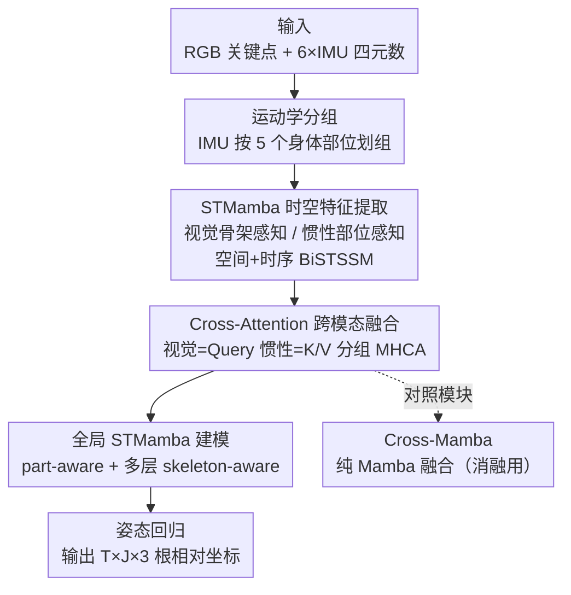

# VIMCAN: Visual-Inertial 3D Human Pose Estimation with Hybrid Mamba-Cross-Attention Network

**会议**: CVPR 2026  
**arXiv**: [2605.07552](https://arxiv.org/abs/2605.07552)  
**代码**: https://github.com/Eddieyzp/VIMCAN (有)  
**领域**: 3D视觉 / 人体姿态估计 / 多模态融合  
**关键词**: 视觉-惯性融合、3D人体姿态、Mamba、Cross-Attention、实时推理

## 一句话总结
VIMCAN 把 Mamba 的线性复杂度时序建模和 Cross-Attention 的跨模态空间推理拼成一个混合架构，用 RGB 关键点 + 可穿戴 IMU 融合估计 3D 人体姿态，在 TotalCapture 上做到 17.2 mm MPJPE 的同时支持消费级硬件 60+ FPS 实时推理。

## 研究背景与动机

**领域现状**：3D 人体姿态估计（HPE）目前最强的多模态流水线几乎都建立在 Transformer 上，靠 Cross-Attention 把视觉特征和 IMU 等异构模态融合起来。单目视觉方案受困于「2D→3D 抬升的深度歧义」，所以业界普遍引入 IMU 这类高频、低延迟、抗遮挡的传感器作为互补信号。

**现有痛点**：Attention 对序列长度 $L$ 是二次复杂度 $\mathcal{O}(L^2)$，长序列推理时显存和算力开销爆炸。论文的对比图（Fig.1）显示，GCN-Transformer 模型的峰值显存随序列长度迅速攀升，在资源受限设备上无法实时跑长序列——已有工作（如 Wang's GCN-Transformer、Liu's CNN-Transformer）为了实时只能强行缩小时间窗口，牺牲了时序上下文。

**核心矛盾**：要么用 Attention 拿到精确的跨模态空间建模但付出 $\mathcal{O}(L^2)$ 的代价，要么换成线性复杂度 $\mathcal{O}(L)$ 的 Mamba 省算力——但纯 Mamba 的选择性状态空间机制为了效率压缩了表达力，空间推理能力明显弱于卷积/注意力，在需要精细空间对齐的多模态融合里会丢信息。精度、鲁棒性和效率之间存在三难。

**本文目标**：在不牺牲精度的前提下把多模态 3D HPE 做到线性复杂度、变长序列、消费级硬件实时。

**切入角度**：作者的观察是——时序建模和空间/跨模态建模其实可以拆开用不同工具。Mamba 擅长沿时间轴高效压缩历史，但不擅长空间；Cross-Attention 擅长建模异构 token 间的复杂关系，但二次复杂度只在「融合」这一窄环节才不可避免。那就让 Mamba 包办大头的时空特征提取与全局建模，只在视觉↔惯性融合的关键节点上局部用一次 Cross-Attention。

**核心 idea**：用 Mamba 做高效时序骨架、Cross-Attention 做跨模态空间融合的「混合」架构，把二次复杂度限制在最小的融合环节，从而兼顾精度与实时性——这是首个把 Mamba 用到视觉-惯性多模态 3D HPE 的工作。

## 方法详解

### 整体框架
VIMCAN 输入是单目图像抽出的 $J{=}17$ 个关键点坐标，加上 $I{=}6$ 个可穿戴 IMU 的单位四元数；输出是整段序列的根相对 3D 姿态 $P\in\mathbb{R}^{T\times J\times 3}$。整条流水线分三段：**先各自抽时空特征（STMamba）→ 再跨模态融合（Cross-Attention 为主干）→ 最后回归 3D 坐标**。

具体地，两个模态先经线性层升到公共维度 $D_e$，得到视觉特征 $F^V$ 和按身体部位分组的惯性特征 $F_g^I$。借助运动学先验，6 个 IMU 被划成 $G{=}5$ 组（躯干、左右臂、左右腿）。每个模态独立送进 STMamba（Spatio-Temporal Mamba）：视觉走「骨架感知」STMamba，惯性走「部位感知」STMamba，两者都由空间 + 时序两个 BiSTSSM 块串成。抽完特征后，视觉特征当 Query、惯性特征当 Key/Value 做 Multi-Head Cross-Attention 完成融合；融合结果再过 part-aware STMamba + 一摞 skeleton-aware STMamba 做全局时空建模，最后一个线性层回归出 3D 姿态。论文还额外提出一个纯 Mamba 的 Cross-Mamba 融合模块作为对照（证明融合环节确实需要 Attention）。

### 关键设计

**1. 按身体部位分组 + 骨架感知扫描：把运动学先验喂进 Mamba**

纯 Mamba 的扫描是「拉平成序列逐个扫」，对人体这种有强拓扑结构的对象会丢掉关节间的解剖关系。VIMCAN 在两个地方注入运动学先验：其一，把 6 个 IMU 按 $G{=}5$ 个身体部位（躯干/左臂/右臂/左腿/右腿）分组，每组用专属的 part-aware STMamba，让同一肢体的传感器信息先在局部对齐；其二，视觉分支做空间前向扫描时，按父子关节关系（骨架拓扑）重排关键点顺序，使 Mamba 的递归更新顺着骨架链条走，而不是任意像素顺序。消融显示分组从 0→3→5 组时 MPJPE 从 25.6→20.5→17.2 mm 单调下降，去掉骨架感知扫描则直接劣化到 25.7 mm——说明这两个先验是精度的主要来源。

**2. BiSTSSM：双向时空选择性状态空间块**

STMamba 的最小单元是 BiSTSSM，它先做空间 BiSTSSM 编码帧内拓扑关系，再做时序 BiSTSSM 建模帧间动态。块内先把输入特征 $F$（$F^V$ 或 $F_g^I$）线性投影并切成两半 $F_x,F_z = \text{Chunk}(\text{FC}(F))$。$F_x$ 路经深度卷积 + SiLU 抓局部模式后送进选择性扫描：

$$F_x^{ssm} = \text{LN}(\text{SS2D}(\sigma(\text{DWConv}(F_x))))$$

$F_z$ 则当门控信号，门控输出 $F_y^{ssm} = F_x^{ssm}\cdot\sigma(F_z)$，再投影回 $D_e$ 接残差和 MLP。惯性分支用四方向扫描 SS2D（空间前/后 + 时序前/后），视觉分支的扫描则换成骨架顺序版本。这套设计让单个块在 $\mathcal{O}(L)$ 复杂度下同时拿到局部卷积模式、双向时空依赖和门控选择能力。

**3. 分组 Cross-Attention 融合：只在融合环节动用注意力**

这是「混合」的关键——Mamba 省算力但空间表达不足，所以融合不交给它，而是用一次 Multi-Head Cross-Attention。视觉特征按组拆成 $Y_g^V$，对每组 $g$，视觉当 Query $Q_g^V$、惯性当 Key/Value $K_g^I,V_g^I$：

$$\text{MHCA} = \text{Concat}\Big[\text{Softmax}\big(\tfrac{Q_g^V {K_g^I}^\top}{\sqrt{d_k}}\big) V_g^I\Big]_h,\quad Z_g = \text{LN}(\text{MHCA}) + Q_g^V$$

残差只加在视觉 Query 上以保留骨架信息。因为 Attention 只作用在「分组后的少量 token」这一窄环节，二次复杂度的代价被压到最小，整体仍接近线性。消融里把融合从 Cross-Attention（17.2 mm）换成 Cross-Mamba（24.3 mm）或视觉-only Self-Attention（26.9 mm），都明显变差，尤其在未见受试者的复杂动作上 Cross-Attention 领先 5.6 mm 以上，验证了「融合必须用 Attention」的判断。

**4. Cross-Mamba 对照模块：用来证明纯 Mamba 融合不够**

作者特意设计了一个纯 Mamba 的融合替代品 Cross-Mamba：用线性层把惯性特征自适应映射到视觉特征空间，两模态各自做线性投影 + 1D 卷积，然后 Cross-SSM 把视觉和惯性沿空间轴拼接做双向扫描（SS1D）以对标 cross-attention，扫完再切回视觉/惯性分量、门控融合。它存在的意义不是为了用，而是作为科学对照——结果它在精度上始终输给 Cross-Attention（35.3 vs 31.2 mm），从而正面坐实「Mamba 的空间推理短板在融合环节确实致命」这一动机。

### 损失函数 / 训练策略
总损失是四项的加权和，端到端训练：

$$\mathcal{L}_{\text{Total}} = \lambda_{\text{MPJPE}}\mathcal{L}_{\text{MPJPE}} + \lambda_{\text{N-MPJPE}}\mathcal{L}_{\text{N-MPJPE}} + \lambda_{\text{V}}\mathcal{L}_{\text{V}} + \lambda_{\text{TC}}\mathcal{L}_{\text{TC}}$$

其中 $\mathcal{L}_{\text{MPJPE}}$ 是预测与 GT 关节坐标的 L2 距离；$\mathcal{L}_{\text{N-MPJPE}}$ 先用最小二乘求一个尺度因子 $s$ 再算误差，抑制全局尺度漂移；$\mathcal{L}_{\text{V}}$（MPJVE）约束一阶差分即关节速度一致性；$\mathcal{L}_{\text{TC}}$ 是带权时序一致性损失，对远端肢体等感知关键关节 $w_j$ 给更高惩罚以抑制抖动。权重设为 $\lambda_{\text{MPJPE}}{=}1$、$\lambda_{\text{N-MPJPE}}{=}0.5$、$\lambda_{\text{V}}{=}20$、$\lambda_{\text{TC}}{=}0.5$。

**变长训练策略**：VIMCAN 天生支持变长序列推理，无需 padding/mask/定长约束。训练时设最大长度 $T{=}81$，每个 batch 内从 $\{9,18,27,36,45,54,63,72,81\}$ 随机采样序列长度，让模型适应任意长度输入。训练用单张 RTX 3090、batch 16、20 epoch、AdamW（weight decay 0.01）、初始学习率 $2\times10^{-4}$ 指数衰减（factor 0.99）；$D_e{=}64$、$D_g{=}256$、全局用 $L_N{=}5$ 层 skeleton-aware STMamba。

## 实验关键数据

### 主实验
在 TotalCapture（视觉-惯性融合基准，P1=平均 MPJPE，P2=Procrustes 对齐 MPJPE，单位 mm）上对比各类融合方法：

| 配置 | 方法 | P1 ↓ | P2 ↓ |
|------|------|------|------|
| 6 IMU + MediaPipe | Wang's (GCN-Transformer) | 39.0 | 28.8 |
| 6 IMU + MediaPipe | **VIMCAN** | **33.2** | **25.7** |
| 6 IMU + SimpleNet | Wang's | 34.9 | 26.9 |
| 6 IMU + SimpleNet | **VIMCAN** | **31.2** | **23.6** |
| 8 IMU + SimpleNet | Wang's | 33.4 | 25.1 |
| 8 IMU + SimpleNet | **VIMCAN** | **28.9** | **21.3** |
| 6 IMU + GT 2D | Wang's | 28.6 | 17.6 |
| 6 IMU + GT 2D | **VIMCAN** | **17.2** | **13.8** |

用 GT 关键点时 VIMCAN 比 Wang's 在 P1 上猛降 11.4 mm、P2 降 3.8 mm。在 3DPW（MediaPipe 检测，TotalCapture 预训练后微调）上 VIMCAN 取得 45.3 mm P1，优于 Liu's(60.3)、Pan's(55.0)、Wang's(53.9)。

**效率对比**（消费级 RTX 4060 Laptop）：

| 方法 | P1 ↓ | 参数量 | 峰值显存 ↓ | FPS ↑ |
|------|------|--------|-----------|-------|
| Wang's (GCN-Transformer) | 34.9 | 7.3M | 969.8 MB | 45.8 |
| CrossMamba | 35.3 | 12.5M | 89.6 MB | 64.6 |
| VIMCAN-B (Balance) | **31.2** | 12.3M | 282.5 MB | 61.4 |
| VIMCAN-T (Tiny) | 34.5 | 3.9M | 156.4 MB | 71.1 |

VIMCAN-B 精度最高且只用 Wang's 约 29% 显存、1.3× 吞吐；VIMCAN-T 用 3.9M 参数换 71 FPS，适合资源受限部署。

### 消融实验

| 实验 | 配置 | P1 ↓ (mm) | 说明 |
|------|------|-----------|------|
| 分组+骨架扫描 | #G=0 | 25.6 | 不分组（6.8M 参数/248.6MB） |
| 分组+骨架扫描 | #G=3 | 20.5 | 三部位分组 |
| 分组+骨架扫描 | #G=5, 去骨架扫描 | 25.7 | 有分组但去掉骨架感知 |
| 分组+骨架扫描 | #G=5, 完整 | **17.2** | 完整模型 |
| 融合方式 | PoseMamba (视觉-only) | 28.1 | 无惯性 |
| 融合方式 | Self-Attention (视觉-only) | 26.9 | 加自注意力 |
| 融合方式 | Cross-Mamba | 24.3 | 纯 Mamba 融合惯性 |
| 融合方式 | Cross-Attention | **17.2** | 完整融合 |
| 变长训练 | 定长 T=81 | 17.2 | 最优定长 |
| 变长训练 | 变长 V | 18.9 | 接近定长且支持任意长度 |
| 超参 | $D_e{=}64,D_g{=}256$ | 31.2 (61 FPS) | 主设置 |
| 超参 | $D_e{=}96,D_g{=}256$ | 35.2 | 升 $D_e$ 反而过拟合变差 |

### 关键发现
- **融合机制是头号功臣**：从视觉-only Self-Attention（26.9）换成 Cross-Attention 融合惯性（17.2）一下降 9.7 mm，是所有改动里收益最大的；而 Cross-Mamba（24.3）输给 Cross-Attention（17.2）7.1 mm，尤其在未见受试者的 freestyle/acting 上差距 >5.6 mm，证明纯 Mamba 撑不起跨模态空间推理。
- **解剖分组越细越好但有边际**：0→3→5 组逐步降误差，但参数从 6.8M 涨到 12.3M；去掉骨架感知扫描损失 8.5 mm，说明运动学先验不可省。
- **变长训练几乎无损**：变长（18.9）只比最优定长（17.2）差 1.7 mm，却换来任意长度推理能力。
- **维度非对称更优**：$D_e{=}64,D_g{=}256$（非对称）最好；强行 $D_e{=}D_g$ 虽 FPS>70 但精度上不去；升 $D_e$ 到 96 反而过拟合。

## 亮点与洞察
- **「分工」式混合架构**：把时序建模（Mamba，$\mathcal{O}(L)$）和跨模态空间融合（Attention，$\mathcal{O}(L^2)$ 但只在窄环节）解耦，让二次复杂度只付一次小账，这种「按特长分配算子」的思路可迁移到任何需要长序列 + 强空间交互的多模态任务。
- **Cross-Mamba 作为「反例」消融**：作者不是空喊「Mamba 空间能力弱」，而是真造一个纯 Mamba 融合模块跑对照，用 7.1 mm 的差距把动机坐实，方法论上很诚实。
- **运动学先验的两种注入**：分组（IMU 按肢体）和骨架顺序扫描（关键点按父子关节重排），把人体拓扑硬编码进 Mamba 的扫描顺序，是把领域先验塞进序列模型的实用 trick。
- **变长训练 + 原生变长推理**：batch 内随机采样长度，部署时不需要 padding/mask，对实时动捕场景很友好。

## 局限性 / 可改进方向
- **依赖严格的传感器标定**：作者自承 VIMCAN 强依赖 IMU↔骨骼的 T-pose 标定（式 11 的多级旋转链 $\mathbf{R}_B^C=\mathbf{R}_B^I\mathbf{R}_I^S\mathbf{R}_S^G\mathbf{R}_G^C$），标定误差会直接传导到融合；未来打算做自适应对齐降低这一依赖。
- **3DPW 用合成 IMU**：由于 3DPW 没有真实 IMU，惯性读数是按 Pan's 方法合成的，跨数据集结论的说服力打了折扣，真实野外 IMU 噪声下的表现未知。
- **绝对精度仍受 2D 检测器掣肘**：MediaPipe→SimpleNet→GT 一路 P1 从 33.2→31.2→17.2 mm，说明 2D 检测噪声是当前主要瓶颈，端到端而非两阶段或许有改进空间。
- **8 IMU 在 Walking 上反输 Bao's**：在简单步行子集上 TCN 方法（Bao's）更好，VIMCAN 的优势主要体现在复杂动作和泛化，简单周期动作上未必最优。

## 相关工作与启发
- **vs Wang's GCN-Transformer [29]**: 同样做视觉-惯性融合 + Cross-Attention + 运动学分组，但 Wang's 全程用二次复杂度的 Transformer，长序列显存爆炸（969.8 MB）且为实时被迫缩窗口；VIMCAN 把时序骨架换成线性 Mamba，仅 29% 显存、1.3× 吞吐还更准（GT 设置降 11.4 mm）。
- **vs PoseMamba [10]（视觉-only Mamba）**: PoseMamba 用全局-局部时空扫描做纯视觉 3D HPE；VIMCAN 借鉴其骨架扫描思路但加入 IMU 与 Cross-Attention 融合，把 28.1 降到 17.2 mm，证明惯性模态 + 注意力融合的增量。
- **vs Liu's CNN-Transformer [17] / Pan's RNN [22]**: 这些早期融合方法或受限于窗口长度、或时序建模能力弱；VIMCAN 在 3DPW 上 45.3 mm 全面领先（Liu's 60.3 / Pan's 55.0）。
- **vs Mamba-Transformer 混合 [6]**: 同属「Mamba 高效 + Attention 长程」的混合范式，但 VIMCAN 把它具体落到视觉-惯性 3D HPE 且首次在该任务上验证，并用 Cross-Mamba 对照量化了 Attention 在跨模态融合中的不可替代性。

## 评分
- 新颖性: ⭐⭐⭐⭐ 首个把 Mamba 用于视觉-惯性多模态 3D HPE，混合架构的「按特长分工」设计清晰，但组件多为已有模块（SS2D/Cross-Attention）的工程组合。
- 实验充分度: ⭐⭐⭐⭐ 两数据集 + 多 2D 检测器 + 5 组消融（分组/扫描/融合/变长/超参）+ 效率对比，Cross-Mamba 反例消融尤其扎实；扣分在 3DPW 用合成 IMU。
- 写作质量: ⭐⭐⭐⭐ 动机—方法—验证逻辑闭环，公式与图表完整，叙述清楚。
- 价值: ⭐⭐⭐⭐ 消费级硬件 60+ FPS 的实时变长多模态姿态估计，对动捕/康复/HCI 有直接落地价值。

<!-- RELATED:START -->

## 相关论文

- [\[CVPR 2026\] CMHANet: A Cross-Modal Hybrid Attention Network for Point Cloud Registration](cmhanet_a_cross-modal_hybrid_attention_network_for_point_cloud_registration.md)
- [\[CVPR 2026\] RI-Mamba: Rotation-Invariant Mamba for Robust Text-to-Shape Retrieval](ri-mamba_rotation-invariant_mamba_for_robust_text-to-shape_retrieval.md)
- [\[CVPR 2026\] AIMDepth: Asymmetric Image-Event Mamba for Monocular Depth Estimation](aimdepth_asymmetric_image-event_mamba_for_monocular_depth_estimation.md)
- [\[CVPR 2026\] CaliTex: Geometry-Calibrated Attention for View-Coherent 3D Texture Generation](calitex_geometry-calibrated_attention_for_view-coherent_3d_texture_generation.md)
- [\[CVPR 2026\] FlashVGGT: Efficient and Scalable Visual Geometry Transformers with Compressed Descriptor Attention](flashvggt_efficient_and_scalable_visual_geometry_transformers_with_compressed_descr.md)

<!-- RELATED:END -->
