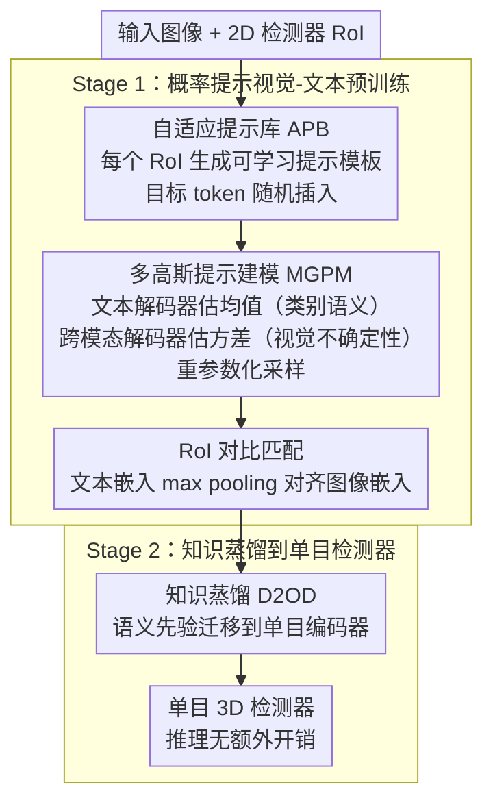

# VirPro: Visual-referred Probabilistic Prompt Learning for Weakly-Supervised Monocular 3D Detection

**会议**: CVPR 2026 Findings  
**arXiv**: [2603.17470](https://arxiv.org/abs/2603.17470)  
**代码**: 待确认  
**领域**: 3D视觉  
**关键词**: 弱监督单目3D检测, 概率提示学习, 多模态预训练, 视觉-语言对齐, CLIP

## 一句话总结

提出 VirPro——一种自适应多模态预训练范式，通过视觉引导的概率提示（Adaptive Prompt Bank + Multi-Gaussian Prompt Modeling）为弱监督单目3D检测提供场景感知的语义监督信号，可无缝集成到现有 WS-M3D 框架中，在 KITTI 上最高带来 4.8% AP 提升。

## 背景与动机

单目3D目标检测因缺乏显式深度信息而严重依赖昂贵的3D标注。现有弱监督方法主要包括三条路线：

1. **伪3D标签生成**：利用2D框与LiDAR点云对齐生成3D伪标签
2. **3D知识蒸馏**：从强模型向单目检测器迁移知识
3. **文本-视觉对齐**：借鉴 CLIP 思想，用确定性文本描述作为辅助弱监督信号

以 CAW3D 为代表的方法采用**手工设计的静态文本 prompt**（如 "a photo of a car"）作为弱监督，但这种**确定性的、场景无关的**文本描述无法捕捉不同场景中物体外观和空间位置的视觉多样性，限制了模型学习场景感知表征的能力。

**核心洞察**：如果能让 prompt 自适应地反映跨场景视觉多样性，就能在不需要额外人工标注的情况下实现更鲁棒的场景感知表征。

## 核心问题

如何设计能够拥抱跨场景视觉多样性的 prompt 监督信号，从而在无额外手工标注的前提下实现鲁棒的场景感知表征？

## 方法详解

### 整体框架

VirPro 要解决的是弱监督单目 3D 检测里一个具体痛点：像 CAW3D 那样用手工写死的静态文本（"a photo of a car"）当弱监督，无法表达不同场景里物体外观与空间位置的视觉多样性。整套方法是**两阶段**的：Stage 1 用一组可学习的概率提示做视觉-文本预训练对齐，把"场景感知"的语义先验学进 prompt 的分布里；Stage 2 再用知识蒸馏把这套先验迁移到单目编码器，推理时不增加任何开销。预训练内部的数据流是：每个目标 RoI 先生成一批可学习提示模板（APB）→ 把每个模板建成一个高斯分布并采样出多样化嵌入（MGPM）→ 在 RoI 级别做图文对比对齐。

### 关键设计

**1. 自适应提示库 APB：让 prompt 自己学、还随机换位置**

单一类别 prompt 不足以覆盖弱监督场景下的多样上下文，所以 VirPro 不再写死文本，而是为第 $i$ 个目标查询 token $o_i$ 生成 $N_p$ 个概率提示模板 $p_i^t = \{a_1^t, a_2^t, \ldots, a_L^t \mid o_i\}$，其中 $\{a_1^t, \ldots, a_L^t\}$ 是 $L$ 个随机初始化、随训练联合优化的**可学习场景描述子**。多个互补模板能提供互补语义线索，增强语言-视觉对齐。

与 ProDA 把目标 token 固定放在开头/中间/末尾不同，APB 允许目标相关 token 在模板里**随机插入**，逼模型去捕获更鲁棒的上下文关联——这在标注稀缺的弱监督下尤为关键。实现上每个 RoI 初始化 32 个可学习 prompt，随机采样其中 8 个并归一化，形成该 RoI 专属的文本嵌入。

**2. 多高斯提示建模 MGPM：均值管语义、方差管视觉不确定性**

光有可学习模板还是确定性的，无法表达"同一类物体在不同场景里长得不一样"这种不确定性。MGPM 把每个场景 prompt 建成一个独立的各向同性高斯分布 $\mathcal{P}(z_i^{(1:N_p)} \mid p_i) \sim \{\mathcal{N}(\boldsymbol{\mu}_i^{(t)}, (\boldsymbol{\sigma}_i^{(t)})^2 \mathbf{I})\}_{t=1}^{N_p}$，从而把语义稳定性和视觉变化解耦开。

关键在于均值和方差由两个不同来源估计：**文本提示解码器**只在 prompt 集合内部做自注意力得到均值 $\mu_i^t = \phi_\mu(q_i^t) + \text{SelfAttn}_\mu(q_i^t; P_i)$，捕获规范类别语义；**跨模态视觉-文本解码器**则从视觉-语言特征 $F$ 交叉注意力注入方差 $\sigma_i^t = \phi_\sigma(q_i^t) + \text{CrossAttn}_\sigma(q_i^t; F)$，让方差表达视觉不确定性。这样 prompt 既稳住了类别语义，又能随场景的视觉变化调整。每个场景再用重参数化技巧采样 $N_s$ 个样本 $\hat{z}_{i,j}^{(t)} = \boldsymbol{\mu}_i^{(t)} + \boldsymbol{\sigma}_i^{(t)} \odot \boldsymbol{\epsilon},\ \boldsymbol{\epsilon} \sim \mathcal{N}(\mathbf{0}, \mathbf{I})$，保证整条链路端到端可微。

**3. RoI 对比匹配：场景内一致、场景间可分**

预训练要把上面学到的文本分布和视觉特征对齐起来。VirPro 对采样得到的 prompt 分布 $\hat{z}_{i,j}^{(t)}$ 做 **max pooling** 得到文本嵌入 $\mathbf{e}_i^{\text{txt}}$，与单目 3D 编码器提取、并和 2D 检测器空间对齐的图像嵌入 $\mathbf{e}_i^{\text{img}}$ 构成正样本对，做目标级对比学习 $\mathcal{L}_{\text{contrast}} = \frac{1}{N}\sum_{i=1}^N \ell_i$。每场景随机选 4 个 RoI 构建对比对，温度初始化 $\tau=0.07$。这样同一场景里的所有目标共享一致的全局上下文，又能与别的场景目标区分开。值得一提的是消融里无参数的 max pooling 反而比 MLP 融合更好，符合"less is more"。

### 损失函数 / 训练策略

概率提示学习损失由两块组成：一是基于正交性的**多样性损失** $\mathcal{L}_{\text{div}} = \frac{1}{K}\sum_{i=1}^K \|\tilde{P}_i \tilde{P}_i^\top - \mathbf{I}\|_2^2$，逼不同场景 prompt 语义分化；二是 **KL 散度正则**防止方差坍塌，把 prompt 分布约束向标准高斯先验，合起来即 $\mathcal{L}_{\text{prompt}} = \mathcal{L}_{\text{div}} + \frac{1}{N_p}\sum_{t=1}^{N_p}\text{KL}(\mathcal{P}(\hat{\boldsymbol{z}}_i^{(t)} \mid p_i^{(t)}) \| \mathcal{N}(\mathbf{0}, \mathbf{I}))$。

两阶段目标分别是 $\mathcal{L}_{\text{stage1}} = \mathcal{L}_{\text{contrast}} + \alpha \mathcal{L}_{\text{prompt}}$（概率提示学习 + RoI 对比对齐）和 $\mathcal{L}_{\text{stage2}} = \mathcal{L}_{\text{mse}} + \lambda \mathcal{L}_{3D}$（知识蒸馏 MSE + 伪标签 3D 监督）。Stage 2 沿用 CAW3D 的 Dual-to-One Distillation (D2OD)，不引入额外推理开销。

## 实验关键数据

### KITTI Val Set（Car 类别，AP @ IoU=0.5，$R_{40}$）

| 方法 | 监督类型 | $\text{AP}_{\text{BEV}}$ Easy | $\text{AP}_{\text{BEV}}$ Mod | $\text{AP}_{\text{BEV}}$ Hard | $\text{AP}_{\text{3D}}$ Easy | $\text{AP}_{\text{3D}}$ Mod | $\text{AP}_{\text{3D}}$ Hard |
|------|----------|------|------|------|------|------|------|
| WeakM3D | 弱(无2D GT) | 58.20 | 38.02 | 30.17 | 50.16 | 29.94 | 23.11 |
| **VirPro+WeakM3D** | - | **55.09** | **38.76** | **31.12** | **50.97** | **31.95** | **24.27** |
| GGA+PGD | 弱(有2D GT) | 57.20 | 40.11 | 34.96 | 51.48 | 35.73 | 30.49 |
| **VirPro+GGA+PGD** | - | **60.11** | **42.95** | **37.50** | **54.72** | **39.49** | **33.32** |

VirPro+GGA+PGD 较 GGA+PGD 在 Moderate 上提升 **+3.76 $\text{AP}_{\text{3D}}$**，在 Hard 上提升 **+2.83 $\text{AP}_{\text{3D}}$**。

### KITTI Test Set（Car 类别）

| 方法 | $\text{AP}_{\text{BEV}}$ Easy | Mod | Hard | $\text{AP}_{\text{3D}}$ Easy | Mod | Hard |
|------|------|------|------|------|------|------|
| WeakM3D | 11.82 | 5.66 | 4.08 | 5.03 | 2.26 | 1.63 |
| **VirPro+WeakM3D** | **12.23** | **5.92** | **4.33** | **5.41** | **2.52** | **1.81** |
| GGA+PGD | 14.87 | 9.26 | 7.09 | 7.09 | 4.27 | 3.26 |
| **VirPro+GGA+PGD** | **15.59** | **9.58** | **7.29** | **7.95** | **4.96** | **3.64** |

### 消融实验亮点

- **Prompt 设计**：多概率 prompt (M.P.P) > 单概率 prompt (S.P.P) > 手工 prompt (H.C.P)
- **Prompt 融合策略**：Max pooling 显著优于 MLP / Concat+MLP / Add，$\text{AP}_{\text{3D}}$ Hard 领先 1.15+
- **图像-文本融合策略**：Cross-attention 最优（$\text{AP}_{\text{3D}}$ Hard 25.05），远超 Add（22.37）和 Concat（21.88）
- **隐空间结构**：VirPro 的 Calinski-Harabasz 和 Silhouette 指标均优于 CAW3D，表明 RoI 嵌入场景内更紧凑、场景间更可分

## 亮点

1. **即插即用**：VirPro 作为预训练范式可无缝集成到多种 WS-M3D 框架（WeakM3D、GGA+PGD 等），不增加推理开销
2. **概率建模视觉不确定性**：均值捕获规范语义、方差编码视觉不确定性的解耦设计很优雅
3. **Max pooling 融合的简洁性**：对概率 prompt 用无参数的 max pooling 反而优于复杂的 MLP 融合，符合 "less is more" 设计哲学
4. **隐空间可视化验证**：通过场景间质心距离分布和聚类指标，定量展示了概率 prompt 对隐空间结构的改善

## 局限与展望

1. **RoI 质量瓶颈**：概率 prompt 质量受限于2D检测器的 RoI 准确度，当2D检测不准时视觉线索有偏
2. **矩形框假设**：使用矩形框裁剪 RoI 特征不可避免引入背景噪声，真实物体很少是完美矩形
3. **固定分辨率限制**：RoI 特征提取受固定图像分辨率和预定义裁剪策略约束，跨域鲁棒性受限
4. **仅在 KITTI 验证**：作者仅在 KITTI 上做了实验，泛化到 nuScenes 等更大规模数据集上的效果未知
5. **计算开销**：两阶段训练且 Stage 1 需 25 epoch 预训练，与端到端方法相比训练成本更高

## 与相关工作的对比

- **vs CAW3D**：CAW3D 使用手工设计的静态 prompt，VirPro 用可学习的概率 prompt 替代，提供更丰富的场景感知语义
- **vs ProDA**：ProDA 首次在输出空间建模 prompt 为多变量高斯，但面向零样本分类；VirPro 聚焦 RoI 级别个体化建模，为弱监督3D检测量身定制
- **vs APP**：APP 在输入空间建模 prompt 不确定性，受自然语言稀疏性限制；VirPro 在输出空间并注入视觉特征
- **vs GGA**：GGA 使用 LLM 生成的静态文本 prompt；VirPro 用视觉引导的概率 prompt 更具适应性

## 启发与关联

- 概率建模 prompt 的思路可推广到其他需要弱监督的视觉任务（如弱监督语义分割、弱监督实例分割）
- "均值=语义 + 方差=视觉不确定性" 的解耦思想在多模态学习中有广泛适用性
- 场景感知的对比学习设计可迁移到自动驾驶中的其他3D感知任务

## 评分

- 新颖性: ⭐⭐⭐⭐ — 概率 prompt 建模 + 视觉引导方差的设计新颖，将概率提示学习引入弱监督3D检测属首创
- 实验充分度: ⭐⭐⭐ — 消融充分但仅 KITTI 一个数据集，缺少 nuScenes 和 Waymo 验证
- 写作质量: ⭐⭐⭐⭐ — 公式推导清晰，图示直观，整体逻辑流畅
- 价值: ⭐⭐⭐⭐ — 即插即用的预训练范式实用性强，但受限于弱监督3D检测这一相对小众方向

<!-- RELATED:START -->

## 相关论文

- [\[CVPR 2026\] Rewis3d: Reconstruction Improves Weakly-Supervised Semantic Segmentation](rewis3d_reconstruction_improves_weaklysupervised_s.md)
- [\[ECCV 2024\] TCC-Det: Temporarily Consistent Cues for Weakly-Supervised 3D Detection](../../ECCV2024/3d_vision/tcc-det_temporarily_consistent_cues_for_weakly-supervised_3d_detection.md)
- [\[AAAI 2026\] VPN: Visual Prompt Navigation](../../AAAI2026/3d_vision/vpn_visual_prompt_navigation.md)
- [\[CVPR 2026\] Towards Intrinsic-Aware Monocular 3D Object Detection](towards_intrinsic-aware_monocular_3d_object_detection.md)
- [\[CVPR 2026\] UniPixie: Unified and Probabilistic 3D Physics Learning via Flow Matching](unipixie_unified_and_probabilistic_3d_physics_learning_via_flow_matching.md)

<!-- RELATED:END -->
