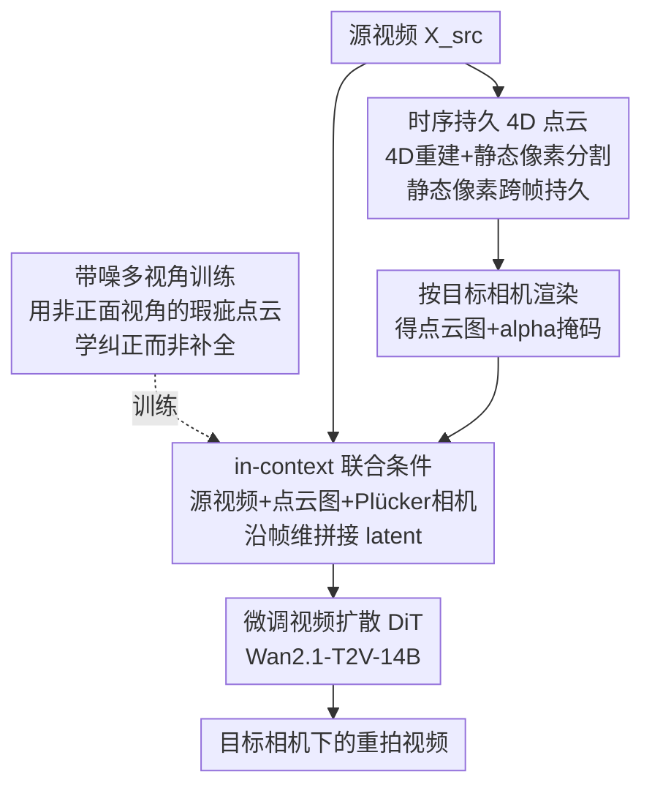

# Vista4D: Video Reshooting with 4D Point Clouds

**会议**: CVPR 2026  
**arXiv**: [2604.21915](https://arxiv.org/abs/2604.21915)  
**代码**: https://eyeline-labs.github.io/Vista4D (项目主页)  
**领域**: 3D视觉 / 4D重建 / 视频生成  
**关键词**: 视频重拍, 4D点云, 新视角视频合成, 相机控制, 视频扩散模型

## 一句话总结
Vista4D 把输入视频升维成一个"静态像素时序持久"的 4D 点云，再从用户指定的目标相机渲染点云、与源视频一起塞进微调过的视频扩散模型里，从而在保留原场景动态的前提下"换个机位重新拍一遍"，并通过用带噪多视角数据训练让模型对真实世界 4D 重建瑕疵鲁棒。

## 研究背景与动机

**领域现状**：视频重拍（video reshooting）要做的是：给一段单目源视频，在保持原场景动态不变的同时，从一条全新的相机轨迹/视角把它"重新渲染"出来——既要忠实复现已见内容，又要在未见区域生成合理像素，还要严格服从用户给定的相机控制。目前主流做法是用视频扩散模型当生成先验，再配一个显式几何先验：把源视频用深度估计逐帧抬升成相机坐标系下的 3D 点云，渲染到目标相机后作为 condition 喂给扩散模型（TrajectoryCrafter、GEN3C、EX-4D 等）。

**现有痛点**：这类"逐帧点云条件"的方法有两个硬伤。其一，它们大多在**精确深度图**渲染出的干净点云上训练，本质上把重拍简化成了"补全被遮挡区域（inpainting）"；可真实世界动态视频的 4D 重建并不精确，目标相机一旦偏离点云的正面视角，渲染出的点云就会出现几何畸变和时序闪烁，而模型从没见过这种瑕疵，自然崩坏。其二，逐帧点云只在当前帧可见，当目标相机轨迹和源视频逐帧重叠很少（大幅环绕、拉远）时，既保不住已见内容、也丢失了相机控制所需的信号。

**核心矛盾**：显式先验（点云）能给出精确的相机预览，但脆弱、对重建质量敏感；隐式先验（相机 embedding、参考视频）鲁棒但相机控制不精确、无法"预览"。现有方法二选一，都没解决"如何用一个对真实重建瑕疵鲁棒、又能在低重叠轨迹下保住内容和相机控制的显式表征"。

**本文目标**：(1) 造一个能跨帧持久保留已见内容、并在低重叠相机下仍提供丰富相机信号的 4D 表征；(2) 让模型学会"纠正"而非"回避"点云瑕疵，从而在真实推理中鲁棒；(3) 把能力外延到视频重拍之外的应用。

**核心 idea**：把源视频和目标相机**共同锚定在一个 4D 点云**里——用分割让静态像素时序持久、用带瑕疵的多视角重建数据训练，让视频扩散模型从"补全"升级成"纠正几何"。

## 方法详解

### 整体框架
给定源视频 $\mathbf{X}^{\mathrm{src}}$，Vista4D 分三步把它"重拍"成目标相机下的视频。第一步，用 4D 重建拿到源视频的深度、内参、外参，再用分割得到静态像素掩码，把视频抬升成世界坐标系点云并让静态像素跨帧持久，得到**时序持久 4D 点云** $\overline{\mathbf{P}}$。第二步，从用户定义的目标相机渲染 $\overline{\mathbf{P}}$，得到点云渲染图 $\mathbf{X}^{\mathrm{src\to tgt}}$ 和 alpha 掩码 $\mathbf{M}^{\mathrm{src\to tgt}}$，作为时序持久、4D 锚定的几何/相机先验。第三步，把源视频、点云渲染图、alpha 掩码和目标相机（Plücker 编码）**一起 in-context 拼接**送进微调过的视频扩散 Transformer（基于 Wan2.1-T2V-14B），生成目标相机下、动态一致的输出视频。

关键不在于这条 pipeline 本身，而在于两个使它"在真实世界能用"的决策：训练时**故意喂带瑕疵的多视角重建点云**（而非干净的双重投影点云），让模型学会纠正几何；条件注入时**把源视频和点云渲染一起 in-context 拼接**，让模型既能从点云读相机、又能从源视频读外观，互相补位。

### 关键设计

**1. 时序持久 4D 点云：让静态内容"任意帧可见"，为低重叠轨迹保住相机信号**

逐帧 3D 点云只在当前帧可见，目标相机一旦和源视频逐帧重叠很少，就既保不住已见内容也丢失相机控制信号。Vista4D 的做法是把点云锚定在世界坐标系：先用 4D 重建（π³ / STream3R）得到深度 $\mathbf{D}^{\mathrm{src}}$、内参 $\mathbf{K}^{\mathrm{src}}$、外参 $\mathbf{T}^{\mathrm{src}}$，把视频抬升成世界坐标点云
$$\mathbf{P}=\Omega\left(\Phi^{-1}\left([\mathbf{X}^{\mathrm{src}},\mathbf{D}^{\mathrm{src}}],\mathbf{K}^{\mathrm{src}}\right),\mathbf{T}^{\mathrm{src}}\right),$$
其中 $\Phi^{-1}$ 是逆透视投影、$\Omega$ 是世界坐标变换。然后关键一步：用静态像素掩码 $\mathbf{M}^{\mathrm{stc}}$（由 RAM 取语义类、Llama-3.1 过滤出动态主体名词、Grounded SAM 2 分割动态像素再取反得到）把**静态像素在所有帧都保留下来**，得到时序持久点云 $\overline{\mathbf{P}}$。这样从任意目标相机渲染时，背景/静态结构都"任意帧可见"，既显式保住了已见内容，又在目标相机和源视频几乎不重叠时仍能提供丰富相机信号——这是它区别于 baseline 逐帧点云的根本。

**2. 带噪多视角训练：从"补全"升级为"纠正几何"**

这是全文最核心的洞察。已有方法（TrajectoryCrafter 等）用**双重投影**造训练对：先把目标视频点云渲到源相机、再渲回目标相机制造遮挡区，这样深度图始终是从它的**正面、无瑕疵视角**被观看的，模型只学到了"补全被遮挡区"，从没见过真实推理时那种非正面视角的几何畸变。Vista4D 反其道而行：用**带 4D 重建瑕疵的动态多视角视频对**训练——源视频建时序持久点云、目标视频定义目标相机，由于目标相机偏离正面视角，渲染出的点云会出现和目标视频空间错位的真实瑕疵（尤其动态像素，深度估计器无法利用多视角几何约束）。于是模型被迫学会**纠正不完美的点云几何**，而不是把它当 ground-truth 去补全。由于真实多视角动态数据稀缺，作者用合成多视角数据（MultiCamVideo）+ 真实单目数据（OpenVidHD 子集，仍走双重投影）混合训练，兼顾鲁棒性和对真实输入的泛化。这一设计直接换来了对真实点云渲染质量的鲁棒，也是后续"4D 场景重组""动态场景扩展"等应用的基础——因为模型已经习惯了被编辑过的、不完美的点云。

**3. in-context 联合条件：源视频与点云互相补位**

真实推理时点云瑕疵不仅破坏几何、也破坏了源视频的外观信息。一些方法只在点云渲染上做条件，外观一旦被瑕疵污染就无从恢复。Vista4D 选择**同时**条件于源视频和点云渲染：点云给精确相机/几何、源视频给外观和时序连贯先验，二者互补。具体注入方式上，它**不**用 TrajectoryCrafter 的 cross-attention 注入，而是把源视频和点云渲染的 patch 化 latent token **沿帧维度与带噪目标 latent 直接拼接（in-context）**——消融显示这种 in-context 条件最能保住源视频内容、对点云瑕疵最鲁棒。训练目标是 flow matching：
$$\mathcal{L}=\left\lVert\boldsymbol{\epsilon}_{\theta}\left(\mathbf{X}^{\mathrm{tgt}}_{t},\mathbf{X}^{\mathrm{src\to tgt}},\mathbf{M}^{\mathrm{src\to tgt}},\mathbf{X}^{\mathrm{src}},\mathbf{C}^{\mathrm{tgt}},t\right)-\mathbf{V}\right\rVert,$$
其中 $\mathbf{V}=\mathbf{X}^{\mathrm{tgt}}-\boldsymbol{\epsilon}$、$\mathbf{X}^{\mathrm{tgt}}_{t}$ 是 $t$ 时刻的带噪目标视频。目标相机 $\mathbf{C}^{\mathrm{tgt}}$ 以 **Plücker embedding** 经零初始化线性投影注入，并在 self-attention 后接一个恒等初始化投影（借鉴 ReCamMaster）。对于没有真值 $\mathbf{X}^{\mathrm{src}}$ 的单目训练视频，则用双重投影得到的 $\mathbf{X}^{\mathrm{tgt\to src}}$ 当"被遮挡的源视频"配 alpha 掩码，仍让模型学到这种几何/外观传播能力。

### 损失函数 / 训练策略
基座是 Wan2.1-T2V-14B（flow matching 视频 DiT）。先在 $672\times384$ 训 30,000 步，再在 $1280\times720$ 训 300 步，均为 49 帧、global batch 8、AdamW、lr $1\times10^{-5}$。只训练 $\mathbf{X}^{\mathrm{src}}$ 与 $\mathbf{X}^{\mathrm{src\to tgt}}$ 的 patchify 层、self-attention 层、相机编码器与投影器，其余参数冻结。数据：合成多视角用 MultiCamVideo（STream3R 做 4D 重建）；真实单目用 OpenVidHD-0.4M 的 60K 子集（π³ 做 4D 重建）。

## 实验关键数据

### 主实验

**相机控制精度与 3D 一致性**（110 个视频-相机对，RE@SG 为 SuperGlue 下逐帧重投影误差，越低越好）：

| 方法 | 平移误差↓ | 旋转误差↓ | 内参误差↓ | RE@SG↓ |
|------|-----------|-----------|-----------|--------|
| ReCamMaster（隐式） | 1.574 | 12.79 | 11.16 | 23.66 |
| CamCloneMaster（隐式） | 2.132 | 23.77 | 6.422 | 23.38 |
| TrajectoryCrafter（点云） | 1.434 | 6.838 | 6.671 | 120.5 |
| EX-4D（点云） | 1.325 | 5.941 | 5.182 | 13.11 |
| GEN3C（点云） | 1.309 | 4.751 | 5.085 | 12.99 |
| **Vista4D（本文）** | **1.251** | **4.647** | **4.927** | **7.504** |

Vista4D 在四项指标全部最优，RE@SG 几乎是次优的一半，说明输出几何在真实带噪 4D 重建下仍最自洽。

**新视角视频合成**（iphone 数据集；m 前缀为 masked 指标，EPE 为光流端点误差衡量运动重建）：

| 方法 | mPSNR↑ | mLPIPS↓ | PSNR↑ | LPIPS↓ | EPE↓ |
|------|--------|---------|-------|--------|------|
| TrajectoryCrafter | 13.82 | 0.569 | 13.06 | 0.656 | 2.375 |
| EX-4D | 12.85 | 0.596 | 12.64 | 0.669 | 4.269 |
| GEN3C | 12.19 | 0.608 | 12.06 | 0.679 | 3.019 |
| **Vista4D** | **14.09** | **0.461** | **14.14** | **0.514** | **1.142** |

PSNR/LPIPS 最优、EPE 大幅领先（运动保留最好）；SSIM 略逊 TrajectoryCrafter，但作者指出后者输出有 SSIM 抓不到的明显瑕疵。

**视频保真度 & 用户研究**（FID/FVD/VBench；用户研究为 42 名参与者在 30 对上的偏好率）：Vista4D 在所有点云条件 baseline 上的 aesthetic/imaging quality、human anatomy 等领先（CLIP-T 0.326 最高）；隐式方法 FID/FVD 看似更好只是因为它们相机控制差、输出几乎不动机位。用户研究中 Vista4D 在源内容保留（67.06%）、相机精度（68.17%）、整体保真（77.38%）三项均以巨大优势获选。

### 消融实验
消融围绕"数据"和"条件方式"两条线，组合以下选项：① 无深度瑕疵（始终双重投影）、② 无源视频条件、③ cross-attention 注入源视频、④ 无时序持久：

| 配置 | 影响 |
|------|------|
| Full（带瑕疵训练 + in-context 源视频） | 对空间瑕疵（非正面视角的不精确深度）和时序瑕疵（抖动深度）都鲁棒 |
| 无深度瑕疵（始终双重投影） | 退化为 inpainting，真实推理时无法纠正点云几何 |
| 无源视频 / cross-attention 注入 | 内容保留与鲁棒性下降，in-context 拼接最优 |
| 无时序持久 | 源视频与目标相机低重叠时，静态内容保留和相机控制精度双双下降 |

### 关键发现
- **"带瑕疵训练 + in-context 源视频"是鲁棒性的来源**：二者缺一，模型就退回"补全"心智、在真实点云瑕疵下崩坏。
- **时序持久专治低重叠轨迹**：去掉后大幅环绕/拉远的相机轨迹既保不住背景也控不准机位。
- **对分割失败鲁棒**：故意不把网球拍分割成动态像素制造点云拖影，模型仍能借 in-context 源视频纠正——因为它本来就学的是"纠正瑕疵"。

## 亮点与洞察
- **训练分布的重定义比模型结构更重要**：本文最"啊哈"的点是——它没改网络，而是把训练数据从"干净点云（正面视角）"换成"带真实瑕疵的多视角点云"，就把任务从 inpainting 升级成 geometry correction。这提示：当一个生成模型在真实世界崩坏，往往是训练分布回避了真实瑕疵，而非容量不够。
- **显式+隐式先验融合的工程化**：用时序持久点云做显式相机预览、用 in-context 源视频做隐式外观/连贯先验，二者沿帧维拼接，巧妙地各取所长又规避了各自短板。
- **一个表征支撑多种应用**：因为模型习惯了"被编辑的不完美点云"，直接编辑 4D 点云就能做 4D 场景重组（插入/删除/复制主体，甚至把阳光下的犀牛插进阴天场景还能自然融合光照）、动态场景扩展（联合重建额外采集帧降低幻觉）、长视频分块推理+点云记忆。这种"训练副产物变能力"很值得迁移。

## 局限与展望
- **作者承认**：缺少让用户控制"多大程度跟随点云 vs 多大程度依赖视频先验纠正几何"的旋钮；展望是加一个在显式先验（点云）与隐式先验（源视频+相机 embedding）之间"插值"的可控机制。
- **依赖上游 4D 重建与分割**：虽对瑕疵鲁棒，但整条 pipeline 仍建立在 π³/STream3R 的 4D 重建和 Grounded SAM 2 分割之上，重建/分割彻底失败时仍可能影响相机信号质量。
- **评估指标的 caveat**：隐式方法因相机几乎不动而在 FID/FVD 上"虚高"，说明这些保真度指标在相机控制任务上需谨慎解读，不能脱离相机精度单看。
- **计算成本**：基座 14B 视频 DiT、需 4D 重建+分割预处理，长视频还要自回归分块，实际开销不低。

## 相关工作与启发
- **vs TrajectoryCrafter**：同样从单目视频造训练对，但它用双重投影只看正面无瑕疵深度图、退化为 inpainting，且用 cross-attention 注入源视频；Vista4D 用带瑕疵多视角数据学纠正几何、用 in-context 拼接注入源视频，鲁棒性与内容保留更强。
- **vs GEN3C / EX-4D**：都是点云显式先验，但训练在精确深度上、用逐帧点云，难以应对非正面视角瑕疵和低重叠轨迹；Vista4D 的时序持久点云 + 带噪训练显著改善 3D 一致性（RE@SG 7.5 vs 13）。
- **vs ReCamMaster / CamCloneMaster（隐式先验）**：它们用相机 embedding/参考视频，鲁棒但相机控制不精确、无法预览；Vista4D 保留点云的精确可预览相机控制，同时借源视频条件吸收了隐式方法的鲁棒优点。

## 评分
- 新颖性: ⭐⭐⭐⭐⭐ "带瑕疵多视角训练 + 时序持久 4D 点云 + in-context 源视频条件"三者组合，把重拍从补全重定义为几何纠正，思路新颖且打通多种应用。
- 实验充分度: ⭐⭐⭐⭐⭐ 三维度量化（相机/NVS/保真）+ 用户研究 + 多组消融 + 分割失败鲁棒性测试，对照 5 个 SOTA baseline。
- 写作质量: ⭐⭐⭐⭐ 动机与设计逻辑清晰、图示到位；部分关键消融与架构细节放在附录，正文略简。
- 价值: ⭐⭐⭐⭐⭐ 直击真实世界动态视频重拍的鲁棒性痛点，且一套表征外延到 4D 场景重组/扩展/长视频记忆，影视后期价值明显。

<!-- RELATED:START -->

## 相关论文

- [\[CVPR 2026\] V-DPM: 4D Video Reconstruction with Dynamic Point Maps](v-dpm_4d_video_reconstruction_with_dynamic_point_maps.md)
- [\[CVPR 2026\] 3D sans 3D Scans: Scalable Pre-training from Video-Generated Point Clouds](3d_sans_3d_scans_scalable_pre-training_from_video-generated_point_clouds.md)
- [\[CVPR 2026\] STS-Mixer: Spatio-Temporal-Spectral Mixer for 4D Point Cloud Video Understanding](sts_mixer_4d_point_cloud.md)
- [\[CVPR 2026\] mmWaveFlow: Unified Enhancement and Generation of mmWave Human Point Clouds](mmwaveflow_unified_enhancement_and_generation_of_mmwave_human_point_clouds.md)
- [\[CVPR 2026\] Ghosts in the Point Clouds: De-glaring LiDAR in the Transient Domain](ghosts_in_the_point_clouds_de-glaring_lidar_in_the_transient_domain.md)

<!-- RELATED:END -->
